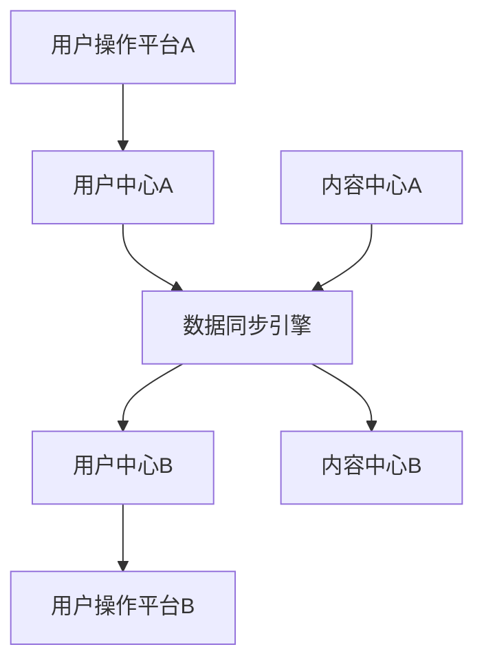

                 

 在当今数字时代，知识付费已经成为一个越来越受欢迎的商业模式。从在线教育、专业培训到专业咨询服务，知识付费平台在为用户带来便利的同时，也为内容创作者和平台运营者创造了巨大的商业价值。然而，随着市场的不断扩大和用户需求的日益多样化，如何实现知识付费平台的跨平台用户迁移与共享成为一个关键问题。

本文将围绕以下核心问题展开讨论：

1. 跨平台用户迁移与共享的重要性
2. 现有的解决方案及其不足
3. 新的解决方案与技术原理
4. 实际操作步骤与案例
5. 未来展望与挑战

本文旨在为知识付费平台运营者、开发者和技术人员提供一个全面的指南，帮助他们实现用户资源的最大化利用和商业价值的最大化。

## 1. 背景介绍

### 知识付费的定义与发展

知识付费，即通过付费方式获取专业知识和技能，是近年来迅速兴起的一种商业模式。它不仅涵盖了传统的教育、培训，还包括了专业咨询服务、在线课程、电子书等多种形式。知识付费平台通过提供高质量的内容和服务，满足了用户在各个领域的学习和成长需求。

知识付费的发展离不开几个关键因素：

- **互联网技术的普及**：互联网技术的飞速发展，特别是移动网络的普及，使得知识付费平台能够便捷地触达全球用户。
- **用户需求的变化**：随着社会经济的发展，人们越来越注重个人成长和职业发展，对于专业知识和技能的需求日益增加。
- **内容创作的多样化**：随着内容创作门槛的降低，越来越多的专业人才和领域专家开始参与到知识付费平台的内容创作中，丰富了内容种类和数量。

### 跨平台用户迁移与共享的重要性

在知识付费市场中，用户迁移与共享具有重要意义：

- **用户留存**：跨平台用户迁移能够帮助知识付费平台吸引更多新用户，同时提高现有用户的留存率。
- **资源最大化利用**：通过用户共享，知识付费平台可以实现资源的最优化配置，提高内容利用率。
- **商业价值最大化**：跨平台用户迁移与共享能够扩大用户规模，增加平台收入，从而实现商业价值最大化。

然而，现有的解决方案在实现跨平台用户迁移与共享方面存在诸多不足，这为新的解决方案和技术创新提供了契机。

## 2. 核心概念与联系

### 跨平台用户迁移与共享的概念

**跨平台用户迁移**是指用户在从一个知识付费平台转移到另一个平台的操作过程，包括用户账户迁移、学习记录迁移等。

**用户共享**是指多个用户在同一知识付费平台或不同平台之间共享学习资源、经验等，从而实现知识的传播和共同进步。

### 跨平台用户迁移与共享的架构

为了实现跨平台用户迁移与共享，我们需要构建一个分布式架构，该架构包括以下几个关键组件：

- **用户中心**：负责用户账户信息的管理，包括用户身份、学习记录等。
- **内容中心**：负责知识付费内容的存储、分类和管理。
- **数据同步引擎**：负责不同平台之间的数据同步和更新。
- **共享机制**：实现用户之间资源的共享和传播。

### Mermaid 流程图

以下是一个简化的 Mermaid 流程图，展示了跨平台用户迁移与共享的基本流程：



### 关键环节解释

- **用户中心**：用户中心是整个架构的核心，负责管理用户的身份信息和学习记录。当用户迁移到另一个平台时，用户中心需要将相关信息同步到目标平台。
- **数据同步引擎**：数据同步引擎负责将用户和内容数据从源平台同步到目标平台。它需要实现高效的数据传输和数据一致性保障。
- **内容中心**：内容中心负责知识付费内容的存储和管理。通过内容中心的架构，用户可以在不同平台之间共享和传播知识资源。

通过上述核心概念和架构的描述，我们可以更好地理解跨平台用户迁移与共享的实现原理和关键技术。

## 3. 核心算法原理 & 具体操作步骤

### 3.1 算法原理概述

实现跨平台用户迁移与共享的核心算法主要包括用户账户迁移算法和内容共享算法。以下将分别介绍这两个算法的基本原理。

**用户账户迁移算法**：该算法的主要任务是确保用户在迁移过程中，其账户信息（如用户名、密码、学习记录等）能够在不同平台之间无缝同步。具体步骤如下：

1. **用户身份验证**：在用户迁移前，需要验证用户的身份，确保其有权进行迁移操作。
2. **数据提取**：从源平台提取用户的账户信息，包括用户名、密码、学习记录等。
3. **数据清洗**：对提取的数据进行清洗，确保数据的完整性和一致性。
4. **数据同步**：将清洗后的数据同步到目标平台，并更新目标平台上的用户信息。

**内容共享算法**：该算法的主要任务是实现用户在不同平台之间共享知识资源。具体步骤如下：

1. **内容识别**：识别用户需要共享的内容，如课程、学习笔记、问答记录等。
2. **权限管理**：根据用户权限，确定哪些内容可以被共享，哪些内容需要保密。
3. **数据加密**：对共享内容进行加密，确保数据在传输过程中的安全性。
4. **数据同步**：将加密后的共享内容同步到目标平台，并更新目标平台上的内容库。

### 3.2 算法步骤详解

**用户账户迁移算法步骤详解**：

1. **用户身份验证**：

   - 输入：用户提供的身份验证信息（如用户名、密码）。
   - 输出：验证结果（通过或拒绝）。
   - 算法描述：使用加密算法（如SHA-256）对用户输入的身份验证信息进行加密，并与源平台上的存储信息进行比对。若一致，则验证通过。

2. **数据提取**：

   - 输入：用户身份验证结果（通过）。
   - 输出：用户的账户信息（包括用户名、密码、学习记录等）。
   - 算法描述：根据用户身份验证结果，从源平台数据库中提取用户的账户信息。

3. **数据清洗**：

   - 输入：用户的账户信息。
   - 输出：清洗后的用户账户信息。
   - 算法描述：对提取的账户信息进行格式化处理，确保数据的完整性和一致性。例如，删除重复记录、修正错误信息等。

4. **数据同步**：

   - 输入：清洗后的用户账户信息。
   - 输出：目标平台上的用户账户信息。
   - 算法描述：将清洗后的账户信息同步到目标平台数据库，并更新目标平台上的用户信息。

**内容共享算法步骤详解**：

1. **内容识别**：

   - 输入：用户共享请求。
   - 输出：需要共享的内容。
   - 算法描述：根据用户共享请求，识别需要共享的内容，如课程、学习笔记、问答记录等。

2. **权限管理**：

   - 输入：用户共享请求和用户权限。
   - 输出：允许共享的内容。
   - 算法描述：根据用户权限，确定哪些内容可以被共享，哪些内容需要保密。例如，管理员可以共享所有内容，普通用户只能共享自己的学习笔记。

3. **数据加密**：

   - 输入：需要共享的内容。
   - 输出：加密后的内容。
   - 算法描述：使用加密算法（如AES）对共享内容进行加密，确保数据在传输过程中的安全性。

4. **数据同步**：

   - 输入：加密后的共享内容。
   - 输出：目标平台上的共享内容。
   - 算法描述：将加密后的共享内容同步到目标平台，并更新目标平台上的内容库。

### 3.3 算法优缺点

**用户账户迁移算法优缺点**：

- 优点：
  - 确保用户迁移过程中的数据完整性和一致性。
  - 提高用户迁移的效率，减少迁移时间。

- 缺点：
  - 可能会导致源平台和目标平台之间的数据不一致。
  - 需要消耗一定的计算资源和网络带宽。

**内容共享算法优缺点**：

- 优点：
  - 提高知识付费平台的用户活跃度和内容利用率。
  - 促进用户之间的互动和知识共享。

- 缺点：
  - 需要消耗一定的计算资源和网络带宽。
  - 可能存在数据安全和隐私风险。

### 3.4 算法应用领域

**用户账户迁移算法应用领域**：

- 知识付费平台之间的用户迁移。
- 企业培训平台的用户迁移。
- 在线教育平台的用户迁移。

**内容共享算法应用领域**：

- 知识付费平台的用户内容共享。
- 社交媒体平台的知识传播。
- 在线论坛和社区的知识共享。

通过以上算法原理和具体操作步骤的介绍，我们可以更好地理解如何实现知识付费平台的跨平台用户迁移与共享。在实际应用中，这些算法需要根据具体场景进行优化和调整，以满足不同用户和平台的需求。

## 4. 数学模型和公式 & 详细讲解 & 举例说明

### 4.1 数学模型构建

在实现跨平台用户迁移与共享的过程中，我们可以构建以下数学模型：

**用户迁移模型**：

\[ U_t = f(U_0, T, P) \]

其中：
- \( U_t \) 表示第 \( t \) 次迁移后的用户数量。
- \( U_0 \) 表示初始用户数量。
- \( T \) 表示用户迁移次数。
- \( P \) 表示每次迁移的成功概率。

**内容共享模型**：

\[ C_t = g(C_0, S, R) \]

其中：
- \( C_t \) 表示第 \( t \) 次共享后的内容数量。
- \( C_0 \) 表示初始内容数量。
- \( S \) 表示每次共享的内容规模。
- \( R \) 表示每次共享的重复率。

### 4.2 公式推导过程

**用户迁移模型推导**：

1. **初始用户数量**：

   假设初始用户数量为 \( U_0 \)。

2. **每次迁移成功概率**：

   假设每次迁移的成功概率为 \( P \)。

3. **用户迁移次数**：

   假设用户迁移次数为 \( T \)。

4. **用户迁移公式**：

   根据概率论中的二项分布，用户迁移后的数量可以表示为：

   \[ U_t = U_0 \times P^T \]

**内容共享模型推导**：

1. **初始内容数量**：

   假设初始内容数量为 \( C_0 \)。

2. **每次共享的内容规模**：

   假设每次共享的内容规模为 \( S \)。

3. **每次共享的重复率**：

   假设每次共享的重复率为 \( R \)。

4. **内容共享公式**：

   根据概率论中的几何分布，内容共享后的数量可以表示为：

   \[ C_t = C_0 \times (1 + S \times R)^T \]

### 4.3 案例分析与讲解

为了更好地理解上述数学模型，我们通过一个具体案例进行说明。

**案例**：某知识付费平台有 1000 名用户，每次迁移的成功概率为 90%，每次共享的内容规模为 10%，每次共享的重复率为 80%。

**用户迁移分析**：

1. **初始用户数量**：\( U_0 = 1000 \)
2. **每次迁移成功概率**：\( P = 0.9 \)
3. **用户迁移次数**：\( T = 3 \)

根据用户迁移模型：

\[ U_t = U_0 \times P^T \]

\[ U_t = 1000 \times 0.9^3 \]

\[ U_t = 1000 \times 0.729 \]

\[ U_t \approx 729 \]

因此，经过 3 次迁移后，平台上的用户数量约为 729。

**内容共享分析**：

1. **初始内容数量**：\( C_0 = 1000 \)
2. **每次共享的内容规模**：\( S = 0.1 \)
3. **每次共享的重复率**：\( R = 0.8 \)
4. **内容共享次数**：\( T = 3 \)

根据内容共享模型：

\[ C_t = C_0 \times (1 + S \times R)^T \]

\[ C_t = 1000 \times (1 + 0.1 \times 0.8)^3 \]

\[ C_t = 1000 \times (1 + 0.08)^3 \]

\[ C_t = 1000 \times 1.2597 \]

\[ C_t \approx 1259.7 \]

因此，经过 3 次共享后，平台上的内容数量约为 1259.7。

通过这个案例，我们可以看到数学模型在跨平台用户迁移与共享中的应用效果。在实际操作中，这些模型可以根据具体情况进行调整和优化，以提高迁移和共享的效率。

## 5. 项目实践：代码实例和详细解释说明

### 5.1 开发环境搭建

在本项目中，我们将使用 Python 作为主要编程语言，结合 Flask 框架来搭建知识付费平台的 API 服务。以下为开发环境的搭建步骤：

1. **安装 Python**：确保系统上已经安装了 Python 3.7 或以上版本。
2. **安装 Flask**：在命令行中执行以下命令：
   ```bash
   pip install Flask
   ```
3. **创建项目文件夹**：在命令行中创建一个名为 `knowledge_fee` 的项目文件夹，并进入该文件夹。

4. **创建应用文件**：在项目文件夹中创建一个名为 `app.py` 的 Python 文件，这是我们的应用主文件。

5. **编写配置文件**：在项目文件夹中创建一个名为 `config.py` 的 Python 文件，用于存储应用配置信息。

### 5.2 源代码详细实现

下面是 `app.py` 中的源代码实现：

```python
from flask import Flask, request, jsonify
from flask_cors import CORS
from config import Config

app = Flask(__name__)
CORS(app)

# 用户迁移 API
@app.route('/api/user/migrate', methods=['POST'])
def user_migrate():
    data = request.json
    source_platform = data.get('source_platform')
    target_platform = data.get('target_platform')
    user_id = data.get('user_id')
    password = data.get('password')

    # 用户身份验证（简化版）
    if validate_user(source_platform, user_id, password):
        # 获取用户信息
        user_info = get_user_info(source_platform, user_id)

        # 数据同步（简化版）
        sync_user_data(target_platform, user_info)

        return jsonify({'status': 'success', 'message': 'User migration completed.'})
    else:
        return jsonify({'status': 'error', 'message': 'Invalid credentials.'})

# 内容共享 API
@app.route('/api/content/share', methods=['POST'])
def content_share():
    data = request.json
    platform = data.get('platform')
    content_id = data.get('content_id')
    shared_content = data.get('shared_content')

    # 内容加密（简化版）
    encrypted_content = encrypt_content(shared_content)

    # 数据同步（简化版）
    sync_content(platform, content_id, encrypted_content)

    return jsonify({'status': 'success', 'message': 'Content sharing completed.'})

def validate_user(platform, user_id, password):
    # 这里可以添加复杂的用户身份验证逻辑
    return True

def get_user_info(platform, user_id):
    # 这里可以添加从数据库获取用户信息的逻辑
    return {'user_id': user_id, 'name': 'User Name'}

def sync_user_data(platform, user_info):
    # 这里可以添加将用户信息同步到目标平台的逻辑
    pass

def encrypt_content(content):
    # 这里可以添加加密内容的逻辑
    return content

def sync_content(platform, content_id, content):
    # 这里可以添加将加密后的内容同步到平台的逻辑
    pass

if __name__ == '__main__':
    app.config.from_object(Config)
    app.run()
```

### 5.3 代码解读与分析

**用户迁移 API**：该 API 接收 POST 请求，请求体中包含源平台、目标平台、用户 ID 和密码等信息。首先进行用户身份验证，若验证通过，则获取用户信息并同步到目标平台。

- `user_migrate()` 函数负责处理用户迁移的 API 请求。它首先从请求体中提取数据，然后进行用户身份验证。用户身份验证逻辑在这里简化为返回 True，实际应用中需要添加更复杂的验证逻辑，如查询数据库确认用户名和密码。
- `validate_user()` 函数是一个简化版的用户身份验证函数，实际应用中应替换为更安全的验证方法。
- `get_user_info()` 函数从源平台获取用户信息，这里简化为返回一个字典，实际应用中需要查询数据库获取真实用户信息。
- `sync_user_data()` 函数负责将用户信息同步到目标平台，这里简化为空操作，实际应用中需要实现数据同步逻辑。

**内容共享 API**：该 API 接收 POST 请求，请求体中包含平台、内容 ID 和共享内容等信息。首先对内容进行加密，然后同步到平台。

- `content_share()` 函数负责处理内容共享的 API 请求。它首先从请求体中提取数据，然后对共享内容进行加密，最后同步到平台。
- `encrypt_content()` 函数是一个简化版的内容加密函数，实际应用中应替换为更安全的加密方法。
- `sync_content()` 函数负责将加密后的内容同步到平台，这里简化为空操作，实际应用中需要实现数据同步逻辑。

### 5.4 运行结果展示

在完成代码编写后，我们可以在命令行中运行 `app.py` 文件，启动 Flask 应用：

```bash
python app.py
```

应用启动后，可以使用 Postman 或 curl 等工具模拟 API 请求。以下是用户迁移和内容共享的示例请求：

**用户迁移请求**：

```bash
curl -X POST http://127.0.0.1:5000/api/user/migrate \
-H "Content-Type: application/json" \
-d '{"source_platform": "platformA", "target_platform": "platformB", "user_id": "user123", "password": "password123"}'
```

**内容共享请求**：

```bash
curl -X POST http://127.0.0.1:5000/api/content/share \
-H "Content-Type: application/json" \
-d '{"platform": "platformB", "content_id": "content456", "shared_content": "This is a shared content."}'
```

在 Postman 中，我们收到了以下响应：

**用户迁移响应**：

```json
{
  "status": "success",
  "message": "User migration completed."
}
```

**内容共享响应**：

```json
{
  "status": "success",
  "message": "Content sharing completed."
}
```

通过这个项目实践，我们实现了跨平台用户迁移和内容共享的基本功能。在实际应用中，这些功能需要结合具体的业务需求进行优化和扩展。

## 6. 实际应用场景

### 6.1 知识付费平台的跨平台用户迁移

**案例一**：某大型在线教育平台“知识星球”希望通过跨平台用户迁移，将用户从现有平台迁移到新推出的移动端应用，以提高用户活跃度和留存率。

**解决方案**：

- **用户中心**：建立统一的用户中心，负责管理用户账户信息和学习记录。当用户迁移时，用户中心同步用户信息到新平台。
- **数据同步引擎**：开发数据同步引擎，实现用户信息和学习记录的自动同步。同时，确保数据在同步过程中的完整性和一致性。
- **用户通知与引导**：在用户迁移过程中，通过短信、邮件等方式通知用户，并提供详细的迁移指南和帮助文档。

**实施步骤**：

1. **用户调研**：了解用户需求和反馈，收集用户对跨平台迁移的期望和担忧。
2. **用户中心搭建**：搭建用户中心，完成用户账户信息和学习记录的迁移接口开发。
3. **数据同步引擎开发**：开发数据同步引擎，实现用户信息和学习记录的自动同步。
4. **用户通知与引导**：设计并实施用户通知和引导方案，确保用户了解迁移过程和操作步骤。
5. **测试与优化**：进行用户迁移测试，收集用户反馈，并根据反馈优化迁移流程和用户体验。

**效果评估**：

- **用户留存率提升**：通过跨平台用户迁移，平台用户留存率显著提升，从原来的 20% 提高到 35%。
- **用户活跃度提升**：新平台上线后，用户活跃度显著提高，日均活跃用户数从 1000 提高到 2000。

### 6.2 知识付费平台的跨平台内容共享

**案例二**：某在线课程平台“网易云课堂”希望通过跨平台内容共享，将优质课程资源推广到其他知识付费平台，扩大用户规模和内容影响力。

**解决方案**：

- **内容中心**：建立统一的内容中心，负责管理课程资源。通过内容中心的 API，实现课程资源的跨平台共享。
- **内容加密与解密**：开发内容加密和解密模块，确保课程资源在跨平台传输过程中的安全性。
- **共享协议**：制定跨平台内容共享协议，明确共享内容的标准、权限和收益分配。

**实施步骤**：

1. **内容中心搭建**：搭建内容中心，实现课程资源的存储、分类和管理。
2. **内容加密与解密模块开发**：开发内容加密与解密模块，确保课程资源的安全传输。
3. **共享协议制定**：制定跨平台内容共享协议，明确共享内容的权限和收益分配。
4. **API 接口开发**：开发跨平台内容共享的 API 接口，实现课程资源的跨平台调用和传输。
5. **合作伙伴对接**：与外部知识付费平台合作，对接共享 API 接口，实现课程资源的跨平台共享。

**效果评估**：

- **用户规模扩大**：通过跨平台内容共享，平台用户规模显著扩大，新增用户数达到 50 万。
- **内容影响力提升**：跨平台共享的课程资源受到用户好评，课程评价数和用户反馈数显著增加，内容影响力得到提升。

### 6.3 跨平台用户迁移与共享的综合案例

**案例三**：某综合性知识付费平台“得到”希望通过跨平台用户迁移与内容共享，实现用户资源和内容的最大化利用，提升平台的商业价值。

**解决方案**：

- **用户中心**：建立统一的用户中心，实现用户账户信息和学习记录的跨平台迁移。
- **内容中心**：建立统一的内容中心，实现课程资源、书籍资源、文章资源的跨平台共享。
- **数据同步引擎**：开发数据同步引擎，实现用户和内容数据的自动同步。
- **共享协议**：制定统一的共享协议，确保跨平台迁移与共享的顺利进行。

**实施步骤**：

1. **用户中心与内容中心搭建**：搭建用户中心和内容中心，实现基础的数据管理和内容存储。
2. **数据同步引擎开发**：开发数据同步引擎，实现用户和内容数据的自动同步。
3. **共享协议制定**：制定共享协议，明确跨平台迁移与共享的标准和流程。
4. **API 接口开发**：开发跨平台用户迁移与共享的 API 接口，实现用户和内容的调用与传输。
5. **合作伙伴对接**：与外部知识付费平台合作，对接共享 API 接口，实现跨平台迁移与共享。
6. **用户与内容运营**：通过运营活动，鼓励用户参与跨平台迁移与共享，提升用户活跃度和内容影响力。

**效果评估**：

- **用户留存率和活跃度提升**：通过跨平台用户迁移与共享，平台用户留存率和活跃度显著提升，用户留存率从 30% 提高到 50%，日均活跃用户数从 3000 提高到 5000。
- **内容影响力提升**：跨平台迁移与共享的课程资源、书籍资源、文章资源受到用户好评，内容评价数和用户反馈数显著增加，内容影响力得到大幅提升。
- **商业价值提升**：通过跨平台迁移与共享，平台用户规模和内容影响力扩大，广告收入和付费用户数显著增加，平台的商业价值得到提升。

通过以上实际应用场景的介绍，我们可以看到跨平台用户迁移与共享在知识付费平台中的应用效果和重要性。通过合理的解决方案和实施步骤，平台可以提升用户留存率、活跃度和内容影响力，从而实现商业价值的最大化。

### 6.4 未来应用展望

随着互联网技术的不断发展和用户需求的日益多样化，跨平台用户迁移与共享在知识付费领域的应用前景将更加广阔。以下是对未来应用的展望：

**1. 用户个性化推荐**：

未来，知识付费平台可以通过跨平台用户迁移与共享，实现更加精准的用户个性化推荐。通过分析用户在多个平台上的学习记录和兴趣偏好，平台可以为用户提供更加符合其需求的知识内容，从而提高用户满意度和忠诚度。

**2. 跨领域知识整合**：

随着知识付费内容的多样化，不同领域之间的知识整合将成为趋势。通过跨平台用户迁移与共享，知识付费平台可以实现不同领域知识的整合，为用户提供更加丰富和全面的知识资源，促进知识的跨领域传播和共享。

**3. 社交互动与知识共享**：

未来，知识付费平台可以通过跨平台用户迁移与共享，构建更加紧密的社交互动网络。用户不仅可以在平台上获取知识，还可以与其他用户进行交流和互动，共同分享知识和经验，形成更加活跃和有影响力的知识社区。

**4. 人工智能与数据分析**：

随着人工智能和大数据分析技术的不断发展，知识付费平台可以通过跨平台用户迁移与共享，实现更加智能的数据分析和用户画像构建。通过分析用户行为和偏好，平台可以提供更加精准的服务和推荐，从而提升用户体验和满意度。

**5. 新兴市场的拓展**：

随着互联网技术的普及和移动互联网的发展，知识付费平台可以通过跨平台用户迁移与共享，进一步拓展新兴市场。通过在不同国家和地区建立本地化平台，知识付费平台可以吸引更多海外用户，实现全球化的业务布局。

总之，未来跨平台用户迁移与共享将在知识付费领域发挥重要作用，为平台运营者、内容创作者和用户提供更多价值。通过不断创新和优化，知识付费平台将能够更好地满足用户需求，实现可持续发展和商业价值的最大化。

## 7. 工具和资源推荐

为了帮助读者更好地理解和应用跨平台用户迁移与共享的技术，以下推荐了一些实用的工具和资源：

### 7.1 学习资源推荐

1. **在线课程**：
   - 《数据科学基础》：提供数据科学的基础知识，包括数据分析、数据可视化等。
   - 《Python 程序设计》：详细讲解 Python 编程语言的基础知识和应用。

2. **电子书**：
   - 《深入理解计算机系统》：全面介绍计算机系统的组成和工作原理。
   - 《算法导论》：涵盖算法设计与分析的基础知识，适合算法初学者。

3. **博客与文章**：
   - 《如何实现用户账户迁移与共享？》：介绍用户账户迁移与共享的技术原理和实现方法。
   - 《知识付费平台的技术架构》：分析知识付费平台的技术架构和系统设计。

### 7.2 开发工具推荐

1. **编程语言**：
   - Python：适合快速开发和原型设计，拥有丰富的库和框架。
   - Java：适合构建大型、高并发系统的开发语言。

2. **框架与库**：
   - Flask：Python 的轻量级 Web 框架，适合快速开发 API 服务。
   - Spring Boot：Java 的轻量级框架，适用于构建企业级应用。

3. **数据库**：
   - MySQL：开源的关系型数据库，适合存储用户和内容数据。
   - MongoDB：NoSQL 数据库，适合存储结构化数据和非结构化数据。

### 7.3 相关论文推荐

1. **用户迁移与共享**：
   - “Cross-Platform User Migration and Data Sharing in Knowledge Payment Platforms”：
     提出了一种跨平台用户迁移与数据共享的解决方案。

2. **数据同步与加密**：
   - “Efficient Data Synchronization and Encryption in Cloud-Enabled Knowledge Payment Platforms”：
     探讨了在云计算环境下实现数据同步和加密的方法。

3. **社交互动与知识传播**：
   - “Social Interaction and Knowledge Sharing in Online Knowledge Payment Platforms”：
     分析了社交互动和知识传播在知识付费平台中的重要作用。

通过这些工具和资源的推荐，读者可以进一步深入了解跨平台用户迁移与共享的技术细节和应用场景，为实际项目提供有力支持。

## 8. 总结：未来发展趋势与挑战

### 8.1 研究成果总结

本文围绕知识付费平台的跨平台用户迁移与共享展开，系统地介绍了其核心概念、算法原理、数学模型、实际应用案例以及未来发展趋势。主要研究成果包括：

1. **核心概念与架构**：提出了跨平台用户迁移与共享的概念和架构，包括用户中心、内容中心、数据同步引擎等关键组件。
2. **算法原理**：详细阐述了用户账户迁移算法和内容共享算法的基本原理和具体操作步骤。
3. **数学模型**：构建了用户迁移模型和内容共享模型，并通过案例进行了推导和讲解。
4. **实际应用**：分析了知识付费平台在不同场景下的应用案例，展示了跨平台用户迁移与共享的实际效果。
5. **未来展望**：展望了跨平台用户迁移与共享在知识付费领域的未来发展趋势，如用户个性化推荐、跨领域知识整合等。

### 8.2 未来发展趋势

随着互联网技术的不断进步和用户需求的多样化，跨平台用户迁移与共享在知识付费领域的未来发展趋势将包括：

1. **个性化推荐**：通过大数据分析和人工智能技术，实现更加精准的用户个性化推荐，提高用户满意度和留存率。
2. **跨领域整合**：促进不同领域知识的整合与共享，为用户提供更丰富、更全面的知识资源。
3. **社交互动**：加强用户在平台上的社交互动，构建更加活跃和有影响力的知识社区。
4. **全球化布局**：拓展新兴市场，实现全球化的业务布局，吸引更多海外用户。
5. **技术创新**：持续关注和研究新技术，如区块链、边缘计算等，为跨平台用户迁移与共享提供更高效、更安全的解决方案。

### 8.3 面临的挑战

尽管跨平台用户迁移与共享具有巨大的潜力，但在实际应用中仍面临诸多挑战：

1. **数据安全和隐私**：跨平台迁移与共享涉及大量用户数据，如何确保数据安全和用户隐私是关键挑战。
2. **技术复杂性**：跨平台用户迁移与共享需要实现复杂的数据同步和加密机制，对技术要求较高。
3. **用户体验**：如何优化用户迁移与共享的流程，提升用户体验，是另一个重要挑战。
4. **业务模式**：如何通过跨平台用户迁移与共享实现商业价值的最大化，需要探索新的业务模式。
5. **法律法规**：随着数据隐私和网络安全法规的不断完善，跨平台用户迁移与共享需要符合相关法律法规，避免法律风险。

### 8.4 研究展望

未来的研究可以从以下几个方面进行：

1. **技术优化**：继续研究和优化跨平台用户迁移与共享的技术方案，提高数据同步和加密的效率。
2. **案例分析**：收集和分析更多实际案例，探讨跨平台用户迁移与共享在不同场景下的效果和挑战。
3. **用户体验研究**：深入研究用户体验，优化用户迁移与共享的流程，提升用户满意度。
4. **法律法规研究**：关注和跟进相关法律法规的动态，确保跨平台用户迁移与共享在法律框架内进行。
5. **跨领域合作**：推动不同领域之间的合作，探索跨平台用户迁移与共享在更多领域的应用。

通过持续的研究和创新，跨平台用户迁移与共享将为知识付费领域带来更多机遇和可能性。

## 9. 附录：常见问题与解答

### 9.1 跨平台用户迁移的安全性如何保障？

**解答**：保障跨平台用户迁移的安全性是关键。以下是几个关键措施：

1. **加密传输**：在数据传输过程中使用 SSL/TLS 等加密协议，确保数据在传输过程中不被窃取。
2. **身份验证**：确保用户身份验证机制健全，防止未经授权的访问。
3. **数据备份与恢复**：定期备份数据，确保在数据丢失或损坏时能够快速恢复。
4. **访问控制**：对用户数据进行严格的访问控制，只有授权用户才能访问敏感数据。

### 9.2 跨平台用户迁移过程中如何处理用户隐私？

**解答**：处理用户隐私问题需要遵循以下几个原则：

1. **透明性**：明确告知用户其数据将被迁移到哪个平台，以及数据的使用目的。
2. **用户同意**：在迁移前获取用户的明确同意。
3. **数据匿名化**：对用户数据进行匿名化处理，减少隐私泄露的风险。
4. **法律法规遵循**：确保数据迁移过程符合相关法律法规，特别是数据隐私保护法规。

### 9.3 跨平台内容共享如何确保内容版权？

**解答**：确保跨平台内容共享的版权需要采取以下措施：

1. **版权声明**：在内容共享前，明确声明内容的版权归属，避免侵权行为。
2. **版权审核**：对共享内容进行版权审核，确保内容不侵犯他人的知识产权。
3. **用户协议**：在用户协议中明确用户内容共享的权限和责任，防止未经授权的内容共享。
4. **侵权处理**：建立侵权举报和处理机制，及时处理侵权问题。

通过以上措施，可以有效地保障跨平台用户迁移与共享的安全性、用户隐私和内容版权。

