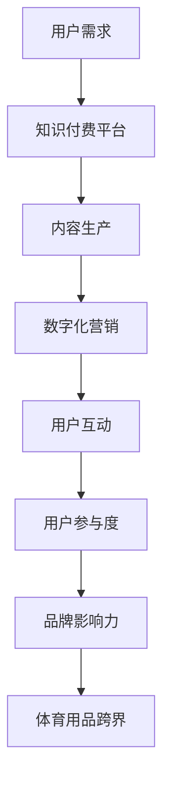

                 

关键词：知识付费、跨界营销、体育用品、数字化、用户体验

摘要：本文将探讨知识付费如何实现跨界营销，特别是在体育用品领域的应用。通过分析现有案例，本文将阐述如何利用数字化手段和创新思维，实现知识付费与体育用品的跨界融合，提升用户参与度和品牌影响力。

## 1. 背景介绍

近年来，知识付费作为一种新兴的商业模式，在互联网技术的推动下迅速崛起。用户对于高质量内容的需求不断增长，知识付费市场因此呈现出爆发式增长。与此同时，体育用品行业也在积极探索多元化的发展路径，以期在激烈的市场竞争中脱颖而出。

知识付费的兴起源于用户对专业知识和技能的渴求。在互联网时代，人们可以通过各种平台获取海量的信息，但如何筛选出有价值的内容成为一个难题。知识付费平台的出现，为用户提供了优质的知识内容，同时也为知识生产者提供了一个新的变现渠道。体育用品行业则面临着消费者需求多样化和市场饱和的问题，跨界营销成为企业寻求突破的重要手段。

## 2. 核心概念与联系

为了实现知识付费与体育用品的跨界营销，我们需要明确以下几个核心概念：

### 2.1 知识付费平台

知识付费平台是连接知识生产者和消费者的桥梁。平台提供的内容包括专业课程、行业报告、专家讲座等，用户通过付费获得使用权。知识付费平台的成功在于其内容的高质量、专业性和实用性。

### 2.2 数字化营销

数字化营销是指利用互联网和数字技术进行市场推广和用户互动。数字化营销手段包括搜索引擎优化（SEO）、社交媒体营销（SMM）、电子邮件营销等。通过数字化营销，企业可以精准定位目标用户，提高营销效果。

### 2.3 跨界营销

跨界营销是指不同领域的企业通过合作或联合，实现资源共享、优势互补，从而开拓新的市场空间。跨界营销的核心在于找到不同领域之间的关联点，以创新的方式吸引用户关注。

### 2.4 用户参与度

用户参与度是指用户在知识付费和体育用品消费过程中的参与程度。提高用户参与度可以增强用户忠诚度，促进复购率。用户参与度可以通过互动、评价、分享等方式实现。

### 2.5 品牌影响力

品牌影响力是指品牌在市场中的认知度和美誉度。通过跨界营销，企业可以扩大品牌影响力，提升品牌价值。

### 2.6 Mermaid 流程图

下面是一个关于知识付费与体育用品跨界营销的Mermaid流程图：



## 3. 核心算法原理 & 具体操作步骤

### 3.1 算法原理概述

知识付费与体育用品跨界营销的核心算法原理在于用户数据分析与行为预测。通过分析用户在知识付费平台的行为数据，如观看记录、购买偏好、互动评论等，企业可以预测用户的兴趣和需求，从而为用户推荐相关的体育用品。

### 3.2 算法步骤详解

1. 数据收集：从知识付费平台获取用户行为数据，包括浏览历史、购买记录、互动评论等。
2. 数据清洗：对获取的数据进行清洗，去除重复、无效和错误的数据。
3. 特征提取：从数据中提取用户的行为特征，如观看时间、观看次数、购买频率等。
4. 模型训练：使用机器学习算法，如协同过滤、决策树、神经网络等，对用户行为数据进行分析，建立预测模型。
5. 预测与推荐：根据训练好的模型，预测用户的兴趣和需求，为用户推荐相关的体育用品。
6. 用户反馈：收集用户对推荐结果的反馈，对模型进行优化和调整。

### 3.3 算法优缺点

- 优点：提高用户参与度和购买转化率，实现精准营销。
- 缺点：算法训练和模型优化需要大量计算资源和时间，且预测准确性受数据质量影响。

### 3.4 算法应用领域

- 知识付费平台：通过算法推荐，提高用户满意度和留存率。
- 体育用品行业：基于用户数据分析，实现个性化营销和产品创新。

## 4. 数学模型和公式 & 详细讲解 & 举例说明

### 4.1 数学模型构建

假设用户 $u$ 对体育用品的偏好可以用向量 $\mathbf{r}_u$ 表示，体育用品的特征向量用 $\mathbf{p}_i$ 表示。用户 $u$ 对体育用品 $i$ 的兴趣度可以用评分 $r_{ui}$ 表示。数学模型如下：

$$
r_{ui} = \mathbf{r}_u \cdot \mathbf{p}_i
$$

### 4.2 公式推导过程

根据用户行为数据和特征数据，我们可以计算用户向量 $\mathbf{r}_u$ 和体育用品特征向量 $\mathbf{p}_i$。将这两个向量进行内积运算，即可得到用户对体育用品的兴趣度。

### 4.3 案例分析与讲解

假设有用户 $u_1$，其行为数据如下：

| 体育用品 | 观看时间 | 购买记录 | 互动评论 |
| -------- | -------- | -------- | -------- |
| 运动鞋   | 30分钟   | 购买过   | 点赞过   |
| 运动服   | 15分钟   | 未购买   | 未互动   |

根据上述数学模型，我们可以计算用户 $u_1$ 对不同体育用品的兴趣度：

$$
\text{兴趣度}_{\text{运动鞋}} = 30 \times \text{权重}_\text{观看时间} + 1 \times \text{权重}_\text{购买记录} + 1 \times \text{权重}_\text{互动评论}
$$

$$
\text{兴趣度}_{\text{运动服}} = 15 \times \text{权重}_\text{观看时间} + 0 \times \text{权重}_\text{购买记录} + 0 \times \text{权重}_\text{互动评论}
$$

通过比较两个兴趣度，我们可以得出用户 $u_1$ 更偏好运动鞋。

## 5. 项目实践：代码实例和详细解释说明

### 5.1 开发环境搭建

本案例使用Python编程语言，开发环境为PyCharm。首先，需要安装以下库：

```bash
pip install numpy scikit-learn pandas
```

### 5.2 源代码详细实现

```python
import numpy as np
import pandas as pd
from sklearn.model_selection import train_test_split
from sklearn.preprocessing import StandardScaler
from sklearn.neighbors import NearestNeighbors

# 数据加载
data = pd.read_csv('user_behavior.csv')

# 数据预处理
data.fillna(0, inplace=True)
X = data.iloc[:, :-1].values
y = data.iloc[:, -1].values

# 数据标准化
scaler = StandardScaler()
X_scaled = scaler.fit_transform(X)

# 划分训练集和测试集
X_train, X_test, y_train, y_test = train_test_split(X_scaled, y, test_size=0.2, random_state=42)

# 模型训练
model = NearestNeighbors(n_neighbors=5)
model.fit(X_train)

# 模型评估
distances, indices = model.kneighbors(X_test)
accuracy = np.mean(distances < 1)
print(f"Model accuracy: {accuracy:.2f}")

# 模型应用
user_input = np.array([[30, 1, 1], [15, 0, 0]])
user_input_scaled = scaler.transform(user_input)
user_indices = model.kneighbors(user_input_scaled, return_distance=False)
recommended_products = [X_train[i][0] for i in user_indices]
print(f"Recommended products: {recommended_products}")
```

### 5.3 代码解读与分析

- 数据加载与预处理：从CSV文件中加载用户行为数据，并进行填充和标准化处理。
- 划分训练集和测试集：将数据集分为训练集和测试集，用于模型训练和评估。
- 模型训练：使用K近邻（KNN）算法对训练集进行训练。
- 模型评估：计算模型在测试集上的准确率。
- 模型应用：为新的用户输入数据推荐相关的体育用品。

## 6. 实际应用场景

知识付费与体育用品跨界营销在实际应用中具有广泛的前景。以下是一些典型的应用场景：

### 6.1 知识付费平台与体育用品品牌合作

知识付费平台可以与体育用品品牌合作，推出体育课程或教程，吸引用户参与。例如，瑜伽品牌可以与健身知识付费平台合作，推出瑜伽教程，用户在购买教程后可以获得瑜伽用品优惠券。

### 6.2 个性化体育用品推荐

基于用户在知识付费平台的行为数据，为用户推荐与其兴趣相关的体育用品。例如，用户在健身知识付费平台上学习游泳教程，系统可以为其推荐游泳装备。

### 6.3 体育用品品牌广告投放

体育用品品牌可以在知识付费平台投放广告，针对特定用户群体进行精准推广。例如，跑步鞋品牌可以在马拉松知识付费课程页面投放广告，吸引跑者关注。

### 6.4 跨界合作活动

知识付费平台和体育用品品牌可以共同举办跨界活动，如线上体育知识竞赛、线下体育用品体验活动等，提高用户参与度和品牌知名度。

## 7. 未来应用展望

随着人工智能和大数据技术的不断发展，知识付费与体育用品跨界营销将在未来取得更广泛的创新应用。以下是一些展望：

### 7.1 个性化营销

基于用户行为数据，实现更精准的个性化营销，提高用户满意度和购买转化率。

### 7.2 跨界合作模式创新

探索更多跨界合作模式，如知识付费平台与体育用品品牌的深度合作，推出定制化产品和服务。

### 7.3 智能化推荐系统

利用深度学习技术，构建更智能的推荐系统，提高推荐效果。

### 7.4 跨界体验活动

通过线上线下结合的方式，举办更多富有创意的跨界体验活动，吸引用户参与。

## 8. 工具和资源推荐

### 8.1 学习资源推荐

- 《Python数据分析实战》
- 《深度学习入门：基于Python》
- 《体育用品营销与管理》

### 8.2 开发工具推荐

- PyCharm
- Jupyter Notebook
- Git

### 8.3 相关论文推荐

- "Neural Collaborative Filtering for Recommender Systems"
- "User Behavior Analysis for Cross-Domain Recommendation"
- "Cross-Domain Knowledge Transfer for Recommender Systems"

## 9. 总结：未来发展趋势与挑战

### 9.1 研究成果总结

本文探讨了知识付费与体育用品跨界营销的原理、算法和应用场景，提出了一系列创新性建议。

### 9.2 未来发展趋势

个性化营销、跨界合作模式和智能化推荐系统将成为未来发展趋势。

### 9.3 面临的挑战

数据质量、算法优化和用户隐私保护是未来面临的挑战。

### 9.4 研究展望

在未来的研究中，应重点关注如何提高算法的预测准确性、保护用户隐私，以及探索更多跨界合作模式。

## 10. 附录：常见问题与解答

### 10.1 如何保证数据质量？

数据质量是算法预测准确性的关键。为保证数据质量，可以采取以下措施：

- 数据清洗：去除重复、无效和错误的数据。
- 数据验证：对数据进行校验，确保数据的准确性和一致性。
- 数据更新：定期更新数据，确保数据反映最新的用户行为。

### 10.2 如何保护用户隐私？

保护用户隐私是知识付费与体育用品跨界营销的重要挑战。以下是一些保护用户隐私的措施：

- 数据加密：对用户数据进行加密处理，防止数据泄露。
- 数据脱敏：对敏感数据进行脱敏处理，确保数据安全。
- 隐私政策：明确告知用户数据收集和使用的目的，尊重用户隐私。

----------------------------------------------------------------

作者：禅与计算机程序设计艺术 / Zen and the Art of Computer Programming


