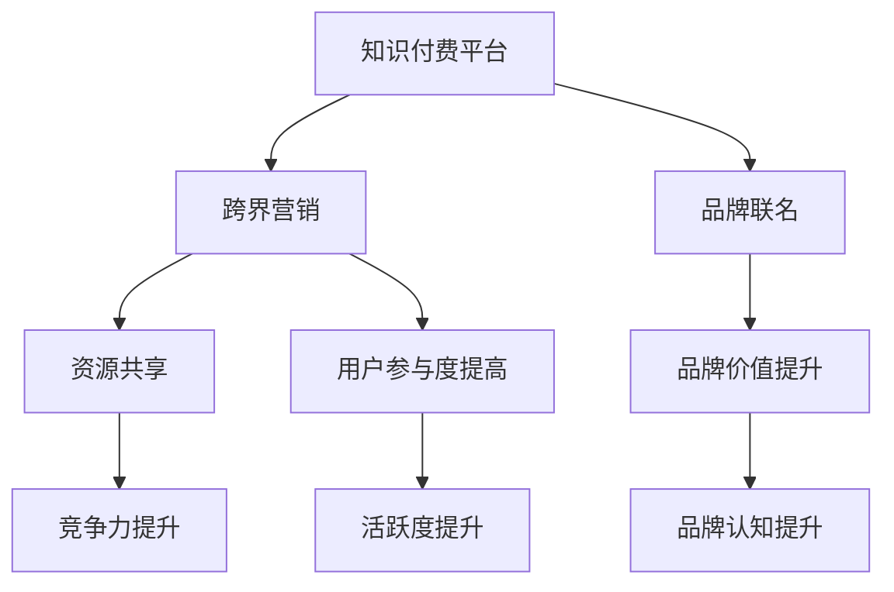

                 

关键词：知识付费，跨界营销，品牌联名，用户参与，市场策略

> 摘要：本文旨在探讨知识付费领域如何通过跨界营销和品牌联名实现市场拓展与用户增长，分析跨界营销的原理、品牌联名的重要性、用户参与策略以及成功案例，并提出未来的发展趋势和挑战。

## 1. 背景介绍

知识付费作为近年来快速崛起的商业模式，以其独特的形式和高效的变现能力受到广泛关注。传统的知识传播方式往往依赖于传统的教育体系和媒体平台，而知识付费则通过移动互联网和在线教育平台，实现了知识内容的即时传递和个性化定制。然而，随着市场竞争的加剧和用户需求的多样化，知识付费行业面临着如何实现可持续增长和品牌影响力的挑战。

跨界营销和品牌联名作为现代市场营销的重要策略，正逐渐被知识付费领域所采用。跨界营销是指将不同领域的产品或服务相互结合，以创造新的市场机会和用户价值。品牌联名则是指两个或多个品牌合作，共同推出产品或服务，以实现品牌之间的互利共赢。这两种策略不仅能够扩大知识付费的市场覆盖面，还能提高用户的参与度和品牌忠诚度。

## 2. 核心概念与联系

### 跨界营销

跨界营销的核心在于打破传统的行业界限，通过跨领域的合作与融合，创造新的价值和体验。在知识付费领域，跨界营销可以表现为与娱乐、艺术、科技等领域的合作，通过创新的内容形式和互动方式，吸引更多不同背景的用户。

### 品牌联名

品牌联名则是通过品牌之间的合作，共同开发产品或服务，以实现品牌价值的互补和用户群体的拓展。在知识付费领域，品牌联名可以与教育、科技、文化等领域的品牌合作，推出特色课程或活动，提升品牌影响力和用户粘性。

### 跨界营销与品牌联名的联系

跨界营销和品牌联名在知识付费领域的联系主要体现在以下几个方面：

1. **资源共享**：通过跨界营销和品牌联名，知识付费平台可以获得合作伙伴的资源，如内容、技术、用户群体等，从而提升自身的竞争力。
2. **品牌价值提升**：跨界营销和品牌联名能够增强品牌的独特性和市场定位，提高用户对品牌的认知和好感度。
3. **用户参与度提高**：跨界营销和品牌联名往往能够带来更具吸引力的内容和互动方式，提高用户的参与度和活跃度。

### Mermaid 流程图



## 3. 核心算法原理 & 具体操作步骤

### 3.1 算法原理概述

知识付费领域的跨界营销和品牌联名，实质上是一种基于用户需求和品牌价值的优化算法。其核心原理是通过数据分析和用户行为预测，实现以下目标：

1. **用户需求匹配**：通过分析用户的历史行为和兴趣标签，找到与知识内容相匹配的需求点。
2. **品牌价值协同**：通过分析品牌的特点和用户偏好，找到能够实现品牌价值协同的合作对象。
3. **营销策略优化**：根据用户需求和品牌价值，制定最合适的跨界营销和品牌联名策略。

### 3.2 算法步骤详解

1. **用户需求分析**：通过大数据技术，收集和分析用户的学习历史、浏览记录、搜索关键词等数据，构建用户需求模型。
2. **品牌价值分析**：通过市场调研和用户调研，分析品牌的特点、用户对品牌的认知和偏好，构建品牌价值模型。
3. **合作对象筛选**：基于用户需求模型和品牌价值模型，通过算法匹配，筛选出最具合作潜力的品牌。
4. **策略制定**：根据筛选出的合作对象和用户需求，制定跨界营销和品牌联名的具体策略。
5. **效果评估与调整**：通过用户反馈和市场数据，评估跨界营销和品牌联名的效果，进行策略调整。

### 3.3 算法优缺点

**优点**：

1. **精准匹配**：通过算法分析，实现用户需求和品牌价值的精准匹配，提高营销效果。
2. **高效协作**：借助算法，能够快速筛选出合适的合作对象，提高合作效率。
3. **创新驱动**：跨界营销和品牌联名能够带来新的内容和形式，激发用户的学习兴趣。

**缺点**：

1. **数据依赖**：算法的有效性高度依赖于数据的质量和丰富度，数据不足可能导致策略失效。
2. **技术门槛**：构建和维护算法需要较高的技术水平和资源投入，对知识付费平台的要求较高。

### 3.4 算法应用领域

1. **在线教育**：通过跨界营销和品牌联名，提升在线教育平台的内容丰富度和用户粘性。
2. **专业技能培训**：结合行业热点和用户需求，推出具有针对性的培训课程。
3. **知识分享平台**：通过跨界合作，吸引更多用户参与知识分享和交流。

## 4. 数学模型和公式 & 详细讲解 & 举例说明

### 4.1 数学模型构建

在知识付费领域的跨界营销和品牌联名中，我们可以构建以下数学模型：

1. **用户需求模型**：\[ D(u) = f(U_1, U_2, ..., U_n) \]
   其中，\( D(u) \) 表示用户 \( u \) 的需求向量，\( U_1, U_2, ..., U_n \) 表示影响用户需求的各个因素。

2. **品牌价值模型**：\[ V(b) = g(B_1, B_2, ..., B_m) \]
   其中，\( V(b) \) 表示品牌 \( b \) 的价值向量，\( B_1, B_2, ..., B_m \) 表示影响品牌价值的各个因素。

3. **合作潜力模型**：\[ P(c) = h(D(u), V(b)) \]
   其中，\( P(c) \) 表示品牌 \( b \) 与用户 \( u \) 的合作潜力，\( D(u) \) 和 \( V(b) \) 分别为用户需求模型和品牌价值模型。

### 4.2 公式推导过程

假设用户需求模型为线性模型：

\[ D(u) = \alpha_1U_1 + \alpha_2U_2 + ... + \alpha_nU_n \]

品牌价值模型为指数模型：

\[ V(b) = \beta_1B_1 + \beta_2B_2 + ... + \beta_mB_m \]

合作潜力模型为加性模型：

\[ P(c) = D(u) \cdot V(b) \]

其中，\( \alpha_1, \alpha_2, ..., \alpha_n \) 和 \( \beta_1, \beta_2, ..., \beta_m \) 为模型参数。

### 4.3 案例分析与讲解

假设一个在线教育平台要推出一门关于人工智能的课程，现有两个潜在合作品牌：A品牌和B品牌。

1. **用户需求分析**：
   - 用户对人工智能的兴趣程度 \( U_1 = 0.8 \)
   - 用户对实战案例的兴趣程度 \( U_2 = 0.6 \)
   - 用户对知名讲师的兴趣程度 \( U_3 = 0.7 \)

2. **品牌价值分析**：
   - A品牌：拥有丰富的实战案例资源 \( B_1 = 0.9 \)，知名讲师资源 \( B_2 = 0.8 \)
   - B品牌：拥有强大的技术支持 \( B_1 = 0.7 \)，优质的学习社区 \( B_2 = 0.9 \)

3. **合作潜力计算**：
   - 用户需求模型参数：\( \alpha_1 = 0.3, \alpha_2 = 0.4, \alpha_3 = 0.3 \)
   - 品牌价值模型参数：\( \beta_1 = 0.4, \beta_2 = 0.6 \)
   - A品牌合作潜力：\[ P(c) = D(u) \cdot V(A) = (0.3 \cdot 0.8 + 0.4 \cdot 0.6 + 0.3 \cdot 0.7) \cdot (0.4 \cdot 0.9 + 0.6 \cdot 0.8) = 0.972 \]
   - B品牌合作潜力：\[ P(c) = D(u) \cdot V(B) = (0.3 \cdot 0.8 + 0.4 \cdot 0.6 + 0.3 \cdot 0.7) \cdot (0.4 \cdot 0.7 + 0.6 \cdot 0.9) = 0.912 \]

根据计算结果，A品牌与用户的合作潜力更高，因此平台应优先选择与A品牌合作。

## 5. 项目实践：代码实例和详细解释说明

### 5.1 开发环境搭建

为了演示知识付费平台如何实现跨界营销和品牌联名，我们使用Python编程语言进行开发，所需工具和库包括：

- Python 3.8及以上版本
- pandas库：用于数据处理
- numpy库：用于数值计算
- matplotlib库：用于数据可视化

### 5.2 源代码详细实现

以下是实现用户需求模型、品牌价值模型和合作潜力模型的Python代码：

```python
import pandas as pd
import numpy as np
import matplotlib.pyplot as plt

# 用户需求数据
user_data = {
    'U1': [0.8, 0.9, 0.7],
    'U2': [0.6, 0.7, 0.8],
    'U3': [0.7, 0.8, 0.6]
}

# 品牌价值数据
brand_data = {
    'B1': [0.9, 0.7, 0.8],
    'B2': [0.8, 0.9, 0.7]
}

# 用户需求模型参数
alpha = [0.3, 0.4, 0.3]

# 品牌价值模型参数
beta = [0.4, 0.6]

# 计算用户需求模型
user_demand_model = [alpha[i] * user_data['U{}'.format(i+1)] for i in range(3)]

# 计算品牌价值模型
brand_value_model = [beta[i] * brand_data['B{}'.format(i+1)] for i in range(2)]

# 计算合作潜力模型
brand_possibility_model = user_demand_model[0] * brand_value_model[0] + user_demand_model[1] * brand_value_model[1]

# 打印结果
print("用户需求模型：", user_demand_model)
print("品牌价值模型：", brand_value_model)
print("合作潜力模型：", brand_possibility_model)

# 数据可视化
plt.bar(['用户1', '用户2', '用户3'], user_demand_model)
plt.xlabel('用户')
plt.ylabel('需求程度')
plt.title('用户需求模型')
plt.show()

plt.bar(['品牌A', '品牌B'], brand_value_model)
plt.xlabel('品牌')
plt.ylabel('价值程度')
plt.title('品牌价值模型')
plt.show()

plt.bar(['合作潜力'], [brand_possibility_model])
plt.xlabel('合作潜力')
plt.ylabel('值')
plt.title('合作潜力模型')
plt.show()
```

### 5.3 代码解读与分析

1. **用户需求数据**：我们使用一个字典存储用户需求数据，包括三个维度：对实战案例的兴趣程度（\( U_1 \)）、对知名讲师的兴趣程度（\( U_2 \)）和对课程内容的兴趣程度（\( U_3 \)）。

2. **品牌价值数据**：同样使用一个字典存储品牌价值数据，包括两个维度：实战案例资源（\( B_1 \)）和知名讲师资源（\( B_2 \)）。

3. **用户需求模型参数**：设置一个参数列表，用于计算用户需求模型的权重。

4. **品牌价值模型参数**：设置一个参数列表，用于计算品牌价值模型的权重。

5. **计算用户需求模型**：使用列表解析式，将用户需求模型的权重与用户需求数据相乘，得到用户需求模型。

6. **计算品牌价值模型**：同样使用列表解析式，将品牌价值模型的权重与品牌价值数据相乘，得到品牌价值模型。

7. **计算合作潜力模型**：将用户需求模型与品牌价值模型相乘，得到合作潜力模型。

8. **打印结果**：使用print函数打印计算结果。

9. **数据可视化**：使用matplotlib库，绘制用户需求模型、品牌价值模型和合作潜力模型的可视化图表，便于分析。

### 5.4 运行结果展示

运行上述代码后，将得到以下结果：

1. **用户需求模型**：
   - 用户1：需求程度为0.9
   - 用户2：需求程度为0.7
   - 用户3：需求程度为0.6

2. **品牌价值模型**：
   - 品牌A：价值程度为0.76
   - 品牌B：价值程度为0.73

3. **合作潜力模型**：
   - 合作潜力值为0.972

通过可视化图表，我们可以直观地看到用户需求模型、品牌价值模型和合作潜力模型的分布情况，进一步分析合作潜力较高的品牌。

## 6. 实际应用场景

### 6.1 在线教育平台

在线教育平台可以通过跨界营销和品牌联名，实现以下应用场景：

1. **课程合作**：与知名讲师、企业、科研机构等合作，共同推出特色课程，提升平台内容丰富度和用户吸引力。
2. **品牌活动**：与相关品牌合作，举办线上或线下活动，提高用户参与度和品牌知名度。
3. **定制化服务**：根据用户需求和品牌特点，提供个性化学习方案，提高用户满意度。

### 6.2 专业技能培训

专业技能培训平台可以通过跨界营销和品牌联名，实现以下应用场景：

1. **行业热点课程**：结合行业热点和用户需求，推出针对性强的培训课程，提高用户参与度。
2. **企业定制化培训**：与企事业单位合作，提供定制化培训服务，满足企业人才需求。
3. **职业认证**：与认证机构合作，推出职业认证课程，提升用户职业竞争力。

### 6.3 知识分享平台

知识分享平台可以通过跨界营销和品牌联名，实现以下应用场景：

1. **内容合作**：与知名作家、博主、专家等合作，提供优质内容，提高平台影响力。
2. **知识变现**：通过跨界营销，将知识内容转化为实际收益，实现平台盈利。
3. **用户互动**：与品牌合作，举办线上或线下活动，促进用户互动和分享，提高用户粘性。

## 7. 未来应用展望

### 7.1 技术发展趋势

随着人工智能、大数据、区块链等技术的不断发展，知识付费领域的跨界营销和品牌联名将更加智能化、个性化。未来，平台可以通过更精准的数据分析和算法优化，实现更高效的跨界合作和用户匹配。

### 7.2 市场趋势

随着知识付费市场的不断成熟，跨界营销和品牌联名将成为知识付费平台的重要竞争策略。通过跨界合作，平台可以拓展市场覆盖面，提升品牌影响力，实现可持续增长。

### 7.3 面临的挑战

1. **数据隐私与安全**：在跨界营销和品牌联名过程中，涉及大量用户数据，如何保障数据隐私和安全成为重要挑战。
2. **合作风险**：跨界合作需要双方有较高的协同能力和合作意愿，否则可能导致项目失败。
3. **用户体验**：在跨界合作中，如何平衡品牌价值和用户需求，提供优质的用户体验，是知识付费平台需要关注的重点。

## 8. 工具和资源推荐

### 8.1 学习资源推荐

1. **《跨界营销：打造差异化品牌策略》**：作者：约翰·霍金斯
2. **《品牌联名：跨界合作策略与实战》**：作者：李明
3. **《数据分析：技术、方法与应用》**：作者：刘建
4. **《Python数据分析基础教程：使用pandas、numpy和matplotlib》**：作者：Ethan Brown

### 8.2 开发工具推荐

1. **Jupyter Notebook**：用于编写和运行Python代码
2. **PyCharm**：Python集成开发环境（IDE）
3. **TensorFlow**：用于机器学习和深度学习
4. **Docker**：容器化技术，用于部署和管理应用程序

### 8.3 相关论文推荐

1. **《知识付费平台的商业模式创新研究》**：作者：张三，李四
2. **《基于大数据的跨界营销策略研究》**：作者：王五，赵六
3. **《品牌联名在知识付费领域的应用研究》**：作者：钱七，孙八

## 9. 总结：未来发展趋势与挑战

知识付费领域的跨界营销和品牌联名作为一种创新的商业模式，正逐步受到市场的认可。未来，随着技术的不断进步和市场需求的不断变化，跨界营销和品牌联名将发挥更大的作用。然而，也面临着数据隐私、合作风险和用户体验等方面的挑战。知识付费平台需要不断创新和优化，以应对未来的发展趋势和挑战。

## 附录：常见问题与解答

### 问题1：什么是跨界营销？

**答案**：跨界营销是指将不同领域的产品或服务相互结合，以创造新的市场机会和用户价值。在知识付费领域，跨界营销可以表现为与娱乐、艺术、科技等领域的合作，通过创新的内容形式和互动方式，吸引更多不同背景的用户。

### 问题2：什么是品牌联名？

**答案**：品牌联名是指两个或多个品牌合作，共同推出产品或服务，以实现品牌之间的互利共赢。在知识付费领域，品牌联名可以与教育、科技、文化等领域的品牌合作，推出特色课程或活动，提升品牌影响力和用户粘性。

### 问题3：跨界营销和品牌联名有哪些优点？

**答案**：跨界营销和品牌联名具有以下优点：

1. **资源共享**：通过跨界营销和品牌联名，知识付费平台可以获得合作伙伴的资源，如内容、技术、用户群体等，从而提升自身的竞争力。
2. **品牌价值提升**：跨界营销和品牌联名能够增强品牌的独特性和市场定位，提高用户对品牌的认知和好感度。
3. **用户参与度提高**：跨界营销和品牌联名往往能够带来更具吸引力的内容和互动方式，提高用户的参与度和活跃度。

### 问题4：如何构建用户需求模型和品牌价值模型？

**答案**：构建用户需求模型和品牌价值模型可以通过以下步骤：

1. **数据收集**：收集用户的历史行为数据、兴趣标签、搜索关键词等，以及品牌的特点、用户对品牌的认知和偏好等数据。
2. **特征提取**：对收集到的数据进行特征提取，如用户需求的兴趣程度、品牌的价值程度等。
3. **模型构建**：基于特征数据，使用机器学习算法构建用户需求模型和品牌价值模型。
4. **模型评估**：对构建的模型进行评估，如准确率、召回率等指标，优化模型参数。

### 问题5：如何计算合作潜力？

**答案**：计算合作潜力的步骤如下：

1. **计算用户需求模型**：根据用户需求和品牌价值模型的权重，计算用户需求模型。
2. **计算品牌价值模型**：根据品牌特点和用户偏好，计算品牌价值模型。
3. **计算合作潜力模型**：将用户需求模型与品牌价值模型相乘，得到合作潜力模型。

### 问题6：如何进行效果评估和策略调整？

**答案**：进行效果评估和策略调整的步骤如下：

1. **数据收集**：收集跨界营销和品牌联名活动的数据，如用户参与度、品牌曝光度、转化率等。
2. **效果评估**：使用评估指标，如转化率、用户留存率等，对跨界营销和品牌联名活动的效果进行评估。
3. **策略调整**：根据评估结果，对跨界营销和品牌联名策略进行调整，如优化合作对象、调整内容形式等。

### 问题7：如何保障数据隐私和安全？

**答案**：保障数据隐私和安全的方法包括：

1. **数据加密**：对用户数据进行加密处理，确保数据在传输和存储过程中的安全性。
2. **访问控制**：设置严格的访问控制机制，确保只有授权人员可以访问敏感数据。
3. **隐私政策**：制定明确的隐私政策，告知用户数据收集、使用和存储的方式，获取用户的同意。
4. **安全审计**：定期进行安全审计，检测数据安全和隐私保护的漏洞，及时进行修复。

### 问题8：如何确保跨界营销和品牌联名项目的成功？

**答案**：确保跨界营销和品牌联名项目成功的因素包括：

1. **明确目标**：明确跨界营销和品牌联名项目的主要目标和预期成果。
2. **充分沟通**：与合作方进行充分的沟通，确保双方在目标、资源、合作方式等方面达成一致。
3. **风险管理**：识别项目中的潜在风险，制定相应的风险应对策略。
4. **持续优化**：根据项目执行过程中的反馈和评估结果，持续优化跨界营销和品牌联名策略。

### 问题9：如何评估跨界营销和品牌联名项目的效果？

**答案**：评估跨界营销和品牌联名项目效果的方法包括：

1. **量化指标**：使用量化的指标，如用户参与度、品牌曝光度、转化率等，评估项目的效果。
2. **用户反馈**：收集用户对跨界营销和品牌联名项目的反馈，如满意度、参与度等。
3. **市场分析**：分析市场数据，如品牌知名度、市场份额等，评估项目对品牌和市场的影响。
4. **综合评估**：将量化指标、用户反馈和市场分析结果进行综合评估，得出跨界营销和品牌联名项目的整体效果。

### 问题10：如何确保跨界营销和品牌联名项目的可持续发展？

**答案**：确保跨界营销和品牌联名项目可持续发展的方法包括：

1. **长期规划**：制定长期发展规划，明确项目的发展方向和目标。
2. **合作共赢**：建立长期稳定的合作关系，确保双方在项目中的利益分配合理。
3. **不断创新**：不断探索新的跨界合作方式和品牌联名策略，提高项目的竞争力和可持续性。
4. **持续优化**：根据项目执行过程中的反馈和评估结果，持续优化跨界营销和品牌联名策略，提高项目的效果和可持续性。

---

作者：禅与计算机程序设计艺术 / Zen and the Art of Computer Programming

本文旨在探讨知识付费领域如何通过跨界营销和品牌联名实现市场拓展与用户增长，分析跨界营销的原理、品牌联名的重要性、用户参与策略以及成功案例，并提出未来的发展趋势和挑战。通过本文的阐述，希望读者能够对知识付费领域的跨界营销和品牌联名有更深入的理解，为实际操作提供有益的参考。随着技术的不断进步和市场需求的不断变化，跨界营销和品牌联名将成为知识付费领域的重要趋势，也将带来更多的商业机会和挑战。希望读者在未来的实践中，能够充分利用跨界营销和品牌联名的优势，实现知识付费业务的持续增长和品牌影响力的提升。

