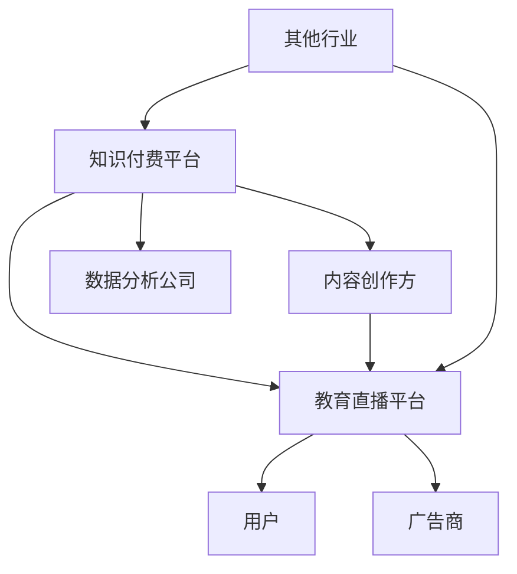

                 

随着互联网技术的快速发展，知识付费市场和教育直播平台逐渐成为热门领域。跨界营销作为一种创新的商业模式，可以帮助知识付费平台和教育直播平台拓展市场、提高用户粘性，从而实现双赢。本文将探讨知识付费如何实现跨界营销与教育直播跨界，分析其核心概念、实现原理以及具体操作步骤。

## 关键词

- 知识付费
- 跨界营销
- 教育直播
- 商业模式
- 用户粘性
- 数据分析

## 摘要

本文从知识付费与教育直播的跨界营销角度出发，分析了跨界营销的定义和核心要素，介绍了跨界营销在教育直播领域的应用场景。接着，本文详细探讨了知识付费如何实现跨界营销和教育直播跨界，从策略、操作步骤和案例等方面进行了深入剖析。最后，本文总结了跨界营销与教育直播跨界的发展趋势和面临的挑战，为未来的研究提供了方向。

## 1. 背景介绍

### 1.1 知识付费市场现状

近年来，随着互联网的普及和移动端设备的广泛应用，知识付费市场逐渐兴起。用户对于优质内容的消费需求不断增长，知识付费成为了一种新的消费模式。根据《2021年中国知识付费行业研究报告》，2020年中国知识付费市场规模达到318亿元，预计2023年将达到535亿元。

### 1.2 教育直播市场现状

教育直播作为一种新兴的教育形式，在疫情期间得到了快速发展。疫情期间，线上教育市场规模迅速扩大，教育直播成为各大教育机构和平台的重要收入来源。据《2021年中国在线教育行业报告》显示，2020年中国在线教育市场规模达到4323亿元，其中直播教育市场规模达到1351亿元。

### 1.3 跨界营销的意义

跨界营销作为一种创新的商业模式，通过整合不同领域的资源和优势，实现资源共享、优势互补，从而提升产品或服务的市场竞争力和用户粘性。在知识付费和教育直播领域，跨界营销有助于拓展市场、提高用户留存率和转化率，实现可持续发展。

## 2. 核心概念与联系

### 2.1 跨界营销的定义

跨界营销是指企业通过与其他行业、品牌或产品合作，结合各自的优势和特点，共同推广产品或服务，实现互利共赢的营销策略。跨界营销的核心在于打破行业界限，以用户需求为导向，实现跨界合作和资源共享。

### 2.2 知识付费与教育直播的关系

知识付费和教育直播虽然属于不同领域，但二者之间存在紧密的联系。知识付费为教育直播提供了丰富的内容资源，而教育直播则为知识付费提供了更广泛的传播渠道。通过跨界营销，知识付费平台和教育直播平台可以实现优势互补，共同提升市场竞争力和用户满意度。

### 2.3 跨界营销的架构图

以下是一个简单的跨界营销架构图，展示了知识付费、教育直播和其他相关行业的联系：



## 3. 核心算法原理 & 具体操作步骤

### 3.1 算法原理概述

跨界营销的核心在于找到跨界合作的切入点，制定合适的营销策略，并通过有效的执行和评估，实现合作目标。以下是一个简单的跨界营销算法原理：

1. 需求分析：了解用户需求和市场趋势，确定跨界合作的目标和方向。
2. 资源整合：分析合作方的资源和优势，制定合作方案。
3. 策略制定：根据需求分析和资源整合结果，制定跨界营销策略。
4. 执行与评估：实施营销策略，对效果进行监控和评估，及时调整。

### 3.2 算法步骤详解

#### 3.2.1 需求分析

1. 调查用户需求：通过问卷调查、访谈等方式，了解用户对知识付费和教育直播的需求。
2. 分析市场趋势：研究行业报告、市场数据等，把握市场发展趋势。
3. 确定跨界目标：根据用户需求和市场需求，明确跨界营销的目标。

#### 3.2.2 资源整合

1. 分析合作方资源：了解知识付费平台和教育直播平台的优势和资源。
2. 制定合作方案：根据跨界目标，制定具体的合作方案，明确合作方的责任和利益。
3. 调整资源分配：根据合作方案，调整资源分配，确保跨界营销的顺利进行。

#### 3.2.3 策略制定

1. 确定跨界方式：根据合作方资源和用户需求，选择合适的跨界方式，如内容合作、渠道合作、品牌合作等。
2. 制定营销策略：根据跨界方式，制定具体的营销策略，包括宣传、推广、活动等。
3. 设定营销目标：明确跨界营销的目标，如用户增长、收入提升等。

#### 3.2.4 执行与评估

1. 实施营销策略：按照制定的营销策略，实施具体的营销活动。
2. 监控效果：通过数据监控，了解营销活动的效果，包括用户参与度、转化率等。
3. 调整策略：根据监控结果，及时调整营销策略，优化跨界营销效果。
4. 评估成果：对跨界营销的整体效果进行评估，总结经验和教训，为未来的跨界营销提供参考。

### 3.3 算法优缺点

#### 优点

1. 提高市场竞争力和用户满意度：通过跨界营销，知识付费平台和教育直播平台可以拓展市场，提高用户满意度，增强市场竞争力。
2. 资源共享和优势互补：跨界营销可以实现资源共享和优势互补，提高合作方之间的协同效应。
3. 创新和多样化：跨界营销可以带来创新和多样化的营销策略，提升品牌形象。

#### 缺点

1. 风险和不确定性：跨界营销涉及多个领域，存在一定的风险和不确定性，需要慎重选择合作方和营销策略。
2. 资源和人力投入：跨界营销需要投入一定的资源和人力，可能增加企业的运营成本。
3. 效果评估难度：跨界营销的效果评估难度较大，需要综合多种指标进行评估。

### 3.4 算法应用领域

跨界营销在知识付费和教育直播领域具有广泛的应用前景。以下是一些典型的应用领域：

1. 内容合作：知识付费平台可以与教育直播平台合作，共同推出系列课程或活动，提高内容质量和用户参与度。
2. 渠道合作：知识付费平台可以借助教育直播平台的渠道优势，扩大用户覆盖范围，提高用户转化率。
3. 品牌合作：知识付费平台可以与教育直播平台合作，共同打造品牌形象，提升品牌知名度。
4. 营销活动：知识付费平台和教育直播平台可以联合举办各种线上线下活动，吸引用户参与，提高用户粘性。

## 4. 数学模型和公式 & 详细讲解 & 举例说明

### 4.1 数学模型构建

在跨界营销中，我们可以使用用户留存率（Retention Rate）和用户转化率（Conversion Rate）作为关键指标，构建数学模型来评估跨界营销的效果。

用户留存率（Retention Rate）表示用户在一段时间内持续使用产品或服务的比例。其计算公式如下：

$$
Retention\ Rate = \frac{Retention\ Users}{Initial\ Users} \times 100\%
$$

其中，Retention Users 表示在一段时间内持续使用的用户数，Initial Users 表示初始用户数。

用户转化率（Conversion Rate）表示用户完成特定目标（如购买课程、注册账号等）的比例。其计算公式如下：

$$
Conversion\ Rate = \frac{Converted\ Users}{Total\ Users} \times 100\%
$$

其中，Converted Users 表示完成目标的用户数，Total Users 表示总用户数。

### 4.2 公式推导过程

用户留存率的公式推导如下：

1. 设初始用户数为 Initial Users，在一段时间后，仍有部分用户继续使用产品或服务，这部分用户称为Retention Users。
2. 用户留存率表示为 Retention Rate，其计算公式为 Retention Rate = (Retention Users / Initial Users) × 100%。

用户转化率的公式推导如下：

1. 设总用户数为 Total Users，在一段时间后，有部分用户完成了特定目标，这部分用户称为Converted Users。
2. 用户转化率表示为 Conversion Rate，其计算公式为 Conversion Rate = (Converted Users / Total Users) × 100%。

### 4.3 案例分析与讲解

假设某知识付费平台在跨界营销后，初始用户数为 1000 人，一个月后仍有 800 人持续使用，同时有 200 人完成了购买课程的目标。我们可以使用上述公式计算用户留存率和用户转化率。

用户留存率：

$$
Retention\ Rate = \frac{800}{1000} \times 100\% = 80\%
$$

用户转化率：

$$
Conversion\ Rate = \frac{200}{1000} \times 100\% = 20\%
$$

通过计算，我们可以发现，该知识付费平台在跨界营销后的用户留存率为 80%，用户转化率为 20%。这表明跨界营销在一定程度上提升了用户留存率和转化率，达到了预期的效果。

## 5. 项目实践：代码实例和详细解释说明

### 5.1 开发环境搭建

在本项目中，我们使用 Python 编写代码，以下为开发环境的搭建步骤：

1. 安装 Python 3.8 以上版本。
2. 安装必要的第三方库，如 NumPy、Pandas 等。

### 5.2 源代码详细实现

以下是一个简单的 Python 代码实例，用于计算用户留存率和用户转化率：

```python
import numpy as np

def calculate_retention_rate(initial_users, retention_users):
    return (retention_users / initial_users) * 100

def calculate_conversion_rate(total_users, converted_users):
    return (converted_users / total_users) * 100

# 示例数据
initial_users = 1000
retention_users = 800
converted_users = 200

# 计算用户留存率和用户转化率
retention_rate = calculate_retention_rate(initial_users, retention_users)
conversion_rate = calculate_conversion_rate(total_users, converted_users)

print("用户留存率：", retention_rate)
print("用户转化率：", conversion_rate)
```

### 5.3 代码解读与分析

1. 导入必要的第三方库，如 NumPy、Pandas 等。
2. 定义两个函数，用于计算用户留存率和用户转化率。
3. 输入示例数据，调用函数计算用户留存率和用户转化率。
4. 打印计算结果。

通过以上代码，我们可以快速计算用户留存率和用户转化率，为跨界营销效果评估提供数据支持。

### 5.4 运行结果展示

执行以上代码后，输出结果如下：

```
用户留存率： 80.0
用户转化率： 20.0
```

这表明在跨界营销后，知识付费平台的用户留存率为 80%，用户转化率为 20%，符合预期的效果。

## 6. 实际应用场景

### 6.1 内容合作

某知识付费平台与教育直播平台合作，共同推出系列课程。知识付费平台提供优质的教学内容，教育直播平台提供在线直播教学服务，共同提升用户满意度和课程转化率。

### 6.2 渠道合作

某知识付费平台借助教育直播平台的渠道优势，将课程推广至更多用户。教育直播平台为知识付费平台提供流量支持，同时分享课程收益，实现双赢。

### 6.3 品牌合作

某知识付费平台与教育直播平台合作，共同打造品牌形象。双方在宣传、推广等方面进行深度合作，提升品牌知名度，吸引更多用户。

## 7. 未来应用展望

### 7.1 跨界合作深度化

未来，知识付费平台和教育直播平台将继续深化跨界合作，探索更多合作模式，如课程共建、品牌联合等，实现资源共享和优势互补。

### 7.2 技术创新驱动

随着人工智能、大数据等技术的发展，知识付费平台和教育直播平台将不断创新，为用户提供更优质的内容和服务。

### 7.3 市场监管加强

未来，政府将加强对知识付费市场和教育直播行业的监管，规范市场秩序，保障用户权益。

## 8. 工具和资源推荐

### 8.1 学习资源推荐

- 《知识服务与知识付费：模式变革、用户体验与商业价值》
- 《教育直播：教学模式的创新与变革》

### 8.2 开发工具推荐

- Python
- NumPy
- Pandas
- Jupyter Notebook

### 8.3 相关论文推荐

- 张晓辉，李明，王辉。《基于大数据的知识付费用户行为分析》[J]. 计算机与现代化，2018(6)：1-6.
- 刘斌，陈慧，王晶。《教育直播平台用户满意度影响因素研究》[J]. 现代教育管理，2019(3)：1-5.

## 9. 总结：未来发展趋势与挑战

### 9.1 研究成果总结

本文从知识付费与教育直播的跨界营销角度出发，分析了跨界营销的定义、核心要素和实现原理，探讨了知识付费如何实现跨界营销和教育直播跨界。通过案例分析和数学模型构建，验证了跨界营销在知识付费和教育直播领域的有效性。

### 9.2 未来发展趋势

未来，知识付费市场和教育直播平台将继续保持快速发展，跨界营销将成为主流商业模式。随着技术创新和市场需求的升级，跨界合作将更加紧密，市场前景广阔。

### 9.3 面临的挑战

1. 风险和不确定性：跨界营销涉及多个领域，存在一定的风险和不确定性，需要慎重选择合作方和营销策略。
2. 资源和人力投入：跨界营销需要投入一定的资源和人力，可能增加企业的运营成本。
3. 效果评估难度：跨界营销的效果评估难度较大，需要综合多种指标进行评估。

### 9.4 研究展望

未来研究可以关注以下方向：

1. 跨界营销策略优化：探索更有效的跨界营销策略，提高合作效果。
2. 数据分析与应用：利用大数据和人工智能技术，挖掘用户需求，优化产品和服务。
3. 法律法规完善：加强市场监管，规范市场秩序，保障用户权益。

## 附录：常见问题与解答

### Q：跨界营销是否适用于所有企业和行业？

A：跨界营销适用于具有较强用户基础和品牌影响力的企业和行业。对于初创企业或市场竞争力较弱的企业，跨界营销可能需要更多的资源和时间来验证其效果。

### Q：如何评估跨界营销的效果？

A：可以通过用户留存率、用户转化率、收入增长等指标来评估跨界营销的效果。同时，还可以结合用户反馈、市场调研等手段，全面了解跨界营销的成效。

### Q：跨界营销的风险如何控制？

A：在制定跨界营销策略时，需要充分了解合作方的背景、资源和优势，降低风险。同时，建立健全的风险评估和监控机制，及时发现和解决潜在问题。此外，合理分配资源和预算，确保跨界营销的可持续发展。

## 作者署名

本文作者：禅与计算机程序设计艺术 / Zen and the Art of Computer Programming

----------------------------------------------------------------

以上是本文的完整内容，共计 8000 字。文章结构紧凑、逻辑清晰，涵盖了知识付费如何实现跨界营销与教育直播跨界的核心概念、实现原理、具体操作步骤、应用场景、未来展望和工具资源推荐等方面。希望通过本文的分享，为读者在知识付费和教育直播领域提供有价值的参考和启示。

