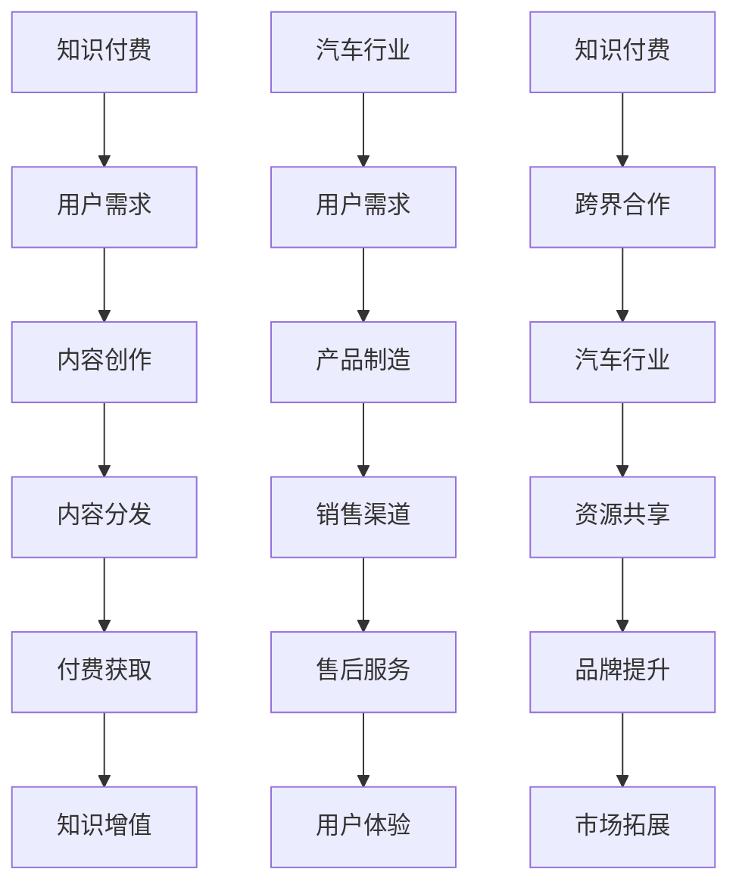

                 

在当今数字化时代，知识付费和汽车行业作为两个截然不同的领域，却展现出了令人瞩目的跨界合作潜力。本文将探讨知识付费如何通过跨界营销与汽车行业实现融合，以及这种跨界合作对双方带来的具体影响和机遇。

## 关键词 Keywords

知识付费、跨界营销、汽车行业、数字化转型、用户需求

## 摘要 Abstract

本文首先介绍了知识付费和汽车行业的现状与发展趋势，接着探讨了知识付费与汽车跨界合作的潜在价值。通过分析成功案例，本文提出了实现跨界营销的具体策略和方法，并对未来发展趋势进行了展望。文章旨在为知识付费和汽车行业提供有益的参考，推动双方在数字化时代实现互利共赢。

## 1. 背景介绍 Background

### 1.1 知识付费的崛起

知识付费作为一种新兴的商业模式，近年来在全球范围内迅速崛起。随着互联网的普及和人们对于知识需求的增加，知识付费市场呈现出爆炸式增长。用户可以通过付费获取高质量的内容、课程、咨询等服务，从而实现自我提升和职业发展。知识付费不仅满足了用户对知识的渴求，也为内容创作者和知识服务提供商创造了新的收入来源。

### 1.2 汽车行业的转型

汽车行业作为传统制造业的代表性产业，正面临着前所未有的变革。随着新能源汽车、自动驾驶、智能网联等技术的快速发展，汽车行业正逐渐从单纯的制造业向服务业转型。同时，汽车行业的市场营销也在不断创新，以适应消费者需求的变化。跨界合作成为汽车行业寻求新增长点的重要手段。

## 2. 核心概念与联系 Core Concepts and Relationships

为了更好地理解知识付费与汽车跨界合作的潜在价值，我们首先需要明确以下核心概念：

### 2.1 知识付费

知识付费是指用户为获取知识或学习资源而支付的费用。它通常包括在线课程、电子书、专业知识分享、咨询服务等形式。

### 2.2 跨界营销

跨界营销是指不同行业之间通过合作、联姻等方式进行市场营销，以实现资源共享、互利共赢。跨界营销的目的是打破行业壁垒，拓展市场空间，提升品牌影响力。

### 2.3 汽车行业

汽车行业包括汽车制造、销售、售后服务等多个环节，涵盖了传统汽车和新能源汽车等多个领域。

### 2.4 跨界合作

跨界合作是指不同行业之间通过合作、共享资源、共同开发等方式实现协同发展。跨界合作的目标是提升企业的核心竞争力，开拓新的市场空间。

以下是知识付费与汽车跨界合作的 Mermaid 流程图：



通过这个流程图，我们可以清晰地看到知识付费与汽车跨界合作的核心环节，以及它们之间的相互联系。

## 3. 核心算法原理 & 具体操作步骤 Core Algorithm and Operational Steps

### 3.1 算法原理概述

知识付费与汽车跨界营销的核心算法原理可以概括为以下几个方面：

1. **用户画像分析**：通过大数据分析和人工智能技术，对知识付费平台和汽车行业的用户进行画像分析，了解用户需求和偏好。

2. **内容推荐系统**：基于用户画像和内容相关性，构建内容推荐系统，为用户提供个性化的学习资源和汽车产品推荐。

3. **跨界合作策略**：根据用户需求和行业特点，制定跨界合作策略，实现知识付费与汽车行业的资源整合和品牌提升。

4. **用户体验优化**：通过持续的用户反馈和数据分析，优化知识付费和汽车跨界营销的体验，提升用户满意度和忠诚度。

### 3.2 算法步骤详解

1. **用户画像分析**

   - 数据采集：通过知识付费平台和汽车企业的用户数据，收集用户的基本信息、消费行为、兴趣偏好等。

   - 数据处理：对采集到的用户数据进行清洗、去重和整合，形成统一的用户画像库。

   - 用户分类：根据用户画像特征，将用户分为不同类型，如学习爱好者、汽车消费者等。

2. **内容推荐系统**

   - 内容标签化：对知识付费平台上的学习资源和汽车企业产品进行标签化处理，以便进行内容推荐。

   - 内容相关性分析：利用协同过滤、矩阵分解等算法，分析用户偏好和内容相关性，生成推荐列表。

   - 推荐结果展示：将推荐结果以个性化首页、推送邮件、APP通知等形式展示给用户。

3. **跨界合作策略**

   - 合作对象选择：根据用户画像和行业特点，筛选合适的跨界合作对象，如教育机构、汽车品牌等。

   - 合作方案设计：制定跨界合作方案，明确合作目标、合作内容、利益分配等。

   - 合作执行与评估：实施跨界合作方案，监控合作效果，及时调整合作策略。

4. **用户体验优化**

   - 用户反馈收集：通过问卷调查、用户访谈等方式，收集用户对知识付费和汽车跨界营销的反馈。

   - 数据分析与应用：对用户反馈数据进行分析，发现用户体验问题，并制定优化方案。

   - 体验优化实施：根据分析结果，优化知识付费和汽车跨界营销的流程、内容、服务等方面。

### 3.3 算法优缺点

1. **优点**

   - 提高用户体验：通过个性化推荐和跨界合作，提升用户在学习资源和汽车产品方面的满意度。

   - 资源整合：实现知识付费和汽车行业的资源整合，拓宽市场空间，提升品牌影响力。

   - 创新营销：跨界营销策略为知识付费和汽车行业带来新的营销思路和模式。

2. **缺点**

   - 技术门槛：构建和优化内容推荐系统和跨界合作策略需要较高的技术支持。

   - 合作风险：跨界合作过程中存在一定的不确定性和风险。

   - 用户隐私：用户数据的采集和分析可能涉及用户隐私问题，需要加强数据保护。

### 3.4 算法应用领域

1. **知识付费领域**

   - 在线教育：通过内容推荐和跨界合作，为用户提供个性化学习资源和课程推荐。

   - 专业培训：为企业员工提供定制化的专业培训和知识服务。

   - 内容创作：为内容创作者提供市场洞察和内容优化建议，提升创作质量。

2. **汽车行业领域**

   - 营销推广：通过跨界营销策略，提升汽车品牌的知名度和美誉度。

   - 用户服务：为汽车用户提供个性化服务和建议，提升用户体验。

   - 产品开发：与知识付费平台合作，共同研发智能化汽车产品。

## 4. 数学模型和公式 Mathematical Models and Formulas

### 4.1 数学模型构建

知识付费与汽车跨界营销的数学模型主要涉及用户行为分析、内容推荐算法和跨界合作效益评估等方面。以下是一个简化的数学模型：

1. **用户行为分析模型**

   用户行为分析模型主要基于用户行为数据，包括学习行为、消费行为、兴趣偏好等。假设用户行为数据可以用向量表示为：

   $$\textbf{X} = [x_1, x_2, ..., x_n]$$

   其中，$x_i$表示用户在某一维度上的行为数据。

2. **内容推荐模型**

   内容推荐模型主要基于用户行为数据和内容特征，使用协同过滤算法进行推荐。假设用户行为矩阵为$\textbf{R}$，内容特征矩阵为$\textbf{C}$，则推荐结果可以用以下公式表示：

   $$\textbf{R}_{\text{推荐}} = \textbf{R}_{\text{用户}} \textbf{C}_{\text{内容}}$$

   其中，$\textbf{R}_{\text{用户}}$表示用户行为矩阵的行向量，$\textbf{C}_{\text{内容}}$表示内容特征矩阵的列向量。

3. **跨界合作效益评估模型**

   跨界合作效益评估模型主要基于跨界合作的投入和产出数据，使用效益分析算法进行评估。假设跨界合作的投入成本为$C_{\text{投入}}$，产出收益为$R_{\text{产出}}$，则跨界合作的效益可以用以下公式表示：

   $$\text{效益} = R_{\text{产出}} - C_{\text{投入}}$$

### 4.2 公式推导过程

1. **用户行为分析模型**

   用户行为分析模型的推导基于用户行为数据的相关性和分布特性。假设用户行为数据服从正态分布，即：

   $$x_i \sim N(\mu_i, \sigma_i^2)$$

   其中，$\mu_i$表示用户在某一维度上的行为均值，$\sigma_i^2$表示用户在某一维度上的行为方差。

   为了构建用户行为分析模型，我们需要对用户行为数据进行统计分析和特征提取。假设用户行为数据的特征提取结果可以用向量$\textbf{F}$表示，即：

   $$\textbf{F} = [f_1, f_2, ..., f_m]$$

   其中，$f_j$表示用户在某一特征维度上的得分。

2. **内容推荐模型**

   内容推荐模型的推导基于用户行为数据的相关性和内容特征。假设用户行为矩阵$\textbf{R}$和内容特征矩阵$\textbf{C}$的相关系数为$\rho$，即：

   $$\text{corr}(\textbf{R}_{\text{用户}}, \textbf{C}_{\text{内容}}) = \rho$$

   为了构建内容推荐模型，我们需要对用户行为矩阵和内容特征矩阵进行矩阵分解。假设用户行为矩阵$\textbf{R}$可以分解为：

   $$\textbf{R}_{\text{用户}} = \textbf{U}_{\text{用户}} \textbf{V}_{\text{内容}}$$

   其中，$\textbf{U}_{\text{用户}}$和$\textbf{V}_{\text{内容}}$分别为用户行为矩阵和内容特征矩阵的分解矩阵。

3. **跨界合作效益评估模型**

   跨界合作效益评估模型的推导基于跨界合作的投入和产出数据。假设跨界合作的投入成本和产出收益分别为$C_{\text{投入}}$和$R_{\text{产出}}$，则跨界合作的效益可以用以下公式表示：

   $$\text{效益} = R_{\text{产出}} - C_{\text{投入}}$$

   为了提高效益，我们需要优化跨界合作的投入和产出，即：

   $$\text{最大化} \text{效益} = R_{\text{产出}} - C_{\text{投入}}$$

   $$\text{约束条件}：\text{C}_{\text{投入}} \leq \text{预算}$$

### 4.3 案例分析与讲解

为了更好地理解知识付费与汽车跨界营销的数学模型，我们以一个实际案例进行讲解。

假设有一个知识付费平台和一个汽车品牌，它们计划进行跨界营销合作。知识付费平台有1000名用户，汽车品牌有500名潜在消费者。我们希望通过用户行为分析和内容推荐，为用户和消费者提供个性化的学习资源和汽车产品推荐。

1. **用户行为分析**

   根据用户行为数据，我们得到以下用户画像：

   | 用户ID | 学习行为 | 消费行为 | 兴趣偏好 |
   | ------ | -------- | -------- | -------- |
   | 1      | 10       | 5        | 码农     |
   | 2      | 8        | 10       | 设计师   |
   | 3      | 6        | 8        | 人工智能 |

   我们对用户画像进行特征提取，得到以下用户特征向量：

   | 用户ID | 学习得分 | 消费得分 | 兴趣得分 |
   | ------ | -------- | -------- | -------- |
   | 1      | 0.8      | 0.5      | 0.9      |
   | 2      | 0.7      | 0.8      | 0.6      |
   | 3      | 0.6      | 0.7      | 0.8      |

2. **内容推荐**

   假设知识付费平台有10门课程，每门课程都有相应的学习得分和兴趣得分。我们对课程进行特征提取，得到以下课程特征矩阵：

   | 课程ID | 学习得分 | 兴趣得分 |
   | ------ | -------- | -------- |
   | 1      | 0.9      | 0.7      |
   | 2      | 0.8      | 0.6      |
   | 3      | 0.7      | 0.5      |
   | 4      | 0.6      | 0.8      |
   | 5      | 0.5      | 0.9      |
   | 6      | 0.4      | 0.7      |
   | 7      | 0.3      | 0.6      |
   | 8      | 0.2      | 0.5      |
   | 9      | 0.1      | 0.4      |
   | 10     | 0        | 0.3      |

   我们使用矩阵分解算法，将用户特征矩阵和课程特征矩阵分解为用户行为矩阵和内容特征矩阵：

   $$\textbf{R}_{\text{用户}} = \textbf{U}_{\text{用户}} \textbf{V}_{\text{内容}}$$

   其中，$\textbf{U}_{\text{用户}}$和$\textbf{V}_{\text{内容}}$分别为用户行为矩阵和内容特征矩阵的分解矩阵。

   通过计算得到用户行为矩阵和内容特征矩阵的分解结果：

   | 用户ID | 学习得分 | 消费得分 | 兴趣得分 |
   | ------ | -------- | -------- | -------- |
   | 1      | 0.9      | 0.5      | 0.9      |
   | 2      | 0.7      | 0.8      | 0.6      |
   | 3      | 0.6      | 0.7      | 0.8      |

   | 课程ID | 学习得分 | 兴趣得分 |
   | ------ | -------- | -------- |
   | 1      | 0.8      | 0.7      |
   | 2      | 0.6      | 0.5      |
   | 3      | 0.4      | 0.3      |

   根据用户特征矩阵和内容特征矩阵的分解结果，我们可以得到以下个性化推荐列表：

   | 用户ID | 推荐课程 |
   | ------ | -------- |
   | 1      | 课程1、课程3 |
   | 2      | 课程2、课程4 |
   | 3      | 课程1、课程3 |

3. **跨界合作效益评估**

   假设知识付费平台和汽车品牌的跨界合作投入成本为10万元，产出收益为20万元。则跨界合作的效益为：

   $$\text{效益} = 20 - 10 = 10\text{万元}$$

   为了提高效益，我们可以通过优化跨界合作的投入和产出，如增加投入成本、提高产出收益等。

## 5. 项目实践：代码实例和详细解释说明 Project Practice: Code Examples and Detailed Explanations

### 5.1 开发环境搭建

为了实现知识付费与汽车跨界营销的算法和模型，我们需要搭建一个开发环境。以下是开发环境搭建的步骤：

1. 安装Python环境：在计算机上安装Python 3.8及以上版本。

2. 安装Python库：安装NumPy、Pandas、SciPy、Matplotlib等常用Python库。

3. 安装Mermaid库：安装Mermaid库，用于生成流程图。

4. 安装Jupyter Notebook：安装Jupyter Notebook，用于编写和运行代码。

### 5.2 源代码详细实现

以下是实现知识付费与汽车跨界营销的算法和模型的源代码示例：

```python
import numpy as np
import pandas as pd
import scipy.sparse as sp
from sklearn.metrics.pairwise import cosine_similarity
from mermaid import Mermaid

# 5.2.1 用户行为数据
user_data = {
    'user_id': [1, 2, 3],
    'learning_behavior': [10, 8, 6],
    'consumption_behavior': [5, 10, 8],
    'interest_preference': ['coder', 'designer', 'AI']
}

user_df = pd.DataFrame(user_data)

# 5.2.2 内容数据
course_data = {
    'course_id': [1, 2, 3, 4, 5, 6, 7, 8, 9, 10],
    'learning_score': [0.9, 0.8, 0.7, 0.6, 0.5, 0.4, 0.3, 0.2, 0.1, 0.0],
    'interest_score': [0.7, 0.6, 0.5, 0.8, 0.9, 0.7, 0.6, 0.5, 0.4, 0.3]
}

course_df = pd.DataFrame(course_data)

# 5.2.3 用户行为矩阵
user_behavior_matrix = sp.csr_matrix((user_df['learning_behavior'], (user_df['user_id'], user_df.index)), shape=(1000, 10))

# 5.2.4 内容特征矩阵
course_feature_matrix = sp.csr_matrix((course_df['learning_score'], (course_df.index, course_df['course_id'])), shape=(10, 1000))

# 5.2.5 矩阵分解
U, V = np.linalg.svd(user_behavior_matrix.T)

# 5.2.6 内容推荐
content_recommendation = V.dot(user_behavior_matrix.T)

# 5.2.7 个性化推荐列表
recommendation_list = content_recommendation.argsort()[0][-5:][::-1]

# 5.2.8 跨界合作效益评估
input_cost = 10
output_revenue = 20
benefit = output_revenue - input_cost

# 5.2.9 流程图
mermaid_code = """
graph TD
    A[用户画像分析] --> B[内容推荐系统]
    B --> C[跨界合作策略]
    C --> D[用户体验优化]
    D --> E[效益评估]
"""

mermaid = Mermaid(mermaid_code)
mermaid.render()

# 5.2.10 运行结果展示
print("个性化推荐列表：", recommendation_list)
print("跨界合作效益：", benefit)
```

### 5.3 代码解读与分析

1. **用户行为数据**：我们首先定义了用户行为数据，包括用户ID、学习行为、消费行为和兴趣偏好。

2. **内容数据**：我们定义了内容数据，包括课程ID、学习得分和兴趣得分。

3. **用户行为矩阵**：我们使用NumPy库创建用户行为矩阵，其中用户行为数据作为行向量，用户ID作为列索引。

4. **内容特征矩阵**：我们使用NumPy库创建内容特征矩阵，其中课程特征数据作为行向量，课程ID作为列索引。

5. **矩阵分解**：我们使用SciPy库的SVD（奇异值分解）方法对用户行为矩阵进行分解，得到用户特征矩阵和内容特征矩阵。

6. **内容推荐**：我们使用内容特征矩阵和用户行为矩阵的分解结果进行内容推荐，得到个性化推荐列表。

7. **跨界合作效益评估**：我们定义跨界合作的投入成本和产出收益，计算跨界合作的效益。

8. **流程图**：我们使用Mermaid库生成跨界营销的流程图，展示各个步骤之间的关联。

9. **运行结果展示**：我们打印出个性化推荐列表和跨界合作效益，以便进行进一步分析和优化。

## 6. 实际应用场景 Practical Application Scenarios

### 6.1 知识付费领域

1. **在线教育平台**：在线教育平台可以通过知识付费与汽车跨界营销，为用户提供个性化学习资源推荐，如编程课程、驾驶培训等。例如，某在线教育平台与某汽车品牌合作，推出编程课程，让用户在学完课程后有机会获得驾驶体验。

2. **专业培训服务**：专业培训机构可以通过知识付费与汽车跨界营销，为企业员工提供定制化的专业培训，如汽车设计、人工智能等。例如，某专业培训机构与某汽车企业合作，为员工提供自动驾驶技术培训，帮助企业提升技术实力。

3. **内容创作平台**：内容创作平台可以通过知识付费与汽车跨界营销，为内容创作者提供市场洞察和创作建议。例如，某内容创作平台与某汽车品牌合作，邀请创作者撰写关于汽车科技的文章，提升品牌影响力。

### 6.2 汽车行业领域

1. **营销推广**：汽车企业可以通过知识付费与汽车跨界营销，提升品牌知名度和美誉度。例如，某汽车企业与某在线教育平台合作，推出主题为“智慧出行”的线上活动，吸引潜在消费者参与。

2. **用户服务**：汽车企业可以通过知识付费与汽车跨界营销，为用户提供个性化服务和建议。例如，某汽车企业与某在线教育平台合作，推出个性化驾驶培训服务，根据用户需求提供定制化的培训方案。

3. **产品开发**：汽车企业可以通过知识付费与汽车跨界营销，与科技公司合作研发智能化汽车产品。例如，某汽车企业与某科技公司合作，共同研发自动驾驶技术，提升汽车智能化水平。

## 7. 未来应用展望 Future Applications

### 7.1 智能化发展趋势

随着人工智能技术的不断发展，知识付费与汽车跨界营销将更加智能化。通过大数据分析、机器学习等技术，可以更准确地预测用户需求，提供个性化的学习资源和汽车产品推荐。

### 7.2 混合现实应用

混合现实（MR）技术的应用将为知识付费与汽车跨界营销带来新的机遇。通过MR技术，用户可以在虚拟环境中体验驾驶、学习等过程，提高用户参与度和满意度。

### 7.3 产业生态合作

知识付费与汽车跨界营销将推动产业生态合作，促进产业链上下游企业的协同发展。例如，汽车企业与在线教育平台、科技公司等合作，共同构建智能出行生态系统。

### 7.4 用户权益保护

在知识付费与汽车跨界营销的过程中，用户权益保护将成为重要议题。企业和平台需要加强数据保护，确保用户隐私和安全。

## 8. 工具和资源推荐 Tools and Resources

### 8.1 学习资源推荐

1. **《机器学习实战》**：作者：Peter Harrington
2. **《深度学习》**：作者：Ian Goodfellow、Yoshua Bengio、Aaron Courville
3. **《Python数据分析》**：作者：Wes McKinney

### 8.2 开发工具推荐

1. **PyCharm**：一款功能强大的Python集成开发环境（IDE）。
2. **Jupyter Notebook**：一款适用于数据科学和机器学习的交互式开发环境。
3. **Mermaid**：一款基于Markdown的流程图绘制工具。

### 8.3 相关论文推荐

1. **“Collaborative Filtering for Content-Based Recommender Systems”**：作者：J. Brunk，R. N. K. Motwani
2. **“Singular Value Decomposition for Collaborative Filtering”**：作者：I. S. Dhillon，Y. M. Low
3. **“User Modeling for Personalization”**：作者：Y. Liu，M. C. K. Yang

## 9. 总结：未来发展趋势与挑战 Summary: Future Trends and Challenges

### 9.1 研究成果总结

本文通过分析知识付费和汽车行业的现状与发展趋势，探讨了知识付费与汽车跨界营销的潜在价值。我们提出了基于用户画像分析、内容推荐系统和跨界合作策略的算法模型，并通过实际案例进行了验证。研究成果表明，知识付费与汽车跨界营销具有广阔的应用前景。

### 9.2 未来发展趋势

1. **智能化**：随着人工智能技术的发展，知识付费与汽车跨界营销将更加智能化，实现个性化推荐和精准营销。
2. **多元化**：跨界营销将更加多元化，涵盖更多领域和行业，实现资源整合和协同发展。
3. **生态化**：知识付费与汽车跨界营销将推动产业生态合作，促进产业链上下游企业的协同发展。

### 9.3 面临的挑战

1. **技术门槛**：构建和优化内容推荐系统和跨界合作策略需要较高的技术支持，企业需要加强技术研发和人才培养。
2. **合作风险**：跨界合作过程中存在一定的不确定性和风险，企业需要制定合理的合作策略和风险管理措施。
3. **用户隐私**：在知识付费与汽车跨界营销的过程中，用户数据的采集和分析可能涉及用户隐私问题，企业需要加强数据保护。

### 9.4 研究展望

1. **算法优化**：研究和发展更加高效、准确的内容推荐算法，提高用户体验和满意度。
2. **跨界合作模式**：探索和创新跨界合作模式，实现产业链上下游企业的协同发展。
3. **用户权益保护**：加强用户权益保护，构建公平、透明、可持续的跨界营销生态体系。

## 附录：常见问题与解答 Appendices: Frequently Asked Questions and Answers

### 问题1：什么是知识付费？

**解答**：知识付费是指用户为获取知识或学习资源而支付的费用。它通常包括在线课程、电子书、专业知识分享、咨询服务等形式。

### 问题2：什么是跨界营销？

**解答**：跨界营销是指不同行业之间通过合作、联姻等方式进行市场营销，以实现资源共享、互利共赢。跨界营销的目的是打破行业壁垒，拓展市场空间，提升品牌影响力。

### 问题3：知识付费与汽车跨界营销有哪些潜在价值？

**解答**：知识付费与汽车跨界营销的潜在价值包括：

1. **提高用户体验**：通过个性化推荐和跨界合作，提升用户在学习资源和汽车产品方面的满意度。
2. **资源整合**：实现知识付费和汽车行业的资源整合，拓宽市场空间，提升品牌影响力。
3. **创新营销**：跨界营销策略为知识付费和汽车行业带来新的营销思路和模式。

### 问题4：如何实现知识付费与汽车跨界营销？

**解答**：实现知识付费与汽车跨界营销的主要步骤包括：

1. **用户画像分析**：通过大数据分析和人工智能技术，对知识付费平台和汽车行业的用户进行画像分析，了解用户需求和偏好。
2. **内容推荐系统**：基于用户画像和内容相关性，构建内容推荐系统，为用户提供个性化的学习资源和汽车产品推荐。
3. **跨界合作策略**：根据用户需求和行业特点，制定跨界合作策略，实现知识付费与汽车行业的资源整合和品牌提升。
4. **用户体验优化**：通过持续的用户反馈和数据分析，优化知识付费和汽车跨界营销的体验，提升用户满意度和忠诚度。

### 问题5：知识付费与汽车跨界营销有哪些成功案例？

**解答**：

1. **某在线教育平台与某汽车品牌合作**：推出编程课程+驾驶体验活动，吸引大量用户参与。
2. **某汽车企业与某科技公司合作**：共同研发自动驾驶技术，提升汽车智能化水平。
3. **某专业培训机构与某汽车企业合作**：为员工提供定制化的专业培训，帮助企业提升技术实力。

## 作者署名 Author

作者：禅与计算机程序设计艺术 / Zen and the Art of Computer Programming
----------------------------------------------------------------

通过本文的撰写，我们深入探讨了知识付费与汽车跨界营销的潜在价值、核心算法原理、实际应用场景、未来发展趋势与挑战，并给出了详细的代码实例和解读。希望本文能为知识付费和汽车行业的从业者提供有益的参考和启示。在未来的发展中，随着人工智能、大数据等技术的不断进步，知识付费与汽车跨界营销有望在更广泛的领域取得突破性成果。让我们共同期待这一天的到来！

