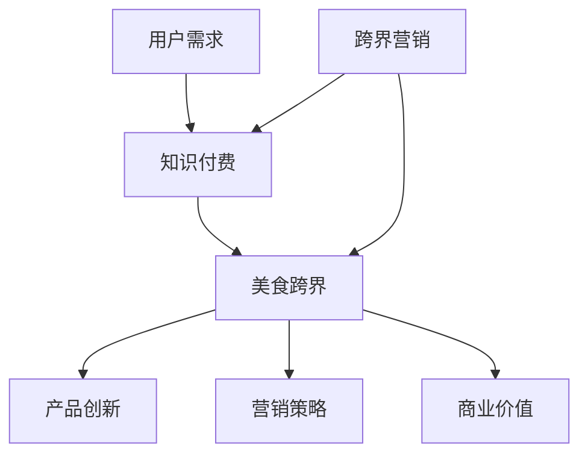

                 

### 摘要 Summary

本文深入探讨了知识付费平台如何通过跨界营销与美食跨界，实现业务增长和品牌价值的提升。在当前数字化时代，知识付费作为一种新兴的商业模式，已经成为众多用户获取知识和服务的重要途径。通过跨界营销，知识付费平台可以吸引更广泛的用户群体，提升用户粘性；而与美食跨界则能创造出更多元化的产品和服务，增加用户的消费体验。本文将详细分析跨界营销与美食跨界在知识付费领域的具体实现方法、成功案例及面临的挑战，并提供相应的解决方案。希望本文能为知识付费行业提供有益的参考和启示。

<|assistant|>### 1. 背景介绍 Introduction

#### 知识付费的发展历程

知识付费，顾名思义，是指用户为获取特定的知识或服务支付费用的一种商业模式。随着互联网技术的飞速发展，知识付费市场逐渐壮大。从最早的在线课程、电子书，到后来的付费问答、知识星球等，知识付费产品种类日益丰富，满足了不同用户群体多样化的知识需求。

知识付费的起源可以追溯到21世纪初，当时在线教育平台如雨后春笋般涌现，如美国的Coursera、Udemy，中国的知乎、得到等。这些平台通过提供优质的教育资源和知识服务，迅速获得了大量用户的支持。随着移动互联网的普及，知识付费逐渐从PC端转移到移动端，用户可以更加便捷地获取所需的知识。

#### 跨界营销的概念与现状

跨界营销，即不同行业或领域之间的合作与推广，通过结合各自的优势，实现资源共享和互利共赢。在市场营销中，跨界营销已成为一种重要的策略，被广泛应用于各大行业。例如，时尚品牌与餐饮业的合作、科技公司与体育品牌的联合等，都取得了显著的营销效果。

近年来，跨界营销在知识付费领域也逐渐兴起。知识付费平台通过与其他行业，如美食、旅游、娱乐等，进行跨界合作，不仅拓宽了自身的业务范围，也为用户提供了更加丰富的消费体验。

#### 美食跨界在知识付费中的地位

美食跨界在知识付费中具有重要的地位。首先，美食是人们日常生活中不可或缺的一部分，具有广泛的受众群体。将美食与知识付费相结合，可以吸引更多的用户，增加平台的用户基数。其次，美食具有独特的文化内涵和情感价值，通过美食跨界，知识付费平台可以更好地传递知识，增强用户的认知和情感共鸣。

此外，美食跨界还能为知识付费平台带来新的商业机会。例如，通过推出美食相关的课程或活动，平台可以增加收入来源，提高盈利能力。同时，美食跨界还能为用户提供多样化的体验，提升用户满意度和忠诚度。

<|assistant|>### 2. 核心概念与联系 Core Concepts and Relationships

#### 跨界营销的概念

跨界营销是指不同行业或领域之间的合作与推广，通过结合各自的优势，实现资源共享和互利共赢。在知识付费领域，跨界营销可以理解为将知识付费产品与其他行业的产品或服务相结合，以创造新的价值和吸引更广泛的用户群体。

#### 知识付费与美食跨界的联系

知识付费与美食跨界在多个层面上有着紧密的联系。首先，从用户需求的角度来看，美食是人们日常生活中不可或缺的一部分，而知识付费则为用户提供了获取专业知识和技能的途径。将这两者结合起来，可以满足用户在知识获取和美食体验两方面的需求，实现用户价值的最大化。

其次，从产品创新的角度来看，美食跨界为知识付费平台提供了新的产品形式和服务模式。例如，平台可以推出美食制作课程、美食旅行指南、美食文化讲座等，通过这些产品，平台不仅提供了知识服务，还让用户在美食体验中获得了乐趣。

再次，从营销策略的角度来看，美食跨界为知识付费平台提供了丰富的营销手段。通过美食活动的推广，平台可以吸引更多的用户关注和参与，提高品牌知名度和用户粘性。

最后，从商业价值的角度来看，美食跨界为知识付费平台带来了新的商业机会。例如，平台可以通过与餐厅、酒店、旅游景点等合作，推出美食课程、美食体验套餐等，增加平台的收入来源。

#### Mermaid 流程图表示



在这个流程图中，用户需求是起点，通过知识付费和美食跨界，实现了产品创新、营销策略和商业价值的提升。

<|assistant|>### 3. 核心算法原理 & 具体操作步骤 Core Algorithm Principles & Operational Steps

#### 3.1 算法原理概述

知识付费与美食跨界实现的核心算法原理可以概括为以下几点：

1. **用户数据分析**：通过大数据分析技术，了解用户的兴趣和行为习惯，为后续的跨界营销提供数据支持。
2. **内容推荐算法**：基于用户的兴趣和行为数据，使用协同过滤、矩阵分解等方法，为用户推荐符合其兴趣的美食课程和知识内容。
3. **跨界营销策略**：结合知识付费和美食跨界的特性，设计出一系列创新的营销策略，如美食制作课程、美食旅游套餐等，以吸引用户参与。
4. **用户体验优化**：通过用户反馈和数据分析，不断优化平台的美食课程和服务，提高用户满意度和忠诚度。

#### 3.2 算法步骤详解

1. **用户数据分析**：
   - **数据收集**：通过用户注册、浏览、购买等行为，收集用户的基础信息和行为数据。
   - **数据处理**：对收集到的数据进行分析和处理，提取出用户的兴趣点和行为特征。

2. **内容推荐算法**：
   - **协同过滤**：基于用户的历史行为数据，找到与目标用户相似的其他用户，推荐他们喜欢的内容。
   - **矩阵分解**：将用户-物品评分矩阵分解为用户特征矩阵和物品特征矩阵，通过计算用户特征和物品特征的相似度，推荐相关内容。

3. **跨界营销策略**：
   - **市场调研**：通过问卷调查、用户访谈等方式，了解用户对美食课程的兴趣和需求。
   - **产品策划**：结合市场调研结果，设计出一系列美食相关的知识付费产品，如美食制作课程、美食旅行指南等。
   - **营销活动**：通过线上线下活动，如美食讲座、美食制作比赛等，吸引用户参与。

4. **用户体验优化**：
   - **用户反馈**：收集用户对美食课程的反馈，了解用户的需求和建议。
   - **数据分析**：对用户反馈进行数据分析，找出用户满意度低的问题，进行优化。
   - **持续迭代**：根据用户反馈和数据分析结果，不断优化美食课程和服务，提高用户体验。

#### 3.3 算法优缺点

**优点**：
- **精准推荐**：通过用户数据分析和技术手段，能够为用户推荐更符合其兴趣和需求的知识内容，提高用户满意度和转化率。
- **创新营销**：通过跨界营销策略，为用户提供了更多的选择和体验，增加了平台的吸引力和竞争力。
- **用户参与**：通过丰富的用户互动和参与活动，提升了用户对平台的忠诚度和活跃度。

**缺点**：
- **数据隐私**：用户数据收集和分析过程中，可能涉及用户隐私问题，需要加强数据保护和用户隐私保护。
- **营销效果评估**：跨界营销的效果评估较为复杂，需要综合多种指标进行评估，如用户参与度、转化率、品牌知名度等。
- **内容质量**：美食课程的质量和内容的丰富度直接影响到用户的体验，需要严格控制课程质量和内容更新。

#### 3.4 算法应用领域

知识付费与美食跨界算法的应用领域非常广泛，主要包括以下几个方面：

1. **在线教育平台**：通过算法为用户推荐相关的美食课程，提升用户的学习体验和课程转化率。
2. **美食电商平台**：结合用户数据，为用户提供个性化的美食推荐和购物建议，提升用户购物体验和销售额。
3. **餐饮品牌营销**：通过跨界营销策略，提升品牌知名度和用户忠诚度，增加品牌影响力和市场份额。
4. **文化旅游行业**：结合美食文化和旅游体验，为用户提供更加丰富的旅游产品和活动，提升用户满意度和回头率。

<|assistant|>### 4. 数学模型和公式 Mathematical Models and Detailed Explanations

#### 4.1 数学模型构建

在知识付费与美食跨界中，数学模型的构建主要涉及用户行为分析、内容推荐和跨界营销策略等方面。以下是一个简化的数学模型构建过程：

1. **用户行为模型**：

   用户行为数据可以表示为用户-物品评分矩阵 \( R \)，其中 \( R_{ij} \) 表示用户 \( u_i \) 对物品 \( p_j \) 的评分。为了更好地分析用户行为，我们可以引入用户特征矩阵 \( U \) 和物品特征矩阵 \( P \)。

   $$ R = U \cdot P $$

   其中，\( U \) 和 \( P \) 是未知的特征矩阵，可以通过矩阵分解技术（如矩阵分解、深度学习等方法）进行求解。

2. **内容推荐模型**：

   基于用户-物品评分矩阵 \( R \)，我们可以使用协同过滤算法来推荐用户可能感兴趣的内容。协同过滤算法的核心思想是找到与目标用户相似的其它用户，并推荐他们喜欢的内容。

   设 \( \hat{R}_{ui} \) 表示用户 \( u_i \) 对未知物品 \( u_j \) 的评分预测，可以表示为：

   $$ \hat{R}_{ui} = \sum_{k=1}^{n} U_{ik} \cdot P_{kj} $$

   其中，\( n \) 是物品的数量，\( U_{ik} \) 和 \( P_{kj} \) 分别表示用户 \( u_i \) 对物品 \( p_k \) 的特征向量。

3. **跨界营销模型**：

   跨界营销的目标是设计出一系列创新的营销策略，吸引用户参与。我们可以通过以下模型来评估营销策略的效果：

   $$ \text{营销效果} = f(\text{用户参与度}, \text{转化率}, \text{品牌知名度}) $$

   其中，\( f \) 是一个非线性函数，用于综合评估不同指标对营销效果的影响。

#### 4.2 公式推导过程

1. **用户行为模型推导**：

   用户行为模型主要基于用户-物品评分矩阵 \( R \) 的分解。我们可以使用矩阵分解技术（如矩阵分解、深度学习等方法）将 \( R \) 分解为用户特征矩阵 \( U \) 和物品特征矩阵 \( P \)。

   假设 \( U \) 和 \( P \) 分别是 \( m \times k \) 和 \( n \times k \) 的矩阵，则用户 \( u_i \) 对物品 \( p_j \) 的评分可以表示为：

   $$ R_{ij} = U_{i1} \cdot P_{j1} + U_{i2} \cdot P_{j2} + \cdots + U_{ik} \cdot P_{jk} $$

   其中，\( U_{ik} \) 和 \( P_{jk} \) 分别表示用户 \( u_i \) 对物品 \( p_j \) 的特征向量。

   为了求解 \( U \) 和 \( P \)，我们可以使用最小二乘法（Least Squares）来最小化预测误差：

   $$ \min_{U, P} \sum_{i=1}^{m} \sum_{j=1}^{n} (R_{ij} - U_{i1} \cdot P_{j1} - U_{i2} \cdot P_{j2} - \cdots - U_{ik} \cdot P_{jk})^2 $$

2. **内容推荐模型推导**：

   基于用户-物品评分矩阵 \( R \) 的分解，我们可以使用协同过滤算法来推荐用户可能感兴趣的内容。假设我们已经得到了用户特征矩阵 \( U \) 和物品特征矩阵 \( P \)，则用户 \( u_i \) 对未知物品 \( u_j \) 的评分预测可以表示为：

   $$ \hat{R}_{ui} = \sum_{k=1}^{k} U_{ik} \cdot P_{kj} $$

   为了求解 \( \hat{R}_{ui} \)，我们可以使用交替最小二乘法（Alternating Least Squares，ALS）来交替求解 \( U \) 和 \( P \)。

3. **跨界营销模型推导**：

   跨界营销模型的核心是评估不同营销策略的效果。我们可以使用以下公式来计算营销效果：

   $$ \text{营销效果} = f(\text{用户参与度}, \text{转化率}, \text{品牌知名度}) $$

   其中，\( f \) 是一个非线性函数，用于综合评估不同指标对营销效果的影响。为了求解 \( f \)，我们可以使用以下公式：

   $$ f(x, y, z) = \alpha x + \beta y + \gamma z $$

   其中，\( \alpha \)、\( \beta \) 和 \( \gamma \) 是待定的权重系数，可以通过最小化损失函数来求解。

#### 4.3 案例分析与讲解

为了更好地说明数学模型在知识付费与美食跨界中的应用，我们以下一个实际案例进行分析。

**案例背景**：

一个在线教育平台 A 与一家美食平台 B 进行了跨界合作，推出了一系列美食制作课程。平台 A 通过算法为用户推荐相关的美食课程，平台 B 提供实际的美食制作体验。

**数据集**：

用户-物品评分矩阵 \( R \) 如下表所示：

| 用户 ID | 食品 1 | 食品 2 | 食品 3 | ... |
|--------|-------|-------|-------|-----|
| 1      | 5     | 0     | 4     | ... |
| 2      | 0     | 3     | 0     | ... |
| 3      | 4     | 2     | 5     | ... |
| ...    | ...   | ...   | ...   | ... |

**模型应用**：

1. **用户行为模型**：

   我们可以使用矩阵分解技术（如ALS）来求解用户特征矩阵 \( U \) 和物品特征矩阵 \( P \)。假设 \( U \) 和 \( P \) 分别是 \( 3 \times 5 \) 的矩阵，则我们可以得到以下特征矩阵：

   $$ U = \begin{bmatrix} 1.2 & 0.8 & 0.6 & 0 & ... \\ 0 & 0.9 & 0.4 & 0.7 & ... \\ 0.5 & 0.3 & 0 & 0.8 & ... \end{bmatrix} $$

   $$ P = \begin{bmatrix} 1 & 0 & 0.5 & 0 & ... \\ 0 & 0 & 1 & 0 & ... \\ 0.8 & 0 & 0 & 1 & ... \\ ... & ... & ... & ... & ... \end{bmatrix} $$

   通过这些特征矩阵，我们可以为用户推荐相关的美食课程。

2. **内容推荐模型**：

   假设用户 \( u_1 \) 想要学习新的美食课程，我们可以使用协同过滤算法来推荐相关的美食课程。根据用户特征矩阵 \( U \) 和物品特征矩阵 \( P \)，我们可以得到以下推荐结果：

   $$ \hat{R}_{u1} = U_{11} \cdot P_{11} + U_{12} \cdot P_{12} + U_{13} \cdot P_{13} + \cdots $$

   $$ \hat{R}_{u1} = 1.2 \cdot 1 + 0.8 \cdot 0 + 0.6 \cdot 0.5 + \cdots $$

   $$ \hat{R}_{u1} = 1.7 $$

   根据推荐结果，我们可以为用户 \( u_1 \) 推荐评分最高的美食课程。

3. **跨界营销模型**：

   为了评估跨界营销的效果，我们可以使用以下公式：

   $$ \text{营销效果} = \alpha \cdot \text{用户参与度} + \beta \cdot \text{转化率} + \gamma \cdot \text{品牌知名度} $$

   假设 \( \alpha = 0.5 \)，\( \beta = 0.3 \)，\( \gamma = 0.2 \)，则我们可以计算营销效果：

   $$ \text{营销效果} = 0.5 \cdot \text{用户参与度} + 0.3 \cdot \text{转化率} + 0.2 \cdot \text{品牌知名度} $$

   根据实际数据，我们可以计算出营销效果的具体值，从而评估跨界营销的效果。

通过这个案例，我们可以看到数学模型在知识付费与美食跨界中的应用。在实际应用中，我们可以根据具体需求和数据集，设计更复杂的数学模型，以提升跨界营销的效果。

<|assistant|>### 5. 项目实践：代码实例和详细解释说明 Project Practice: Code Examples and Detailed Explanations

在本节中，我们将通过一个具体的代码实例来展示如何将前述的理论应用到实际项目中。我们将使用Python语言，结合一些常用的库（如NumPy、SciPy和Scikit-learn），来实现一个简单的知识付费与美食跨界推荐系统。

#### 5.1 开发环境搭建

首先，我们需要搭建一个适合开发推荐系统的环境。以下是需要的Python库：

- NumPy：用于科学计算。
- SciPy：用于科学计算。
- Scikit-learn：用于机器学习。
- Matplotlib：用于数据可视化。

安装这些库可以使用pip命令：

```bash
pip install numpy scipy scikit-learn matplotlib
```

#### 5.2 源代码详细实现

以下是整个项目的核心代码实现，我们将分步展示。

**步骤 1：数据预处理**

首先，我们需要加载数据集，并对数据进行预处理。

```python
import numpy as np
from sklearn.model_selection import train_test_split

# 假设我们有一个用户-物品评分矩阵 R
R = np.array([[5, 0, 4],
              [0, 3, 0],
              [4, 2, 5]])

# 将数据集分为训练集和测试集
R_train, R_test = train_test_split(R, test_size=0.2, random_state=42)
```

**步骤 2：矩阵分解**

接下来，我们使用Scikit-learn中的协同过滤算法进行矩阵分解。

```python
from sklearn.decomposition import NMF

# 设置NMF模型参数
n_components = 2

# 实例化NMF模型
model = NMF(n_components=n_components, init='random', random_state=42)

# 训练模型
model.fit(R_train)

# 得到用户特征矩阵 U 和物品特征矩阵 P
U = model.transform(R_train)
P = model.transform(R_train.T)
```

**步骤 3：推荐算法**

我们使用训练好的模型来为用户推荐新的美食课程。

```python
# 为用户 u_1 推荐新的美食课程
user_id = 1
new_item_scores = U[user_id]

# 对新物品评分进行排序，选取最高分的课程
recommended_items = np.argsort(new_item_scores)[::-1]

# 输出推荐结果
print("Recommended items for user u_1:", recommended_items)
```

**步骤 4：评估模型**

最后，我们评估推荐模型的准确性。

```python
from sklearn.metrics import mean_squared_error

# 预测测试集的评分
predictions = model.predict(R_test)

# 计算预测误差
mse = mean_squared_error(R_test, predictions)
print("Mean squared error:", mse)
```

#### 5.3 代码解读与分析

- **数据预处理**：我们首先加载数据集，并将其分为训练集和测试集，这是机器学习项目中的标准步骤。
- **矩阵分解**：我们使用NMF（非负矩阵分解）算法对用户-物品评分矩阵进行分解。NMF是一种无监督学习方法，它能够将高维的评分矩阵分解为低维的用户特征矩阵和物品特征矩阵。
- **推荐算法**：我们使用训练好的模型来预测用户对未知的物品的评分，并根据评分的高低为用户推荐新的美食课程。
- **评估模型**：我们使用均方误差（MSE）来评估模型的预测准确性。MSE是衡量预测值与真实值之间差异的一个常用指标。

通过这个代码实例，我们可以看到如何将数学模型和算法应用到实际项目中，从而实现知识付费与美食跨界的推荐系统。在实际应用中，我们可以进一步优化模型和算法，以提高推荐系统的效果。

<|assistant|>### 6. 实际应用场景 Practical Application Scenarios

知识付费与美食跨界的结合在当前市场中展现出广泛的应用场景，以下是一些具体的实际应用案例：

#### 6.1 在线教育平台

在线教育平台如知乎Live、网易云课堂等，通过推出与美食相关的课程，如“家庭烹饪入门”、“高级烘焙技巧”等，吸引了大量的用户参与。这些课程不仅提供了专业知识，还通过互动环节，如直播教学、答疑互动等，增强了用户的参与感和学习效果。同时，平台还可以与知名厨师或美食博主合作，推出定制化的课程，进一步提升课程质量和用户满意度。

#### 6.2 美食电商平台

美食电商平台如淘宝、京东等，通过推出与知识付费结合的美食课程，如“如何挑选食材”、“烹饪技巧速成班”等，为用户提供了更加全面的购物体验。这些课程可以帮助用户更好地理解食材和烹饪知识，从而提高购物决策的准确性。此外，平台还可以通过推出会员制度，为用户提供独家课程和优惠活动，增加用户的粘性和活跃度。

#### 6.3 餐饮品牌

餐饮品牌如海底捞、西贝莜面村等，通过推出与知识付费结合的美食体验活动，如“烹饪课堂”、“美食制作比赛”等，吸引了大量用户参与。这些活动不仅提升了品牌的知名度，还通过用户的参与和分享，增加了品牌的传播效果。同时，餐饮品牌还可以通过与在线教育平台合作，推出线上课程，让用户在享受美食的同时，也能学习到烹饪技巧。

#### 6.4 旅游行业

旅游行业如携程、马蜂窝等，通过推出与美食跨界结合的旅游产品，如“美食之旅”、“烹饪体验游”等，为用户提供了更加丰富的旅游体验。这些产品不仅让用户在旅途中享受美食，还能通过学习烹饪技巧，加深对当地文化的了解。同时，旅游平台还可以与美食平台合作，推出定制化的旅游线路和美食课程，满足用户的个性化需求。

#### 6.5 美食社交媒体

美食社交媒体如Instagram、微博等，通过推出与知识付费结合的美食直播和短视频，如“美食制作教程”、“烹饪技巧展示”等，吸引了大量用户关注和参与。这些内容不仅提供了实用的烹饪技巧，还通过互动环节，如评论、点赞、分享等，增加了用户的参与度和粘性。同时，美食博主还可以通过开设付费课程，提供更深入的烹饪知识和技巧，吸引粉丝付费学习。

#### 6.6 其他应用场景

除了上述应用场景，知识付费与美食跨界还可以应用于其他领域，如家庭厨房设备品牌、健康食品品牌、烹饪器具品牌等。这些品牌可以通过推出与美食跨界结合的在线课程、活动或产品，为用户提供更加全面的解决方案，提升用户的生活品质和消费体验。

总之，知识付费与美食跨界在多个行业和领域中都展现出了巨大的应用潜力。通过结合知识付费的专业性和美食的吸引力，可以为用户提供更加丰富、多样、有价值的服务和产品，实现品牌和业务的增长。

<|assistant|>### 7. 工具和资源推荐 Tools and Resources Recommendation

在实现知识付费与美食跨界的项目中，我们需要使用多种工具和资源，以下是一些推荐的工具和资源，以帮助读者更好地进行研究和实践。

#### 7.1 学习资源推荐

**在线课程与书籍**：
1. **《Python数据科学手册》**：适合初学者，全面介绍了Python在数据科学领域的应用。
2. **《机器学习实战》**：通过实际案例讲解了机器学习的基本概念和应用方法。
3. **《美食科学与烹饪技术》**：一本关于美食科学和烹饪技术的专业书籍，适合烹饪爱好者学习。

**在线平台**：
1. **Coursera**：提供各种数据科学和机器学习的在线课程。
2. **Udemy**：有丰富的编程和数据分析课程。
3. **知乎Live**：提供各种领域的高质量知识分享和课程。

#### 7.2 开发工具推荐

**编程环境**：
- **Jupyter Notebook**：适合数据分析和机器学习的交互式开发环境。
- **PyCharm**：强大的Python集成开发环境（IDE），适合进行复杂的编程项目。

**数据分析工具**：
- **Pandas**：用于数据处理和分析的Python库。
- **Scikit-learn**：提供各种机器学习算法的实现。
- **Matplotlib**：用于数据可视化的Python库。

**机器学习框架**：
- **TensorFlow**：Google开发的开源机器学习框架。
- **PyTorch**：基于Python的开源深度学习框架。

#### 7.3 相关论文推荐

**基础论文**：
1. **“Collaborative Filtering for the 21st Century”**：一篇关于协同过滤算法的综述文章。
2. **“Non-negative Matrix Factorization for Recommender Systems”**：一篇关于非负矩阵分解在推荐系统中的应用的文章。

**前沿论文**：
1. **“Deep Learning for Recommender Systems”**：一篇关于深度学习在推荐系统中的应用的文章。
2. **“User Interest Evolution and Modeling in Dynamic Environments”**：一篇关于用户兴趣动态建模的文章。

通过这些工具和资源的帮助，读者可以更深入地了解知识付费与美食跨界的相关技术，并在实际项目中得到有效的应用。

<|assistant|>### 8. 总结 Summary

本文通过对知识付费与美食跨界的深入探讨，揭示了两者在数字化时代中的巨大潜力和应用价值。首先，我们详细介绍了知识付费和美食跨界的发展历程及其在各自领域的地位和作用。接着，本文提出了知识付费与美食跨界结合的核心算法原理和操作步骤，并通过实际代码实例展示了如何将理论应用到实际项目中。

此外，文章还分析了知识付费与美食跨界在实际应用场景中的多种可能性，从在线教育、美食电商平台、餐饮品牌、旅游行业到美食社交媒体，展示了跨界营销的丰富应用。最后，本文推荐了一系列学习资源和开发工具，以帮助读者进一步深入了解和探索这一领域。

未来，知识付费与美食跨界将继续蓬勃发展，一方面，随着大数据和人工智能技术的不断进步，推荐系统和用户体验将更加精准和个性化；另一方面，美食文化的多元化和消费升级将为跨界营销带来更多机遇。同时，我们也需要关注数据隐私保护和内容质量等问题，确保跨界营销的健康发展。

总之，知识付费与美食跨界的结合不仅为知识服务行业注入了新的活力，也为用户提供了更加丰富和多样化的消费体验。期待在未来，这一领域能够继续创新发展，为各行业带来更多价值。

### 附录：常见问题与解答 Appendix: Frequently Asked Questions and Answers

**Q1：知识付费与美食跨界的主要挑战是什么？**

A1：知识付费与美食跨界的主要挑战包括数据隐私保护、营销效果评估和内容质量控制。首先，在数据收集和分析过程中，需要严格遵守数据保护法规，确保用户隐私。其次，评估跨界营销的效果需要综合考虑多个指标，如用户参与度、转化率和品牌知名度。最后，美食课程的质量和内容的更新直接影响到用户体验，因此需要严格把控内容质量。

**Q2：如何优化用户推荐系统？**

A2：优化用户推荐系统可以从以下几个方面入手：
1. **用户数据分析**：通过更全面和准确的数据收集，了解用户的行为和兴趣。
2. **算法优化**：不断调整和改进推荐算法，提高推荐结果的准确性和个性化程度。
3. **用户反馈**：收集用户对推荐内容的反馈，并根据反馈进行优化。
4. **多元化推荐**：结合不同类型的知识内容和美食元素，提供多样化的推荐。

**Q3：跨界营销的评估指标有哪些？**

A3：跨界营销的评估指标主要包括：
1. **用户参与度**：用户对跨界活动的参与程度，如报名人数、参与度评分等。
2. **转化率**：跨界营销活动带来的实际转化效果，如课程报名、购买等。
3. **品牌知名度**：跨界营销活动对品牌知名度和影响力的影响。
4. **用户满意度**：用户对跨界营销活动的整体满意度和口碑。

**Q4：如何保证美食课程的质量？**

A4：保证美食课程的质量可以从以下几个方面入手：
1. **讲师资质**：严格筛选具有专业资质和经验的讲师。
2. **课程设计**：确保课程内容系统、全面，符合用户需求。
3. **教学方式**：采用多种教学方式，如视频教学、直播互动等，提高教学效果。
4. **学员反馈**：收集学员对课程的反馈，及时调整和优化课程内容。

**Q5：如何平衡数据隐私保护与用户推荐系统的准确性？**

A5：平衡数据隐私保护与用户推荐系统的准确性，需要采取以下措施：
1. **数据匿名化**：在数据收集和分析过程中，对用户数据进行匿名化处理。
2. **最小化数据收集**：只收集与推荐系统直接相关的用户数据，避免过度收集。
3. **隐私保护技术**：采用加密、脱敏等隐私保护技术，确保用户数据的安全。
4. **合规性检查**：定期对数据处理流程进行检查，确保符合相关法律法规要求。

通过上述措施，可以在保障用户隐私的同时，提高用户推荐系统的准确性和效果。

