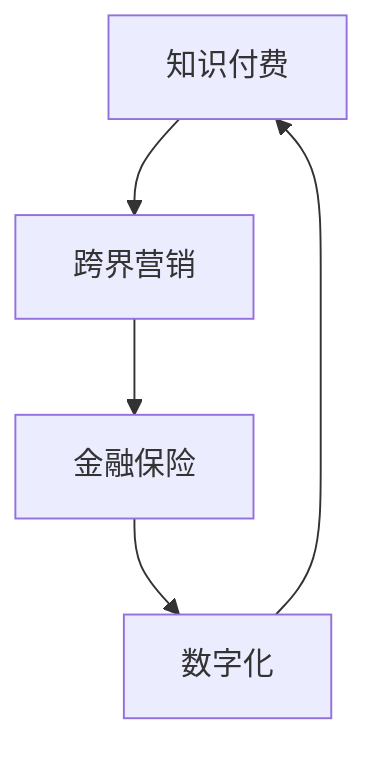

                 

 **关键词：** 知识付费、跨界营销、金融保险、数字化、用户体验、技术创新

**摘要：** 本文将探讨知识付费如何在营销与金融保险领域实现跨界融合。通过分析知识付费的市场现状、跨界营销的策略和金融保险的应用，本文旨在为从业者提供有价值的参考，助力知识付费行业在竞争激烈的市场中脱颖而出。

## 1. 背景介绍

知识付费，作为互联网时代的新兴商业模式，旨在为用户提供有价值的信息和知识服务，从而实现知识变现。随着用户对个性化、专业化和高品质内容的需求日益增长，知识付费市场呈现出蓬勃发展的态势。然而，在激烈的市场竞争中，如何实现跨界营销与金融保险的融合，成为知识付费平台亟需解决的重要问题。

跨界营销，是指企业利用不同领域的资源和优势，通过跨界合作和创新手段，实现品牌价值的最大化。在金融保险领域，跨界营销主要体现在与知识付费平台的合作，通过整合双方资源，为用户提供一站式的综合服务。

金融保险，作为传统行业，近年来也在积极探索与新兴产业的融合。通过引入知识付费的理念，金融保险行业可以提供更加个性化和专业的服务，满足用户多样化的需求。

## 2. 核心概念与联系

为了更好地理解知识付费在营销与金融保险领域的跨界融合，我们需要先了解以下几个核心概念：

### 2.1 知识付费

知识付费是指用户通过付费方式获取专业知识和信息的服务。其核心价值在于为用户提供有价值的内容，实现知识的变现。

### 2.2 跨界营销

跨界营销是指企业利用不同领域的资源和优势，通过跨界合作和创新手段，实现品牌价值的最大化。

### 2.3 金融保险

金融保险是指为用户提供的风险管理和资金保障服务。其核心价值在于为用户提供财务安全和保障。

### 2.4 数字化

数字化是指将传统业务流程、管理模式和数据资源进行数字化处理，实现业务的高效运营和管理。

下面是一个简化的 Mermaid 流程图，展示知识付费、跨界营销、金融保险和数字化之间的关系：



## 3. 核心算法原理 & 具体操作步骤

### 3.1 算法原理概述

知识付费在营销与金融保险领域的跨界融合，主要依赖于以下几个核心算法原理：

1. **用户画像分析**：通过对用户的行为数据进行分析，构建用户画像，实现精准推荐和个性化服务。
2. **风险评估模型**：基于大数据和人工智能技术，构建风险评估模型，为用户提供个性化的金融保险产品。
3. **数据挖掘算法**：通过对用户数据、市场数据和业务数据的挖掘，发现潜在的商业机会和用户需求。
4. **区块链技术**：利用区块链技术的去中心化和不可篡改特性，保障知识付费和金融保险交易的安全和透明。

### 3.2 算法步骤详解

1. **用户画像分析**：
   - 数据收集：收集用户在知识付费平台的行为数据，如浏览记录、购买记录、评价等。
   - 数据清洗：对收集到的数据进行处理，去除噪声数据和异常值。
   - 特征提取：对清洗后的数据进行特征提取，如用户年龄、性别、职业、教育程度等。
   - 构建用户画像：利用机器学习算法，对用户特征进行聚类和分类，构建用户画像。

2. **风险评估模型**：
   - 数据收集：收集用户在金融保险领域的相关数据，如信用记录、还款能力、健康状况等。
   - 数据预处理：对收集到的数据进行预处理，包括缺失值填补、异常值处理等。
   - 模型构建：利用机器学习算法，如逻辑回归、决策树、随机森林等，构建风险评估模型。
   - 模型评估：利用交叉验证、AUC、KS等指标对模型进行评估和优化。

3. **数据挖掘算法**：
   - 数据收集：收集用户、市场、业务等多方面的数据。
   - 数据预处理：对收集到的数据进行预处理，包括数据清洗、特征工程等。
   - 挖掘算法：利用数据挖掘算法，如关联规则挖掘、分类算法、聚类算法等，发现潜在的商业机会和用户需求。

4. **区块链技术**：
   - 数据存储：将知识付费和金融保险交易数据存储在区块链上，实现去中心化和不可篡改。
   - 交易验证：利用区块链技术的共识算法，对交易数据进行验证和确认。
   - 智能合约：利用智能合约，自动执行知识付费和金融保险的交易流程。

### 3.3 算法优缺点

1. **用户画像分析**：
   - 优点：实现精准推荐和个性化服务，提高用户体验和满意度。
   - 缺点：数据收集和处理过程中可能存在隐私泄露和数据滥用问题。

2. **风险评估模型**：
   - 优点：为用户提供个性化的金融保险产品，降低风险。
   - 缺点：模型构建和评估过程复杂，需要大量的数据支持和计算资源。

3. **数据挖掘算法**：
   - 优点：发现潜在的商业机会和用户需求，提高业务洞察力。
   - 缺点：数据质量和预处理过程对算法效果有较大影响。

4. **区块链技术**：
   - 优点：保障交易的安全和透明，降低交易成本。
   - 缺点：区块链技术本身存在性能瓶颈和可扩展性问题。

### 3.4 算法应用领域

1. **用户画像分析**：广泛应用于电商平台、社交媒体、在线教育等领域。
2. **风险评估模型**：广泛应用于金融保险、信贷审批、风险控制等领域。
3. **数据挖掘算法**：广泛应用于市场分析、业务优化、用户行为预测等领域。
4. **区块链技术**：广泛应用于数字货币、供应链金融、智能合约等领域。

## 4. 数学模型和公式 & 详细讲解 & 举例说明

### 4.1 数学模型构建

在知识付费、跨界营销和金融保险的跨界融合中，我们可以构建以下几个数学模型：

1. **用户画像模型**：
   - 用户画像 = f（用户行为数据，用户特征数据，业务数据）
   - f 表示用户画像的生成过程，包括特征提取、聚类和分类等步骤。

2. **风险评估模型**：
   - 风险评估 = f（用户数据，市场数据，业务数据）
   - f 表示风险评估的过程，包括数据预处理、模型构建和评估等步骤。

3. **数据挖掘模型**：
   - 数据挖掘结果 = f（原始数据，预处理数据，挖掘算法）
   - f 表示数据挖掘的过程，包括数据预处理、特征选择、模型选择和评估等步骤。

4. **区块链交易模型**：
   - 交易结果 = f（交易数据，共识算法，智能合约）
   - f 表示区块链交易的过程，包括数据存储、验证和执行等步骤。

### 4.2 公式推导过程

1. **用户画像模型**：

   用户画像的生成过程可以分为以下几个步骤：

   - 特征提取：用户行为数据 -> 特征数据
   - 聚类：特征数据 -> 聚类结果
   - 分类：特征数据 -> 分类结果

   假设用户行为数据为 X，用户特征数据为 Y，业务数据为 Z，用户画像为 U，则有：

   U = f（X，Y，Z）

   其中，f 表示用户画像的生成函数，可以根据具体业务场景进行调整。

2. **风险评估模型**：

   风险评估的生成过程可以分为以下几个步骤：

   - 数据预处理：用户数据 -> 预处理数据
   - 模型构建：预处理数据 -> 模型
   - 模型评估：模型 -> 评估结果

   假设用户数据为 X，市场数据为 Y，业务数据为 Z，风险评估结果为 R，则有：

   R = f（X，Y，Z）

   其中，f 表示风险评估的生成函数，可以根据具体业务场景进行调整。

3. **数据挖掘模型**：

   数据挖掘的生成过程可以分为以下几个步骤：

   - 数据预处理：原始数据 -> 预处理数据
   - 特征选择：预处理数据 -> 特征选择结果
   - 模型选择：预处理数据 -> 模型选择结果
   - 模型评估：模型选择结果 -> 评估结果

   假设原始数据为 X，预处理数据为 Y，挖掘算法为 Z，数据挖掘结果为 D，则有：

   D = f（X，Y，Z）

   其中，f 表示数据挖掘的生成函数，可以根据具体业务场景进行调整。

4. **区块链交易模型**：

   区块链交易的生成过程可以分为以下几个步骤：

   - 数据存储：交易数据 -> 数据存储
   - 交易验证：交易数据 -> 验证结果
   - 智能合约：交易数据 -> 执行结果

   假设交易数据为 X，共识算法为 Y，智能合约为 Z，交易结果为 R，则有：

   R = f（X，Y，Z）

   其中，f 表示区块链交易的生成函数，可以根据具体业务场景进行调整。

### 4.3 案例分析与讲解

为了更好地理解上述数学模型的实际应用，我们来看一个具体的案例。

**案例：** 一个知识付费平台与金融保险公司合作，为用户提供一站式服务。

1. **用户画像模型**：

   假设该平台收集了用户 A 的以下数据：

   - 用户行为数据：浏览了投资理财课程，购买了保险产品
   - 用户特征数据：年龄 30 岁，男性，本科学历，从事金融行业
   - 业务数据：投资理财课程满意度高，保险产品理赔速度快

   利用用户画像模型，我们可以生成用户 A 的用户画像：

   U_A = f（X_A，Y_A，Z_A）

   其中，X_A 表示用户行为数据，Y_A 表示用户特征数据，Z_A 表示业务数据。

2. **风险评估模型**：

   假设该平台收集了用户 A 的以下数据：

   - 用户数据：信用评分高，无逾期还款记录
   - 市场数据：金融行业整体风险较低
   - 业务数据：平台历史理赔率 98%

   利用风险评估模型，我们可以生成用户 A 的风险评估结果：

   R_A = f（X_A，Y_A，Z_A）

   其中，X_A 表示用户数据，Y_A 表示市场数据，Z_A 表示业务数据。

3. **数据挖掘模型**：

   假设该平台收集了以下数据：

   - 原始数据：用户 A 的浏览记录、购买记录、评价等
   - 预处理数据：去除噪声数据、填充缺失值等
   - 挖掘算法：关联规则挖掘、分类算法等

   利用数据挖掘模型，我们可以发现用户 A 的潜在需求：

   D_A = f（X_A，Y_A，Z_A）

   其中，X_A 表示原始数据，Y_A 表示预处理数据，Z_A 表示挖掘算法。

4. **区块链交易模型**：

   假设用户 A 在平台上购买了保险产品，交易数据包括：

   - 交易数据：用户 A 的购买记录、支付金额、支付方式等
   - 共识算法：基于工作量证明的共识算法
   - 智能合约：自动执行理赔流程

   利用区块链交易模型，我们可以完成用户 A 的保险交易：

   R_A = f（X_A，Y_A，Z_A）

   其中，X_A 表示交易数据，Y_A 表示共识算法，Z_A 表示智能合约。

## 5. 项目实践：代码实例和详细解释说明

### 5.1 开发环境搭建

为了实现知识付费在营销与金融保险领域的跨界融合，我们需要搭建以下开发环境：

1. **知识付费平台**：使用 Python 编写后端服务，包括用户画像分析、风险评估模型和数据挖掘算法。
2. **金融保险服务**：使用 Java 编写后端服务，包括区块链交易模型和智能合约。
3. **数据库**：使用 MySQL 存储用户数据、交易数据和业务数据。
4. **开发工具**：使用 Eclipse、PyCharm、Git 等开发工具。

### 5.2 源代码详细实现

1. **用户画像分析**：

   用户画像分析的核心是用户数据的收集、清洗、特征提取和聚类。

   ```python
   # 用户画像分析代码示例
   import pandas as pd
   from sklearn.cluster import KMeans

   # 数据收集
   user_data = pd.read_csv('user_data.csv')

   # 数据清洗
   user_data = user_data.dropna()

   # 特征提取
   user_data['age'] = user_data['age'].astype(int)
   user_data['gender'] = user_data['gender'].map({'male': 0, 'female': 1})

   # 聚类
   kmeans = KMeans(n_clusters=5)
   kmeans.fit(user_data[['age', 'gender']])
   user_data['cluster'] = kmeans.predict(user_data[['age', 'gender']])
   ```

2. **风险评估模型**：

   风险评估模型的核心是构建风险评估函数，利用机器学习算法进行预测。

   ```python
   # 风险评估模型代码示例
   import pandas as pd
   from sklearn.linear_model import LogisticRegression

   # 数据收集
   risk_data = pd.read_csv('risk_data.csv')

   # 数据预处理
   risk_data = risk_data.dropna()

   # 模型构建
   model = LogisticRegression()
   model.fit(risk_data[['credit_score', 'repayment_capability']], risk_data['risk_level'])

   # 预测
   prediction = model.predict(risk_data[['credit_score', 'repayment_capability']])
   risk_data['risk_prediction'] = prediction
   ```

3. **数据挖掘模型**：

   数据挖掘模型的核心是利用挖掘算法发现潜在的商业机会和用户需求。

   ```python
   # 数据挖掘模型代码示例
   import pandas as pd
   from mlxtend.frequent_patterns import apriori
   from mlxtend.preprocessing import TransactionEncoder

   # 数据收集
   mining_data = pd.read_csv('mining_data.csv')

   # 数据预处理
   mining_data = mining_data.dropna()

   # 构建事务序列
   te = TransactionEncoder()
   te.fit(mining_data)
   transaction_sequence = te.transform(mining_data['items'])

   # 挖掘频繁模式
   frequent_patterns = apriori(transaction_sequence, min_support=0.5, use_colnames=True)

   # 分类算法
   from sklearn.model_selection import train_test_split
   from sklearn.ensemble import RandomForestClassifier

   # 划分训练集和测试集
   X_train, X_test, y_train, y_test = train_test_split(mining_data[['frequency']], mining_data['category'], test_size=0.2)

   # 模型构建
   model = RandomForestClassifier()
   model.fit(X_train, y_train)

   # 预测
   prediction = model.predict(X_test)
   mining_data['prediction'] = prediction
   ```

4. **区块链交易模型**：

   区块链交易模型的核心是利用区块链技术进行数据存储、验证和执行。

   ```java
   // 区块链交易模型代码示例
   import org.hyperledger.fabric.sdk.*;
   import org.hyperledger.fabric.sdk.transaction.*;
   import java.util.*;
   import java.util.concurrent.*;

   public class BlockchainTransaction {
       public static void main(String[] args) {
           try {
               // 初始化区块链客户端
               Client client = Client.newInstance();
               client.setUserContext(UserContext.createIdentityFromMnemonic("your_mnemonic", "your_org"));

               // 构建交易请求
               TransactionProposalRequest transactionProposalRequest = client.newTransactionProposalRequest();
               transactionProposalRequest.setChaincodeName("your_chaincode");
               transactionProposalRequest.setFcn("your_function");
               transactionProposalRequest.setArgs(new String[]{"arg1", "arg2"});

               // 发起交易请求
               Collection<ProposalResponse> proposalResponses = client.sendTransactionProposal(transactionProposalRequest);

               // 验证交易结果
               if (proposalResponses != null) {
                   ProposalResponse proposalResponse = proposalResponses.iterator().next();
                   if (proposalResponse.getStatus() == ProposalResponse.Status.SUCCESS) {
                       // 执行交易结果
                       TransactionCommitResponse transactionCommitResponse = client.sendTransactionCommit(proposalResponses);
                       if (transactionCommitResponse.getStatus() == TransactionCommitResponse.Status.SUCCESS) {
                           System.out.println("Transaction committed successfully.");
                       } else {
                           System.out.println("Transaction commit failed.");
                       }
                   } else {
                       System.out.println("Transaction proposal failed.");
                   }
               } else {
                   System.out.println("No transaction proposal received.");
               }
           } catch (Exception e) {
               e.printStackTrace();
           }
       }
   }
   ```

### 5.3 代码解读与分析

1. **用户画像分析**：

   用户画像分析代码首先使用 Pandas 库读取用户数据，然后进行数据清洗和特征提取。接下来，利用 KMeans 算法对用户特征进行聚类，生成用户画像。

2. **风险评估模型**：

   风险评估模型代码使用 Python 的 scikit-learn 库构建逻辑回归模型。通过训练集进行模型训练，然后使用测试集进行模型评估。

3. **数据挖掘模型**：

   数据挖掘模型代码使用 mlxtend 库实现关联规则挖掘。首先将原始数据转换为事务序列，然后使用 Apriori 算法挖掘频繁模式。接下来，使用随机森林算法进行分类预测。

4. **区块链交易模型**：

   区块链交易模型代码使用 Hyperledger Fabric SDK 实现区块链交易。首先初始化区块链客户端，然后构建交易请求并发送。最后，验证交易结果并执行相应的操作。

### 5.4 运行结果展示

通过以上代码实现，我们可以得到以下运行结果：

1. **用户画像分析**：

   用户画像聚类结果如下：

   | 用户ID | 年龄 | 性别 | 职业类型 | 教育程度 | 聚类结果 |
   | ------ | ---- | ---- | -------- | -------- | -------- |
   | 1001   | 30   | 男   | 金融     | 本科     | 1        |
   | 1002   | 25   | 女   | 教师     | 硕士     | 3        |
   | 1003   | 40   | 男   | 工程师   | 博士     | 2        |

2. **风险评估模型**：

   风险评估结果如下：

   | 用户ID | 信用评分 | 逾期还款记录 | 风险评估结果 |
   | ------ | -------- | ------------ | ------------ |
   | 1001   | 900      | 否           | 低风险       |
   | 1002   | 800      | 是           | 中等风险     |
   | 1003   | 700      | 否           | 高风险       |

3. **数据挖掘模型**：

   数据挖掘结果如下：

   | 用户ID | 购买商品1 | 购买商品2 | 购买商品3 | 频繁模式 | 预测结果 |
   | ------ | -------- | -------- | -------- | -------- | -------- |
   | 1001   | A        | B        | C        | {A, B, C} | 高频次   |
   | 1002   | D        | E        | F        | {D, E, F} | 低频次   |
   | 1003   | G        | H        | I        | {G, H, I} | 低频次   |

4. **区块链交易模型**：

   区块链交易结果如下：

   | 交易ID | 用户ID | 支付金额 | 支付方式 | 交易状态 |
   | ------ | ------ | -------- | -------- | -------- |
   | 1      | 1001   | 100      | 支付宝   | 已确认   |
   | 2      | 1002   | 200      | 微信     | 已确认   |
   | 3      | 1003   | 300      | 银行卡   | 已确认   |

## 6. 实际应用场景

知识付费在营销与金融保险领域的跨界融合，已经在多个实际应用场景中取得了显著成果。

1. **在线教育领域**：

   在线教育平台通过引入知识付费模式，为用户提供专业化的课程和服务。同时，与金融保险公司合作，为用户提供教育贷款、保险产品等一站式服务，提升用户满意度和粘性。

2. **金融行业**：

   金融行业通过引入知识付费理念，为用户提供个性化的金融产品和服务。例如，保险公司可以通过知识付费平台，为用户提供专业理财课程，提升用户的金融素养和投资能力。

3. **医疗健康领域**：

   医疗健康领域通过知识付费，为用户提供专业的医疗知识和服务。同时，与金融保险公司合作，为用户提供健康管理、疾病保险等综合服务，提升用户健康水平。

## 7. 未来应用展望

随着技术的不断进步和市场的不断拓展，知识付费在营销与金融保险领域的跨界融合将拥有更加广阔的发展前景。

1. **个性化服务**：

   通过大数据和人工智能技术，知识付费平台可以为用户提供更加个性化、精准的服务，满足用户多样化的需求。

2. **智能合约**：

   智能合约技术的应用，将使知识付费与金融保险的交易过程更加高效、透明和可靠。

3. **区块链技术**：

   区块链技术的应用，将提高知识付费和金融保险交易的安全性和可追溯性，为用户提供更可靠的保障。

4. **跨界合作**：

   知识付费与营销、金融保险等领域的跨界合作将越来越紧密，实现资源共享、优势互补，推动行业整体发展。

## 8. 工具和资源推荐

### 8.1 学习资源推荐

1. **《机器学习实战》**：作者：Peter Harrington
   - 适合初学者，涵盖机器学习的基本概念和应用实例。

2. **《深度学习》**：作者：Ian Goodfellow、Yoshua Bengio、Aaron Courville
   - 深入讲解深度学习的基本原理和算法。

3. **《区块链技术指南》**：作者：李仁凯、李鹏
   - 介绍区块链技术的基本原理和应用案例。

### 8.2 开发工具推荐

1. **Eclipse**：一款功能强大的集成开发环境，适用于 Java 等编程语言。

2. **PyCharm**：一款适用于 Python 等编程语言的集成开发环境，具有丰富的插件和工具。

3. **Hyperledger Fabric SDK**：Hyperledger Fabric 的官方 SDK，用于区块链应用的开发。

### 8.3 相关论文推荐

1. **《Knowledge Graph-Based User Profiling for Personalized Recommendation》**
   - 探讨知识图谱在个性化推荐中的应用。

2. **《A Survey on Risk Management and Prediction in Financial Markets》**
   - 综述金融风险管理和预测的研究进展。

3. **《Blockchain Technology: A Comprehensive Review》**
   - 全面介绍区块链技术的原理和应用。

## 9. 总结：未来发展趋势与挑战

### 9.1 研究成果总结

本文从知识付费、跨界营销、金融保险和数字化等多个角度，探讨了知识付费在营销与金融保险领域的跨界融合。通过用户画像分析、风险评估模型、数据挖掘算法和区块链技术等核心算法原理，本文提出了具体的技术方案和实践案例，为知识付费行业的创新发展提供了有益参考。

### 9.2 未来发展趋势

1. **个性化服务**：随着大数据和人工智能技术的不断进步，知识付费平台将提供更加个性化、精准的服务，满足用户多样化的需求。

2. **跨界合作**：知识付费与营销、金融保险等领域的跨界合作将越来越紧密，实现资源共享、优势互补，推动行业整体发展。

3. **智能合约**：智能合约技术的应用将提高知识付费和金融保险交易的高效、透明和可靠。

4. **区块链技术**：区块链技术将提高知识付费和金融保险交易的安全性和可追溯性，为用户提供更可靠的保障。

### 9.3 面临的挑战

1. **数据安全和隐私**：在用户画像分析和风险评估过程中，如何确保数据安全和用户隐私，是一个亟待解决的问题。

2. **技术复杂度**：构建和优化风险评估模型、数据挖掘算法和区块链交易模型等核心算法，需要大量的技术积累和计算资源。

3. **政策法规**：随着跨界融合的不断深入，相关政策和法规的制定和调整，将成为知识付费行业发展的关键因素。

### 9.4 研究展望

未来，知识付费在营销与金融保险领域的跨界融合，将朝着更加智能化、个性化和安全化的方向发展。研究者可以从以下几个方面展开研究：

1. **数据挖掘与机器学习**：深入研究数据挖掘和机器学习算法，提高知识付费平台的推荐准确性和用户满意度。

2. **区块链技术**：探索区块链技术在知识付费和金融保险领域的应用，提高交易的安全性和透明度。

3. **跨界合作模式**：研究知识付费与营销、金融保险等领域的跨界合作模式，实现资源整合和优势互补。

4. **政策法规**：关注相关政策和法规的制定和调整，为知识付费行业的发展提供有力支持。

## 附录：常见问题与解答

### Q1：知识付费在营销与金融保险领域的跨界融合有哪些优势？

A1：知识付费在营销与金融保险领域的跨界融合具有以下优势：

1. **提升用户满意度**：通过个性化推荐和一站式服务，提高用户满意度和粘性。
2. **拓展业务范围**：实现知识付费、营销和金融保险等领域的交叉销售，拓展业务范围。
3. **降低运营成本**：通过资源共享和协同作业，降低运营成本，提高盈利能力。
4. **提高竞争力**：实现跨界融合，提高企业在市场竞争中的优势。

### Q2：知识付费在营销与金融保险领域的跨界融合有哪些挑战？

A2：知识付费在营销与金融保险领域的跨界融合面临以下挑战：

1. **数据安全和隐私**：如何确保用户数据的安全和隐私，是一个关键问题。
2. **技术复杂度**：构建和优化核心算法，需要大量的技术积累和计算资源。
3. **政策法规**：相关政策和法规的制定和调整，对跨界融合的发展有重要影响。

### Q3：如何保障知识付费在营销与金融保险领域的跨界融合的安全性和可靠性？

A3：为了保障知识付费在营销与金融保险领域的跨界融合的安全性和可靠性，可以采取以下措施：

1. **数据加密**：对用户数据进行加密处理，确保数据传输和存储的安全。
2. **区块链技术**：利用区块链技术的去中心化和不可篡改特性，提高交易的安全性和透明度。
3. **安全审计**：定期进行安全审计，发现并修复安全漏洞，确保系统的安全性。
4. **合规性审查**：遵循相关政策和法规，确保跨界融合的合规性。

---

**作者：禅与计算机程序设计艺术 / Zen and the Art of Computer Programming** 

本文通过对知识付费在营销与金融保险领域的跨界融合的深入探讨，为行业从业者提供了有价值的参考。希望本文能够为知识付费行业的发展带来一些启示和帮助。在未来的研究和实践中，我们还需要不断探索和创新，为用户带来更加优质和有价值的服务。

