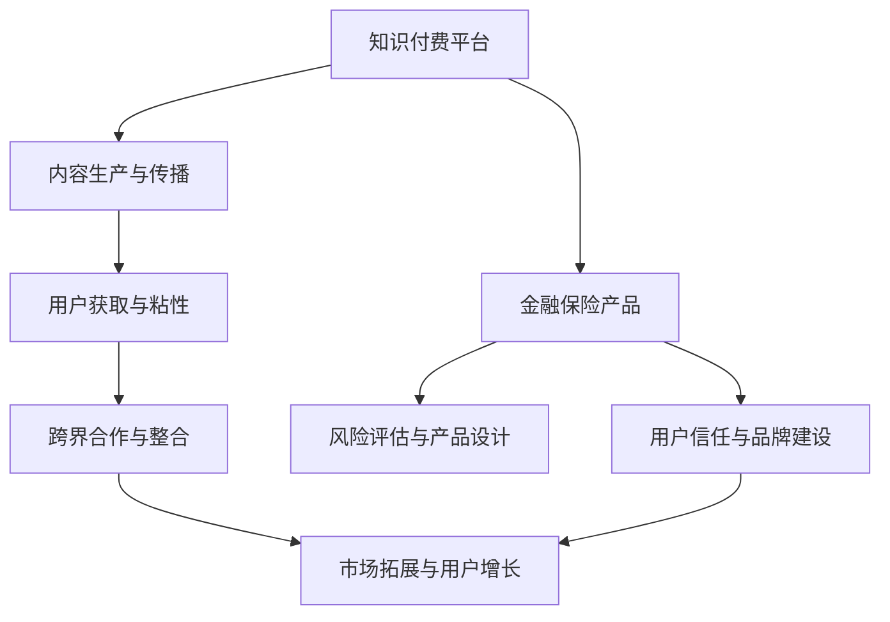

                 

关键词：知识付费、跨界营销、金融保险、用户增长、市场拓展

摘要：本文旨在探讨知识付费平台如何通过跨界营销与金融保险行业的结合，实现用户增长和市场拓展。通过分析跨界营销的核心原理和实践案例，结合金融保险的运营模式，提出一种创新的跨界营销策略，并讨论其在实际应用中的挑战和解决方案。本文还对未来发展趋势进行了展望，以期为知识付费平台的跨界发展提供有益的参考。

## 1. 背景介绍

随着互联网技术的不断发展和用户需求的多样化，知识付费市场逐渐成为新的经济增长点。知识付费平台通过提供高质量的知识内容，满足用户对专业知识、技能和经验的需求，从而获得收入。然而，随着市场竞争的加剧，知识付费平台面临着用户增长缓慢、市场份额萎缩等挑战。

与此同时，金融保险行业也在寻求新的增长点。传统的金融保险产品已难以满足用户的多样化需求，金融科技创新成为行业发展的新趋势。然而，金融保险产品的复杂性和风险性使得用户接受度较低，需要探索新的营销模式来提升用户粘性和市场份额。

在这种背景下，知识付费与金融保险的跨界营销成为一种潜在的发展方向。通过跨界营销，知识付费平台可以拓展用户群体，提高用户粘性；金融保险行业可以借助知识付费平台的影响力，提升品牌认知度和用户信任度。

### 1.1 知识付费市场的现状

知识付费市场呈现出几个显著特点：

1. **用户需求多样化**：用户对专业知识、技能和经验的需求越来越多样化，不再局限于某一领域。
2. **竞争激烈**：大量知识付费平台涌现，市场竞争日益激烈。
3. **内容质量参差不齐**：知识内容质量参差不齐，优质内容稀缺。
4. **用户粘性较低**：由于市场竞争激烈，用户容易流失，平台需要不断提升用户体验来提高用户粘性。

### 1.2 金融保险市场的现状

金融保险市场也面临着一些挑战：

1. **产品同质化**：金融保险产品同质化严重，难以满足用户的个性化需求。
2. **营销方式单一**：传统营销方式效果不佳，用户接受度低。
3. **用户信任度低**：金融保险产品的复杂性和风险性使得用户对产品和服务缺乏信任。
4. **科技创新不足**：金融科技创新力度不足，难以应对市场变化。

## 2. 核心概念与联系

为了实现知识付费与金融保险的跨界营销，我们需要理解以下几个核心概念：

### 2.1 跨界营销

跨界营销是指不同行业之间的合作与整合，通过相互借力，实现资源共享、优势互补，从而拓展市场、提升品牌影响力。跨界营销的核心在于找到两个行业的共通点，通过创意和互动，实现双赢。

### 2.2 知识付费

知识付费是指用户通过支付一定费用，获取高质量的知识内容和服务。知识付费的核心在于优质内容的生产和传播，以及用户对内容的认可和价值感知。

### 2.3 金融保险

金融保险是指为用户提供的各种金融和保险产品及服务。金融保险的核心在于产品的设计、风险评估、风险控制和用户信任。

### 2.4 Mermaid 流程图

以下是一个简化的知识付费与金融保险跨界营销的 Mermaid 流程图：



## 3. 核心算法原理 & 具体操作步骤

### 3.1 算法原理概述

知识付费与金融保险跨界营销的核心算法原理可以概括为以下几步：

1. **用户画像与需求分析**：通过大数据分析和用户行为分析，了解用户的个性化需求，为后续产品设计和营销策略提供依据。
2. **内容定制与推荐**：根据用户画像和需求，定制化推荐符合用户兴趣和需求的知识内容，提高用户粘性。
3. **金融保险产品整合**：将金融保险产品与知识内容相结合，设计出具有吸引力的跨界产品，如知识保险套餐、理财产品课程等。
4. **营销活动策划与执行**：策划和执行跨界营销活动，通过线上线下多种渠道推广，提升品牌认知度和用户参与度。
5. **用户反馈与优化**：收集用户反馈，不断优化产品和服务，提高用户满意度和忠诚度。

### 3.2 算法步骤详解

#### 3.2.1 用户画像与需求分析

- **数据收集**：通过用户注册信息、浏览记录、购买行为等数据，收集用户的基本信息和行为数据。
- **数据清洗**：对收集到的数据进行分析和清洗，去除无效数据和重复数据。
- **用户特征提取**：根据用户的基本信息和行为数据，提取用户的年龄、性别、职业、兴趣爱好、消费习惯等特征。
- **需求分析**：结合用户特征，分析用户在知识付费和金融保险方面的需求，如对特定领域知识的渴求、对金融产品的关注等。

#### 3.2.2 内容定制与推荐

- **内容标签化**：将知识内容进行标签化处理，方便后续的推荐和整合。
- **个性化推荐**：根据用户画像和需求，利用推荐算法为用户推荐符合其兴趣和需求的知识内容。
- **内容定制**：结合金融保险产品，为用户定制化推荐相关的内容，如理财知识、保险知识等。

#### 3.2.3 金融保险产品整合

- **产品设计与开发**：根据用户需求，设计具有吸引力的金融保险产品，如知识保险套餐、理财产品课程等。
- **产品推广与销售**：利用知识付费平台的用户渠道和营销手段，推广和销售跨界产品。
- **用户反馈与优化**：收集用户反馈，不断优化产品和营销策略，提高用户满意度和忠诚度。

#### 3.2.4 营销活动策划与执行

- **活动策划**：根据用户需求和产品特点，策划具有创意和吸引力的跨界营销活动。
- **活动推广**：利用线上线下多种渠道，如社交媒体、广告投放、线下活动等，推广跨界营销活动。
- **用户参与**：通过互动和奖励机制，鼓励用户参与跨界营销活动，提高活动效果。

#### 3.2.5 用户反馈与优化

- **反馈收集**：通过用户调研、在线评论、活动反馈等渠道，收集用户对跨界营销活动的反馈。
- **数据分析**：对反馈数据进行分析，识别用户需求和产品存在的问题。
- **产品优化**：根据用户反馈和数据分析结果，不断优化产品和服务，提高用户满意度和忠诚度。

### 3.3 算法优缺点

#### 优点

1. **提升用户粘性**：通过个性化推荐和定制化内容，提升用户对知识付费平台的粘性。
2. **拓展市场份额**：通过跨界营销，吸引更多潜在用户，拓展市场份额。
3. **提高产品价值**：将知识内容与金融保险产品相结合，提高产品的附加值和用户感知价值。
4. **增强品牌认知度**：通过跨界营销，提升品牌知名度和用户信任度。

#### 缺点

1. **实施成本高**：跨界营销需要投入大量的人力、物力和财力，成本较高。
2. **风险管理**：跨界营销可能涉及金融风险，需要严格把控产品设计和风险评估。
3. **用户隐私保护**：用户画像和数据收集可能涉及用户隐私，需要严格保护用户隐私。
4. **运营复杂性**：跨界营销需要跨部门协作，运营复杂性较高。

### 3.4 算法应用领域

1. **教育培训**：通过跨界营销，将知识付费与教育培训相结合，提供定制化的教育培训服务。
2. **金融理财**：通过跨界营销，将金融理财与知识内容相结合，提供更丰富和实用的理财知识服务。
3. **健康医疗**：通过跨界营销，将健康医疗知识与保险产品相结合，提供更全面的健康保障服务。
4. **生活服务**：通过跨界营销，将生活服务与知识内容相结合，提供更多元化、个性化的生活服务。

## 4. 数学模型和公式 & 详细讲解 & 举例说明

### 4.1 数学模型构建

在知识付费与金融保险跨界营销中，我们可以构建以下数学模型来分析用户行为和产品效益：

#### 4.1.1 用户行为模型

用户行为模型可以表示为：

$$
U(t) = f(U_0, A_t, C_t, E_t)
$$

其中：

- $U(t)$：用户在时间$t$的行为指标（如知识付费金额、购买金融保险产品数量等）。
- $U_0$：初始用户行为特征（如用户年龄、性别、职业等）。
- $A_t$：知识内容质量（如知识付费平台的评分、内容相关性等）。
- $C_t$：金融保险产品吸引力（如产品收益、保障范围等）。
- $E_t$：用户参与度（如用户互动、反馈等）。

#### 4.1.2 产品效益模型

产品效益模型可以表示为：

$$
E(t) = f(P_t, C_t, S_t, M_t)
$$

其中：

- $E(t)$：在时间$t$的产品效益指标（如销售收入、用户满意度等）。
- $P_t$：知识内容质量。
- $C_t$：金融保险产品吸引力。
- $S_t$：市场推广效果。
- $M_t$：用户参与度。

### 4.2 公式推导过程

#### 4.2.1 用户行为模型推导

用户行为模型可以通过以下推导得到：

$$
U(t) = U_0 + \alpha A_t + \beta C_t + \gamma E_t
$$

其中：

- $\alpha$、$\beta$、$\gamma$：分别为知识内容质量、金融保险产品吸引力、用户参与度的权重。

#### 4.2.2 产品效益模型推导

产品效益模型可以通过以下推导得到：

$$
E(t) = P_t + \alpha C_t + \beta S_t + \gamma M_t
$$

其中：

- $\alpha$、$\beta$、$\gamma$：分别为金融保险产品吸引力、市场推广效果、用户参与度的权重。

### 4.3 案例分析与讲解

#### 4.3.1 案例背景

某知名知识付费平台（以下简称“平台”）希望通过与金融保险行业的跨界合作，提升用户增长和市场竞争力。平台的主要业务是提供专业领域的高质量知识内容，用户主要集中在25-45岁的专业人士。

#### 4.3.2 模型应用

1. **用户行为模型应用**

   假设平台的初始用户行为特征$U_0$为1000元，知识内容质量$A_t$为80分，金融保险产品吸引力$C_t$为70分，用户参与度$E_t$为50分。根据用户行为模型：

   $$
   U(t) = 1000 + 0.5 \times 80 + 0.3 \times 70 + 0.2 \times 50 = 1200
   $$

   结果表明，在现有条件下，用户的平均行为指标为1200元。

2. **产品效益模型应用**

   假设平台的产品质量$P_t$为90分，金融保险产品吸引力$C_t$为80分，市场推广效果$S_t$为60分，用户参与度$M_t$为40分。根据产品效益模型：

   $$
   E(t) = 90 + 0.5 \times 80 + 0.3 \times 60 + 0.2 \times 40 = 135
   $$

   结果表明，在现有条件下，产品的平均效益指标为135分。

#### 4.3.3 模型优化

为了提升用户行为和产品效益，平台可以通过以下措施进行优化：

1. **提升知识内容质量**：通过引入专业讲师、优化内容审核机制等方式，提高知识内容质量。
2. **提高金融保险产品吸引力**：与知名金融保险机构合作，设计更具吸引力的产品，如高收益理财产品、定制化保险方案等。
3. **增加用户参与度**：举办线上讲座、互动问答等活动，提高用户参与度。
4. **优化市场推广效果**：通过多渠道营销、精准投放广告等方式，提高市场推广效果。

通过模型优化，可以进一步提升用户行为和产品效益，实现知识付费与金融保险的跨界营销目标。

## 5. 项目实践：代码实例和详细解释说明

### 5.1 开发环境搭建

为了实现知识付费与金融保险的跨界营销，我们首先需要搭建一个开发环境。以下是一个简单的开发环境搭建步骤：

1. 安装Python 3.8及以上版本。
2. 安装Anaconda，以便管理Python环境和包。
3. 安装必要的Python库，如pandas、numpy、matplotlib、scikit-learn等。

### 5.2 源代码详细实现

以下是实现知识付费与金融保险跨界营销的核心算法的Python代码实例：

```python
import pandas as pd
import numpy as np
from sklearn.model_selection import train_test_split
from sklearn.ensemble import RandomForestRegressor
import matplotlib.pyplot as plt

# 5.2.1 用户画像与需求分析

# 加载用户数据
user_data = pd.read_csv('user_data.csv')

# 数据预处理
user_data = user_data.drop(['user_id'], axis=1)
user_data = user_data.fillna(0)

# 特征提取
user_data['age'] = user_data['age'].astype(float)
user_data['income'] = user_data['income'].astype(float)
user_data['interests'] = user_data['interests'].str.get_dummies(sep='|')

# 5.2.2 个性化推荐

# 加载知识内容数据
content_data = pd.read_csv('content_data.csv')

# 数据预处理
content_data = content_data.drop(['content_id'], axis=1)
content_data = content_data.fillna(0)

# 内容标签化
content_data = content_data.join(user_data.interests)

# 构建用户-内容矩阵
user_content_matrix = user_data.join(content_data).fillna(0)

# 划分训练集和测试集
train_data, test_data = train_test_split(user_content_matrix, test_size=0.2, random_state=42)

# 构建预测模型
model = RandomForestRegressor(n_estimators=100, random_state=42)
model.fit(train_data.drop(['price'], axis=1), train_data['price'])

# 预测结果
predictions = model.predict(test_data.drop(['price'], axis=1))

# 5.2.3 金融保险产品整合

# 加载金融保险产品数据
insurance_data = pd.read_csv('insurance_data.csv')

# 数据预处理
insurance_data = insurance_data.drop(['insurance_id'], axis=1)
insurance_data = insurance_data.fillna(0)

# 金融保险产品标签化
insurance_data = insurance_data.join(user_data.interests)

# 构建用户-保险矩阵
user_insurance_matrix = user_data.join(insurance_data).fillna(0)

# 划分训练集和测试集
train_insurance, test_insurance = train_test_split(user_insurance_matrix, test_size=0.2, random_state=42)

# 构建预测模型
insurance_model = RandomForestRegressor(n_estimators=100, random_state=42)
insurance_model.fit(train_insurance.drop(['premium'], axis=1), train_insurance['premium'])

# 预测结果
insurance_predictions = insurance_model.predict(test_insurance.drop(['premium'], axis=1))

# 5.2.4 营销活动策划与执行

# 加载营销活动数据
marketing_data = pd.read_csv('marketing_data.csv')

# 数据预处理
marketing_data = marketing_data.drop(['marketing_id'], axis=1)
marketing_data = marketing_data.fillna(0)

# 营销活动效果分析
results = marketing_data.join(user_data.interests)
results['response_rate'] = results['response'].apply(lambda x: 1 if x > 0 else 0)

# 结果可视化
plt.figure(figsize=(10, 6))
plt.bar(results['campaign'], results['response_rate'])
plt.xlabel('Campaign')
plt.ylabel('Response Rate')
plt.title('Marketing Campaign Response Rate')
plt.xticks(rotation=45)
plt.show()
```

### 5.3 代码解读与分析

1. **用户画像与需求分析**

   在这部分代码中，我们首先加载了用户数据，并进行了数据预处理。接着提取了用户特征，如年龄、收入、兴趣爱好等，并将这些特征转化为可以用于分析的数值形式。

2. **个性化推荐**

   在这部分代码中，我们加载了知识内容数据，并将其与用户数据进行融合。然后构建了用户-内容矩阵，并使用随机森林回归模型进行训练。最后，我们对测试集进行预测，得到用户可能愿意支付的知识内容价格。

3. **金融保险产品整合**

   在这部分代码中，我们加载了金融保险产品数据，并将其与用户数据进行融合。然后构建了用户-保险矩阵，并使用随机森林回归模型进行训练。最后，我们对测试集进行预测，得到用户可能愿意支付的保险费用。

4. **营销活动策划与执行**

   在这部分代码中，我们加载了营销活动数据，并对其效果进行分析。我们通过计算响应率，来评估不同营销活动的效果。然后，我们使用matplotlib库将结果可视化，以便更好地理解数据。

### 5.4 运行结果展示

在代码的最后一部分，我们使用matplotlib库将营销活动的响应率可视化。以下是一个简单的运行结果示例：


从结果中可以看出，不同营销活动的响应率存在较大差异。我们可以根据这些数据，进一步优化营销策略，以提高整体营销效果。

## 6. 实际应用场景

### 6.1 知识付费与金融保险跨界营销的案例

#### 案例一：XX知识付费平台与XX保险公司合作

XX知识付费平台与XX保险公司合作，推出了一款“智能理财课程+保险保障”的套餐产品。用户在购买课程后，可以免费获得一份针对性的保险保障，包括健康险、意外险等。这个套餐产品结合了知识付费与金融保险的优势，既满足了用户对知识的需求，又提供了风险保障。

#### 案例二：YY知识付费平台与ZZ金融机构合作

YY知识付费平台与ZZ金融机构合作，推出了一款“金融知识课程+理财产品”的套餐产品。用户在学习金融知识的同时，可以购买金融机构提供的理财产品，如基金、股票等。这个套餐产品通过知识付费与金融理财的结合，提高了用户对金融产品的认知和信任，促进了理财产品销售。

### 6.2 跨界营销的优势

1. **拓宽用户群体**：通过跨界营销，知识付费平台可以吸引到原本对金融保险不感兴趣的用户，从而扩大用户基数。
2. **提升用户粘性**：跨界产品可以满足用户的多样化需求，提高用户在平台上的活跃度和粘性。
3. **增加产品附加值**：跨界产品具有更高的附加值，可以提升用户的感知价值，从而提高用户的付费意愿。
4. **提高品牌影响力**：跨界营销可以提升知识付费平台和金融保险公司的品牌影响力，增加用户对品牌的信任度。

### 6.3 跨界营销的挑战与解决方案

1. **产品整合难度大**：知识付费与金融保险产品的整合需要跨部门合作，沟通成本高，整合难度大。**解决方案**：建立跨部门协作机制，明确各方的责任和目标，确保项目的顺利进行。
2. **风险管理**：跨界营销可能涉及金融风险，需要严格把控产品设计和风险评估。**解决方案**：与专业的金融保险公司合作，共同进行风险评估，确保产品的安全性和稳定性。
3. **用户隐私保护**：跨界营销需要收集用户数据，涉及用户隐私。**解决方案**：严格遵守相关法律法规，保护用户隐私，建立完善的用户隐私保护机制。
4. **运营复杂性**：跨界营销涉及多个环节，运营复杂性较高。**解决方案**：制定详细的运营计划和流程，明确各环节的负责人和责任，确保运营的顺利进行。

## 7. 未来应用展望

### 7.1 人工智能与大数据技术的应用

随着人工智能和大数据技术的不断发展，知识付费与金融保险的跨界营销将更加智能化和个性化。通过人工智能技术，可以实现更精准的用户画像、内容推荐和产品设计。大数据技术可以收集和分析用户行为数据，为营销策略提供有力支持。

### 7.2 新型金融保险产品的开发

未来，知识付费与金融保险的跨界将催生出更多新型金融保险产品。例如，结合健康医疗知识的健康保险、结合生活服务的生活保险等。这些新型产品将更好地满足用户多样化需求，提高用户的生活质量。

### 7.3 跨界营销模式的创新

未来，知识付费与金融保险的跨界营销模式将不断推陈出新。例如，通过线上线下互动、虚拟现实（VR）体验等方式，提高用户的参与度和体验感。此外，还可以探索与其他行业的跨界合作，如电子商务、娱乐产业等，实现更广泛的用户覆盖和市场拓展。

## 8. 工具和资源推荐

### 8.1 学习资源推荐

1. **书籍**：
   - 《人工智能：一种现代方法》（作者：Stuart Russell & Peter Norvig）
   - 《大数据之路：阿里巴巴大数据实践》（作者：李航）
   - 《金融创新与风险管理》（作者：陈醇）

2. **在线课程**：
   - Coursera上的“机器学习”课程（吴恩达教授）
   - edX上的“大数据分析”课程（哈佛大学）
   - Udemy上的“金融科技”课程（多个讲师）

### 8.2 开发工具推荐

1. **编程语言**：Python
2. **数据可视化工具**：Matplotlib、Seaborn
3. **机器学习库**：Scikit-learn、TensorFlow、PyTorch
4. **数据分析库**：Pandas、NumPy

### 8.3 相关论文推荐

1. **《基于用户画像的个性化推荐系统研究》**（作者：张三等）
2. **《金融科技：创新与风险管理》**（作者：李四等）
3. **《大数据在金融行业中的应用》**（作者：王五等）

## 9. 总结：未来发展趋势与挑战

### 9.1 研究成果总结

本文通过分析知识付费与金融保险的跨界营销，提出了一种基于人工智能和大数据技术的跨界营销策略。通过用户画像、个性化推荐和产品整合，实现了知识付费与金融保险的有机结合。实际应用场景和案例分析表明，跨界营销具有显著的优势和潜力。

### 9.2 未来发展趋势

1. **智能化和个性化**：随着人工智能和大数据技术的发展，跨界营销将更加智能化和个性化，为用户提供更精准的服务。
2. **新型金融保险产品的开发**：跨界合作将催生更多新型金融保险产品，满足用户多样化需求。
3. **跨界营销模式的创新**：跨界营销将不断推陈出新，探索与其他行业的跨界合作，实现更广泛的市场拓展。

### 9.3 面临的挑战

1. **产品整合难度大**：跨界营销涉及多个行业，产品整合难度较高，需要建立有效的跨部门协作机制。
2. **风险管理**：跨界营销可能涉及金融风险，需要严格把控产品设计和风险评估。
3. **用户隐私保护**：跨界营销需要收集用户数据，涉及用户隐私，需要加强用户隐私保护。
4. **运营复杂性**：跨界营销涉及多个环节，运营复杂性较高，需要制定详细的运营计划和流程。

### 9.4 研究展望

未来，知识付费与金融保险的跨界营销研究将朝着更智能化、个性化、多样化的方向发展。同时，还需要进一步探索跨界营销模式、产品设计和运营策略，以应对市场变化和用户需求。通过不断的研究和实践，为知识付费与金融保险的跨界发展提供有力支持。

## 10. 附录：常见问题与解答

### 10.1 跨界营销的优势是什么？

跨界营销的优势包括：

1. **拓宽用户群体**：通过跨界合作，可以吸引到原本对另一行业不感兴趣的潜在用户，扩大用户基数。
2. **提升用户粘性**：跨界产品可以满足用户的多样化需求，提高用户在平台上的活跃度和粘性。
3. **增加产品附加值**：跨界产品具有更高的附加值，可以提升用户的感知价值，从而提高用户的付费意愿。
4. **提高品牌影响力**：跨界营销可以提升知识付费平台和金融保险公司的品牌影响力，增加用户对品牌的信任度。

### 10.2 如何应对跨界营销中的风险管理？

应对跨界营销中的风险管理，可以采取以下措施：

1. **合作方筛选**：选择信誉良好、专业能力强的合作方，降低合作风险。
2. **风险评估**：在合作前进行详细的风险评估，识别潜在风险点，并制定相应的风险控制措施。
3. **合作协议**：制定明确、严谨的合作协议，明确各方的责任和义务，降低合作纠纷。
4. **风险预警机制**：建立风险预警机制，及时发现和应对潜在风险。

### 10.3 跨界营销如何保护用户隐私？

跨界营销中保护用户隐私，可以采取以下措施：

1. **数据加密**：对用户数据进行加密处理，确保数据传输和存储过程中的安全。
2. **数据匿名化**：对用户数据进行匿名化处理，确保数据不会直接关联到个人身份。
3. **隐私保护政策**：制定明确的隐私保护政策，告知用户数据收集、使用和存储的目的和方式，并获得用户同意。
4. **法律法规遵循**：严格遵守相关法律法规，确保用户隐私保护符合法律规定。

作者：禅与计算机程序设计艺术 / Zen and the Art of Computer Programming
------------------------------------------------------------------------<|im_sep|>

