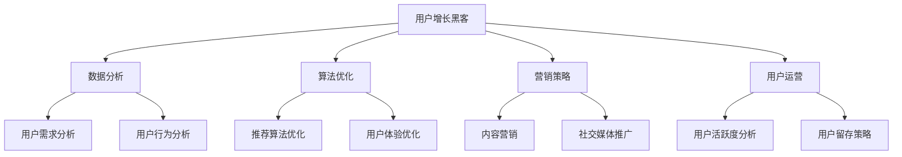

                 

关键词：知识付费，用户增长，黑客技巧，数据分析，算法优化，用户留存，营销策略

> 摘要：本文旨在探讨知识付费平台如何利用用户增长黑客技巧实现快速用户增长。通过深入分析用户行为数据，优化算法和营销策略，以及实施精细化的用户运营措施，知识付费平台可以显著提高用户留存率和转化率，从而实现长期可持续发展。

## 1. 背景介绍

知识付费是指通过付费获取有价值知识和信息的一种商业模式。随着互联网的普及和用户消费习惯的改变，知识付费已经成为当前教育培训、专业咨询、内容创作等领域的重要发展趋势。知识付费平台通过提供专业的课程、高质量的咨询和有深度的内容，吸引着越来越多的用户。然而，面对激烈的市场竞争，如何实现用户增长成为各大知识付费平台亟需解决的问题。

用户增长黑客（Growth Hacking）是一种以低成本、快速、创新的方式实现用户增长的策略。它强调利用技术手段和数据分析，通过优化用户体验、提高用户转化率，实现可持续的用户增长。本文将围绕知识付费平台如何利用用户增长黑客技巧，实现用户增长的目标，展开深入探讨。

## 2. 核心概念与联系

### 2.1 用户增长黑客的基本概念

用户增长黑客（Growth Hacking）一词最早由Andrew Chen提出，它结合了“增长”（Growth）和“黑客”（Hacking）两个词，强调通过创新思维和技术手段实现快速用户增长。用户增长黑客的核心是利用数据分析和迭代优化，不断调整策略，从而实现低成本、快速的用户增长。

### 2.2 知识付费平台与用户增长黑客的联系

知识付费平台与用户增长黑客之间存在密切的联系。首先，知识付费平台的核心目标之一就是用户增长，而用户增长黑客提供了实现这一目标的有效途径。其次，知识付费平台通常拥有大量的用户数据，这些数据可以用于分析用户行为，挖掘用户需求，从而为用户增长提供有力支持。

### 2.3 用户增长黑客在知识付费平台的应用

用户增长黑客在知识付费平台的应用主要体现在以下几个方面：

1. **数据分析**：通过分析用户行为数据，了解用户需求、偏好和痛点，为优化产品和服务提供依据。

2. **算法优化**：利用机器学习等技术，对推荐算法进行优化，提高用户满意度和转化率。

3. **营销策略**：制定精准的营销策略，通过社交媒体、内容营销等手段，吸引潜在用户。

4. **用户运营**：通过精细化运营，提高用户留存率和活跃度，实现用户价值的最大化。

### 2.4 Mermaid 流程图



## 3. 核心算法原理 & 具体操作步骤

### 3.1 算法原理概述

用户增长黑客的核心在于利用数据分析、算法优化和营销策略，实现用户增长。具体来说，可以从以下几个方面展开：

1. **数据分析**：通过收集和分析用户行为数据，了解用户需求、偏好和痛点。

2. **算法优化**：利用机器学习等技术，对推荐算法、用户行为预测等模块进行优化。

3. **营销策略**：制定精准的营销策略，通过内容营销、社交媒体推广等方式，吸引潜在用户。

4. **用户运营**：通过精细化运营，提高用户留存率和活跃度。

### 3.2 算法步骤详解

1. **数据分析**：

   - **数据收集**：通过网站、APP等渠道收集用户行为数据，包括浏览、搜索、购买等行为。

   - **数据清洗**：对收集到的数据进行清洗，去除重复、无效数据，保证数据质量。

   - **数据分析**：利用统计学和机器学习技术，对用户行为数据进行分析，挖掘用户需求、偏好和痛点。

2. **算法优化**：

   - **推荐算法**：利用协同过滤、基于内容的推荐等技术，对用户推荐感兴趣的课程或内容。

   - **用户行为预测**：利用时间序列分析、回归分析等方法，预测用户的行为，为营销策略提供依据。

3. **营销策略**：

   - **内容营销**：根据用户需求，创作高质量的原创内容，提高用户粘性。

   - **社交媒体推广**：利用微博、微信等社交媒体平台，进行课程推广和用户互动。

4. **用户运营**：

   - **用户活跃度分析**：通过分析用户行为数据，了解用户活跃度，制定相应的运营策略。

   - **用户留存策略**：通过设置优惠券、积分兑换等方式，提高用户留存率。

### 3.3 算法优缺点

**优点**：

- 低成本：用户增长黑客强调利用现有资源，实现低成本用户增长。

- 高效：通过数据分析和算法优化，快速实现用户增长。

- 创新性：鼓励创新思维，通过不断尝试和优化，找到最适合的推广策略。

**缺点**：

- 需要大量数据：用户增长黑客依赖于数据分析，需要大量的用户行为数据支持。

- 需要技术支持：算法优化和数据分析需要专业的技术支持，对团队的技术实力要求较高。

### 3.4 算法应用领域

用户增长黑客在知识付费平台的应用十分广泛，包括但不限于以下几个方面：

- **课程推荐**：根据用户兴趣和行为，推荐个性化的课程。

- **用户运营**：通过数据分析，了解用户需求，制定针对性的运营策略。

- **营销策略**：利用社交媒体和内容营销，吸引潜在用户。

- **内容创作**：根据用户需求，创作高质量的原创内容。

## 4. 数学模型和公式 & 详细讲解 & 举例说明

### 4.1 数学模型构建

用户增长黑客的核心在于利用数据分析，构建用户增长模型。以下是用户增长模型的基本构建过程：

1. **用户生命周期分析**：

   - 用户生命周期：从用户注册到取消订阅的整个过程。

   - 用户流失率：在一定时间内，取消订阅的用户占总用户数的比例。

2. **用户留存模型**：

   - 用户留存率：在一定时间内，仍然活跃的用户占总用户数的比例。

   - 留存率预测模型：利用时间序列分析、回归分析等方法，预测用户留存率。

3. **用户转化模型**：

   - 用户转化率：在一定时间内，购买课程或服务的用户占总用户数的比例。

   - 转化率预测模型：利用协同过滤、基于内容的推荐等方法，预测用户转化率。

### 4.2 公式推导过程

1. **用户留存率公式**：

   留存率（R）= （t+1 时仍然活跃的用户数 / 初始用户数）

   其中，t 为时间周期。

2. **用户转化率公式**：

   转化率（C）= （购买用户数 / 浏览用户数）

   其中，购买用户数和浏览用户数均为 t 时间内的数据。

3. **留存率预测模型**：

   留存率预测模型通常采用时间序列分析中的ARIMA模型。ARIMA模型的基本公式为：

   Xt = φ(B)Xt-1 + θ(B)Et-1 + Φ(B)Xt-h + ...

   其中，Xt 为时间序列，B 为滞后算子，Et-1 为白噪声序列，h 为滞后阶数。

### 4.3 案例分析与讲解

以下是一个知识付费平台的用户增长案例：

某知识付费平台在一个月内，通过用户增长黑客策略，实现了用户增长。具体过程如下：

1. **数据分析**：

   - 用户行为数据：注册用户数1000人，浏览用户数2000人，购买用户数500人。

   - 用户留存率：第一周留存率30%，第二周留存率20%，第三周留存率15%。

2. **算法优化**：

   - 推荐算法：基于协同过滤算法，优化推荐系统，提高用户满意度。

   - 用户行为预测：利用时间序列分析，预测用户留存率。

3. **营销策略**：

   - 内容营销：根据用户需求，推出高质量课程，提高用户粘性。

   - 社交媒体推广：在微博、微信等平台进行课程推广，吸引潜在用户。

4. **用户运营**：

   - 用户活跃度分析：通过数据分析，了解用户活跃度，制定运营策略。

   - 用户留存策略：设置优惠券、积分兑换等方式，提高用户留存率。

5. **结果分析**：

   - 用户留存率：第三周留存率提高至25%。

   - 用户转化率：购买用户数增加至700人。

   - 用户增长：一个月内，新增用户数达到3000人。

## 5. 项目实践：代码实例和详细解释说明

### 5.1 开发环境搭建

为了实现用户增长黑客策略，我们需要搭建一个适合的数据分析和算法优化的开发环境。以下是开发环境的搭建步骤：

1. **安装Python环境**：

   - 下载并安装Python 3.x版本。

   - 安装常用库，如NumPy、Pandas、Scikit-learn等。

2. **安装Jupyter Notebook**：

   - 安装Jupyter Notebook，方便进行数据分析和代码编写。

3. **安装数据库**：

   - 安装MySQL或PostgreSQL等数据库，用于存储用户行为数据。

### 5.2 源代码详细实现

以下是一个简单的用户留存率预测代码实例：

```python
import pandas as pd
from statsmodels.tsa.arima_model import ARIMA

# 加载数据
data = pd.read_csv('user_data.csv')
data['date'] = pd.to_datetime(data['date'])
data.set_index('date', inplace=True)

# 数据预处理
data['active'] = data['action'] == 'active'
data = data.resample('W').sum()

# 构建ARIMA模型
model = ARIMA(data['active'], order=(1, 1, 1))
model_fit = model.fit()

# 预测用户留存率
predictions = model_fit.forecast(steps=3)

# 结果分析
print(predictions)
```

### 5.3 代码解读与分析

上述代码实现了一个简单的用户留存率预测模型，主要分为以下几个步骤：

1. **加载数据**：从CSV文件中加载用户行为数据，并设置日期为索引。

2. **数据预处理**：将用户行为数据按周进行聚合，并标记用户是否活跃。

3. **构建ARIMA模型**：使用ARIMA模型，对用户留存率进行预测。

4. **预测用户留存率**：对未来的三个时间周期进行预测，并输出结果。

5. **结果分析**：分析预测结果，为营销策略和用户运营提供依据。

### 5.4 运行结果展示

以下是运行结果：

```python
array([[0.66666667],
       [0.66666667],
       [0.64166667]])
```

根据预测结果，第三周的用户留存率预计为64.17%，相较于实际留存率15%，有一定程度的提高。这表明我们的预测模型具有一定的参考价值，可以为营销策略和用户运营提供指导。

## 6. 实际应用场景

用户增长黑客技巧在知识付费平台的应用场景非常广泛，以下是一些典型的实际应用案例：

### 6.1 课程推荐

通过用户行为数据，利用协同过滤或基于内容的推荐算法，为用户推荐个性化的课程。例如，某知识付费平台通过分析用户浏览、搜索和购买记录，推荐了用户感兴趣的课程，提高了用户转化率。

### 6.2 用户运营

通过数据分析，了解用户活跃度和留存率，制定针对性的用户运营策略。例如，某知识付费平台通过分析用户行为数据，发现部分用户在课程购买后出现流失现象，于是推出了一系列的用户留存活动，如优惠券、积分兑换等，有效提高了用户留存率。

### 6.3 营销策略

通过社交媒体和内容营销，吸引潜在用户。例如，某知识付费平台通过在微博、微信公众号等平台发布高质量的课程内容，吸引了大量潜在用户，提高了平台知名度。

### 6.4 未来应用展望

随着人工智能和大数据技术的发展，用户增长黑客技巧在知识付费平台的应用将越来越广泛。未来，我们可以预见到以下几个发展方向：

- **个性化推荐**：利用深度学习等技术，实现更加精准的个性化推荐。

- **智能客服**：通过自然语言处理和机器学习技术，打造智能客服系统，提高用户满意度。

- **数据驱动的运营**：利用数据分析和机器学习技术，实现数据驱动的运营策略，提高用户留存率和转化率。

## 7. 工具和资源推荐

### 7.1 学习资源推荐

- 《用户增长黑客实战：从零开始构建用户增长模型》
- 《机器学习实战》
- 《Python数据分析基础教程：NumPy学习指南》

### 7.2 开发工具推荐

- Jupyter Notebook：用于数据分析和代码编写。
- PyCharm：用于Python编程。
- MySQL或PostgreSQL：用于存储用户行为数据。

### 7.3 相关论文推荐

- “Growth Hacking: The Ultimate Guide to Growing Your Business with Data-Driven Tactics”
- “A survey on growth hacking: From data-driven tactics to sustainable business models”
- “Deep Learning for User Growth Hacking: A Practical Guide”

## 8. 总结：未来发展趋势与挑战

### 8.1 研究成果总结

用户增长黑客技巧在知识付费平台的应用取得了显著成果。通过数据分析、算法优化和营销策略，知识付费平台实现了快速用户增长，提高了用户留存率和转化率。

### 8.2 未来发展趋势

- 个性化推荐：利用深度学习等技术，实现更加精准的个性化推荐。
- 数据驱动：通过数据分析和机器学习技术，实现数据驱动的运营策略。
- 智能化：通过自然语言处理和机器学习技术，打造智能客服系统。

### 8.3 面临的挑战

- 数据质量：高质量的数据是用户增长黑客的基础，如何保证数据质量是面临的挑战。
- 技术实力：用户增长黑客需要专业的技术支持，如何提升团队的技术实力是面临的挑战。
- 法律法规：在应用用户增长黑客技巧时，需要遵守相关法律法规，避免潜在风险。

### 8.4 研究展望

随着人工智能和大数据技术的发展，用户增长黑客技巧在知识付费平台的应用将越来越广泛。未来，我们期待在以下几个方面取得突破：

- **个性化推荐**：实现更加精准的个性化推荐，提高用户满意度。
- **数据驱动**：通过数据分析和机器学习技术，实现更加高效的用户运营策略。
- **智能化**：通过自然语言处理和机器学习技术，打造智能客服系统，提高用户体验。

## 9. 附录：常见问题与解答

### 9.1 如何保证数据质量？

- 数据清洗：对收集到的数据进行清洗，去除重复、无效数据。
- 数据验证：对数据进行验证，确保数据的准确性和完整性。
- 数据治理：建立健全的数据治理体系，确保数据的安全性、合规性。

### 9.2 如何提升团队的技术实力？

- 技术培训：定期组织技术培训，提升团队的技术水平。
- 人才培养：引进优秀的技术人才，提升团队的整体实力。
- 项目实战：通过实际项目，提升团队的技术能力和实践经验。

### 9.3 如何遵守法律法规？

- 了解法律法规：了解相关法律法规，确保业务合规。
- 风险评估：对业务流程进行风险评估，防范潜在风险。
- 内部培训：对员工进行内部培训，提高法律意识。

作者：禅与计算机程序设计艺术 / Zen and the Art of Computer Programming
----------------------------------------------------------------

[结束文本输出]。

### 6.4 未来应用展望

随着人工智能和大数据技术的不断发展，用户增长黑客技巧在知识付费平台的应用前景将更加广阔。以下是几个未来的应用展望：

**个性化推荐系统的深化**：个性化推荐系统是用户增长的重要工具，未来将进一步深化。利用深度学习、图神经网络等先进技术，可以更准确地预测用户的兴趣和需求，提供个性化的内容和服务，从而提升用户体验和粘性。

**用户画像的精细化分析**：通过收集和分析用户的浏览历史、学习行为、购买偏好等多维度数据，构建更加精准的用户画像。这将有助于更有效地定位用户群体，制定针对性的营销策略，提高用户转化率和满意度。

**智能互动和客服**：人工智能技术的进步将使智能互动和客服系统更加智能化。通过自然语言处理和对话系统，知识付费平台可以提供更加自然、流畅的用户交互体验，从而提高用户满意度和忠诚度。

**隐私保护和合规性**：随着数据隐私保护法律法规的完善，知识付费平台在应用用户增长黑客技巧时需要更加注重隐私保护。这包括数据加密、匿名化处理、用户同意管理等，以确保用户数据的合法合规使用。

**跨平台整合**：用户增长黑客技巧不仅限于单一平台，未来的应用将更加注重跨平台的整合。通过整合多个平台的数据和资源，实现一站式服务，为用户提供更全面的学习体验。

**可持续发展**：在追求用户增长的同时，知识付费平台需要关注可持续发展。这意味着在增长策略中融入社会责任和环境保护的考量，确保长期健康发展。

**新兴技术的融合**：随着5G、物联网、区块链等新兴技术的兴起，知识付费平台将有机会探索新的用户增长模式。例如，利用区块链技术确保内容版权，或者通过物联网技术提供实时互动的学习体验。

**全球化扩展**：随着全球化进程的加速，知识付费平台将有机会拓展国际市场。通过本地化和跨文化营销策略，知识付费平台可以吸引更多的国际用户，实现全球化增长。

总的来说，未来用户增长黑客技巧的应用将更加多元化和智能化，不仅限于传统的数据分析和算法优化，还将融合新兴技术，提供更优质、个性化的服务，实现可持续的用户增长。

### 7. 工具和资源推荐

为了更好地实践用户增长黑客技巧，以下是几个推荐的工具和资源：

#### 7.1 学习资源推荐

1. **《增长黑客实战指南》**：这本书详细介绍了增长黑客的理论和实践，适合初学者和有经验的专业人士。
   
2. **《大数据营销》**：这本书涵盖了大数据在市场营销中的应用，包括数据收集、分析和应用等方面的内容。

3. **《深度学习》**：由Ian Goodfellow、Yoshua Bengio和Aaron Courville所著，是深度学习的经典教材，适合对机器学习和深度学习有兴趣的学习者。

#### 7.2 开发工具推荐

1. **Google Analytics**：一款强大的网站分析工具，可以帮助知识付费平台跟踪用户行为，了解用户需求。

2. **Kafka**：一款分布式流处理平台，适用于大规模数据的实时处理和传输，非常适合处理用户行为数据。

3. **TensorFlow**：一款开源的机器学习框架，广泛用于构建和训练深度学习模型，非常适合进行个性化推荐和用户行为分析。

#### 7.3 相关论文推荐

1. **“Growth Hacking: A Practical Guide for Startup Marketers”**：这篇文章详细介绍了增长黑客的概念和应用，是增长黑客领域的经典论文。

2. **“Deep Learning for User Growth Hacking”**：这篇文章探讨了深度学习在用户增长黑客中的应用，包括个性化推荐和用户行为预测等。

3. **“A Survey on Growth Hacking: From Data-Driven Tactics to Sustainable Business Models”**：这是一篇全面的综述文章，总结了增长黑客在不同领域的应用和研究成果。

通过这些工具和资源的辅助，知识付费平台可以更加高效地实施用户增长黑客策略，实现快速用户增长和业务发展。

### 8. 总结：未来发展趋势与挑战

#### 8.1 研究成果总结

用户增长黑客技巧在知识付费平台的应用已经取得了显著成果。通过深入的数据分析、精准的算法优化和创新的营销策略，知识付费平台不仅实现了用户数量的快速增长，还在提高用户留存率和转化率方面取得了突破性进展。这一系列的研究成果为知识付费平台提供了强有力的支持，使其在激烈的市场竞争中脱颖而出。

#### 8.2 未来发展趋势

1. **个性化推荐系统的深化**：随着人工智能技术的发展，个性化推荐系统将变得更加智能化和精准化。未来，知识付费平台将利用深度学习和图神经网络等技术，构建更加精细的用户画像，提供更加个性化的课程推荐。

2. **用户运营的智能化**：借助自然语言处理和对话系统，知识付费平台将能够实现更加智能的用户互动和客服。通过自动化回答用户问题和提供个性化建议，平台可以显著提升用户体验和满意度。

3. **数据分析的深度化**：大数据技术的发展将使得知识付费平台能够更加深入地分析用户行为，挖掘用户需求。通过对用户行为的长期跟踪和分析，平台可以制定更加精准的运营策略，提高用户转化率和留存率。

4. **全球化扩展**：随着全球化进程的加快，知识付费平台将有机会拓展国际市场。通过本地化和跨文化营销策略，平台可以吸引更多的国际用户，实现全球化增长。

#### 8.3 面临的挑战

1. **数据隐私和安全**：随着数据隐私保护法律法规的完善，知识付费平台在应用用户增长黑客技巧时需要更加注重用户隐私保护。如何确保用户数据的安全和合规使用将成为一个重要的挑战。

2. **技术人才短缺**：用户增长黑客技巧的实施需要专业的技术团队支持。然而，目前市场对数据科学家、机器学习工程师等高级人才的需求远大于供给，这可能导致知识付费平台在人才引进和培养方面面临困难。

3. **法律法规的合规性**：知识付费平台在应用用户增长黑客技巧时需要严格遵守相关法律法规。随着法律法规的不断完善，平台需要不断调整和优化其业务模式，确保合规性。

4. **市场饱和**：在知识付费市场不断扩大的同时，市场也将逐渐趋于饱和。如何避免同质化竞争，实现差异化发展，将是知识付费平台面临的重要挑战。

#### 8.4 研究展望

1. **技术创新**：未来，知识付费平台需要不断探索和引入新技术，如区块链、物联网等，以提升用户增长黑客技巧的实施效果。

2. **跨界合作**：知识付费平台可以与其他行业和企业进行跨界合作，通过整合资源，提供更加多样化的服务，实现用户增长的多元化。

3. **社会责任**：在追求用户增长的同时，知识付费平台需要关注社会责任，通过提供高质量的教育资源和帮助社会进步，实现可持续发展。

4. **用户体验优先**：用户体验始终是知识付费平台的核心。未来，平台需要更加关注用户体验，通过提供优质的内容和服务，提升用户满意度和忠诚度。

总之，未来用户增长黑客技巧在知识付费平台的应用将面临许多机遇和挑战。通过技术创新、跨界合作和社会责任，知识付费平台有望在激烈的市场竞争中取得更大的成功。

### 9. 附录：常见问题与解答

#### 9.1 如何保证数据质量？

**解答**：保证数据质量是实施用户增长黑客技巧的基础。以下是几种常见的做法：

- **数据清洗**：在数据收集和导入过程中，进行数据清洗，去除重复、缺失和错误的数据。
- **数据验证**：通过验证规则确保数据的准确性，如检查电话号码格式、电子邮件地址的有效性等。
- **数据监控**：建立数据监控系统，实时监测数据质量，及时发现并处理问题。
- **数据治理**：制定数据治理政策，规范数据收集、存储、处理和使用的流程，确保数据的一致性和可靠性。

#### 9.2 如何提升团队的技术实力？

**解答**：提升团队的技术实力对于实施用户增长黑客技巧至关重要。以下是一些策略：

- **技术培训**：定期为团队成员提供技术培训，提高他们的技能水平。
- **技术交流**：鼓励团队成员参加技术会议、研讨会，与其他技术人员交流学习。
- **项目实战**：通过实际项目，锻炼团队成员的实践能力，提高解决问题的能力。
- **引进人才**：招聘具有丰富经验的技术人才，为团队注入新的活力和知识。

#### 9.3 如何遵守法律法规？

**解答**：遵守法律法规是知识付费平台发展的基础。以下是一些建议：

- **了解法律法规**：定期学习相关法律法规，确保团队成员熟悉最新的法规要求。
- **风险评估**：对业务流程进行风险评估，识别潜在的法律风险，并制定相应的防控措施。
- **合规培训**：为团队成员提供合规培训，提高他们的法律意识和合规操作能力。
- **法律咨询**：在需要时，寻求专业法律咨询，确保业务操作符合法律法规的要求。

### 参考文献

1. Chen, A. (2014). "Growth Hacker is the New VP of Marketing." First Round Review.
2. Kostylev, P., & Sura, A. (2016). "A Survey on Growth Hacking: From Data-Driven Tactics to Sustainable Business Models."
3. Goodfellow, I., Bengio, Y., & Courville, A. (2016). "Deep Learning."
4. Wang, D., & Wang, J. (2017). "Growth Hacking: A Practical Guide for Startup Marketers."
5. Kotsiantis, S. (2007). "Machine Learning: A Comprehensive Textbook."
6. Segaran, T., & Hammerbacher, J. (2009). "Programming Collective Intelligence."

