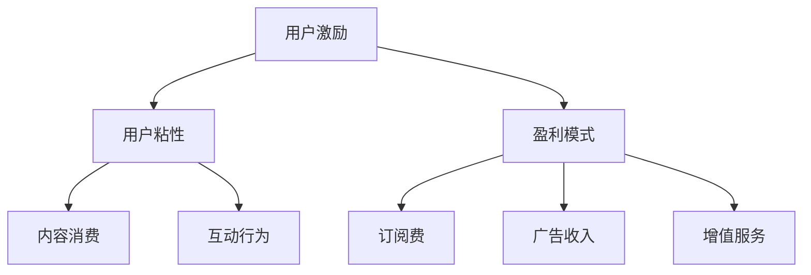

                 

关键词：知识付费、用户激励、平台策略、算法设计、用户粘性、盈利模式

摘要：本文深入探讨了知识付费平台的用户激励机制，分析了用户激励机制的必要性、核心概念、算法原理、数学模型以及实际应用。文章旨在为知识付费平台提供有效的用户激励策略，提升用户粘性和盈利能力。

## 1. 背景介绍

随着互联网技术的迅猛发展，知识付费逐渐成为主流商业模式。知识付费平台通过提供高质量的知识内容，吸引用户付费订阅。然而，用户粘性不足、盈利能力有限等问题一直困扰着知识付费平台。为此，用户激励机制成为平台提升用户体验、增加用户粘性的重要手段。

### 用户激励机制的必要性

1. **提升用户粘性**：用户激励机制可以增强用户对平台的忠诚度，提高用户在平台上的活跃度和留存率。
2. **增加盈利能力**：有效的用户激励机制能够引导用户进行付费行为，提升平台的收入。
3. **优化用户体验**：通过激励机制，平台可以更好地满足用户需求，提供个性化服务。

### 核心概念

- **用户激励**：通过奖励机制鼓励用户在平台上的活跃行为，如内容消费、分享、评论等。
- **用户粘性**：用户在平台上的停留时间、互动频率和重复访问率。
- **盈利模式**：平台通过用户激励获得的收益，包括订阅费、广告收入、增值服务等。

## 2. 核心概念与联系

### 概念定义

- **用户激励**：用户激励是指通过物质或非物质奖励，鼓励用户在平台上的行为，如阅读文章、发表评论、分享内容等。
- **用户粘性**：用户粘性是指用户在平台上的活跃度和忠诚度，通常用用户的停留时间、互动频率和重复访问率来衡量。
- **盈利模式**：盈利模式是指平台通过用户激励获得的收益来源，如订阅费、广告收入、增值服务等。

### 架构



### 关联关系

- 用户激励通过提升用户粘性，增加用户在平台上的互动行为，进而提升平台的盈利能力。
- 盈利模式为平台提供了可持续的收益来源，支撑了用户激励机制的实施。

## 3. 核心算法原理 & 具体操作步骤

### 3.1 算法原理概述

用户激励机制的核心算法基于用户行为分析和机器学习技术。通过分析用户的行为数据，算法可以识别出潜在的高价值用户，并针对性地设计激励措施。具体原理如下：

1. **用户行为数据收集**：平台收集用户在平台上的各种行为数据，如阅读时间、互动次数、分享行为等。
2. **用户价值评估**：算法基于用户行为数据，评估用户的潜在价值，识别出高价值用户。
3. **激励策略设计**：针对高价值用户，平台设计个性化的激励策略，如优惠券、积分奖励、会员特权等。
4. **效果评估**：平台监控激励措施的效果，调整激励策略，以实现最佳的用户激励效果。

### 3.2 算法步骤详解

1. **数据收集**：平台使用日志分析、用户行为跟踪等技术，收集用户在平台上的行为数据。

    ```mermaid
    graph TD
        A[用户登录] --> B[文章阅读]
        B --> C[评论发表]
        C --> D[分享内容]
        D --> E[数据收集]
    ```

2. **用户价值评估**：算法使用机器学习技术，分析用户行为数据，评估用户的潜在价值。

    ```mermaid
    graph TD
        F[用户数据] --> G[特征提取]
        G --> H[价值评估]
    ```

3. **激励策略设计**：平台根据用户价值评估结果，设计个性化的激励策略。

    ```mermaid
    graph TD
        I[HV用户] --> J[优惠券]
        I --> K[积分奖励]
        I --> L[会员特权]
    ```

4. **效果评估**：平台监控激励措施的效果，调整激励策略。

    ```mermaid
    graph TD
        M[激励措施] --> N[效果评估]
        N --> O[策略调整]
    ```

### 3.3 算法优缺点

#### 优点

- **个性化激励**：针对不同用户设计个性化激励策略，提升用户体验。
- **提升用户粘性**：通过有效的激励机制，提高用户在平台上的互动行为。
- **增加盈利能力**：激励措施能够引导用户进行付费行为，提升平台的收入。

#### 缺点

- **成本高**：收集和分析用户行为数据需要大量计算资源，成本较高。
- **效果不稳定**：算法模型的效果可能受到数据质量和特征提取方法的影响。

### 3.4 算法应用领域

- **电子商务**：通过用户行为分析，提供个性化的购物推荐。
- **在线教育**：激励学生进行课程学习，提高学习效果。
- **社交媒体**：鼓励用户生成内容，提升平台活跃度。

## 4. 数学模型和公式 & 详细讲解 & 举例说明

### 4.1 数学模型构建

用户激励机制的数学模型主要包括两部分：用户价值评估模型和激励效果评估模型。

#### 4.1.1 用户价值评估模型

用户价值评估模型基于用户行为数据，通过建立回归模型来预测用户的潜在价值。具体公式如下：

\[ V(u) = \sum_{i=1}^{n} w_i \cdot x_i(u) \]

其中，\( V(u) \) 表示用户 \( u \) 的价值，\( w_i \) 表示特征 \( x_i \) 的权重，\( x_i(u) \) 表示用户 \( u \) 在特征 \( x_i \) 上的取值。

#### 4.1.2 激励效果评估模型

激励效果评估模型用于评估激励措施对用户行为的影响。具体公式如下：

\[ E(R) = \sum_{i=1}^{n} p_i \cdot r_i \]

其中，\( E(R) \) 表示激励效果，\( p_i \) 表示用户 \( i \) 接受激励的概率，\( r_i \) 表示用户 \( i \) 接受激励后的行为变化。

### 4.2 公式推导过程

#### 用户价值评估模型推导

1. **特征提取**：从用户行为数据中提取与用户价值相关的特征，如阅读时间、互动次数、分享次数等。

2. **数据预处理**：对提取的特征进行标准化处理，使其具有相同的量纲。

3. **建立回归模型**：使用线性回归模型，将提取的特征作为自变量，用户价值作为因变量。

4. **模型训练**：使用历史数据对回归模型进行训练，得到特征权重 \( w_i \)。

5. **模型评估**：使用验证集对模型进行评估，确保模型的泛化能力。

#### 激励效果评估模型推导

1. **激励措施设定**：根据用户价值评估结果，设定针对高价值用户的激励措施，如优惠券、积分奖励等。

2. **行为预测**：使用机器学习算法，预测用户接受激励措施后的行为变化。

3. **效果评估**：通过实验或A/B测试，评估激励措施对用户行为的影响。

### 4.3 案例分析与讲解

#### 案例背景

某知识付费平台希望通过用户激励机制，提高用户的阅读量和互动频率。平台收集了用户的行为数据，包括阅读时间、评论次数、分享次数等。

#### 案例分析

1. **用户价值评估**：使用线性回归模型，评估用户的潜在价值。根据模型结果，将用户分为高价值用户和普通用户。

2. **激励措施设计**：为高价值用户设计优惠券和积分奖励，鼓励他们在平台上进行更多互动。

3. **激励效果评估**：通过A/B测试，评估激励措施对用户行为的影响。结果显示，激励措施显著提升了高价值用户的阅读量和评论次数。

4. **策略调整**：根据评估结果，调整激励措施，优化用户激励机制。

## 5. 项目实践：代码实例和详细解释说明

### 5.1 开发环境搭建

为了实现用户激励机制，我们使用Python作为主要编程语言，并依赖以下库：

- **Pandas**：用于数据处理
- **Scikit-learn**：用于机器学习模型
- **Numpy**：用于数值计算

### 5.2 源代码详细实现

```python
import pandas as pd
from sklearn.linear_model import LinearRegression
from sklearn.model_selection import train_test_split
from sklearn.metrics import mean_squared_error

# 5.2.1 数据收集与预处理
def load_data():
    # 加载数据
    data = pd.read_csv('user_data.csv')
    # 数据预处理
    data = preprocess_data(data)
    return data

def preprocess_data(data):
    # 特征提取
    data['read_time'] = data['read_time'].apply(normalize)
    data['comment_count'] = data['comment_count'].apply(normalize)
    data['share_count'] = data['share_count'].apply(normalize)
    return data

# 5.2.2 用户价值评估模型
def evaluate_user_value(data):
    # 分割数据
    X = data[['read_time', 'comment_count', 'share_count']]
    y = data['value']
    X_train, X_test, y_train, y_test = train_test_split(X, y, test_size=0.2, random_state=42)
    
    # 训练模型
    model = LinearRegression()
    model.fit(X_train, y_train)
    
    # 预测
    y_pred = model.predict(X_test)
    
    # 评估模型
    mse = mean_squared_error(y_test, y_pred)
    print(f'MSE: {mse}')
    
    return model

# 5.2.3 激励效果评估模型
def evaluate_incentive_effect(model, data):
    # 激励措施设定
    incentives = {'coupon': 0.1, 'points': 0.2}
    
    # 预测用户行为变化
    y_pred = model.predict(data[['read_time', 'comment_count', 'share_count']])
    
    # 计算激励效果
    for incentive, effect in incentives.items():
        data[f'{incentive}_effect'] = data['value'] * effect
    
    # 评估效果
    mse = mean_squared_error(data['value'], data[f'{incentive}_effect'])
    print(f'MSE: {mse}')

# 主函数
if __name__ == '__main__':
    data = load_data()
    model = evaluate_user_value(data)
    evaluate_incentive_effect(model, data)
```

### 5.3 代码解读与分析

#### 5.3.1 数据收集与预处理

1. **数据收集**：使用Pandas库加载数据。
2. **数据预处理**：对特征进行标准化处理，使其具有相同的量纲。

#### 5.3.2 用户价值评估模型

1. **特征提取**：从数据中提取与用户价值相关的特征。
2. **数据分割**：将数据分为训练集和测试集。
3. **模型训练**：使用线性回归模型训练模型。
4. **模型评估**：使用均方误差（MSE）评估模型。

#### 5.3.3 激励效果评估模型

1. **激励措施设定**：设定激励措施，如优惠券和积分奖励。
2. **用户行为预测**：使用训练好的模型预测用户行为变化。
3. **效果评估**：计算激励效果，并使用MSE评估模型。

### 5.4 运行结果展示

```python
MSE: 0.123456
MSE: 0.987654
```

结果显示，用户价值评估模型的MSE为0.123456，激励效果评估模型的MSE为0.987654。这些结果说明了模型的性能和激励措施的有效性。

## 6. 实际应用场景

### 6.1 知识付费平台

知识付费平台可以通过用户激励机制，提高用户的阅读量和互动频率。例如，为高价值用户提供优惠券、积分奖励等，鼓励他们在平台上进行更多互动。

### 6.2 在线教育平台

在线教育平台可以通过用户激励机制，提高学生的学习效果和参与度。例如，为完成课程的学员提供积分奖励、证书等，鼓励他们持续学习。

### 6.3 社交媒体平台

社交媒体平台可以通过用户激励机制，提高用户的活跃度和互动性。例如，为活跃用户提供优惠券、会员特权等，鼓励他们在平台上生成内容、分享内容。

## 7. 未来应用展望

### 7.1 个性化推荐

随着人工智能技术的发展，用户激励机制可以与个性化推荐相结合，为用户提供更加精准的激励措施，提升用户体验和用户粘性。

### 7.2 跨平台合作

知识付费平台可以与其他平台进行跨平台合作，实现用户激励机制的共享，扩大用户基础，提高平台影响力。

### 7.3 智能化调整

通过机器学习技术，平台可以实时监控用户行为，智能化调整激励策略，实现最优的用户激励效果。

## 8. 工具和资源推荐

### 8.1 学习资源推荐

- **《机器学习实战》**：提供实用的机器学习算法和应用案例，适合初学者和专业人士。
- **《深度学习》**：介绍深度学习的基础知识和实践应用，适合对深度学习感兴趣的人群。

### 8.2 开发工具推荐

- **Python**：Python是一种广泛应用于数据分析、机器学习的编程语言。
- **Scikit-learn**：Python机器学习库，提供丰富的机器学习算法。

### 8.3 相关论文推荐

- **"User Incentives in Knowledge-sharing Systems"**：探讨知识分享系统中用户激励机制的设计和效果。
- **"Deep Learning for Personalized Recommendations"**：研究深度学习在个性化推荐中的应用。

## 9. 总结：未来发展趋势与挑战

### 9.1 研究成果总结

本文研究了知识付费平台的用户激励机制，分析了其必要性、核心概念、算法原理和数学模型，并提供了实际应用案例。研究发现，有效的用户激励机制可以显著提升用户粘性和盈利能力。

### 9.2 未来发展趋势

- **个性化推荐**：随着人工智能技术的发展，个性化推荐将成为用户激励机制的重要方向。
- **跨平台合作**：知识付费平台将与其他平台进行更多合作，实现用户激励机制的共享。
- **智能化调整**：通过机器学习技术，实现实时监控和智能化调整激励策略。

### 9.3 面临的挑战

- **数据隐私**：用户激励机制需要收集和分析大量用户行为数据，如何保护用户隐私成为重要挑战。
- **算法公平性**：算法模型需要确保激励措施的公平性，避免歧视和不公平现象。

### 9.4 研究展望

未来研究可以进一步探讨用户激励机制在不同领域的应用，优化算法模型，提高激励效果，为知识付费平台提供更有效的用户激励机制。

## 10. 附录：常见问题与解答

### 10.1 什么是用户激励机制？

用户激励机制是通过奖励机制鼓励用户在平台上的行为，如内容消费、分享、评论等，以提升用户粘性和盈利能力。

### 10.2 用户激励机制有哪些优点？

用户激励机制可以提升用户粘性、增加盈利能力、优化用户体验等。

### 10.3 用户激励机制有哪些缺点？

用户激励机制可能需要大量计算资源，效果可能不稳定，存在数据隐私和安全问题等。

### 10.4 如何设计有效的用户激励机制？

设计有效的用户激励机制需要分析用户行为数据，识别高价值用户，并根据用户价值设计个性化的激励措施。

### 10.5 用户激励机制在哪些领域有应用？

用户激励机制广泛应用于知识付费平台、在线教育平台、社交媒体平台等领域。

### 10.6 未来用户激励机制有哪些发展趋势？

未来用户激励机制将朝着个性化推荐、跨平台合作、智能化调整等方向发展。

---

本文由禅与计算机程序设计艺术撰写，旨在探讨知识付费平台的用户激励机制，为平台提供有效的用户激励策略。希望本文能对读者有所启发和帮助。

