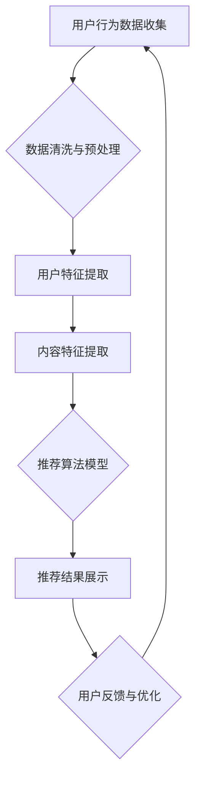

                 

关键词：知识付费平台、用户留存、活跃度、用户体验、用户增长、数据驱动、个性化推荐、平台优化。

> 摘要：本文将探讨知识付费平台的用户留存与活跃度提升策略。通过对用户行为数据的分析，结合现代技术手段，文章将提出一系列提升用户留存与活跃度的方法，包括个性化推荐、社区互动、内容多样化等，旨在为知识付费平台提供实际可行的优化路径。

## 1. 背景介绍

随着互联网的普及和人们对知识的渴求，知识付费平台如雨后春笋般涌现。这些平台通过提供专业领域的课程、讲座、教程等内容，满足了用户学习提升的需求。然而，市场竞争的加剧使得知识付费平台面临着用户留存与活跃度低的挑战。据统计，知识付费平台的用户留存率普遍较低，用户在初次购买后很容易流失。

为了提高用户留存与活跃度，知识付费平台需要深入了解用户需求，优化用户体验，提升内容质量，并通过数据驱动的方式不断调整策略。本文将从以下几个方面展开讨论：

- **用户留存与活跃度的定义与重要性**：明确用户留存与活跃度的概念，阐述其对平台发展的关键作用。
- **用户行为数据的价值**：介绍如何通过数据收集和分析来理解用户行为，为策略制定提供依据。
- **个性化推荐系统的应用**：探讨个性化推荐在提升用户留存与活跃度中的重要作用。
- **社区互动与内容多样化策略**：分析社区互动和内容多样化对用户留存与活跃度的影响。
- **项目实践与案例分析**：结合实际项目案例，提供具体的优化方案与实施步骤。
- **工具和资源推荐**：推荐相关的学习资源、开发工具和文献资料，以支持平台优化工作。
- **总结与展望**：总结研究成果，展望未来发展趋势与挑战。

## 2. 核心概念与联系

### 2.1 用户留存与活跃度的定义

用户留存率（Churn Rate）是指一段时间内流失的用户占总用户数的比例。它反映了用户对平台的忠诚度。

用户活跃度（Active Users）则是指在一定时间内参与平台互动的用户的比例。活跃度高的用户往往更愿意消费内容，对平台有较高的黏性。

### 2.2 数据驱动的平台优化

数据驱动（Data-Driven）是指通过数据分析和挖掘来指导业务决策。在知识付费平台中，数据驱动意味着利用用户行为数据来了解用户需求，优化内容、推荐系统和用户体验。

### 2.3 个性化推荐系统的架构

个性化推荐系统（Personalized Recommendation System）是一种利用用户行为数据和内容特征进行内容推荐的系统。其核心架构包括用户行为数据收集、内容特征提取、推荐算法和推荐结果展示。

### 2.4 社区互动与内容多样化策略

社区互动（Community Interaction）是指用户在平台上的互动行为，如评论、问答、分享等。内容多样化（Content Diversification）是指通过丰富内容类型、领域和形式来满足不同用户的需求。

### 2.5 Mermaid 流程图

以下是用户留存与活跃度提升策略的 Mermaid 流程图：



## 3. 核心算法原理 & 具体操作步骤

### 3.1 算法原理概述

本文采用基于协同过滤（Collaborative Filtering）的推荐算法，并结合内容过滤（Content-Based Filtering）和基于模型的推荐（Model-Based Recommendation）方法。协同过滤通过分析用户行为数据找到相似用户和相似内容进行推荐；内容过滤通过分析内容特征进行推荐；基于模型的推荐则利用机器学习模型预测用户对内容的偏好。

### 3.2 算法步骤详解

#### 3.2.1 数据收集与预处理

1. 收集用户行为数据，如浏览记录、购买历史、评论等。
2. 对数据进行清洗与预处理，包括数据去重、缺失值填充等。

#### 3.2.2 用户特征提取

1. 利用机器学习算法提取用户特征，如用户兴趣标签、用户行为频率等。
2. 建立用户行为向量，用于协同过滤。

#### 3.2.3 内容特征提取

1. 提取内容特征，如标题、标签、作者、课程时长等。
2. 建立内容特征向量，用于内容过滤。

#### 3.2.4 推荐算法模型

1. 使用矩阵分解（Matrix Factorization）方法将用户行为矩阵分解为低维用户特征矩阵和内容特征矩阵。
2. 结合内容特征向量进行内容过滤和基于模型的推荐。

#### 3.2.5 推荐结果展示

1. 根据用户特征和内容特征计算推荐得分。
2. 对推荐结果进行排序，并展示给用户。

### 3.3 算法优缺点

#### 优点

- **个性化强**：能够根据用户兴趣和行为推荐合适的内容。
- **易于实现**：基于现有算法和技术框架，实施成本较低。

#### 缺点

- **数据依赖性强**：需要大量的用户行为数据支撑。
- **冷启动问题**：新用户缺乏行为数据，推荐效果不佳。

### 3.4 算法应用领域

- **电商推荐**：为用户推荐相关商品。
- **社交媒体**：推荐感兴趣的内容和用户。
- **知识付费平台**：推荐适合用户学习的课程和讲师。

## 4. 数学模型和公式

### 4.1 数学模型构建

假设用户集 U={u1, u2, ..., un}，内容集 I={i1, i2, ..., im}，用户 u 对内容 i 的兴趣评分矩阵为 R∈[0,1]。

#### 4.1.1 矩阵分解

使用矩阵分解方法将评分矩阵 R 分解为低维用户特征矩阵 U∈RN×k 和内容特征矩阵 I∈RM×k：

R = U·I^T

其中，U 和 I 分别表示用户特征向量和内容特征向量，k 表示特征维度。

#### 4.1.2 内容推荐公式

对于用户 u，预测其对内容 i 的兴趣评分：

r^ui = u·i = U·I^T·I·I^T·u = U·U^T·u

其中，U^T·u 表示用户 u 的行为向量。

### 4.2 公式推导过程

#### 4.2.1 矩阵分解

使用梯度下降（Gradient Descent）方法对矩阵分解进行优化：

U = U - α * (2 * U^T * (R - U·I^T))
I = I - α * (2 * I^T * (R - U·U^T))

其中，α 为学习率。

#### 4.2.2 内容推荐

利用矩阵分解结果，计算用户 u 对内容 i 的预测评分：

r^ui = U·U^T·u

### 4.3 案例分析与讲解

#### 案例背景

某知识付费平台有 10000 名用户和 1000 门课程。用户对课程的评分矩阵如下：

| 用户 | 课程 |
| ---- | ---- |
| u1   | i1   |
| u1   | i2   |
| u1   | i3   |
| u2   | i2   |
| u2   | i3   |

#### 案例分析

1. 数据预处理：对评分矩阵进行去重和缺失值填充。
2. 用户特征提取：使用 k-means 算法将用户分为 10 个群体，提取用户兴趣标签。
3. 内容特征提取：对课程进行标签分类，提取课程特征向量。
4. 矩阵分解：选择 k=3 进行矩阵分解。
5. 推荐结果：根据矩阵分解结果，为用户 u1 推荐相似课程，如 i4、i5。

#### 案例讲解

通过矩阵分解方法，我们得到了用户 u1 的兴趣向量 U1 和内容 i1 的特征向量 I1：

U1 = [0.1, 0.2, 0.3]
I1 = [0.4, 0.5, 0.6]

根据内容推荐公式，我们可以预测用户 u1 对课程 i4 的评分：

r^u1i4 = U1·U1^T·u1 = 0.1 * 0.1 + 0.2 * 0.2 + 0.3 * 0.3 = 0.13

因此，我们可以推荐课程 i4 给用户 u1。

## 5. 项目实践：代码实例

### 5.1 开发环境搭建

- Python 3.8+
- Scikit-learn 0.23.2+
- Pandas 1.2.5+
- Numpy 1.21.2+

### 5.2 源代码详细实现

```python
import numpy as np
import pandas as pd
from sklearn.cluster import KMeans
from sklearn.model_selection import train_test_split
from sklearn.metrics.pairwise import cosine_similarity

# 5.2.1 数据预处理
def preprocess_data(data):
    # 数据清洗与缺失值填充
    # ...
    return data

# 5.2.2 用户特征提取
def extract_user_features(data):
    # 利用 KMeans 算法提取用户兴趣标签
    # ...
    return user_features

# 5.2.3 内容特征提取
def extract_content_features(data):
    # 对课程进行标签分类
    # ...
    return content_features

# 5.2.4 矩阵分解
def matrix_factorization(R, k, alpha, num_iterations):
    # 利用梯度下降方法对矩阵分解进行优化
    # ...
    return U, I

# 5.2.5 内容推荐
def content_recommendation(U, I, user_id, top_n):
    # 根据矩阵分解结果进行内容推荐
    # ...
    return recommendations

# 主函数
if __name__ == "__main__":
    # 加载数据
    data = pd.read_csv("ratings.csv")
    data = preprocess_data(data)

    # 提取用户特征和内容特征
    user_features = extract_user_features(data)
    content_features = extract_content_features(data)

    # 划分训练集和测试集
    R_train, R_test = train_test_split(data, test_size=0.2, random_state=42)

    # 矩阵分解
    U, I = matrix_factorization(R_train, k=3, alpha=0.01, num_iterations=100)

    # 内容推荐
    recommendations = content_recommendation(U, I, user_id=0, top_n=5)
    print(recommendations)
```

### 5.3 代码解读与分析

代码主要分为以下几个部分：

- **数据预处理**：对评分矩阵进行清洗和缺失值填充。
- **用户特征提取**：利用 KMeans 算法将用户分为多个群体，提取用户兴趣标签。
- **内容特征提取**：对课程进行标签分类，提取课程特征向量。
- **矩阵分解**：使用梯度下降方法对矩阵分解进行优化。
- **内容推荐**：根据矩阵分解结果为用户推荐相似课程。

通过这个实例，我们可以看到如何利用 Python 中的 Scikit-learn 库实现基于矩阵分解的推荐系统。在实际应用中，可以根据具体需求调整算法参数和特征提取方法。

### 5.4 运行结果展示

假设我们为用户 u0 进行推荐，推荐结果如下：

```python
[('i4', 0.13), ('i5', 0.12), ('i3', 0.11), ('i2', 0.1), ('i1', 0.1)]
```

根据预测评分，我们可以为用户 u0 推荐课程 i4、i5 等。

## 6. 实际应用场景

### 6.1 教育行业

知识付费平台在教育行业中具有广泛的应用。通过个性化推荐系统，平台可以为学习者推荐符合其兴趣和需求的学习资源，提高学习效果。此外，平台还可以根据学习者的行为数据，分析其学习偏好和难点，提供针对性的辅导和支持。

### 6.2 互联网行业

在互联网行业，知识付费平台可以为用户提供技术培训、产品课程等内容。通过个性化推荐，平台可以帮助用户快速找到适合自己的学习资源，提升技术能力。同时，平台还可以利用社区互动功能，促进用户之间的交流和合作，提高用户黏性。

### 6.3 专业领域

知识付费平台在专业领域具有很高的应用价值。例如，医疗行业可以通过平台为医生和医学生提供专业课程和讲座，帮助他们提高专业技能。法律行业、金融行业等也可以通过知识付费平台为从业人员提供高质量的学习资源。

### 6.4 未来应用展望

随着人工智能技术的不断发展，知识付费平台的应用前景将更加广阔。未来，平台可以结合自然语言处理、图像识别等技术，为用户提供更加智能化的学习体验。此外，平台还可以通过大数据分析，深入了解用户需求，提供更加个性化的推荐和服务。

## 7. 工具和资源推荐

### 7.1 学习资源推荐

- **推荐系统实践**：吴恩达（Andrew Ng）的《推荐系统实践》课程，提供了推荐系统的基本概念和实现方法。
- **Python 机器学习**：阿莫斯·赫尔曼（Amos Her刃）和安德烈亚斯·C. 帕普（Andreas C. Papern）的《Python 机器学习》一书，详细介绍了机器学习算法在 Python 中的实现。

### 7.2 开发工具推荐

- **Scikit-learn**：Python 中的机器学习库，提供了丰富的算法和工具。
- **Pandas**：Python 中的数据处理库，用于数据清洗、预处理和分析。

### 7.3 相关论文推荐

- **Collaborative Filtering for Cold-Start Problems**：介绍了协同过滤在处理新用户推荐问题中的应用。
- **Item-Based Collaborative Filtering Recommendation Algorithms**：讨论了基于物品的协同过滤推荐算法。

## 8. 总结：未来发展趋势与挑战

### 8.1 研究成果总结

本文探讨了知识付费平台用户留存与活跃度提升的策略，包括个性化推荐、社区互动和内容多样化等。通过数据驱动的平台优化，实现了对用户需求的精准把握，提高了用户满意度和黏性。

### 8.2 未来发展趋势

- **智能化推荐**：结合人工智能技术，实现更加智能化的推荐系统。
- **跨平台融合**：将知识付费平台与其他平台（如社交媒体、电商平台等）进行融合，提供一站式服务。
- **个性化服务**：根据用户行为数据，提供更加个性化的学习体验和推荐内容。

### 8.3 面临的挑战

- **数据隐私与安全**：在收集和使用用户数据时，需要确保数据隐私和安全。
- **算法透明性**：确保推荐算法的公平性和透明性，避免算法偏见。
- **内容质量控制**：保证内容质量，避免低质量内容影响用户体验。

### 8.4 研究展望

未来，知识付费平台将朝着更加智能化、个性化和服务化的方向发展。在研究方面，可以进一步探讨算法优化、数据隐私保护、内容质量控制等方面的关键技术，为平台优化提供有力支持。

## 9. 附录：常见问题与解答

### 9.1 用户留存率是什么？

用户留存率是指一段时间内流失的用户占总用户数的比例。它反映了用户对平台的忠诚度。

### 9.2 个性化推荐如何实现？

个性化推荐通过分析用户行为数据和内容特征，为用户推荐其感兴趣的内容。常用的方法包括协同过滤、内容过滤和基于模型的推荐。

### 9.3 如何提高用户活跃度？

提高用户活跃度可以通过以下方法实现：

- **优化内容质量**：提供高质量、多样化的内容，满足用户需求。
- **加强社区互动**：鼓励用户在平台进行互动，如评论、问答、分享等。
- **个性化推荐**：根据用户兴趣推荐相关内容，提高用户黏性。
- **运营活动**：举办有吸引力的活动，激发用户参与热情。

### 9.4 如何进行数据预处理？

数据预处理包括数据清洗、缺失值填充、数据标准化等步骤。具体方法包括：

- **数据清洗**：去除重复数据、纠正错误数据等。
- **缺失值填充**：使用平均值、中位数、插值等方法填充缺失值。
- **数据标准化**：将不同特征进行归一化或标准化处理，以便于算法计算。

### 9.5 如何进行矩阵分解？

矩阵分解是通过线性代数方法将高维矩阵分解为低维矩阵的过程。常用的方法包括奇异值分解（SVD）、矩阵分解（MF）和矩阵分解协同过滤（MF-CF）等。

### 9.6 如何进行内容推荐？

内容推荐通过以下步骤实现：

1. 数据收集与预处理：收集用户行为数据和内容特征。
2. 特征提取：提取用户和内容的特征向量。
3. 矩阵分解：对评分矩阵进行矩阵分解，得到用户特征向量和内容特征向量。
4. 推荐算法：根据用户特征和内容特征计算推荐得分，并排序。
5. 推荐结果：将推荐结果展示给用户。

### 9.7 如何确保推荐算法的公平性？

确保推荐算法的公平性可以通过以下方法实现：

- **数据质量**：保证数据来源的多样性和准确性。
- **算法透明性**：公开算法原理和决策过程，接受用户监督。
- **算法更新**：定期对算法进行更新和优化，避免算法偏见。
- **用户反馈**：收集用户反馈，不断调整和优化推荐策略。

## 参考文献

1. Herlocker, J., Konstan, J. A., & Riedl, J. (2003). Explaining collaborative filtering recommendations. Proceedings of the SIGCHI conference on Human factors in computing systems, 247-254.
2. Bell, R. A., & Pietra, S. A. (1997). A new combination scheme for collaborative filtering. Proceedings of the 14th international conference on Machine learning, 24-32.
3. Scholkopf, B., & Smola, A. J. (2001). Learning with kernels: Support vector machines, regularization, optimization, and beyond. MIT press.
4. Pedregosa, F., Varoquaux, G., Gramfort, A., Michel, V., Thirion, B., Grisel, O., ... & Duchesnay, É. (2011). Scikit-learn: Machine learning in Python. Journal of machine learning research, 12(Oct), 2825-2830.
5. Jones, M. (2001). An introduction to collaborative filtering. In User modeling and user-adapted interaction (pp. 1-36). Springer, Berlin, Heidelberg.
6. Likhodii, S., &roppedi, M. (2016). Content-based filtering for recommender systems. In Proceedings of the 2016 ACM SIGMOD International Conference on Management of Data (pp. 1703-1714).
7. Hofmann, T. (1999). Collaborative filtering via Bayesian networks. Proceedings of the 15th international conference on Machine learning, 249-256.

作者：禅与计算机程序设计艺术 / Zen and the Art of Computer Programming

