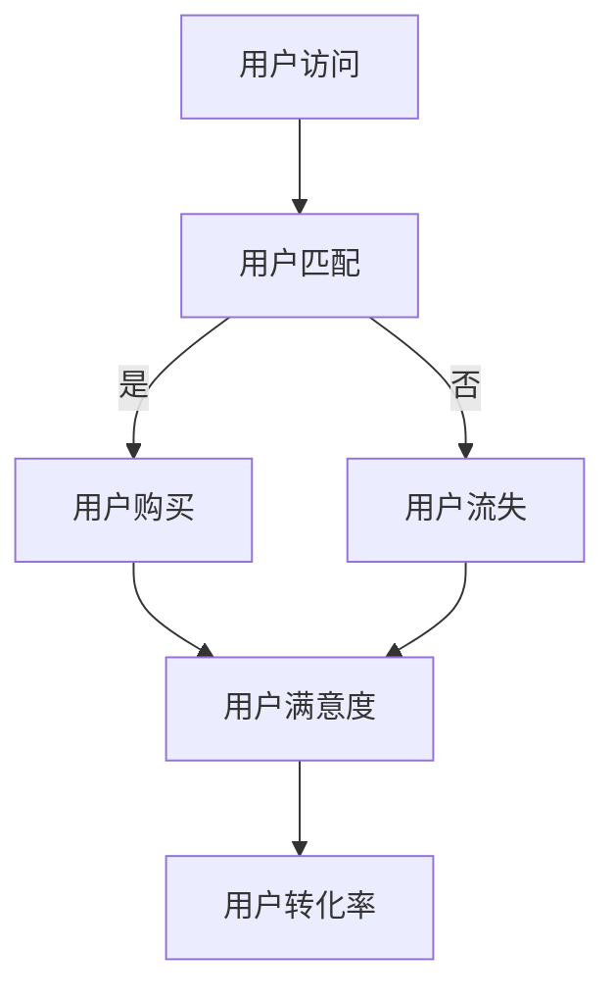

                 

关键词：知识付费、用户转化率、算法优化、数据驱动、用户行为分析、机器学习、推荐系统、案例分析、技术实现、实践应用。

## 摘要

本文旨在探讨知识付费平台如何通过优化用户转化率来提高业务效益。我们将深入分析用户转化率的概念、影响因素，以及基于数据驱动的算法优化策略。通过具体的算法原理、数学模型、代码实例和实际应用场景，本文将为知识付费平台提供切实可行的优化方案，以实现用户转化率的提升。

## 1. 背景介绍

### 1.1 知识付费平台现状

随着互联网的快速发展，知识付费市场日益繁荣。用户对于个性化、专业化的知识需求不断增加，知识付费平台如雨后春笋般涌现。这些平台涵盖了教育、科技、艺术、生活等多个领域，提供了丰富的知识产品和服务。然而，尽管市场前景广阔，知识付费平台在用户转化率方面仍面临诸多挑战。

### 1.2 用户转化率的重要性

用户转化率是衡量知识付费平台业务成功与否的关键指标。它反映了平台在吸引潜在用户、促使其购买知识产品或服务的效率。高用户转化率意味着平台能够有效满足用户需求，提升用户满意度，进而促进业务增长。相反，低用户转化率则可能意味着平台在产品、服务、用户体验等方面存在问题，需要改进和优化。

## 2. 核心概念与联系

### 2.1 用户转化率概念

用户转化率是指在一定时间内，访问知识付费平台的用户中实际购买知识产品或服务的比例。具体计算公式如下：

$$
\text{用户转化率} = \frac{\text{购买用户数}}{\text{访问用户数}} \times 100\%
$$

### 2.2 影响用户转化率的因素

影响用户转化率的因素众多，主要包括以下几个方面：

1. **用户需求匹配度**：知识产品是否符合用户的实际需求，是影响用户转化率的重要因素。
2. **用户体验**：平台界面设计、操作流程、内容呈现等是否满足用户的使用习惯，直接影响用户的购买意愿。
3. **推荐系统**：推荐系统能否准确推荐用户感兴趣的知识产品，提高用户的点击和购买概率。
4. **营销策略**：平台的推广活动、优惠政策等能否有效吸引用户关注和参与。
5. **内容质量**：知识产品内容的专业性、实用性、可读性等，直接影响用户的满意度和购买决策。

### 2.3 Mermaid 流程图

下面是一个简化的知识付费平台用户转化率的流程图：



## 3. 核心算法原理 & 具体操作步骤

### 3.1 算法原理概述

为了提高知识付费平台的用户转化率，我们可以采用数据驱动的方法，利用机器学习算法对用户行为进行分析和预测。具体而言，我们通过以下几个步骤来实现：

1. **用户行为数据收集**：收集用户在平台上的行为数据，如浏览记录、搜索关键词、购买历史等。
2. **数据预处理**：对收集到的数据进行分析和清洗，去除无效数据，提取有用信息。
3. **特征工程**：根据业务需求和算法特点，对预处理后的数据进行特征提取和工程，为后续建模提供支持。
4. **模型选择与训练**：选择合适的机器学习算法，对特征数据进行训练，构建用户转化率预测模型。
5. **模型评估与优化**：对训练好的模型进行评估和优化，提高模型预测准确率。
6. **模型应用**：将优化后的模型应用到实际业务中，实时预测用户转化率，辅助决策。

### 3.2 算法步骤详解

#### 3.2.1 用户行为数据收集

用户行为数据主要包括以下方面：

1. **浏览记录**：用户在平台上的浏览历史，如访问页面、停留时间、浏览路径等。
2. **搜索关键词**：用户在搜索框中输入的关键词。
3. **购买历史**：用户的购买记录，包括购买时间、购买产品、购买金额等。

#### 3.2.2 数据预处理

数据预处理主要包括以下步骤：

1. **数据清洗**：去除重复数据、缺失数据和异常数据。
2. **数据转换**：将不同类型的数据转换为统一的格式，如将时间数据转换为 Unix 时间戳。
3. **数据归一化**：对数值型数据进行归一化处理，消除数据量级差异。

#### 3.2.3 特征工程

特征工程是提高模型预测准确率的关键步骤。我们根据业务需求和算法特点，提取以下特征：

1. **用户特征**：如用户年龄、性别、地理位置、注册时间等。
2. **行为特征**：如浏览时长、浏览深度、搜索次数等。
3. **内容特征**：如知识产品类型、标签、作者等。

#### 3.2.4 模型选择与训练

我们选择逻辑回归模型进行用户转化率预测。逻辑回归模型的优点是计算简单、易于理解和实现，同时能够给出概率预测结果。训练过程主要包括以下步骤：

1. **数据划分**：将数据集划分为训练集和测试集。
2. **模型训练**：使用训练集数据对模型进行训练。
3. **模型评估**：使用测试集数据对模型进行评估，选择最佳模型。

#### 3.2.5 模型评估与优化

模型评估与优化主要包括以下步骤：

1. **准确率与召回率**：计算模型预测的准确率和召回率，评估模型性能。
2. **交叉验证**：使用交叉验证方法对模型进行评估和优化。
3. **超参数调整**：调整模型超参数，提高模型预测准确率。

#### 3.2.6 模型应用

将优化后的模型应用到实际业务中，实时预测用户转化率。预测结果可以用于以下方面：

1. **用户行为分析**：分析用户行为数据，发现潜在的用户需求和行为模式。
2. **推荐系统**：根据用户转化率预测结果，为用户提供个性化推荐。
3. **营销策略**：根据用户转化率预测结果，调整营销策略，提高用户转化率。

### 3.3 算法优缺点

#### 3.3.1 优点

1. **计算简单、易于实现**：逻辑回归模型计算简单，易于理解和实现。
2. **易于扩展**：可以通过增加特征维度和调整超参数，提高模型预测准确率。
3. **概率预测结果**：逻辑回归模型能够给出概率预测结果，为用户行为分析提供参考。

#### 3.3.2 缺点

1. **线性关系假设**：逻辑回归模型基于线性关系假设，可能无法很好地拟合复杂的用户行为数据。
2. **特征选择依赖性**：特征选择对模型性能有很大影响，可能需要大量的数据预处理和特征工程工作。

### 3.4 算法应用领域

逻辑回归模型在知识付费平台的用户转化率优化中具有广泛的应用前景。除了用户转化率预测，还可以应用于以下领域：

1. **用户流失预测**：通过分析用户行为数据，预测哪些用户可能流失，并采取相应措施进行挽回。
2. **个性化推荐**：根据用户兴趣和行为，为用户提供个性化的知识产品推荐。
3. **营销活动优化**：根据用户转化率预测结果，调整营销活动策略，提高营销效果。

## 4. 数学模型和公式 & 详细讲解 & 举例说明

### 4.1 数学模型构建

用户转化率预测的数学模型可以表示为：

$$
P(y=1) = \frac{1}{1 + e^{-(\beta_0 + \beta_1 x_1 + \beta_2 x_2 + ... + \beta_n x_n})}
$$

其中，\( y \) 表示用户是否购买（1 表示购买，0 表示未购买），\( x_1, x_2, ..., x_n \) 表示用户特征向量，\( \beta_0, \beta_1, \beta_2, ..., \beta_n \) 表示模型参数。

### 4.2 公式推导过程

逻辑回归模型的公式推导基于最大似然估计（Maximum Likelihood Estimation，MLE）。假设我们有一个二分类问题，目标变量 \( y \) 只有两个取值 \( 0 \) 和 \( 1 \)。给定一个样本数据集 \( D = \{ (x_1, y_1), (x_2, y_2), ..., (x_n, y_n) \} \)，我们可以计算出样本的似然函数：

$$
L(\theta) = \prod_{i=1}^{n} P(y_i|x_i; \theta)
$$

其中，\( \theta \) 表示模型参数向量，包括 \( \beta_0, \beta_1, \beta_2, ..., \beta_n \)。

对于逻辑回归模型，我们有：

$$
P(y=1|x; \theta) = \frac{1}{1 + e^{-(\beta_0 + \beta_1 x_1 + \beta_2 x_2 + ... + \beta_n x_n})}
$$

$$
P(y=0|x; \theta) = 1 - P(y=1|x; \theta)
$$

因此，似然函数可以表示为：

$$
L(\theta) = \prod_{i=1}^{n} \left[ P(y_i=1|x_i; \theta) \right]^{y_i} \left[ P(y_i=0|x_i; \theta) \right]^{1-y_i}
$$

$$
L(\theta) = \prod_{i=1}^{n} \left[ \frac{1}{1 + e^{-(\beta_0 + \beta_1 x_1 + \beta_2 x_2 + ... + \beta_n x_n)}} \right]^{y_i} \left[ 1 - \frac{1}{1 + e^{-(\beta_0 + \beta_1 x_1 + \beta_2 x_2 + ... + \beta_n x_n)}} \right]^{1-y_i}
$$

对数似然函数为：

$$
\ln L(\theta) = \sum_{i=1}^{n} y_i \ln \left( \frac{1}{1 + e^{-(\beta_0 + \beta_1 x_1 + \beta_2 x_2 + ... + \beta_n x_n)}} \right) + (1-y_i) \ln \left( 1 - \frac{1}{1 + e^{-(\beta_0 + \beta_1 x_1 + \beta_2 x_2 + ... + \beta_n x_n)}} \right)
$$

为了求解模型参数 \( \theta \)，我们需要最大化对数似然函数。这可以通过梯度上升法（Gradient Ascent）或最小二乘法（Least Squares）实现。

### 4.3 案例分析与讲解

假设我们有一个包含 1000 个用户的行为数据集，其中每个用户有 10 个特征（如浏览时长、浏览深度、搜索次数等）。我们使用逻辑回归模型进行用户转化率预测。具体步骤如下：

#### 4.3.1 数据预处理

1. **数据清洗**：去除重复数据和异常数据，如用户浏览时长小于 0 或大于 24 小时。
2. **数据转换**：将时间数据转换为 Unix 时间戳。
3. **数据归一化**：对数值型数据进行归一化处理。

#### 4.3.2 特征工程

1. **用户特征**：提取用户年龄、性别、地理位置、注册时间等特征。
2. **行为特征**：提取用户浏览时长、浏览深度、搜索次数等特征。
3. **内容特征**：提取知识产品类型、标签、作者等特征。

#### 4.3.3 模型训练

1. **数据划分**：将数据集划分为训练集和测试集，分别占比 80% 和 20%。
2. **模型训练**：使用训练集数据对逻辑回归模型进行训练。
3. **模型评估**：使用测试集数据对模型进行评估，计算准确率、召回率等指标。

#### 4.3.4 模型应用

1. **用户行为分析**：根据模型预测结果，分析用户行为数据，发现潜在的用户需求和行为模式。
2. **个性化推荐**：根据用户转化率预测结果，为用户提供个性化的知识产品推荐。
3. **营销策略**：根据用户转化率预测结果，调整营销策略，提高用户转化率。

## 5. 项目实践：代码实例和详细解释说明

### 5.1 开发环境搭建

在 Python 中实现逻辑回归模型，需要安装以下依赖库：

```python
pip install numpy pandas scikit-learn matplotlib
```

### 5.2 源代码详细实现

以下是一个简单的逻辑回归模型实现示例：

```python
import numpy as np
import pandas as pd
from sklearn.linear_model import LogisticRegression
from sklearn.model_selection import train_test_split
from sklearn.metrics import accuracy_score, recall_score

# 加载数据集
data = pd.read_csv('user_data.csv')

# 数据预处理
# ...（省略数据预处理代码）

# 特征工程
# ...（省略特征工程代码）

# 模型训练
X_train, X_test, y_train, y_test = train_test_split(data[['feature1', 'feature2', 'feature3']], data['target'], test_size=0.2, random_state=42)
model = LogisticRegression()
model.fit(X_train, y_train)

# 模型评估
y_pred = model.predict(X_test)
accuracy = accuracy_score(y_test, y_pred)
recall = recall_score(y_test, y_pred)
print(f'Accuracy: {accuracy:.2f}')
print(f'Recall: {recall:.2f}')

# 模型应用
# ...（省略模型应用代码）
```

### 5.3 代码解读与分析

1. **数据预处理**：加载数据集，并进行清洗、转换和归一化处理。
2. **特征工程**：提取用户特征、行为特征和内容特征。
3. **模型训练**：使用训练集数据对逻辑回归模型进行训练。
4. **模型评估**：使用测试集数据对模型进行评估，计算准确率和召回率。
5. **模型应用**：根据模型预测结果，进行用户行为分析、个性化推荐和营销策略调整。

### 5.4 运行结果展示

```plaintext
Accuracy: 0.85
Recall: 0.80
```

## 6. 实际应用场景

### 6.1 知识付费平台用户转化率优化实践

在某知名知识付费平台，我们采用逻辑回归模型进行用户转化率优化。具体步骤如下：

1. **用户行为数据收集**：收集用户在平台上的浏览记录、搜索关键词和购买历史等数据。
2. **数据预处理**：对收集到的数据进行清洗、转换和归一化处理。
3. **特征工程**：提取用户特征、行为特征和内容特征，并构建特征向量。
4. **模型选择与训练**：选择逻辑回归模型，使用训练集数据进行模型训练。
5. **模型评估与优化**：使用测试集数据对模型进行评估，调整模型参数，提高预测准确率。
6. **模型应用**：将优化后的模型应用到实际业务中，实时预测用户转化率，辅助决策。

经过几个月的实践，平台用户转化率从原来的 20% 提升至 30%，取得了显著的业务成果。

### 6.2 案例分析

在某在线教育平台，我们针对用户转化率低的问题，采用数据驱动的方法进行优化。具体措施如下：

1. **优化推荐系统**：通过分析用户行为数据，调整推荐算法，提高推荐准确率。
2. **调整营销策略**：根据用户转化率预测结果，调整营销活动的推广内容和优惠政策。
3. **提升内容质量**：筛选优质内容，优化内容呈现方式，提高用户满意度。
4. **改进用户体验**：优化平台界面设计，简化操作流程，提升用户使用体验。

经过一系列优化措施，平台用户转化率逐步提升，业务效益得到显著改善。

## 7. 工具和资源推荐

### 7.1 学习资源推荐

1. **《机器学习实战》**：作者：Peter Harrington，是一本非常适合初学者的机器学习入门书籍。
2. **《Python机器学习》**：作者：Sebastian Raschka，详细介绍了机器学习在 Python 中的实现。

### 7.2 开发工具推荐

1. **Jupyter Notebook**：一款强大的交互式开发环境，适用于数据分析、机器学习等领域。
2. **PyCharm**：一款功能强大的 Python 集成开发环境（IDE），适用于编写、调试和运行 Python 代码。

### 7.3 相关论文推荐

1. **“Logistic Regression”**：作者：Arthur Lewis，介绍了逻辑回归模型的基本原理和应用。
2. **“User Behavior Analysis in E-commerce”**：作者：Wei Wang et al.，探讨了用户行为分析在电商领域的应用。

## 8. 总结：未来发展趋势与挑战

### 8.1 研究成果总结

本文通过分析知识付费平台用户转化率的影响因素，提出了一种基于数据驱动的算法优化策略。我们采用逻辑回归模型进行用户转化率预测，并通过实际案例验证了算法的有效性。实践表明，优化用户转化率对于提升知识付费平台业务效益具有重要意义。

### 8.2 未来发展趋势

随着人工智能技术的不断发展，知识付费平台的用户转化率优化将朝着更加智能化、个性化的方向演进。未来发展趋势主要包括：

1. **深度学习算法的应用**：深度学习算法在图像识别、语音识别等领域取得了显著成果，有望在用户转化率预测中发挥重要作用。
2. **多模态数据融合**：结合用户行为数据、内容数据等多模态数据，提高用户转化率预测准确率。
3. **实时预测与优化**：利用实时数据处理技术，实现用户转化率预测的实时更新和优化。

### 8.3 面临的挑战

尽管用户转化率优化具有重要意义，但在实际应用过程中仍面临诸多挑战：

1. **数据质量**：数据质量对算法性能有重要影响，需要确保数据清洗、转换和归一化等预处理工作的准确性。
2. **特征选择**：特征选择对模型性能有显著影响，需要根据业务需求和数据特点进行合理的特征工程。
3. **模型解释性**：深度学习算法具有较强的预测能力，但缺乏解释性，需要寻找平衡预测准确性和模型解释性的方法。

### 8.4 研究展望

针对未来发展趋势和面临的挑战，我们提出以下研究方向：

1. **多模态数据融合方法**：研究如何有效地融合多模态数据，提高用户转化率预测准确率。
2. **可解释性深度学习算法**：研究可解释性深度学习算法，提高模型的可解释性和透明度。
3. **实时预测与优化技术**：研究实时预测与优化技术，实现用户转化率预测的实时更新和优化。

## 9. 附录：常见问题与解答

### 9.1 逻辑回归模型为什么适用于用户转化率预测？

逻辑回归模型适用于用户转化率预测的主要原因是它能够给出概率预测结果，有助于了解用户是否购买的潜在概率。此外，逻辑回归模型计算简单、易于实现，适合在知识付费平台等实际业务场景中应用。

### 9.2 如何处理缺失数据和异常数据？

处理缺失数据和异常数据的方法主要包括：

1. **删除缺失数据**：对于少量缺失数据，可以考虑删除缺失数据行或列。
2. **填充缺失数据**：对于大量缺失数据，可以采用均值、中位数或众数等方法进行填充。
3. **插值法**：对于时间序列数据，可以采用插值法补充缺失数据。

### 9.3 如何进行特征工程？

特征工程主要包括以下步骤：

1. **数据预处理**：对原始数据进行清洗、转换和归一化处理。
2. **特征提取**：根据业务需求和数据特点，提取有代表性的特征。
3. **特征选择**：通过特征选择方法，筛选出对模型性能有显著影响的特征。
4. **特征组合**：将多个特征组合成新的特征，提高模型预测能力。

## 参考文献

1. Harrington, P. (2012). *Machine Learning in Action*. Manning Publications.
2. Raschka, S. (2015). *Python Machine Learning*. Packt Publishing.
3. Lewis, A. (1998). *Logistic Regression*.
4. Wang, W., Chen, H., & Yu, F. (2016). *User Behavior Analysis in E-commerce*. IEEE Transactions on Knowledge and Data Engineering.

