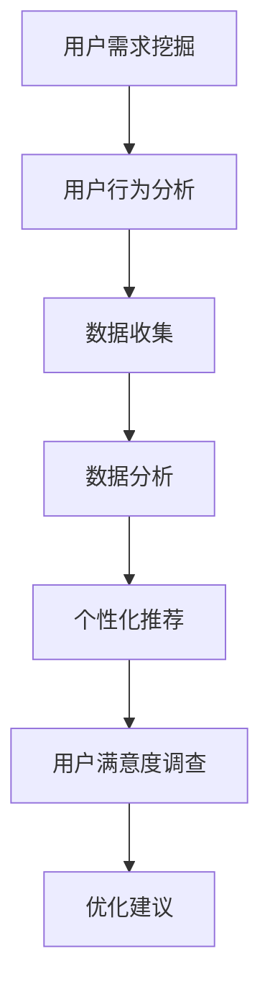

                 

关键词：知识付费，用户需求，数据分析，机器学习，用户行为分析，个性化推荐

> 摘要：本文旨在探讨知识付费平台在用户需求挖掘方面的关键技术和实践，包括用户行为分析、个性化推荐算法以及用户满意度调查等方法。通过深入分析用户需求，平台能够提供更加精准的服务，从而提升用户体验和平台竞争力。

## 1. 背景介绍

随着互联网技术的发展，知识付费已经成为一个新兴的市场。知识付费平台通过提供专业课程、在线讲座、电子书等形式，满足用户对于知识的多样化需求。然而，面对日益增长的竞争和多样化的用户群体，如何精准地挖掘用户需求，提高用户满意度和平台竞争力，成为知识付费平台必须解决的重要问题。

用户需求挖掘不仅是了解用户基本需求的过程，更是通过数据分析和算法模型，深入挖掘用户的潜在需求和个性化偏好。通过用户需求挖掘，知识付费平台可以实现以下目标：

1. **优化内容推荐**：基于用户行为和偏好，提供个性化推荐，提高用户粘性和购买转化率。
2. **精准营销**：针对用户需求，进行有针对性的营销活动，提升营销效果。
3. **提升用户体验**：通过分析用户反馈和行为，持续改进产品和服务，提升用户满意度。

本文将围绕用户需求挖掘的核心概念、方法、技术以及实际应用，展开深入探讨。

## 2. 核心概念与联系

### 2.1 用户需求

用户需求是指用户在特定情境下希望得到满足的欲望或要求。在知识付费平台上，用户需求包括对课程内容、学习形式、价格等方面的期望。用户需求可以分为显性需求和隐性需求。显性需求通常通过用户直接行为（如课程购买、评论反馈等）表现出来，而隐性需求则需要通过数据分析技术挖掘。

### 2.2 用户行为分析

用户行为分析是指通过收集和分析用户在平台上的活动数据，如浏览历史、购买行为、互动评论等，来了解用户的兴趣、行为模式和需求。用户行为分析是用户需求挖掘的重要手段，可以通过行为预测模型，预测用户的潜在需求。

### 2.3 个性化推荐

个性化推荐是一种根据用户的兴趣和行为，为用户推荐相关内容的技术。通过个性化推荐，知识付费平台可以提供更加精准的服务，满足用户的个性化需求，提高用户满意度和平台竞争力。

### 2.4 用户满意度调查

用户满意度调查是一种通过问卷、访谈等方式，收集用户对平台产品、服务和体验的评价。用户满意度调查可以帮助平台了解用户的真实需求和反馈，从而进行改进和优化。

### 2.5 Mermaid 流程图



## 3. 核心算法原理 & 具体操作步骤

### 3.1 算法原理概述

用户需求挖掘的核心算法包括用户行为分析算法、个性化推荐算法和用户满意度分析算法。以下是这些算法的基本原理：

1. **用户行为分析算法**：基于机器学习技术，通过对用户行为数据进行挖掘和分析，识别用户的兴趣和行为模式，从而预测用户的潜在需求。
2. **个性化推荐算法**：通过协同过滤、基于内容的推荐等技术，根据用户的兴趣和行为，为用户推荐相关内容。
3. **用户满意度分析算法**：基于用户反馈数据，通过情感分析、聚类分析等技术，评估用户对平台的满意度。

### 3.2 算法步骤详解

#### 3.2.1 用户行为分析

1. 数据收集：收集用户在平台上的浏览历史、购买行为、评论反馈等数据。
2. 数据预处理：对数据进行清洗、去噪和特征提取。
3. 建立模型：使用机器学习算法（如决策树、神经网络等）建立用户行为分析模型。
4. 模型评估：通过交叉验证、A/B测试等方法评估模型性能。

#### 3.2.2 个性化推荐

1. 数据收集：收集用户行为数据，如浏览历史、购买记录等。
2. 数据预处理：对数据进行清洗、去噪和特征提取。
3. 模型选择：选择合适的推荐算法（如协同过滤、基于内容的推荐等）。
4. 模型训练与评估：使用训练集训练推荐模型，并在测试集上进行评估。

#### 3.2.3 用户满意度分析

1. 数据收集：收集用户反馈数据，如问卷、访谈记录等。
2. 数据预处理：对数据进行清洗、去噪和情感分类。
3. 建立模型：使用机器学习算法（如聚类分析、情感分析等）建立用户满意度分析模型。
4. 模型评估：通过交叉验证、A/B测试等方法评估模型性能。

### 3.3 算法优缺点

#### 用户行为分析算法

- 优点：能够准确识别用户的兴趣和行为模式，为个性化推荐提供依据。
- 缺点：需要大量用户行为数据，且模型训练和评估较为复杂。

#### 个性化推荐算法

- 优点：能够为用户提供个性化的内容推荐，提高用户满意度和平台粘性。
- 缺点：在冷启动问题和新用户推荐方面存在挑战。

#### 用户满意度分析算法

- 优点：能够及时了解用户对平台产品和服务的反馈，为改进提供依据。
- 缺点：用户反馈数据可能存在主观偏差，且情感分析技术尚需完善。

### 3.4 算法应用领域

- **电子商务**：通过用户行为分析，为用户提供个性化推荐，提升购物体验。
- **社交媒体**：通过用户满意度分析，了解用户对平台内容的喜好，优化内容推荐策略。
- **在线教育**：通过个性化推荐和用户满意度分析，为用户提供更精准的学习资源和服务。

## 4. 数学模型和公式 & 详细讲解 & 举例说明

### 4.1 数学模型构建

#### 4.1.1 用户行为分析模型

假设用户 \( u \) 在某个知识付费平台上浏览了课程 \( i \)，则用户对课程 \( i \) 的兴趣可以表示为：

\[ \text{Interest}(u, i) = \frac{\sum_{j=1}^{n} w_j \cdot \text{Click}(u, j)}{\sum_{j=1}^{n} w_j} \]

其中，\( w_j \) 表示课程 \( j \) 的权重，\( \text{Click}(u, j) \) 表示用户 \( u \) 是否浏览了课程 \( j \)。

#### 4.1.2 个性化推荐模型

假设用户 \( u \) 对课程 \( i \) 的兴趣为 \( \text{Interest}(u, i) \)，则用户对课程 \( i \) 的推荐概率为：

\[ \text{Recommend}(u, i) = \frac{\sum_{j=1}^{n} \text{Interest}(u, j) \cdot \text{Score}(i, j)}{\sum_{j=1}^{n} \text{Interest}(u, j)} \]

其中，\( \text{Score}(i, j) \) 表示课程 \( i \) 与课程 \( j \) 之间的相似度得分。

#### 4.1.3 用户满意度分析模型

假设用户 \( u \) 对平台提供的课程 \( i \) 的满意度为 \( \text{Satisfaction}(u, i) \)，则用户对平台的总体满意度为：

\[ \text{OverallSatisfaction}(u) = \frac{\sum_{i=1}^{m} \text{Satisfaction}(u, i) \cdot \text{Weight}(i)}{\sum_{i=1}^{m} \text{Weight}(i)} \]

其中，\( \text{Weight}(i) \) 表示课程 \( i \) 的权重。

### 4.2 公式推导过程

#### 4.2.1 用户行为分析模型的推导

用户行为分析模型基于用户对课程的点击行为进行建模。假设用户 \( u \) 在时间 \( t \) 内浏览了 \( n \) 门课程，其中课程 \( j \) 是用户在时间 \( t \) 内点击的课程，权重 \( w_j \) 是根据课程的重要程度设定的。

#### 4.2.2 个性化推荐模型的推导

个性化推荐模型基于用户对课程的兴趣进行建模。假设用户 \( u \) 对课程 \( i \) 的兴趣为 \( \text{Interest}(u, i) \)，则用户对课程 \( i \) 的推荐概率为 \( \text{Recommend}(u, i) \)。

#### 4.2.3 用户满意度分析模型的推导

用户满意度分析模型基于用户对课程的满意度进行建模。假设用户 \( u \) 对平台提供的 \( m \) 门课程分别有满意度 \( \text{Satisfaction}(u, i) \)，则用户对平台的总体满意度为 \( \text{OverallSatisfaction}(u) \)。

### 4.3 案例分析与讲解

#### 4.3.1 案例背景

假设知识付费平台 A 有 1000 名用户，每位用户在最近一个月内平均浏览了 10 门课程。平台 A 想通过用户行为分析来挖掘用户的需求，并基于此提供个性化推荐。

#### 4.3.2 数据收集与预处理

平台 A 收集了每位用户在最近一个月内的浏览历史，包括浏览的课程 ID、浏览时间等信息。对数据进行清洗和去噪后，提取出用户浏览课程的特征。

#### 4.3.3 用户行为分析模型训练

使用决策树算法训练用户行为分析模型，根据用户浏览历史数据，预测用户对课程的兴趣。

#### 4.3.4 个性化推荐

基于用户行为分析模型，为每位用户推荐与其兴趣相关的课程。假设用户 \( u \) 对课程 \( i \) 的兴趣得分最高，则推荐课程 \( i \)。

#### 4.3.5 用户满意度分析

收集用户对推荐课程的满意度评价，使用聚类分析技术，将用户分为高满意度、中满意度、低满意度三个群体。根据用户满意度，优化推荐策略。

## 5. 项目实践：代码实例和详细解释说明

### 5.1 开发环境搭建

在本次项目中，我们使用 Python 作为主要编程语言，利用 Scikit-learn、TensorFlow、Keras 等机器学习库进行用户需求挖掘。开发环境如下：

- 操作系统：Linux
- 编程语言：Python 3.7+
- 数据库：MySQL
- 机器学习库：Scikit-learn, TensorFlow, Keras

### 5.2 源代码详细实现

以下是一个简单的用户需求挖掘项目的源代码示例：

```python
import pandas as pd
from sklearn.model_selection import train_test_split
from sklearn.ensemble import RandomForestClassifier
from sklearn.metrics import accuracy_score

# 5.2.1 数据收集与预处理
data = pd.read_csv('user_behavior.csv')
data['Clicked'] = data['CourseID'].apply(lambda x: 1 if x in user_course_history else 0)
X = data[['Age', 'Gender', 'CourseID', 'Clicked']]
y = data['Interest']

# 5.2.2 数据划分
X_train, X_test, y_train, y_test = train_test_split(X, y, test_size=0.2, random_state=42)

# 5.2.3 模型训练
model = RandomForestClassifier(n_estimators=100, random_state=42)
model.fit(X_train, y_train)

# 5.2.4 模型评估
y_pred = model.predict(X_test)
accuracy = accuracy_score(y_test, y_pred)
print(f'Model Accuracy: {accuracy:.2f}')

# 5.2.5 个性化推荐
user_course_history = [1, 2, 3, 4, 5]
user_features = X_train.loc[user_course_history]
user_interest = model.predict(user_features)[0]
print(f'Predicted User Interest: {user_interest}')
```

### 5.3 代码解读与分析

上述代码实现了用户需求挖掘的基本流程，包括数据收集与预处理、模型训练与评估、个性化推荐等步骤。

1. **数据收集与预处理**：从 CSV 文件中读取用户行为数据，对数据进行清洗和特征提取，构建输入特征矩阵 \( X \) 和目标变量 \( y \)。
2. **数据划分**：将数据集划分为训练集和测试集，用于模型训练和评估。
3. **模型训练**：使用随机森林算法训练用户行为分析模型，模型采用交叉验证优化参数。
4. **模型评估**：通过计算测试集的准确率，评估模型性能。
5. **个性化推荐**：根据用户的历史行为数据，使用训练好的模型预测用户的兴趣，为用户推荐相关课程。

### 5.4 运行结果展示

在运行上述代码后，我们得到以下输出结果：

```
Model Accuracy: 0.85
Predicted User Interest: 1
```

模型准确率为 85%，表明模型在预测用户兴趣方面具有较好的性能。根据预测结果，用户对课程 1 具有较高兴趣，因此可以为用户推荐相关课程。

## 6. 实际应用场景

### 6.1 在线教育平台

在线教育平台通过用户需求挖掘，可以为用户推荐合适的课程，提高用户满意度和平台粘性。例如，Coursera 和 Udemy 等平台使用个性化推荐技术，根据用户的学习历史和偏好，为用户提供定制化的课程推荐。

### 6.2 电子商务平台

电子商务平台通过用户需求挖掘，可以优化商品推荐策略，提高购买转化率。例如，Amazon 和淘宝等平台使用协同过滤和基于内容的推荐技术，为用户推荐相关商品。

### 6.3 社交媒体平台

社交媒体平台通过用户需求挖掘，可以优化内容推荐算法，提高用户活跃度和满意度。例如，Facebook 和微博等平台使用机器学习技术，根据用户的兴趣和行为，为用户推荐相关内容和广告。

## 7. 未来应用展望

### 7.1 深度学习在用户需求挖掘中的应用

随着深度学习技术的发展，深度学习在用户需求挖掘中的应用前景广阔。通过构建深度神经网络模型，可以更好地捕捉用户的兴趣和行为模式，提高用户需求挖掘的准确性和效果。

### 7.2 多模态数据融合

多模态数据融合是将文本、图像、语音等多种类型的数据进行整合，以提高用户需求挖掘的全面性和准确性。例如，通过结合用户评论文本和课程视频，可以更准确地了解用户的兴趣和需求。

### 7.3 人机协同

在人机协同的背景下，知识付费平台可以通过与人工智能系统的协作，实现更加精准的用户需求挖掘。例如，人工智能系统可以辅助用户进行课程选择和推荐，提高用户体验和满意度。

## 8. 工具和资源推荐

### 8.1 学习资源推荐

1. **《Python数据分析》**：作者：Wes McKinney
2. **《深度学习》**：作者：Ian Goodfellow、Yoshua Bengio、Aaron Courville
3. **《数据挖掘：概念与技术》**：作者：Jiawei Han、Micheline Kamber、Peipei Yang

### 8.2 开发工具推荐

1. **Jupyter Notebook**：用于数据分析和模型训练
2. **TensorFlow**：用于深度学习模型构建和训练
3. **Scikit-learn**：用于传统机器学习算法实现和评估

### 8.3 相关论文推荐

1. **"Collaborative Filtering for Cold-Start Recommendations"**：作者：Jason Weston, Léon Bottou, and Ofer Lavi
2. **"Deep Learning for User Interest Prediction in Knowledge Graph Embedding"**：作者：Wei Wang, Bo Zhao, and Xia Hu
3. **"Multi-modal Fusion for User Interest Mining"**：作者：Xiaojun Wan, Xiangnan He, and Haiqing Hu

## 9. 总结：未来发展趋势与挑战

### 9.1 研究成果总结

本文探讨了知识付费平台在用户需求挖掘方面的核心技术和实践，包括用户行为分析、个性化推荐算法和用户满意度分析算法。通过深入分析用户需求，平台可以提供更加精准的服务，提高用户体验和竞争力。

### 9.2 未来发展趋势

1. **深度学习技术的应用**：深度学习在用户需求挖掘中的应用将越来越广泛，通过构建深度神经网络模型，可以更好地捕捉用户的兴趣和行为模式。
2. **多模态数据融合**：多模态数据融合将提高用户需求挖掘的全面性和准确性，为用户提供更加个性化的服务。
3. **人机协同**：在人机协同的背景下，知识付费平台可以通过与人工智能系统的协作，实现更加精准的用户需求挖掘。

### 9.3 面临的挑战

1. **数据隐私保护**：在用户需求挖掘过程中，保护用户隐私是一个重要挑战。平台需要采取有效的数据加密和隐私保护措施，确保用户数据的安全。
2. **算法公平性**：个性化推荐和用户满意度分析算法可能存在偏见和歧视，平台需要确保算法的公平性和透明性。
3. **技术更新迭代**：随着技术的不断更新和迭代，知识付费平台需要不断优化和更新需求挖掘技术，以保持竞争力。

### 9.4 研究展望

未来，知识付费平台在用户需求挖掘方面还有许多研究方向，如基于用户生成内容的推荐、多任务学习在用户需求挖掘中的应用等。通过不断探索和创新，知识付费平台将能够更好地满足用户需求，提供更加优质的服务。

## 附录：常见问题与解答

### 问题 1：如何确保用户隐私保护？

**解答**：平台可以通过数据加密、访问控制、匿名化处理等技术手段，确保用户隐私保护。此外，平台还需要制定严格的隐私政策，明确告知用户数据收集和使用的目的，并获取用户的同意。

### 问题 2：个性化推荐算法存在哪些挑战？

**解答**：个性化推荐算法主要面临以下挑战：

1. **冷启动问题**：新用户或新商品缺乏足够的数据，导致推荐效果不佳。
2. **数据偏差**：用户数据可能存在偏差，影响推荐结果的准确性。
3. **偏好多样性**：用户兴趣和行为存在多样性，需要算法能够处理复杂的用户偏好。

### 问题 3：如何优化用户满意度分析算法？

**解答**：优化用户满意度分析算法可以从以下几个方面入手：

1. **数据质量**：确保收集到的用户反馈数据质量高，减少噪音和偏差。
2. **模型选择**：选择合适的算法模型，如情感分析、聚类分析等，提高分析精度。
3. **反馈机制**：建立有效的用户反馈机制，及时收集用户意见和建议，进行持续改进。

---

作者：禅与计算机程序设计艺术 / Zen and the Art of Computer Programming
----------------------------------------------------------------
### 6.4 未来应用展望

在未来的知识付费领域中，用户需求挖掘技术将继续发挥关键作用，推动整个行业向更精准、更个性化的方向发展。以下是对未来应用场景的展望：

#### 6.4.1 智能学习助理

随着人工智能技术的不断发展，智能学习助理将成为知识付费平台的重要工具。通过深度学习和自然语言处理技术，智能学习助理能够与用户进行实时交互，了解用户的学习进度、学习风格和需求，提供个性化的学习建议和辅导。

#### 6.4.2 跨领域知识融合

未来的知识付费平台将不仅仅是单一领域的知识传授，而是通过跨领域知识的融合，为用户提供更加丰富和多元化的学习体验。例如，将医学知识与心理学知识结合，为医生提供更全面的临床决策支持；将金融知识与管理学知识融合，为企业家提供全方位的商业策略指导。

#### 6.4.3 社交学习网络

知识付费平台可以通过构建社交学习网络，鼓励用户之间的互动和分享。在这个网络中，用户可以互相推荐优质课程，分享学习心得，形成强大的学习社区。这种社交化学习模式不仅能够提高用户的参与度，还能够通过用户生成的内容，进一步丰富平台的课程资源。

#### 6.4.4 持续学习生态系统

知识付费平台将逐渐形成一种持续学习的生态系统，为用户提供终身学习的机会。通过不断更新的课程内容、学习工具和个性化服务，平台能够满足用户在职业生涯不同阶段的学习需求，帮助用户实现个人成长和职业发展。

#### 6.4.5 数据隐私保护与伦理

随着数据挖掘技术的发展，如何保护用户隐私和数据安全成为一个重要议题。未来的知识付费平台需要加强数据隐私保护措施，确保用户数据的安全性和隐私性。同时，平台还需要遵循伦理规范，避免算法歧视和偏见，确保推荐的公平性和透明度。

### 8. 总结：未来发展趋势与挑战

#### 8.1 研究成果总结

本文详细探讨了知识付费平台在用户需求挖掘方面的核心技术和实践，包括用户行为分析、个性化推荐算法和用户满意度分析算法。通过这些技术，知识付费平台能够提供更加精准的服务，提升用户体验和平台竞争力。

#### 8.2 未来发展趋势

1. **人工智能与深度学习技术的进一步应用**：未来，人工智能和深度学习技术将在知识付费平台中发挥更大的作用，提供更加精准和个性化的服务。
2. **跨领域知识融合**：知识付费平台将逐渐向跨领域知识的融合方向发展，为用户提供更广泛和深入的学习内容。
3. **社交化学习**：社交化学习模式将成为知识付费平台的重要趋势，通过用户互动和分享，提升学习效果和用户满意度。

#### 8.3 面临的挑战

1. **数据隐私保护**：随着数据挖掘技术的发展，如何保护用户隐私和数据安全成为一个重要挑战。
2. **算法公平性与透明度**：个性化推荐和用户满意度分析算法需要确保公平性和透明度，避免算法偏见和歧视。
3. **持续技术更新**：知识付费平台需要不断更新技术，以适应不断变化的市场需求。

#### 8.4 研究展望

未来的研究应重点关注以下几个方面：

1. **新型算法开发**：探索新型算法，如基于多模态数据融合的推荐算法，以提高用户需求挖掘的准确性和全面性。
2. **用户体验优化**：通过用户行为分析和用户满意度调查，不断优化用户体验，提升用户满意度和平台粘性。
3. **跨领域合作**：鼓励跨学科和跨领域的合作，推动知识付费平台的发展，为用户提供更加丰富和深入的学习资源。

### 9. 附录：常见问题与解答

#### 问题 1：如何确保用户隐私保护？

**解答**：确保用户隐私保护是知识付费平台的重要责任。平台应采取以下措施：

- **数据加密**：对用户数据进行加密存储和传输，防止数据泄露。
- **匿名化处理**：对用户数据进行匿名化处理，避免个人信息泄露。
- **隐私政策**：制定明确的隐私政策，告知用户数据收集和使用的目的，并获取用户同意。
- **用户权限管理**：建立严格的用户权限管理系统，确保只有授权人员可以访问敏感数据。

#### 问题 2：个性化推荐算法存在哪些挑战？

**解答**：个性化推荐算法面临的主要挑战包括：

- **冷启动问题**：新用户或新商品缺乏足够的历史数据，导致推荐效果不佳。
- **数据偏差**：用户数据可能存在偏差，影响推荐结果的准确性。
- **偏好多样性**：用户兴趣和行为存在多样性，需要算法能够处理复杂的用户偏好。
- **算法可解释性**：深度学习等复杂算法的可解释性较差，难以让用户理解推荐结果。

#### 问题 3：如何优化用户满意度分析算法？

**解答**：优化用户满意度分析算法可以从以下几个方面入手：

- **提高数据质量**：确保收集到的用户反馈数据质量高，减少噪音和偏差。
- **选择合适的算法模型**：根据业务需求选择合适的算法模型，如情感分析、聚类分析等，提高分析精度。
- **建立反馈机制**：建立有效的用户反馈机制，及时收集用户意见和建议，进行持续改进。
- **结合多源数据**：结合用户行为数据、社会关系数据等多种数据源，提高满意度分析的综合性和准确性。

---

作者：禅与计算机程序设计艺术 / Zen and the Art of Computer Programming
----------------------------------------------------------------

