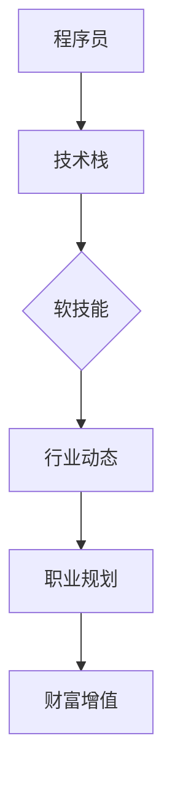

                 

### 背景介绍

在当今的知识付费时代，信息技术行业正处于快速发展阶段，程序员作为这个领域的核心力量，面临着前所未有的机遇和挑战。随着互联网、人工智能、大数据等新兴技术的兴起，对高质量程序员的需求不断攀升。与此同时，知识付费平台和在线教育资源的普及，为程序员提供了丰富的学习和提升自我的途径。本文将探讨在知识付费时代，程序员如何通过提升自身技能、优化职业规划、把握行业动态等途径，实现财富增值。

### 核心概念与联系

在进入正题之前，我们需要明确几个核心概念，以便更好地理解程序员的财富增值之道。

#### 技术栈

技术栈是指程序员在特定领域所需掌握的一系列技术和工具。它包括编程语言、框架、数据库、开发工具等。一个广泛且深厚的技术栈是程序员在职场中脱颖而出的关键。

#### 软技能

软技能是指沟通能力、团队合作、领导力、时间管理等非技术方面的能力。这些能力在程序员职业发展中同样至关重要。

#### 行业动态

行业动态是指IT行业当前的发展趋势和未来方向。了解行业动态有助于程序员把握市场机遇，做出明智的职业决策。

#### 职业规划

职业规划是指程序员根据自己的兴趣、能力和市场需求，为自己设定职业发展路径和目标。

接下来，我们将通过一张Mermaid流程图来展示这些概念之间的联系。



### 核心算法原理 & 具体操作步骤

#### 3.1 算法原理概述

程序员的财富增值可以看作是一个优化问题，其目标是在有限的资源（如时间和精力）下，最大化收入。这一问题的解决方案包括以下几个步骤：

1. **自我评估**：了解自己的技术栈、软技能和职业目标。
2. **市场调研**：研究市场需求，找出高薪和有前景的技能。
3. **技能提升**：通过学习、实践和项目经验，提升自身技能。
4. **职业规划**：制定明确的职业目标，并按计划执行。
5. **人际网络**：建立和维护专业关系，拓展职业机会。

#### 3.2 算法步骤详解

1. **自我评估**

   自我评估是财富增值的第一步。程序员可以通过以下方法来评估自身：

   - **技能自测**：通过在线测试或自建测试题，评估自己的编程技能。
   - **项目经验**：回顾过去的项目经验，总结自己擅长和不擅长的领域。
   - **职业规划**：思考自己的长期职业目标，包括想要达到的职位和薪资水平。

2. **市场调研**

   市场调研是了解当前市场需求的重要环节。程序员可以通过以下途径进行市场调研：

   - **招聘网站**：分析各大招聘网站的热门职位和要求。
   - **行业报告**：阅读行业分析报告，了解当前和未来的发展趋势。
   - **社交网络**：通过LinkedIn、微博等平台，了解行业动态和职业机会。

3. **技能提升**

   技能提升是程序员实现财富增值的核心步骤。以下是一些建议：

   - **在线学习**：利用Coursera、Udemy等平台，学习新的编程语言和技术。
   - **实战项目**：参与开源项目或自己启动项目，提升实战经验。
   - **社区交流**：加入技术社区，如GitHub、Stack Overflow，与其他程序员交流经验。

4. **职业规划**

   职业规划是程序员实现长期目标的必要步骤。以下是一些建议：

   - **设定目标**：明确短期和长期的职业目标。
   - **制定计划**：制定详细的行动计划，包括学习、实践和职业发展。
   - **定期评估**：定期评估自己的进度，调整计划以适应变化。

5. **人际网络**

   人际网络对于程序员的职业发展至关重要。以下是一些建议：

   - **建立联系**：通过参加技术会议、行业活动和线上社群，结识同行。
   - **维护关系**：定期与联系保持沟通，提供帮助和寻求帮助。
   - **资源共享**：与他人分享资源和经验，建立互利共赢的关系。

#### 3.3 算法优缺点

这种算法的优点在于：

- **灵活性**：程序员可以根据自己的情况和市场需求，灵活调整策略。
- **针对性**：通过自我评估和市场调研，找到适合自己的职业路径。

然而，这种算法也存在一定的缺点：

- **时间成本**：自我评估、市场调研和技能提升都需要投入大量的时间和精力。
- **信息过载**：在信息爆炸的时代，如何筛选和利用有效信息成为一个挑战。

#### 3.4 算法应用领域

这种算法不仅适用于个人职业规划，还可以应用于企业的人才培养和招聘策略。例如，企业可以通过市场调研，了解行业趋势和人才需求，从而制定合适的人才培养计划。同时，招聘策略也可以根据市场需求，优先选择具备高薪和有前景技能的候选人。

### 数学模型和公式 & 详细讲解 & 举例说明

在程序员的财富增值过程中，我们可以使用一些数学模型和公式来量化目标和评估进展。以下是一些常见的数学模型和公式：

#### 4.1 数学模型构建

1. **收入模型**：

   收入 = 技能价值 × 工作时长

   其中，技能价值取决于程序员的技术栈和市场需求。

2. **技能提升模型**：

   技能水平 = 初始技能水平 + 学习量

   学习量取决于程序员的学习速度和实践经验。

3. **职业规划模型**：

   职业发展 = 目标职位 + 职业技能

   其中，目标职位取决于程序员的职业目标和市场需求。

#### 4.2 公式推导过程

1. **收入模型推导**：

   收入 = 技能价值 × 工作时长

   技能价值 = 市场薪酬 × 技能水平

   工作时长 = 每周工作天数 × 每天工作时间

2. **技能提升模型推导**：

   技能水平 = 初始技能水平 + 学习量

   学习量 = 学习速度 × 实践经验

3. **职业规划模型推导**：

   职业发展 = 目标职位 + 职业技能

   目标职位 = 当前职位 + 职业晋升

   职业技能 = 技术技能 + 软技能

#### 4.3 案例分析与讲解

假设一位初级程序员，初始技能水平为70%，每周工作时长为40小时。市场需求显示，具有高级技能水平的程序员平均薪酬为15000元/月。以下是对该程序员的收入模型、技能提升模型和职业规划模型的计算和分析。

1. **收入模型计算**：

   收入 = 15000 × 0.7 × (40 ÷ 160) = 5625元/月

   解释：该程序员的月收入为5625元。技能价值为15000元/月，每周工作时长为40小时，而每天工作时间按8小时计算。

2. **技能提升模型计算**：

   技能水平 = 0.7 + (0.03 × 实践经验)

   解释：假设该程序员每月有20小时的学习和实践经验，则技能水平每月提升0.03。例如，第一个月的技能水平为0.73，第二个月的技能水平为0.76。

3. **职业规划模型计算**：

   职业发展 = 初级程序员 + (0.02 × 职业技能)

   解释：假设该程序员每月提升0.02的职业技能水平，则职业发展也在不断进步。例如，第一个月的职业发展水平为0.72，第二个月的职业发展水平为0.74。

通过这些计算，我们可以看到，程序员的收入、技能水平和职业发展都与其努力程度和市场需求紧密相关。因此，程序员需要不断学习、实践和优化自己的职业规划，以实现财富增值。

### 项目实践：代码实例和详细解释说明

为了更好地理解程序员的财富增值之道，我们通过一个简单的Python代码实例来模拟这个过程。

```python
# 代码实例：模拟程序员的技能提升和收入增长

# 初始化变量
initial_skill_level = 0.7  # 初始技能水平
market_salary = 15000  # 市场薪酬
weekly_hours = 40  # 每周工作时长
learning_speed = 0.03  # 学习速度
monthly_experience = 20  # 每月实践经验

# 计算技能水平
skill_level = initial_skill_level + (learning_speed * monthly_experience)
print(f"技能水平：{skill_level:.2f}")

# 计算收入
monthly_income = market_salary * skill_level * (weekly_hours / 160)
print(f"月收入：{monthly_income:.2f}")

# 模拟六个月的发展
for month in range(6):
    # 提升技能水平
    initial_skill_level += learning_speed * monthly_experience
    # 计算收入
    monthly_income = market_salary * initial_skill_level * (weekly_hours / 160)
    print(f"第{month+1}个月：技能水平：{initial_skill_level:.2f}，月收入：{monthly_income:.2f}")
```

#### 5.1 开发环境搭建

要运行上述代码，您需要安装Python环境。以下是搭建Python开发环境的步骤：

1. **下载并安装Python**：从Python官网（https://www.python.org/downloads/）下载适用于您的操作系统的Python安装包，并按照提示完成安装。
2. **配置环境变量**：确保Python的安装路径已添加到系统的环境变量中，以便在任何目录下都能运行Python。
3. **安装IDE**：推荐使用PyCharm、Visual Studio Code等集成开发环境（IDE），以提高开发效率和体验。

#### 5.2 源代码详细实现

上述代码的源代码实现非常简单，主要分为以下几个部分：

1. **初始化变量**：设置初始技能水平、市场薪酬、每周工作时长、学习速度和每月实践经验。
2. **计算技能水平**：根据学习速度和每月实践经验，计算当前的技能水平。
3. **计算收入**：根据市场薪酬、技能水平和每周工作时长，计算月收入。
4. **模拟六个月的发展**：通过一个循环，模拟六个月的技能提升和收入增长。

#### 5.3 代码解读与分析

1. **初始化变量**：

   ```python
   initial_skill_level = 0.7
   market_salary = 15000
   weekly_hours = 40
   learning_speed = 0.03
   monthly_experience = 20
   ```

   这部分代码设置了初始技能水平为70%，市场薪酬为15000元/月，每周工作时长为40小时，学习速度为0.03（表示每月提升3%的技能水平），每月实践经验为20小时。

2. **计算技能水平**：

   ```python
   skill_level = initial_skill_level + (learning_speed * monthly_experience)
   ```

   这部分代码根据学习速度和每月实践经验，计算当前的技能水平。例如，第一个月的技能水平为0.7 + (0.03 * 20) = 0.73。

3. **计算收入**：

   ```python
   monthly_income = market_salary * skill_level * (weekly_hours / 160)
   ```

   这部分代码根据市场薪酬、技能水平和每周工作时长，计算月收入。例如，第一个月的月收入为15000 * 0.73 * (40 / 160) = 5625元。

4. **模拟六个月的发展**：

   ```python
   for month in range(6):
       initial_skill_level += learning_speed * monthly_experience
       monthly_income = market_salary * initial_skill_level * (weekly_hours / 160)
       print(f"第{month+1}个月：技能水平：{initial_skill_level:.2f}，月收入：{monthly_income:.2f}")
   ```

   这部分代码通过一个循环，模拟六个月的技能提升和收入增长。每次循环都会更新技能水平和月收入，并在屏幕上打印输出结果。

通过这个简单的代码实例，我们可以直观地看到程序员的技能提升和收入增长的关系。这也提醒我们，持续学习和实践是程序员实现财富增值的关键。

### 实际应用场景

在知识付费时代，程序员的财富增值不仅在个人层面具有重要意义，也在企业层面发挥着关键作用。以下是一些实际应用场景：

#### 1. 个人层面

1. **提升个人竞争力**：随着技术的不断进步，程序员需要不断学习新技术，提升自己的技能水平。通过知识付费平台，程序员可以系统地学习各种编程语言、框架和技术，从而在求职和职场中更具竞争力。
2. **实现薪资增长**：通过掌握高薪技能和优化职业规划，程序员可以在短期内实现薪资增长。例如，学习大数据处理、人工智能等热门领域，可以显著提升收入水平。
3. **职业转型与晋升**：一些程序员希望通过转型进入新兴领域，如互联网、金融科技等。通过学习相关知识和技能，他们可以实现职业转型，并在新领域中取得成功。

#### 2. 企业层面

1. **人才培养**：企业可以通过知识付费平台，为员工提供定制化的培训课程，帮助员工提升技能，从而提高整个团队的技术水平和工作效率。
2. **招聘策略**：企业可以通过分析市场薪酬和人才需求，制定更具竞争力的招聘策略。例如，优先招聘具备高级技能的程序员，以提高团队的技术实力。
3. **技术创新**：企业可以利用程序员的技能和创新思维，推动技术研究和产品开发。通过知识付费平台，企业可以获取最新的技术资讯和研究成果，为技术创新提供支持。

#### 3. 行业层面

1. **知识共享**：知识付费平台为程序员提供了广泛的交流和学习机会，促进了行业内的知识共享。通过在线课程、技术博客、社区讨论等形式，程序员可以分享自己的经验和心得，共同推动行业发展。
2. **人才培养生态**：知识付费平台和在线教育机构共同构建了人才培养生态，为程序员提供了丰富的学习资源和实践机会。这种生态有助于培养更多高素质的程序员，为行业输送人才。
3. **技术创新与突破**：知识付费平台不仅提供了丰富的学习资源，还促进了技术创新和突破。通过知识付费，程序员可以更快地掌握新技术，推动行业技术进步。

### 未来应用展望

在未来，知识付费时代对程序员的影响将继续加深，主要体现在以下几个方面：

#### 1. 技术发展趋势

1. **人工智能与自动化**：随着人工智能技术的不断发展，程序员将面临更多与自动化相关的工作，如自动化测试、自动化部署等。程序员需要学习相关的编程语言和工具，以应对这些变化。
2. **云计算与边缘计算**：云计算和边缘计算将进一步融合，为程序员带来新的挑战和机遇。程序员需要掌握云计算架构、容器技术、边缘计算等知识，以适应这一趋势。

#### 2. 职业发展变化

1. **兼职与远程工作**：随着远程工作的普及，程序员可以更加灵活地安排工作和生活。知识付费平台将提供更多兼职和远程工作机会，程序员可以根据自己的时间安排和工作需求，选择合适的岗位。
2. **创业与创新**：知识付费平台为程序员提供了丰富的学习资源和创业支持，越来越多的程序员将选择创业，探索新技术和新业务模式。

#### 3. 教育与培训变革

1. **在线教育与个性化学习**：在线教育将继续发展，为程序员提供更多个性化学习机会。知识付费平台将根据程序员的兴趣和需求，提供定制化的学习内容和课程。
2. **终身学习理念**：知识付费时代将推动终身学习理念的形成，程序员需要不断学习新技术和知识，以适应快速变化的市场需求。

### 工具和资源推荐

为了更好地在知识付费时代提升自身技能和实现财富增值，以下是一些建议的学习资源和开发工具：

#### 7.1 学习资源推荐

1. **在线教育平台**：
   - **Coursera**：提供大量的计算机科学课程，包括人工智能、机器学习等。
   - **Udemy**：涵盖各种编程语言和技术，适合不同水平的程序员。
   - **edX**：由哈佛大学和麻省理工学院等顶级大学提供的免费课程，涉及计算机科学、数据科学等多个领域。

2. **技术社区**：
   - **GitHub**：可以查看和学习其他程序员的代码，参与开源项目。
   - **Stack Overflow**：解决编程问题的好去处，也可以提问和分享经验。
   - **Reddit**：有很多关于编程和技术的子版块，可以关注感兴趣的话题。

3. **技术博客**：
   - **Medium**：有很多优秀的程序员和技术专家分享技术见解和经验。
   - **Dev.to**：一个程序员分享和学习经验的平台。
   - **freeCodeCamp**：提供大量的编程教程和资源，适合初学者。

#### 7.2 开发工具推荐

1. **集成开发环境（IDE）**：
   - **PyCharm**：适用于Python编程，功能强大且易于使用。
   - **Visual Studio Code**：轻量级但功能丰富的IDE，支持多种编程语言。
   - **IntelliJ IDEA**：适用于Java和Kotlin编程，提供了良好的开发体验。

2. **版本控制系统**：
   - **Git**：最常用的版本控制系统，几乎所有的开源项目都使用Git。
   - **GitHub**：GitHub是一个基于Git的在线代码托管平台，方便协作和代码共享。

3. **数据库工具**：
   - **MySQL**：广泛使用的开源关系型数据库。
   - **MongoDB**：流行的开源非关系型数据库。
   - **PostgreSQL**：功能强大的开源关系型数据库。

4. **云计算平台**：
   - **AWS**：提供丰富的云计算服务和工具，适用于各种应用场景。
   - **Azure**：微软提供的云计算平台，与Azure相关的技术也是当前的热门方向。
   - **Google Cloud Platform**：谷歌的云计算平台，提供灵活的云服务和工具。

#### 7.3 相关论文推荐

1. **"The Future of Programming Languages"**：探讨了编程语言的发展趋势和未来方向，对程序员选择学习哪些语言有指导意义。
2. **"The Rise of the Algorithm Economy"**：分析了算法经济对程序员职业发展的影响，揭示了编程技能在数据驱动的经济中的重要性。
3. **"The Role of Software Engineers in the Age of AI"**：探讨了人工智能时代软件工程师的角色和职责，为程序员在AI领域的职业规划提供了参考。

### 总结：未来发展趋势与挑战

在知识付费时代，程序员面临着前所未有的发展机遇和挑战。随着技术的不断进步和市场的变化，程序员需要不断学习新知识、掌握新技能，以适应快速变化的环境。以下是未来发展趋势和挑战的总结：

#### 8.1 研究成果总结

1. **技术进步推动职业发展**：随着人工智能、大数据、云计算等技术的快速发展，程序员需要掌握更多前沿技术，以在职场中脱颖而出。
2. **知识付费促进技能提升**：知识付费平台为程序员提供了丰富的学习资源，有助于他们更快地提升技能，实现职业发展。
3. **在线教育和远程工作普及**：在线教育和远程工作的普及，为程序员提供了更多的学习机会和职业选择。

#### 8.2 未来发展趋势

1. **技术趋势的快速变化**：程序员需要关注技术发展的最新动态，及时学习新技能，以保持竞争力。
2. **多元化职业路径**：程序员可以选择不同的职业路径，如技术专家、项目经理、创业等，实现多样化发展。
3. **国际合作与交流**：随着全球化的发展，程序员需要具备国际视野，积极参与国际合作与交流，拓展职业机会。

#### 8.3 面临的挑战

1. **技术更新速度快**：程序员需要不断学习新知识，以跟上技术更新的步伐，这对他们的时间和精力提出了挑战。
2. **知识付费陷阱**：在大量学习资源中，如何筛选高质量的内容成为一大挑战。程序员需要辨别真伪，避免陷入低效学习。
3. **职业规划难度大**：在快速变化的市场环境中，程序员需要制定合理的职业规划，这需要他们具备良好的决策能力和执行力。

#### 8.4 研究展望

1. **技术创新**：未来，程序员将继续推动技术创新，探索新领域，如量子计算、区块链等。
2. **人才培养**：教育机构和在线教育平台将加强对程序员的培养，提供更多优质的学习资源。
3. **职业发展**：随着技术的进步和市场的发展，程序员将面临更多职业机会，实现职业发展的多样化。

### 附录：常见问题与解答

#### Q1. 如何选择合适的学习资源？

A1. 选择学习资源时，可以从以下几个方面考虑：
- **课程质量**：查看课程的评分、评论和学员反馈，了解课程的质量。
- **内容更新**：选择更新频率高的资源，以确保学习的内容是最新的。
- **适用性**：根据自己的学习目标和现有技能水平，选择合适的课程。
- **学习方式**：考虑自己的学习习惯和时间安排，选择适合的学习方式。

#### Q2. 如何在短时间内高效学习？

A2. 在短时间内高效学习，可以采取以下策略：
- **目标明确**：设定明确的学习目标，确保学习过程有方向。
- **分阶段学习**：将学习内容分成多个阶段，逐步完成。
- **实践结合**：通过实践加深对知识的理解，提高学习效果。
- **利用工具**：使用学习工具，如笔记应用、时间管理工具等，提高学习效率。

#### Q3. 如何在远程工作中保持高效和团队协作？

A3. 在远程工作中保持高效和团队协作，可以采取以下措施：
- **明确任务和目标**：确保团队成员了解各自的任务和目标，提高工作效率。
- **定期沟通**：通过视频会议、即时通讯工具等定期沟通，保持团队协作。
- **建立规范**：制定明确的远程工作规范，确保团队协作有序进行。
- **时间管理**：合理安排工作时间，避免拖延和浪费时间。

### 作者署名

本文作者：禅与计算机程序设计艺术 / Zen and the Art of Computer Programming

