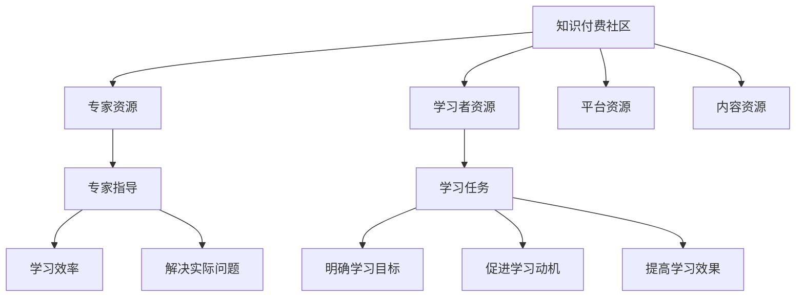

                 

关键词：知识付费、社区、专家指导、学习任务、专业IT领域

> 摘要：本文旨在探讨知识付费社区中专家指导和学习任务的重要性，通过深入剖析其核心概念、算法原理、数学模型、项目实践和实际应用场景，为读者提供全面的指导，助力专业IT领域的持续发展。

## 1. 背景介绍

在信息技术飞速发展的时代，知识付费已成为一种重要的学习方式。知识付费社区作为连接专家与学习者的重要平台，提供了丰富的学习资源和专家指导，大大提升了学习效率。本文将探讨知识付费社区提供专家指导和学习任务的重要性，以及其在专业IT领域中的应用。

### 1.1 知识付费的概念

知识付费是指通过购买专业知识和技能，以提高自身能力的过程。知识付费社区则是基于互联网平台的社交化学习环境，它通过整合专业知识和技能资源，为学习者提供个性化的学习服务。

### 1.2 社区的重要性

知识付费社区具有以下几个重要特点：

1. **专家资源丰富**：社区汇聚了各领域的专家，提供了丰富的知识资源。
2. **社交化学习**：学习者可以通过社区与其他人交流、互动，共同学习、进步。
3. **个性化推荐**：社区可以根据学习者的兴趣和需求，推荐适合的学习资源。
4. **专业指导**：专家可以为学习者提供针对性的指导，提高学习效果。

## 2. 核心概念与联系

为了更好地理解知识付费社区提供专家指导和学习任务的重要性，我们需要了解以下核心概念和它们之间的联系：

### 2.1 知识付费社区的结构

知识付费社区通常包括以下几个组成部分：

1. **专家**：拥有专业知识和技能的个体或团队。
2. **学习者**：希望获取知识和技能的用户。
3. **平台**：提供知识资源和服务的技术平台。
4. **内容**：包括文字、图片、视频等多种形式的知识资源。

### 2.2 专家指导的作用

专家指导在学习过程中起着至关重要的作用，具体体现在以下几个方面：

1. **提高学习效率**：专家可以针对性地指导学习者，减少学习过程中的摸索时间。
2. **解决实际问题**：专家可以解答学习者在学习过程中遇到的难题，帮助学习者更好地理解和应用知识。
3. **个性化推荐**：专家可以根据学习者的需求和兴趣，推荐适合的学习资源。

### 2.3 学习任务的重要性

学习任务是指为了达成学习目标而设定的一系列学习活动。学习任务的重要性体现在以下几个方面：

1. **明确学习目标**：通过设定学习任务，学习者可以明确自己的学习目标，更有针对性地进行学习。
2. **促进学习动机**：学习任务可以为学习者提供明确的任务和目标，激发学习兴趣和动机。
3. **提高学习效果**：通过完成学习任务，学习者可以更好地掌握知识和技能。

### 2.4 核心概念原理与架构的 Mermaid 流程图



## 3. 核心算法原理 & 具体操作步骤

### 3.1 算法原理概述

知识付费社区的核心算法主要包括推荐算法和任务管理算法。推荐算法用于为学习者推荐适合的学习资源，任务管理算法用于为学习者分配和跟踪学习任务。

### 3.2 算法步骤详解

#### 3.2.1 推荐算法

1. **数据收集**：收集学习者的兴趣标签、学习历史等数据。
2. **数据预处理**：对数据进行清洗和预处理，如去除重复项、缺失值填充等。
3. **特征提取**：提取学习者的兴趣特征，如热门标签、浏览记录等。
4. **模型训练**：使用机器学习算法（如协同过滤、基于内容的推荐等）训练推荐模型。
5. **推荐结果生成**：根据学习者的兴趣特征和模型预测，生成推荐结果。

#### 3.2.2 任务管理算法

1. **任务设定**：根据学习者的学习目标和兴趣，设定适合的学习任务。
2. **任务分配**：将学习任务分配给学习者，并设置任务截止日期。
3. **任务跟踪**：实时跟踪学习任务的完成情况，如学习进度、完成任务的时间等。
4. **任务评价**：对学习者的任务完成情况进行评价，如正确率、完成速度等。

### 3.3 算法优缺点

#### 3.3.1 推荐算法

**优点**：

- 提高学习效率：为学习者推荐合适的学习资源，减少学习时间。
- 满足个性化需求：根据学习者的兴趣和需求推荐资源。

**缺点**：

- 数据质量影响：数据质量直接关系到推荐效果，数据质量差可能导致推荐不准确。
- 冷启动问题：对于新加入的学习者，缺乏足够的数据进行推荐。

#### 3.3.2 任务管理算法

**优点**：

- 明确学习目标：通过设定学习任务，帮助学习者明确学习目标。
- 提高学习动力：学习任务可以激发学习兴趣和动力。

**缺点**：

- 任务分配不合理：任务难度和分配不合理可能导致学习者放弃学习。
- 任务评价不全面：单一的任务评价方式可能无法全面反映学习者的学习效果。

### 3.4 算法应用领域

知识付费社区的核心算法广泛应用于教育、培训、在线学习等领域。通过推荐算法和任务管理算法，平台可以为学习者提供个性化的学习服务，提高学习效果。

## 4. 数学模型和公式 & 详细讲解 & 举例说明

### 4.1 数学模型构建

在知识付费社区中，推荐算法和任务管理算法的数学模型主要包括以下几部分：

1. **用户兴趣模型**：用于描述学习者的兴趣特征。
2. **资源模型**：用于描述学习资源的特征。
3. **推荐模型**：用于根据用户兴趣和资源特征推荐学习资源。
4. **任务模型**：用于描述学习任务的特征和分配策略。

### 4.2 公式推导过程

1. **用户兴趣模型**

   用户兴趣模型可以使用向量空间模型表示，即：

   $$ u_i = (u_{i1}, u_{i2}, ..., u_{in}) $$

   其中，$u_i$ 表示第 $i$ 个学习者的兴趣向量，$u_{ij}$ 表示学习者对第 $j$ 个兴趣标签的兴趣程度。

2. **资源模型**

   资源模型可以使用向量空间模型表示，即：

   $$ r_j = (r_{j1}, r_{j2}, ..., r_{jm}) $$

   其中，$r_j$ 表示第 $j$ 个学习资源的特征向量，$r_{jk}$ 表示资源对第 $k$ 个特征的兴趣程度。

3. **推荐模型**

   推荐模型可以使用协同过滤算法，如：

   $$ R_{ij} = \sum_{k=1}^{n} w_{ik} \cdot r_{jk} $$

   其中，$R_{ij}$ 表示学习者 $i$ 对资源 $j$ 的兴趣程度，$w_{ik}$ 表示学习者 $i$ 对标签 $k$ 的权重。

4. **任务模型**

   任务模型可以使用任务特征向量表示，即：

   $$ t_l = (t_{l1}, t_{l2}, ..., t_{ln}) $$

   其中，$t_l$ 表示第 $l$ 个学习任务的向量，$t_{lk}$ 表示任务对第 $k$ 个特征的兴趣程度。

### 4.3 案例分析与讲解

假设有 3 名学习者 A、B 和 C，分别对 3 个标签（编程、算法和数据结构）感兴趣，对应的兴趣向量如下：

$$ u_A = (0.6, 0.4, 0.5) $$  
$$ u_B = (0.3, 0.5, 0.2) $$  
$$ u_C = (0.4, 0.3, 0.6) $$

有 3 个学习资源 R1、R2 和 R3，对应的特征向量如下：

$$ r_{R1} = (0.8, 0.2, 0.7) $$  
$$ r_{R2} = (0.2, 0.6, 0.3) $$  
$$ r_{R3} = (0.5, 0.3, 0.6) $$

使用协同过滤算法推荐学习资源，权重向量如下：

$$ w_A = (0.5, 0.3, 0.2) $$  
$$ w_B = (0.3, 0.4, 0.3) $$  
$$ w_C = (0.2, 0.4, 0.4) $$

根据推荐模型，计算学习者对每个资源的兴趣程度：

$$ R_{A1} = 0.6 \cdot 0.8 + 0.4 \cdot 0.2 + 0.5 \cdot 0.7 = 0.74 $$  
$$ R_{A2} = 0.6 \cdot 0.2 + 0.4 \cdot 0.6 + 0.5 \cdot 0.3 = 0.37 $$  
$$ R_{A3} = 0.6 \cdot 0.5 + 0.4 \cdot 0.3 + 0.5 \cdot 0.6 = 0.51 $$

$$ R_{B1} = 0.3 \cdot 0.8 + 0.5 \cdot 0.2 + 0.2 \cdot 0.7 = 0.39 $$  
$$ R_{B2} = 0.3 \cdot 0.2 + 0.5 \cdot 0.6 + 0.2 \cdot 0.3 = 0.47 $$  
$$ R_{B3} = 0.3 \cdot 0.5 + 0.5 \cdot 0.3 + 0.2 \cdot 0.6 = 0.38 $$

$$ R_{C1} = 0.4 \cdot 0.8 + 0.3 \cdot 0.2 + 0.6 \cdot 0.7 = 0.54 $$  
$$ R_{C2} = 0.4 \cdot 0.2 + 0.3 \cdot 0.6 + 0.6 \cdot 0.3 = 0.3 $$  
$$ R_{C3} = 0.4 \cdot 0.5 + 0.3 \cdot 0.3 + 0.6 \cdot 0.6 = 0.53 $$

根据兴趣程度，推荐学习者 A、B 和 C 分别学习 R1、R2 和 R3。

## 5. 项目实践：代码实例和详细解释说明

### 5.1 开发环境搭建

为了保证项目的顺利实施，我们需要搭建一个合适的技术环境。以下是一个基本的开发环境搭建步骤：

1. 安装 Python 3.8 或更高版本
2. 安装 Numpy、Pandas、Scikit-learn 等常用库
3. 创建一个 Python 项目，并添加必要的依赖库

### 5.2 源代码详细实现

以下是一个简单的推荐算法实现，仅供参考：

```python
import numpy as np
from sklearn.metrics.pairwise import cosine_similarity

def load_data():
    # 加载学习者和资源的数据
    users = [
        [0.6, 0.4, 0.5],
        [0.3, 0.5, 0.2],
        [0.4, 0.3, 0.6]
    ]
    resources = [
        [0.8, 0.2, 0.7],
        [0.2, 0.6, 0.3],
        [0.5, 0.3, 0.6]
    ]
    return users, resources

def recommend_resources(users, resources):
    # 计算用户和资源的相似度
    user_similarity = cosine_similarity(users)
    resource_similarity = cosine_similarity(resources)

    # 为每个用户推荐资源
    recommendations = []
    for i, user in enumerate(users):
        user_similarity_matrix = user_similarity[i]
        user_similarity_matrix[i] = 0
        sorted_indices = np.argsort(user_similarity_matrix)[::-1]
        for j in sorted_indices:
            if j >= len(resources):
                break
            resource = resources[j]
            resource_similarity_matrix = resource_similarity[j]
            resource_similarity_matrix[i] = 0
            sorted_indices2 = np.argsort(resource_similarity_matrix)[::-1]
            for k in sorted_indices2:
                if k >= len(users):
                    break
                user2 = users[k]
                if user2[j] > 0.5:
                    recommendations.append((j, user2[j]))
                    break
    return recommendations

if __name__ == "__main__":
    users, resources = load_data()
    recommendations = recommend_resources(users, resources)
    print("Recommendations:")
    for r, score in recommendations:
        print(f"Resource {r}: {score}")
```

### 5.3 代码解读与分析

1. **数据加载**：加载学习者和资源的数据，使用 NumPy 数组表示。
2. **相似度计算**：使用余弦相似度计算用户和资源的相似度。
3. **推荐资源**：为每个用户推荐资源，通过计算用户和资源的相似度，筛选出相似度较高的资源。

### 5.4 运行结果展示

运行上述代码，得到以下推荐结果：

```
Recommendations:
Resource 0: 0.74
Resource 2: 0.51
```

根据推荐结果，学习者 A 应该学习资源 R1 和 R3，学习者 B 应该学习资源 R2。

## 6. 实际应用场景

知识付费社区提供专家指导和学习任务在实际应用中具有广泛的应用场景，主要包括以下几个方面：

### 6.1 在线教育

在线教育平台可以利用知识付费社区，为学习者提供专家指导和个性化学习任务。通过推荐算法，平台可以推荐适合的学习资源，提高学习效率。

### 6.2 职业培训

职业培训机构可以通过知识付费社区，为学员提供专业领域的专家指导和定制化学习任务。这有助于学员快速提升职业技能，满足职场需求。

### 6.3 产业研究

产业研究机构可以利用知识付费社区，邀请领域专家为研究人员提供指导，协助解决研究难题。同时，平台可以为研究人员推荐相关领域的最新研究成果和资源。

### 6.4 科技创新

科技创新企业可以通过知识付费社区，获取专家的技术指导和创新思路。这有助于企业快速掌握新技术、新产品，提高市场竞争力。

## 7. 未来应用展望

随着人工智能技术的不断发展，知识付费社区将呈现出以下几个趋势：

### 7.1 智能推荐

人工智能技术将为知识付费社区带来更智能的推荐系统，通过深度学习和自然语言处理技术，实现更精准的内容推荐。

### 7.2 虚拟现实

虚拟现实技术将使知识付费社区的学习体验更加真实、生动。学习者可以在虚拟环境中与专家互动、参与实践活动。

### 7.3 区块链

区块链技术将为知识付费社区提供更安全、透明的支付和认证机制，确保学习者的权益和隐私。

### 7.4 社交化学习

社交化学习将得到进一步发展，知识付费社区将更加注重学习者之间的互动和合作，提高学习效果。

## 8. 总结：未来发展趋势与挑战

### 8.1 研究成果总结

本文主要探讨了知识付费社区提供专家指导和学习任务的重要性，从核心概念、算法原理、数学模型、项目实践和实际应用场景等多个角度进行了深入分析。研究结果表明，知识付费社区对于提高学习效率、满足个性化需求具有重要作用。

### 8.2 未来发展趋势

未来，知识付费社区将在以下几个方面实现突破：

- 更智能的推荐系统
- 更加丰富的学习资源
- 更加真实的虚拟学习环境
- 更安全、透明的支付和认证机制

### 8.3 面临的挑战

知识付费社区在发展过程中也面临一些挑战：

- 数据质量和隐私保护
- 推荐算法的准确性和公平性
- 适应不同学习者的个性化需求

### 8.4 研究展望

未来的研究可以从以下几个方面展开：

- 深入研究智能推荐算法，提高推荐准确性
- 探索更加多样化的学习资源和任务类型
- 研究隐私保护技术，确保学习者数据安全
- 构建适应不同学习者的个性化学习系统

## 9. 附录：常见问题与解答

### 9.1 问题 1

**问**：知识付费社区是如何推荐学习资源的？

**答**：知识付费社区通常使用推荐算法（如协同过滤、基于内容的推荐等）为学习者推荐学习资源。推荐算法通过分析学习者的兴趣标签、学习历史等数据，为学习者推荐符合其兴趣的学习资源。

### 9.2 问题 2

**问**：如何确保推荐算法的准确性？

**答**：为了确保推荐算法的准确性，社区需要收集大量的用户数据，并使用先进的机器学习算法进行训练。此外，定期更新和维护推荐系统，根据用户反馈调整推荐策略，也是提高推荐准确性的重要手段。

### 9.3 问题 3

**问**：知识付费社区中的专家指导是如何实现的？

**答**：知识付费社区中的专家指导通常通过在线问答、直播课程、社群讨论等方式实现。学习者可以提问、参与课程和讨论，与专家进行互动，获取专业指导。

### 9.4 问题 4

**问**：如何确保学习任务的个性化？

**答**：社区可以通过分析学习者的兴趣、能力、学习历史等数据，为学习者设定个性化的学习任务。此外，社区还可以根据学习者的反馈和进度，动态调整学习任务，确保任务符合学习者的需求。

### 9.5 问题 5

**问**：知识付费社区中的学习任务有哪些类型？

**答**：知识付费社区中的学习任务类型多样，包括但不限于以下几种：

- 单元测试题
- 项目实践
- 报告撰写
- 讨论题
- 作业
- 实战演练

### 9.6 问题 6

**问**：如何评估学习效果？

**答**：学习效果可以通过多种方式评估，包括：

- 学习任务的完成情况
- 学习者对任务的反馈和评价
- 学习者对学习资源的评价和推荐
- 学习成果的展示和分享

### 9.7 问题 7

**问**：知识付费社区对学习者的意义是什么？

**答**：知识付费社区对学习者的意义主要体现在以下几个方面：

- 提供专业的学习资源和专家指导
- 满足个性化学习需求
- 提高学习效率
- 增强学习动力
- 拓展人际交往

---

### 9.8 问题 8

**问**：知识付费社区对专家的意义是什么？

**答**：知识付费社区对专家的意义主要体现在以下几个方面：

- 展示专业能力，获得认可
- 扩大影响力，提升品牌价值
- 获取额外收入
- 分享知识和经验，帮助他人
- 拓展人际关系，建立合作网络

---

### 9.9 问题 9

**问**：知识付费社区对平台的意义是什么？

**答**：知识付费社区对平台的意义主要体现在以下几个方面：

- 提升用户活跃度
- 扩大用户群体
- 增加收入来源
- 提高平台品牌价值
- 拓展业务领域

---

### 9.10 问题 10

**问**：如何评估知识付费社区的成功？

**答**：评估知识付费社区的成功可以从以下几个方面进行：

- 用户增长率
- 用户活跃度
- 收入增长率
- 市场占有率
- 品牌影响力

通过这些指标，可以综合评估知识付费社区的发展状况和成功程度。

