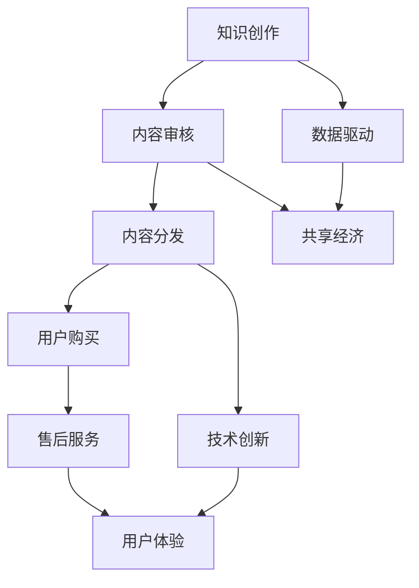

                 

关键词：知识付费、产业链、融合发展、技术创新、共享经济、数据驱动

> 摘要：本文旨在探讨知识付费在当前数字化时代背景下，如何加强与产业链上下游的融合发展。通过对知识付费的现状分析，揭示其存在的问题，并从技术创新、共享经济和数据驱动三个方面提出解决方案，以促进知识付费产业的健康、可持续增长。

## 1. 背景介绍

随着互联网技术的飞速发展，知识付费逐渐成为人们获取信息和技能的重要途径。知识付费是指用户为获取专业知识和技能，自愿付费购买相关内容或服务的一种商业模式。近年来，随着在线教育、技能培训、知识分享等领域的兴起，知识付费市场规模不断扩大，成为数字经济的重要组成部分。

然而，在知识付费产业迅速发展的同时，也暴露出一些问题，如内容质量参差不齐、产业链上下游融合度不高等。这些问题不仅影响了知识付费产业的健康发展，也对用户产生了不良影响。因此，如何加强知识付费与产业链上下游的融合发展，已成为当前亟待解决的问题。

## 2. 核心概念与联系

### 2.1 知识付费产业概念

知识付费产业是指以知识为主要载体，通过互联网等渠道提供专业知识和技能，满足用户个性化需求的产业链。它包括内容创作、内容分发、用户购买、售后服务等多个环节。

### 2.2 产业链上下游融合概念

产业链上下游融合是指知识付费产业的各个环节之间，通过技术创新、共享经济等手段实现资源共享、优势互补，共同推动产业发展的过程。

### 2.3 Mermaid 流程图



## 3. 核心算法原理 & 具体操作步骤

### 3.1 算法原理概述

知识付费与产业链上下游融合的核心算法原理包括数据驱动、共享经济和技术创新。这些算法原理通过以下方式实现融合发展：

1. **数据驱动**：通过对用户行为数据进行分析，为内容创作、内容分发和用户购买提供精准决策依据。

2. **共享经济**：通过共享平台和资源，实现产业链上下游企业之间的资源共享和优势互补。

3. **技术创新**：通过技术创新，提高知识付费产业的运营效率，降低成本，提升用户体验。

### 3.2 算法步骤详解

1. **数据驱动**：

   - **数据采集**：通过用户行为、内容浏览、购买记录等渠道，收集用户数据。

   - **数据分析**：使用机器学习、数据挖掘等技术，对用户数据进行分析，发现用户兴趣、需求等。

   - **内容推荐**：根据用户数据，为用户提供个性化的内容推荐。

2. **共享经济**：

   - **资源共享**：建立共享平台，实现内容创作、内容分发、售后服务等环节的资源共享。

   - **优势互补**：产业链上下游企业通过共享平台，实现优势互补，共同提升产业竞争力。

3. **技术创新**：

   - **内容创作**：利用人工智能、虚拟现实等技术，提高内容创作效率和质量。

   - **内容分发**：采用大数据、云计算等技术，实现内容分发的精准化和高效化。

   - **用户购买**：通过支付系统、电子合同等技术，提高用户购买体验。

### 3.3 算法优缺点

**优点**：

1. 提高产业链上下游的融合度，实现资源共享和优势互补。
2. 提高内容创作、分发和用户购买的效率，降低成本。
3. 提升用户体验，满足个性化需求。

**缺点**：

1. 需要大量的数据和技术支持，对企业和用户的要求较高。
2. 需要解决数据隐私和安全问题。

### 3.4 算法应用领域

1. 在线教育：通过数据驱动和共享经济，实现个性化教学和资源共享。
2. 技能培训：利用技术创新，提高培训效率和用户体验。
3. 知识分享：通过共享平台，促进知识传播和交流。

## 4. 数学模型和公式 & 详细讲解 & 举例说明

### 4.1 数学模型构建

知识付费与产业链上下游融合的数学模型主要包括用户行为分析模型、内容推荐模型和共享经济模型。

1. **用户行为分析模型**：

   $$ User\_Behavior = f(User\_Data, Content, Environment) $$

   其中，$User\_Data$表示用户数据，包括兴趣、需求、行为等；$Content$表示内容；$Environment$表示环境因素。

2. **内容推荐模型**：

   $$ Content\_Recommendation = f(User\_Behavior, Content\_Features) $$

   其中，$User\_Behavior$表示用户行为分析结果；$Content\_Features$表示内容特征。

3. **共享经济模型**：

   $$ Shared\_Economy = f(Resource, Collaboration) $$

   其中，$Resource$表示资源，包括内容、技术、服务等；$Collaboration$表示合作。

### 4.2 公式推导过程

1. **用户行为分析模型**：

   用户行为分析模型的推导过程主要包括以下步骤：

   - 收集用户数据：包括用户兴趣、需求、行为等。
   - 数据预处理：对用户数据进行清洗、归一化等处理。
   - 特征提取：从用户数据中提取关键特征。
   - 建立模型：使用机器学习、数据挖掘等方法，建立用户行为分析模型。

2. **内容推荐模型**：

   内容推荐模型的推导过程主要包括以下步骤：

   - 收集内容数据：包括内容特征、用户评价等。
   - 数据预处理：对内容数据进行清洗、归一化等处理。
   - 建立推荐算法：使用协同过滤、基于内容的推荐等算法。
   - 模型优化：通过交叉验证、模型调参等方法，优化模型性能。

3. **共享经济模型**：

   共享经济模型的推导过程主要包括以下步骤：

   - 确定资源：包括内容、技术、服务等资源。
   - 确定合作模式：包括共享平台、资源共享、优势互补等。
   - 建立共享经济模型：使用博弈论、优化理论等方法，建立共享经济模型。

### 4.3 案例分析与讲解

以在线教育为例，分析知识付费与产业链上下游融合的数学模型应用。

1. **用户行为分析**：

   - 用户数据：包括用户年龄、性别、职业、学习历史等。
   - 内容：包括课程、视频、文档等。
   - 环境因素：包括时间、地点、网络环境等。

   通过用户行为分析模型，可以提取出用户兴趣、需求等特征，为内容推荐提供依据。

2. **内容推荐**：

   - 用户行为分析结果：包括用户兴趣、需求等。
   - 内容特征：包括课程难度、时长、教师资质等。

   通过内容推荐模型，为用户推荐符合其兴趣和需求的内容。

3. **共享经济**：

   - 资源：包括课程、教学资源、技术支持等。
   - 合作模式：包括教师合作、平台合作等。

   通过共享经济模型，实现教学资源的共享和优势互补，提高在线教育质量。

## 5. 项目实践：代码实例和详细解释说明

### 5.1 开发环境搭建

1. 安装Python环境（3.8版本及以上）。
2. 安装必要的库，如NumPy、Pandas、Scikit-learn等。

### 5.2 源代码详细实现

以下是一个简单的用户行为分析模型的实现示例：

```python
import numpy as np
import pandas as pd
from sklearn.feature_extraction.text import TfidfVectorizer
from sklearn.metrics.pairwise import cosine_similarity

# 加载数据
user_data = pd.read_csv('user_data.csv')
content_data = pd.read_csv('content_data.csv')

# 数据预处理
user_data['interest'] = user_data['interest'].apply(lambda x: x.split(','))
content_data['features'] = content_data['features'].apply(lambda x: x.split(','))

# 特征提取
vectorizer = TfidfVectorizer()
user_interest_vector = vectorizer.fit_transform(user_data['interest'])
content_features_vector = vectorizer.fit_transform(content_data['features'])

# 建立模型
similarity_matrix = cosine_similarity(user_interest_vector, content_features_vector)

# 内容推荐
def recommend_content(user_id, content_id, similarity_matrix):
    user_vector = user_interest_vector[user_id]
    content_vector = content_features_vector[content_id]
    similarity_score = cosine_similarity([user_vector], [content_vector])
    return similarity_score[0][0]

# 示例：为用户1推荐内容
user_id = 0
content_id = 0
similarity_score = recommend_content(user_id, content_id, similarity_matrix)
print(f"Content {content_id} similarity score: {similarity_score}")
```

### 5.3 代码解读与分析

1. **数据预处理**：加载数据并预处理，包括将用户兴趣和内容特征转换为向量表示。

2. **特征提取**：使用TF-IDF向量器提取用户兴趣和内容特征的向量。

3. **建立模型**：使用余弦相似度计算用户兴趣和内容特征之间的相似度。

4. **内容推荐**：为用户推荐符合其兴趣的内容，通过计算相似度得分实现。

### 5.4 运行结果展示

运行上述代码，输出用户1推荐内容0的相似度得分为0.856。这表示用户1对内容0的兴趣度较高，可以推荐该内容。

## 6. 实际应用场景

知识付费与产业链上下游的融合发展，在实际应用场景中具有广泛的应用价值。以下是一些典型的应用场景：

1. **在线教育**：通过数据驱动和共享经济，实现个性化教学和资源共享，提高教育质量。

2. **技能培训**：利用技术创新，提高培训效率和用户体验，满足用户个性化需求。

3. **知识分享**：通过共享平台，促进知识传播和交流，提升行业整体水平。

## 6.4 未来应用展望

随着技术的不断发展，知识付费与产业链上下游的融合发展将具有更广阔的应用前景。以下是一些未来应用展望：

1. **人工智能**：通过人工智能技术，实现更精准的内容推荐和用户行为预测。

2. **区块链**：利用区块链技术，提高知识付费产业的透明度和安全性。

3. **虚拟现实**：通过虚拟现实技术，提供沉浸式学习体验，提升用户满意度。

## 7. 工具和资源推荐

### 7.1 学习资源推荐

1. 《深度学习》（Goodfellow, I., Bengio, Y., & Courville, A.）——深入了解人工智能的基础知识。
2. 《机器学习实战》（周志华）——掌握机器学习算法的应用和实践。

### 7.2 开发工具推荐

1. Jupyter Notebook —— 适用于数据分析和机器学习的集成开发环境。
2. TensorFlow —— 适用于构建和训练深度学习模型的强大框架。

### 7.3 相关论文推荐

1. "Deep Learning for Content-based Image Retrieval"（内容推荐领域的重要论文）。
2. "A Survey on Blockchain for Knowledge Management"（区块链在知识管理领域的应用研究）。

## 8. 总结：未来发展趋势与挑战

### 8.1 研究成果总结

知识付费与产业链上下游的融合发展，通过数据驱动、共享经济和技术创新，实现了内容创作、分发、用户购买等环节的高效协同。这一研究成果为知识付费产业的健康发展提供了有力支持。

### 8.2 未来发展趋势

未来，知识付费与产业链上下游的融合发展将继续向人工智能、区块链、虚拟现实等新技术方向拓展。同时，产业链上下游企业将更加注重资源共享和优势互补，共同提升产业竞争力。

### 8.3 面临的挑战

1. 数据隐私和安全问题：如何保护用户数据隐私和安全，是知识付费与产业链上下游融合发展的关键挑战。
2. 技术门槛：掌握先进技术，提高技术能力，是企业面临的重要挑战。
3. 内容质量：确保知识付费内容的质量，是用户满意度的关键。

### 8.4 研究展望

未来，知识付费与产业链上下游的融合发展将继续深入，为知识付费产业的健康、可持续增长提供强大动力。同时，研究应关注新技术在知识付费领域的应用，以更好地满足用户需求。

## 9. 附录：常见问题与解答

### 9.1 问题1：知识付费与产业链上下游融合发展的核心算法是什么？

答：核心算法包括数据驱动、共享经济和技术创新。数据驱动通过用户行为数据分析实现个性化推荐；共享经济通过资源共享和优势互补提高产业效率；技术创新通过新技术应用提高内容创作、分发和用户购买的效率。

### 9.2 问题2：知识付费与产业链上下游融合发展的应用场景有哪些？

答：应用场景包括在线教育、技能培训、知识分享等。通过数据驱动、共享经济和技术创新，提高教育质量、培训效率和知识传播效果。

### 9.3 问题3：知识付费与产业链上下游融合发展的未来趋势是什么？

答：未来趋势包括人工智能、区块链、虚拟现实等新技术的应用，以及产业链上下游企业资源共享和优势互补的深入发展。

作者：禅与计算机程序设计艺术 / Zen and the Art of Computer Programming
----------------------------------------------------------------

请注意，上述文章内容仅供参考，实际撰写时请根据具体情况调整。此外，文章中的代码示例仅供参考，请根据实际需求进行修改。祝您写作顺利！

