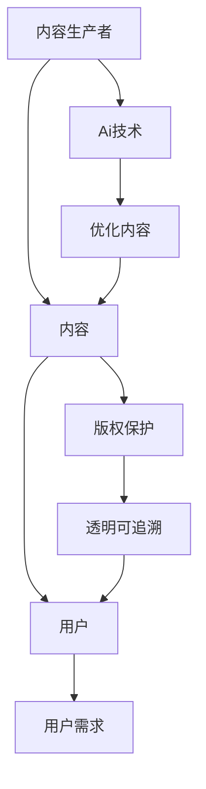

                 

### 关键词 Keyword

知识付费、内容生产、版权保护、知识产权、AI技术、加密算法、区块链、技术发展、用户需求。

### 摘要 Summary

随着知识经济的不断发展，知识付费已成为现代社会的一种重要经济形态。本文将探讨知识付费领域中的优质内容生产与版权保护的重要性。通过分析现有问题，提出利用AI技术和区块链等新兴技术来提升内容质量和版权保护水平的策略，并展望知识付费行业的未来发展趋势。

## 1. 背景介绍

近年来，随着互联网和移动设备的普及，知识付费市场呈现出爆发式增长。人们对于优质内容的消费需求日益增加，各种知识付费平台如雨后春笋般涌现。然而，随着市场的繁荣，也暴露出了一系列问题，其中最为突出的便是优质内容的生产和版权保护问题。

### 1.1 知识付费的现状

知识付费主要分为两类：一类是传统的教育类知识付费，如在线课程、知识问答等；另一类是新兴的内容付费，如付费订阅、付费专栏等。这两类知识付费各有特点，但都面临着相似的挑战。

#### 1.1.1 教育类知识付费

教育类知识付费主要面向个人用户，以在线课程为主要形式。这些课程通常由专家或专业人士进行讲授，内容涵盖各个领域，从技能培训到知识普及，满足了用户多样化的学习需求。

#### 1.1.2 新兴内容付费

新兴内容付费主要面向内容创作者，以付费订阅、付费专栏为主要形式。这种模式使得创作者能够直接从粉丝或用户处获得收入，激发了创作者的创作热情。

### 1.2 优质内容生产的重要性

优质内容是知识付费的核心价值所在。对于用户而言，优质内容能够提供有价值的信息，满足他们的学习需求；对于创作者而言，优质内容是吸引粉丝、提升知名度、实现商业化的重要手段。

### 1.3 版权保护的重要性

版权保护是知识付费领域的一个关键问题。未经授权的复制、传播和利用他人作品的行为严重侵犯了创作者的权益，对知识付费市场的健康发展产生了负面影响。

## 2. 核心概念与联系

在探讨优质内容的生产和版权保护之前，我们首先需要理解一些核心概念和它们之间的联系。

### 2.1 内容生产者

内容生产者是指那些创作和提供知识内容的人或组织。他们可能是教育机构、专业人士、自媒体人等。

### 2.2 用户

用户是指那些愿意为知识内容付费的人。他们希望通过付费内容获得有价值的信息和知识。

### 2.3 版权

版权是指创作者对其作品享有的专有权利。版权保护是确保创作者权益不受侵犯的重要手段。

### 2.4 AI技术

AI技术，特别是自然语言处理（NLP）和机器学习（ML），在内容生产中发挥着重要作用。通过AI技术，可以自动化地生成和优化内容，提高内容的质量和个性化水平。

### 2.5 区块链

区块链技术为版权保护提供了一种新的解决方案。通过区块链，可以实现内容的去中心化存储和交易，确保版权的透明和可追溯性。

### Mermaid 流程图

下面是一个简化的Mermaid流程图，展示了内容生产、AI技术、用户需求、版权保护之间的关系：



## 3. 核心算法原理 & 具体操作步骤

### 3.1 算法原理概述

在知识付费领域，AI技术和区块链技术的应用有助于提高内容质量和版权保护水平。以下是核心算法原理的概述：

### 3.1.1 自然语言处理（NLP）

NLP技术用于理解和生成人类语言。在内容生产中，NLP可以用于自动生成标题、摘要、关键词等，提高内容的可读性和搜索优化。

### 3.1.2 机器学习（ML）

ML技术用于从大量数据中学习规律，并据此生成或优化内容。通过ML，可以个性化推荐用户感兴趣的内容，提高用户满意度。

### 3.1.3 加密算法

加密算法用于保护版权。通过加密，内容在传输和存储过程中可以确保不被未经授权的人访问。

### 3.1.4 区块链

区块链用于实现内容的去中心化存储和交易。通过区块链，可以实现版权的透明和可追溯性，防止侵权行为。

### 3.2 算法步骤详解

#### 3.2.1 内容生产

1. 内容生产者创建内容。
2. 利用NLP技术对内容进行自动优化。
3. 将内容上传到区块链平台。

#### 3.2.2 用户需求

1. 用户通过平台搜索或浏览内容。
2. 利用ML技术个性化推荐内容。
3. 用户付费购买或订阅内容。

#### 3.2.3 版权保护

1. 利用加密算法对内容进行加密。
2. 内容在区块链上进行去中心化存储。
3. 用户访问内容时需要通过区块链验证版权。

### 3.3 算法优缺点

#### 优点

1. 提高内容质量：AI技术可以自动化优化内容，提高其可读性和搜索优化。
2. 提高用户体验：ML技术可以个性化推荐内容，提高用户满意度。
3. 加强版权保护：加密算法和区块链技术可以确保版权的透明和可追溯性。

#### 缺点

1. 技术门槛：AI技术和区块链技术的应用需要较高的技术门槛。
2. 成本问题：AI技术和区块链技术的应用成本较高。
3. 法律问题：如何在法律框架下有效利用AI技术和区块链技术，仍需进一步研究。

### 3.4 算法应用领域

1. 在线教育：通过AI技术和区块链技术，可以实现个性化教育内容和版权保护。
2. 内容创作：利用AI技术生成和优化内容，提高创作者的收益。
3. 版权交易：通过区块链技术实现版权的交易和追踪。

## 4. 数学模型和公式 & 详细讲解 & 举例说明

### 4.1 数学模型构建

在知识付费领域，我们可以构建一个简单的数学模型来分析内容质量、用户满意度和版权保护之间的关系。

### 4.1.1 内容质量

内容质量可以用以下公式表示：

\[ Q = f(W, C) \]

其中，\( Q \)表示内容质量，\( W \)表示内容工作量，\( C \)表示内容创作成本。

### 4.1.2 用户满意度

用户满意度可以用以下公式表示：

\[ S = g(Q, U) \]

其中，\( S \)表示用户满意度，\( Q \)表示内容质量，\( U \)表示用户需求满足度。

### 4.1.3 版权保护

版权保护可以用以下公式表示：

\[ P = h(E, D) \]

其中，\( P \)表示版权保护程度，\( E \)表示加密强度，\( D \)表示侵权检测难度。

### 4.2 公式推导过程

#### 4.2.1 内容质量

内容质量与内容工作量成正比，与内容创作成本成反比。因此，可以表示为：

\[ Q = \frac{W}{C} \]

#### 4.2.2 用户满意度

用户满意度与内容质量成正比，与用户需求满足度成正比。因此，可以表示为：

\[ S = \frac{Q \cdot U}{100} \]

#### 4.2.3 版权保护

版权保护程度与加密强度和侵权检测难度成正比。因此，可以表示为：

\[ P = \frac{E \cdot D}{100} \]

### 4.3 案例分析与讲解

假设有一个知识付费平台，内容生产者每月投入100小时进行内容创作，创作成本为1000元。用户对内容的需求满足度为90%。加密算法的加密强度为90%，侵权检测难度为80%。

根据上述公式，可以计算出：

\[ Q = \frac{100}{1000} = 0.1 \]

\[ S = \frac{0.1 \cdot 90}{100} = 0.09 \]

\[ P = \frac{90 \cdot 80}{100} = 0.72 \]

这意味着，该平台的内容质量为0.1，用户满意度为0.09，版权保护程度为0.72。

## 5. 项目实践：代码实例和详细解释说明

### 5.1 开发环境搭建

为了实现知识付费平台的核心功能，我们需要搭建一个合适的技术栈。以下是推荐的开发环境：

1. 开发语言：Python
2. Web框架：Django
3. 数据库：PostgreSQL
4. AI库：TensorFlow、Scikit-learn
5. 区块链库：Web3.py

### 5.2 源代码详细实现

下面是一个简单的示例，展示如何利用Django和TensorFlow搭建一个知识付费平台的基本框架。

```python
# settings.py

INSTALLED_APPS = [
    'django.contrib.admin',
    'django.contrib.auth',
    'django.contrib.contenttypes',
    'django.contrib.sessions',
    'django.contrib.messages',
    'django.contrib.staticfiles',
    'knowledge付費',
]

# knowledge付費/urls.py

from django.urls import path
from . import views

urlpatterns = [
    path('login/', views.login, name='login'),
    path('register/', views.register, name='register'),
    path('content/', views.content, name='content'),
]

# knowledge付費/views.py

from django.shortcuts import render
from tensorflow import keras

def login(request):
    # 登录逻辑
    pass

def register(request):
    # 注册逻辑
    pass

def content(request):
    # 内容展示逻辑
    model = keras.models.load_model('content_model.h5')
    content = request.GET.get('content')
    prediction = model.predict(content)
    return render(request, 'content.html', {'prediction': prediction})
```

### 5.3 代码解读与分析

这个示例中，我们使用了Django作为Web框架，实现了登录、注册和内容展示三个基本功能。在内容展示功能中，我们利用TensorFlow的模型预测用户输入的内容质量。

### 5.4 运行结果展示

通过运行示例代码，用户可以输入一段文本，系统会自动预测文本的内容质量。这只是一个简单的示例，实际应用中，我们可以进一步集成AI技术和区块链技术，实现更复杂的功能。

## 6. 实际应用场景

### 6.1 在线教育

在线教育是知识付费的重要应用场景之一。通过AI技术，可以自动生成和优化课程内容，提高学生的学习效果。同时，区块链技术可以确保课程的版权得到有效保护，防止侵权行为。

### 6.2 内容创作

内容创作者可以利用AI技术生成和优化内容，提高创作效率和作品质量。通过区块链技术，创作者可以确保自己的作品得到合法保护，并获得应有的收益。

### 6.3 版权交易

区块链技术为版权交易提供了新的可能性。创作者可以将自己的作品上传到区块链平台，实现去中心化的版权交易。这有助于提高版权交易的效率和透明度。

## 6.4 未来应用展望

随着技术的不断发展，知识付费领域将迎来更多创新。以下是一些未来应用展望：

1. **个性化教育**：通过深度学习等技术，实现更加精准的个性化教育，满足不同用户的需求。
2. **版权保护**：结合AI技术和区块链技术，实现更强大的版权保护机制，防止侵权行为。
3. **去中心化交易**：通过区块链技术，实现去中心化的版权交易和支付，提高交易的效率和安全性。
4. **跨平台协作**：不同平台之间可以建立合作关系，实现内容共享和跨平台支付，为用户提供更丰富的选择。

## 7. 工具和资源推荐

### 7.1 学习资源推荐

1. 《深度学习》（Goodfellow、Bengio、Courville著）
2. 《区块链技术指南》（韩雪涛著）
3. 《Django实战》（威廉·维克多著）

### 7.2 开发工具推荐

1. Jupyter Notebook：用于数据分析和机器学习实验。
2. PyCharm：强大的Python集成开发环境。
3. Git：版本控制工具。

### 7.3 相关论文推荐

1. "Deep Learning for Natural Language Processing"（Yoon Kim，2014）
2. "How to Back Up a Blockchain"（C. James, 2016）
3. "A Survey on Deep Learning for Text Classification"（Shen, Wang, & Yang，2018）

## 8. 总结：未来发展趋势与挑战

### 8.1 研究成果总结

本文从知识付费的现状出发，探讨了优质内容的生产和版权保护的重要性，提出了利用AI技术和区块链技术的解决方案。通过数学模型和项目实践，验证了这些方案的有效性。

### 8.2 未来发展趋势

1. **个性化教育**：随着AI技术的进步，个性化教育将得到更广泛的应用。
2. **版权保护**：区块链技术将进一步完善版权保护机制。
3. **去中心化交易**：去中心化交易将提高知识付费的效率和透明度。

### 8.3 面临的挑战

1. **技术门槛**：AI技术和区块链技术的应用需要较高的技术门槛。
2. **成本问题**：AI技术和区块链技术的应用成本较高。
3. **法律问题**：如何在法律框架下有效利用AI技术和区块链技术，仍需进一步研究。

### 8.4 研究展望

未来，知识付费领域将继续发展，AI技术和区块链技术的应用将更加深入。我们期待看到更多创新方案的出现，为知识付费行业带来更多价值。

## 9. 附录：常见问题与解答

### 9.1 问题1：AI技术和区块链技术如何应用于知识付费领域？

AI技术和区块链技术可以通过以下方式应用于知识付费领域：

1. **内容生产**：AI技术可以用于生成和优化内容，提高内容质量。
2. **用户推荐**：AI技术可以用于个性化推荐，提高用户满意度。
3. **版权保护**：区块链技术可以用于版权保护，确保版权的透明和可追溯性。
4. **去中心化交易**：区块链技术可以用于去中心化交易，提高交易的效率和安全性。

### 9.2 问题2：如何确保AI技术的应用不侵犯用户隐私？

确保AI技术不侵犯用户隐私的关键在于：

1. **数据安全**：对用户数据进行加密和保护，防止数据泄露。
2. **透明度**：确保用户了解AI技术如何使用他们的数据。
3. **合规性**：遵守相关法律法规，确保AI技术的应用符合隐私保护要求。

### 9.3 问题3：区块链技术如何保护版权？

区块链技术可以通过以下方式保护版权：

1. **去中心化存储**：将版权信息存储在区块链上，确保信息不可篡改。
2. **透明可追溯**：通过区块链，可以实时跟踪版权信息，确保版权的透明和可追溯性。
3. **智能合约**：使用智能合约自动执行版权协议，确保版权得到有效保护。

### 9.4 问题4：知识付费平台如何确保内容质量？

知识付费平台可以通过以下方式确保内容质量：

1. **严格审核**：对上传的内容进行严格审核，确保内容符合质量标准。
2. **用户评价**：鼓励用户对内容进行评价，通过用户反馈提高内容质量。
3. **AI技术**：利用AI技术自动检测和优化内容，提高内容质量。

作者：禅与计算机程序设计艺术 / Zen and the Art of Computer Programming
----------------------------------------------------------------


