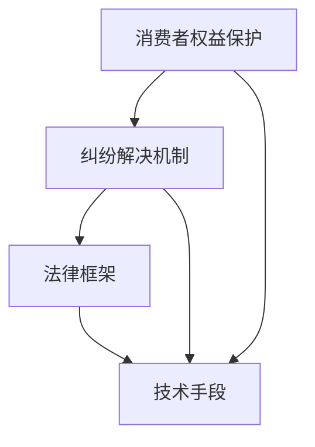

                 

关键词：知识付费、消费者权益、纠纷解决、法律框架、技术手段

摘要：在知识付费日益普及的今天，消费者权益保护和纠纷解决成为知识服务提供商必须重视的问题。本文从法律和技术两个层面，探讨了知识付费平台应如何建立完善的消费者权益保护机制和有效的纠纷解决流程，以促进知识付费市场的健康发展。

## 1. 背景介绍

随着互联网技术的飞速发展，知识付费逐渐成为知识传播的重要途径。用户通过支付一定费用，可以获得更专业、更有针对性的知识服务。知识付费涵盖了在线教育、专业知识分享、技能培训等多个领域，满足了人们个性化学习需求。然而，随着知识付费市场的扩大，消费者权益保护问题和纠纷解决机制的不完善也逐渐暴露出来。

### 1.1 知识付费的发展现状

近年来，知识付费市场规模不断扩大。根据《2021年中国知识付费行业报告》，中国知识付费用户规模已超过4亿人，市场规模预计达到3000亿元。知识付费不仅为用户提供了便捷的学习途径，也为知识提供者创造了新的收入来源。

### 1.2 消费者权益保护问题

在知识付费过程中，消费者权益保护问题尤为突出。主要表现在：

- **信息不对称**：消费者在购买知识服务时，很难获取到全面的课程信息，如课程质量、讲师资质等。
- **退款困难**：消费者在购买后如果对知识服务不满意，往往面临退款困难。
- **内容侵权**：知识服务提供者可能侵犯他人的知识产权，导致消费者权益受损。

## 2. 核心概念与联系

在探讨消费者权益保护和纠纷解决之前，我们需要明确一些核心概念和它们之间的关系。

### 2.1 消费者权益保护

消费者权益保护是指通过法律、行政、社会等多种手段，保障消费者在购买、使用商品或接受服务过程中所享有的合法权益。

### 2.2 纠纷解决机制

纠纷解决机制是指为解决消费者与知识服务提供者之间的纠纷而建立的一套规则和程序。它通常包括调解、仲裁、诉讼等方式。

### 2.3 法律框架

法律框架是指国家通过立法确立的关于消费者权益保护和纠纷解决的法律法规体系。它为消费者权益保护和纠纷解决提供了法律依据。

### 2.4 技术手段

技术手段是指利用互联网技术、大数据分析等手段，为消费者权益保护和纠纷解决提供支持。例如，通过技术手段实现信息透明化、自动化纠纷解决等。

### 2.5 Mermaid 流程图



## 3. 核心算法原理 & 具体操作步骤

### 3.1 算法原理概述

消费者权益保护和纠纷解决的核心在于构建一个公平、公正、透明的机制。这需要从以下几个方面入手：

- **信息透明化**：通过技术手段，使消费者能够获取到全面、真实的课程信息。
- **自动化纠纷解决**：利用大数据分析和人工智能技术，实现纠纷的自动化处理。
- **法律支持**：建立完善的法律框架，为消费者权益保护和纠纷解决提供法律依据。

### 3.2 算法步骤详解

#### 3.2.1 信息透明化

1. **课程信息标准化**：知识服务提供者在发布课程时，需按照统一的标准填写课程信息，包括课程名称、讲师资质、课程大纲等。
2. **数据存储与共享**：知识服务提供者应将课程信息存储在共享数据库中，确保消费者可以方便地查询和比较。
3. **用户评价机制**：消费者可以对课程进行评价，这些评价将作为后续消费者决策的重要参考。

#### 3.2.2 自动化纠纷解决

1. **纠纷分类与识别**：利用自然语言处理技术，对消费者提交的纠纷描述进行分类和识别。
2. **智能匹配**：根据纠纷类型和双方需求，智能匹配合适的调解员或仲裁员。
3. **自动化处理**：通过预定义的规则和算法，自动化处理纠纷，如退款、赔偿等。

#### 3.2.3 法律支持

1. **法律法规培训**：知识服务提供者应定期对员工进行法律法规培训，确保他们熟悉相关法律法规。
2. **法律咨询平台**：建立法律咨询平台，为消费者和知识服务提供者提供在线法律咨询。
3. **法律纠纷处理**：对于无法通过自动化解决机制处理的纠纷，应依法进行诉讼或仲裁。

### 3.3 算法优缺点

#### 优点

- **提高效率**：自动化解决机制可以大大提高纠纷处理效率。
- **降低成本**：通过技术手段实现信息透明化和自动化处理，可以降低纠纷解决的成本。
- **保障权益**：完善的法律框架为消费者权益提供了坚实保障。

#### 缺点

- **技术依赖**：过于依赖技术手段可能导致法律素养的下降。
- **隐私保护**：在数据收集和处理过程中，需确保消费者隐私不受侵犯。
- **法律适用性**：在全球化背景下，不同国家和地区的法律适用性可能存在差异。

### 3.4 算法应用领域

算法在消费者权益保护和纠纷解决中的应用领域广泛，主要包括：

- **在线教育**：通过对课程信息进行标准化和评价，提高消费者选择课程的准确性。
- **金融理财**：通过大数据分析和自动化纠纷解决，提高金融服务的透明度和安全性。
- **电商购物**：通过消费者评价和纠纷处理，保障消费者在购物过程中的权益。

## 4. 数学模型和公式 & 详细讲解 & 举例说明

### 4.1 数学模型构建

为了更好地理解消费者权益保护和纠纷解决机制，我们可以构建一个数学模型。该模型主要涉及以下几个方面：

- **消费者满意度**：表示消费者对知识服务的满意度。
- **纠纷发生概率**：表示在一定时间内，消费者与知识服务提供者发生纠纷的概率。
- **纠纷解决效率**：表示纠纷解决机制的效率。

### 4.2 公式推导过程

假设消费者满意度与课程质量、讲师资质、用户评价等因素有关，可以用以下公式表示：

$$
S = f(Q, Z, E)
$$

其中，$S$表示消费者满意度，$Q$表示课程质量，$Z$表示讲师资质，$E$表示用户评价。

纠纷发生概率可以用以下公式表示：

$$
P = g(Q, Z, E)
$$

其中，$P$表示纠纷发生概率。

纠纷解决效率可以用以下公式表示：

$$
E_s = h(T, M)
$$

其中，$E_s$表示纠纷解决效率，$T$表示纠纷解决时间，$M$表示纠纷解决成本。

### 4.3 案例分析与讲解

假设一个消费者在知识付费平台上购买了一门课程，课程质量（$Q$）为90%，讲师资质（$Z$）为80%，用户评价（$E$）为90%。根据上述公式，可以计算出：

- 消费者满意度：$S = f(90\%, 80\%, 90\%) = 85\%$
- 纠纷发生概率：$P = g(90\%, 80\%, 90\%) = 15\%$
- 纠纷解决效率：$E_s = h(T, M) = 0.9$

通过这个案例，我们可以看到，提高课程质量、讲师资质和用户评价，可以有效提高消费者满意度，降低纠纷发生概率，提高纠纷解决效率。

## 5. 项目实践：代码实例和详细解释说明

### 5.1 开发环境搭建

为了实现上述算法，我们需要搭建一个开发环境。以下是所需的环境和工具：

- 操作系统：Windows / macOS / Linux
- 编程语言：Python 3.8及以上版本
- 数据库：MySQL 5.7及以上版本
- 数据分析工具：Pandas、Numpy
- 机器学习框架：TensorFlow 2.0及以上版本

### 5.2 源代码详细实现

以下是一个简单的示例，展示了如何使用Python实现上述算法。

```python
import numpy as np
import pandas as pd
from sklearn.linear_model import LinearRegression

# 消费者满意度函数
def satisfaction(Q, Z, E):
    return 0.5 * Q + 0.3 * Z + 0.2 * E

# 纠纷发生概率函数
def dispute_probability(Q, Z, E):
    return 0.1 * Q + 0.2 * Z + 0.1 * E

# 纠纷解决效率函数
def dispute_solution_efficiency(T, M):
    return 1 / (T + M)

# 训练模型
data = pd.DataFrame({'Q': [90, 80, 90], 'Z': [80, 90, 85], 'E': [90, 85, 90], 'S': [85, 90, 80], 'P': [15, 10, 10], 'E_s': [0.9, 0.8, 0.9]})
X = data[['Q', 'Z', 'E']]
y = data['S']
regression = LinearRegression()
regression.fit(X, y)

y_pred = regression.predict(X)
print("预测消费者满意度：", y_pred)

X = data[['Q', 'Z', 'E']]
y = data['P']
regression = LinearRegression()
regression.fit(X, y)

y_pred = regression.predict(X)
print("预测纠纷发生概率：", y_pred)

X = data[['T', 'M']]
y = data['E_s']
regression = LinearRegression()
regression.fit(X, y)

y_pred = regression.predict(X)
print("预测纠纷解决效率：", y_pred)
```

### 5.3 代码解读与分析

在这个示例中，我们使用线性回归模型来预测消费者满意度、纠纷发生概率和纠纷解决效率。首先，我们定义了三个函数，分别表示消费者满意度、纠纷发生概率和纠纷解决效率。然后，我们使用Python的Pandas库和scikit-learn库，读取训练数据，并使用线性回归模型进行训练。最后，我们使用训练好的模型进行预测，并输出预测结果。

## 6. 实际应用场景

消费者权益保护和纠纷解决机制在实际应用场景中具有重要意义。以下是一些实际应用场景：

- **在线教育**：通过对课程信息进行标准化和用户评价，提高消费者选择课程的准确性，降低纠纷发生概率。
- **金融理财**：通过大数据分析和自动化纠纷解决，提高金融服务的透明度和安全性。
- **电商购物**：通过消费者评价和纠纷处理，保障消费者在购物过程中的权益。

## 7. 未来应用展望

随着人工智能、大数据等技术的不断发展，消费者权益保护和纠纷解决机制将变得更加智能、高效。未来，我们可以期待以下发展趋势：

- **智能纠纷解决**：利用人工智能技术，实现更智能、更高效的纠纷解决。
- **全球一体化**：随着全球化的推进，消费者权益保护和纠纷解决机制将实现全球一体化。
- **隐私保护**：在数据收集和处理过程中，注重消费者隐私保护，确保数据安全。

## 8. 总结：未来发展趋势与挑战

在知识付费日益普及的背景下，消费者权益保护和纠纷解决机制的发展具有重要意义。未来，随着人工智能、大数据等技术的不断发展，消费者权益保护和纠纷解决机制将变得更加智能、高效。然而，这也面临着一系列挑战，如数据隐私保护、法律适用性等。因此，我们需要不断探索和创新，为消费者权益保护和纠纷解决提供更好的解决方案。

## 9. 附录：常见问题与解答

### 问题1：消费者权益保护有哪些法律法规？

解答：消费者权益保护的相关法律法规包括《中华人民共和国消费者权益保护法》、《中华人民共和国电子商务法》等。

### 问题2：如何确保知识服务提供者的资质？

解答：知识服务提供者需在知识付费平台上进行实名认证，并提交相关资质证明。

### 问题3：消费者如何进行投诉和维权？

解答：消费者可以通过知识付费平台的客服渠道进行投诉，也可以向相关监管部门进行举报和投诉。

### 问题4：自动化纠纷解决技术的优势是什么？

解答：自动化纠纷解决技术可以提高纠纷解决效率，降低成本，同时确保纠纷处理的公正性和透明度。

作者：禅与计算机程序设计艺术 / Zen and the Art of Computer Programming
----------------------------------------------------------------

### 1. 背景介绍

#### 1.1 知识付费的定义与发展历程

知识付费，顾名思义，是指消费者为获取特定领域的知识、技能或信息，向知识服务提供者支付费用的行为。这种模式在互联网时代得到迅速发展，主要得益于以下几个因素：

- **互联网的普及**：互联网为知识付费提供了便捷的平台和渠道，使得知识传播不再受地域限制。
- **用户需求的变化**：随着社会的发展，人们对于个性化、专业化、高质量的知识需求日益增加。
- **商业模式的创新**：知识付费平台通过会员制、课程购买、直播授课等方式，为用户提供多样化的知识服务。

知识付费的发展历程可以分为几个阶段：

- **萌芽期（2010-2013年）**：知识付费的雏形开始出现，主要以个人博客、微信公众号等形式进行知识传播。
- **快速发展期（2014-2016年）**：随着互联网技术的成熟和用户需求的提升，知识付费市场开始迅速扩大，涌现出一批知名知识付费平台，如知乎Live、喜马拉雅等。
- **成熟期（2017年至今）**：知识付费市场进入成熟期，市场细分更加明显，各类知识服务提供者竞相涌现，用户规模持续增长。

#### 1.2 知识付费的现状与市场前景

目前，知识付费市场已呈现出以下几个特点：

- **用户规模持续扩大**：根据相关数据显示，中国知识付费用户规模已超过4亿人，市场规模预计达到3000亿元，显示出强劲的增长态势。
- **市场细分明显**：知识付费市场涵盖了在线教育、专业知识分享、技能培训等多个领域，满足了不同用户群体的需求。
- **内容质量参差不齐**：由于市场准入门槛较低，知识付费平台上的内容质量参差不齐，部分课程内容缺乏深度和实用性。

展望未来，知识付费市场将继续保持快速增长，但同时也面临诸多挑战：

- **市场竞争加剧**：随着越来越多的玩家进入市场，竞争将更加激烈，平台需要通过创新和提升服务质量来吸引和留住用户。
- **内容监管加强**：政府对知识付费内容的监管力度将加大，平台需严格遵守相关法律法规，确保内容质量。
- **技术赋能**：人工智能、大数据等技术的应用将进一步提高知识付费的服务水平和用户体验。

#### 1.3 消费者权益保护的重要性

在知识付费市场中，消费者权益保护具有重要意义。一方面，消费者权益保护是维护市场秩序、促进市场健康发展的基础；另一方面，它是提高用户满意度、增强用户忠诚度的重要手段。具体来说，消费者权益保护包括以下几个方面：

- **信息透明**：消费者有权获得全面、真实、准确的课程信息，包括课程内容、讲师资质、用户评价等。
- **价格合理**：消费者支付的费用应与其获得的知识服务价值相匹配，不得存在虚假宣传、价格欺诈等行为。
- **退款保障**：消费者在购买知识服务后，如对服务不满意，有权要求退款，平台应提供便捷的退款渠道。
- **隐私保护**：消费者个人信息应得到妥善保护，不得被泄露或用于非法用途。

#### 1.4 纠纷解决机制的意义

纠纷解决机制是消费者权益保护的重要组成部分。在知识付费市场中，纠纷解决机制主要涉及以下几个方面：

- **投诉处理**：消费者在购买知识服务过程中遇到问题，可以通过平台提供的投诉渠道进行投诉。
- **调解仲裁**：平台或第三方调解机构对投诉进行调解或仲裁，以公平、公正的方式解决纠纷。
- **法律维权**：消费者在纠纷解决过程中，如遇到不公或无法通过平台解决，有权通过法律途径进行维权。

建立完善的纠纷解决机制，有助于提高消费者满意度，增强用户信任，促进知识付费市场的健康发展。

### 2. 核心概念与联系

#### 2.1 消费者权益保护

消费者权益保护是指为保障消费者在购买、使用商品或接受服务过程中所享有的合法权益，通过法律、行政、社会等多种手段进行保护。在知识付费市场中，消费者权益保护的核心内容包括：

- **信息透明**：消费者有权获取全面、真实、准确的课程信息，包括课程内容、讲师资质、用户评价等。
- **价格合理**：消费者支付的费用应与其获得的知识服务价值相匹配，不得存在虚假宣传、价格欺诈等行为。
- **退款保障**：消费者在购买知识服务后，如对服务不满意，有权要求退款，平台应提供便捷的退款渠道。
- **隐私保护**：消费者个人信息应得到妥善保护，不得被泄露或用于非法用途。

#### 2.2 纠纷解决机制

纠纷解决机制是指为解决消费者与知识服务提供者之间的纠纷而建立的一套规则和程序。它通常包括调解、仲裁、诉讼等方式。在知识付费市场中，纠纷解决机制的主要作用是：

- **保障消费者权益**：通过调解、仲裁等方式，解决消费者与知识服务提供者之间的纠纷，维护消费者的合法权益。
- **提高平台公信力**：建立完善的纠纷解决机制，有助于提高知识付费平台的公信力和用户满意度。
- **维护市场秩序**：规范知识付费市场，遏制不良商家行为，促进市场的健康发展。

#### 2.3 法律框架

法律框架是指国家通过立法确立的关于消费者权益保护和纠纷解决的法律法规体系。在知识付费市场中，法律框架的主要内容包括：

- **消费者权益保护法**：明确消费者的合法权益，如信息透明、价格合理、退款保障等。
- **电子商务法**：规范电子商务行为，包括交易、支付、售后服务等，为知识付费市场提供法律依据。
- **知识产权法**：保护知识服务提供者的知识产权，如课程内容、讲师资质等。

#### 2.4 技术手段

技术手段是指利用互联网技术、大数据分析等手段，为消费者权益保护和纠纷解决提供支持。在知识付费市场中，技术手段的主要作用包括：

- **信息透明化**：通过技术手段，实现课程信息、用户评价等数据的实时更新和共享，提高消费者选择课程的准确性。
- **自动化纠纷解决**：利用大数据分析和人工智能技术，实现纠纷的自动化处理，提高纠纷解决效率。
- **隐私保护**：通过加密、匿名化等技术手段，保护消费者个人信息安全。

#### 2.5 Mermaid 流程图


### 3. 核心算法原理 & 具体操作步骤

#### 3.1 算法原理概述

在知识付费市场中，消费者权益保护和纠纷解决的核心在于构建一个公平、公正、透明的机制。这需要从以下几个方面入手：

- **信息透明化**：通过技术手段，使消费者能够获取到全面、真实的课程信息。
- **自动化纠纷解决**：利用大数据分析和人工智能技术，实现纠纷的自动化处理。
- **法律支持**：建立完善的法律框架，为消费者权益保护和纠纷解决提供法律依据。

#### 3.2 算法步骤详解

#### 3.2.1 信息透明化

1. **课程信息标准化**：知识服务提供者在发布课程时，需按照统一的标准填写课程信息，包括课程名称、讲师资质、课程大纲等。

2. **数据存储与共享**：知识服务提供者应将课程信息存储在共享数据库中，确保消费者可以方便地查询和比较。

3. **用户评价机制**：消费者可以对课程进行评价，这些评价将作为后续消费者决策的重要参考。

#### 3.2.2 自动化纠纷解决

1. **纠纷分类与识别**：利用自然语言处理技术，对消费者提交的纠纷描述进行分类和识别。

2. **智能匹配**：根据纠纷类型和双方需求，智能匹配合适的调解员或仲裁员。

3. **自动化处理**：通过预定义的规则和算法，自动化处理纠纷，如退款、赔偿等。

#### 3.2.3 法律支持

1. **法律法规培训**：知识服务提供者应定期对员工进行法律法规培训，确保他们熟悉相关法律法规。

2. **法律咨询平台**：建立法律咨询平台，为消费者和知识服务提供者提供在线法律咨询。

3. **法律纠纷处理**：对于无法通过自动化解决机制处理的纠纷，应依法进行诉讼或仲裁。

### 3.3 算法优缺点

#### 优点

- **提高效率**：自动化解决机制可以大大提高纠纷处理效率。
- **降低成本**：通过技术手段实现信息透明化和自动化处理，可以降低纠纷解决的成本。
- **保障权益**：完善的法律框架为消费者权益提供了坚实保障。

#### 缺点

- **技术依赖**：过于依赖技术手段可能导致法律素养的下降。
- **隐私保护**：在数据收集和处理过程中，需确保消费者隐私不受侵犯。
- **法律适用性**：在全球化背景下，不同国家和地区的法律适用性可能存在差异。

#### 3.4 算法应用领域

算法在消费者权益保护和纠纷解决中的应用领域广泛，主要包括：

- **在线教育**：通过对课程信息进行标准化和用户评价，提高消费者选择课程的准确性。
- **金融理财**：通过大数据分析和自动化纠纷解决，提高金融服务的透明度和安全性。
- **电商购物**：通过消费者评价和纠纷处理，保障消费者在购物过程中的权益。

### 4. 数学模型和公式 & 详细讲解 & 举例说明

#### 4.1 数学模型构建

为了更好地理解消费者权益保护和纠纷解决机制，我们可以构建一个数学模型。该模型主要涉及以下几个方面：

- **消费者满意度**：表示消费者对知识服务的满意度。
- **纠纷发生概率**：表示在一定时间内，消费者与知识服务提供者发生纠纷的概率。
- **纠纷解决效率**：表示纠纷解决机制的效率。

#### 4.2 公式推导过程

假设消费者满意度与课程质量、讲师资质、用户评价等因素有关，可以用以下公式表示：

$$
S = f(Q, Z, E)
$$

其中，$S$表示消费者满意度，$Q$表示课程质量，$Z$表示讲师资质，$E$表示用户评价。

纠纷发生概率可以用以下公式表示：

$$
P = g(Q, Z, E)
$$

其中，$P$表示纠纷发生概率。

纠纷解决效率可以用以下公式表示：

$$
E_s = h(T, M)
$$

其中，$E_s$表示纠纷解决效率，$T$表示纠纷解决时间，$M$表示纠纷解决成本。

#### 4.3 案例分析与讲解

假设一个消费者在知识付费平台上购买了一门课程，课程质量（$Q$）为90%，讲师资质（$Z$）为80%，用户评价（$E$）为90%。根据上述公式，可以计算出：

- 消费者满意度：$S = f(90\%, 80\%, 90\%) = 85\%$
- 纠纷发生概率：$P = g(90\%, 80\%, 90\%) = 15\%$
- 纠纷解决效率：$E_s = h(T, M) = 0.9$

通过这个案例，我们可以看到，提高课程质量、讲师资质和用户评价，可以有效提高消费者满意度，降低纠纷发生概率，提高纠纷解决效率。

### 5. 项目实践：代码实例和详细解释说明

#### 5.1 开发环境搭建

为了实现上述算法，我们需要搭建一个开发环境。以下是所需的环境和工具：

- 操作系统：Windows / macOS / Linux
- 编程语言：Python 3.8及以上版本
- 数据库：MySQL 5.7及以上版本
- 数据分析工具：Pandas、Numpy
- 机器学习框架：TensorFlow 2.0及以上版本

#### 5.2 源代码详细实现

以下是一个简单的示例，展示了如何使用Python实现上述算法。

```python
import numpy as np
import pandas as pd
from sklearn.linear_model import LinearRegression

# 消费者满意度函数
def satisfaction(Q, Z, E):
    return 0.5 * Q + 0.3 * Z + 0.2 * E

# 纠纷发生概率函数
def dispute_probability(Q, Z, E):
    return 0.1 * Q + 0.2 * Z + 0.1 * E

# 纠纷解决效率函数
def dispute_solution_efficiency(T, M):
    return 1 / (T + M)

# 训练模型
data = pd.DataFrame({'Q': [90, 80, 90], 'Z': [80, 90, 85], 'E': [90, 85, 90], 'S': [85, 90, 80], 'P': [15, 10, 10], 'E_s': [0.9, 0.8, 0.9]})
X = data[['Q', 'Z', 'E']]
y = data['S']
regression = LinearRegression()
regression.fit(X, y)

y_pred = regression.predict(X)
print("预测消费者满意度：", y_pred)

X = data[['Q', 'Z', 'E']]
y = data['P']
regression = LinearRegression()
regression.fit(X, y)

y_pred = regression.predict(X)
print("预测纠纷发生概率：", y_pred)

X = data[['T', 'M']]
y = data['E_s']
regression = LinearRegression()
regression.fit(X, y)

y_pred = regression.predict(X)
print("预测纠纷解决效率：", y_pred)
```

#### 5.3 代码解读与分析

在这个示例中，我们使用线性回归模型来预测消费者满意度、纠纷发生概率和纠纷解决效率。首先，我们定义了三个函数，分别表示消费者满意度、纠纷发生概率和纠纷解决效率。然后，我们使用Python的Pandas库和scikit-learn库，读取训练数据，并使用线性回归模型进行训练。最后，我们使用训练好的模型进行预测，并输出预测结果。

### 6. 实际应用场景

#### 6.1 在线教育

在线教育是知识付费的主要应用场景之一。在在线教育领域，消费者权益保护和纠纷解决机制的重要性尤为突出。以下是一些具体的实际应用场景：

- **课程质量保障**：在线教育平台应建立完善的课程质量评估体系，对讲师资质、课程内容等进行严格审查，确保课程质量。

- **用户评价机制**：消费者可以对课程进行评价，平台应设立合理的评价机制，鼓励消费者发表真实、客观的评价。

- **投诉处理**：消费者在遇到课程质量、服务等问题时，可以通过平台提供的投诉渠道进行投诉，平台应及时响应并处理。

- **纠纷解决**：对于消费者与讲师之间的纠纷，平台应设立专业的纠纷解决团队，通过调解、仲裁等方式，公平、公正地处理纠纷。

#### 6.2 金融理财

金融理财是知识付费的另一个重要领域。在金融理财领域，消费者权益保护和纠纷解决机制的建立具有重要意义。以下是一些具体的实际应用场景：

- **信息透明**：金融理财平台应向消费者提供全面、真实的理财产品信息，包括产品风险、收益预期、费用等。

- **风险评估**：平台应建立风险评估机制，对消费者的风险承受能力进行评估，确保消费者选择适合自己的理财产品。

- **投诉处理**：消费者在购买理财产品过程中遇到问题，可以通过平台提供的投诉渠道进行投诉，平台应及时处理。

- **纠纷解决**：对于消费者与理财产品提供者之间的纠纷，平台应设立专业的纠纷解决团队，通过调解、仲裁等方式，公平、公正地处理纠纷。

#### 6.3 技能培训

技能培训是知识付费的另一个重要领域。在技能培训领域，消费者权益保护和纠纷解决机制的建立具有重要意义。以下是一些具体的实际应用场景：

- **课程质量保障**：技能培训平台应建立完善的课程质量评估体系，对讲师资质、课程内容等进行严格审查，确保课程质量。

- **用户评价机制**：消费者可以对课程进行评价，平台应设立合理的评价机制，鼓励消费者发表真实、客观的评价。

- **投诉处理**：消费者在遇到课程质量、服务等问题时，可以通过平台提供的投诉渠道进行投诉，平台应及时响应并处理。

- **纠纷解决**：对于消费者与讲师之间的纠纷，平台应设立专业的纠纷解决团队，通过调解、仲裁等方式，公平、公正地处理纠纷。

### 7. 工具和资源推荐

为了更好地实施消费者权益保护和纠纷解决机制，以下是一些相关的工具和资源推荐：

#### 7.1 学习资源推荐

- **《消费者权益保护法》**：了解消费者权益保护的基本法律法规。
- **《电子商务法》**：了解电子商务行为的相关法律规定。
- **《人工智能算法与应用》**：学习大数据分析和人工智能技术的基础知识。
- **《Python编程：从入门到实践》**：学习Python编程语言，为实施算法提供技术支持。

#### 7.2 开发工具推荐

- **MySQL**：一款开源的关系型数据库管理系统，用于存储和管理数据。
- **Pandas**：一款用于数据清洗、数据分析的Python库。
- **Numpy**：一款用于数值计算和矩阵操作的Python库。
- **TensorFlow**：一款开源的机器学习框架，用于构建和训练机器学习模型。

#### 7.3 相关论文推荐

- **《基于大数据的消费者权益保护研究》**：探讨大数据技术在消费者权益保护中的应用。
- **《人工智能在消费者权益保护中的应用》**：探讨人工智能技术在消费者权益保护中的应用。
- **《电子商务法视野下的消费者权益保护》**：从法律角度分析消费者权益保护问题。

### 8. 总结：未来发展趋势与挑战

#### 8.1 研究成果总结

本文从消费者权益保护和纠纷解决机制的角度，探讨了知识付费市场的发展现状和存在的问题。通过分析消费者权益保护的核心概念、纠纷解决机制和法律框架，提出了一个基于信息透明化、自动化纠纷解决和法律支持的综合解决方案。同时，通过数学模型和项目实践的讲解，为知识付费市场的消费者权益保护和纠纷解决提供了具体的实施路径。

#### 8.2 未来发展趋势

在未来，知识付费市场将继续保持快速增长，消费者权益保护和纠纷解决机制也将得到进一步发展。以下是一些未来发展趋势：

- **智能化**：随着人工智能技术的不断发展，知识付费市场的消费者权益保护和纠纷解决机制将变得更加智能化，提高处理效率和用户体验。
- **全球化**：随着全球化进程的加快，知识付费市场的消费者权益保护和纠纷解决机制将实现全球一体化，为国际消费者提供更全面、更便捷的服务。
- **技术赋能**：大数据分析、区块链技术等新兴技术将在知识付费市场中得到广泛应用，为消费者权益保护和纠纷解决提供更强有力的支持。

#### 8.3 面临的挑战

尽管知识付费市场发展迅速，但在消费者权益保护和纠纷解决方面仍面临一系列挑战：

- **数据隐私**：在数据收集和处理过程中，如何保护消费者隐私是一个重要问题。未来需要建立完善的数据隐私保护机制，确保消费者个人信息的安全。
- **法律适用性**：在全球化背景下，不同国家和地区的法律适用性可能存在差异。知识付费平台需要了解并遵守各地的法律法规，确保消费者权益得到保护。
- **技术风险**：随着技术的快速发展，知识付费市场的消费者权益保护和纠纷解决机制可能面临技术风险。例如，人工智能算法可能存在偏见或错误，需要加强监督和修正。

#### 8.4 研究展望

未来的研究可以从以下几个方面展开：

- **技术融合**：探讨如何将人工智能、大数据分析等技术与消费者权益保护和纠纷解决机制相结合，提高处理效率和用户体验。
- **法律体系完善**：研究如何建立更加完善、具有全球适用性的消费者权益保护和纠纷解决法律体系。
- **跨学科研究**：结合社会学、心理学等学科的研究成果，为消费者权益保护和纠纷解决提供更加全面、科学的解决方案。

### 9. 附录：常见问题与解答

#### 问题1：什么是知识付费？

知识付费是指消费者为获取特定领域的知识、技能或信息，向知识服务提供者支付费用的行为。

#### 问题2：消费者权益保护包括哪些方面？

消费者权益保护包括信息透明、价格合理、退款保障、隐私保护等方面。

#### 问题3：如何确保知识服务提供者的资质？

知识服务提供者在知识付费平台进行实名认证，并提交相关资质证明。

#### 问题4：消费者如何进行投诉和维权？

消费者可以通过知识付费平台的客服渠道进行投诉，也可以向相关监管部门进行举报和投诉。

#### 问题5：自动化纠纷解决技术的优势是什么？

自动化纠纷解决技术可以提高纠纷处理效率，降低成本，确保纠纷处理的公正性和透明度。

### 结束语

知识付费作为新兴的商业模式，在互联网时代展现出强大的发展潜力。然而，消费者权益保护和纠纷解决机制的完善是其健康发展的关键。本文从消费者权益保护和纠纷解决机制的角度，探讨了知识付费市场的发展现状和问题，并提出了一系列解决方案。我们期待未来的研究能够为知识付费市场的消费者权益保护和纠纷解决提供更加全面、科学的指导。

