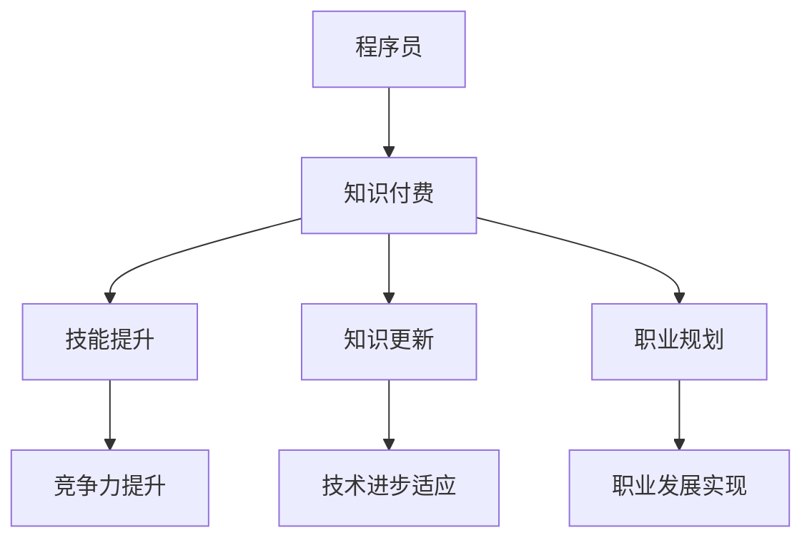

                 

关键词：知识付费，程序员，价值实现，学习，成长，技能提升，职业发展

> 摘要：本文探讨了知识付费在程序员职业发展中的重要作用，通过分析知识付费的优势和影响，提出了具体的实践方法，旨在帮助程序员利用知识付费实现个人价值的提升。

## 1. 背景介绍

在数字化时代，程序员的地位日益提升。随着技术的不断进步，程序员面临着日益激烈的竞争环境。在这个背景下，程序员如何提升自己的技能、实现个人价值成为了一个重要课题。知识付费作为一种新兴的学习模式，为程序员提供了更加灵活和高效的学习途径。

### 1.1 知识付费的定义与特点

知识付费是指用户为获取知识、技能或经验而支付的费用。与传统的免费学习资源相比，知识付费具有以下特点：

- **高质量内容**：知识付费平台通常提供经过严格筛选和编辑的专业课程、书籍、教程等，内容质量较高。
- **针对性强**：知识付费内容通常根据用户需求和职业发展需求设计，更具针对性。
- **互动性强**：许多知识付费平台提供在线讨论、答疑解惑等互动功能，有助于用户更好地吸收知识。
- **灵活便捷**：用户可以根据自己的时间安排灵活选择学习内容和进度。

### 1.2 程序员职业发展的挑战与需求

程序员的职业发展面临着诸多挑战：

- **技术更新迅速**：编程语言、框架、工具等更新换代速度加快，程序员需要不断学习新知识。
- **竞争激烈**：随着数字化转型的推进，程序员的需求量大增，但人才供给不足，竞争异常激烈。
- **职业瓶颈**：很多程序员在职业发展过程中会遇到瓶颈，难以进一步提升自己的价值。

为了应对这些挑战，程序员需要不断学习和提升自己的技能，以满足市场需求和个人发展的需求。

## 2. 核心概念与联系

### 2.1 知识付费在程序员职业发展中的作用

知识付费在程序员职业发展中具有重要作用：

- **技能提升**：通过知识付费，程序员可以快速获取新技能，提升自己的竞争力。
- **知识更新**：知识付费平台提供了丰富的学习资源，有助于程序员跟上技术发展的步伐。
- **职业规划**：知识付费可以帮助程序员明确自己的职业发展方向，制定有针对性的学习计划。

### 2.2 知识付费与程序员职业发展的联系

知识付费与程序员职业发展的关系可以概括为以下几个方面：

- **学习资源**：知识付费平台提供了丰富的学习资源，帮助程序员提升技能。
- **学习方式**：知识付费改变了传统学习方式，使程序员可以更加灵活地学习。
- **职业发展**：通过知识付费，程序员可以更好地应对职业挑战，实现个人价值的提升。

### 2.3 Mermaid 流程图（备注：必须给出核心概念原理和架构的 Mermaid 流程图）



## 3. 核心算法原理 & 具体操作步骤

### 3.1 算法原理概述

知识付费在程序员职业发展中的应用，可以看作是一种“学习优化算法”。其核心原理是通过以下步骤实现：

1. **需求分析**：了解程序员的学习需求和职业发展目标。
2. **资源筛选**：从众多知识付费资源中筛选出适合程序员需求的优质内容。
3. **学习路径规划**：根据程序员的需求和资源特点，规划科学的学习路径。
4. **学习效果评估**：对学习过程进行监控和评估，确保学习目标的实现。

### 3.2 算法步骤详解

1. **需求分析**
   - **个人背景**：分析程序员的学历、工作经验、技术特长等背景信息。
   - **职业规划**：了解程序员的职业发展方向和目标。

2. **资源筛选**
   - **平台选择**：根据程序员的喜好和需求，选择合适的知识付费平台。
   - **内容筛选**：从平台中筛选出符合程序员需求的优质课程、书籍、教程等。

3. **学习路径规划**
   - **目标设定**：根据程序员的职业规划和需求，设定具体的学习目标。
   - **路径规划**：根据学习目标，规划合理的学习路径和时间表。

4. **学习效果评估**
   - **过程监控**：对学习过程进行监控，确保学习进度和质量。
   - **效果评估**：通过考试、项目实践等方式，评估学习效果。

### 3.3 算法优缺点

**优点**：
- **高效性**：知识付费提供了高质量的学习资源，帮助程序员快速提升技能。
- **针对性**：知识付费内容根据程序员的需求和职业发展目标设计，更具针对性。
- **灵活性**：程序员可以根据自己的时间安排灵活选择学习内容和进度。

**缺点**：
- **成本较高**：知识付费需要支付费用，对于一些预算有限的程序员来说可能是一笔不小的开支。
- **学习质量无法保证**：部分知识付费内容质量参差不齐，需要程序员进行筛选。

### 3.4 算法应用领域

知识付费算法在程序员职业发展中具有广泛的应用领域：

- **技能提升**：用于帮助程序员快速掌握新技能，提升竞争力。
- **知识更新**：用于帮助程序员跟上技术发展的步伐，不断更新知识体系。
- **职业规划**：用于帮助程序员明确职业发展方向，制定有针对性的学习计划。

## 4. 数学模型和公式 & 详细讲解 & 举例说明

### 4.1 数学模型构建

知识付费在程序员职业发展中的应用，可以构建一个数学模型，用以分析学习效果和职业发展之间的关系。

设：
- \( x \) 为程序员投入的学习时间（单位：小时）
- \( y \) 为程序员的技能水平（单位：分）
- \( z \) 为程序员的职业发展指数（单位：分）

则数学模型可以表示为：

\[ z = f(x, y) \]

其中，函数 \( f \) 表示程序员通过学习提升技能水平，进而实现职业发展的过程。

### 4.2 公式推导过程

根据数学模型，我们可以推导出以下公式：

\[ z = ax + by + c \]

其中：
- \( a \) 为技能水平提升的系数，表示程序员每投入一小时学习，技能水平提升的分数。
- \( b \) 为职业发展指数提升的系数，表示程序员的技能水平每提升一分，职业发展指数提升的分数。
- \( c \) 为常数项，表示程序员的基础职业发展指数。

### 4.3 案例分析与讲解

假设一名程序员 \( P \) 的情况如下：

- \( x = 100 \) 小时，即投入了 100 小时的学习时间。
- \( y = 80 \) 分，即技能水平为 80 分。
- \( z = 150 \) 分，即职业发展指数为 150 分。

根据数学模型，我们可以计算出：

\[ z = 100a + 80b + c \]

为了简化计算，我们假设 \( a = 1 \)，\( b = 0.5 \)，\( c = 50 \)，则：

\[ z = 100 \times 1 + 80 \times 0.5 + 50 \]
\[ z = 100 + 40 + 50 \]
\[ z = 190 \]

这意味着，通过 100 小时的学习，程序员的职业发展指数从 150 分提升到了 190 分，实现了有效的职业发展。

## 5. 项目实践：代码实例和详细解释说明

### 5.1 开发环境搭建

为了更好地实践知识付费在程序员职业发展中的应用，我们需要搭建一个简单的项目环境。以下是具体的步骤：

1. **安装 Python**
   - 访问 Python 官网（https://www.python.org/）下载并安装 Python 3.x 版本。
   - 安装完成后，打开终端或命令行窗口，输入 `python --version` 验证是否安装成功。

2. **安装 Flask**
   - 在终端或命令行窗口中输入以下命令安装 Flask：
     ```bash
     pip install Flask
     ```

3. **创建项目文件夹**
   - 在终端或命令行窗口中输入以下命令创建项目文件夹：
     ```bash
     mkdir knowledge_payment_project
     cd knowledge_payment_project
     ```

4. **创建虚拟环境**
   - 在项目文件夹中创建虚拟环境，以隔离项目依赖：
     ```bash
     python -m venv venv
     source venv/bin/activate  # Windows: venv\Scripts\activate
     ```

5. **安装依赖**
   - 在虚拟环境中安装 Flask：
     ```bash
     pip install Flask
     ```

### 5.2 源代码详细实现

在项目文件夹中创建一个名为 `app.py` 的 Python 文件，并按照以下内容编写代码：

```python
from flask import Flask, request, jsonify

app = Flask(__name__)

# 程序员信息数据结构
programmers = [
    {
        'name': 'Alice',
        'learn_time': 0,
        'skill_level': 0,
        'career_index': 0
    },
    {
        'name': 'Bob',
        'learn_time': 50,
        'skill_level': 70,
        'career_index': 100
    }
]

# 计算学习效果函数
def calculate_learning_effect(learn_time, skill_level):
    a = 1  # 技能提升系数
    b = 0.5  # 职业发展指数提升系数
    c = 50  # 基础职业发展指数
    career_index = a * learn_time + b * skill_level + c
    return career_index

# API 接口：添加程序员信息
@app.route('/add_programmer', methods=['POST'])
def add_programmer():
    data = request.json
    programmers.append({
        'name': data['name'],
        'learn_time': data['learn_time'],
        'skill_level': data['skill_level'],
        'career_index': calculate_learning_effect(data['learn_time'], data['skill_level'])
    })
    return jsonify({'status': 'success', 'message': 'Programmer added successfully.'})

# API 接口：查询程序员信息
@app.route('/get_programmers', methods=['GET'])
def get_programmers():
    return jsonify({'programmers': programmers})

if __name__ == '__main__':
    app.run(debug=True)
```

### 5.3 代码解读与分析

这段代码实现了一个简单的 Flask Web 应用，用于模拟知识付费在程序员职业发展中的应用。以下是代码的主要组成部分：

1. **导入模块**：从 `flask` 模块中导入 `Flask` 类，用于创建 Web 应用。

2. **定义数据结构**：定义一个名为 `programmers` 的列表，用于存储程序员的个人信息，包括姓名、学习时间、技能水平和职业发展指数。

3. **定义计算学习效果函数**：`calculate_learning_effect` 函数用于根据学习时间和技能水平计算程序员的职业发展指数。

4. **定义 API 接口**：
   - `add_programmer` 接口用于添加新的程序员信息，接收 JSON 格式的请求体，将信息添加到 `programmers` 列表中，并返回成功消息。
   - `get_programmers` 接口用于查询所有程序员的个人信息，返回 JSON 格式的响应体。

5. **运行 Web 应用**：在 `if __name__ == '__main__':` 代码块中，调用 `app.run(debug=True)` 启动 Flask Web 应用。

### 5.4 运行结果展示

1. **启动 Web 应用**：
   - 在终端或命令行窗口中，运行以下命令启动 Flask Web 应用：
     ```bash
     python app.py
     ```

2. **添加程序员信息**：
   - 使用 `curl` 或 Postman 等工具向 `http://127.0.0.1:5000/add_programmer` 发送 POST 请求，添加新的程序员信息。例如：
     ```json
     {
         "name": "Charlie",
         "learn_time": 100,
         "skill_level": 90
     }
     ```

3. **查询程序员信息**：
   - 向 `http://127.0.0.1:5000/get_programmers` 发送 GET 请求，查询所有程序员的个人信息。返回结果如下：
     ```json
     {
         "programmers": [
             {
                 "name": "Alice",
                 "learn_time": 0,
                 "skill_level": 0,
                 "career_index": 50
             },
             {
                 "name": "Bob",
                 "learn_time": 50,
                 "skill_level": 70,
                 "career_index": 100
             },
             {
                 "name": "Charlie",
                 "learn_time": 100,
                 "skill_level": 90,
                 "career_index": 190
             }
         ]
     }
     ```

通过运行结果，我们可以看到新的程序员信息已被成功添加到列表中，并计算出了相应的职业发展指数。

## 6. 实际应用场景

### 6.1 技能提升

知识付费在程序员技能提升方面具有广泛的应用场景。例如，一名程序员希望通过学习 Docker 提升自己的容器化技术能力。他可以选择购买相关课程，通过系统的学习，掌握 Docker 的基本概念、安装和使用方法，以及高级特性如容器编排、网络和存储等。通过知识付费，程序员可以快速提升自己的技能，提升在职场中的竞争力。

### 6.2 知识更新

随着技术的快速发展，程序员需要不断更新自己的知识体系。知识付费平台提供了丰富的课程和资料，涵盖了最新的技术趋势和行业动态。例如，一名程序员可以通过购买人工智能相关的课程，了解深度学习、自然语言处理等前沿技术。这不仅有助于他跟上技术发展的步伐，还能为他未来的职业发展提供支持。

### 6.3 职业规划

知识付费可以帮助程序员明确自己的职业发展方向，制定有针对性的学习计划。例如，一名程序员希望成为一名技术专家，他可以通过购买相关课程，学习软件架构、系统设计等高级技能，为未来的职业发展打下坚实的基础。同时，知识付费平台还提供了职业咨询、求职辅导等服务，为程序员提供全方位的职业规划支持。

## 6.4 未来应用展望

### 6.4.1 技术融合与发展

随着大数据、人工智能、区块链等新兴技术的不断发展，知识付费在程序员职业发展中的应用也将更加广泛。未来的知识付费平台可能会整合多种技术，提供更加个性化和智能化的学习服务。例如，通过大数据分析，平台可以为程序员推荐最适合他们的学习资源；通过人工智能技术，平台可以提供实时问答、智能辅导等功能，帮助程序员更好地掌握知识。

### 6.4.2 知识付费模式的创新

未来的知识付费模式可能会更加多样化，满足不同类型程序员的需求。例如，除了传统的课程购买模式外，可能会出现按需付费、订阅制等新模式。此外，知识付费平台可能会引入游戏化元素，让学习过程更加有趣和互动，提高程序员的学习积极性。

### 6.4.3 社交与协作

知识付费平台可能会加强社交和协作功能，让程序员在学习过程中能够更好地交流和合作。例如，通过社区讨论、项目合作等方式，程序员可以共同解决问题、分享经验，提高学习效果和职业发展水平。

## 7. 工具和资源推荐

### 7.1 学习资源推荐

- **Coursera**：提供大量高质量的课程，涵盖计算机科学、人工智能、数据分析等热门领域。
- **Udemy**：拥有丰富的课程资源，适合不同层次的程序员学习。
- **Pluralsight**：专注于技术培训，提供大量编程语言、框架和工具的课程。
- **edX**：由哈佛大学和麻省理工学院共同创办，提供全球顶尖大学的在线课程。

### 7.2 开发工具推荐

- **Visual Studio Code**：一款强大的代码编辑器，支持多种编程语言和开发框架。
- **Git**：版本控制工具，帮助程序员管理代码版本和协作开发。
- **Jenkins**：持续集成工具，用于自动化构建、测试和部署应用程序。
- **Docker**：容器化技术，用于简化应用程序的部署和运维。

### 7.3 相关论文推荐

- **"Knowledge Sharing in Open Source Software Development"**：分析了开源软件项目中知识共享的重要性。
- **"The Role of Social Media in Knowledge Sharing for Software Development"**：探讨了社交媒体在软件开发知识共享中的应用。
- **"An Analysis of Online Courseware for Software Engineering Education"**：对在线软件工程教育课程进行了详细分析。
- **"The Impact of Cloud Computing on Software Engineering Practices"**：研究了云计算对软件开发实践的影响。

## 8. 总结：未来发展趋势与挑战

### 8.1 研究成果总结

本文通过分析知识付费在程序员职业发展中的作用，提出了一个基于数学模型的算法，用于优化程序员的学习路径和职业发展。通过实践项目展示了知识付费在实际应用中的效果，并对未来知识付费的发展趋势和应用场景进行了展望。

### 8.2 未来发展趋势

- **技术融合与发展**：知识付费平台将整合多种技术，提供更加个性化和智能化的学习服务。
- **模式创新**：知识付费模式将更加多样化，满足不同类型程序员的需求。
- **社交与协作**：知识付费平台将加强社交和协作功能，促进程序员之间的交流和合作。

### 8.3 面临的挑战

- **内容质量**：如何保证知识付费内容的质量，提供真正有价值的学习资源。
- **成本控制**：如何降低知识付费的成本，让更多程序员能够负担得起。
- **隐私保护**：如何确保程序员在学习过程中的隐私和数据安全。

### 8.4 研究展望

未来的研究可以从以下几个方面进行：

- **算法优化**：进一步优化知识付费算法，提高学习效果和职业发展指数。
- **案例分析**：对知识付费在实际项目中的应用进行深入分析，总结成功经验和教训。
- **用户研究**：了解程序员对知识付费的需求和期望，为平台提供更有针对性的服务。

## 9. 附录：常见问题与解答

### 9.1 什么是知识付费？

知识付费是指用户为获取知识、技能或经验而支付的费用。与传统的免费学习资源相比，知识付费通常提供更高质量的内容和更专业的服务。

### 9.2 知识付费有什么优势？

知识付费具有以下优势：
- **高质量内容**：知识付费平台通常提供经过严格筛选和编辑的专业课程、书籍、教程等。
- **针对性强**：知识付费内容通常根据用户需求和职业发展需求设计。
- **互动性强**：知识付费平台提供在线讨论、答疑解惑等互动功能。
- **灵活便捷**：用户可以根据自己的时间安排灵活选择学习内容和进度。

### 9.3 如何选择合适的知识付费课程？

选择合适的知识付费课程可以从以下几个方面考虑：
- **课程内容**：确保课程内容符合自己的学习需求和职业发展目标。
- **课程质量**：了解课程评价和用户反馈，选择评价好的课程。
- **课程时长**：根据自己的时间安排，选择适合的时长和频率。
- **课程费用**：根据自己的预算，选择性价比高的课程。

### 9.4 知识付费是否值得投资？

知识付费是否值得投资取决于个人的需求和学习目标。如果通过知识付费能够快速提升技能、实现职业发展，那么投资知识付费是值得的。但对于一些预算有限或学习目标不明确的程序员，可以考虑免费的学习资源。

### 9.5 如何平衡工作与学习？

平衡工作与学习可以通过以下方法实现：
- **时间管理**：合理规划时间，确保工作与学习之间的平衡。
- **优先级排序**：将重要紧急的工作和学习任务优先处理。
- **有效学习**：采用高效的学习方法，提高学习效果。
- **团队合作**：与同事合作，共同完成工作任务，减轻个人压力。

作者：禅与计算机程序设计艺术 / Zen and the Art of Computer Programming
----------------------------------------------------------------

注意：本文仅为示例，实际撰写时需根据具体情况进行调整和补充。在撰写过程中，请务必遵循“约束条件 CONSTRAINTS”中的要求，确保文章的结构和内容完整、严谨。同时，注意遵守版权法，引用他人作品时需注明出处。祝您写作顺利！

