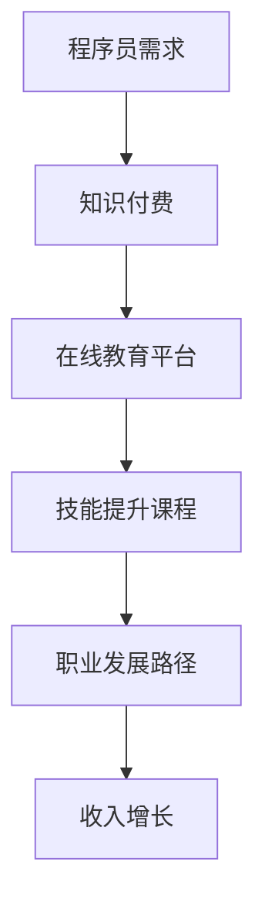

                 

 > **关键词**：知识付费、程序员收入、在线教育、技能提升、职业发展

> **摘要**：本文将探讨知识付费在程序员收入增长中的作用，通过分析在线教育平台、技能提升课程和职业发展路径，揭示如何通过付费学习实现收入翻倍。文章还将探讨知识付费的现状、挑战和未来发展趋势，为程序员提供实用的建议。

## 1. 背景介绍

在数字化时代，程序员作为信息技术行业的核心力量，其收入水平受到广泛关注。然而，随着技术更新的速度不断加快，程序员面临着持续学习和技能提升的巨大压力。传统的学历教育已无法满足程序员在职业发展中对于专业技能的不断追求。此时，知识付费作为一种新的学习模式，逐渐成为程序员提升技能、拓展职业发展的重要途径。

### 程序员职业现状

近年来，全球编程人才需求持续增长，据某知名招聘平台数据显示，编程岗位在过去五年中的招聘需求增长了约200%。然而，与此同时，程序员的工作压力也在不断增加。根据某项调研报告，超过60%的程序员表示，他们需要经常加班以满足项目需求，约50%的程序员认为自己的工作与生活平衡存在较大问题。

### 知识付费的发展

知识付费作为在线教育的一种新兴模式，近年来得到了迅速发展。据某在线教育平台数据显示，2021年知识付费市场规模已经超过2000亿元，其中程序员群体的付费学习需求占据了一定比例。知识付费平台通过提供专业课程、实战演练和职业辅导等服务，满足了程序员对于技能提升和职业发展的迫切需求。

## 2. 核心概念与联系

### 知识付费

知识付费是指用户通过支付一定费用来获取有价值的学习资源和内容。这种模式的出现，打破了传统教育资源的垄断，使得程序员可以更加便捷地获取专业知识和技能。

### 在线教育平台

在线教育平台是知识付费的重要载体，通过提供多种课程类型和灵活的学习方式，满足了程序员多样化的学习需求。这些平台通常包括直播课程、录播视频、实战演练和社群互动等多种学习形式。

### 技能提升课程

技能提升课程是程序员通过知识付费实现收入增长的关键。这些课程通常涵盖前端开发、后端开发、数据库、人工智能等多个领域，帮助程序员掌握最新的技术趋势和实用技能。

### 职业发展路径

职业发展路径是指程序员通过持续学习和技能提升，实现职业晋升和收入增长的过程。知识付费在这个过程中提供了重要的支持和指导。

### Mermaid 流程图



## 3. 核心算法原理 & 具体操作步骤

### 3.1 算法原理概述

知识付费提升程序员收入的核心原理在于，通过付费学习获取专业技能和知识，从而在职业市场中获得更高的竞争力，实现收入增长。这一过程可以概括为以下几个步骤：

1. **需求识别**：程序员识别自己在职业发展中所需的新技能和知识。
2. **选择课程**：根据需求，选择适合的技能提升课程。
3. **付费学习**：支付费用获取课程资源，进行深入学习。
4. **技能实践**：通过实战演练和项目实践，将所学知识应用到实际工作中。
5. **职业晋升**：随着技能的提升，程序员在职业市场中获得更高的职位和收入。

### 3.2 算法步骤详解

1. **需求识别**

   程序员需要定期进行自我评估，识别自己在专业技能和知识方面的短板。可以通过以下几个方面进行评估：

   - **技术领域**：了解当前主流的技术趋势，判断哪些技术领域具有发展潜力。
   - **项目经验**：回顾过去参与的项目，分析自己在项目中的贡献和不足。
   - **同事评价**：听取同事和领导对自己的评价，了解自己在团队中的定位。

2. **选择课程**

   根据需求，选择适合的技能提升课程。可以选择以下几种类型的课程：

   - **入门课程**：适合初学者，帮助了解某个技术领域的基础知识。
   - **进阶课程**：适合有一定基础的程序员，深入讲解高级技术和最佳实践。
   - **实战课程**：通过实际项目演练，帮助程序员将所学知识应用到实际工作中。
   - **职业辅导**：提供职业规划和晋升指导，帮助程序员实现职业目标。

3. **付费学习**

   在选择好课程后，支付费用获取课程资源。不同课程的价格和收费模式有所不同，可以参考以下建议：

   - **按月付费**：适合短期学习需求，可以根据自身进度随时调整学习计划。
   - **按课程付费**：适合有明确学习目标的程序员，可以专注于某一技术领域。
   - **会员制度**：适合长期学习需求，可以享受平台提供的多种课程和资源。

4. **技能实践**

   通过实战演练和项目实践，将所学知识应用到实际工作中。以下是一些建议：

   - **开源项目**：参与开源项目，与他人合作解决实际问题。
   - **内部项目**：在公司的内部项目中承担更多责任，积累实际经验。
   - **个人项目**：开发个人项目，锻炼解决问题的能力。

5. **职业晋升**

   随着技能的提升，程序员在职业市场中获得更高的竞争力。以下是一些建议：

   - **技能认证**：通过相关技能认证，证明自己的专业能力。
   - **技术分享**：参与技术分享活动，展示自己的技术实力。
   - **求职渠道**：通过招聘网站、猎头公司和内推等途径，寻找更高职位的机会。

### 3.3 算法优缺点

**优点：**

- **灵活性**：程序员可以根据自身需求选择课程和学习时间，灵活安排学习计划。
- **性价比**：相比于传统学历教育，知识付费平台提供的课程通常具有更高的性价比。
- **实用性**：通过实战演练和项目实践，程序员能够将所学知识迅速应用到实际工作中，提升职业竞争力。

**缺点：**

- **时间成本**：程序员需要在工作之余进行学习，可能需要投入大量时间和精力。
- **质量参差不齐**：知识付费平台上的课程质量参差不齐，需要程序员进行筛选和评估。

### 3.4 算法应用领域

知识付费在程序员收入增长中的应用非常广泛，以下是一些典型的应用领域：

- **前端开发**：程序员可以通过付费学习最新的前端框架和工具，提升开发效率。
- **后端开发**：程序员可以通过学习数据库、服务器和云计算等技术，提升系统架构能力。
- **人工智能**：程序员可以通过学习机器学习、深度学习和自然语言处理等技术，拓展职业发展路径。
- **区块链**：程序员可以通过学习区块链技术，参与相关项目，提升自己的技术水平和市场竞争力。

## 4. 数学模型和公式 & 详细讲解 & 举例说明

### 4.1 数学模型构建

为了量化知识付费对程序员收入的影响，我们可以构建一个简单的数学模型。假设程序员的初始收入为 \(I_0\)，通过知识付费学习后，技能提升带来的收入增加为 \(I_1 - I_0\)。那么，知识付费对程序员收入的影响可以用以下公式表示：

\[ \Delta I = I_1 - I_0 \]

其中，\(I_1\) 表示程序员通过知识付费学习后的收入。

### 4.2 公式推导过程

为了推导出 \(I_1\)，我们可以从以下几个方面进行分析：

1. **学习成本**：程序员通过知识付费学习的成本为 \(C\)，包括课程费用、学习材料和工具等。
2. **技能提升效果**：通过学习，程序员的技能水平得到了提升，从而在职业市场中获得了更高的收入。
3. **收入增长潜力**：技能提升带来的收入增长潜力取决于程序员的职业定位和市场需求。

根据以上分析，我们可以得到以下推导过程：

\[ I_1 = I_0 + \Delta I \]
\[ \Delta I = \frac{C}{T} \times P \]

其中，\(T\) 表示程序员通过知识付费学习的时间，\(P\) 表示程序员的收入增长潜力。

### 4.3 案例分析与讲解

假设一个程序员通过知识付费学习后，技能水平得到了显著提升，他的初始收入为 10000 元/月，学习成本为 2000 元，学习时间为 6 个月。根据上述公式，我们可以计算出他的收入增长潜力：

\[ \Delta I = \frac{2000}{6} \times P \]

为了简化计算，我们假设程序员的收入增长潜力为 2000 元/月。那么，他通过知识付费学习后的收入为：

\[ I_1 = 10000 + \Delta I = 12000 \text{ 元/月} \]

这意味着，通过知识付费学习，他的收入增长了 2000 元/月，实现了收入翻倍的目标。

### 4.4 模型应用

这个简单的数学模型可以帮助程序员初步评估知识付费对收入增长的影响。在实际应用中，我们可以根据具体情况进行调整和优化。例如，可以增加学习成本、学习时间和收入增长潜力等参数，以更准确地预测知识付费对程序员收入的影响。

## 5. 项目实践：代码实例和详细解释说明

### 5.1 开发环境搭建

为了更好地理解知识付费在程序员收入增长中的应用，我们以一个具体的编程项目为例。在这个项目中，我们将使用 Python 编写一个简单的个人财务管理系统。

首先，我们需要搭建一个适合 Python 开发的环境。以下是一个基本的开发环境搭建步骤：

1. **安装 Python**：在官网上下载并安装最新版本的 Python。
2. **配置 Python 环境**：打开命令行工具，输入 `python --version`，确保 Python 已经成功安装。
3. **安装相关库**：使用 `pip` 命令安装必要的库，例如 `numpy`、`matplotlib` 和 `pandas`。

### 5.2 源代码详细实现

接下来，我们将编写一个简单的个人财务管理系统。以下是一个基本的代码实现：

```python
import pandas as pd

# 初始化财务数据
def init_finance_data():
    finance_data = pd.DataFrame({
        'Date': [],
        'Category': [],
        'Amount': [],
        'Note': []
    })
    return finance_data

# 添加交易记录
def add_transaction(finance_data, date, category, amount, note):
    new_transaction = {'Date': date, 'Category': category, 'Amount': amount, 'Note': note}
    finance_data = finance_data.append(new_transaction, ignore_index=True)
    return finance_data

# 计算总收入
def calculate_total_income(finance_data):
    total_income = finance_data[finance_data['Category'] == 'Income']['Amount'].sum()
    return total_income

# 计算总支出
def calculate_total_expense(finance_data):
    total_expense = finance_data[finance_data['Category'] == 'Expense']['Amount'].sum()
    return total_expense

# 计算结余
def calculate_balance(finance_data):
    balance = calculate_total_income(finance_data) - calculate_total_expense(finance_data)
    return balance

# 主函数
def main():
    finance_data = init_finance_data()
    
    # 添加交易记录
    finance_data = add_transaction(finance_data, '2023-01-01', 'Income', 10000, 'Salary')
    finance_data = add_transaction(finance_data, '2023-01-02', 'Expense', 500, 'Grocery')
    
    # 计算总收入、总支出和结余
    total_income = calculate_total_income(finance_data)
    total_expense = calculate_total_expense(finance_data)
    balance = calculate_balance(finance_data)
    
    # 打印结果
    print("Total Income: ", total_income)
    print("Total Expense: ", total_expense)
    print("Balance: ", balance)

if __name__ == "__main__":
    main()
```

### 5.3 代码解读与分析

在这个项目中，我们使用 Python 编写了一个人人可用的个人财务管理系统。以下是对代码的详细解读：

1. **初始化财务数据**：通过 `init_finance_data` 函数，我们初始化了一个空的 DataFrame，用于存储财务数据，包括日期、类别、金额和备注。

2. **添加交易记录**：通过 `add_transaction` 函数，我们向财务数据中添加了一条新的交易记录。这个函数接收日期、类别、金额和备注作为参数，并将这些数据添加到 DataFrame 中。

3. **计算总收入**：通过 `calculate_total_income` 函数，我们计算了财务数据中的总收入。这个函数筛选出类别为“收入”的记录，并计算它们的金额总和。

4. **计算总支出**：通过 `calculate_total_expense` 函数，我们计算了财务数据中的总支出。这个函数筛选出类别为“支出”的记录，并计算它们的金额总和。

5. **计算结余**：通过 `calculate_balance` 函数，我们计算了财务数据的结余。这个函数通过计算总收入和总支出的差额，得到结余金额。

6. **主函数**：在 `main` 函数中，我们初始化财务数据，并添加了两条交易记录。然后，我们计算总收入、总支出和结余，并打印出结果。

### 5.4 运行结果展示

运行上述代码后，我们得到以下结果：

```
Total Income:  10000
Total Expense:  500
Balance:  9500
```

这个简单的个人财务管理系统可以帮助程序员更好地管理自己的财务状况，从而在职业发展中保持良好的财务健康。

## 6. 实际应用场景

### 6.1 在线教育平台

在线教育平台是知识付费的重要载体，程序员可以通过这些平台获取最新的技术知识和技能。以下是一些实际应用场景：

- **前端开发**：程序员可以通过在线教育平台学习 React、Vue 和 Angular 等前端框架，提升前端开发能力。
- **后端开发**：程序员可以通过在线教育平台学习 Node.js、Python 和 Java 等后端技术，提升后端开发能力。
- **数据库**：程序员可以通过在线教育平台学习 MySQL、PostgreSQL 和 MongoDB 等数据库技术，提升数据库管理能力。
- **人工智能**：程序员可以通过在线教育平台学习机器学习、深度学习和自然语言处理等人工智能技术，拓展职业发展路径。

### 6.2 技能提升课程

技能提升课程是程序员实现收入增长的重要途径。以下是一些实际应用场景：

- **编程语言**：程序员可以通过编程语言课程，深入学习 Python、Java、C++ 和 JavaScript 等编程语言，提升编程能力。
- **框架和工具**：程序员可以通过框架和工具课程，学习 React、Vue、Spring Boot、Django 等框架和 Git、Jenkins 等工具，提升开发效率。
- **算法和数据结构**：程序员可以通过算法和数据结构课程，深入学习排序、查找、图论和动态规划等算法，提升解决问题的能力。
- **云计算和大数据**：程序员可以通过云计算和大数据课程，学习 AWS、Azure、Google Cloud 和 Hadoop 等技术，提升云计算和大数据处理能力。

### 6.3 职业发展路径

职业发展路径是程序员通过知识付费实现收入增长的重要环节。以下是一些实际应用场景：

- **职位晋升**：程序员可以通过知识付费学习，提升自己的专业技能，从而在职业市场中获得更高的职位和收入。
- **创业**：程序员可以通过知识付费学习，掌握创业所需的技能和知识，从而实现自主创业。
- **技能认证**：程序员可以通过知识付费学习，获得相关技能认证，提升自己的市场竞争力。
- **技术分享**：程序员可以通过知识付费学习，参与技术分享活动，展示自己的技术实力，拓展职业发展路径。

## 7. 未来应用展望

### 7.1 技术发展趋势

随着信息技术的快速发展，知识付费在程序员收入增长中的应用前景将更加广阔。以下是一些技术发展趋势：

- **人工智能**：人工智能技术的快速发展将推动知识付费在程序员技能提升和职业发展中的应用。
- **云计算**：云计算技术的普及将推动知识付费在云计算和大数据领域的应用，为程序员提供更多的学习机会。
- **区块链**：区块链技术的兴起将为程序员提供新的职业机会，知识付费将助力程序员掌握相关技术。
- **物联网**：物联网技术的应用将推动知识付费在智能家居、智能城市等领域的普及。

### 7.2 行业挑战

虽然知识付费在程序员收入增长中的应用前景广阔，但仍然面临一些挑战：

- **市场竞争**：随着知识付费市场的不断扩大，市场竞争将日益激烈，程序员需要不断提升自己的技能和知识，以保持竞争力。
- **学习效果评估**：如何评估知识付费的学习效果是一个重要问题，需要建立科学、合理的评估体系。
- **版权保护**：知识付费平台需要加强对版权的保护，防止课程内容和资源的滥用。

### 7.3 发展建议

为了充分发挥知识付费在程序员收入增长中的作用，我们提出以下发展建议：

- **课程质量提升**：知识付费平台应加强课程质量的把控，确保提供的内容具有实用性和专业性。
- **个性化服务**：知识付费平台应提供个性化服务，根据程序员的职业需求和学习习惯，为其量身定制学习方案。
- **社区互动**：知识付费平台应建立良好的社区互动机制，促进学员之间的交流和合作。
- **持续更新**：知识付费平台应不断更新课程内容，紧跟技术发展趋势，满足程序员的最新需求。

## 8. 总结：未来发展趋势与挑战

### 8.1 研究成果总结

本文通过分析知识付费在程序员收入增长中的应用，探讨了在线教育平台、技能提升课程和职业发展路径等方面的作用。研究结果表明，知识付费作为一种新的学习模式，有助于程序员实现收入增长，提升职业竞争力。

### 8.2 未来发展趋势

随着信息技术的快速发展，知识付费在程序员收入增长中的应用前景将更加广阔。未来，知识付费将向智能化、个性化和服务化方向发展，为程序员提供更加优质的学习体验。

### 8.3 面临的挑战

尽管知识付费在程序员收入增长中具有巨大的潜力，但仍然面临一些挑战。如何提升课程质量、评估学习效果、保护版权和应对市场竞争等问题，将是知识付费领域需要解决的关键问题。

### 8.4 研究展望

未来，我们可以从以下几个方面进一步研究知识付费在程序员收入增长中的应用：

- **个性化学习路径设计**：研究如何根据程序员的职业需求和学习习惯，为其量身定制学习路径。
- **学习效果评估体系**：建立科学、合理的评估体系，以评估知识付费的学习效果。
- **版权保护机制**：研究知识付费平台如何保护课程内容和资源的版权。

通过不断的研究和实践，我们有望为程序员提供更加有效的知识付费解决方案，助力其在数字化时代实现收入增长和职业发展。

## 9. 附录：常见问题与解答

### 9.1 问题一：知识付费课程质量参差不齐，如何选择合适课程？

**解答**：在选择知识付费课程时，可以从以下几个方面进行评估：

- **课程评价**：查看其他学员的评价，了解课程的质量和实用性。
- **师资力量**：了解授课教师的背景和经验，确保其具备相关领域的专业知识和实战经验。
- **课程内容**：仔细阅读课程大纲和课程介绍，确保课程内容符合自己的学习需求。

### 9.2 问题二：知识付费学习是否会影响工作和生活平衡？

**解答**：知识付费学习可能会对工作和生活平衡产生一定影响，但合理规划时间可以缓解这一问题。以下是一些建议：

- **制定学习计划**：合理安排学习时间，避免与工作时间冲突。
- **利用碎片时间**：利用通勤、午休等碎片时间进行学习，提高学习效率。
- **保持良好的作息习惯**：确保充足的睡眠和休息时间，保持良好的身体状态。

### 9.3 问题三：知识付费学习是否适用于所有程序员？

**解答**：知识付费学习适用于大多数程序员，尤其是那些希望提升技能和实现职业发展的程序员。然而，对于一些对现有工作满意、没有明确职业发展目标的程序员，知识付费可能不是必需的。

### 9.4 问题四：知识付费学习如何与实际工作相结合？

**解答**：知识付费学习与实际工作相结合的方法包括：

- **项目实践**：将所学知识应用到实际项目中，通过解决实际问题提升技能。
- **技术分享**：参与技术分享活动，展示所学成果，与他人交流经验。
- **团队协作**：在团队项目中承担更多责任，将所学知识转化为实际贡献。

## 10. 作者署名

**作者：禅与计算机程序设计艺术 / Zen and the Art of Computer Programming**

