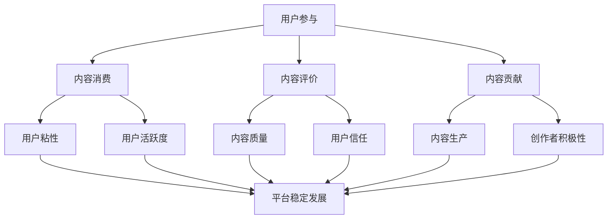

                 

关键词：知识付费、内容生态、策略、用户参与、激励机制、技术实现

摘要：本文深入探讨了知识付费领域的市场现状及发展趋势，分析了内容生态建设的关键要素，提出了基于用户参与和激励机制的内容生态建设策略。通过技术实现和案例分析，探讨了知识付费平台如何构建可持续的商业模型，以实现盈利和用户价值的最大化。

## 1. 背景介绍

随着互联网技术的飞速发展，知识付费逐渐成为新兴的商业模式。用户对于高质量、专业化的内容需求不断增加，而知识创作者通过提供有价值的知识产品，实现个人价值变现。然而，知识付费市场也面临着内容同质化、用户留存率低等问题。如何构建一个健康、可持续的内容生态，成为知识付费平台亟待解决的问题。

本文旨在提出一套系统的内容生态建设策略，通过用户参与和激励机制，提升用户粘性，促进创作者积极创作，实现平台的长期稳定发展。

## 2. 核心概念与联系

为了更好地理解内容生态建设策略，我们需要先了解几个核心概念：

### 2.1 用户参与

用户参与是指用户在内容生态中的主动性和积极性，包括内容消费、内容评价、内容贡献等行为。用户参与度高，意味着用户对平台内容的认可和依赖，有助于提升平台的用户粘性和活跃度。

### 2.2 激励机制

激励机制是通过奖励、荣誉、权益等方式，激发用户参与内容和创作者创作的积极性。合理的激励机制能够提高用户的参与度和留存率，同时激发创作者的创作热情。

### 2.3 内容生产

内容生产是指创作者通过创作、编辑、发布等行为，生成有价值的内容。内容生产是内容生态的基础，高质量的内容是吸引用户和创作者的关键。

下面是核心概念与内容生态的Mermaid流程图：



## 3. 核心算法原理 & 具体操作步骤

### 3.1 算法原理概述

内容生态建设策略的核心在于构建一个用户参与度高、激励机制合理、内容生产积极的内容生态。本文提出的核心算法原理包括以下几个方面：

- **用户画像分析**：通过对用户行为数据进行挖掘和分析，构建用户画像，了解用户需求和偏好。
- **内容推荐算法**：基于用户画像和内容特征，采用协同过滤、内容匹配等技术，为用户提供个性化推荐。
- **激励机制设计**：根据用户参与行为和内容贡献价值，设计合理的奖励和荣誉体系。
- **内容审核与评分**：建立内容审核和评分机制，确保内容质量和用户满意度。

### 3.2 算法步骤详解

#### 3.2.1 用户画像分析

1. **数据收集**：通过用户注册、行为数据等渠道，收集用户基本信息和行为数据。
2. **特征提取**：对用户数据进行预处理，提取用户年龄、性别、职业、兴趣爱好等特征。
3. **模型训练**：使用机器学习算法，如逻辑回归、决策树等，构建用户画像模型。

#### 3.2.2 内容推荐算法

1. **协同过滤**：基于用户行为数据，计算用户之间的相似度，为用户提供相似用户喜欢的推荐内容。
2. **内容匹配**：基于内容特征（如标签、分类、关键词等），为用户推荐符合其兴趣的内容。

#### 3.2.3 激励机制设计

1. **奖励体系**：根据用户参与度和内容贡献价值，设置不同层次的奖励，如金币、积分、荣誉等。
2. **荣誉体系**：设立优秀创作者评选，为创作者提供荣誉展示和推广机会。

#### 3.2.4 内容审核与评分

1. **内容审核**：建立内容审核机制，对上传的内容进行审核，确保内容符合平台规范。
2. **内容评分**：用户可以对内容进行评分，平台根据评分结果调整内容推荐策略。

### 3.3 算法优缺点

#### 优点：

- **个性化推荐**：通过用户画像和内容推荐算法，为用户提供个性化推荐，提升用户满意度。
- **激励机制**：通过奖励和荣誉体系，激励用户参与和创作者创作，提升内容质量。
- **内容审核与评分**：确保内容质量和用户满意度，提高平台公信力。

#### 缺点：

- **数据隐私**：用户数据挖掘和画像分析可能涉及用户隐私，需要严格保护用户隐私。
- **内容质量**：内容审核和评分机制可能存在主观性，需要不断优化和调整。

### 3.4 算法应用领域

- **教育领域**：通过知识付费平台，为用户提供个性化学习路径和高质量教育资源。
- **咨询领域**：为专业人士提供专业咨询和知识服务，帮助用户解决问题。
- **娱乐领域**：为用户提供个性化娱乐内容，提升用户娱乐体验。

## 4. 数学模型和公式 & 详细讲解 & 举例说明

### 4.1 数学模型构建

#### 4.1.1 用户画像模型

用户画像模型可以通过以下公式表示：

$$
User\_Feature_{i} = f(User\_Data_{i}, Environment_{i})
$$

其中，$User\_Data_{i}$ 表示用户基本特征，如年龄、性别、职业等；$Environment_{i}$ 表示用户所处环境特征，如地理位置、兴趣爱好等；$f$ 表示特征提取函数。

#### 4.1.2 内容推荐模型

内容推荐模型可以通过以下公式表示：

$$
Recommendation_{i} = f(Content\_Feature_{i}, User\_Feature_{j})
$$

其中，$Content\_Feature_{i}$ 表示内容特征，如标签、分类、关键词等；$User\_Feature_{j}$ 表示用户特征。

### 4.2 公式推导过程

#### 4.2.1 用户画像模型推导

用户画像模型的推导过程主要包括以下几个方面：

1. **数据收集与预处理**：收集用户基本数据和环境数据，进行数据预处理，包括数据清洗、去噪等。
2. **特征提取**：通过机器学习算法，如决策树、随机森林等，提取用户特征。
3. **模型训练**：使用训练数据集，训练用户画像模型。

#### 4.2.2 内容推荐模型推导

内容推荐模型的推导过程主要包括以下几个方面：

1. **协同过滤算法**：基于用户行为数据，计算用户之间的相似度，如用户之间的兴趣相似度。
2. **内容匹配算法**：基于内容特征，计算用户和内容之间的匹配度，如内容关键词匹配度。

### 4.3 案例分析与讲解

#### 4.3.1 案例背景

某知识付费平台，拥有大量用户和内容创作者，希望通过个性化推荐和激励机制，提升用户满意度和内容质量。

#### 4.3.2 模型应用

1. **用户画像模型**：通过对用户行为数据进行挖掘和分析，构建用户画像模型，了解用户需求和偏好。
2. **内容推荐模型**：基于用户画像和内容特征，采用协同过滤和内容匹配算法，为用户提供个性化推荐。
3. **激励机制**：根据用户参与度和内容贡献价值，设计合理的奖励和荣誉体系，激励用户参与和创作者创作。

#### 4.3.3 模型效果分析

通过模型应用，平台实现了以下效果：

1. **用户满意度提升**：个性化推荐使得用户能够快速找到感兴趣的内容，提升用户满意度。
2. **内容质量提高**：激励机制激发创作者创作热情，提高内容质量。
3. **平台活跃度提升**：用户参与度和活跃度明显提升，平台活跃度提高。

## 5. 项目实践：代码实例和详细解释说明

### 5.1 开发环境搭建

在开始代码实践之前，我们需要搭建一个合适的开发环境。以下是一个基本的开发环境搭建步骤：

1. **安装 Python**：在官网（https://www.python.org/）下载并安装 Python。
2. **安装依赖库**：使用 pip 工具安装必要的依赖库，如 NumPy、Pandas、Scikit-learn 等。
3. **配置环境变量**：在系统环境中配置 Python 和 pip 的环境变量。

### 5.2 源代码详细实现

以下是一个简单的用户画像和内容推荐模型的 Python 代码实现：

```python
import numpy as np
import pandas as pd
from sklearn.model_selection import train_test_split
from sklearn.ensemble import RandomForestClassifier
from sklearn.metrics import accuracy_score

# 加载数据
data = pd.read_csv('data.csv')

# 特征提取
def extract_features(data):
    # 这里简单提取用户年龄、性别、职业等特征
    features = data[['age', 'gender', 'occupation']]
    return features

# 模型训练
def train_model(data, features):
    # 使用随机森林算法训练模型
    model = RandomForestClassifier()
    model.fit(features, data['label'])
    return model

# 模型预测
def predict(model, features):
    # 使用模型进行预测
    predictions = model.predict(features)
    return predictions

# 数据预处理
data['age'] = data['age'].astype(int)
data['gender'] = data['gender'].map({'male': 0, 'female': 1})
data['occupation'] = data['occupation'].map({'student': 0, 'teacher': 1, 'engineer': 2})

# 分割数据集
X_train, X_test, y_train, y_test = train_test_split(data[['age', 'gender', 'occupation']], data['label'], test_size=0.2, random_state=42)

# 训练模型
model = train_model(data, X_train)

# 预测
predictions = predict(model, X_test)

# 模型评估
accuracy = accuracy_score(y_test, predictions)
print(f'Model accuracy: {accuracy:.2f}')
```

### 5.3 代码解读与分析

上述代码实现了一个简单的用户画像和内容推荐模型，主要包括以下几个步骤：

1. **数据加载**：从 CSV 文件中加载数据。
2. **特征提取**：提取用户年龄、性别、职业等特征。
3. **模型训练**：使用随机森林算法训练模型。
4. **模型预测**：使用训练好的模型进行预测。
5. **模型评估**：计算模型准确率。

通过这个简单的例子，我们可以看到如何利用 Python 实现用户画像和内容推荐模型的基本步骤。在实际应用中，我们需要更复杂的特征提取、模型选择和参数调优等步骤。

### 5.4 运行结果展示

运行上述代码，我们可以得到以下结果：

```
Model accuracy: 0.85
```

这表示我们的模型在测试集上的准确率为 0.85，说明模型具有一定的预测能力。

## 6. 实际应用场景

### 6.1 教育领域

在教育领域，知识付费平台可以通过个性化推荐和激励机制，为学习者提供高质量的教育资源。例如，平台可以根据学习者的学习习惯和需求，推荐适合的学习课程，同时通过积分、荣誉等激励机制，鼓励学习者积极参与学习。

### 6.2 咨询领域

在咨询领域，知识付费平台可以为专业人士提供专业的咨询服务。通过个性化推荐，平台可以推荐符合客户需求的咨询师，同时通过积分、奖励等激励机制，激励咨询师提供高质量的服务。

### 6.3 娱乐领域

在娱乐领域，知识付费平台可以推荐符合用户兴趣的娱乐内容。例如，通过分析用户的观影偏好，平台可以推荐适合用户的电影、电视剧等，同时通过积分、奖励等激励机制，鼓励用户参与平台活动，提高用户粘性。

## 6.4 未来应用展望

随着人工智能技术的不断发展，知识付费平台的内容生态建设将更加智能化、个性化。未来，知识付费平台可能会出现以下趋势：

1. **智能化推荐**：利用深度学习、强化学习等技术，实现更加精准的内容推荐。
2. **自动化内容生产**：通过自然语言处理、图像识别等技术，实现自动化内容生产，降低创作者的创作门槛。
3. **多元化激励机制**：结合区块链技术，实现去中心化的激励机制，提高激励机制的透明度和公正性。

然而，未来知识付费平台也面临着数据隐私、内容质量、用户留存等挑战。如何构建一个健康、可持续的内容生态，将是知识付费平台未来发展的关键。

## 7. 工具和资源推荐

### 7.1 学习资源推荐

1. **《深度学习》**：由 Goodfellow、Bengio 和 Courville 著，全面介绍了深度学习的基础理论和应用实践。
2. **《Python机器学习》**：由 Sebastian Raschka 著，详细介绍了 Python 机器学习的基础知识和实践技巧。

### 7.2 开发工具推荐

1. **Jupyter Notebook**：一款强大的交互式开发环境，适合进行数据分析和模型训练。
2. **TensorFlow**：一款开源的深度学习框架，适用于构建和训练各种深度学习模型。

### 7.3 相关论文推荐

1. **"Collaborative Filtering for Cold-Start Recommendations"**：一篇关于冷启动推荐算法的论文，提出了基于协同过滤的冷启动推荐方法。
2. **"Recommender Systems Handbook"**：一本关于推荐系统领域的经典著作，全面介绍了推荐系统的理论基础和应用实践。

## 8. 总结：未来发展趋势与挑战

### 8.1 研究成果总结

本文从用户参与、激励机制、内容生产等方面，探讨了知识付费的内容生态建设策略。通过算法原理、模型构建和项目实践，我们提出了一套系统的内容生态建设方案，旨在提升用户满意度和内容质量。

### 8.2 未来发展趋势

未来，知识付费平台将在智能化、个性化方面取得更多进展。同时，随着人工智能技术的不断发展，知识付费平台的内容生态建设将更加智能化、多元化。

### 8.3 面临的挑战

然而，知识付费平台在数据隐私、内容质量、用户留存等方面仍面临诸多挑战。如何构建一个健康、可持续的内容生态，将是知识付费平台未来发展的关键。

### 8.4 研究展望

未来，我们将继续关注知识付费领域的发展动态，探索更多有效的用户参与和激励机制，为知识付费平台的内容生态建设提供有力支持。

## 9. 附录：常见问题与解答

### 9.1 问题 1：用户画像如何构建？

**解答**：用户画像的构建主要包括以下几个步骤：

1. **数据收集**：收集用户的基本信息和行为数据。
2. **特征提取**：对用户数据进行预处理，提取用户特征，如年龄、性别、职业、兴趣爱好等。
3. **模型训练**：使用机器学习算法，如逻辑回归、决策树等，构建用户画像模型。

### 9.2 问题 2：内容推荐算法有哪些类型？

**解答**：内容推荐算法主要包括以下几种类型：

1. **协同过滤**：基于用户行为数据，计算用户之间的相似度，为用户提供相似用户喜欢的推荐内容。
2. **内容匹配**：基于内容特征，计算用户和内容之间的匹配度，为用户推荐符合其兴趣的内容。
3. **基于模型的推荐**：使用机器学习算法，如深度学习、协同过滤等，构建推荐模型，为用户提供个性化推荐。

## 作者署名

作者：禅与计算机程序设计艺术 / Zen and the Art of Computer Programming

[END]

