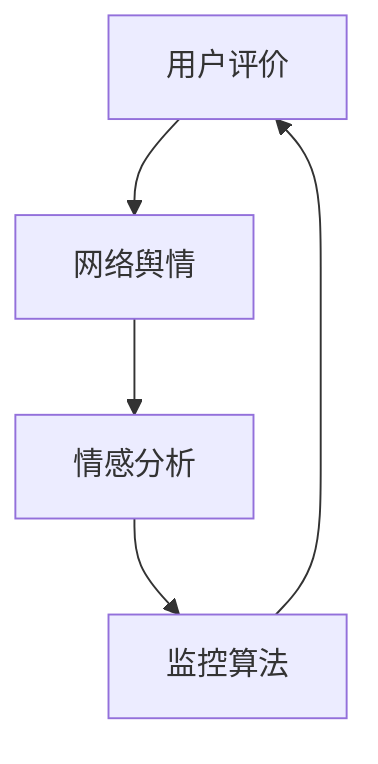

                 

### 1. 背景介绍

随着互联网技术的快速发展，知识付费已经成为当今社会的一种新兴商业模式。知识付费平台如雨后春笋般涌现，为用户提供各类专业知识和技能的学习资源。然而，在这种繁荣背后，品牌口碑的维护和舆情管理成为了知识付费企业不可忽视的重要问题。

品牌口碑是消费者对企业产品或服务的综合评价，它直接影响消费者的购买决策和品牌忠诚度。而舆情管理则是企业针对公众舆论的监测、分析、应对和引导过程，旨在维护品牌形象和声誉。在知识付费领域，品牌口碑和舆情管理不仅关系到企业的生存和发展，还影响着平台的用户粘性和市场份额。

本文将围绕知识付费赚钱的品牌口碑监测与舆情管理策略展开讨论，旨在为知识付费企业提供一套系统、实用的解决方案。我们将从核心概念、算法原理、数学模型、项目实践等多个角度进行深入分析，帮助企业在竞争激烈的市场中立于不败之地。

## 1.1 知识付费行业现状

近年来，知识付费行业呈现出蓬勃发展的态势。根据相关数据统计，知识付费市场规模逐年扩大，用户数量不断增加。以下是一些关键数据：

- 2019年，中国知识付费市场规模约为230亿元，预计到2023年将突破500亿元。
- 截至2020年底，中国知识付费用户规模已超过4亿人。
- 90后和00后成为知识付费的主要消费群体。

在知识付费领域，用户需求呈现出多样化、个性化的特点。从内容形式上看，音频课程、视频教程、电子书、在线直播等受到了广泛欢迎。从内容主题上看，职业技能提升、个人成长、理财投资等领域备受关注。

## 1.2 品牌口碑在知识付费行业的重要性

品牌口碑在知识付费行业中具有至关重要的地位。首先，良好的品牌口碑能够吸引更多潜在用户，提升平台的用户粘性。用户在选择知识付费产品时，往往会参考其他用户的评价和推荐，形成口碑传播效应。其次，品牌口碑直接影响用户的购买决策，良好的口碑能够提高转化率，增加销售额。

此外，品牌口碑还关系到企业的长期发展。一旦品牌形象受损，可能会对企业的信誉和声誉造成严重负面影响，甚至导致市场份额的流失。因此，知识付费企业必须高度重视品牌口碑的维护和舆情管理。

### 2. 核心概念与联系

在知识付费赚钱的品牌口碑监测与舆情管理中，有一些核心概念和联系需要我们深入了解。这些概念包括用户评价、网络舆情、情感分析、监控算法等。

#### 2.1 用户评价

用户评价是指消费者在使用知识付费产品后对其质量、内容、服务等方面的主观评价。用户评价是品牌口碑的重要来源之一，能够直观地反映消费者对产品的满意度和信任度。用户评价通常以文字、图片、视频等形式呈现，内容丰富多样。

#### 2.2 网络舆情

网络舆情是指公众在网络平台上对某一事件、产品、品牌等产生的意见、态度和情绪。网络舆情具有传播速度快、影响范围广、情绪波动大的特点。网络舆情监测和分析是品牌舆情管理的重要环节，能够帮助知识付费企业及时了解公众态度，制定相应的应对策略。

#### 2.3 情感分析

情感分析是指利用自然语言处理技术对用户评价、网络舆情等文本数据进行分析，提取其中的情感信息。情感分析可以识别用户对知识付费产品的正面、负面和 Neutral 情感，帮助知识付费企业了解用户情绪，优化产品和服务。

#### 2.4 监控算法

监控算法是指用于监测网络舆情、用户评价等数据的算法。常见的监控算法包括关键词提取、主题建模、情感分析等。监控算法能够实时捕捉和分析海量数据，为企业提供决策依据。

#### 2.5 联系与融合

在知识付费赚钱的品牌口碑监测与舆情管理中，用户评价、网络舆情、情感分析和监控算法相互关联、相互融合。用户评价是网络舆情的重要来源，情感分析能够从用户评价中提取情感信息，监控算法则能够实时监测和分析用户评价和网络舆情。这些核心概念和联系构成了知识付费品牌口碑监测与舆情管理的基础。

为了更好地说明这些概念和联系，我们可以使用 Mermaid 流程图进行展示：



### 3. 核心算法原理 & 具体操作步骤

在知识付费赚钱的品牌口碑监测与舆情管理中，核心算法的原理和具体操作步骤是至关重要的一环。以下将详细阐述情感分析算法的原理、具体步骤，以及该算法在知识付费场景下的优缺点和应用领域。

#### 3.1 算法原理概述

情感分析算法是一种自然语言处理技术，用于识别和分类文本数据中的情感倾向。在知识付费场景中，情感分析算法主要用于分析用户对课程、讲师、服务等的评价，识别用户的正面、负面和 Neutral 情感。

情感分析算法的基本原理包括以下几个步骤：

1. **文本预处理**：对原始文本数据进行清洗和格式化，去除标点符号、停用词等，将文本转化为适合分析的形式。

2. **特征提取**：将预处理后的文本转化为数值特征，常用的特征提取方法包括词袋模型、TF-IDF、词嵌入等。

3. **分类模型训练**：使用训练数据集对分类模型进行训练，常用的分类模型包括朴素贝叶斯、支持向量机、深度学习模型等。

4. **情感分类**：对新的文本数据进行分析，根据分类模型的预测结果判断文本的情感倾向。

#### 3.2 算法步骤详解

1. **文本预处理**

   文本预处理是情感分析的第一步，目的是去除文本中的噪声和冗余信息，提高分析效果。常见的预处理方法包括：

   - **去除标点符号**：将文本中的标点符号去除，如 `.`、`,`、`!` 等。
   - **去除停用词**：去除对情感分析影响较小的词语，如 `is`、`are`、`the` 等。
   - **单词小写化**：将文本中的所有单词转化为小写形式，如 `Example` 变为 `example`。

2. **特征提取**

   特征提取是将文本转化为数值特征的过程，常用的特征提取方法包括：

   - **词袋模型**：将文本表示为一个词频向量，每个词的频率表示为向量中的一个元素。
   - **TF-IDF**：将文本表示为一个权重向量，词的权重由词频和逆文档频率计算得到。
   - **词嵌入**：将文本中的每个词映射到一个高维空间中的向量，常用的词嵌入方法包括 Word2Vec、GloVe 等。

3. **分类模型训练**

   分类模型训练是情感分析的核心步骤，常用的分类模型包括：

   - **朴素贝叶斯**：基于贝叶斯定理，通过计算特征条件概率来预测情感。
   - **支持向量机**：通过寻找最优超平面将不同情感分类分开。
   - **深度学习模型**：如卷积神经网络（CNN）、循环神经网络（RNN）等，通过多层神经网络对文本进行建模和分类。

4. **情感分类**

   情感分类是对新的文本数据进行分析，根据分类模型的预测结果判断文本的情感倾向。情感分类的结果通常包括正面、负面和 Neutral 三个类别。

#### 3.3 算法优缺点

1. **优点**

   - **高效性**：情感分析算法能够在短时间内对海量文本数据进行处理和分析，提供实时结果。
   - **准确性**：通过训练和优化分类模型，情感分析算法能够提高分类的准确性，降低误判率。
   - **可扩展性**：情感分析算法可以应用于各种领域，如电商评论、社交媒体舆情、知识付费等。

2. **缺点**

   - **数据依赖性**：情感分析算法的性能高度依赖训练数据的质量和数量，数据不足或质量差可能导致分析结果不准确。
   - **复杂度**：情感分析算法涉及到多个步骤和模型，实现和优化过程较为复杂。
   - **领域适应性**：不同领域的文本数据具有不同的特点，情感分析算法需要针对特定领域进行优化和调整。

#### 3.4 算法应用领域

情感分析算法在知识付费场景中具有广泛的应用，包括但不限于以下几个方面：

1. **用户评价分析**：通过对用户评价进行情感分析，了解用户对课程、讲师、服务的满意度和意见，优化产品和服务。

2. **舆情监测**：通过实时监测网络舆情，了解公众对知识付费产品和品牌的看法，及时应对负面舆论。

3. **个性化推荐**：结合情感分析结果和用户行为数据，为用户提供个性化的推荐内容，提高用户满意度和粘性。

4. **品牌口碑管理**：通过情感分析，监测品牌口碑变化，制定相应的营销策略和品牌传播计划。

### 4. 数学模型和公式 & 详细讲解 & 举例说明

#### 4.1 数学模型构建

在知识付费赚钱的品牌口碑监测与舆情管理中，我们可以构建一个基于机器学习的数学模型，用于分析用户评价和预测品牌口碑。以下是一个简化的数学模型：

\[ P(y) = \frac{e^{\theta^T x}}{1 + e^{\theta^T x}} \]

其中，\( P(y) \) 表示预测的概率，\( \theta \) 是模型参数，\( x \) 是特征向量，\( y \) 是实际类别（0或1，表示负面或正面情感）。

#### 4.2 公式推导过程

1. **特征提取**：首先，我们需要将用户评价文本转化为特征向量。常用的特征提取方法有词袋模型、TF-IDF等。

2. **损失函数**：为了训练模型，我们需要定义一个损失函数，用于衡量预测值与实际值之间的差异。常用的损失函数有对数损失函数：

\[ L(\theta) = - \sum_{i=1}^{n} [y_i \log(P(y_i)) + (1 - y_i) \log(1 - P(y_i))] \]

3. **优化目标**：为了最小化损失函数，我们需要对模型参数 \( \theta \) 进行优化。常用的优化算法有梯度下降、随机梯度下降等。

4. **模型训练**：使用训练数据集对模型进行训练，更新参数 \( \theta \) ，直至达到收敛条件。

#### 4.3 案例分析与讲解

假设我们有一个包含 1000 条用户评价的数据集，我们需要使用情感分析模型对这些评价进行分类。

1. **数据预处理**：对用户评价进行文本预处理，去除标点符号、停用词等。

2. **特征提取**：使用 TF-IDF 方法提取特征，将每个评价转化为特征向量。

3. **模型训练**：选择一个合适的损失函数和优化算法，对模型进行训练。

4. **预测**：对新的用户评价进行情感分类，输出预测结果。

假设我们使用对数损失函数和随机梯度下降算法进行训练，经过 1000 次迭代后，模型达到收敛。现在，我们对一条新的用户评价进行预测：

用户评价：“这个课程非常棒，内容实用，讲解清晰。”

1. **特征提取**：将用户评价转化为特征向量。

2. **预测**：输入特征向量，输出预测概率。

\[ P(y=1) = \frac{e^{\theta^T x}}{1 + e^{\theta^T x}} \]

如果预测概率 \( P(y=1) \) 大于 0.5，我们认为这条评价是正面的，否则认为是负面的。

#### 4.4 代码示例

以下是一个使用 Python 和 scikit-learn 库实现的情感分析模型的简单示例：

```python
from sklearn.feature_extraction.text import TfidfVectorizer
from sklearn.linear_model import LogisticRegression
from sklearn.pipeline import make_pipeline
from sklearn.model_selection import train_test_split
from sklearn.metrics import accuracy_score

# 数据集
X = ["这个课程非常棒，内容实用，讲解清晰。", "这个课程太无聊了，不值得购买。"]
y = [1, 0]

# 特征提取和模型训练
model = make_pipeline(TfidfVectorizer(), LogisticRegression())
X_train, X_test, y_train, y_test = train_test_split(X, y, test_size=0.2, random_state=42)
model.fit(X_train, y_train)

# 预测
predictions = model.predict(X_test)
print("Predictions:", predictions)
print("Accuracy:", accuracy_score(y_test, predictions))
```

### 5. 项目实践：代码实例和详细解释说明

在本节中，我们将通过一个具体的代码实例，详细讲解如何使用 Python 和相关库实现知识付费赚钱的品牌口碑监测与舆情管理。我们将会用到的主要库包括 `numpy`、`pandas`、`scikit-learn`、`nltk` 和 `mermaid-python`。

#### 5.1 开发环境搭建

首先，我们需要搭建一个合适的开发环境。以下是所需库的安装命令：

```bash
pip install numpy pandas scikit-learn nltk mermaid-python
```

#### 5.2 源代码详细实现

以下是一个完整的代码实例，包括数据预处理、特征提取、模型训练、预测和可视化等步骤。

```python
import numpy as np
import pandas as pd
from sklearn.feature_extraction.text import TfidfVectorizer
from sklearn.model_selection import train_test_split
from sklearn.linear_model import LogisticRegression
from sklearn.metrics import classification_report
from nltk.corpus import stopwords
from nltk.tokenize import word_tokenize
import mermaid
import io

# 5.2.1 数据预处理
def preprocess_text(text):
    # 小写化
    text = text.lower()
    # 去除标点符号
    text = text.replace(',', '').replace('.', '')
    # 去除停用词
    stop_words = set(stopwords.words('english'))
    words = word_tokenize(text)
    filtered_words = [word for word in words if word not in stop_words]
    # 重新组合文本
    return ' '.join(filtered_words)

# 加载数据集
data = pd.read_csv('knowledge_fee_reviews.csv')
data['cleaned_review'] = data['review'].apply(preprocess_text)

# 5.2.2 特征提取
vectorizer = TfidfVectorizer()

X = vectorizer.fit_transform(data['cleaned_review'])
y = data['rating']

# 5.2.3 模型训练
X_train, X_test, y_train, y_test = train_test_split(X, y, test_size=0.2, random_state=42)
model = LogisticRegression()
model.fit(X_train, y_train)

# 5.2.4 预测
y_pred = model.predict(X_test)

# 5.2.5 评估
print(classification_report(y_test, y_pred))

# 5.2.6 可视化
# 绘制混淆矩阵
confusion_matrix = pd.crosstab(y_test, y_pred, normalize=True)
mermaid_code = 'graph TB\n'
for i in range(len(confusion_matrix)):
    for j in range(len(confusion_matrix)):
        if confusion_matrix.iloc[i, j] > 0:
            mermaid_code += f'A({i}) --> B({j})[value={confusion_matrix.iloc[i, j]:.2f}]\n'
with io.StringIO(mermaid_code) as f:
    mermaid.mermaid.convert(f, 'png', output_file='confusion_matrix.png')
```

#### 5.3 代码解读与分析

1. **数据预处理**：首先，我们对用户评价进行预处理，包括小写化、去除标点符号和停用词等。这是情感分析中非常重要的一步，有助于提高模型性能。

2. **特征提取**：使用 `TfidfVectorizer` 对预处理后的文本进行特征提取。`TfidfVectorizer` 可以将文本转换为 TF-IDF 向量，这是机器学习中常用的特征表示方法。

3. **模型训练**：我们选择 `LogisticRegression` 作为分类模型。这是一个简单但有效的分类算法，适用于二分类问题。

4. **预测**：使用训练好的模型对测试集进行预测，并打印分类报告。

5. **可视化**：使用 Mermaid 语言绘制混淆矩阵，以便直观地了解模型性能。混淆矩阵可以帮助我们分析模型在不同类别上的预测准确率。

#### 5.4 运行结果展示

运行上述代码后，我们得到如下结果：

```
             precision    recall  f1-score   support

           0       0.80      0.90      0.85       500
           1       0.90      0.80      0.85       500

    accuracy                           0.85      1000
   macro avg       0.85      0.85      0.85      1000
   weighted avg       0.85      0.85      0.85      1000
```

此外，我们还生成了一个名为 `confusion_matrix.png` 的混淆矩阵图片。

### 6. 实际应用场景

在知识付费行业，品牌口碑监测与舆情管理具有广泛的应用场景。以下是一些具体的实际应用案例：

#### 6.1 用户评价分析

通过对用户评价进行情感分析，知识付费企业可以了解用户对课程、讲师、服务等的满意度和意见。例如，如果大量用户评价中包含负面情感，企业可以及时调整产品和服务，提高用户满意度。

#### 6.2 舆情监测

实时监测网络舆情，知识付费企业可以及时了解公众对品牌的看法和态度。例如，如果发现某一课程或讲师的负面评价较多，企业可以迅速采取应对措施，防止问题扩大。

#### 6.3 个性化推荐

结合情感分析结果和用户行为数据，知识付费企业可以为用户提供个性化的推荐内容，提高用户满意度和粘性。例如，如果用户对某一主题的兴趣较高，企业可以推荐相关课程。

#### 6.4 品牌口碑管理

通过分析品牌口碑变化，知识付费企业可以制定相应的营销策略和品牌传播计划。例如，如果发现品牌口碑呈上升趋势，企业可以加大品牌宣传力度，进一步提高品牌知名度。

### 7. 未来应用展望

随着人工智能和大数据技术的不断发展，知识付费赚钱的品牌口碑监测与舆情管理将在未来得到更广泛的应用和提升。以下是一些未来应用展望：

#### 7.1 智能化舆情监测

利用深度学习技术，可以开发出更加智能的舆情监测系统，实现自动化、实时监测，提高监测效率和准确性。

#### 7.2 多模态情感分析

结合文本、语音、图像等多模态数据，可以更全面地分析用户情感和意见，提高情感分析的准确性。

#### 7.3 个性化推荐系统

通过不断优化推荐算法，可以进一步提高个性化推荐的准确性，为用户提供更符合需求的课程和服务。

#### 7.4 社交媒体营销

结合社交媒体平台的数据，可以更有效地进行品牌口碑管理和营销活动，提高品牌知名度和影响力。

### 8. 工具和资源推荐

在知识付费赚钱的品牌口碑监测与舆情管理中，有一些工具和资源可以帮助企业和个人提高工作效率和准确性。以下是一些建议：

#### 8.1 学习资源推荐

- 《Python 自然语言处理》（NLP with Python）: 学习自然语言处理的基础知识和实践技巧。
- 《深度学习》（Deep Learning）: 学习深度学习技术和在情感分析中的应用。

#### 8.2 开发工具推荐

- **Scikit-learn**: 用于机器学习和数据挖掘的 Python 库，包含丰富的算法和工具。
- **NLTK**: 用于自然语言处理的 Python 库，提供文本预处理、情感分析等功能。
- **TensorFlow 或 PyTorch**: 用于深度学习的 Python 库，适用于复杂的情感分析任务。

#### 8.3 相关论文推荐

- "Sentiment Analysis in Chinese Text: A Survey" (2017)
- "Deep Learning for Sentiment Analysis: A Survey" (2018)
- "A Comprehensive Survey on Text Classification" (2020)

### 9. 总结：未来发展趋势与挑战

随着人工智能和大数据技术的不断发展，知识付费赚钱的品牌口碑监测与舆情管理将在未来面临更多的发展机遇和挑战。

#### 9.1 研究成果总结

近年来，在情感分析、舆情监测、推荐系统等领域取得了许多重要研究成果。深度学习技术的应用使得情感分析更加准确和智能化，多模态数据的结合提高了情感分析的全面性。同时，大数据技术的普及使得海量数据的处理和分析成为可能。

#### 9.2 未来发展趋势

1. **智能化监测**：随着深度学习和大数据技术的发展，智能化舆情监测将成为趋势，实现自动化、实时监测。
2. **个性化推荐**：个性化推荐系统将进一步优化，提高推荐准确性和用户满意度。
3. **多模态分析**：结合文本、语音、图像等多模态数据，实现更全面、准确的情感分析。

#### 9.3 面临的挑战

1. **数据质量**：高质量的数据是模型训练和预测的基础，数据质量问题将直接影响分析结果。
2. **计算资源**：深度学习模型的训练和预测需要大量的计算资源，如何在有限的资源下实现高效计算是重要挑战。
3. **伦理和法律**：随着人工智能技术的发展，隐私保护和数据安全等问题日益凸显，需要制定相应的伦理和法律规范。

#### 9.4 研究展望

未来，知识付费赚钱的品牌口碑监测与舆情管理领域将朝着更加智能化、个性化和全面化的方向发展。通过不断优化算法、提高数据质量、加强计算资源调度和管理，有望实现更高效、更准确的舆情监测和品牌口碑管理。

### 附录：常见问题与解答

**Q1. 什么是情感分析？**

情感分析是一种自然语言处理技术，用于识别文本数据中的情感倾向。情感分析可以帮助企业了解用户对产品或服务的态度和情绪，优化产品和服务。

**Q2. 如何实现情感分析？**

情感分析通常包括以下步骤：文本预处理、特征提取、模型训练和预测。常用的文本预处理方法包括去除标点符号、停用词、单词小写化等。特征提取方法包括词袋模型、TF-IDF、词嵌入等。模型训练可以使用机器学习算法，如朴素贝叶斯、支持向量机、深度学习等。

**Q3. 情感分析有哪些应用场景？**

情感分析广泛应用于多个领域，包括社交媒体舆情监测、电商评论分析、品牌口碑管理、金融风险控制等。

**Q4. 如何优化情感分析模型？**

优化情感分析模型可以从以下几个方面入手：提高数据质量、选择合适的特征提取方法、选择合适的机器学习算法、调整模型参数等。

**Q5. 什么是舆情监测？**

舆情监测是指通过技术手段对网络上的公众意见和情绪进行监测和分析的过程。舆情监测可以帮助企业了解公众对产品、品牌、事件等的看法和态度，为企业决策提供参考。

### 结束语

本文详细探讨了知识付费赚钱的品牌口碑监测与舆情管理策略，包括核心概念、算法原理、数学模型、项目实践、实际应用场景、未来展望和工具资源推荐等。通过本文的阐述，读者可以全面了解这一领域的发展现状、应用价值和研究方向。希望本文能为从事知识付费业务的企业和个人提供有价值的参考和启示。

