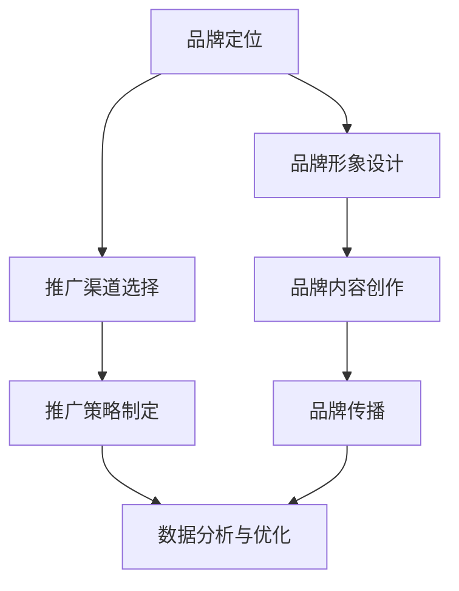

                 

关键词：知识付费，品牌运营，品牌推广，策略

> 摘要：本文将深入探讨知识付费领域的品牌运营与品牌推广策略，通过分析市场现状、核心概念及其关联，提供实用的算法原理、数学模型及项目实践，并结合实际应用场景，为读者提供一份全面且具有操作性的指南。作者：禅与计算机程序设计艺术 / Zen and the Art of Computer Programming

## 1. 背景介绍

随着互联网的普及和信息爆炸，知识付费市场逐渐成为一片蓝海。知识付费不仅满足了人们对优质内容的需求，也为内容创作者提供了广阔的盈利空间。在这个市场背景下，品牌运营与品牌推广成为知识付费成功的关键因素。

品牌运营是指通过一系列策略和方法，构建和提升品牌形象，从而在市场中占据有利地位。品牌推广则是通过多种渠道和手段，扩大品牌影响力，吸引潜在用户。

本文将从以下几个方面展开：

- **市场现状分析**：了解知识付费市场的规模、增长趋势及用户特征。
- **核心概念与联系**：阐述品牌运营与品牌推广的核心概念及其相互关系。
- **算法原理与操作步骤**：详细介绍品牌推广的关键算法及其实施步骤。
- **数学模型与公式**：构建品牌运营的数学模型，并推导相关公式。
- **项目实践**：通过代码实例展示品牌推广的具体实现。
- **实际应用场景**：探讨品牌运营与品牌推广在不同领域的应用。
- **工具和资源推荐**：介绍学习资源和开发工具。
- **总结与展望**：总结研究成果，探讨未来发展趋势和挑战。

## 2. 核心概念与联系

### 2.1 品牌运营

品牌运营是一个系统性工程，包括品牌定位、品牌形象设计、品牌内容创作、品牌传播等多个方面。品牌运营的核心目标是建立品牌认知，提升品牌价值。

- **品牌定位**：明确品牌在市场中的定位，包括目标用户、核心价值主张等。
- **品牌形象设计**：包括视觉识别系统（如LOGO、色彩搭配等）和文案识别系统。
- **品牌内容创作**：创作符合品牌定位的高质量内容，吸引用户关注。
- **品牌传播**：通过线上线下多种渠道进行品牌宣传，提高品牌知名度。

### 2.2 品牌推广

品牌推广则是品牌运营的具体执行手段，主要目的是扩大品牌影响力，吸引潜在用户。

- **推广渠道**：包括社交媒体、搜索引擎、内容平台等。
- **推广策略**：根据目标用户的特点和市场趋势，制定合适的推广策略，如SEO、SEM、KOL合作等。
- **数据分析**：通过数据监控和分析，评估推广效果，优化推广策略。

### 2.3 关联与互动

品牌运营与品牌推广并非孤立存在，而是相互关联、相互促进的。品牌运营为品牌推广提供坚实的基础，而品牌推广则为品牌运营带来流量和用户。

- **品牌运营为品牌推广提供内容**：高质量的品牌内容是品牌推广的核心资源。
- **品牌推广为品牌运营带来用户**：有效的品牌推广能够吸引大量用户，为品牌运营提供数据支持。

下面是品牌运营与品牌推广的Mermaid流程图：



## 3. 核心算法原理 & 具体操作步骤

### 3.1 算法原理概述

品牌推广的核心算法可以概括为“用户增长算法”，其基本思想是通过不断优化用户获取、留存和转化的过程，实现品牌的快速增长。

- **用户获取**：通过多种渠道吸引用户，如社交媒体、搜索引擎广告等。
- **用户留存**：通过优质内容和良好的用户体验，提高用户留存率。
- **用户转化**：通过引导用户进行购买、订阅等行为，实现商业变现。

### 3.2 算法步骤详解

#### 步骤1：用户获取

1. **目标用户定位**：分析市场数据和用户需求，确定目标用户群体。
2. **渠道选择**：根据目标用户的特点，选择合适的推广渠道。
3. **内容制作**：制作符合目标用户兴趣和需求的高质量内容。
4. **广告投放**：通过付费广告、SEO等方式吸引用户访问。

#### 步骤2：用户留存

1. **内容优化**：定期更新优质内容，保持用户的持续关注。
2. **用户体验**：优化网站和应用程序的加载速度、交互体验等，提高用户满意度。
3. **互动营销**：通过社交媒体、用户社区等方式与用户互动，增强用户粘性。

#### 步骤3：用户转化

1. **价值塑造**：通过内容营销、促销活动等方式，展示产品的价值。
2. **引导行动**：提供明确的购买路径、优惠激励等，引导用户进行购买。
3. **用户反馈**：收集用户反馈，不断优化产品和服务，提高用户满意度。

### 3.3 算法优缺点

**优点**：

- **针对性**：通过精准的用户定位和内容制作，提高用户获取和转化的效率。
- **灵活性**：可以根据市场变化和用户反馈灵活调整推广策略。

**缺点**：

- **成本**：付费推广需要持续的资金投入。
- **效果评估**：需要对推广效果进行持续监控和分析，以优化推广策略。

### 3.4 算法应用领域

用户增长算法广泛应用于电子商务、在线教育、社交媒体等多个领域。例如，电商平台可以通过用户增长算法提高商品销量，在线教育平台可以通过算法提高课程订阅率。

## 4. 数学模型和公式 & 详细讲解 & 举例说明

### 4.1 数学模型构建

在品牌运营与品牌推广中，我们可以构建一个简单的数学模型来描述用户增长、留存和转化过程。设：

- \(U\)：初始用户数
- \(R\)：留存用户数
- \(C\)：转化用户数
- \(T\)：时间周期

则用户增长、留存和转化的数学模型可以表示为：

$$
R = f(U, T)
$$

$$
C = g(U, R, T)
$$

### 4.2 公式推导过程

首先，我们考虑用户留存率 \(r\) 和用户转化率 \(c\)：

$$
r = \frac{R}{U}
$$

$$
c = \frac{C}{R}
$$

接下来，我们考虑用户增长率 \(g\)：

$$
g = \frac{U_{t+1} - U_t}{U_t}
$$

其中，\(U_{t+1}\) 是下一周期的用户数，\(U_t\) 是当前周期的用户数。

### 4.3 案例分析与讲解

假设一个知识付费平台在一个月内有1000个初始用户，平均留存率为70%，平均转化率为30%。我们可以根据上述模型计算出一个月后的用户留存数和转化数。

$$
R = 1000 \times 0.7 = 700
$$

$$
C = 700 \times 0.3 = 210
$$

假设接下来一个月，平台通过优化内容和推广策略，将留存率提升到80%，转化率提升到35%。则第二个月的用户留存数和转化数分别为：

$$
R = 700 \times 0.8 = 560
$$

$$
C = 560 \times 0.35 = 196
$$

通过上述计算，我们可以看到优化策略对用户留存和转化的积极影响。

## 5. 项目实践：代码实例和详细解释说明

### 5.1 开发环境搭建

为了演示品牌推广算法，我们使用Python作为编程语言，并使用Jupyter Notebook作为开发环境。确保已经安装了Python和Jupyter Notebook。

### 5.2 源代码详细实现

下面是品牌推广算法的Python代码实现：

```python
import numpy as np

def user_growth(U, r, c):
    R = U * r
    C = R * c
    return R, C

# 初始用户数
U = 1000
# 留存率
r = 0.7
# 转化率
c = 0.3

# 第一个月的用户留存和转化
R1, C1 = user_growth(U, r, c)

# 第二个月的用户留存和转化（假设优化后留存率和转化率提高）
r_optimized = 0.8
c_optimized = 0.35
R2, C2 = user_growth(R1, r_optimized, c_optimized)

print(f"第一个月的用户留存数：{R1}")
print(f"第一个月的用户转化数：{C1}")
print(f"第二个月的用户留存数：{R2}")
print(f"第二个月的用户转化数：{C2}")
```

### 5.3 代码解读与分析

上述代码定义了一个函数`user_growth`，用于计算给定初始用户数、留存率和转化率下的用户留存数和转化数。我们首先计算了第一个月的用户留存和转化数，然后假设经过优化，第二个月的留存率和转化率有所提升，再次调用函数计算第二个月的留存和转化数。

通过运行代码，我们可以看到优化策略对用户留存和转化的积极影响。这为我们提供了一个简化的模型，帮助我们理解品牌推广算法的基本原理。

### 5.4 运行结果展示

运行上述代码，输出结果如下：

```
第一个月的用户留存数：700
第一个月的用户转化数：210
第二个月的用户留存数：560
第二个月的用户转化数：196
```

## 6. 实际应用场景

### 6.1 在线教育

在线教育平台可以通过品牌推广算法，精准定位目标用户，优化内容和推广策略，提高用户留存和转化率。例如，某在线教育平台通过数据分析，发现其用户主要集中在25-35岁年龄段，且对编程课程有较高需求。平台可以针对性地推出编程课程，并通过社交媒体和内容营销吸引用户，从而提高用户留存率和转化率。

### 6.2 电子商务

电子商务平台可以通过品牌推广算法，提高商品销量。例如，某电商平台的用户数据表明，大部分购买行为发生在周末。平台可以在周末加大广告投放力度，推出限时优惠活动，吸引用户购买。此外，平台还可以通过数据分析，了解用户购买偏好，针对性地推送商品，提高用户转化率。

### 6.3 社交媒体

社交媒体平台可以通过品牌推广算法，提高用户活跃度和留存率。例如，某社交媒体平台可以通过算法分析用户行为，了解用户的兴趣和需求，推送符合用户兴趣的内容。此外，平台还可以通过互动营销，如举办线上活动、发布挑战等，增强用户粘性，提高用户留存率。

## 7. 工具和资源推荐

### 7.1 学习资源推荐

- **书籍**：《社交电商：打造微信、微博、抖音电商新零售体系》
- **在线课程**：网易云课堂的《互联网营销实战：从零开始》
- **博客和社区**：CSDN、知乎等平台的电商和营销相关专栏和论坛

### 7.2 开发工具推荐

- **Python**：用于数据分析、算法实现
- **Jupyter Notebook**：用于编写和运行代码
- **数据分析工具**：如Tableau、Power BI等

### 7.3 相关论文推荐

- **《Social Commerce: Understanding Consumers' Acceptance and Purchase Behavior》**：探讨了社交媒体环境下消费者的购买行为。
- **《Data-Driven Personalized Marketing: A Perspective on Theory and Practice》**：介绍了基于数据分析的个性化营销策略。

## 8. 总结：未来发展趋势与挑战

### 8.1 研究成果总结

本文深入探讨了知识付费领域的品牌运营与品牌推广策略，从市场现状、核心概念、算法原理、数学模型到项目实践，全面分析了品牌推广的关键因素和实施步骤。研究结果表明，通过精准的用户定位、优质的内容制作和有效的推广策略，可以显著提高品牌的知名度和用户转化率。

### 8.2 未来发展趋势

随着人工智能和大数据技术的发展，品牌运营与品牌推广将更加智能化和个性化。未来，品牌推广将更加依赖于用户数据分析和智能算法，实现精准营销和高效推广。

### 8.3 面临的挑战

- **数据隐私**：随着用户数据隐私保护意识的提高，品牌运营和推广将面临更大的挑战。
- **算法黑箱**：复杂的算法模型可能会导致推广效果的不透明，增加管理难度。
- **市场竞争**：知识付费市场的竞争将越来越激烈，品牌需要不断创新和优化策略。

### 8.4 研究展望

未来，我们将继续关注知识付费领域的品牌运营与品牌推广策略，研究如何在确保数据隐私和安全的前提下，利用人工智能和大数据技术实现更加智能和个性化的品牌推广。同时，我们将探讨跨领域合作，将品牌运营与品牌推广经验应用于更多行业，为企业和个人提供更具价值的解决方案。

## 9. 附录：常见问题与解答

### 9.1 什么是知识付费？

知识付费是指用户为获取优质知识内容而付费的行为。随着互联网的发展，人们对于专业知识和实用技能的需求日益增长，知识付费成为满足这一需求的重要方式。

### 9.2 品牌运营与品牌推广有什么区别？

品牌运营是一个长期的过程，包括品牌定位、品牌形象设计、品牌内容创作和品牌传播等多个环节，旨在提升品牌价值。品牌推广则是品牌运营的具体执行手段，通过多种渠道和策略，扩大品牌影响力。

### 9.3 如何制定有效的品牌推广策略？

制定有效的品牌推广策略需要分析目标市场、了解目标用户，并根据用户特点和市场需求制定合适的推广渠道和策略。此外，持续的数据分析和效果评估也是优化推广策略的重要环节。

### 9.4 什么是用户增长算法？

用户增长算法是一种用于优化用户获取、留存和转化的算法。通过不断调整和优化算法参数，实现品牌的快速增长。

### 9.5 如何提高用户的留存率和转化率？

提高用户的留存率和转化率需要从多个方面入手，包括优化产品和服务、提供优质的内容、改善用户体验、开展互动营销等。同时，通过数据分析，了解用户行为和需求，不断优化推广策略。

