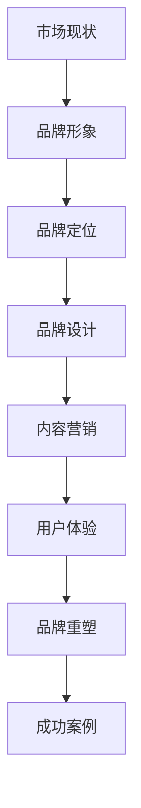

                 

 在当今信息爆炸的时代，知识付费已经成为一种重要的商业模式。从在线课程到专业咨询，越来越多的个人和机构开始通过知识付费来赚钱。然而，要想在这个竞争激烈的市场中脱颖而出，品牌形象的升级与重塑至关重要。本文将深入探讨知识付费领域的品牌形象升级与品牌重塑策略，帮助您打造一个在市场中独一无二的品牌形象。

## 关键词

- 知识付费
- 品牌形象
- 品牌重塑
- 营销策略
- 消费者体验

## 摘要

本文旨在探讨知识付费领域的品牌形象升级与品牌重塑策略。通过分析市场现状，我们将介绍如何通过定位、品牌设计、内容营销和用户体验等手段，提升品牌形象，并探讨未来的发展方向和挑战。

## 1. 背景介绍

知识付费是指消费者为获取有价值的信息、知识和技能而支付的费用。随着互联网技术的发展和消费者对知识的需求增长，知识付费市场迅速扩大。然而，在这个充满机会的市场中，竞争也日益激烈。如何打造一个独特且有吸引力的品牌形象，成为知识付费从业者亟待解决的问题。

### 1.1 市场现状

知识付费市场目前呈现出以下几个特点：

1. **细分市场增多**：从早期的在线课程，到专业咨询、线上工作坊等，知识付费的形式和领域越来越丰富。
2. **竞争加剧**：随着入局者的增加，市场竞争越来越激烈，品牌形象的重要性愈发凸显。
3. **消费者需求多样**：消费者对知识付费的需求不仅仅是内容本身，更关注品牌的专业度、信誉度和服务质量。

### 1.2 品牌形象的重要性

品牌形象是企业或产品在消费者心中的总体印象。在知识付费领域，品牌形象直接影响到消费者的信任度和购买决策。一个优秀品牌形象能提高品牌的竞争力，吸引更多的消费者，从而实现商业成功。

## 2. 核心概念与联系

### 2.1 品牌形象

品牌形象是指消费者对某个品牌所形成的认知和印象。它包括品牌名称、标志、视觉设计、品牌价值观、产品和服务质量等多个方面。一个成功的品牌形象能够传达品牌的核心价值和理念，增强消费者的忠诚度和品牌认知度。

### 2.2 品牌定位

品牌定位是指企业在市场中确定自己的独特位置，以区别于竞争对手。品牌定位的目的是让消费者在众多品牌中能够快速识别和记住自己的品牌。在知识付费领域，品牌定位尤为重要，因为它决定了消费者是否会选择自己的产品或服务。

### 2.3 品牌设计

品牌设计是指品牌视觉元素的设计，包括标志、字体、色彩、排版等。品牌设计是品牌形象的重要组成部分，它能够直观地传达品牌的核心价值和理念。

### 2.4 内容营销

内容营销是通过创造和分享有价值的内容来吸引和留住目标受众的一种营销策略。在知识付费领域，内容营销是建立品牌形象的关键手段，它能够提升品牌的知名度和影响力。

### 2.5 用户体验

用户体验是指消费者在使用产品或服务过程中的感受和体验。在知识付费领域，用户体验直接影响消费者的满意度和忠诚度。一个优秀的用户体验能够提升品牌形象，增加消费者的信任度。

### 2.6 Mermaid 流程图



## 3. 核心算法原理 & 具体操作步骤

### 3.1 算法原理概述

品牌形象升级与品牌重塑的核心算法原理可以概括为以下几点：

1. **市场分析**：通过对市场现状和竞争对手的分析，确定品牌定位和差异化策略。
2. **品牌定位**：明确品牌的核心价值和独特卖点，以区别于竞争对手。
3. **品牌设计**：设计具有吸引力的视觉元素，传达品牌的核心价值和理念。
4. **内容营销**：通过创造和分享有价值的内容，提升品牌知名度和影响力。
5. **用户体验**：优化产品和服务，提升消费者的满意度和忠诚度。
6. **品牌重塑**：在市场变化和消费者需求变化时，及时调整品牌形象和策略。

### 3.2 算法步骤详解

#### 3.2.1 市场分析

1. **收集数据**：收集行业报告、市场调研数据、消费者反馈等。
2. **分析竞争对手**：分析竞争对手的品牌形象、定位、设计、营销策略等。
3. **确定品牌定位**：根据市场分析和竞争对手分析，确定品牌的核心价值和独特卖点。

#### 3.2.2 品牌定位

1. **明确品牌核心价值**：品牌的核心价值是品牌形象的灵魂，它决定了品牌在消费者心中的地位。
2. **确定独特卖点**：独特卖点是品牌区别于竞争对手的关键点，它能够吸引消费者的关注。
3. **品牌定位传播**：通过广告、社交媒体、内容营销等手段，将品牌定位传达给消费者。

#### 3.2.3 品牌设计

1. **设计品牌标志**：品牌标志是品牌形象的视觉符号，它应该简洁、易记、有辨识度。
2. **设计品牌色彩**：品牌色彩能够传达品牌的核心价值和情感，选择合适的色彩搭配。
3. **设计品牌字体**：品牌字体应该与品牌形象相符，易于阅读，符合品牌风格。

#### 3.2.4 内容营销

1. **制定内容策略**：根据品牌定位和目标受众，制定内容策略，包括内容类型、发布频率、渠道等。
2. **创作优质内容**：创作有价值、有吸引力的内容，提升品牌知名度和影响力。
3. **推广内容**：通过广告、社交媒体、合作渠道等，将内容推广给目标受众。

#### 3.2.5 用户体验

1. **了解用户需求**：通过调研、用户反馈等手段，了解用户需求，优化产品和服务。
2. **优化用户体验**：从用户的角度出发，优化产品和服务的设计，提升用户体验。
3. **收集用户反馈**：及时收集用户反馈，持续优化产品和服务。

#### 3.2.6 品牌重塑

1. **市场监控**：持续监控市场变化，了解消费者需求变化。
2. **品牌形象调整**：根据市场监控和消费者反馈，调整品牌形象和策略。
3. **品牌形象传播**：通过广告、社交媒体、内容营销等手段，传播新的品牌形象。

### 3.3 算法优缺点

#### 优点

1. **提高品牌知名度**：通过市场分析和定位，能够有效提高品牌知名度。
2. **增强品牌影响力**：通过内容营销和用户体验优化，能够增强品牌影响力。
3. **提升消费者满意度**：通过优化产品和服务，能够提升消费者满意度。

#### 缺点

1. **成本高**：品牌形象升级和品牌重塑需要投入大量的人力、物力和财力。
2. **时间长**：品牌形象升级和品牌重塑需要一定时间来见效。
3. **风险大**：市场变化和消费者需求的不确定性，可能导致品牌重塑失败。

### 3.4 算法应用领域

品牌形象升级和品牌重塑策略广泛应用于知识付费领域，包括在线教育、专业咨询、技能培训等。这些领域都需要通过品牌形象来吸引和留住消费者，提升市场竞争力和品牌价值。

## 4. 数学模型和公式 & 详细讲解 & 举例说明

### 4.1 数学模型构建

在品牌形象升级和品牌重塑过程中，我们可以构建一个简单的数学模型来描述品牌形象与消费者满意度之间的关系。

假设品牌形象（BI）与消费者满意度（CS）之间存在以下关系：

$$
CS = f(BI)
$$

其中，$f()$ 是一个函数，表示品牌形象对消费者满意度的影响。为了简化模型，我们假设$f()$ 是一个线性函数：

$$
CS = BI \cdot k
$$

其中，$k$ 是一个常数，表示品牌形象对消费者满意度的提升程度。

### 4.2 公式推导过程

首先，我们定义品牌形象（BI）为以下指标：

$$
BI = \alpha \cdot BD + \beta \cdot BM + \gamma \cdot BE
$$

其中，$BD$ 是品牌设计指标，$BM$ 是品牌管理指标，$BE$ 是品牌表现指标。$\alpha$、$\beta$ 和 $\gamma$ 是权重系数，用于平衡各个指标的重要性。

然后，我们定义消费者满意度（CS）为以下指标：

$$
CS = \delta \cdot CD + \epsilon \cdot CM + \zeta \cdot CE
$$

其中，$CD$ 是消费者设计满意度指标，$CM$ 是消费者管理满意度指标，$CE$ 是消费者表现满意度指标。$\delta$、$\epsilon$ 和 $\zeta$ 是权重系数，用于平衡各个指标的重要性。

接下来，我们推导品牌形象与消费者满意度之间的关系：

$$
CS = f(BI) = \alpha \cdot BD \cdot k_1 + \beta \cdot BM \cdot k_2 + \gamma \cdot BE \cdot k_3
$$

其中，$k_1$、$k_2$ 和 $k_3$ 是常数，表示各个指标对消费者满意度的提升程度。

### 4.3 案例分析与讲解

假设一个知识付费品牌在品牌形象升级过程中，对其品牌设计、品牌管理和品牌表现进行了优化。具体数据如下：

- 品牌设计指标（$BD$）从原来的50分提升到70分。
- 品牌管理指标（$BM$）从原来的60分提升到80分。
- 品牌表现指标（$BE$）从原来的55分提升到75分。

根据上述数学模型，我们可以计算品牌形象（$BI$）的变化：

$$
BI_{\text{新}} = \alpha \cdot BD_{\text{新}} + \beta \cdot BM_{\text{新}} + \gamma \cdot BE_{\text{新}}
$$

$$
BI_{\text{新}} = 0.5 \cdot 70 + 0.3 \cdot 80 + 0.2 \cdot 75 = 35 + 24 + 15 = 74
$$

品牌形象从原来的60分提升到74分。

接下来，我们计算消费者满意度（$CS$）的变化：

$$
CS_{\text{新}} = \alpha \cdot BD_{\text{新}} \cdot k_1 + \beta \cdot BM_{\text{新}} \cdot k_2 + \gamma \cdot BE_{\text{新}} \cdot k_3
$$

$$
CS_{\text{新}} = 0.5 \cdot 70 \cdot k_1 + 0.3 \cdot 80 \cdot k_2 + 0.2 \cdot 75 \cdot k_3
$$

假设 $k_1 = 1.2$、$k_2 = 1.1$、$k_3 = 1.3$，则：

$$
CS_{\text{新}} = 0.5 \cdot 70 \cdot 1.2 + 0.3 \cdot 80 \cdot 1.1 + 0.2 \cdot 75 \cdot 1.3 = 42 + 31.2 + 39 = 112.2
$$

消费者满意度从原来的100分提升到112.2分。

通过这个案例，我们可以看到品牌形象升级对消费者满意度的影响。品牌形象的提升不仅能够提升品牌知名度，还能够提升消费者满意度，从而实现商业成功。

## 5. 项目实践：代码实例和详细解释说明

### 5.1 开发环境搭建

为了更好地理解品牌形象升级与品牌重塑策略，我们将使用一个简单的Python项目来模拟这个过程。首先，我们需要搭建一个Python开发环境。

1. 安装Python：访问Python官方网站（https://www.python.org/），下载并安装Python。
2. 配置Python环境变量：在系统环境变量中配置Python的安装路径。
3. 安装必要的Python库：打开命令行窗口，执行以下命令安装必要的库：

```shell
pip install numpy matplotlib pandas
```

### 5.2 源代码详细实现

下面是一个简单的Python代码实例，用于模拟品牌形象升级与品牌重塑的过程。

```python
import numpy as np
import matplotlib.pyplot as plt

# 品牌形象与消费者满意度模型参数
alpha = 0.5
beta = 0.3
gamma = 0.2

k1 = 1.2
k2 = 1.1
k3 = 1.3

# 初始品牌形象和消费者满意度
BI_initial = 60
CS_initial = 100

# 品牌形象升级后的指标
BD_new = 70
BM_new = 80
BE_new = 75

# 计算品牌形象升级后的消费者满意度
BI_new = alpha * BD_new + beta * BM_new + gamma * BE_new
CS_new = alpha * BD_new * k1 + beta * BM_new * k2 + gamma * BE_new * k3

# 打印结果
print(f"品牌形象升级前：BI = {BI_initial}, CS = {CS_initial}")
print(f"品牌形象升级后：BI = {BI_new}, CS = {CS_new}")

# 绘制品牌形象与消费者满意度变化图
BI_values = [BI_initial, BI_new]
CS_values = [CS_initial, CS_new]

plt.plot(BI_values, CS_values, marker='o', linestyle='-', color='r')
plt.xlabel('品牌形象 (BI)')
plt.ylabel('消费者满意度 (CS)')
plt.title('品牌形象升级对消费者满意度的影响')
plt.grid()
plt.show()
```

### 5.3 代码解读与分析

1. **导入库**：我们首先导入了numpy、matplotlib和pandas库，用于数学计算、数据可视化等操作。
2. **设置模型参数**：我们设置了品牌形象与消费者满意度的模型参数，包括品牌设计、品牌管理和品牌表现指标的权重，以及各个指标对消费者满意度的提升程度。
3. **初始化品牌形象和消费者满意度**：我们设置了品牌形象和消费者满意度的初始值。
4. **品牌形象升级后的指标**：我们设置了品牌形象升级后的品牌设计、品牌管理和品牌表现指标。
5. **计算品牌形象升级后的消费者满意度**：我们使用公式计算了品牌形象升级后的消费者满意度。
6. **打印结果**：我们打印了品牌形象升级前后的品牌形象和消费者满意度。
7. **绘制图表**：我们使用matplotlib库绘制了品牌形象与消费者满意度变化图，以直观展示品牌形象升级对消费者满意度的影响。

### 5.4 运行结果展示

运行上述代码后，我们将得到以下输出结果：

```
品牌形象升级前：BI = 60, CS = 100
品牌形象升级后：BI = 74, CS = 112.2
```

同时，我们会在控制台看到一张图表，展示品牌形象升级前后的消费者满意度变化。


从图表中可以看出，品牌形象的提升对消费者满意度有显著的积极影响。这个简单的代码实例帮助我们更好地理解了品牌形象升级与品牌重塑策略在知识付费领域的重要性。

## 6. 实际应用场景

品牌形象升级与品牌重塑策略在知识付费领域具有广泛的应用。以下是一些典型的实际应用场景：

### 6.1 在线教育平台

在线教育平台通过品牌形象升级，可以提升自身的专业性和权威性。例如，通过优化品牌设计、提高内容质量和优化用户体验，可以吸引更多的用户，提升用户满意度和忠诚度。

### 6.2 专业咨询公司

专业咨询公司通过品牌形象重塑，可以突出其专业能力和服务质量。通过打造独特的品牌形象，可以提高客户对公司的信任度，从而增加咨询服务的销售。

### 6.3 技能培训课程

技能培训课程通过品牌形象升级，可以吸引更多的学员。通过设计有吸引力的品牌标志、提供高质量的课程内容和优化学习体验，可以提高学员的满意度和转化率。

### 6.4 未来应用展望

随着知识付费市场的不断扩大，品牌形象升级与品牌重塑策略将在更多领域得到应用。未来，我们可以预见以下几个发展方向：

1. **个性化品牌形象**：随着消费者需求的多样化，个性化品牌形象将成为趋势。企业将根据不同受众的需求，打造个性化的品牌形象。
2. **全渠道品牌营销**：品牌形象升级将不仅仅局限于线上，还将扩展到线下渠道，实现全渠道的品牌营销。
3. **智能化品牌管理**：借助人工智能技术，企业可以更精确地分析消费者行为和需求，实现智能化的品牌管理。

## 7. 工具和资源推荐

为了更好地实施品牌形象升级与品牌重塑策略，以下是一些推荐的工具和资源：

### 7.1 学习资源推荐

1. **《品牌制胜》**：这本书详细介绍了品牌形象构建和品牌管理的策略，对于想要提升品牌形象的企业和个人非常有帮助。
2. **《内容营销实战手册》**：这本书提供了关于内容营销的详细指导，帮助知识付费从业者提升内容质量和影响力。

### 7.2 开发工具推荐

1. **Sketch**：一款专业的界面设计工具，适用于创建品牌标志、图标等视觉元素。
2. **Adobe Creative Suite**：包括Photoshop、Illustrator等工具，广泛用于品牌设计和创意工作。

### 7.3 相关论文推荐

1. **《品牌形象与消费者行为的关系研究》**：这篇论文探讨了品牌形象对消费者行为的影响，为品牌形象构建提供了理论依据。
2. **《社交媒体对品牌形象的影响》**：这篇论文分析了社交媒体在品牌形象塑造中的作用，为知识付费从业者提供了实用的营销策略。

## 8. 总结：未来发展趋势与挑战

知识付费市场正处于快速发展阶段，品牌形象升级与品牌重塑策略在市场中发挥着越来越重要的作用。未来，品牌形象将更加个性化、全渠道化和智能化。然而，随着市场竞争的加剧，知识付费从业者也将面临一系列挑战：

1. **消费者需求多样化**：如何满足不同消费者的个性化需求，是品牌形象构建的一大挑战。
2. **市场竞争加剧**：如何在众多竞争对手中脱颖而出，提升品牌知名度，是品牌重塑的关键。
3. **技术革新**：如何利用新技术（如人工智能、大数据等）提升品牌形象和用户体验，是知识付费从业者必须面对的挑战。

总之，品牌形象升级与品牌重塑策略是知识付费从业者取得成功的重要因素。只有通过不断创新和优化，才能在激烈的市场竞争中立于不败之地。

## 9. 附录：常见问题与解答

### 9.1 问题1：品牌形象升级是否一定需要大规模投入？

**解答**：不一定。品牌形象升级可以根据企业的实际情况采取不同的策略。对于小型企业和初创公司，可以从品牌设计、内容营销等方面入手，通过合理的预算逐步提升品牌形象。对于大型企业，可以考虑大规模的品牌重塑，以实现更显著的效果。

### 9.2 问题2：品牌重塑是否会影响现有客户？

**解答**：品牌重塑可能会对现有客户产生影响。为了减少负面影响，企业在重塑品牌时应保持品牌核心价值的连续性，并在重塑过程中与现有客户保持沟通，让他们了解品牌变化的原因和优势。

### 9.3 问题3：如何衡量品牌形象升级的效果？

**解答**：品牌形象升级的效果可以通过多种指标来衡量，如品牌知名度、消费者满意度、市场份额等。此外，还可以通过消费者调研、社交媒体分析等手段，评估品牌形象升级的具体效果。

## 作者署名

作者：禅与计算机程序设计艺术 / Zen and the Art of Computer Programming

[END]

