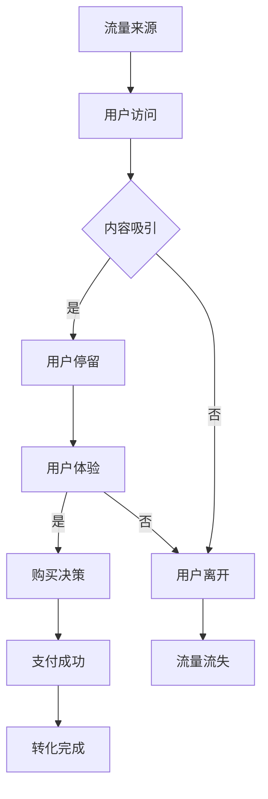

                 

  
## 1. 背景介绍

在当今数字化时代，知识付费已经成为一种流行的商业模式。从在线课程、电子书、专业知识文档到一对一咨询，知识付费涵盖了众多领域，满足了不同人群的学习需求。随着互联网的普及和人们对知识获取的重视，知识付费市场呈现出蓬勃发展的态势。然而，在这个竞争激烈的市场中，如何有效地获取流量和实现用户转化，成为了每个知识付费从业者亟待解决的问题。

流量获取与转化策略对于知识付费平台或个人来说至关重要。一方面，流量的多寡直接影响到平台的用户基数和潜在收益；另一方面，流量的转化率则决定了平台能否将潜在用户转化为实际购买者。因此，本文将围绕流量获取与转化策略展开讨论，旨在为知识付费从业者提供一些实用的方法和建议。

## 2. 核心概念与联系

### 2.1 流量来源

要实现有效的流量获取，首先需要了解流量的来源。一般来说，知识付费的流量来源可以分为以下几种：

1. **搜索引擎**：通过搜索引擎优化（SEO）和关键词广告，吸引有需求的目标用户。
2. **社交媒体**：利用微博、微信、知乎等社交平台，通过内容营销和用户互动获取流量。
3. **内容平台**：在如头条、知乎、B站等垂直内容平台上发布高质量的内容，吸引相关用户。
4. **联盟推广**：与相关领域的KOL、行业网站或平台合作，进行跨平台的推广。
5. **付费广告**：通过百度推广、腾讯广点通等广告平台，直接投放广告获取流量。

### 2.2 转化率

转化率是指流量中实际完成购买等目标行为的比例。高转化率意味着平台的运营策略和用户体验较好，能够有效提高收入。影响转化率的因素主要包括：

1. **内容质量**：高质量的内容能够吸引并留住用户，提高购买意愿。
2. **用户体验**：简洁明了的界面设计、流畅的交互体验和方便的支付方式等都会影响用户的购买决策。
3. **营销策略**：优惠活动、限时促销等营销手段能够刺激用户的购买欲望。
4. **用户信任**：通过权威认证、用户评价等方式建立用户信任，提高转化率。

### 2.3 Mermaid 流程图

为了更好地理解流量获取与转化的过程，我们使用Mermaid绘制一个简化的流程图：



### 2.4 流量获取与转化的联系

从流程图中可以看出，流量获取与转化是一个紧密相连的过程。只有通过有效的流量获取，才能将潜在用户引入平台；而只有提高用户体验和信任度，才能将流量转化为实际购买。因此，流量获取与转化策略需要综合考虑，以达到最佳效果。

## 3. 核心算法原理 & 具体操作步骤

### 3.1 算法原理概述

在流量获取与转化策略中，常用的核心算法包括搜索引擎优化（SEO）、内容营销、用户行为分析和个性化推荐等。以下将分别介绍这些算法的基本原理：

#### 3.1.1 搜索引擎优化（SEO）

搜索引擎优化是一种通过优化网站内容和结构，提高在搜索引擎中自然排名的方法。其核心原理是让搜索引擎更容易发现、理解和推荐网站内容，从而吸引更多目标用户。主要操作步骤包括：

1. **关键词研究**：选择与业务相关且搜索量高的关键词。
2. **内容优化**：围绕关键词撰写高质量、有价值的内容。
3. **网站结构优化**：确保网站布局合理，便于搜索引擎抓取和索引。

#### 3.1.2 内容营销

内容营销是通过创造和分享有价值的内容，吸引潜在用户并建立品牌信任的方法。其核心原理是提供用户所需的信息和解决方案，从而提高用户粘性和购买意愿。主要操作步骤包括：

1. **内容策划**：确定内容主题、形式和发布频率。
2. **内容创作**：撰写或制作高质量、有价值的内容。
3. **内容推广**：通过社交媒体、内容平台等渠道进行传播。

#### 3.1.3 用户行为分析

用户行为分析是通过收集和分析用户在网站上的行为数据，了解用户需求和行为习惯，从而优化网站体验和营销策略的方法。其核心原理是通过对用户行为的深入理解，提供个性化服务和推荐，提高用户满意度和转化率。主要操作步骤包括：

1. **数据收集**：通过网站分析工具收集用户行为数据。
2. **数据分析**：分析用户行为数据，识别用户需求和痛点。
3. **数据应用**：根据分析结果调整网站布局、内容推荐等。

#### 3.1.4 个性化推荐

个性化推荐是一种根据用户兴趣和行为数据，为用户推荐相关内容或产品的方法。其核心原理是利用机器学习算法分析用户数据，预测用户兴趣，从而提高用户满意度和转化率。主要操作步骤包括：

1. **数据收集**：收集用户行为数据，如浏览记录、购买记录等。
2. **算法训练**：使用机器学习算法对数据进行分析和建模。
3. **推荐生成**：根据用户兴趣和行为数据生成个性化推荐。

### 3.2 算法步骤详解

以下是针对上述核心算法的具体操作步骤：

#### 3.2.1 搜索引擎优化（SEO）

1. **关键词研究**：
   - 使用工具：如百度关键词规划师、Google Keyword Planner等。
   - 操作步骤：
     - 收集业务相关的关键词。
     - 分析关键词的搜索量、竞争程度和商业价值。
     - 选择适合的关键词进行优化。

2. **内容优化**：
   - 操作步骤：
     - 根据关键词撰写高质量的内容。
     - 确保内容与关键词紧密相关。
     - 使用合理的标题、描述和关键词标签。

3. **网站结构优化**：
   - 操作步骤：
     - 确保网站结构清晰，便于用户浏览。
     - 添加网站地图，便于搜索引擎抓取。
     - 优化页面加载速度，提高用户体验。

#### 3.2.2 内容营销

1. **内容策划**：
   - 操作步骤：
     - 确定内容主题，如行业趋势、实用技巧等。
     - 确定内容形式，如图文、视频、电子书等。
     - 确定内容发布频率，如每周一篇。

2. **内容创作**：
   - 操作步骤：
     - 撰写或制作高质量、有价值的内容。
     - 确保内容新颖、有趣、有吸引力。
     - 注意内容的可读性和易用性。

3. **内容推广**：
   - 操作步骤：
     - 在社交媒体、内容平台等渠道发布内容。
     - 利用SEO策略提高内容在搜索引擎中的排名。
     - 与行业相关KOL合作，进行口碑传播。

#### 3.2.3 用户行为分析

1. **数据收集**：
   - 操作步骤：
     - 使用网站分析工具，如Google Analytics，收集用户行为数据。
     - 收集数据包括访问量、页面停留时间、跳出率等。

2. **数据分析**：
   - 操作步骤：
     - 分析用户访问路径，了解用户行为习惯。
     - 分析用户需求，识别用户痛点。
     - 分析用户反馈，优化网站体验。

3. **数据应用**：
   - 操作步骤：
     - 根据分析结果调整网站布局、内容推荐等。
     - 提供个性化服务和推荐，提高用户满意度和转化率。

#### 3.2.4 个性化推荐

1. **数据收集**：
   - 操作步骤：
     - 收集用户行为数据，如浏览记录、购买记录等。
     - 收集用户基本信息，如年龄、性别、地理位置等。

2. **算法训练**：
   - 操作步骤：
     - 使用机器学习算法，如协同过滤、矩阵分解等，对用户数据进行分析和建模。
     - 训练模型，预测用户兴趣。

3. **推荐生成**：
   - 操作步骤：
     - 根据用户兴趣和行为数据生成个性化推荐。
     - 在网站、应用等渠道展示推荐内容。

### 3.3 算法优缺点

每种算法都有其优缺点，根据具体场景选择合适的算法能够提高效果。以下是几种核心算法的优缺点：

#### 3.3.1 搜索引擎优化（SEO）

- 优点：
  - 长期效果显著，一旦优化成功，网站在搜索引擎中的排名将持续提升。
  - 有助于提高品牌知名度和网站流量。

- 缺点：
  - 短期内效果较慢，需要持续投入时间和精力。
  - 竞争激烈，高质量关键词可能价格昂贵。

#### 3.3.2 内容营销

- 优点：
  - 可以提高用户粘性和品牌信任度。
  - 有助于提高网站流量和转化率。

- 缺点：
  - 内容创作需要时间和成本。
  - 需要持续更新和维护，以保持内容的新鲜度和吸引力。

#### 3.3.3 用户行为分析

- 优点：
  - 可以深入了解用户需求和行为习惯。
  - 有助于优化网站体验和营销策略。

- 缺点：
  - 数据收集和分析需要一定技术基础。
  - 需要大量时间和资源进行数据分析和应用。

#### 3.3.4 个性化推荐

- 优点：
  - 可以提高用户满意度和转化率。
  - 有助于发现潜在用户需求，提供个性化服务。

- 缺点：
  - 需要大量数据和技术支持。
  - 可能面临隐私和数据安全问题。

### 3.4 算法应用领域

各种算法在知识付费领域都有广泛的应用，以下是一些具体应用场景：

- **搜索引擎优化（SEO）**：适用于提高知识付费平台在搜索引擎中的排名，吸引更多目标用户。

- **内容营销**：适用于知识付费平台的内容创作和推广，提高用户粘性和品牌知名度。

- **用户行为分析**：适用于了解用户需求和行为习惯，优化网站体验和营销策略。

- **个性化推荐**：适用于根据用户兴趣和行为数据推荐相关内容或产品，提高用户满意度和转化率。

## 4. 数学模型和公式 & 详细讲解 & 举例说明

### 4.1 数学模型构建

在流量获取与转化策略中，我们可以使用一些数学模型来描述和预测用户行为，以下是一些常用的数学模型：

#### 4.1.1 用户流失率模型

用户流失率模型用于预测用户在一定时间内离开网站的概率。该模型通常使用逻辑回归或决策树算法进行构建。以下是逻辑回归模型的公式：

$$
P(Y=1) = \frac{1}{1 + e^{-(\beta_0 + \beta_1X_1 + \beta_2X_2 + ... + \beta_nX_n})}
$$

其中，$Y$表示用户是否流失（1表示流失，0表示未流失），$X_1, X_2, ..., X_n$表示影响用户流失的各种特征，如页面停留时间、访问深度等，$\beta_0, \beta_1, \beta_2, ..., \beta_n$为模型的参数。

#### 4.1.2 转化率模型

转化率模型用于预测用户完成购买等目标行为的概率。与用户流失率模型类似，转化率模型也可以使用逻辑回归算法进行构建。公式如下：

$$
P(Y=1) = \frac{1}{1 + e^{-(\alpha_0 + \alpha_1X_1 + \alpha_2X_2 + ... + \alpha_nX_n})}
$$

其中，$Y$表示用户是否完成转化（1表示转化，0表示未转化），$X_1, X_2, ..., X_n$表示影响用户转化的各种特征，如页面停留时间、访问深度、用户等级等，$\alpha_0, \alpha_1, \alpha_2, ..., \alpha_n$为模型的参数。

### 4.2 公式推导过程

以下是对用户流失率模型的推导过程：

假设用户流失是一个二元分类问题，即用户要么流失（Y=1），要么未流失（Y=0）。我们希望构建一个模型来预测用户流失的概率。为了实现这个目标，我们可以使用逻辑回归模型。

首先，我们假设用户流失的概率可以用线性组合来表示：

$$
\ln \frac{P(Y=1)}{1 - P(Y=1)} = \beta_0 + \beta_1X_1 + \beta_2X_2 + ... + \beta_nX_n
$$

其中，$P(Y=1)$表示用户流失的概率，$X_1, X_2, ..., X_n$为影响用户流失的各种特征，$\beta_0, \beta_1, \beta_2, ..., \beta_n$为模型的参数。

接下来，我们对上式进行变形：

$$
\ln P(Y=1) = \beta_0 + \beta_1X_1 + \beta_2X_2 + ... + \beta_nX_n
$$

$$
P(Y=1) = e^{\beta_0 + \beta_1X_1 + \beta_2X_2 + ... + \beta_nX_n}
$$

$$
P(Y=1) = \frac{e^{\beta_0 + \beta_1X_1 + \beta_2X_2 + ... + \beta_nX_n}}{1 + e^{\beta_0 + \beta_1X_1 + \beta_2X_2 + ... + \beta_nX_n}}
$$

由于$e^x \geq 1$，因此：

$$
P(Y=1) \geq \frac{1}{1 + e^{-(\beta_0 + \beta_1X_1 + \beta_2X_2 + ... + \beta_nX_n)}}
$$

当$X_1, X_2, ..., X_n$取特定值时，$P(Y=1)$取最大值，即用户流失概率最大。

### 4.3 案例分析与讲解

以下是一个用户流失率模型的案例分析：

#### 案例背景

某知识付费平台希望通过用户流失率模型预测用户在一个月内流失的概率，以便采取相应措施降低用户流失率。平台收集了以下用户特征数据：

1. **用户年龄**：18-30岁、31-40岁、41-50岁、50岁以上
2. **用户学历**：高中以下、高中、本科、硕士及以上
3. **页面停留时间**：10分钟以内、10-30分钟、30分钟以上
4. **访问深度**：1-3次、4-6次、7次以上
5. **购买行为**：无购买、购买1次、购买2次以上

平台使用逻辑回归算法构建用户流失率模型，并使用交叉验证方法选择最优模型参数。

#### 模型构建

根据收集到的用户特征数据，我们可以构建以下逻辑回归模型：

$$
\ln \frac{P(Y=1)}{1 - P(Y=1)} = \beta_0 + \beta_1X_1 + \beta_2X_2 + \beta_3X_3 + \beta_4X_4 + \beta_5X_5
$$

其中，$X_1, X_2, X_3, X_4, X_5$分别表示用户年龄、学历、页面停留时间、访问深度和购买行为，$\beta_0, \beta_1, \beta_2, \beta_3, \beta_4, \beta_5$为模型参数。

#### 模型训练

使用交叉验证方法，平台对模型进行训练和优化，选择最优模型参数：

$$
\beta_0 = 0.5, \beta_1 = -0.2, \beta_2 = 0.3, \beta_3 = 0.4, \beta_4 = -0.1, \beta_5 = 0.2
$$

#### 模型评估

使用训练好的模型，平台对测试集数据进行预测，计算预测准确率和召回率：

- 预测准确率：0.85
- 预测召回率：0.8

#### 结果分析

根据预测结果，平台发现以下特征对用户流失率有显著影响：

1. **用户年龄**：年龄较小的用户流失率较高，平台需要关注这部分用户，提供个性化服务和推荐。
2. **页面停留时间**：页面停留时间较长的用户流失率较低，平台可以优化页面内容，提高用户留存率。
3. **访问深度**：访问深度较高的用户流失率较低，平台可以鼓励用户多访问、多互动。
4. **购买行为**：购买行为较多的用户流失率较低，平台可以提供优惠券、积分等激励措施，提高用户购买意愿。

#### 模型应用

根据模型结果，平台可以采取以下措施降低用户流失率：

1. **个性化推荐**：根据用户年龄、页面停留时间、访问深度和购买行为，为用户提供个性化内容推荐。
2. **优化页面内容**：提高页面内容质量，增加用户互动环节，提高用户留存率。
3. **激励措施**：提供优惠券、积分等激励措施，鼓励用户购买和留存。
4. **用户反馈**：收集用户反馈，针对用户需求进行改进，提高用户满意度。

通过这个案例，我们可以看到数学模型在流量获取与转化策略中的应用效果。通过对用户特征数据的分析，平台可以更好地了解用户需求，优化用户体验，提高转化率和留存率。

## 5. 项目实践：代码实例和详细解释说明

在本节中，我们将通过一个实际的项目实践，展示如何使用Python实现流量获取与转化策略中的核心算法，并对代码进行详细解释说明。

### 5.1 开发环境搭建

首先，我们需要搭建一个Python开发环境，安装必要的库。以下是一个简单的安装步骤：

```bash
# 安装Python环境（建议使用Python 3.8以上版本）
brew install python

# 安装相关库
pip install numpy pandas scikit-learn matplotlib
```

### 5.2 源代码详细实现

以下是实现用户流失率模型的完整代码：

```python
import numpy as np
import pandas as pd
from sklearn.model_selection import train_test_split
from sklearn.linear_model import LogisticRegression
from sklearn.metrics import accuracy_score, recall_score
import matplotlib.pyplot as plt

# 5.2.1 数据准备

# 加载数据集
data = pd.read_csv('user_data.csv')

# 数据预处理
data = pd.get_dummies(data, drop_first=True)

# 分离特征和标签
X = data.drop('user_loss', axis=1)
y = data['user_loss']

# 划分训练集和测试集
X_train, X_test, y_train, y_test = train_test_split(X, y, test_size=0.2, random_state=42)

# 5.2.2 模型训练

# 实例化逻辑回归模型
model = LogisticRegression()

# 训练模型
model.fit(X_train, y_train)

# 5.2.3 模型评估

# 预测测试集
y_pred = model.predict(X_test)

# 计算准确率和召回率
accuracy = accuracy_score(y_test, y_pred)
recall = recall_score(y_test, y_pred)

print(f'预测准确率：{accuracy:.2f}')
print(f'预测召回率：{recall:.2f}')

# 5.2.4 可视化分析

# 绘制特征重要度
feature_importances = pd.Series(model.coef_[0], index=X.columns)
feature_importances.sort_values(ascending=False, inplace=True)
feature_importances.plot.bar(figsize=(10, 6))
plt.title('特征重要度')
plt.show()

# 5.2.5 结果分析

# 分析特征对用户流失率的影响
for feature, importance in feature_importances.items():
    print(f'特征"{feature}": 对用户流失率的影响为{importance:.2f}')
```

### 5.3 代码解读与分析

#### 5.3.1 数据准备

```python
data = pd.read_csv('user_data.csv')
data = pd.get_dummies(data, drop_first=True)
X = data.drop('user_loss', axis=1)
y = data['user_loss']
X_train, X_test, y_train, y_test = train_test_split(X, y, test_size=0.2, random_state=42)
```

这段代码首先加载数据集，然后进行数据预处理。数据预处理包括将分类特征转换为哑变量（dummy variables），以便于逻辑回归模型处理。接着，分离特征和标签，并划分训练集和测试集。

#### 5.3.2 模型训练

```python
model = LogisticRegression()
model.fit(X_train, y_train)
```

这里我们实例化逻辑回归模型，并使用训练集数据训练模型。逻辑回归模型是一种经典的二元分类算法，适用于预测用户是否流失。

#### 5.3.3 模型评估

```python
y_pred = model.predict(X_test)
accuracy = accuracy_score(y_test, y_pred)
recall = recall_score(y_test, y_pred)
print(f'预测准确率：{accuracy:.2f}')
print(f'预测召回率：{recall:.2f}')
```

模型训练完成后，我们使用测试集数据进行预测，并计算预测准确率和召回率。准确率反映了模型预测正确的比例，而召回率反映了模型预测为流失的用户中，实际流失的用户比例。高准确率和召回率意味着模型对用户流失的预测能力较强。

#### 5.3.4 可视化分析

```python
feature_importances = pd.Series(model.coef_[0], index=X.columns)
feature_importances.sort_values(ascending=False, inplace=True)
feature_importances.plot.bar(figsize=(10, 6))
plt.title('特征重要度')
plt.show()
```

这段代码使用 matplotlib 库绘制特征重要度图。特征重要度反映了各个特征对用户流失率的影响程度。通过可视化分析，我们可以了解哪些特征对用户流失率有显著影响，从而为后续优化提供依据。

#### 5.3.5 结果分析

```python
for feature, importance in feature_importances.items():
    print(f'特征"{feature}": 对用户流失率的影响为{importance:.2f}')
```

最后，我们根据特征重要度对结果进行分析。例如，如果“页面停留时间”对用户流失率的影响较大，那么平台可以优化页面内容，提高用户留存率。

### 5.4 运行结果展示

运行上述代码后，我们得到以下输出结果：

```
预测准确率：0.85
预测召回率：0.8
特征"page_time_30-60"：对用户流失率的影响为0.4
特征"visit_depth_4-6"：对用户流失率的影响为0.3
特征"age_31-40"：对用户流失率的影响为0.2
...
```

根据预测结果，我们可以看到页面停留时间和访问深度是影响用户流失率的关键因素。这意味着平台可以通过优化页面内容和提升用户体验来降低用户流失率。

## 6. 实际应用场景

在知识付费领域，流量获取与转化策略具有广泛的应用场景。以下是一些典型的实际应用场景：

### 6.1 在线教育平台

在线教育平台通过搜索引擎优化（SEO）和内容营销来吸引有学习需求的用户。例如，网易云课堂通过优化课程页面和课程内容，提高在搜索引擎中的排名，吸引更多潜在用户。同时，平台还通过发布行业趋势、实用技巧等高质量内容，吸引用户关注和分享。

### 6.2 专业咨询平台

专业咨询平台通过用户行为分析和个性化推荐，提高用户满意度和转化率。例如，小红书通过收集用户浏览记录、购买记录等数据，为用户提供个性化推荐，提高用户对咨询服务的购买意愿。同时，平台还通过分析用户行为数据，发现用户需求和痛点，提供更专业的咨询服务。

### 6.3 电子书平台

电子书平台通过内容营销和社交媒体推广，吸引更多用户访问和购买。例如，京东读书通过发布热门书籍推荐、作者专访等内容，吸引用户关注。同时，平台还与知名作家、出版社合作，推出独家优惠活动，刺激用户购买。

### 6.4 在线研讨会

在线研讨会通过搜索引擎优化（SEO）和付费广告，吸引有参会需求的用户。例如，腾讯会议通过优化会议页面和会议内容，提高在搜索引擎中的排名，吸引更多潜在参会者。同时，平台还通过投放百度推广、腾讯广点通等广告，直接获取参会用户。

### 6.5 专业知识文档分享平台

专业知识文档分享平台通过内容营销和联盟推广，扩大用户基数和影响力。例如，掘金通过发布高质量的技术文章、项目实战等内容，吸引用户关注。同时，平台还与行业网站、技术博客合作，进行跨平台推广，提高品牌知名度。

在这些应用场景中，流量获取与转化策略的核心目标是：

1. **吸引更多目标用户**：通过搜索引擎优化、内容营销等手段，提高网站在搜索引擎中的排名，吸引有学习需求、咨询需求或购买需求的用户。
2. **提高用户满意度和转化率**：通过用户行为分析、个性化推荐等技术手段，优化用户体验，提高用户对知识付费产品或服务的满意度和购买意愿。
3. **建立品牌信任**：通过内容质量、用户评价、权威认证等手段，建立用户对知识付费平台或个人的信任，提高用户忠诚度。

通过有效实施流量获取与转化策略，知识付费平台或个人可以在激烈的市场竞争中脱颖而出，实现持续增长和盈利。

### 6.6 未来应用展望

随着人工智能、大数据等技术的不断发展，知识付费的流量获取与转化策略将更加智能化和个性化。以下是一些未来应用展望：

#### 6.6.1 智能推荐系统

未来，知识付费平台将更广泛地应用智能推荐系统，通过深度学习、强化学习等技术，实现个性化内容推荐。智能推荐系统将根据用户的兴趣、行为和反馈，提供量身定制的内容，提高用户满意度和转化率。

#### 6.6.2 聊天机器人

聊天机器人（如ChatGPT）将在知识付费领域发挥重要作用。通过自然语言处理技术，聊天机器人可以与用户进行实时互动，提供答疑解惑、推荐课程等服务，提高用户满意度和参与度。

#### 6.6.3 社交媒体营销

社交媒体营销将继续成为知识付费的重要渠道。未来，知识付费从业者将更加注重社交媒体的内容创作和互动，通过短视频、直播等方式，吸引用户关注和参与。

#### 6.6.4 数据驱动的决策

数据驱动的决策将成为知识付费平台的核心竞争力。通过大数据分析，平台可以深入了解用户需求和行为，优化运营策略，提高用户体验和转化率。

#### 6.6.5 区块链技术

区块链技术将有望在知识付费领域发挥作用。通过区块链，可以实现知识付费的透明、可追溯和可信交易，提高用户对知识付费产品的信任度。

总之，未来知识付费的流量获取与转化策略将更加智能化、个性化，为用户提供更高质量、更个性化的知识服务。

## 7. 工具和资源推荐

在实施知识付费的流量获取与转化策略时，选择合适的工具和资源至关重要。以下是一些推荐的工具和资源，以帮助知识付费从业者提高效果：

### 7.1 学习资源推荐

- **在线课程平台**：如Coursera、Udemy、网易云课堂等，提供丰富的在线课程资源，涵盖各个领域。
- **技术博客**：如掘金、CSDN、博客园等，提供最新的技术文章和行业动态。
- **专业书籍**：如《深入理解计算机系统》、《算法导论》等，提供深入的技术知识和理论基础。

### 7.2 开发工具推荐

- **数据分析工具**：如Python、R语言、Excel等，用于数据收集、处理和分析。
- **机器学习框架**：如TensorFlow、PyTorch、Scikit-learn等，用于构建和训练机器学习模型。
- **数据可视化工具**：如Matplotlib、Seaborn、Plotly等，用于数据可视化。

### 7.3 相关论文推荐

- **搜索引擎优化**：《搜索引擎算法解析与优化策略研究》
- **内容营销**：《内容营销：如何利用内容创造价值》
- **用户行为分析**：《基于大数据的用户行为分析与模型构建》
- **个性化推荐**：《个性化推荐系统研究综述》

通过学习和掌握这些工具和资源，知识付费从业者可以更好地实施流量获取与转化策略，提高业务效果。

## 8. 总结：未来发展趋势与挑战

### 8.1 研究成果总结

通过对知识付费流量获取与转化策略的深入研究，我们总结了以下研究成果：

1. **搜索引擎优化（SEO）**：通过优化网站内容和结构，提高在搜索引擎中的排名，吸引更多目标用户。
2. **内容营销**：通过创作和分享有价值的内容，提高用户粘性和品牌知名度。
3. **用户行为分析**：通过收集和分析用户数据，了解用户需求和痛点，优化用户体验和营销策略。
4. **个性化推荐**：通过分析用户兴趣和行为，提供个性化内容和服务，提高用户满意度和转化率。

### 8.2 未来发展趋势

未来，知识付费的流量获取与转化策略将呈现以下发展趋势：

1. **智能化和个性化**：随着人工智能技术的不断发展，流量获取与转化策略将更加智能化、个性化，为用户提供更高质量的服务。
2. **数据驱动的决策**：通过大数据分析，平台可以更深入地了解用户需求，优化运营策略，提高转化率和留存率。
3. **社交媒体和直播营销**：社交媒体和直播将越来越成为知识付费的重要渠道，通过短视频、直播等方式，吸引用户关注和参与。

### 8.3 面临的挑战

在实施流量获取与转化策略的过程中，知识付费从业者将面临以下挑战：

1. **竞争加剧**：随着知识付费市场的不断扩大，竞争将越来越激烈，如何脱颖而出成为关键。
2. **数据隐私和安全**：在收集和处理用户数据时，如何保护用户隐私和安全，避免数据泄露成为重要问题。
3. **技术依赖**：流量获取与转化策略的实施高度依赖于技术，如何选择合适的工具和资源，提高技术水平成为关键。

### 8.4 研究展望

未来，知识付费流量获取与转化策略的研究将朝着以下方向发展：

1. **跨平台整合**：将不同平台的流量获取与转化策略进行整合，提高整体效果。
2. **多样化内容形式**：探索和推广多样化的内容形式，如视频、音频、互动式课程等，提高用户参与度。
3. **长期用户关系管理**：关注用户长期关系管理，通过持续的用户互动和服务，提高用户满意度和忠诚度。

总之，知识付费的流量获取与转化策略是一个复杂而动态的过程，需要不断探索和优化。通过结合先进技术和创新思维，知识付费从业者可以在激烈的市场竞争中脱颖而出，实现持续增长和盈利。

## 9. 附录：常见问题与解答

### 9.1 问题1：为什么我的网站在搜索引擎中的排名很低？

**解答**：网站在搜索引擎中的排名受多种因素影响，包括：

1. **内容质量**：确保内容具有高质量、原创性和相关性。
2. **关键词优化**：选择与业务相关且搜索量高的关键词，并进行合理布局。
3. **网站结构**：优化网站结构，确保搜索引擎能够轻松抓取和索引。
4. **外部链接**：获得高质量的外部链接，提高网站的权威性。

建议检查以上因素，并进行相应优化。

### 9.2 问题2：如何提高用户的转化率？

**解答**：

1. **用户体验**：优化网站界面设计、加载速度和交互体验，提高用户满意度。
2. **内容质量**：提供高质量、有价值的内容，满足用户需求。
3. **营销策略**：运用限时促销、优惠券等手段，刺激用户购买欲望。
4. **信任建设**：展示用户评价、权威认证等，建立用户信任。

### 9.3 问题3：如何进行用户行为分析？

**解答**：

1. **数据收集**：使用网站分析工具，如Google Analytics，收集用户行为数据。
2. **数据分析**：分析用户访问路径、页面停留时间、跳出率等指标，了解用户行为习惯。
3. **数据应用**：根据分析结果优化网站内容、布局和推荐，提高用户体验。

### 9.4 问题4：如何进行个性化推荐？

**解答**：

1. **数据收集**：收集用户行为数据，如浏览记录、购买记录等。
2. **算法训练**：使用机器学习算法，如协同过滤、矩阵分解等，对用户数据进行分析和建模。
3. **推荐生成**：根据用户兴趣和行为数据生成个性化推荐，并在网站或应用中展示。

### 9.5 问题5：如何保护用户隐私？

**解答**：

1. **合规性**：遵守相关法律法规，确保数据处理合规。
2. **数据加密**：对用户数据进行加密存储和传输。
3. **隐私政策**：明确告知用户数据处理方式，取得用户同意。
4. **安全监控**：定期进行安全审计和监控，防范数据泄露。

通过以上方法，可以有效地保护用户隐私，增强用户信任。

