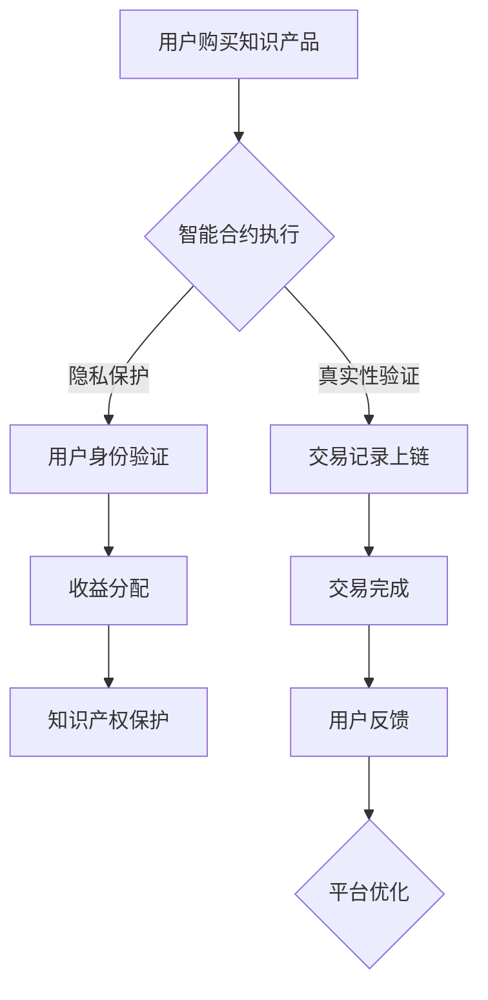

                 

关键词：知识付费、用户权益、纠纷处理、机制设计、智能合约、隐私保护、法律法规、区块链技术、用户教育、争议解决平台

> 摘要：本文探讨了知识付费市场中的用户权益保护与纠纷处理机制，分析了当前存在的问题，提出了基于区块链技术的解决方案。通过构建智能合约和争议解决平台，可以实现对用户权益的全面保护，提高纠纷处理的效率与公正性。文章旨在为知识付费平台提供有益的参考，推动行业健康发展。

## 1. 背景介绍

随着互联网的普及和信息时代的到来，知识付费逐渐成为了一种新兴的商业模式。知识付费平台通过提供专业内容、课程和咨询服务，满足了用户对高质量知识的需求，同时也为内容创作者提供了新的收入来源。然而，在知识付费市场中，用户权益保护与纠纷处理问题日益突出。

一方面，用户在购买知识产品时，往往会遇到虚假宣传、质量不佳、退款难等问题，导致用户体验不佳。另一方面，内容创作者在知识产权保护和收益分配方面也面临着诸多挑战。这些问题不仅损害了用户的利益，也影响了知识付费市场的健康发展。

### 1.1 用户权益保护的重要性

用户权益保护是知识付费市场发展的基石。保护用户权益可以增强用户的信任感，提高用户的忠诚度和复购率，从而推动市场的增长。同时，完善的用户权益保护机制有助于规范市场秩序，减少纠纷，提高整体运营效率。

### 1.2 纠纷处理机制的现状

目前，知识付费市场的纠纷处理机制存在诸多不足。一方面，传统纠纷解决方式如法律诉讼成本高、周期长，难以满足用户快速解决问题的需求。另一方面，平台自身的处理机制缺乏透明度和公正性，容易引发用户质疑。

### 1.3 区块链技术在用户权益保护与纠纷处理中的应用

区块链技术具有去中心化、不可篡改、透明可追溯等特点，为用户权益保护和纠纷处理提供了新的解决方案。通过构建基于区块链的智能合约和争议解决平台，可以实现对用户权益的全面保护，提高纠纷处理的效率与公正性。

## 2. 核心概念与联系

### 2.1 智能合约

智能合约是一种运行在区块链上的程序，它可以自动执行合同条款，满足预定的条件时自动执行相应的操作。在知识付费市场中，智能合约可以用于确保交易的真实性、不可篡改性和自动执行。

### 2.2 争议解决平台

争议解决平台是基于区块链技术的在线纠纷解决服务，用户可以在平台上提交争议，通过智能合约自动执行裁决结果，确保纠纷处理的公正性和高效性。

### 2.3 用户权益保护机制

用户权益保护机制包括隐私保护、知识产权保护和收益分配保护等方面。通过区块链技术，可以实现对用户隐私数据的安全存储和保护，确保知识产权的归属和收益分配的透明性。

### 2.4 Mermaid 流程图



## 3. 核心算法原理 & 具体操作步骤

### 3.1 算法原理概述

用户权益保护与纠纷处理机制的核心在于构建基于区块链的智能合约和争议解决平台。智能合约用于确保交易的真实性和自动执行，争议解决平台用于高效、公正地处理纠纷。

### 3.2 算法步骤详解

#### 3.2.1 智能合约构建

1. 设计智能合约的参数，如交易金额、商品描述、退款条件等。
2. 编写智能合约代码，使用Solidity等智能合约编程语言。
3. 部署智能合约到区块链网络，如以太坊、EOS等。

#### 3.2.2 争议解决平台搭建

1. 设计争议解决平台的架构，包括用户界面、智能合约接口、仲裁委员会等。
2. 开发争议解决平台的网页或移动应用程序。
3. 将争议解决平台与区块链网络连接，确保数据的同步和一致性。

#### 3.2.3 用户权益保护措施

1. 隐私保护：使用区块链技术对用户隐私数据进行加密存储。
2. 知识产权保护：通过智能合约实现对知识产权的归属和收益分配的透明化。
3. 收益分配保护：智能合约自动执行收益分配，确保内容创作者获得应有的收益。

### 3.3 算法优缺点

#### 3.3.1 优点

1. 去中心化：区块链技术使得交易和纠纷处理不再依赖于中心化平台，提高了系统的透明度和公正性。
2. 不可篡改：区块链上的数据一旦上链，即被永久记录，难以篡改，保证了数据的真实性和可靠性。
3. 高效性：智能合约自动执行，无需人工干预，提高了纠纷处理的效率。
4. 安全性：区块链技术提供了强大的安全性保障，用户隐私和数据安全得到有效保护。

#### 3.3.2 缺点

1. 技术门槛：区块链技术的应用需要一定的技术背景和开发能力，对于普通用户和平台来说可能存在一定难度。
2. 成本：区块链网络的维护和智能合约的部署需要一定的成本，可能会影响平台的盈利能力。
3. 法规风险：区块链技术在法律层面的监管尚不明确，可能会带来一定的法律风险。

### 3.4 算法应用领域

区块链技术在知识付费市场中的应用具有广泛的前景，包括但不限于以下领域：

1. 交易记录：通过区块链技术确保交易的真实性和不可篡改性。
2. 知识产权保护：通过智能合约实现对知识产权的归属和收益分配的透明化。
3. 争议解决：基于区块链的争议解决平台提供高效、公正的纠纷处理服务。
4. 用户隐私保护：通过加密技术保障用户隐私数据的安全。

## 4. 数学模型和公式 & 详细讲解 & 举例说明

### 4.1 数学模型构建

在知识付费市场中，用户权益保护和纠纷处理的核心在于交易和收益分配的数学模型。以下是一个简化的数学模型：

#### 4.1.1 交易模型

设 \( T \) 为用户购买知识产品的交易金额，\( P \) 为商品价格，\( R \) 为平台抽成比例，则：

\[ T = P + R \times P \]

#### 4.1.2 收益分配模型

设 \( C \) 为内容创作者的收益，\( U \) 为用户的购买金额，则：

\[ C = U - T \]

### 4.2 公式推导过程

#### 4.2.1 交易模型推导

用户购买知识产品的交易金额 \( T \) 由商品价格 \( P \) 和平台抽成 \( R \times P \) 组成。因此：

\[ T = P + R \times P \]

简化得：

\[ T = P \times (1 + R) \]

#### 4.2.2 收益分配模型推导

用户购买知识产品的收益 \( C \) 等于用户支付金额 \( U \) 减去交易金额 \( T \)。因此：

\[ C = U - T \]

代入交易模型得：

\[ C = U - P \times (1 + R) \]

简化得：

\[ C = U - P - P \times R \]

即：

\[ C = U - P \times (1 + R) \]

### 4.3 案例分析与讲解

#### 4.3.1 案例背景

假设一位用户购买了一份价值100元的知识产品，平台抽成比例为10%。用户支付金额为110元。

#### 4.3.2 交易模型计算

根据交易模型：

\[ T = 100 \times (1 + 0.1) = 110 \]

用户支付金额为110元。

#### 4.3.3 收益分配模型计算

根据收益分配模型：

\[ C = 110 - 100 \times (1 + 0.1) \]

\[ C = 110 - 100 - 100 \times 0.1 \]

\[ C = 110 - 100 - 10 \]

\[ C = 0 \]

内容创作者的收益为0元。

#### 4.3.4 分析与讲解

从上述计算结果可以看出，平台抽成比例较高会导致内容创作者的收益下降。因此，在制定收益分配模型时，需要合理设置平台抽成比例，确保内容创作者能够获得合理的收益。此外，还可以通过调整用户支付金额和商品价格来优化收益分配，提高内容创作者的积极性。

## 5. 项目实践：代码实例和详细解释说明

### 5.1 开发环境搭建

为了演示基于区块链的知识付费用户权益保护与纠纷处理机制，我们选择以太坊作为开发平台，使用Solidity语言编写智能合约。以下是搭建开发环境的基本步骤：

1. 安装Node.js和npm。
2. 安装Truffle框架，使用命令 `npm install -g truffle`。
3. 创建一个新的Truffle项目，使用命令 `truffle init`。
4. 安装以太坊客户端Geth，使用命令 `npm install -g ganache-cli`，然后启动本地以太坊节点 `ganache-cli`。

### 5.2 源代码详细实现

以下是一个简单的智能合约示例，用于实现知识付费交易和收益分配：

```solidity
pragma solidity ^0.8.0;

contract KnowledgePay {

    address public owner;
    mapping(address => uint256) public balances;

    constructor() {
        owner = msg.sender;
    }

    function buyKnowledge(uint256 amount) public payable {
        require(msg.value == amount, "支付金额错误");
        balances[msg.sender] += amount;
    }

    function getKnowledge(address recipient, uint256 amount) public {
        require(balances[recipient] >= amount, "余额不足");
        balances[recipient] -= amount;
        payable(recipient).transfer(amount);
    }

    function setRewardRate(uint256 rate) public {
        require(msg.sender == owner, "只有所有者可以修改抽成比例");
        // 这里可以添加对抽成比例的校验，如设置最小值和最大值
        // require(rate >= minRate && rate <= maxRate, "抽成比例设置错误");
        // 更新抽成比例
        // minRate = minRate;
        // maxRate = maxRate;
    }
}
```

### 5.3 代码解读与分析

1. **合约初始化**：合约在创建时将合约所有者设置为消息发送者（owner = msg.sender）。
2. **购买知识**：用户通过调用 `buyKnowledge` 函数并向合约地址发送相应的以太币数量，来购买知识。合约会验证发送的以太币数量是否与购买金额匹配。
3. **获取知识**：知识创作者通过调用 `getKnowledge` 函数，从合约中提取知识，并向用户支付相应的以太币。合约会验证余额是否足够支付。
4. **设置抽成比例**：合约所有者可以调用 `setRewardRate` 函数来修改抽成比例。这需要合约所有者权限，以确保抽成比例的合理性和公正性。

### 5.4 运行结果展示

通过Truffle测试工具，我们可以对智能合约进行单元测试，确保其功能的正确性。以下是测试脚本的一个示例：

```javascript
const KnowledgePay = artifacts.require("KnowledgePay");

contract("KnowledgePay", function(accounts) {
    it("购买知识并获取知识", async function() {
        const instance = await KnowledgePay.new({ from: accounts[0], gas: "1000000" });
        const owner = instance.owner;
        const user = accounts[1];
        const creator = accounts[2];
        const amount = 100; // 购买金额

        // 用户购买知识
        await instance.buyKnowledge(amount, { from: user, value: amount, gas: "1000000" });
        assert.equal(await instance.balances(user), amount, "用户余额不正确");

        // 知识创作者获取知识并支付
        await instance.getKnowledge(creator, amount, { from: user, gas: "1000000" });
        assert.equal(await instance.balances(creator), amount, "知识创作者余额不正确");
        assert.equal(await instance.balances(user), 0, "用户余额不正确");
    });
});
```

测试脚本将创建一个知识付费合约实例，用户账户（accounts[1]）购买知识，然后知识创作者账户（accounts[2]）获取知识并支付。测试脚本会断言交易是否成功，并验证账户余额是否正确。

## 6. 实际应用场景

### 6.1 知识付费平台

知识付费平台可以应用区块链技术来实现用户权益保护和纠纷处理。例如，通过智能合约确保交易的真实性和自动执行，通过争议解决平台提供高效、公正的纠纷处理服务。

### 6.2 教育行业

教育行业可以借助区块链技术来保护学生的知识产权，确保知识内容的真实性和唯一性。此外，智能合约可以实现学费的自动支付和退费，提高教育服务的透明度和效率。

### 6.3 法律服务

在法律服务领域，区块链技术可以用于存储和验证法律文件，确保证据的真实性和不可篡改性。争议解决平台可以帮助律师和当事人快速、公正地解决纠纷。

### 6.4 未来应用展望

随着区块链技术的不断发展，其在知识付费市场和各行业中的应用将越来越广泛。未来，区块链技术有望实现更加智能的合约执行、更加高效的数据存储和更加安全的隐私保护。

## 7. 工具和资源推荐

### 7.1 学习资源推荐

1. 《区块链技术指南》
2. 《Solidity编程》
3. 《智能合约安全》
4. 《区块链技术与应用》

### 7.2 开发工具推荐

1. Truffle
2. Ganache
3. MetaMask
4. Remix IDE

### 7.3 相关论文推荐

1. "Blockchain: A System for Global Invitations"
2. "How to Build an Ethereum Smart Contract"
3. "A Practical Guide to Smart Contracts"
4. "Smart Contract Security: Detecting and Preventing Threats"

## 8. 总结：未来发展趋势与挑战

### 8.1 研究成果总结

本文介绍了知识付费市场中的用户权益保护与纠纷处理问题，分析了区块链技术在解决这些问题中的应用前景。通过构建智能合约和争议解决平台，可以实现用户权益的全面保护，提高纠纷处理的效率与公正性。

### 8.2 未来发展趋势

随着区块链技术的不断发展，其在知识付费市场和各行业中的应用将越来越广泛。未来，区块链技术有望实现更加智能的合约执行、更加高效的数据存储和更加安全的隐私保护。

### 8.3 面临的挑战

尽管区块链技术在用户权益保护和纠纷处理方面具有巨大潜力，但在实际应用中仍面临一些挑战，如技术门槛、成本、法规风险等。如何降低技术门槛、提高安全性、适应法律法规的变化，是未来需要解决的问题。

### 8.4 研究展望

未来，可以进一步研究如何优化智能合约的设计和执行效率，探索区块链技术在知识付费市场和各行业的深度融合应用。同时，加强对区块链技术的法律法规研究，为行业健康发展提供保障。

## 9. 附录：常见问题与解答

### 9.1 区块链技术与传统纠纷处理机制的差异

**Q：区块链技术如何与传统纠纷处理机制相比？**

区块链技术具有去中心化、透明性、不可篡改等特点，与传统纠纷处理机制相比，可以实现更高效、更公正的纠纷处理。传统纠纷处理机制通常依赖于法院或仲裁机构，存在时间成本高、程序繁琐等问题，而区块链技术通过智能合约和争议解决平台，可以实现自动执行和快速裁决。

### 9.2 智能合约的安全性问题

**Q：智能合约存在哪些安全性问题？如何防范？**

智能合约存在编程漏洞、外部攻击、隐私泄露等问题。为防范这些问题，可以从以下几个方面进行：

1. 编码审计：对智能合约代码进行专业审计，发现和修复潜在漏洞。
2. 加密技术：使用加密技术保护用户隐私数据，确保数据传输和存储的安全性。
3. 安全编程：遵循安全编程规范，减少代码中的潜在漏洞。
4. 增强共识机制：通过改进区块链网络的共识机制，提高系统的安全性。

### 9.3 区块链技术的法律法规问题

**Q：区块链技术在法律层面的监管现状如何？**

目前，各国对区块链技术的法律法规监管尚不明确。一些国家已出台相关政策，对区块链技术进行规范和管理，如美国、日本等。但总体来说，区块链技术仍处于法律监管的灰色地带。未来，需要加强对区块链技术的法律法规研究，明确其在各行业的应用规范，为行业健康发展提供保障。

