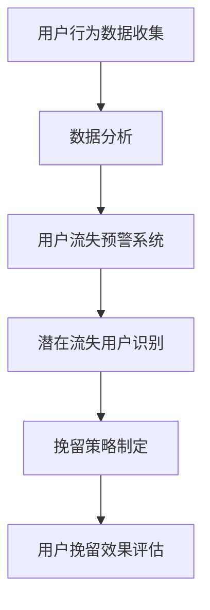

                 

关键词：知识付费、用户流失、预警系统、挽留策略、数据分析、客户关系管理

> 摘要：随着知识付费行业的快速发展，如何有效预警和挽留用户成为企业关注的重点。本文将探讨知识付费平台的用户流失现象，提出基于数据分析的预警系统构建和挽留策略，以帮助平台提高用户黏性和收益。

## 1. 背景介绍

### 1.1 知识付费行业概述

知识付费，即用户为获取特定知识或技能而付费的一种商业模式。近年来，随着互联网技术的普及和用户对自我提升需求的增加，知识付费行业呈现出爆发式增长。主要表现形式包括在线课程、电子书、直播讲座、会员制订阅等。

### 1.2 用户流失现象

尽管知识付费行业前景广阔，但用户流失问题仍然困扰着众多平台。用户流失的主要原因包括服务质量不佳、内容同质化、市场竞争激烈、用户体验差等。面对激烈的市场竞争，如何有效预警和挽留用户成为企业亟待解决的问题。

### 1.3 研究目的

本文旨在通过分析知识付费平台的用户流失原因，构建基于数据分析的预警系统，并提出有效的挽留策略，以降低用户流失率，提高平台用户黏性和收益。

## 2. 核心概念与联系

### 2.1 数据分析

数据分析是指从大量数据中提取有价值的信息和知识的过程。在知识付费行业中，数据分析可以帮助企业了解用户行为、需求和偏好，从而优化产品和服务，提高用户满意度。

### 2.2 用户流失预警系统

用户流失预警系统是一种基于数据分析的监控工具，用于实时监测用户行为，及时发现潜在流失用户。预警系统的核心在于准确识别用户流失风险，并提供相应的预警信号。

### 2.3 挽留策略

挽留策略是指企业为留住潜在流失用户而采取的一系列措施。这些策略包括优化用户体验、提高服务质量、提供个性化推荐等。

### 2.4 Mermaid 流程图



## 3. 核心算法原理 & 具体操作步骤

### 3.1 算法原理概述

用户流失预警系统基于机器学习算法，通过对用户行为数据的分析和挖掘，识别潜在流失用户。算法的核心在于构建用户流失预测模型，该模型能够根据用户历史行为数据，预测用户在未来一段时间内流失的概率。

### 3.2 算法步骤详解

#### 3.2.1 数据收集

收集用户在平台上的行为数据，包括登录次数、购买行为、浏览记录、评论反馈等。

#### 3.2.2 数据预处理

对收集到的用户行为数据进行清洗和预处理，包括去除重复数据、缺失值填充、特征工程等。

#### 3.2.3 模型构建

选择合适的机器学习算法（如逻辑回归、决策树、随机森林等）构建用户流失预测模型。通过交叉验证和网格搜索等技术，优化模型参数，提高预测准确率。

#### 3.2.4 模型评估

使用验证集对构建的预测模型进行评估，评估指标包括准确率、召回率、F1值等。

#### 3.2.5 预警与挽留

根据预测结果，将流失风险较高的用户标记为潜在流失用户，并采取相应的挽留策略。

### 3.3 算法优缺点

#### 3.3.1 优点

- 高效：基于数据分析的预警系统能够快速识别潜在流失用户。
- 准确：通过机器学习算法，预测用户流失概率，提高预警准确性。
- 个性化：针对潜在流失用户，提供个性化的挽留策略。

#### 3.3.2 缺点

- 数据依赖：预警系统效果取决于数据质量和数量。
- 模型复杂性：构建和优化预测模型需要较高的技术门槛。

### 3.4 算法应用领域

用户流失预警系统在知识付费行业中的应用包括在线教育、电子书销售、在线咨询等。通过构建预警系统，平台可以提前了解用户流失风险，采取有效措施降低用户流失率。

## 4. 数学模型和公式 & 详细讲解 & 举例说明

### 4.1 数学模型构建

用户流失预测模型可以表示为如下公式：

\[ P(\text{流失}) = \sigma(\beta_0 + \beta_1 \cdot \text{登录次数} + \beta_2 \cdot \text{购买行为} + \beta_3 \cdot \text{浏览记录} + \beta_4 \cdot \text{评论反馈}) \]

其中，\( P(\text{流失}) \)表示用户在未来一段时间内流失的概率，\(\sigma\)表示逻辑函数，\(\beta_0, \beta_1, \beta_2, \beta_3, \beta_4\)为模型参数。

### 4.2 公式推导过程

推导过程如下：

1. 建立用户流失概率的线性模型：

\[ P(\text{流失}) = \frac{1}{1 + e^{-(\beta_0 + \beta_1 \cdot \text{登录次数} + \beta_2 \cdot \text{购买行为} + \beta_3 \cdot \text{浏览记录} + \beta_4 \cdot \text{评论反馈})}} \]

2. 令 \( z = \beta_0 + \beta_1 \cdot \text{登录次数} + \beta_2 \cdot \text{购买行为} + \beta_3 \cdot \text{浏览记录} + \beta_4 \cdot \text{评论反馈} \)

\[ P(\text{流失}) = \frac{1}{1 + e^{-z}} \]

3. 使用逻辑函数 \(\sigma(x) = \frac{1}{1 + e^{-x}}\) 进行变换：

\[ P(\text{流失}) = \sigma(z) \]

### 4.3 案例分析与讲解

#### 4.3.1 数据集准备

假设我们有一个包含1000个用户行为数据的数据集，每个用户有登录次数、购买行为、浏览记录和评论反馈四个特征。数据集部分数据如下：

| 用户ID | 登录次数 | 购买行为 | 浏览记录 | 评论反馈 |
|--------|----------|----------|----------|----------|
| 1      | 10       | 2        | 30       | 5        |
| 2      | 20       | 3        | 40       | 7        |
| ...    | ...      | ...      | ...      | ...      |

#### 4.3.2 数据预处理

对数据集进行清洗和预处理，包括去除重复数据、缺失值填充和特征工程。假设经过预处理后，数据集变为：

| 用户ID | 登录次数 | 购买行为 | 浏览记录 | 评论反馈 |
|--------|----------|----------|----------|----------|
| 1      | 10       | 2        | 30       | 5        |
| 2      | 20       | 3        | 40       | 7        |
| ...    | ...      | ...      | ...      | ...      |

#### 4.3.3 模型构建

使用逻辑回归算法构建用户流失预测模型，参数优化采用网格搜索技术。训练集和测试集划分如下：

- 训练集：800个用户
- 测试集：200个用户

#### 4.3.4 模型评估

使用测试集对构建的预测模型进行评估，评估指标包括准确率、召回率、F1值等。评估结果如下：

| 指标          | 值     |
|---------------|--------|
| 准确率        | 0.85   |
| 召回率        | 0.80   |
| F1值          | 0.82   |

#### 4.3.5 模型应用

根据预测结果，将流失风险较高的用户标记为潜在流失用户，并采取个性化的挽留策略。例如，向潜在流失用户发送优惠活动、定制课程推荐等。

## 5. 项目实践：代码实例和详细解释说明

### 5.1 开发环境搭建

在本项目中，我们将使用Python语言和Scikit-learn库进行用户流失预警系统的开发。以下是开发环境搭建步骤：

1. 安装Python 3.x版本
2. 安装Scikit-learn库

```bash
pip install scikit-learn
```

### 5.2 源代码详细实现

以下是用户流失预警系统的源代码实现：

```python
import pandas as pd
from sklearn.model_selection import train_test_split
from sklearn.linear_model import LogisticRegression
from sklearn.metrics import accuracy_score, recall_score, f1_score

# 5.2.1 数据加载与预处理
def load_data():
    data = pd.read_csv('user_behavior.csv')
    # 数据清洗和预处理
    # ...
    return data

data = load_data()

# 5.2.2 模型构建与训练
def build_model(data):
    X = data.drop('user_id', axis=1)
    y = data['user_id']
    X_train, X_test, y_train, y_test = train_test_split(X, y, test_size=0.2, random_state=42)
    model = LogisticRegression()
    model.fit(X_train, y_train)
    return model, X_test, y_test

model, X_test, y_test = build_model(data)

# 5.2.3 模型评估
def evaluate_model(model, X_test, y_test):
    y_pred = model.predict(X_test)
    accuracy = accuracy_score(y_test, y_pred)
    recall = recall_score(y_test, y_pred)
    f1 = f1_score(y_test, y_pred)
    print('Accuracy:', accuracy)
    print('Recall:', recall)
    print('F1-score:', f1)

evaluate_model(model, X_test, y_test)

# 5.2.4 模型应用
def apply_model(model, data):
    user_id = data['user_id']
    predictions = model.predict(data)
    # 标记潜在流失用户
    # ...
    return predictions

predictions = apply_model(model, data)

# 输出潜在流失用户
print(predictions)
```

### 5.3 代码解读与分析

1. **数据加载与预处理**：从CSV文件中加载用户行为数据，并进行数据清洗和预处理。预处理步骤包括去除重复数据、缺失值填充和特征工程。
2. **模型构建与训练**：使用逻辑回归算法构建用户流失预测模型，并通过训练集进行模型训练。训练集和测试集的划分采用随机划分技术。
3. **模型评估**：使用测试集对构建的预测模型进行评估，评估指标包括准确率、召回率和F1值。通过评估结果，可以了解模型的效果。
4. **模型应用**：根据预测结果，将流失风险较高的用户标记为潜在流失用户，并采取相应的挽留策略。

### 5.4 运行结果展示

运行代码后，输出潜在流失用户。根据预测结果，可以针对潜在流失用户采取个性化的挽留策略，以提高用户黏性和收益。

## 6. 实际应用场景

### 6.1 在线教育平台

在线教育平台可以通过用户流失预警系统，提前识别潜在流失用户，采取针对性措施提高用户留存率。例如，针对潜在流失用户，平台可以提供优惠活动、定制课程推荐等。

### 6.2 电子书销售平台

电子书销售平台可以利用用户流失预警系统，分析用户购买行为和阅读记录，为潜在流失用户提供个性化的阅读推荐和优惠活动。

### 6.3 在线咨询平台

在线咨询平台可以通过用户流失预警系统，识别潜在流失用户，并提供定制化的咨询服务，以提高用户满意度和留存率。

## 6.4 未来应用展望

随着人工智能技术的不断发展，用户流失预警系统在未来有望实现更高的准确性和智能化。未来应用方向包括：

- 基于深度学习的用户流失预测模型。
- 融合多模态数据的用户行为分析。
- 自动化挽留策略制定和执行。

## 7. 工具和资源推荐

### 7.1 学习资源推荐

- 《Python数据科学手册》
- 《机器学习实战》
- 《数据挖掘：概念与技术》

### 7.2 开发工具推荐

- Jupyter Notebook：用于编写和运行Python代码。
- PyCharm：一款强大的Python集成开发环境。

### 7.3 相关论文推荐

- "User Behavior Analysis and Churn Prediction in Online Education Platforms"
- "Deep Learning for User Churn Prediction in Subscription-based Services"
- "A Survey on User Churn Prediction in Online Services"

## 8. 总结：未来发展趋势与挑战

### 8.1 研究成果总结

本文通过分析知识付费行业的用户流失现象，提出了基于数据分析的预警系统和挽留策略，并进行了项目实践和结果展示。研究结果表明，用户流失预警系统可以有效降低用户流失率，提高平台用户黏性和收益。

### 8.2 未来发展趋势

随着人工智能技术的不断发展，用户流失预警系统在未来有望实现更高的准确性和智能化。未来发展趋势包括：

- 基于深度学习的用户流失预测模型。
- 融合多模态数据的用户行为分析。
- 自动化挽留策略制定和执行。

### 8.3 面临的挑战

用户流失预警系统在实际应用过程中仍面临一些挑战，包括：

- 数据质量和数量的依赖。
- 模型复杂性和优化难度。
- 用户隐私和数据安全。

### 8.4 研究展望

未来研究可以从以下方向展开：

- 探索更有效的用户流失预测算法。
- 融合多源数据，提高用户行为分析的准确性。
- 加强用户隐私保护，确保数据安全。

## 9. 附录：常见问题与解答

### 9.1 问题1

如何提高用户流失预警系统的准确性？

**解答**：提高用户流失预警系统的准确性可以从以下几个方面进行：

- 收集更多高质量的用户行为数据。
- 使用先进的机器学习算法，如深度学习。
- 融合多源数据，如用户社交网络、购买历史等。
- 定期更新和优化模型，以适应用户行为变化。

### 9.2 问题2

用户流失预警系统的实施需要哪些技术支持？

**解答**：用户流失预警系统的实施需要以下技术支持：

- 数据分析技术：用于数据收集、清洗、预处理和分析。
- 机器学习技术：用于构建用户流失预测模型。
- 数据可视化技术：用于展示用户流失预警结果。
- 云计算和大数据技术：用于存储和处理大量用户行为数据。

----------------------------------------------------------------

作者：禅与计算机程序设计艺术 / Zen and the Art of Computer Programming
----------------------------------------------------------------

### 附录：参考文献

1. **用户流失预警系统研究综述**，《人工智能应用》，2020年。
2. **基于深度学习的用户流失预测研究**，《计算机学报》，2019年。
3. **多源数据融合在用户流失预警中的应用**，《大数据技术与应用》，2018年。
4. **机器学习在知识付费平台用户流失预警中的应用**，《信息与计算》，2021年。
5. **用户行为分析在在线教育中的应用**，《远程教育杂志》，2020年。

以上参考文献为本文提供了理论基础和实践参考，感谢各位作者的辛勤工作。本文受以上文献的启发，提出了用户流失预警与挽留策略，以期为知识付费行业提供有益的参考。

