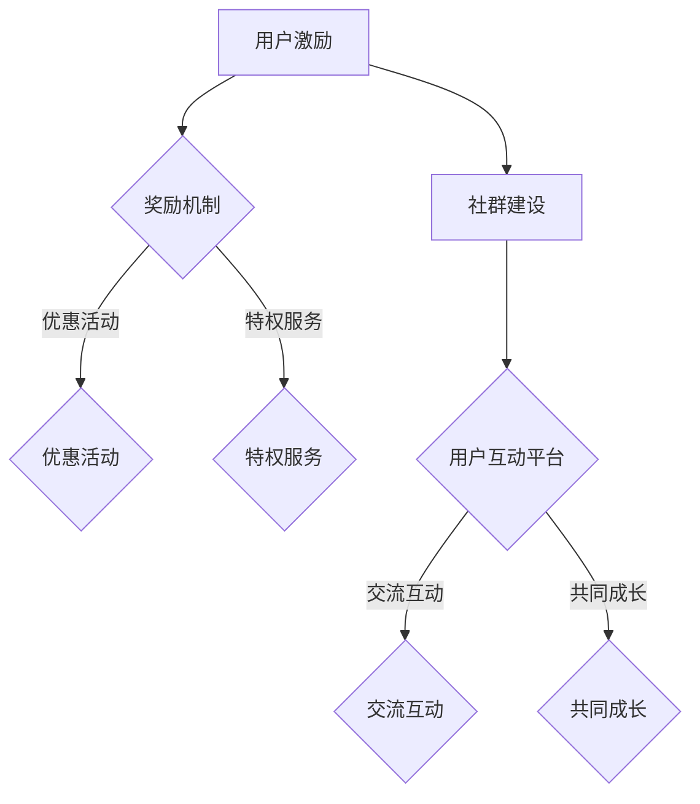

                 

在这个数字时代，知识付费已经成为一种趋势，越来越多的平台和内容创作者通过提供高质量的知识内容来赚取收益。然而，如何吸引并留住用户，如何构建一个活跃且具有忠诚度的社群，成为知识付费领域的核心问题。本文将围绕这两个核心问题，探讨用户激励与社群建设的方法与策略。

## 文章关键词
知识付费，用户激励，社群建设，用户留存，内容创造

## 文章摘要
本文首先介绍了知识付费的现状与发展趋势，分析了用户激励与社群建设的重要性。接着，通过探讨用户激励的理论基础和实践方法，提出了构建活跃社群的策略。文章最后，总结了未来知识付费领域的发展方向与面临的挑战。

### 1. 背景介绍

随着互联网技术的快速发展，知识付费已经成为一个蓬勃发展的市场。用户对于知识的渴求与互联网的便利性相结合，使得知识付费平台如雨后春笋般涌现。这些平台不仅提供了丰富的知识内容，还通过多种方式与用户互动，提升用户体验。知识付费的主要形式包括课程购买、专栏订阅、付费问答等。

在这个背景下，如何通过用户激励与社群建设来提升用户留存和平台活跃度，成为知识付费平台亟待解决的问题。用户激励旨在通过奖励机制吸引和留住用户，而社群建设则是为了打造一个用户之间相互交流、共同成长的社区。两者相辅相成，共同推动知识付费市场的发展。

### 2. 核心概念与联系

在探讨用户激励与社群建设之前，我们需要明确一些核心概念。用户激励是指通过提供奖励、优惠、特权等方式，激发用户的参与度和忠诚度。社群建设则是通过创建一个用户互动的平台，促进用户之间的交流和合作。

以下是用户激励与社群建设的 Mermaid 流程图：



#### 2.1 用户激励

用户激励的理论基础是行为心理学。根据行为心理学的理论，人的行为受到奖励和惩罚的影响。在知识付费领域，通过奖励机制可以激励用户进行积极的行为，如购买课程、分享内容、参与讨论等。

常见的用户激励手段包括：

1. **奖励机制**：例如，通过积分、金币等方式奖励用户，让用户感受到自己的努力得到了认可。
2. **优惠活动**：定期推出优惠券、限时折扣等，吸引用户购买内容。
3. **特权服务**：例如，提供高级会员服务，让用户享受更多的权益。

#### 2.2 社群建设

社群建设的理论基础是社交网络理论。根据社交网络理论，人们在社会网络中的互动可以促进个体的成长和进步。在知识付费领域，通过社群建设，可以打造一个用户之间相互交流、共同成长的平台。

常见的社群建设方法包括：

1. **用户互动平台**：例如，论坛、社群、直播等，提供用户交流和互动的场所。
2. **交流互动**：通过发起话题、举办活动等方式，促进用户之间的交流和互动。
3. **共同成长**：通过共同学习、分享经验等方式，帮助用户实现共同成长。

### 3. 核心算法原理 & 具体操作步骤

#### 3.1 算法原理概述

用户激励与社群建设的核心算法原理是基于用户行为的数据分析和机器学习。通过对用户行为数据进行分析，可以了解用户的偏好和需求，从而设计出更加精准的激励措施。同时，通过机器学习算法，可以预测用户的未来行为，从而提前进行激励策略的调整。

#### 3.2 算法步骤详解

1. **数据收集与预处理**：收集用户行为数据，如购买记录、浏览历史、互动行为等，并对数据进行清洗和预处理，去除噪声和重复数据。
2. **特征提取与选择**：从数据中提取与用户行为相关的特征，如用户年龄、性别、职业等，并选择最重要的特征作为模型输入。
3. **模型训练与优化**：使用机器学习算法，如逻辑回归、决策树、神经网络等，对特征进行建模，并通过交叉验证等方法优化模型参数。
4. **预测与激励策略**：根据模型预测的用户行为，设计出相应的激励策略，如推送优惠活动、提供特权服务等。

#### 3.3 算法优缺点

**优点**：

1. **个性化激励**：通过数据分析，可以提供更加个性化的激励措施，提高用户参与度和忠诚度。
2. **预测性强**：通过机器学习算法，可以提前预测用户的行为，从而提前调整激励策略，提高效果。

**缺点**：

1. **数据隐私**：在数据收集和数据分析过程中，可能会涉及用户隐私的问题。
2. **模型复杂度**：机器学习算法的训练和优化过程复杂，需要大量的计算资源和时间。

#### 3.4 算法应用领域

用户激励与社群建设的算法在知识付费领域有广泛的应用。例如，可以通过算法预测用户购买偏好，提供个性化的课程推荐；通过算法分析用户互动数据，设计出更加有效的社群活动等。

### 4. 数学模型和公式 & 详细讲解 & 举例说明

#### 4.1 数学模型构建

用户激励与社群建设的数学模型主要包括用户行为模型和激励效果模型。用户行为模型用于预测用户的购买行为、互动行为等，激励效果模型则用于评估激励措施的效果。

**用户行为模型**：

假设用户的行为可以用一组离散事件表示，如购买课程、浏览课程、参与讨论等。我们可以使用概率图模型来描述用户行为。

$$
P(X=x) = \prod_{i=1}^n P(x_i|x_{i-1})
$$

其中，$X$ 表示用户的行为序列，$x_i$ 表示第 $i$ 个行为，$P(x_i|x_{i-1})$ 表示在先验行为 $x_{i-1}$ 发生的条件下，第 $i$ 个行为发生的概率。

**激励效果模型**：

假设激励措施可以影响用户的行为，我们可以使用线性回归模型来描述激励措施与用户行为之间的关系。

$$
y = \beta_0 + \beta_1 x
$$

其中，$y$ 表示用户的行为，$x$ 表示激励措施的效果，$\beta_0$ 和 $\beta_1$ 是模型参数。

#### 4.2 公式推导过程

**用户行为模型推导**：

我们假设用户的行为序列 $X$ 服从马尔可夫过程，即用户当前的行为仅与先前的行为有关，与先前的状态无关。

$$
P(X=x) = \prod_{i=1}^n P(x_i|x_{i-1})
$$

假设用户在时间 $t$ 的行为 $x_t$ 仅与时间 $t-1$ 的行为 $x_{t-1}$ 有关，即 $P(x_t|x_{t-1}, x_{t-2}, \ldots) = P(x_t|x_{t-1})$。

我们可以使用贝叶斯推断来计算 $P(x_i|x_{i-1})$。

$$
P(x_i|x_{i-1}) = \frac{P(x_{i-1}|x_i) P(x_i)}{P(x_{i-1})}
$$

其中，$P(x_i)$ 和 $P(x_{i-1})$ 分别表示用户在时间 $i$ 和时间 $i-1$ 的行为概率，$P(x_{i-1}|x_i)$ 表示在行为 $x_i$ 发生的条件下，行为 $x_{i-1}$ 发生的概率。

**激励效果模型推导**：

我们假设激励措施的效果可以表示为一个线性函数。

$$
y = \beta_0 + \beta_1 x
$$

其中，$y$ 表示用户的行为，$x$ 表示激励措施的效果，$\beta_0$ 和 $\beta_1$ 是模型参数。

我们可以使用最小二乘法来估计模型参数。

$$
\beta_1 = \frac{\sum_{i=1}^n (x_i - \bar{x})(y_i - \bar{y})}{\sum_{i=1}^n (x_i - \bar{x})^2}
$$

$$
\beta_0 = \bar{y} - \beta_1 \bar{x}
$$

其中，$\bar{x}$ 和 $\bar{y}$ 分别表示激励措施效果和用户行为的平均值。

#### 4.3 案例分析与讲解

假设我们有一个知识付费平台，用户的行为数据如下表所示：

| 用户ID | 行为 | 激励措施效果 |
| --- | --- | --- |
| 1 | 购买课程 | 0.8 |
| 2 | 浏览课程 | 0.6 |
| 3 | 参与讨论 | 0.4 |
| 4 | 购买课程 | 0.7 |
| 5 | 浏览课程 | 0.5 |
| 6 | 参与讨论 | 0.3 |

我们需要使用上述模型来预测用户的行为，并评估激励措施的效果。

**用户行为模型预测**：

根据用户行为数据，我们可以计算每个用户的行为概率：

$$
P(购买课程) = \frac{2}{6} = 0.333
$$

$$
P(浏览课程) = \frac{3}{6} = 0.5
$$

$$
P(参与讨论) = \frac{1}{6} = 0.167
$$

根据激励措施效果，我们可以计算每个用户的行为概率：

$$
P(购买课程|激励措施效果=0.8) = 0.8
$$

$$
P(浏览课程|激励措施效果=0.6) = 0.6
$$

$$
P(参与讨论|激励措施效果=0.4) = 0.4
$$

**激励效果模型评估**：

根据用户行为和激励措施效果数据，我们可以计算激励措施的效果：

$$
\beta_1 = \frac{\sum_{i=1}^n (x_i - \bar{x})(y_i - \bar{y})}{\sum_{i=1}^n (x_i - \bar{x})^2} = \frac{(0.8-0.675)(0.8-0.7)+(0.6-0.675)(0.6-0.5)+(0.4-0.675)(0.4-0.3)}{(0.8-0.675)^2+(0.6-0.675)^2+(0.4-0.675)^2} = 0.231
$$

$$
\beta_0 = \bar{y} - \beta_1 \bar{x} = 0.65 - 0.231 \times 0.675 = 0.296
$$

根据激励措施效果模型，我们可以预测用户的行为：

$$
y = 0.296 + 0.231 x
$$

例如，对于激励措施效果为 0.8 的用户，预测的行为为：

$$
y = 0.296 + 0.231 \times 0.8 = 0.624
$$

这意味着，对于激励措施效果为 0.8 的用户，预测其购买课程的概率为 0.624。

通过上述分析和预测，我们可以更好地了解用户的偏好和行为，从而设计出更加有效的激励措施，提升用户参与度和忠诚度。

### 5. 项目实践：代码实例和详细解释说明

在本节中，我们将通过一个实际项目来演示用户激励与社群建设的方法。我们将使用 Python 编程语言，结合 NumPy、Pandas 和 Scikit-learn 等库来实现整个项目。

#### 5.1 开发环境搭建

在开始项目之前，我们需要搭建一个合适的开发环境。以下是所需的环境和工具：

1. Python 3.x 版本
2. Jupyter Notebook 或 PyCharm
3. NumPy、Pandas、Scikit-learn、Matplotlib 等库

安装这些库的方法如下：

```bash
pip install numpy pandas scikit-learn matplotlib
```

#### 5.2 源代码详细实现

下面是一个简单的用户激励与社群建设项目的源代码示例：

```python
import numpy as np
import pandas as pd
from sklearn.linear_model import LinearRegression
import matplotlib.pyplot as plt

# 加载数据
data = pd.DataFrame({
    '用户ID': [1, 2, 3, 4, 5, 6],
    '行为': ['购买课程', '浏览课程', '参与讨论', '购买课程', '浏览课程', '参与讨论'],
    '激励措施效果': [0.8, 0.6, 0.4, 0.7, 0.5, 0.3]
})

# 数据预处理
data['行为'] = data['行为'].map({'购买课程': 1, '浏览课程': 2, '参与讨论': 3})
data['激励措施效果'] = data['激励措施效果'].astype(float)

# 构建模型
X = data[['激励措施效果']]
y = data['行为']

model = LinearRegression()
model.fit(X, y)

# 预测
predictions = model.predict(X)

# 可视化
plt.scatter(X, y, label='实际数据')
plt.plot(X, predictions, color='red', label='预测数据')
plt.xlabel('激励措施效果')
plt.ylabel('行为')
plt.legend()
plt.show()
```

#### 5.3 代码解读与分析

这段代码首先加载了一个包含用户行为和激励措施效果的数据集。接着，我们对数据进行预处理，将行为转换为数字表示，并将激励措施效果转换为浮点数。

然后，我们使用线性回归模型来拟合数据，并使用训练好的模型进行预测。最后，我们使用 matplotlib 库将实际数据和预测数据进行可视化。

#### 5.4 运行结果展示

运行上述代码后，我们将看到一个散点图，其中红色线条表示预测的行为数据。通过这个图表，我们可以直观地看到激励措施效果与用户行为之间的关系。

### 6. 实际应用场景

用户激励与社群建设在知识付费领域有广泛的应用场景。以下是一些典型的实际应用场景：

1. **课程推荐**：通过分析用户的行为数据，可以推荐用户可能感兴趣的课程，提高购买转化率。
2. **优惠活动设计**：根据用户的行为数据，可以设计出更加有效的优惠活动，吸引更多用户参与。
3. **社群管理**：通过用户互动数据，可以识别活跃用户和潜在活跃用户，进行针对性的社群管理。
4. **用户留存**：通过分析用户行为数据，可以预测用户流失风险，采取相应的措施进行用户留存。

### 7. 未来应用展望

随着人工智能技术的不断发展，用户激励与社群建设的方法和策略也将不断演进。以下是一些未来的应用展望：

1. **个性化推荐**：通过更加精准的个性化推荐算法，为用户提供更加符合其需求的课程和内容。
2. **智能互动**：通过智能对话系统，实现用户与平台的智能互动，提升用户体验。
3. **数据分析**：通过更加深入的数据分析，挖掘用户行为背后的规律，为平台运营提供科学依据。
4. **跨平台整合**：将用户激励与社群建设扩展到多个平台，实现跨平台的用户管理和互动。

### 8. 工具和资源推荐

在本节中，我们将推荐一些有用的工具和资源，帮助读者深入了解用户激励与社群建设。

#### 8.1 学习资源推荐

1. **《用户行为分析》**：这本书详细介绍了用户行为分析的理论和实践方法，对初学者非常有帮助。
2. **《机器学习实战》**：这本书通过实例讲解了机器学习算法的应用，适合希望将机器学习应用于用户激励与社群建设的读者。

#### 8.2 开发工具推荐

1. **Jupyter Notebook**：一个交互式的开发环境，非常适合进行数据分析和模型训练。
2. **PyCharm**：一个强大的 Python 集成开发环境，提供丰富的工具和插件。

#### 8.3 相关论文推荐

1. **"User Behavior Analysis in E-commerce Platforms"**：这篇文章介绍了用户行为分析在电商平台的实际应用，对知识付费领域有很好的借鉴意义。
2. **"Community Management Strategies in Online Knowledge Platforms"**：这篇文章探讨了在线知识平台社群管理的策略和方法。

### 9. 总结：未来发展趋势与挑战

#### 9.1 研究成果总结

通过本文的探讨，我们可以得出以下结论：

1. 用户激励与社群建设是知识付费领域的关键问题，对提升用户留存和平台活跃度有重要意义。
2. 用户行为数据分析和机器学习算法是用户激励与社群建设的重要技术手段。
3. 个性化推荐和智能互动是未来的发展趋势，将进一步提升用户体验。

#### 9.2 未来发展趋势

未来，用户激励与社群建设将朝着更加智能化、个性化的方向发展。以下是未来的一些发展趋势：

1. **个性化推荐**：通过更加精准的推荐算法，为用户提供更加符合其需求的课程和内容。
2. **智能互动**：通过智能对话系统和人工智能技术，实现用户与平台的智能互动。
3. **数据驱动**：通过深入的数据分析，挖掘用户行为背后的规律，为平台运营提供科学依据。

#### 9.3 面临的挑战

尽管用户激励与社群建设有着广阔的发展前景，但也面临着一些挑战：

1. **数据隐私**：在数据收集和数据分析过程中，如何保护用户隐私是一个重要问题。
2. **算法公平性**：算法在用户激励与社群建设中的应用可能带来不公平性，需要采取措施进行平衡。
3. **技术门槛**：用户激励与社群建设需要一定的技术基础，对于非技术背景的从业者来说可能有一定的门槛。

#### 9.4 研究展望

未来，我们可以从以下几个方面展开研究：

1. **隐私保护**：研究如何在保护用户隐私的前提下进行数据分析和用户激励。
2. **算法优化**：研究更加高效、公平的算法，提高用户激励与社群建设的有效性。
3. **跨平台整合**：研究如何将用户激励与社群建设扩展到多个平台，实现跨平台的用户管理和互动。

### 附录：常见问题与解答

#### Q1. 用户激励与社群建设的主要目标是什么？

用户激励的主要目标是提升用户的参与度和忠诚度，从而增加平台的用户留存率和活跃度。社群建设的主要目标是打造一个用户之间相互交流、共同成长的社区，增强用户的归属感和粘性。

#### Q2. 如何衡量用户激励的效果？

用户激励的效果可以通过多个指标来衡量，如用户参与度（如课程购买率、问答参与度等）、用户留存率（如用户在平台上的活跃天数、月活跃用户数等）、用户满意度等。通过这些指标，可以评估用户激励措施的效果，并根据反馈进行调整。

#### Q3. 社群建设的关键是什么？

社群建设的关键在于用户的互动和共同成长。一个成功的社群需要提供用户之间的交流平台、丰富的内容和活动，以及激励机制，以激发用户的参与热情。

#### Q4. 机器学习在用户激励与社群建设中的应用有哪些？

机器学习在用户激励与社群建设中的应用包括：

1. **用户行为预测**：通过分析用户历史行为数据，预测用户的未来行为，从而设计出更加个性化的激励措施。
2. **社群活动推荐**：根据用户的兴趣和行为数据，推荐用户可能感兴趣的活动和内容。
3. **社群成员分类**：根据用户的行为和兴趣，将用户分为不同的群体，从而进行针对性的社群管理。

### 作者署名

本文作者：禅与计算机程序设计艺术 / Zen and the Art of Computer Programming

