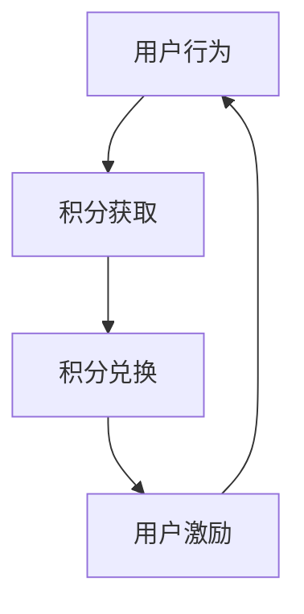

                 

 在当今信息爆炸的时代，知识付费作为一种商业模式，已经逐渐成为主流。而一个有效的用户激励机制和积分体系，是知识付费平台成功的关键。本文将深入探讨如何设计一个既能够吸引用户持续互动，又能激励用户产生价值的积分体系，以及背后的技术原理。

> 关键词：知识付费、用户激励机制、积分体系、用户互动、价值激励

> 摘要：本文旨在介绍和探讨知识付费平台中用户激励机制与积分体系的设计原理和最佳实践。文章将首先概述背景，然后深入分析核心概念，探讨算法原理，最后通过实例说明和实际应用场景来展示如何将理论知识转化为实际操作。

## 1. 背景介绍

### 1.1 知识付费的定义与发展

知识付费是指用户为了获取特定知识或信息，自愿支付一定费用的一种商业模式。这种模式在互联网时代得到了迅速发展，特别是在教育、职场技能培训、专业咨询等领域表现尤为突出。

### 1.2 用户激励机制的重要性

用户激励机制是推动用户参与、提升用户留存率和促进平台活跃度的重要手段。一个有效的激励机制能够增强用户粘性，提高用户满意度，并最终促进平台的商业化发展。

### 1.3 积分体系的设计原则

积分体系作为激励机制的核心组成部分，其设计原则主要包括公平性、透明性、激励性和可持续性。公平性保证所有用户在积分获取上的机会均等；透明性确保用户能够清晰了解积分的获取和使用规则；激励性旨在激发用户的积极性和参与度；可持续性则要求积分体系能够长期有效地运行。

## 2. 核心概念与联系

### 2.1 激励机制的定义

激励机制是通过奖励或惩罚来影响个体行为的一种机制。在知识付费平台中，激励机制主要用于引导用户积极参与平台活动，如发表评论、完成课程、推荐好友等。

### 2.2 积分体系的概念

积分体系是一种基于积分累积和兑换的奖励机制，通过为用户在平台上完成特定行为或达到特定条件而赋予积分，用户可以用积分兑换平台内的商品或服务。

### 2.3 机制与积分体系的联系

激励机制和积分体系是相互关联的。激励机制是积分体系的前提，而积分体系是激励机制的具体实现方式。通过积分体系，平台可以量化用户的行为和价值，进而进行更精准的激励。

### 2.4 Mermaid 流程图



## 3. 核心算法原理 & 具体操作步骤

### 3.1 算法原理概述

积分体系的算法原理主要涉及积分的获取、消耗和兑换。具体包括以下几个方面：

- 积分的获取：用户通过完成平台设定的任务或活动，如注册、签到、完成课程等，获得相应积分。
- 积分的消耗：用户在兑换商品或服务时，需要消耗相应的积分。
- 积分的兑换：平台提供多种兑换选项，如课程优惠、虚拟商品等，用户可以根据自己的需求选择兑换。

### 3.2 算法步骤详解

1. **用户行为记录**：平台需要记录用户在平台上的所有行为，包括注册、登录、学习、购买、评论等。
2. **积分计算**：根据用户行为，平台计算相应的积分值。积分值可以设定为固定值或按比例计算。
3. **积分累积**：用户在完成特定行为后，积分会累积到用户的账户中。
4. **积分兑换**：用户可以通过平台提供的兑换渠道，将积分兑换为商品或服务。
5. **积分结算**：平台需要对积分的获取、消耗和兑换进行实时结算，确保积分体系的正常运行。

### 3.3 算法优缺点

**优点**：

- **灵活性**：积分体系可以根据平台需求和用户行为灵活调整。
- **量化管理**：积分体系可以量化用户的行为和价值，便于平台进行数据分析和决策。
- **用户参与**：积分体系能够激发用户的参与度和积极性。

**缺点**：

- **风险**：积分的获取和消耗可能存在不公平或漏洞，需要严格监管。
- **成本**：积分体系的设计和运营可能需要一定的技术和人力资源投入。

### 3.4 算法应用领域

积分体系广泛应用于知识付费、电商、社交网络等多个领域，尤其在用户活跃度和用户留存率要求较高的平台中，具有显著的效果。

## 4. 数学模型和公式 & 详细讲解 & 举例说明

### 4.1 数学模型构建

积分体系可以看作是一个动态系统，其数学模型主要包括以下几个部分：

- 积分获取模型：\(I_{gain} = f(B)\)，其中 \(I_{gain}\) 为积分获取量，\(B\) 为用户行为。
- 积分消耗模型：\(I_{consumed} = g(S)\)，其中 \(I_{consumed}\) 为积分消耗量，\(S\) 为用户兑换行为。
- 积分余额模型：\(I_{balance} = I_{initial} + I_{gain} - I_{consumed}\)，其中 \(I_{initial}\) 为初始积分。

### 4.2 公式推导过程

1. **积分获取模型推导**：

   \(I_{gain}\) 是用户在完成某个行为 \(B\) 后获取的积分量。假设每个行为 \(B\) 的积分获取量是固定的，即 \(f(B) = C\)，其中 \(C\) 为固定的积分值。

   则积分获取模型为：\(I_{gain} = C \times B\)。

2. **积分消耗模型推导**：

   \(I_{consumed}\) 是用户在兑换某个商品或服务 \(S\) 后消耗的积分量。假设每个商品或服务的积分消耗量是固定的，即 \(g(S) = D\)，其中 \(D\) 为固定的积分值。

   则积分消耗模型为：\(I_{consumed} = D \times S\)。

3. **积分余额模型推导**：

   积分余额 \(I_{balance}\) 是用户当前的积分余额。根据积分获取和消耗模型，积分余额为：

   \(I_{balance} = I_{initial} + C \times B - D \times S\)。

### 4.3 案例分析与讲解

假设一个知识付费平台，用户注册获得100积分，每完成一门课程获得50积分，每消耗100积分可以兑换一门免费课程。

1. **积分获取**：

   用户注册后，获得 \(I_{gain} = 100\) 积分。

2. **积分消耗**：

   用户完成一门课程后，消耗 \(I_{consumed} = 50\) 积分。

3. **积分余额**：

   用户当前的积分余额为 \(I_{balance} = 100 + 50 - 50 = 100\) 积分。

通过这个案例，我们可以看到积分体系如何通过数学模型来量化用户的行为和价值，并实现用户的激励。

## 5. 项目实践：代码实例和详细解释说明

### 5.1 开发环境搭建

为了演示积分体系的实现，我们选择使用 Python 作为编程语言，并在本地搭建一个简单的积分系统。

1. **安装 Python**：确保系统已安装 Python 3.8 以上版本。
2. **安装依赖库**：使用 pip 安装必要的库，如 Flask、SQLAlchemy 等。

### 5.2 源代码详细实现

下面是一个简单的积分系统代码示例：

```python
from flask import Flask, request, jsonify
from sqlalchemy import create_engine, Column, Integer, String
from sqlalchemy.ext.declarative import declarative_base
from sqlalchemy.orm import sessionmaker

app = Flask(__name__)

# 数据库连接配置
DATABASE_URL = "sqlite:///积分系统.db"
engine = create_engine(DATABASE_URL)
Session = sessionmaker(bind=engine)
Base = declarative_base()

# 用户表
class User(Base):
    __tablename__ = "用户"
    id = Column(Integer, primary_key=True)
    username = Column(String(50), unique=True, nullable=False)
    balance = Column(Integer, default=0)

# 创建表
Base.metadata.create_all(engine)

# 注册用户
@app.route("/register", methods=["POST"])
def register():
    username = request.form["username"]
    session = Session()
    user = session.query(User).filter_by(username=username).first()
    if user:
        return jsonify({"error": "用户已存在"}), 409
    new_user = User(username=username)
    session.add(new_user)
    session.commit()
    return jsonify({"message": "注册成功"}), 201

# 获取用户积分
@app.route("/balance", methods=["GET"])
def get_balance():
    username = request.args.get("username")
    session = Session()
    user = session.query(User).filter_by(username=username).first()
    if not user:
        return jsonify({"error": "用户不存在"}), 404
    return jsonify({"balance": user.balance}), 200

# 添加积分
@app.route("/add_balance", methods=["POST"])
def add_balance():
    username = request.form["username"]
    amount = int(request.form["amount"])
    session = Session()
    user = session.query(User).filter_by(username=username).first()
    if not user:
        return jsonify({"error": "用户不存在"}), 404
    user.balance += amount
    session.commit()
    return jsonify({"message": "积分添加成功", "new_balance": user.balance}), 200

# 消耗积分
@app.route("/consume_balance", methods=["POST"])
def consume_balance():
    username = request.form["username"]
    amount = int(request.form["amount"])
    session = Session()
    user = session.query(User).filter_by(username=username).first()
    if not user:
        return jsonify({"error": "用户不存在"}), 404
    if user.balance < amount:
        return jsonify({"error": "余额不足"}), 400
    user.balance -= amount
    session.commit()
    return jsonify({"message": "积分消耗成功", "new_balance": user.balance}), 200

if __name__ == "__main__":
    app.run(debug=True)
```

### 5.3 代码解读与分析

1. **数据库连接**：使用 SQLAlchemy 库连接到 SQLite 数据库，并创建用户表。
2. **注册用户**：通过 `/register` 接口实现用户注册功能，将用户信息存储到数据库中。
3. **获取用户积分**：通过 `/balance` 接口实现获取用户积分功能，查询数据库中用户的积分余额。
4. **添加积分**：通过 `/add_balance` 接口实现给用户添加积分功能，将积分累加到用户的账户中。
5. **消耗积分**：通过 `/consume_balance` 接口实现用户消耗积分功能，从用户的账户中扣除相应的积分。

### 5.4 运行结果展示

1. **注册用户**：

   ```bash
   $ curl -X POST -F "username=test" http://localhost:5000/register
   {"message": "注册成功"}
   ```

2. **获取用户积分**：

   ```bash
   $ curl -X GET "http://localhost:5000/balance?username=test"
   {"balance": 0}
   ```

3. **添加积分**：

   ```bash
   $ curl -X POST -F "username=test&amount=100" http://localhost:5000/add_balance
   {"message": "积分添加成功", "new_balance": 100}
   ```

4. **消耗积分**：

   ```bash
   $ curl -X POST -F "username=test&amount=50" http://localhost:5000/consume_balance
   {"message": "积分消耗成功", "new_balance": 50}
   ```

## 6. 实际应用场景

### 6.1 知识付费平台

在知识付费平台中，积分体系可以用于激励用户完成课程、发表评论、邀请好友等行为，提升用户活跃度和课程完成率。

### 6.2 电商平台

电商平台可以利用积分体系鼓励用户进行消费、评价商品、参与活动等，从而提高用户忠诚度和销售额。

### 6.3 社交网络

社交网络平台可以通过积分体系激励用户发表内容、互动、关注等，增加用户粘性和社区活跃度。

## 6.4 未来应用展望

随着技术的不断发展，积分体系将更加智能化、个性化。未来，基于大数据和人工智能的积分推荐系统和精准激励策略有望进一步推动知识付费和电商等领域的发展。

## 7. 工具和资源推荐

### 7.1 学习资源推荐

- 《用户增长方法论》
- 《增长黑客》
- 《大数据营销》

### 7.2 开发工具推荐

- Flask：Python Web 开发框架
- SQLAlchemy：Python ORM 库
- SQLite：轻量级关系数据库

### 7.3 相关论文推荐

- "The Value of a Social Network: A Systematic Literature Review"
- "User Engagement and Retention in Online Platforms: A Comprehensive Study"
- "Designing Incentive Mechanisms for Virtual Communities"

## 8. 总结：未来发展趋势与挑战

### 8.1 研究成果总结

本文从理论和实践的角度，详细介绍了知识付费平台中用户激励机制与积分体系的设计原则、算法原理和应用实例。研究成果表明，一个有效的积分体系能够显著提升用户参与度和平台活跃度。

### 8.2 未来发展趋势

未来，积分体系将向智能化、个性化方向发展，结合大数据和人工智能技术，为用户提供更加精准的激励。

### 8.3 面临的挑战

- **隐私保护**：在积分体系中，如何保护用户隐私成为一个重要挑战。
- **技术实现**：积分体系的设计和实现需要较高的技术水平和丰富的经验。
- **可持续性**：积分体系的长期运营需要持续的创新和优化。

### 8.4 研究展望

未来，我们需要进一步研究如何构建更加智能、高效的积分体系，以适应不断变化的市场环境和用户需求。

## 9. 附录：常见问题与解答

### 9.1 积分体系的公平性如何保障？

**解答**：可以通过设定明确的积分获取和使用规则，确保所有用户在积分获取上的机会均等。此外，定期审核和调整积分规则，确保其公平性和合理性。

### 9.2 积分体系的可扩展性如何保证？

**解答**：采用模块化设计，将积分获取、消耗和兑换等模块独立开发，便于后期扩展和维护。同时，采用分布式数据库技术，提高系统的可扩展性和性能。

### 9.3 积分体系如何防止作弊？

**解答**：可以通过以下措施防止作弊：
1. 实施严格的用户身份验证机制；
2. 定期监控和审计积分获取和使用情况；
3. 设定积分获取和使用限制，如积分有效期、单次获取上限等；
4. 采用区块链技术确保积分记录不可篡改。

---

作者：禅与计算机程序设计艺术 / Zen and the Art of Computer Programming

[本文完] <|user|>

