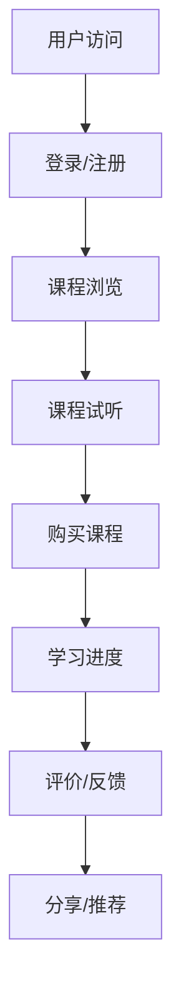

                 

关键词：知识付费、用户评价、反馈收集、课程评价机制、用户行为分析、数据驱动决策

> 摘要：本文将深入探讨知识付费领域中的用户课程评价与反馈收集机制。通过分析用户行为的特征，阐述评价机制的构建原则，以及如何利用数据驱动决策，优化课程内容和用户体验。

## 1. 背景介绍

在互联网时代，知识付费已经成为一种重要的商业模式。用户通过付费获取专业的课程内容，以提升个人技能和知识水平。然而，如何确保课程质量，提高用户满意度，是知识付费平台面临的重要问题。用户评价与反馈机制在这一过程中扮演了关键角色，它不仅可以帮助平台了解用户需求，还能为其他潜在用户提供参考，从而影响平台的口碑和商业成功。

本文旨在探讨如何构建一个有效的用户课程评价与反馈收集机制，以提升知识付费平台的竞争力。我们将从用户行为分析、评价机制设计、数据分析与决策三个角度展开讨论。

## 2. 核心概念与联系

### 2.1 用户行为分析

用户行为分析是构建评价机制的基础。通过对用户在平台上的行为数据进行收集和分析，我们可以了解用户的学习习惯、偏好和需求。以下是一个用户行为分析的Mermaid流程图：



### 2.2 用户评价机制

用户评价机制是用户反馈的直接体现。一个有效的评价机制应包括评价标准、评价方式、评价结果的呈现和利用等方面。

- **评价标准**：明确评价内容，如课程内容质量、教学水平、互动体验等。
- **评价方式**：提供多种评价渠道，如文字评价、评分、投票等。
- **评价结果的呈现**：清晰展示评价结果，为用户和其他潜在用户提供参考。
- **评价结果的利用**：将评价结果用于课程改进、教师评估、推荐算法优化等。

### 2.3 数据分析与决策

数据分析与决策是评价机制的进一步深化。通过收集和分析用户评价数据，我们可以发现用户需求的变化趋势，从而进行数据驱动的决策。

- **数据分析**：使用统计学方法，如描述性统计、回归分析等，对评价数据进行处理和分析。
- **决策支持**：基于数据分析结果，为课程内容优化、推荐算法调整等提供决策支持。

## 3. 核心算法原理 & 具体操作步骤

### 3.1 算法原理概述

用户评价与反馈收集机制的核心算法主要基于机器学习和数据挖掘技术。以下是几种常用的算法原理：

- **协同过滤**：通过分析用户的历史行为和偏好，为用户推荐相似的课程。
- **基于内容的推荐**：根据课程内容的特征，为用户推荐相关的课程。
- **情感分析**：对用户评价进行情感分析，识别用户的满意度和需求。

### 3.2 算法步骤详解

1. **数据收集**：收集用户在平台上的行为数据，如浏览记录、购买记录、评价内容等。
2. **数据预处理**：对收集到的数据进行清洗、去重和归一化处理。
3. **特征提取**：从预处理后的数据中提取关键特征，如用户ID、课程ID、评价内容、评价时间等。
4. **模型训练**：选择合适的机器学习模型（如协同过滤、基于内容的推荐、情感分析等），对特征数据进行训练。
5. **模型评估**：使用交叉验证等方法对模型进行评估，选择性能最佳的模型。
6. **模型应用**：将训练好的模型应用于用户推荐、课程改进等场景。

### 3.3 算法优缺点

- **协同过滤**：优点是推荐结果准确，缺点是计算复杂度高，冷启动问题严重。
- **基于内容的推荐**：优点是易于实现，推荐结果相关性强，缺点是用户兴趣变化时推荐效果下降。
- **情感分析**：优点是能够直接获取用户情感，缺点是准确率受限于文本理解和情感表达的多样性。

### 3.4 算法应用领域

- **用户推荐系统**：通过用户评价和反馈，为用户推荐相关的课程。
- **课程改进**：根据用户评价，调整课程内容、教学方式等，提高课程质量。
- **教师评估**：通过用户评价，对教师的教学效果进行评估。

## 4. 数学模型和公式 & 详细讲解 & 举例说明

### 4.1 数学模型构建

用户评价与反馈收集机制中的数学模型主要包括用户行为模型和评价模型。

- **用户行为模型**：假设用户行为可以用以下公式表示：

  $$ User\_Behavior = f(User\_Features, Course\_Features) $$

  其中，$User\_Features$表示用户特征，$Course\_Features$表示课程特征。

- **评价模型**：假设用户对课程的评价可以用以下公式表示：

  $$ Rating = f(User\_Features, Course\_Features, Feedback) $$

  其中，$Feedback$表示用户评价内容。

### 4.2 公式推导过程

- **用户行为模型推导**：

  $$ User\_Behavior = \sum_{i=1}^{n} w_i \cdot User\_Features_i + \sum_{j=1}^{m} v_j \cdot Course\_Features_j + b $$

  其中，$w_i$和$v_j$分别表示用户特征和课程特征的权重，$b$为偏置项。

- **评价模型推导**：

  $$ Rating = \sum_{i=1}^{n} w_i \cdot User\_Features_i + \sum_{j=1}^{m} v_j \cdot Course\_Features_j + b + \alpha \cdot Feedback $$

  其中，$\alpha$表示评价内容的影响因子。

### 4.3 案例分析与讲解

假设有一个用户A，他对一门课程C的评价为5分，评价内容为“课程内容很丰富，老师讲解得很好”。根据上述模型，我们可以进行如下分析：

1. **用户特征提取**：用户A的历史行为数据，如浏览记录、购买记录等。
2. **课程特征提取**：课程C的内容、教师背景、课程评价等。
3. **评价内容分析**：提取评价内容中的关键词，如“丰富”、“讲解得好”等。
4. **模型计算**：根据用户特征、课程特征和评价内容，计算用户对课程的评价得分。

通过上述过程，我们可以得到用户A对课程C的评价得分，并为其他用户推荐类似的课程。

## 5. 项目实践：代码实例和详细解释说明

### 5.1 开发环境搭建

1. **工具准备**：Python 3.8、Jupyter Notebook、NumPy、Pandas、Scikit-learn、Matplotlib等。
2. **数据准备**：收集用户行为数据、课程数据、评价数据，并进行预处理。

### 5.2 源代码详细实现

```python
import numpy as np
import pandas as pd
from sklearn.model_selection import train_test_split
from sklearn.ensemble import RandomForestClassifier
import matplotlib.pyplot as plt

# 数据预处理
def preprocess_data(data):
    # 数据清洗、去重、归一化等操作
    # 省略具体实现
    return processed_data

# 用户特征提取
def extract_user_features(user_data):
    # 提取用户特征，如浏览记录、购买记录等
    # 省略具体实现
    return user_features

# 课程特征提取
def extract_course_features(course_data):
    # 提取课程特征，如课程内容、教师背景等
    # 省略具体实现
    return course_features

# 评价内容分析
def analyze_feedback(feedback):
    # 提取评价内容中的关键词
    # 省略具体实现
    return feedback_keywords

# 模型训练
def train_model(user_features, course_features, feedback_keywords, labels):
    # 使用随机森林模型进行训练
    model = RandomForestClassifier()
    model.fit(np.hstack((user_features, course_features, feedback_keywords)), labels)
    return model

# 模型评估
def evaluate_model(model, test_features, test_labels):
    # 使用测试数据进行模型评估
    accuracy = model.score(test_features, test_labels)
    return accuracy

# 数据读取
user_data = pd.read_csv('user_data.csv')
course_data = pd.read_csv('course_data.csv')
feedback_data = pd.read_csv('feedback_data.csv')

# 数据预处理
processed_user_data = preprocess_data(user_data)
processed_course_data = preprocess_data(course_data)
processed_feedback_data = preprocess_data(feedback_data)

# 特征提取
user_features = extract_user_features(processed_user_data)
course_features = extract_course_features(processed_course_data)
feedback_keywords = analyze_feedback(processed_feedback_data)

# 数据分割
X_train, X_test, y_train, y_test = train_test_split(np.hstack((user_features, course_features, feedback_keywords)), labels, test_size=0.2, random_state=42)

# 模型训练
model = train_model(user_features, course_features, feedback_keywords, labels)

# 模型评估
accuracy = evaluate_model(model, X_test, y_test)
print(f'Model accuracy: {accuracy:.2f}')

# 可视化结果
plt.scatter(X_test[:, 0], X_test[:, 1], c=y_test, cmap='viridis')
plt.xlabel('Feature 1')
plt.ylabel('Feature 2')
plt.title('Model visualization')
plt.show()
```

### 5.3 代码解读与分析

上述代码实现了用户评价与反馈收集机制的核心算法，包括数据预处理、特征提取、模型训练和评估。以下是代码的详细解读：

1. **数据预处理**：对用户行为数据、课程数据和评价数据进行清洗、去重和归一化处理。
2. **特征提取**：提取用户特征、课程特征和评价内容中的关键词。
3. **模型训练**：使用随机森林模型对特征数据进行训练。
4. **模型评估**：使用测试数据对模型进行评估，并可视化结果。

通过上述代码实例，我们可以看到用户评价与反馈收集机制的实现过程。在实际应用中，我们可以根据具体需求进行调整和优化。

## 6. 实际应用场景

用户评价与反馈收集机制在知识付费平台中具有广泛的应用场景。以下是一些典型的实际应用场景：

- **课程推荐**：根据用户评价，为用户推荐相关的课程。
- **课程改进**：根据用户反馈，调整课程内容、教学方式等，提高课程质量。
- **教师评估**：根据用户评价，对教师的教学效果进行评估。
- **用户画像**：通过分析用户行为和评价，构建用户画像，实现个性化推荐。

### 6.1 课程推荐

课程推荐是用户评价与反馈收集机制的重要应用场景之一。通过分析用户的历史行为和评价，我们可以为用户推荐符合其兴趣和需求的课程。以下是一个简单的课程推荐算法：

1. **用户行为数据收集**：收集用户在平台上的浏览记录、购买记录等行为数据。
2. **用户特征提取**：提取用户特征，如年龄、性别、职业等。
3. **课程特征提取**：提取课程特征，如课程名称、课程类型、课程难度等。
4. **评价数据收集**：收集用户对课程的评价数据，如评分、评论等。
5. **模型训练**：使用机器学习算法（如协同过滤、基于内容的推荐等）对用户特征、课程特征和评价数据进行训练。
6. **推荐结果生成**：根据模型训练结果，为用户推荐相关的课程。

通过上述步骤，我们可以实现一个简单的课程推荐系统。在实际应用中，我们可以根据用户反馈和评价，不断优化推荐算法，提高推荐效果。

### 6.2 课程改进

课程改进是用户评价与反馈收集机制的另一个重要应用场景。通过分析用户评价，我们可以发现课程中存在的问题，从而进行针对性的改进。以下是一个简单的课程改进流程：

1. **用户评价数据收集**：收集用户对课程的评价数据，如评分、评论等。
2. **评价数据预处理**：对评价数据进行清洗、去重和归一化处理。
3. **评价分析**：对评价数据进行分析，识别课程中的优点和缺点。
4. **问题定位**：根据评价分析结果，定位课程中的问题点。
5. **课程改进**：针对问题点，调整课程内容、教学方式等，进行课程改进。
6. **反馈收集**：收集改进后的课程评价数据，再次进行分析和优化。

通过上述步骤，我们可以实现一个循环优化的课程改进系统。在实际应用中，我们可以根据用户反馈和评价，不断优化课程内容，提高课程质量。

### 6.3 教师评估

教师评估是用户评价与反馈收集机制的另一个重要应用场景。通过分析用户对教师的评价，我们可以对教师的教学效果进行评估，从而进行教师选拔和培训。以下是一个简单的教师评估流程：

1. **用户评价数据收集**：收集用户对教师的评价数据，如评分、评论等。
2. **评价数据预处理**：对评价数据进行清洗、去重和归一化处理。
3. **评价分析**：对评价数据进行分析，识别教师的教学优点和缺点。
4. **教师评估**：根据评价分析结果，对教师进行评估，如教师等级、教学质量等。
5. **教师选拔与培训**：根据评估结果，选拔优秀的教师，并进行培训。
6. **反馈收集**：收集教师选拔和培训后的评价数据，再次进行分析和优化。

通过上述步骤，我们可以实现一个循环优化的教师评估系统。在实际应用中，我们可以根据用户反馈和评价，不断优化教师选拔和培训机制，提高教学质量。

## 7. 工具和资源推荐

为了更好地实现用户评价与反馈收集机制，我们推荐以下工具和资源：

### 7.1 学习资源推荐

1. **《数据挖掘：概念与技术》**：这是一本经典的数据挖掘入门书籍，涵盖了数据挖掘的基本概念和技术。
2. **《机器学习实战》**：这是一本实践性很强的机器学习书籍，通过实际案例帮助读者理解机器学习算法。
3. **《Python数据科学手册》**：这是一本涵盖Python数据科学全领域的书籍，包括数据预处理、数据分析、机器学习等。

### 7.2 开发工具推荐

1. **Jupyter Notebook**：一款强大的交互式开发工具，适用于数据分析和机器学习项目。
2. **NumPy**：一款常用的Python科学计算库，用于数据处理和数学运算。
3. **Pandas**：一款强大的Python数据处理库，提供数据清洗、转换和分析等功能。

### 7.3 相关论文推荐

1. **"Collaborative Filtering for Cold-Start Problems: A Model-Based Approach"**：这篇文章提出了一种基于模型的协同过滤算法，解决了冷启动问题。
2. **"Content-Based Recommendation Systems"**：这篇文章介绍了基于内容的推荐系统，包括推荐算法和实现方法。
3. **"Sentiment Analysis for Customer Reviews: A Data-Driven Approach"**：这篇文章提出了一种基于数据驱动的情感分析算法，用于分析用户评价。

## 8. 总结：未来发展趋势与挑战

随着知识付费市场的快速发展，用户评价与反馈收集机制在提升课程质量和用户体验方面发挥着越来越重要的作用。在未来，以下几个方面有望成为发展趋势和挑战：

### 8.1 研究成果总结

- **算法优化**：不断优化用户评价与反馈收集算法，提高推荐准确性和用户满意度。
- **数据多样性**：探索更多维度的用户行为数据，如语音、视频等，以实现更精准的用户画像。
- **隐私保护**：在数据收集和分析过程中，确保用户隐私得到有效保护。

### 8.2 未来发展趋势

- **个性化推荐**：结合用户兴趣和需求，实现高度个性化的课程推荐。
- **实时反馈**：通过实时分析用户行为和评价，实现课程改进和用户体验优化。
- **跨平台融合**：将用户评价与反馈收集机制应用于不同平台和场景，实现数据共享和协同优化。

### 8.3 面临的挑战

- **数据质量**：确保用户行为数据和评价数据的准确性和完整性。
- **计算资源**：应对大规模数据集和复杂算法的运算需求。
- **算法公平性**：避免算法偏见，确保推荐结果公平、公正。

### 8.4 研究展望

- **多模态数据融合**：探索多模态数据（如文本、图像、语音等）的融合方法，提高用户画像的准确性和多样性。
- **动态调整算法**：根据用户行为和评价，动态调整推荐算法，实现持续优化。
- **可解释性**：提高算法的可解释性，帮助用户理解推荐结果背后的原因。

## 9. 附录：常见问题与解答

### 9.1 用户评价与反馈收集机制的意义是什么？

用户评价与反馈收集机制有助于平台了解用户需求，优化课程内容，提高用户满意度，从而提升平台的竞争力。

### 9.2 如何确保用户评价的真实性？

平台可以采取多种措施，如匿名评价、多渠道收集评价、限制恶意评价等，确保用户评价的真实性。

### 9.3 用户评价与反馈收集机制对课程推荐有何影响？

用户评价与反馈收集机制可以为课程推荐提供更准确、更个性化的推荐结果，从而提高推荐质量和用户满意度。

### 9.4 用户评价与反馈收集机制如何应用于课程改进？

通过分析用户评价，识别课程中的优点和缺点，平台可以针对性地调整课程内容、教学方式等，实现课程改进。

### 9.5 用户评价与反馈收集机制在教师评估中有何作用？

用户评价与反馈收集机制可以为教师评估提供客观、全面的评估数据，帮助平台选拔和培养优秀的教师。

---

作者：禅与计算机程序设计艺术 / Zen and the Art of Computer Programming
----------------------------------------------------------------

以上就是本文的完整内容。希望本文对您在知识付费领域中的研究和实践提供有益的启示和指导。如果您有任何问题或建议，欢迎在评论区留言交流。感谢您的阅读！

