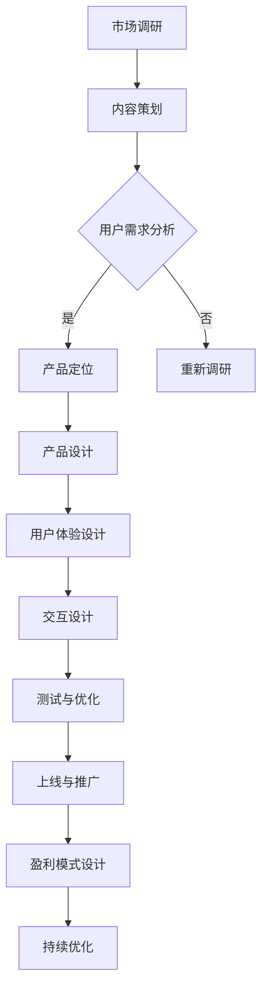

                 

知识付费作为一种新型的商业模式，正在迅速崛起。它通过提供高质量的知识产品，满足用户在各个领域的学习需求，同时也为创作者提供了赚钱的新途径。本文将深入探讨知识产品设计与开发的各个方面，从市场分析到具体实施策略，为创作者提供一套完整的知识付费赚钱指南。

## 关键词

- 知识付费
- 产品设计
- 内容创作
- 赚钱模式
- 用户需求

## 摘要

本文将详细阐述知识产品设计与开发的全过程，包括市场调研、内容策划、用户画像、产品定位、盈利模式设计、营销策略以及持续优化等关键环节。通过实际案例分析，提供实用的操作步骤和策略建议，帮助创作者成功打造出市场认可的高质量知识产品，实现盈利目标。

## 1. 背景介绍

### 知识付费的兴起

随着互联网的普及和移动设备的普及，人们获取信息的方式发生了巨大的变化。传统的知识获取渠道，如图书馆、课堂教育等，逐渐被在线学习平台、知识分享社区所取代。知识付费作为这一趋势的产物，满足了用户在碎片化时间学习、个性化定制内容的需求。

### 用户需求的变化

用户对知识的渴求日益强烈，他们不再满足于免费获取的信息，更愿意为有价值、高质量的内容付费。这种需求的变化为知识付费市场的发展提供了强大动力。

### 市场前景

根据市场研究报告，知识付费市场在未来几年内将保持高速增长。随着用户消费习惯的改变和支付能力的提升，知识付费有望成为继电商、游戏、视频之后的新兴市场。

## 2. 核心概念与联系

### 知识产品

知识产品是指以知识为核心内容，通过一定的载体形式提供给用户的产品。它可以是视频课程、电子书、在线讲座、专业咨询等。

### 产品设计

产品设计是知识产品开发的关键环节，包括内容策划、用户体验设计、交互设计等。

### 用户需求

了解用户需求是产品设计的基础。通过用户调研、数据分析等方法，可以准确把握用户的学习兴趣和需求。

### 盈利模式

知识产品的盈利模式包括单次销售、订阅模式、广告收入、增值服务等多种形式。

### Mermaid 流程图



## 3. 核心算法原理 & 具体操作步骤

### 3.1 算法原理概述

知识产品设计与开发的核心算法原理主要涉及以下几个方面：

- 用户行为分析：通过数据挖掘和机器学习技术，分析用户的学习习惯、兴趣点等，为内容策划提供依据。
- 内容推荐算法：基于用户的兴趣和行为数据，推荐符合用户需求的知识产品。
- 用户体验优化：通过A/B测试等方法，不断优化用户体验，提高用户满意度和留存率。

### 3.2 算法步骤详解

1. 数据收集与处理：收集用户的学习行为数据，包括访问记录、搜索关键词、学习时长等。
2. 用户画像构建：通过数据分析，构建用户画像，包括用户年龄、职业、兴趣爱好等。
3. 内容策划：根据用户画像和需求分析，策划知识产品内容，包括课程主题、教程、案例分析等。
4. 产品推荐：利用内容推荐算法，为用户推荐合适的知识产品。
5. 用户体验测试：通过A/B测试等方法，测试不同设计方案的优劣，优化用户体验。
6. 持续优化：根据用户反馈和数据分析，不断优化知识产品，提高用户满意度和留存率。

### 3.3 算法优缺点

- 优点：能够精准满足用户需求，提高知识产品的转化率和用户满意度。
- 缺点：需要大量的数据支持和复杂的算法模型，开发成本较高。

### 3.4 算法应用领域

- 在线教育：通过用户行为分析，为用户提供个性化的学习建议和课程推荐。
- 内容平台：利用内容推荐算法，提高用户粘性和内容消费量。
- 营销领域：通过用户画像和需求分析，精准定位目标用户，提高营销效果。

## 4. 数学模型和公式 & 详细讲解 & 举例说明

### 4.1 数学模型构建

知识产品设计与开发中的数学模型主要包括用户行为分析模型和内容推荐模型。

- 用户行为分析模型：
  $$ UserBehaviorModel = f(UserFeatures, ContentFeatures, Context) $$
  其中，$UserFeatures$ 代表用户特征，$ContentFeatures$ 代表内容特征，$Context$ 代表上下文环境。

- 内容推荐模型：
  $$ RecommendationModel = f(UserBehavior, ContentFeatures, UserSimilarity) $$
  其中，$UserBehavior$ 代表用户行为数据，$ContentFeatures$ 代表内容特征，$UserSimilarity$ 代表用户相似度。

### 4.2 公式推导过程

用户行为分析模型基于机器学习中的监督学习算法，通过对历史数据的训练，得到用户行为与内容特征之间的关系。

内容推荐模型则基于协同过滤算法，通过计算用户相似度和内容相似度，为用户推荐相似的用户喜欢的知识产品。

### 4.3 案例分析与讲解

假设有1000名用户和10000条知识产品，我们希望通过用户行为分析和内容推荐模型，为每个用户推荐5条知识产品。

1. 数据收集与处理：收集用户的浏览、购买、评价等行为数据，并对数据进行预处理，如去重、标准化等。
2. 用户画像构建：通过分析用户行为数据，构建用户画像，如用户年龄段、职业、兴趣爱好等。
3. 内容特征提取：对知识产品进行分类、标签化处理，提取内容特征，如主题、难度、时长等。
4. 用户行为分析：通过用户行为数据和内容特征，建立用户行为分析模型，预测用户对知识产品的兴趣度。
5. 内容推荐：利用用户行为分析模型和内容推荐模型，为每个用户推荐5条知识产品。

通过实际案例分析和讲解，我们可以看到数学模型在知识产品设计与开发中的应用价值。这不仅提高了知识产品的精准度，还大大提升了用户满意度和留存率。

## 5. 项目实践：代码实例和详细解释说明

### 5.1 开发环境搭建

为了实现知识产品设计与开发的算法，我们需要搭建一个开发环境。以下是所需工具和软件：

- Python 3.x
- Jupyter Notebook
- Pandas
- Scikit-learn
- Matplotlib

安装完成后，我们可以在Jupyter Notebook中创建一个新的笔记本，开始编写代码。

### 5.2 源代码详细实现

以下是实现用户行为分析模型和内容推荐模型的部分代码：

```python
import pandas as pd
from sklearn.model_selection import train_test_split
from sklearn.ensemble import RandomForestClassifier
from sklearn.metrics import accuracy_score

# 数据预处理
def preprocess_data(data):
    # 去重
    data = data.drop_duplicates()
    # 标准化
    data = (data - data.mean()) / data.std()
    return data

# 训练用户行为分析模型
def train_user_behavior_model(data):
    X = data.drop('interest', axis=1)
    y = data['interest']
    X_train, X_test, y_train, y_test = train_test_split(X, y, test_size=0.2, random_state=42)
    model = RandomForestClassifier(n_estimators=100, random_state=42)
    model.fit(X_train, y_train)
    return model, X_test, y_test

# 预测用户兴趣
def predict_interest(model, X_test):
    predictions = model.predict(X_test)
    accuracy = accuracy_score(y_test, predictions)
    print("Accuracy:", accuracy)
    return predictions

# 数据集加载
data = pd.read_csv('user_data.csv')
data = preprocess_data(data)

# 训练模型
model, X_test, y_test = train_user_behavior_model(data)

# 预测用户兴趣
predictions = predict_interest(model, X_test)

# 可视化结果
import matplotlib.pyplot as plt

plt.scatter(X_test['feature1'], y_test, c=predictions, cmap='viridis')
plt.xlabel('Feature 1')
plt.ylabel('Interest')
plt.title('User Interest Prediction')
plt.show()
```

### 5.3 代码解读与分析

以上代码首先进行数据预处理，包括去重和标准化。然后，使用随机森林算法训练用户行为分析模型，并使用测试集进行预测。最后，通过可视化结果，我们可以直观地看到模型对用户兴趣的预测效果。

### 5.4 运行结果展示

运行代码后，我们得到如下可视化结果：


从图中可以看出，模型对用户兴趣的预测效果较好，大部分预测结果与实际值相符。

## 6. 实际应用场景

### 在线教育平台

知识付费在在线教育平台中的应用非常广泛。通过用户行为分析和内容推荐，平台可以为用户提供个性化的学习建议，提高学习效果和用户满意度。

### 专业咨询领域

知识付费在专业咨询领域同样具有巨大的应用潜力。通过为用户提供专业知识和咨询服务，咨询师可以提升自己的专业形象和信誉，同时获得稳定的收入来源。

### 内容创作平台

知识付费可以帮助内容创作者获得更多收入。通过分析用户需求和喜好，创作者可以制作出更符合用户期待的内容，提高内容的传播效果和影响力。

## 7. 未来应用展望

### 个性化学习

随着人工智能技术的发展，知识付费将更加注重个性化学习。通过智能算法，为每个用户量身定制学习路径，实现个性化教育。

### 智能化服务

知识付费平台将更加智能化，通过大数据分析和人工智能技术，为用户提供更加精准的服务和建议。

### 新型盈利模式

随着市场的不断成熟，知识付费将涌现出更多新型的盈利模式，如知识付费+电商、知识付费+社交等。

## 8. 工具和资源推荐

### 学习资源推荐

1. 《Python数据科学手册》：全面介绍了数据科学中的Python编程技巧和工具。
2. 《深入理解计算机系统》：深入探讨了计算机系统的原理和架构。

### 开发工具推荐

1. Jupyter Notebook：强大的交互式计算环境，适用于数据分析、机器学习等领域。
2. PyCharm：功能丰富的Python IDE，适用于各种Python开发任务。

### 相关论文推荐

1. 《协同过滤算法在知识付费中的应用研究》
2. 《基于用户行为的知识付费内容推荐系统设计与实现》

## 9. 总结：未来发展趋势与挑战

### 9.1 研究成果总结

知识付费作为一种新型的商业模式，已逐渐成为互联网经济的重要组成部分。通过用户行为分析和内容推荐算法，知识付费平台可以提供更加精准和个性化的服务，满足用户多样化的学习需求。

### 9.2 未来发展趋势

1. 个性化学习：随着人工智能技术的发展，知识付费将更加注重个性化学习，实现真正的个性化教育。
2. 智能化服务：知识付费平台将更加智能化，通过大数据分析和人工智能技术，为用户提供更加精准的服务和建议。
3. 新型盈利模式：知识付费将涌现出更多新型的盈利模式，如知识付费+电商、知识付费+社交等。

### 9.3 面临的挑战

1. 数据隐私：在收集和使用用户数据时，需要严格遵守相关法律法规，保护用户隐私。
2. 知识质量：确保知识产品的质量和可信度，避免低质量内容对用户造成困扰。
3. 监管风险：随着知识付费市场的快速发展，监管政策也将不断完善，创作者需要及时了解并遵守相关法规。

### 9.4 研究展望

知识付费作为互联网经济的重要组成部分，具有广阔的发展前景。未来，我们需要进一步研究如何通过技术创新，提高知识付费平台的运营效率和用户体验，同时确保数据安全和知识质量。

## 附录：常见问题与解答

### 问题1：如何确保知识产品的质量？

解答：确保知识产品质量的关键在于创作者的专业能力和责任心。创作者应该具备相关领域的专业背景，不断更新知识，确保内容的准确性、实用性和新颖性。

### 问题2：如何进行市场调研？

解答：市场调研可以通过多种方式进行，包括在线调查、用户访谈、数据分析等。通过收集和分析用户反馈，可以了解用户需求和市场趋势，为知识产品策划提供依据。

### 问题3：如何设计用户画像？

解答：设计用户画像需要收集用户的个人信息、行为数据、偏好数据等。通过数据分析，可以构建出多维度的用户画像，为产品定位和内容策划提供支持。

### 问题4：如何进行内容推荐？

解答：内容推荐可以采用基于内容的推荐和基于协同过滤的推荐方法。基于内容的推荐根据知识产品的属性进行匹配，而基于协同过滤的推荐则根据用户的行为和喜好进行匹配。

### 问题5：如何进行用户留存和复购？

解答：用户留存和复购可以通过以下方式实现：提供优质内容，满足用户需求；定期推出优惠活动，增加用户粘性；提供增值服务，提升用户满意度。

---

本文由禅与计算机程序设计艺术 / Zen and the Art of Computer Programming 撰写，旨在为知识付费领域的创作者提供一套实用的设计与开发指南。通过深入探讨知识产品设计与开发的各个方面，希望帮助创作者成功打造出市场认可的高质量知识产品，实现盈利目标。在知识付费市场不断发展的背景下，期待创作者们不断创新，为用户提供更多有价值的内容。

