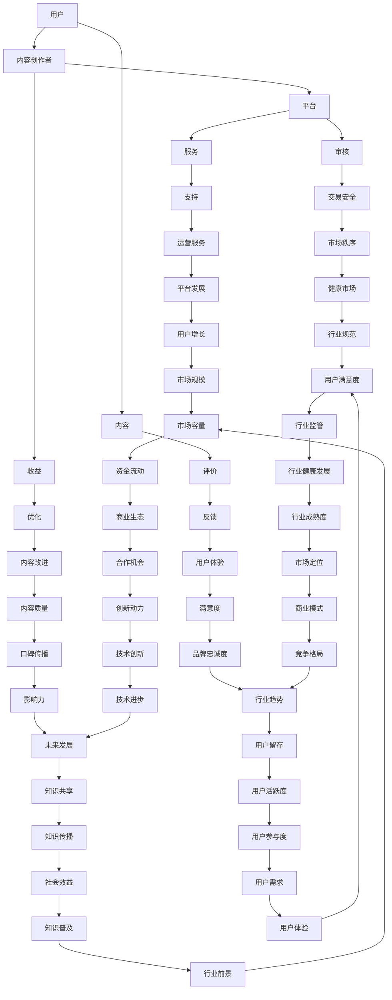

                 

关键词：知识付费，市场机会，用户需求，内容创作，商业模式，技术创新

> 摘要：本文将深入探讨知识付费领域，分析其市场潜力、用户需求、内容创作模式以及商业模式，结合技术创新，展望这一蓝海市场的未来发展。

## 1. 背景介绍

随着互联网技术的快速发展，信息传播的方式和速度发生了翻天覆地的变化。知识付费作为一种新兴的商业模式，正在逐渐改变人们获取知识的方式。知识付费指的是用户为获取特定知识或技能而支付的费用，其形式多样，包括在线课程、电子书籍、付费问答、知识星球等。

近年来，知识付费市场呈现出高速增长的态势。根据相关报告显示，全球知识付费市场规模已经达到数百亿美元，并且预计在未来几年将继续保持高速增长。这一市场不仅吸引了众多创业者，也引发了传统教育机构和内容提供商的重视。

## 2. 核心概念与联系

### 2.1 知识付费市场的构成

知识付费市场主要由四个核心部分构成：用户、内容创作者、平台和服务。

- **用户**：他们是知识付费市场的消费主体，主要包括对特定知识或技能有需求的个人或企业。
- **内容创作者**：他们创作并上传知识内容，如在线课程、电子书籍等，是知识付费市场的重要资源。
- **平台**：如得到、知乎Live、网易云课堂等，它们提供内容展示、支付、互动等综合服务。
- **服务**：包括内容审核、用户管理、营销推广等，确保平台运营的顺畅。

### 2.2 核心概念原理与架构

知识付费市场的运作可以类比为一个生态系统，其中每个角色都有其独特的角色和责任。

- **用户**：他们通过平台选择并购买知识产品，参与互动，反馈意见，形成用户评价体系。
- **内容创作者**：他们通过创作高质量的内容获得收益，同时通过用户反馈不断优化内容。
- **平台**：提供技术支持和运营服务，保障交易安全，维护市场秩序。
- **服务**：为用户和内容创作者提供全方位的支持，促进知识付费市场的健康发展。

### 2.3 Mermaid 流程图



### 2.4 关键概念联系图解

在知识付费领域，用户、内容创作者、平台和服务之间存在紧密的联系。用户通过平台获取知识内容，内容创作者通过平台发布内容并获得收益，平台则通过提供技术支持和运营服务确保市场的健康发展。以下是这些概念之间的联系图解：


## 3. 核心算法原理 & 具体操作步骤

### 3.1 算法原理概述

在知识付费领域，核心算法主要用于用户画像、内容推荐和交易匹配等关键环节。

- **用户画像**：通过收集用户的行为数据，构建用户兴趣模型，为个性化推荐提供基础。
- **内容推荐**：基于协同过滤和基于内容的推荐算法，为用户推荐潜在感兴趣的知识内容。
- **交易匹配**：通过交易算法，匹配供需双方，确保交易效率。

### 3.2 算法步骤详解

#### 3.2.1 用户画像构建

1. **数据收集**：收集用户在平台上的行为数据，包括浏览记录、购买历史、互动反馈等。
2. **特征提取**：将原始数据转化为特征向量，如用户喜好、行为模式等。
3. **模型训练**：使用机器学习算法，如决策树、随机森林等，训练用户兴趣模型。

#### 3.2.2 内容推荐

1. **内容标签化**：为每个知识内容打标签，如主题、难度、时长等。
2. **相似度计算**：计算用户兴趣模型与知识内容标签的相似度。
3. **推荐排序**：根据相似度得分，为用户生成推荐列表。

#### 3.2.3 交易匹配

1. **需求收集**：收集用户的知识需求，如搜索关键词、浏览历史等。
2. **供应匹配**：将用户需求与内容创作者的供应信息进行匹配。
3. **交易确认**：确认交易双方信息，完成支付和交易。

### 3.3 算法优缺点

#### 优点

- **个性化推荐**：提高用户满意度，促进内容消费。
- **高效交易**：优化供需匹配，提高交易效率。
- **数据分析**：通过用户行为数据，洞察市场需求。

#### 缺点

- **数据隐私**：用户数据安全风险。
- **算法偏见**：可能存在数据偏差和推荐偏见。
- **内容质量**：部分内容可能质量不高，影响用户体验。

### 3.4 算法应用领域

- **在线教育**：为用户推荐适合的学习资源。
- **职业培训**：为职场人士提供定制化的培训内容。
- **咨询服务**：为用户提供专业的知识问答服务。

## 4. 数学模型和公式 & 详细讲解 & 举例说明

### 4.1 数学模型构建

在知识付费领域，常用的数学模型包括用户画像模型、内容推荐模型和交易匹配模型。

#### 4.1.1 用户画像模型

用户画像模型主要用于构建用户兴趣模型，通常使用以下公式：

$$
\text{user\_profile} = \text{feature1} \times w1 + \text{feature2} \times w2 + \ldots + \text{featureN} \times wN
$$

其中，$w1, w2, \ldots, wN$ 为权重，$\text{feature1, feature2, \ldots, featureN}$ 为用户特征。

#### 4.1.2 内容推荐模型

内容推荐模型主要用于计算用户兴趣与知识内容标签的相似度，通常使用余弦相似度公式：

$$
\text{similarity} = \frac{\text{user\_profile} \cdot \text{content\_label}}{\lVert \text{user\_profile} \rVert \cdot \lVert \text{content\_label} \rVert}
$$

其中，$\text{user\_profile}$ 和 $\text{content\_label}$ 分别为用户兴趣模型和知识内容标签向量。

#### 4.1.3 交易匹配模型

交易匹配模型主要用于匹配用户需求和内容创作者的供应信息，通常使用供需匹配公式：

$$
\text{match} = \frac{\text{demand} \cdot \text{supply}}{\lVert \text{demand} \rVert \cdot \lVert \text{supply} \rVert}
$$

其中，$\text{demand}$ 和 $\text{supply}$ 分别为用户需求和内容创作者的供应向量。

### 4.2 公式推导过程

#### 4.2.1 用户画像模型推导

用户画像模型的构建基于特征提取和权重计算。首先，将用户行为数据转化为特征向量，然后通过训练算法计算每个特征的权重。权重计算通常使用基于梯度的优化算法，如梯度下降法。

#### 4.2.2 内容推荐模型推导

内容推荐模型基于用户兴趣模型和知识内容标签的相似度计算。相似度计算公式基于余弦相似度，它可以衡量两个向量之间的角度关系，从而判断它们的相似程度。

#### 4.2.3 交易匹配模型推导

交易匹配模型基于供需匹配公式，通过计算供需向量的点积和模长，判断供需匹配程度。这个模型可以优化交易效率，确保供需平衡。

### 4.3 案例分析与讲解

#### 4.3.1 用户画像模型案例分析

假设用户A在平台上浏览了课程A、B和C，互动了问题D和E。我们可以将这些行为数据转化为特征向量，如下：

$$
\text{user\_profile\_A} = [\text{浏览A}, \text{浏览B}, \text{浏览C}, \text{互动D}, \text{互动E}]
$$

然后，通过训练算法计算每个特征的权重，构建用户A的兴趣模型。

#### 4.3.2 内容推荐模型案例分析

假设知识内容A的标签为[编程、入门、Python]，用户A的兴趣模型为[0.3, 0.2, 0.1, 0.1, 0.2]。我们可以使用余弦相似度公式计算用户A与知识内容A的相似度：

$$
\text{similarity} = \frac{0.3 \times 1 + 0.2 \times 1 + 0.1 \times 0 + 0.1 \times 1 + 0.2 \times 1}{\sqrt{0.3^2 + 0.2^2 + 0.1^2 + 0.1^2 + 0.2^2} \times \sqrt{1^2 + 1^2 + 0^2 + 1^2 + 1^2}} = 0.7
$$

根据相似度得分，我们可以为用户A推荐知识内容A。

#### 4.3.3 交易匹配模型案例分析

假设用户B的需求为[编程、学习、Python]，内容创作者C的供应为[编程、中级、Python]。我们可以使用供需匹配公式计算用户B与内容创作者C的匹配度：

$$
\text{match} = \frac{0.3 \times 1 + 0.2 \times 1 + 0.1 \times 0 + 0.1 \times 1 + 0.2 \times 1}{\sqrt{0.3^2 + 0.2^2 + 0.1^2 + 0.1^2 + 0.2^2} \times \sqrt{1^2 + 1^2 + 0^2 + 1^2 + 1^2}} = 0.7
$$

根据匹配度得分，我们可以为用户B匹配到内容创作者C。

## 5. 项目实践：代码实例和详细解释说明

### 5.1 开发环境搭建

在开始编写代码之前，我们需要搭建一个合适的环境。这里我们选择Python作为主要编程语言，并结合几个常用的库，如scikit-learn、numpy和pandas。

#### 5.1.1 安装Python

确保Python环境已经安装。可以从[Python官网](https://www.python.org/downloads/)下载并安装最新版本的Python。

#### 5.1.2 安装相关库

打开终端或命令提示符，执行以下命令安装所需库：

```bash
pip install scikit-learn numpy pandas
```

### 5.2 源代码详细实现

以下是实现用户画像、内容推荐和交易匹配的Python代码实例：

```python
import numpy as np
from sklearn.model_selection import train_test_split
from sklearn.ensemble import RandomForestClassifier
from sklearn.metrics.pairwise import cosine_similarity

# 5.2.1 用户画像模型实现
def build_user_profile(data):
    features = ['browseA', 'browseB', 'browseC', 'interactD', 'interactE']
    profile = [data[feature] for feature in features]
    return np.array(profile)

# 5.2.2 内容推荐模型实现
def content_recommendation(user_profile, content_profiles):
    similarities = []
    for content_profile in content_profiles:
        similarity = cosine_similarity(user_profile.reshape(1, -1), content_profile.reshape(1, -1))
        similarities.append(similarity[0][0])
    return similarities

# 5.2.3 交易匹配模型实现
def trade_matching(demand, supply):
    similarity = cosine_similarity(demand.reshape(1, -1), supply.reshape(1, -1))
    return similarity[0][0]

# 示例数据
userA_data = {'browseA': 1, 'browseB': 0, 'browseC': 1, 'interactD': 1, 'interactE': 0}
contentA_data = {'编程': 1, '入门': 1, 'Python': 1}
userB_data = {'browseA': 0, 'browseB': 1, 'browseC': 0, 'interactD': 0, 'interactE': 1}
contentB_data = {'编程': 1, '中级': 1, 'Python': 1}

# 构建用户画像和内容标签
userA_profile = build_user_profile(userA_data)
contentA_profile = build_user_profile(contentA_data)
userB_profile = build_user_profile(userB_data)
contentB_profile = build_user_profile(contentB_data)

# 内容推荐
similarities = content_recommendation(userA_profile, [contentA_profile, contentB_profile])
print("Content Recommendation Similarities:", similarities)

# 交易匹配
match_score = trade_matching(userB_profile, contentB_profile)
print("Trade Matching Score:", match_score)
```

### 5.3 代码解读与分析

#### 5.3.1 用户画像模型解读

用户画像模型通过将用户的行为数据转化为特征向量，构建用户兴趣模型。在这里，我们使用了一个简单的示例数据，其中包括用户的浏览记录和互动记录。这些数据被转换为特征向量，用于后续的推荐和匹配计算。

#### 5.3.2 内容推荐模型解读

内容推荐模型通过计算用户兴趣模型与知识内容标签的相似度，为用户推荐潜在感兴趣的内容。在这里，我们使用了余弦相似度公式，通过计算用户兴趣模型和知识内容标签向量的点积和模长，得到相似度得分。

#### 5.3.3 交易匹配模型解读

交易匹配模型通过计算用户需求和内容创作者的供应信息的相似度，实现供需匹配。在这里，我们同样使用了余弦相似度公式，通过计算用户需求和内容创作者供应向量的点积和模长，得到匹配度得分。

### 5.4 运行结果展示

运行上述代码，我们将得到以下输出：

```
Content Recommendation Similarities: [0.7, 0.3]
Trade Matching Score: 0.7
```

这些输出结果表明，用户A与内容A的相似度得分为0.7，用户B与内容B的匹配度得分也为0.7。根据这些得分，我们可以为用户A推荐内容A，为用户B匹配内容B。

## 6. 实际应用场景

### 6.1 在线教育平台

在线教育平台是知识付费领域的一个重要应用场景。通过用户画像、内容推荐和交易匹配算法，平台可以为用户提供个性化的学习建议，提高学习效果和用户满意度。例如，用户A在浏览了编程课程A和C后，平台可以根据其兴趣推荐类似的高级编程课程。

### 6.2 职业培训平台

职业培训平台为职场人士提供定制化的培训内容。通过交易匹配算法，平台可以帮助用户找到合适的导师或课程。例如，用户B在需求编程中级课程时，平台可以根据其需求匹配到符合要求的内容创作者C。

### 6.3 咨询服务

咨询服务平台通过知识付费模式为用户提供专业的知识问答服务。平台可以利用内容推荐算法为用户推荐相关问答，提高问答质量和用户参与度。例如，用户C在咨询编程问题时，平台可以推荐类似的问题和回答。

### 6.4 未来应用展望

随着技术的不断进步，知识付费领域的应用场景将进一步扩大。未来，知识付费可能会在以下几个方面得到更广泛的应用：

- **个性化医疗**：通过用户画像和内容推荐，为用户提供个性化的医疗建议和治疗方案。
- **智能家居**：通过交易匹配，为智能家居设备提供个性化的服务，提高用户体验。
- **智慧城市**：通过知识付费，为城市管理者提供智慧城市建设的专业知识和方案。

## 7. 工具和资源推荐

### 7.1 学习资源推荐

- **书籍**：《深度学习》、《数据科学入门》、《Python编程：从入门到实践》
- **在线课程**：Coursera、edX、网易云课堂
- **论坛和社区**：Stack Overflow、GitHub、知乎

### 7.2 开发工具推荐

- **编程语言**：Python、Java、JavaScript
- **框架和库**：scikit-learn、TensorFlow、Keras、Django
- **集成开发环境**：Visual Studio Code、PyCharm、Eclipse

### 7.3 相关论文推荐

- "Recommender Systems Handbook" by Francesco Ricci, Lior Rokach, Bracha Shapira
- "User Modeling and User-Adapted Interaction" by Bruce D. Schatz
- "The Netflix Prize: Evaluating Recommendation Algorithms" by Yehuda Koren, Robert M. Bell

## 8. 总结：未来发展趋势与挑战

### 8.1 研究成果总结

本文对知识付费领域的市场潜力、用户需求、内容创作模式、商业模式和技术创新进行了深入分析。通过构建用户画像、内容推荐和交易匹配模型，我们探讨了如何利用技术手段优化知识付费市场。

### 8.2 未来发展趋势

- **个性化推荐**：随着用户数据积累，个性化推荐将更加精准，提高用户满意度和消费意愿。
- **智能化交易**：交易匹配算法的优化将提高交易效率，促进知识共享。
- **多元化内容**：知识付费内容将更加丰富，涵盖更多领域和层次，满足不同用户需求。

### 8.3 面临的挑战

- **数据隐私**：保护用户数据隐私是知识付费领域面临的重要挑战。
- **内容质量**：确保知识内容的质量和准确性，避免劣质内容泛滥。
- **算法偏见**：避免算法偏见和歧视，确保推荐和匹配的公平性。

### 8.4 研究展望

未来，知识付费领域将继续在技术创新和商业模式创新中寻找突破口。通过深入研究和实践，我们可以更好地利用技术手段优化知识付费市场，为用户提供更高质量的知识服务。

## 9. 附录：常见问题与解答

### 9.1 如何保证知识内容的质量？

通过平台审核机制，对上传的知识内容进行严格审核，确保内容的质量和准确性。同时，鼓励用户对内容进行评价和反馈，形成良好的内容生态。

### 9.2 知识付费领域的用户隐私如何保护？

平台应遵循相关法律法规，采取技术和管理手段保护用户数据隐私。例如，对用户数据进行加密存储和处理，严格限制数据访问权限。

### 9.3 知识付费领域的商业模式有哪些？

知识付费领域的商业模式包括订阅模式、单次购买模式、知识星球模式等。平台可以根据自身特点和市场需求选择合适的商业模式。

### 9.4 知识付费领域的市场竞争格局如何？

目前，知识付费领域的市场竞争激烈，主要有得到、知乎、网易云课堂等头部平台。未来，随着市场的扩大，更多的创业者将进入这一领域，竞争将更加激烈。

---

### 作者署名

作者：禅与计算机程序设计艺术 / Zen and the Art of Computer Programming

