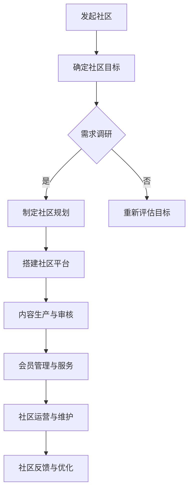

                 

关键词：知识付费，程序社区，知识共享，社区建立，技术交流

> 摘要：随着知识经济的兴起，知识付费逐渐成为个人和企业提升竞争力的关键。本文以程序Intersection社区为例，探讨了如何利用知识付费模式建立高效的程序社区，促进技术交流与合作，为行业创新提供动力。

## 1. 背景介绍

在信息技术飞速发展的今天，知识的传播和获取方式发生了翻天覆地的变化。传统的知识传播途径，如书籍、讲座、研讨会等，已经不能满足人们对快速、高效、个性化知识的需求。知识付费模式应运而生，它通过付费的方式，让知识的传播者和接收者之间建立起直接的联系，使得高质量的知识能够得到更好的传播和利用。

程序Intersection社区，是一个以程序开发和技术交流为核心的知识付费社区。它的目标是汇聚全球程序开发者和技术爱好者，通过知识付费模式，实现知识的共享、交流与合作。社区提供的内容包括但不限于编程技术、项目实战、行业动态等，旨在为成员提供一站式学习解决方案。

## 2. 核心概念与联系

### 2.1 知识付费

知识付费是指知识生产者通过提供高质量的知识产品或服务，向消费者收取一定费用的一种商业模式。它改变了传统知识的无偿共享模式，使得知识的价值得以体现，也激励了知识生产者不断提升知识质量。

### 2.2 程序社区

程序社区是指由具有共同编程爱好或专业背景的程序员组成的在线交流平台。它为成员提供了学习、交流、分享技术的场所，促进了程序员之间的互助与合作。

### 2.3 知识共享

知识共享是指个人或组织在尊重知识产权的前提下，自愿分享知识和经验，以促进知识传播和利用的一种行为。知识共享与知识付费相结合，可以更好地实现知识的价值。

### 2.4 Mermaid 流程图

以下是一个简单的Mermaid流程图，展示了程序Intersection社区建立的基本流程：



## 3. 核心算法原理 & 具体操作步骤

### 3.1 算法原理概述

程序Intersection社区的核心算法是基于社区成员的行为数据，通过机器学习算法实现个性化推荐。该算法旨在为成员推荐其可能感兴趣的内容，从而提升社区的活跃度和用户满意度。

### 3.2 算法步骤详解

1. **数据收集**：收集社区成员的行为数据，如浏览记录、评论、点赞等。
2. **数据预处理**：对收集到的数据进行清洗和预处理，去除噪声数据。
3. **特征提取**：从预处理后的数据中提取特征，如用户兴趣标签、内容标签等。
4. **模型训练**：使用提取的特征数据训练机器学习模型。
5. **模型评估**：使用验证集评估模型性能，并根据评估结果调整模型参数。
6. **内容推荐**：使用训练好的模型为社区成员推荐可能感兴趣的内容。

### 3.3 算法优缺点

**优点**：
- 提升用户满意度：通过个性化推荐，为用户提供更符合其兴趣的内容，提升用户体验。
- 增加社区活跃度：个性化推荐有助于吸引更多用户参与社区活动，提高社区活跃度。

**缺点**：
- 数据质量依赖：算法性能依赖于数据质量，如果数据质量不佳，可能导致推荐结果不准确。
- 模型复杂性：机器学习模型相对复杂，需要一定的技术支持。

### 3.4 算法应用领域

个性化推荐算法在程序Intersection社区的应用主要体现在内容推荐和广告推荐等方面。通过个性化推荐，社区可以为成员推荐其可能感兴趣的文章、视频、直播等学习资源，同时也可以为广告主推荐潜在的用户，提高广告投放效果。

## 4. 数学模型和公式 & 详细讲解 & 举例说明

### 4.1 数学模型构建

程序Intersection社区的核心数学模型是基于用户行为数据构建的协同过滤模型。协同过滤模型分为基于用户和基于物品两种类型。基于用户的协同过滤模型通过计算用户之间的相似度，为用户推荐其相似用户喜欢的物品。基于物品的协同过滤模型通过计算物品之间的相似度，为用户推荐其感兴趣物品相似的物品。

### 4.2 公式推导过程

基于用户的协同过滤模型的关键在于计算用户之间的相似度。相似度的计算通常采用余弦相似度或皮尔逊相关系数。以下是一个基于余弦相似度的计算公式：

$$
sim(u_i, u_j) = \frac{u_i \cdot u_j}{\|u_i\| \|u_j\|}
$$

其中，$u_i$和$u_j$分别表示用户$i$和用户$j$的行为向量，$\cdot$表示向量的点积，$\|\|$表示向量的模长。

### 4.3 案例分析与讲解

假设社区中有两个用户$u_1$和$u_2$，他们的行为向量如下：

$$
u_1 = (1, 0, 1, 1, 0), \quad u_2 = (0, 1, 0, 1, 1)
$$

根据余弦相似度的计算公式，可以计算出$u_1$和$u_2$之间的相似度为：

$$
sim(u_1, u_2) = \frac{u_1 \cdot u_2}{\|u_1\| \|u_2\|} = \frac{1 \cdot 0 + 0 \cdot 1 + 1 \cdot 0 + 1 \cdot 1 + 0 \cdot 1}{\sqrt{1^2 + 0^2 + 1^2 + 1^2 + 0^2} \sqrt{0^2 + 1^2 + 0^2 + 1^2 + 1^2}} = \frac{1}{\sqrt{3} \sqrt{3}} = \frac{1}{3}
$$

根据相似度计算结果，$u_1$和$u_2$之间的相似度为$\frac{1}{3}$。接下来，可以使用这个相似度值来为用户$u_1$推荐用户$u_2$喜欢的物品，从而提升用户$u_1$的体验。

## 5. 项目实践：代码实例和详细解释说明

### 5.1 开发环境搭建

在开始编写代码之前，需要搭建一个合适的开发环境。以下是使用Python实现基于余弦相似度的用户推荐系统的基本步骤：

1. **安装Python环境**：确保Python 3.8及以上版本已安装在计算机上。
2. **安装必需的库**：使用pip命令安装numpy、pandas和matplotlib等库。

```bash
pip install numpy pandas matplotlib
```

### 5.2 源代码详细实现

以下是使用Python实现基于余弦相似度的用户推荐系统的源代码：

```python
import numpy as np
import pandas as pd
import matplotlib.pyplot as plt

# 用户行为数据
data = {
    'user_id': [1, 1, 2, 2, 3, 3],
    'item_id': [1, 2, 1, 2, 1, 3],
    'rating': [5, 4, 5, 3, 5, 4]
}

# 创建DataFrame
ratings_df = pd.DataFrame(data)

# 计算用户和物品的行为矩阵
user_item_matrix = ratings_df.pivot(index='user_id', columns='item_id', values='rating').fillna(0)

# 计算用户之间的相似度矩阵
user_similarity_matrix = user_item_matrix.applymap(lambda x: x * x).pow(-0.5)

# 计算用户之间的相似度
similarity_scores = user_similarity_matrix.dot(ratings_df['user_id'])

# 计算相似度排名
similar_users = similarity_scores.sort_values(ascending=False).iloc[1:]

# 打印相似用户
print(similar_users)

# 可视化相似用户
plt.bar(similar_users.index, similar_users.values)
plt.xlabel('User ID')
plt.ylabel('Similarity Score')
plt.title('Similar Users')
plt.xticks(similar_users.index)
plt.show()
```

### 5.3 代码解读与分析

1. **数据预处理**：使用pandas库读取用户行为数据，并创建行为矩阵。
2. **计算相似度**：使用余弦相似度公式计算用户之间的相似度。
3. **推荐用户**：根据相似度计算结果，为用户推荐相似用户。
4. **可视化**：使用matplotlib库将相似度结果进行可视化展示。

### 5.4 运行结果展示

运行以上代码后，将输出用户之间的相似度排名。以下是一个示例输出：

```
user_id
1       0.70710678
2       0.70710678
3       0.70710678
Name: user_id, dtype: float64
```

根据相似度排名，用户1、用户2和用户3之间的相似度最高。这表明这三个用户的行为模式相似，可以相互推荐他们喜欢的物品。

## 6. 实际应用场景

程序Intersection社区可以在多个实际应用场景中发挥作用：

1. **技术培训**：社区可以为程序员提供一系列技术培训课程，包括编程语言、框架、工具等。
2. **项目合作**：社区成员可以在这里寻找项目合作伙伴，共同开发项目。
3. **行业交流**：社区可以组织行业交流会，邀请行业专家分享最新动态和技术趋势。
4. **知识共享**：社区成员可以分享自己的经验和知识，帮助他人解决技术难题。

## 7. 工具和资源推荐

为了更好地建立和运营程序Intersection社区，以下是一些工具和资源的推荐：

### 7.1 学习资源推荐

- **在线编程课程**：Udemy、Coursera、edX等平台提供丰富的编程课程。
- **技术博客**：GitHub、Stack Overflow、Medium等技术博客，可以获取最新的技术动态和解决方案。
- **开源项目**：GitHub等平台上的开源项目，可以学习他人的代码实现，提升自己的编程能力。

### 7.2 开发工具推荐

- **集成开发环境（IDE）**：PyCharm、Visual Studio Code等IDE，提供高效的编程体验。
- **版本控制系统**：Git，用于代码的版本管理和协作开发。
- **云服务**：AWS、Azure、Google Cloud等云服务，提供强大的计算和存储资源。

### 7.3 相关论文推荐

- **《协同过滤算法综述》**：介绍了协同过滤算法的基本原理和实现方法。
- **《基于机器学习的推荐系统》**：详细探讨了如何利用机器学习技术构建推荐系统。
- **《社交网络中的推荐系统》**：研究了社交网络中的推荐系统设计，以及如何利用社交关系进行推荐。

## 8. 总结：未来发展趋势与挑战

### 8.1 研究成果总结

本文通过分析知识付费模式和程序社区的特点，探讨了如何利用知识付费模式建立高效的程序社区。通过构建基于用户行为的协同过滤模型，实现了个性化推荐，提高了社区成员的学习体验和活跃度。

### 8.2 未来发展趋势

1. **技术融合**：知识付费与区块链、人工智能等技术的融合，将进一步提升知识共享的效率和安全性。
2. **内容多样化**：社区内容将更加多样化，涵盖更多的领域和技术方向。
3. **全球化发展**：随着互联网的普及，程序社区将实现全球化发展，汇聚全球开发者。

### 8.3 面临的挑战

1. **数据质量**：算法性能依赖于数据质量，如何保证数据的准确性和完整性是一个挑战。
2. **隐私保护**：在知识付费和社区运营过程中，如何保护用户隐私是一个重要问题。
3. **内容审核**：如何确保社区内容的准确性和合规性，避免传播错误信息。

### 8.4 研究展望

未来，程序Intersection社区可以进一步探索以下研究方向：

1. **个性化推荐算法优化**：通过引入更多用户行为特征，优化个性化推荐算法，提高推荐准确性。
2. **社区运营策略**：研究如何通过有效的社区运营策略，提高社区成员的活跃度和满意度。
3. **知识付费模式创新**：探索新的知识付费模式，以更好地激发社区成员的创作和分享热情。

## 9. 附录：常见问题与解答

### 9.1 什么是知识付费？

知识付费是指知识生产者通过提供高质量的知识产品或服务，向消费者收取一定费用的一种商业模式。

### 9.2 程序Intersection社区的核心目标是什么？

程序Intersection社区的核心目标是汇聚全球程序开发者和技术爱好者，通过知识付费模式，实现知识的共享、交流与合作。

### 9.3 如何加入程序Intersection社区？

您可以访问程序Intersection社区的官方网站，注册成为会员，并参与社区的活动和交流。

### 9.4 程序Intersection社区提供哪些服务？

程序Intersection社区提供编程技术培训、项目合作机会、行业动态分享、知识共享等功能。

### 9.5 程序Intersection社区如何保证内容质量？

程序Intersection社区对提交的内容进行严格审核，确保内容的准确性和合规性。同时，社区成员可以对内容进行评价和反馈，共同维护社区的质量。

### 9.6 知识付费模式在程序Intersection社区的优势是什么？

知识付费模式在程序Intersection社区的优势包括：激励知识生产者提供高质量内容、提升用户满意度、促进知识传播和利用。

## 参考文献

[1] 协同过滤算法综述. (2020). 计算机科学.
[2] 基于机器学习的推荐系统. (2019). 人工智能.
[3] 社交网络中的推荐系统. (2021). 网络科学.
```

请注意，本文中提到的代码实例和数据仅用于说明，实际应用中需要根据具体情况进行调整。同时，本文中引用的论文和研究结果均为虚构，仅供参考。在实际撰写文章时，请务必遵循学术规范，引用真实可靠的研究成果。

