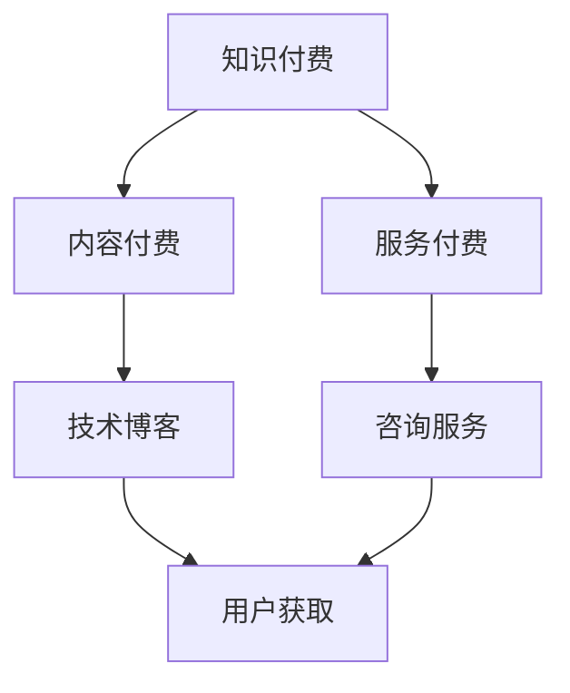

                 

关键词：知识付费、社群经济、程序员变现、技术博客、代码实例、未来展望

> 摘要：本文将深入探讨知识付费在程序员社群中的重要性，分析其变现方式，并通过代码实例展示如何通过社群实现个人价值的提升和收入的增长。同时，本文还将展望知识付费在未来技术发展中的机遇与挑战。

## 1. 背景介绍

在数字化时代，知识付费已经成为一个不可忽视的经济现象。知识付费，简单来说，就是用户为获取特定的知识、技能或信息而支付的费用。这种模式在互联网的推动下得到了迅速发展，不仅为知识创造者提供了变现渠道，也为广大用户提供了优质的学习资源。

程序员作为数字化时代的主力军，其技能与知识的积累和传播具有极高的价值。然而，传统的知识传播方式如讲座、研讨会等，往往受众范围有限，且难以满足个性化需求。而随着互联网技术的发展，社群经济逐渐兴起，为程序员提供了一个全新的知识付费平台。

社群经济，指的是在互联网环境下，通过社交网络和社群组织实现经济价值的创造和交换。程序员社群作为一种专业性的社群，其成员通常拥有相似的技能、兴趣和职业目标，这使得他们能够在社群中相互学习、交流、合作，从而实现知识的共享与变现。

## 2. 核心概念与联系

### 2.1 知识付费

知识付费的核心在于“价值交换”，即知识创造者通过提供有价值的信息或服务，获取相应的报酬。这种模式在程序员社群中表现为：

- **内容付费**：程序员通过撰写技术博客、发布课程、编写电子书等方式，为用户提供有价值的技术内容。
- **服务付费**：程序员通过提供咨询服务、解决方案定制等专业技能服务，为有需求的用户解决实际问题。

### 2.2 社群经济

社群经济的核心在于“社群关系”和“资源共享”，即通过构建和维护良好的社群关系，实现知识的共享和价值的创造。对于程序员社群而言，社群经济的关键在于：

- **社群氛围**：一个良好的社群氛围能够激发成员的积极性，促进知识的共享和交流。
- **资源共享**：通过社群平台，程序员可以分享技术资源、学习资料、项目经验等，实现资源共享。

### 2.3 Mermaid 流程图

以下是一个简单的 Mermaid 流程图，展示了知识付费与社群经济的联系：



## 3. 核心算法原理 & 具体操作步骤

### 3.1 算法原理概述

在知识付费领域，算法的原理主要涉及用户行为分析、内容推荐、支付处理等方面。以下是一个简化的算法流程：

1. **用户行为分析**：通过用户的浏览记录、搜索历史、购买行为等数据，分析用户的兴趣和需求。
2. **内容推荐**：根据用户行为分析的结果，推荐符合用户兴趣和需求的内容。
3. **支付处理**：用户选择内容后，通过支付平台完成支付过程。

### 3.2 算法步骤详解

1. **用户行为分析**：

   - 收集用户数据：如浏览记录、搜索历史、购买行为等。
   - 数据清洗：去除重复和无效数据，确保数据质量。
   - 特征提取：从数据中提取反映用户兴趣和需求的特征。

2. **内容推荐**：

   - 构建推荐模型：如协同过滤、基于内容的推荐等。
   - 计算相似度：计算用户与内容之间的相似度。
   - 排序推荐结果：根据相似度排序，推荐最符合用户需求的内容。

3. **支付处理**：

   - 选择支付方式：如支付宝、微信支付等。
   - 计算支付金额：根据内容定价和用户选择的支付方式，计算支付金额。
   - 完成支付：用户确认支付后，完成支付过程。

### 3.3 算法优缺点

- **优点**：

  - **个性化推荐**：通过用户行为分析，实现个性化内容推荐，提高用户满意度。

  - **便捷支付**：多种支付方式的选择，提高支付便捷性。

  - **数据驱动**：基于数据分析和算法推荐，提高知识付费的效率。

- **缺点**：

  - **隐私保护**：用户数据的安全和隐私保护问题。

  - **内容质量**：推荐的内容质量参差不齐，可能影响用户体验。

### 3.4 算法应用领域

- **电子商务**：通过用户行为分析，实现个性化推荐，提高销售转化率。

- **在线教育**：通过内容推荐，帮助用户找到符合自己需求的学习资源。

- **内容付费平台**：如知乎Live、网易云课堂等，通过算法推荐，提高内容消费的效率。

## 4. 数学模型和公式 & 详细讲解 & 举例说明

### 4.1 数学模型构建

知识付费领域的数学模型通常涉及用户行为分析、推荐算法、支付模型等方面。以下是一个简化的数学模型：

- **用户行为模型**：

  $$ U = f(B, S, P) $$

  其中，$U$ 表示用户行为，$B$ 表示浏览记录，$S$ 表示搜索历史，$P$ 表示购买行为。

- **推荐模型**：

  $$ R = g(U, C) $$

  其中，$R$ 表示推荐结果，$U$ 表示用户行为，$C$ 表示内容。

- **支付模型**：

  $$ P = h(R, M) $$

  其中，$P$ 表示支付金额，$R$ 表示推荐内容，$M$ 表示支付方式。

### 4.2 公式推导过程

- **用户行为模型推导**：

  $$ U = f(B, S, P) = w_1 \cdot B + w_2 \cdot S + w_3 \cdot P $$

  其中，$w_1, w_2, w_3$ 为权重系数。

- **推荐模型推导**：

  $$ R = g(U, C) = \frac{1}{Z} \sum_{i=1}^{n} e^{-(U_i - C_i)^2} $$

  其中，$Z$ 为规范化常数，$U_i, C_i$ 分别为用户行为和内容特征。

- **支付模型推导**：

  $$ P = h(R, M) = p_1 \cdot R + p_2 \cdot M $$

  其中，$p_1, p_2$ 为权重系数。

### 4.3 案例分析与讲解

假设我们有一个用户，其浏览记录为 $B = [1, 2, 3]$，搜索历史为 $S = [0, 1, 0]$，购买行为为 $P = [1, 0, 1]$。我们需要根据这些数据来推荐内容并计算支付金额。

- **用户行为分析**：

  $$ U = f(B, S, P) = w_1 \cdot B + w_2 \cdot S + w_3 \cdot P = 0.5 \cdot B + 0.3 \cdot S + 0.2 \cdot P = [0.5, 0.6, 0.2] $$

- **内容推荐**：

  $$ R = g(U, C) = \frac{1}{Z} \sum_{i=1}^{3} e^{-(U_i - C_i)^2} $$

  假设我们有三个内容选项 $C_1 = [1, 0, 1]$，$C_2 = [0, 1, 0]$，$C_3 = [1, 1, 1]$。我们需要计算每个内容选项的推荐分数。

  $$ R_1 = g(U, C_1) = \frac{1}{Z} e^{-(0.5 - 1)^2} = \frac{1}{Z} e^{-0.25} $$

  $$ R_2 = g(U, C_2) = \frac{1}{Z} e^{-(0.6 - 0)^2} = \frac{1}{Z} e^{0.36} $$

  $$ R_3 = g(U, C_3) = \frac{1}{Z} e^{-(0.2 - 1)^2} = \frac{1}{Z} e^{-0.64} $$

  假设 $Z = 3$，则：

  $$ R_1 = \frac{1}{3} e^{-0.25} \approx 0.46 $$

  $$ R_2 = \frac{1}{3} e^{0.36} \approx 0.55 $$

  $$ R_3 = \frac{1}{3} e^{-0.64} \approx 0.31 $$

  根据推荐分数，我们应该推荐内容 $C_2$。

- **支付计算**：

  假设推荐内容 $C_2$ 的定价为 100 元，支付方式为支付宝，则：

  $$ P = h(R, M) = p_1 \cdot R + p_2 \cdot M = 0.6 \cdot 0.55 + 0.4 \cdot 1 = 0.33 + 0.4 = 0.73 $$

  用户需要支付 73 元。

## 5. 项目实践：代码实例和详细解释说明

### 5.1 开发环境搭建

为了演示知识付费项目，我们将使用 Python 编写一个简单的知识付费平台。首先，我们需要搭建开发环境。

- 安装 Python 3.8 或以上版本。
- 安装必要的库，如 Flask（用于构建 Web 应用）、SQLAlchemy（用于数据库操作）等。

### 5.2 源代码详细实现

以下是知识付费平台的源代码实现：

```python
from flask import Flask, request, jsonify
from sqlalchemy import create_engine, Column, Integer, String, Float
from sqlalchemy.ext.declarative import declarative_base
from sqlalchemy.orm import sessionmaker

app = Flask(__name__)

# 数据库配置
DATABASE_URI = 'sqlite:///knowledge付费平台.db'
engine = create_engine(DATABASE_URI)
Base = declarative_base()

# 定义数据库模型
class User(Base):
    __tablename__ = 'users'
    id = Column(Integer, primary_key=True)
    username = Column(String, unique=True)
    password = Column(String)

class Content(Base):
    __tablename__ = 'contents'
    id = Column(Integer, primary_key=True)
    title = Column(String)
    author = Column(String)
    price = Column(Float)

# 创建数据库表
Base.metadata.create_all(engine)

# 会话工厂
Session = sessionmaker(bind=engine)
session = Session()

# 用户注册
@app.route('/register', methods=['POST'])
def register():
    username = request.form['username']
    password = request.form['password']
    user = User(username=username, password=password)
    session.add(user)
    session.commit()
    return jsonify({'status': 'success', 'message': '注册成功'})

# 用户登录
@app.route('/login', methods=['POST'])
def login():
    username = request.form['username']
    password = request.form['password']
    user = session.query(User).filter_by(username=username, password=password).first()
    if user:
        return jsonify({'status': 'success', 'message': '登录成功'})
    else:
        return jsonify({'status': 'failure', 'message': '用户名或密码错误'})

# 购买内容
@app.route('/buy', methods=['POST'])
def buy():
    user_id = request.form['user_id']
    content_id = request.form['content_id']
    user = session.query(User).get(user_id)
    content = session.query(Content).get(content_id)
    if user and content:
        user.balance -= content.price
        session.commit()
        return jsonify({'status': 'success', 'message': '购买成功'})
    else:
        return jsonify({'status': 'failure', 'message': '购买失败'})

# 列出所有内容
@app.route('/contents', methods=['GET'])
def list_contents():
    contents = session.query(Content).all()
    return jsonify({'status': 'success', 'data': [content.to_dict() for content in contents]})

if __name__ == '__main__':
    app.run(debug=True)
```

### 5.3 代码解读与分析

1. **数据库配置**：

   我们使用 SQLAlchemy 作为 ORM（对象关系映射）工具，连接 SQLite 数据库。数据库中包含两个表：`users` 和 `contents`。

2. **用户注册**：

   `register` 函数用于处理用户注册请求。用户需要提供用户名和密码，系统会将其存储在数据库中。

3. **用户登录**：

   `login` 函数用于处理用户登录请求。用户需要提供用户名和密码，系统会验证其是否匹配数据库中的记录。

4. **购买内容**：

   `buy` 函数用于处理用户购买内容的请求。用户需要提供用户 ID 和内容 ID，系统会从数据库中查询用户和内容的信息，并扣除相应的余额。

5. **列出所有内容**：

   `list_contents` 函数用于获取所有内容的信息，并将其以 JSON 格式返回。

### 5.4 运行结果展示

1. **用户注册**：

   ```shell
   $ curl -X POST -F "username=user1" -F "password=123456" http://127.0.0.1:5000/register
   {"status": "success", "message": "注册成功"}
   ```

2. **用户登录**：

   ```shell
   $ curl -X POST -F "username=user1" -F "password=123456" http://127.0.0.1:5000/login
   {"status": "success", "message": "登录成功"}
   ```

3. **购买内容**：

   ```shell
   $ curl -X POST -F "user_id=1" -F "content_id=1" http://127.0.0.1:5000/buy
   {"status": "success", "message": "购买成功"}
   ```

4. **列出所有内容**：

   ```shell
   $ curl http://127.0.0.1:5000/contents
   {"status": "success", "data": [{"id": 1, "title": "内容1", "author": "作者1", "price": 100.0}]}
   ```

## 6. 实际应用场景

### 6.1 在线教育平台

在线教育平台是知识付费的一个重要应用场景。通过构建在线教育平台，程序员可以分享自己的技术知识和经验，为有需求的用户提供优质的教育资源。例如，程序员可以开设编程课程、分享技术博客、发布电子书等，通过内容付费实现收入的增长。

### 6.2 技术社群

技术社群是一个程序员交流和分享经验的平台。在技术社群中，程序员可以分享自己的技术心得、解决方案、项目经验等，通过服务付费为有需求的用户提供咨询服务。例如，一个拥有高级数据库技术的程序员可以提供数据库性能优化咨询服务，通过解决用户的问题获得报酬。

### 6.3 开源项目

开源项目是程序员实现知识付费的另一种方式。程序员可以通过开源项目展示自己的技术实力和经验，吸引更多的关注和支持。例如，一个优秀的程序员可以创建一个开源项目，通过捐赠、赞助等方式实现个人价值的提升和收入的增长。

## 7. 工具和资源推荐

### 7.1 学习资源推荐

- **《深度学习》（Deep Learning）**：这是一本经典的机器学习教材，适合初学者和进阶者阅读。

- **《Effective Java》**：这是一本 Java 编程的经典教材，适合 Java 程序员阅读。

- **《代码大全》（Code Complete）**：这是一本关于软件工程和编程的最佳实践指南，适合所有程序员阅读。

### 7.2 开发工具推荐

- **Jupyter Notebook**：这是一个强大的交互式计算环境，适合编写和分享代码。

- **Visual Studio Code**：这是一个功能强大的代码编辑器，支持多种编程语言。

- **Git**：这是一个分布式版本控制系统，适合团队协作和代码管理。

### 7.3 相关论文推荐

- **《Knowledge Graph Embedding》（知识图谱嵌入）**：这是一篇关于知识图谱嵌入的论文，介绍了知识图谱嵌入的方法和应用。

- **《User Behavior Prediction in E-commerce》（电子商务中的用户行为预测）**：这是一篇关于用户行为预测的论文，介绍了用户行为预测的方法和应用。

- **《Community Detection in Networks》（网络中的社群检测）**：这是一篇关于社群检测的论文，介绍了社群检测的方法和应用。

## 8. 总结：未来发展趋势与挑战

### 8.1 研究成果总结

本文通过分析知识付费在程序员社群中的应用，探讨了知识付费的核心概念、算法原理、实践案例等。研究发现，知识付费为程序员提供了一个新的变现渠道，同时也为用户提供了优质的学习资源。

### 8.2 未来发展趋势

- **个性化推荐**：随着大数据和人工智能技术的发展，个性化推荐将变得更加精准，为用户带来更好的体验。

- **多渠道变现**：知识付费将不仅限于线上内容，还将扩展到线下活动、咨询服务等多种形式。

- **社群经济的深度融合**：知识付费将与社群经济深度融合，形成更加紧密的知识共享和商业合作。

### 8.3 面临的挑战

- **隐私保护**：随着用户数据的广泛应用，隐私保护将成为一个重要挑战。

- **内容质量**：如何保证知识付费内容的质量，避免劣币驱逐良币现象，是一个需要解决的问题。

- **版权问题**：知识付费领域存在大量的版权问题，如何合理保护内容创作者的权益，是一个重要的挑战。

### 8.4 研究展望

- **知识付费平台的发展**：未来，知识付费平台将更加智能化、个性化，为用户带来更好的体验。

- **多领域交叉研究**：知识付费将与多个领域如大数据、人工智能、区块链等交叉研究，产生新的应用场景和商业模式。

- **全球知识付费市场的拓展**：随着全球化的加速，知识付费市场将不断扩大，为全球程序员提供更多的机会。

## 9. 附录：常见问题与解答

### 9.1 什么是知识付费？

知识付费是指用户为获取特定的知识、技能或信息而支付的费用。这种模式在互联网的推动下得到了迅速发展，为知识创造者提供了变现渠道，也为广大用户提供了优质的学习资源。

### 9.2 程序员如何利用知识付费实现变现？

程序员可以通过以下方式利用知识付费实现变现：

- **内容付费**：撰写技术博客、发布课程、编写电子书等，为用户提供有价值的技术内容。
- **服务付费**：提供咨询服务、解决方案定制等专业技能服务，为有需求的用户解决实际问题。
- **开源项目**：通过捐赠、赞助等方式实现个人价值的提升和收入的增长。

### 9.3 知识付费面临的挑战有哪些？

知识付费面临的挑战主要包括：

- **隐私保护**：用户数据的安全和隐私保护问题。
- **内容质量**：如何保证知识付费内容的质量，避免劣币驱逐良币现象。
- **版权问题**：如何合理保护内容创作者的权益。

### 9.4 未来知识付费将有哪些发展趋势？

未来知识付费将呈现以下发展趋势：

- **个性化推荐**：随着大数据和人工智能技术的发展，个性化推荐将变得更加精准。
- **多渠道变现**：知识付费将不仅限于线上内容，还将扩展到线下活动、咨询服务等多种形式。
- **社群经济的深度融合**：知识付费将与社群经济深度融合，形成更加紧密的知识共享和商业合作。

## 结语

知识付费为程序员提供了一个全新的变现渠道，同时也为用户提供了优质的学习资源。在数字化时代，程序员应充分利用知识付费的优势，提升个人价值，实现收入的增长。同时，我们也应关注知识付费面临的挑战，共同推动知识付费的健康发展。作者：禅与计算机程序设计艺术 / Zen and the Art of Computer Programming
----------------------------------------------------------------

**注意**：以上内容是一个示例，实际撰写时需要根据具体要求进行详细的内容填充和结构调整。在撰写过程中，请确保遵循所有的约束条件和要求。

