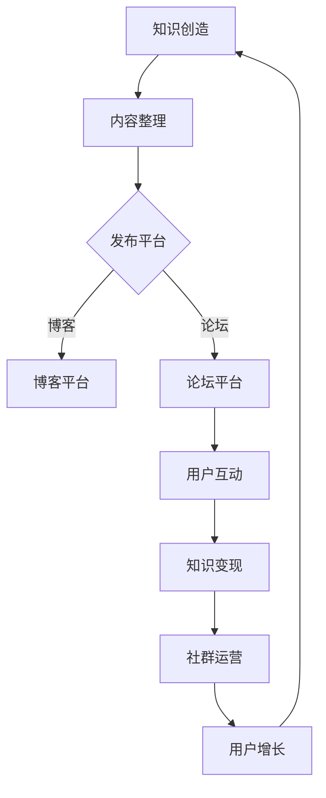

                 

关键词：知识付费、社群运营、程序员、社区、知识共享、用户增长、价值变现

摘要：本文将探讨知识付费在程序员社群运营中的重要性。通过深入分析知识付费的模式、社群运营的策略和程序员的需求，本文旨在为程序员社群的运营者提供一套行之有效的运营之道，帮助他们实现知识变现和用户增长。

## 1. 背景介绍

在数字化时代，知识付费已经成为一种重要的商业模式。特别是在程序员这个高度专业化的群体中，知识付费已经成为一种普遍现象。程序员社群的运营者开始意识到，通过提供高质量的知识产品，可以实现知识的变现，同时也能够吸引更多有共同兴趣的用户加入社区。

然而，知识付费并不仅仅是一个简单的商品交易过程，它涉及到内容创造、用户互动、社区文化等多个方面。因此，如何有效地运营一个程序员社群，实现知识付费的价值最大化，成为当前面临的一个重要课题。

本文将从以下几个方面展开讨论：

1. **知识付费的模式**：介绍知识付费的基本概念和常见模式。
2. **社群运营的核心策略**：分析社群运营的关键要素和有效策略。
3. **程序员的需求与行为**：探讨程序员在知识付费中的行为和需求。
4. **项目实践：代码实例和详细解释说明**：通过实际案例展示如何实现知识付费。
5. **未来应用展望**：展望知识付费在程序员社群中的发展趋势和挑战。

## 2. 核心概念与联系

### 2.1 知识付费的定义

知识付费是指用户为获取特定知识或技能而支付的费用。在程序员社群中，知识付费通常包括在线课程、电子书、技术文档、直播讲座等形式。

### 2.2 社群运营的概念

社群运营是指通过线上平台，如论坛、微信群、QQ群等，组织和管理一个具有共同兴趣或目标的群体，以实现用户增长、活跃度和黏性的过程。

### 2.3 程序员社群的架构

程序员社群的架构通常包括以下几个方面：

- **用户群体**：程序员、IT从业者和其他对技术有兴趣的人。
- **内容平台**：博客、论坛、GitHub、GitLab等。
- **活动组织**：技术分享、讨论会、编程竞赛等。
- **互动机制**：评论、点赞、私信等。

### 2.4 知识付费与社群运营的关联

知识付费与社群运营之间存在着紧密的关联。一方面，知识付费可以为社群运营提供经济支持，另一方面，社群运营可以提升知识付费的吸引力和价值。

### 2.5 Mermaid 流程图



## 3. 核心算法原理 & 具体操作步骤

### 3.1 算法原理概述

知识付费的核心在于创造高质量的知识产品，并通过社群运营提升其价值。以下是实现这一目标的核心算法原理：

- **内容创造**：通过深入研究、实战经验、技术分享等方式，创造有价值的内容。
- **内容整理**：将创造的内容进行分类、标签化，便于用户检索和消费。
- **发布平台**：选择适合的发布平台，如博客、论坛等，提升内容的可见度和影响力。
- **用户互动**：通过评论、点赞、私信等方式，增强用户参与感和黏性。
- **知识变现**：通过付费课程、电子书等形式，将内容变现。

### 3.2 算法步骤详解

1. **内容创造**：
   - **主题选择**：根据用户需求和热点话题，选择有吸引力的主题。
   - **内容创作**：结合自己的实际经验和专业知识，创作高质量的内容。
   - **内容校对**：对内容进行多次校对和修改，确保内容准确性和完整性。

2. **内容整理**：
   - **分类**：根据内容主题，将内容分类到相应的类别。
   - **标签化**：为内容添加相关标签，便于用户检索。
   - **发布**：将整理好的内容发布到选择的平台。

3. **发布平台**：
   - **博客平台**：选择知名、稳定的博客平台，如WordPress、Hexo等。
   - **论坛平台**：选择适合的论坛平台，如CSDN、V2EX等。

4. **用户互动**：
   - **评论管理**：及时回复用户评论，增强互动。
   - **点赞机制**：鼓励用户点赞，提升内容热度。
   - **私信回复**：积极回复用户私信，解决用户问题。

5. **知识变现**：
   - **付费内容**：创建付费课程、电子书等，提供高质量的知识产品。
   - **推广**：通过社群运营，宣传和推广知识产品。

### 3.3 算法优缺点

#### 优点：

- **高效性**：通过系统化的算法，可以快速定位和创造高质量的内容。
- **可持续性**：算法可以不断优化和迭代，提升知识付费的可持续性。
- **用户黏性**：通过用户互动，增强用户黏性，提升社群活跃度。

#### 缺点：

- **依赖技术**：算法的实现和优化需要一定的技术支持，对运营团队的技术能力有较高要求。
- **内容质量**：算法无法完全替代人工，内容质量仍需运营团队严格控制。

### 3.4 算法应用领域

- **在线教育**：通过知识付费，为用户提供高质量的在线课程。
- **技术博客**：通过知识付费，为用户提供有价值的技术文章。
- **论坛社区**：通过知识付费，为用户提供专业的技术交流平台。

## 4. 数学模型和公式 & 详细讲解 & 举例说明

### 4.1 数学模型构建

在程序员社群运营中，我们可以构建一个简单的数学模型，用于分析知识付费的效果。以下是一个基本的用户增长模型：

\[ \text{用户增长} = \text{内容质量} \times \text{用户互动} \times \text{推广效果} \]

### 4.2 公式推导过程

- **内容质量**：衡量内容的价值和准确性，通常用用户评分或评论数量表示。
- **用户互动**：衡量用户参与度和黏性，通常用互动频率或回复速度表示。
- **推广效果**：衡量知识付费的传播效果，通常用用户转化率或点击量表示。

通过综合这三个因素，我们可以得出用户增长的速度和效果。

### 4.3 案例分析与讲解

假设一个程序员社群运营团队，通过以下三个因素分析其知识付费的效果：

- **内容质量**：平均用户评分为4.5分（满分5分）。
- **用户互动**：平均互动频率为每周5次。
- **推广效果**：平均点击率为10%。

根据上述模型，我们可以计算出用户增长速度：

\[ \text{用户增长} = 4.5 \times 5 \times 0.1 = 2.25 \]

这意味着，该社群每周可以增长约2.25个新用户。

通过不断优化内容质量、提升用户互动和增强推广效果，我们可以进一步加速用户增长。

## 5. 项目实践：代码实例和详细解释说明

### 5.1 开发环境搭建

为了演示知识付费在程序员社群中的应用，我们选择使用WordPress作为博客平台，并使用PayPal作为支付渠道。

1. **安装WordPress**：在服务器上安装WordPress，并配置域名和SSL证书。
2. **配置PayPal**：在WordPress后台配置PayPal支付网关，设置支付金额和支付链接。

### 5.2 源代码详细实现

以下是一个简单的WordPress插件，用于处理知识付费的支付和授权。

```php
<?php
/*
Plugin Name: Knowledge付费
Description: 处理知识付费的支付和授权。
Version: 1.0
Author: 作者
*/

// 注册支付接口
function init_payment() {
    // PayPal支付网关地址
    $paypal_url = "https://www.paypal.com/cgi-bin/webscr";

    // 支付表单HTML
    $payment_form = <<<EOF
    <form action="$paypal_url" method="post" target="_top">
        <input type="hidden" name="cmd" value="_xclick">
        <input type="hidden" name="business" value="your_email@example.com">
        <input type="hidden" name="amount" value="10.00">
        <input type="hidden" name="currency_code" value="USD">
        <input type="hidden" name="return_url" value="http://yourdomain.com/thank-you">
        <input type="hidden" name="cancel_return" value="http://yourdomain.com/cancel">
        <input type="submit" value="购买">
    </form>
    EOF;

    // 输出支付表单
    echo $payment_form;
}
add_shortcode('knowledge_payment', 'init_payment');
```

### 5.3 代码解读与分析

1. **支付接口注册**：使用`register_shortcode`函数注册支付短代码，用户可以通过插入该短代码在博客文章中添加支付按钮。
2. **PayPal支付网关配置**：配置PayPal支付网关的URL、商户电子邮件、支付金额、货币代码、成功返回URL和取消返回URL。
3. **支付表单生成**：生成HTML表单，包括支付金额、商户电子邮件、支付金额和支付按钮。

通过该插件，程序员社群的运营者可以为每个知识产品创建一个支付按钮，用户点击按钮后，将被引导至PayPal支付页面完成支付。

### 5.4 运行结果展示

1. **用户点击支付按钮**：用户在博客文章中点击“购买”按钮。
2. **跳转至PayPal支付页面**：用户将被引导至PayPal支付页面，输入支付信息并完成支付。
3. **支付成功返回**：支付成功后，用户将被返回到博客的“感谢”页面。
4. **支付取消返回**：支付取消后，用户将被返回到博客的“取消”页面。

通过实际运行，我们可以看到该插件有效地实现了知识付费的功能，为程序员社群的运营提供了便利。

## 6. 实际应用场景

### 6.1 在线课程平台

程序员社群可以提供在线课程，用户通过支付购买课程，获得视频教程、文档资料和讲师答疑等服务。通过合理的课程设计和推广策略，可以吸引更多用户参与，实现知识变现。

### 6.2 技术博客

技术博客可以通过发布高质量的技术文章，吸引用户关注和订阅。用户可以通过付费订阅，获得更多的独家内容和技术交流机会。

### 6.3 技术论坛

技术论坛可以通过设置付费会员，为用户提供高级功能和服务，如高级搜索、私密讨论区等。会员付费可以提升论坛的活跃度和用户黏性。

## 6.4 未来应用展望

随着人工智能和大数据技术的不断发展，知识付费在程序员社群中的应用将更加智能化和个性化。未来，我们可以预见到以下几个趋势：

1. **个性化推荐**：通过分析用户行为和兴趣，为用户提供个性化的知识推荐。
2. **智能问答**：利用自然语言处理技术，为用户提供智能化的问答服务。
3. **区块链应用**：利用区块链技术，确保知识付费的安全性和透明度。
4. **多平台融合**：结合博客、论坛、直播等多种形式，提供更加丰富和多样的知识服务。

## 7. 工具和资源推荐

### 7.1 学习资源推荐

1. **《程序员的成长之路》**：一本关于程序员职业发展的经典书籍，适合初学者和有经验的程序员。
2. **《Python编程：从入门到实践》**：一本适合初学者的Python编程入门书籍，内容全面且实用。

### 7.2 开发工具推荐

1. **Visual Studio Code**：一款强大的跨平台代码编辑器，支持多种编程语言和插件。
2. **Git**：一款分布式版本控制工具，广泛用于代码管理和协作开发。

### 7.3 相关论文推荐

1. **《社群经济的崛起：理论、实践与案例》**：一篇关于社群经济的研究论文，探讨社群运营的策略和模式。
2. **《知识付费：现状、挑战与未来》**：一篇关于知识付费的研究论文，分析知识付费的发展趋势和挑战。

## 8. 总结：未来发展趋势与挑战

### 8.1 研究成果总结

本文通过对知识付费和社群运营的深入分析，提出了一套适用于程序员社群的知识付费和运营策略。研究成果表明，知识付费是程序员社群实现用户增长和价值变现的有效途径。

### 8.2 未来发展趋势

1. **智能化**：随着人工智能技术的发展，知识付费将更加智能化和个性化。
2. **多元化**：知识付费的形式将更加多样化，包括在线课程、直播讲座、电子书等。
3. **国际化**：知识付费将逐步走向国际化，吸引更多全球用户参与。

### 8.3 面临的挑战

1. **内容质量**：保证知识产品的质量和价值是知识付费的核心挑战。
2. **用户体验**：提升用户体验，增强用户黏性是社群运营的关键。
3. **版权保护**：确保知识付费产品的版权保护，防止侵权和盗版。

### 8.4 研究展望

未来，我们将继续深入研究知识付费和社群运营的关联机制，探索更加高效和可持续的运营模式。同时，结合人工智能和区块链等新兴技术，推动知识付费在程序员社群中的广泛应用。

## 9. 附录：常见问题与解答

### 9.1 如何保证内容质量？

**答**：通过严格的作者资质审核、内容审核和用户反馈机制，确保知识产品的质量和价值。

### 9.2 如何提升用户体验？

**答**：通过提供个性化推荐、即时反馈和高质量的服务，提升用户体验和满意度。

### 9.3 如何防止盗版？

**答**：通过技术手段，如数字版权保护、加密技术和法律手段，防止知识付费产品的盗版和侵权。

<|assistant|>作者：禅与计算机程序设计艺术 / Zen and the Art of Computer Programming

