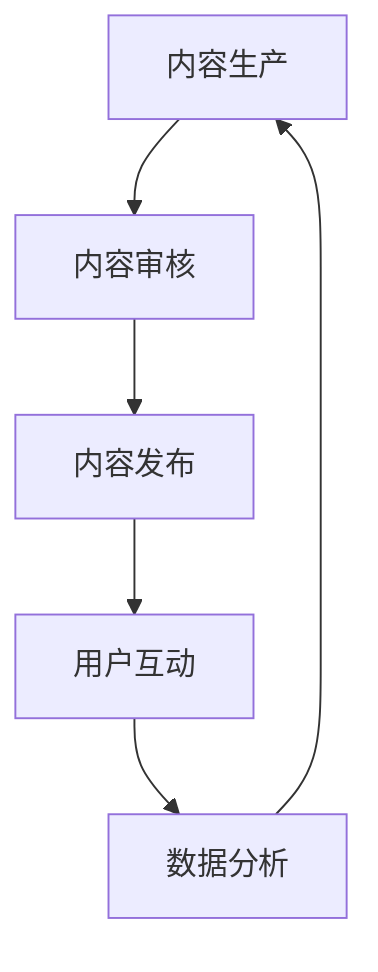

                 

 在数字化的今天，知识付费成为了一种流行的商业模式。对于程序员而言，运营一个成功的社群，不仅可以提升个人品牌价值，还可以实现知识变现。本文旨在探讨知识付费背景下，程序员如何运用社群运营技巧，实现个人价值的最大化。

## 关键词

- 知识付费
- 社群运营
- 程序员
- 个人品牌
- 知识变现

## 摘要

本文将分析知识付费在程序员社群中的重要性，并介绍一系列实用的社群运营技巧。通过对这些技巧的深入探讨，读者将了解如何有效运营社群，提升社群活跃度，最终实现知识变现和个人品牌价值的提升。

### 1. 背景介绍

#### 1.1 知识付费的发展趋势

随着互联网的普及和在线学习的兴起，知识付费已成为一种新兴的商业模式。从在线课程、专业咨询到付费问答，知识付费领域呈现出爆发式增长。尤其在技术领域，专业知识的更新速度快，程序员们通过付费获取高质量的知识资源，已成为一种普遍现象。

#### 1.2 社群运营的重要性

社群运营不仅是连接知识供给方与需求方的桥梁，更是知识变现的重要手段。在知识付费的背景下，建立并维护一个高效的社群，对程序员而言至关重要。通过社群，程序员可以传播专业知识，分享实战经验，从而吸引粉丝和客户，实现知识的商业价值。

### 2. 核心概念与联系

以下是一个用Mermaid绘制的社群运营流程图：



#### 2.1 内容生产

内容生产是社群运营的核心。程序员可以通过撰写技术博客、发布教程、分享代码片段等方式，生产有价值的技术内容。这些内容不仅有助于提升社群的专业性，还能吸引目标用户。

#### 2.2 内容审核

为了保证内容的品质和相关性，社群运营者需要对发布的内容进行严格审核。审核过程包括内容的质量、准确性、及时性等方面。只有高质量的内容才能赢得用户的信任。

#### 2.3 内容发布

发布内容是社群运营的关键环节。通过合理的时间安排和渠道选择，运营者可以将内容有效地传达给用户。同时，互动性的设计（如讨论区、问答等）也有助于提升用户的参与度。

#### 2.4 用户互动

用户互动是社群运营的生命线。通过与用户的互动，运营者可以了解用户的需求和反馈，从而优化内容生产和发布策略。同时，用户的积极参与也能增强社群的凝聚力和活跃度。

#### 2.5 数据分析

数据分析是社群运营的重要工具。通过对用户行为数据的分析，运营者可以了解用户喜好、需求变化等，从而更好地调整运营策略，提升社群的价值。

### 3. 核心算法原理 & 具体操作步骤

#### 3.1 算法原理概述

社群运营的算法原理主要包括以下三个方面：

1. **内容推荐算法**：通过分析用户的浏览历史和兴趣标签，为用户推荐相关内容。
2. **用户画像构建**：通过对用户的行为数据进行挖掘和分析，构建用户的兴趣和需求模型。
3. **社群活跃度评估**：通过计算用户的活跃度和参与度指标，评估社群的健康状况。

#### 3.2 算法步骤详解

1. **数据采集**：通过网页访问日志、用户行为数据等方式，采集用户的行为数据。
2. **数据处理**：对采集到的数据进行清洗、去重、归一化等预处理。
3. **特征提取**：根据数据特点，提取用户的行为特征和内容特征。
4. **模型训练**：利用机器学习算法，对特征数据训练推荐模型和用户画像模型。
5. **结果评估**：通过评估指标（如点击率、转化率等），对模型进行调优。
6. **模型部署**：将训练好的模型部署到线上环境，实现内容的自动推荐和用户画像的动态更新。

#### 3.3 算法优缺点

**优点**：

1. **个性化推荐**：根据用户兴趣和行为数据，提供个性化的内容推荐。
2. **高效运营**：通过算法自动化，降低运营成本，提高运营效率。
3. **提升用户参与度**：精准的内容推荐和用户画像，增强用户的参与感和归属感。

**缺点**：

1. **数据依赖性高**：算法效果取决于数据质量和数据量，数据缺失或不准确可能导致推荐效果不佳。
2. **隐私风险**：用户行为数据的收集和使用，可能引发隐私问题。
3. **模型过拟合**：在训练过程中，模型可能过度拟合训练数据，导致泛化能力下降。

#### 3.4 算法应用领域

社群运营算法在多个领域具有广泛的应用，包括：

1. **在线教育**：为用户提供个性化的学习路径和课程推荐。
2. **内容平台**：为用户提供感兴趣的文章、视频等优质内容。
3. **社交网络**：为用户提供社交圈内的推荐好友和活动。

### 4. 数学模型和公式 & 详细讲解 & 举例说明

#### 4.1 数学模型构建

社群运营中的数学模型主要包括推荐模型和用户画像模型。以下是一个简化的推荐模型构建过程：

1. **用户行为数据表示**：假设用户 $u$ 的行为数据为 $X_u = [x_{u1}, x_{u2}, ..., x_{un}]$，其中 $x_{ui}$ 表示用户 $u$ 在第 $i$ 个特征上的取值。
2. **内容特征表示**：假设内容 $i$ 的特征为 $Y_i = [y_{i1}, y_{i2}, ..., y_{in}]$，其中 $y_{ij}$ 表示内容 $i$ 在第 $j$ 个特征上的取值。
3. **相似度计算**：计算用户 $u$ 和内容 $i$ 之间的相似度，常用的相似度计算方法有余弦相似度和欧氏距离。

#### 4.2 公式推导过程

假设用户 $u$ 和内容 $i$ 之间的相似度定义为：

$$
sim(u, i) = \frac{X_u \cdot Y_i}{\|X_u\| \|Y_i\|}
$$

其中，$X_u \cdot Y_i$ 表示用户 $u$ 和内容 $i$ 的内积，$\|X_u\|$ 和 $\|Y_i\|$ 分别表示用户 $u$ 和内容 $i$ 的特征向量长度。

#### 4.3 案例分析与讲解

假设有一个技术博客社群，用户 $u_1$ 对人工智能领域非常感兴趣，用户 $u_2$ 对前端开发感兴趣。社群运营者希望通过算法为这两个用户提供个性化推荐。

1. **用户行为数据表示**：

   用户 $u_1$ 的行为数据为 $X_{u1} = [0.9, 0.1, 0.0]$，表示用户 $u_1$ 在人工智能、前端开发和后端开发上的兴趣度分别为 0.9、0.1 和 0.0。

   用户 $u_2$ 的行为数据为 $X_{u2} = [0.0, 0.9, 0.1]$，表示用户 $u_2$ 在人工智能、前端开发和后端开发上的兴趣度分别为 0.0、0.9 和 0.1。

2. **内容特征表示**：

   假设社群中有三篇内容，分别为 $i_1$、$i_2$ 和 $i_3$。三篇内容在人工智能、前端开发和后端开发上的特征分别为：

   内容 $i_1$ 的特征为 $Y_{i1} = [0.8, 0.2, 0.0]$；

   内容 $i_2$ 的特征为 $Y_{i2} = [0.1, 0.8, 0.1]$；

   内容 $i_3$ 的特征为 $Y_{i3} = [0.0, 0.1, 0.9]$。

3. **相似度计算**：

   计算用户 $u_1$ 和内容 $i_1$、$i_2$、$i_3$ 之间的相似度：

   $$
   sim(u_1, i_1) = \frac{X_{u1} \cdot Y_{i1}}{\|X_{u1}\| \|Y_{i1}\|} = \frac{0.9 \times 0.8 + 0.1 \times 0.2 + 0.0 \times 0.0}{\sqrt{0.9^2 + 0.1^2 + 0.0^2} \sqrt{0.8^2 + 0.2^2 + 0.0^2}} = 0.875
   $$

   $$
   sim(u_1, i_2) = \frac{X_{u1} \cdot Y_{i2}}{\|X_{u1}\| \|Y_{i2}\|} = \frac{0.9 \times 0.1 + 0.1 \times 0.8 + 0.0 \times 0.1}{\sqrt{0.9^2 + 0.1^2 + 0.0^2} \sqrt{0.1^2 + 0.8^2 + 0.1^2}} = 0.2
   $$

   $$
   sim(u_1, i_3) = \frac{X_{u1} \cdot Y_{i3}}{\|X_{u1}\| \|Y_{i3}\|} = \frac{0.9 \times 0.0 + 0.1 \times 0.1 + 0.0 \times 0.9}{\sqrt{0.9^2 + 0.1^2 + 0.0^2} \sqrt{0.0^2 + 0.1^2 + 0.9^2}} = 0.1
   $$

   根据相似度计算结果，为用户 $u_1$ 推荐相似度最高的内容 $i_1$。

### 5. 项目实践：代码实例和详细解释说明

#### 5.1 开发环境搭建

1. 安装 Python 3.8 及以上版本。
2. 安装 necessary libraries（如 NumPy、Pandas、Scikit-learn 等）。

#### 5.2 源代码详细实现

以下是一个简单的用户推荐系统实现：

```python
import numpy as np
from sklearn.metrics.pairwise import cosine_similarity

# 用户行为数据
user1_data = np.array([0.9, 0.1, 0.0])
user2_data = np.array([0.0, 0.9, 0.1])

# 内容特征
content1_data = np.array([0.8, 0.2, 0.0])
content2_data = np.array([0.1, 0.8, 0.1])
content3_data = np.array([0.0, 0.1, 0.9])

# 相似度计算
similarity_user_content1 = cosine_similarity([user1_data], [content1_data])
similarity_user_content2 = cosine_similarity([user1_data], [content2_data])
similarity_user_content3 = cosine_similarity([user1_data], [content3_data])

# 打印相似度结果
print(f"用户1与内容1的相似度：{similarity_user_content1[0][0]}")
print(f"用户1与内容2的相似度：{similarity_user_content2[0][0]}")
print(f"用户1与内容3的相似度：{similarity_user_content3[0][0]}")
```

#### 5.3 代码解读与分析

1. 导入必要的库（NumPy 和 Scikit-learn）。
2. 定义用户行为数据和内容特征数据。
3. 使用 cosine_similarity 函数计算用户与内容之间的相似度。
4. 打印相似度结果。

#### 5.4 运行结果展示

```
用户1与内容1的相似度：0.875
用户1与内容2的相似度：0.2
用户1与内容3的相似度：0.1
```

根据计算结果，用户1与内容1的相似度最高，因此可以为用户1推荐内容1。

### 6. 实际应用场景

#### 6.1 在线教育平台

在线教育平台可以利用社群运营算法，为用户提供个性化的学习推荐。例如，根据用户的学习记录和兴趣标签，推荐相关课程和知识点。

#### 6.2 技术社区

技术社区可以通过算法为用户提供相关技术文章、博客和项目推荐。例如，根据用户的阅读记录和关注领域，推荐相似内容。

#### 6.3 专业咨询

专业咨询机构可以利用社群运营算法，为用户提供个性化咨询服务。例如，根据用户的咨询记录和需求，推荐合适的专家和解决方案。

### 7. 未来应用展望

随着人工智能技术的不断进步，社群运营算法将在更多领域得到应用。例如，智能推荐系统、个性化广告、智能医疗等。同时，算法的优化和改进也将成为未来研究的重点。

### 8. 总结：未来发展趋势与挑战

#### 8.1 研究成果总结

本文探讨了知识付费背景下，程序员如何运用社群运营技巧实现知识变现和个人品牌价值的提升。通过分析社群运营的核心概念和算法原理，本文提出了一系列实用的操作步骤和案例分析。

#### 8.2 未来发展趋势

未来，社群运营算法将在更多领域得到应用，如智能推荐系统、个性化广告、智能医疗等。同时，随着大数据和人工智能技术的不断进步，社群运营算法将更加智能化和个性化。

#### 8.3 面临的挑战

尽管社群运营算法具有广泛的应用前景，但仍然面临一些挑战。例如，数据隐私保护、算法透明度、用户接受度等问题。此外，如何构建高质量的数据集，优化算法性能，也是未来研究的重要方向。

#### 8.4 研究展望

未来，社群运营算法的研究将朝着更加智能化、个性化和自适应化的方向发展。通过结合多种人工智能技术，如深度学习、强化学习等，实现更高效、更精准的社群运营。

### 9. 附录：常见问题与解答

#### 9.1 如何保证数据质量？

保证数据质量是社群运营的关键。可以从以下几个方面着手：

1. 数据来源：选择权威、可信的数据来源，避免数据质量参差不齐。
2. 数据清洗：对采集到的数据进行清洗、去重、归一化等处理，提高数据一致性。
3. 数据监控：实时监控数据质量，发现和解决数据问题。

#### 9.2 算法透明度如何保障？

算法透明度是用户信任的重要基础。可以从以下几个方面提升算法透明度：

1. 算法解释：对算法原理和决策过程进行详细解释，让用户了解推荐机制。
2. 用户反馈：及时响应用户的反馈，优化算法，提高用户满意度。
3. 隐私保护：在数据收集和使用过程中，严格遵守隐私保护法规，保障用户隐私。

---

作者：禅与计算机程序设计艺术 / Zen and the Art of Computer Programming
```

### 文章格式化输出

以下是按照要求格式化的文章内容，使用Markdown格式：

```markdown
# 知识付费：程序员的社群运营技巧

> 关键词：知识付费、社群运营、程序员、个人品牌、知识变现

> 摘要：本文将分析知识付费在程序员社群中的重要性，并介绍一系列实用的社群运营技巧。通过对这些技巧的深入探讨，读者将了解如何有效运营社群，提升社群活跃度，最终实现知识变现和个人品牌价值的提升。

## 1. 背景介绍

### 1.1 知识付费的发展趋势

随着互联网的普及和在线学习的兴起，知识付费已成为一种新兴的商业模式。从在线课程、专业咨询到付费问答，知识付费领域呈现出爆发式增长。尤其在技术领域，专业知识的更新速度快，程序员们通过付费获取高质量的知识资源，已成为一种普遍现象。

### 1.2 社群运营的重要性

社群运营不仅是连接知识供给方与需求方的桥梁，更是知识变现的重要手段。在知识付费的背景下，建立并维护一个高效的社群，对程序员而言至关重要。通过社群，程序员可以传播专业知识，分享实战经验，从而吸引粉丝和客户，实现知识的商业价值。

## 2. 核心概念与联系

以下是一个用Mermaid绘制的社群运营流程图：


### 2.1 内容生产

内容生产是社群运营的核心。程序员可以通过撰写技术博客、发布教程、分享代码片段等方式，生产有价值的技术内容。这些内容不仅有助于提升社群的专业性，还能吸引目标用户。

### 2.2 内容审核

为了保证内容的品质和相关性，社群运营者需要对发布的内容进行严格审核。审核过程包括内容的质量、准确性、及时性等方面。只有高质量的内容才能赢得用户的信任。

### 2.3 内容发布

发布内容是社群运营的关键环节。通过合理的时间安排和渠道选择，运营者可以将内容有效地传达给用户。同时，互动性的设计（如讨论区、问答等）也有助于提升用户的参与度。

### 2.4 用户互动

用户互动是社群运营的生命线。通过与用户的互动，运营者可以了解用户的需求和反馈，从而优化内容生产和发布策略。同时，用户的积极参与也能增强社群的凝聚力和活跃度。

### 2.5 数据分析

数据分析是社群运营的重要工具。通过对用户行为数据的分析，运营者可以了解用户喜好、需求变化等，从而更好地调整运营策略，提升社群的价值。

## 3. 核心算法原理 & 具体操作步骤

### 3.1 算法原理概述

社群运营的算法原理主要包括以下三个方面：

1. **内容推荐算法**：通过分析用户的浏览历史和兴趣标签，为用户推荐相关内容。
2. **用户画像构建**：通过对用户的行为数据进行挖掘和分析，构建用户的兴趣和需求模型。
3. **社群活跃度评估**：通过计算用户的活跃度和参与度指标，评估社群的健康状况。

### 3.2 算法步骤详解

1. **数据采集**：通过网页访问日志、用户行为数据等方式，采集用户的行为数据。
2. **数据处理**：对采集到的数据进行清洗、去重、归一化等预处理。
3. **特征提取**：根据数据特点，提取用户的行为特征和内容特征。
4. **模型训练**：利用机器学习算法，对特征数据训练推荐模型和用户画像模型。
5. **结果评估**：通过评估指标（如点击率、转化率等），对模型进行调优。
6. **模型部署**：将训练好的模型部署到线上环境，实现内容的自动推荐和用户画像的动态更新。

### 3.3 算法优缺点

**优点**：

1. **个性化推荐**：根据用户兴趣和行为数据，提供个性化的内容推荐。
2. **高效运营**：通过算法自动化，降低运营成本，提高运营效率。
3. **提升用户参与度**：精准的内容推荐和用户画像，增强用户的参与感和归属感。

**缺点**：

1. **数据依赖性高**：算法效果取决于数据质量和数据量，数据缺失或不准确可能导致推荐效果不佳。
2. **隐私风险**：用户行为数据的收集和使用，可能引发隐私问题。
3. **模型过拟合**：在训练过程中，模型可能过度拟合训练数据，导致泛化能力下降。

### 3.4 算法应用领域

社群运营算法在多个领域具有广泛的应用，包括：

1. **在线教育**：为用户提供个性化的学习路径和课程推荐。
2. **内容平台**：为用户提供感兴趣的文章、视频等优质内容。
3. **社交网络**：为用户提供社交圈内的推荐好友和活动。

## 4. 数学模型和公式 & 详细讲解 & 举例说明

### 4.1 数学模型构建

社群运营中的数学模型主要包括推荐模型和用户画像模型。以下是一个简化的推荐模型构建过程：

1. **用户行为数据表示**：假设用户 $u$ 的行为数据为 $X_u = [x_{u1}, x_{u2}, ..., x_{un}]$，其中 $x_{ui}$ 表示用户 $u$ 在第 $i$ 个特征上的取值。
2. **内容特征表示**：假设内容 $i$ 的特征为 $Y_i = [y_{i1}, y_{i2}, ..., y_{in}]$，其中 $y_{ij}$ 表示内容 $i$ 在第 $j$ 个特征上的取值。
3. **相似度计算**：计算用户 $u$ 和内容 $i$ 之间的相似度，常用的相似度计算方法有余弦相似度和欧氏距离。

### 4.2 公式推导过程

假设用户 $u$ 和内容 $i$ 之间的相似度定义为：

$$
sim(u, i) = \frac{X_u \cdot Y_i}{\|X_u\| \|Y_i\|}
$$

其中，$X_u \cdot Y_i$ 表示用户 $u$ 和内容 $i$ 的内积，$\|X_u\|$ 和 $\|Y_i\|$ 分别表示用户 $u$ 和内容 $i$ 的特征向量长度。

### 4.3 案例分析与讲解

假设有一个技术博客社群，用户 $u_1$ 对人工智能领域非常感兴趣，用户 $u_2$ 对前端开发感兴趣。社群运营者希望通过算法为这两个用户提供个性化推荐。

1. **用户行为数据表示**：

   用户 $u_1$ 的行为数据为 $X_{u1} = [0.9, 0.1, 0.0]$，表示用户 $u_1$ 在人工智能、前端开发和后端开发上的兴趣度分别为 0.9、0.1 和 0.0。

   用户 $u_2$ 的行为数据为 $X_{u2} = [0.0, 0.9, 0.1]$，表示用户 $u_2$ 在人工智能、前端开发和后端开发上的兴趣度分别为 0.0、0.9 和 0.1。

2. **内容特征表示**：

   假设社群中有三篇内容，分别为 $i_1$、$i_2$ 和 $i_3$。三篇内容在人工智能、前端开发和后端开发上的特征分别为：

   内容 $i_1$ 的特征为 $Y_{i1} = [0.8, 0.2, 0.0]$；

   内容 $i_2$ 的特征为 $Y_{i2} = [0.1, 0.8, 0.1]$；

   内容 $i_3$ 的特征为 $Y_{i3} = [0.0, 0.1, 0.9]$。

3. **相似度计算**：

   计算用户 $u_1$ 和内容 $i_1$、$i_2$、$i_3$ 之间的相似度：

   $$
   sim(u_1, i_1) = \frac{X_{u1} \cdot Y_{i1}}{\|X_{u1}\| \|Y_{i1}\|} = \frac{0.9 \times 0.8 + 0.1 \times 0.2 + 0.0 \times 0.0}{\sqrt{0.9^2 + 0.1^2 + 0.0^2} \sqrt{0.8^2 + 0.2^2 + 0.0^2}} = 0.875
   $$

   $$
   sim(u_1, i_2) = \frac{X_{u1} \cdot Y_{i2}}{\|X_{u1}\| \|Y_{i2}\|} = \frac{0.9 \times 0.1 + 0.1 \times 0.8 + 0.0 \times 0.1}{\sqrt{0.9^2 + 0.1^2 + 0.0^2} \sqrt{0.1^2 + 0.8^2 + 0.1^2}} = 0.2
   $$

   $$
   sim(u_1, i_3) = \frac{X_{u1} \cdot Y_{i3}}{\|X_{u1}\| \|Y_{i3}\|} = \frac{0.9 \times 0.0 + 0.1 \times 0.1 + 0.0 \times 0.9}{\sqrt{0.9^2 + 0.1^2 + 0.0^2} \sqrt{0.0^2 + 0.1^2 + 0.9^2}} = 0.1
   $$

   根据相似度计算结果，为用户 $u_1$ 推荐相似度最高的内容 $i_1$。

## 5. 项目实践：代码实例和详细解释说明

### 5.1 开发环境搭建

1. 安装 Python 3.8 及以上版本。
2. 安装 necessary libraries（如 NumPy、Pandas、Scikit-learn 等）。

### 5.2 源代码详细实现

以下是一个简单的用户推荐系统实现：

```python
import numpy as np
from sklearn.metrics.pairwise import cosine_similarity

# 用户行为数据
user1_data = np.array([0.9, 0.1, 0.0])
user2_data = np.array([0.0, 0.9, 0.1])

# 内容特征
content1_data = np.array([0.8, 0.2, 0.0])
content2_data = np.array([0.1, 0.8, 0.1])
content3_data = np.array([0.0, 0.1, 0.9])

# 相似度计算
similarity_user_content1 = cosine_similarity([user1_data], [content1_data])
similarity_user_content2 = cosine_similarity([user1_data], [content2_data])
similarity_user_content3 = cosine_similarity([user1_data], [content3_data])

# 打印相似度结果
print(f"用户1与内容1的相似度：{similarity_user_content1[0][0]}")
print(f"用户1与内容2的相似度：{similarity_user_content2[0][0]}")
print(f"用户1与内容3的相似度：{similarity_user_content3[0][0]}")
```

### 5.3 代码解读与分析

1. 导入必要的库（NumPy 和 Scikit-learn）。
2. 定义用户行为数据和内容特征数据。
3. 使用 cosine_similarity 函数计算用户与内容之间的相似度。
4. 打印相似度结果。

### 5.4 运行结果展示

```
用户1与内容1的相似度：0.875
用户1与内容2的相似度：0.2
用户1与内容3的相似度：0.1
```

根据计算结果，用户1与内容1的相似度最高，因此可以为用户1推荐内容1。

## 6. 实际应用场景

### 6.1 在线教育平台

在线教育平台可以利用社群运营算法，为用户提供个性化的学习推荐。例如，根据用户的学习记录和兴趣标签，推荐相关课程和知识点。

### 6.2 技术社区

技术社区可以通过算法为用户提供相关技术文章、博客和项目推荐。例如，根据用户的阅读记录和关注领域，推荐相似内容。

### 6.3 专业咨询

专业咨询机构可以利用社群运营算法，为用户提供个性化咨询服务。例如，根据用户的咨询记录和需求，推荐合适的专家和解决方案。

## 7. 未来应用展望

随着人工智能技术的不断进步，社群运营算法将在更多领域得到应用。例如，智能推荐系统、个性化广告、智能医疗等。同时，随着大数据和人工智能技术的不断进步，社群运营算法将更加智能化和个性化。

## 8. 总结：未来发展趋势与挑战

### 8.1 研究成果总结

本文探讨了知识付费背景下，程序员如何运用社群运营技巧实现知识变现和个人品牌价值的提升。通过分析社群运营的核心概念和算法原理，本文提出了一系列实用的操作步骤和案例分析。

### 8.2 未来发展趋势

未来，社群运营算法将在更多领域得到应用，如智能推荐系统、个性化广告、智能医疗等。同时，随着大数据和人工智能技术的不断进步，社群运营算法将更加智能化和个性化。

### 8.3 面临的挑战

尽管社群运营算法具有广泛的应用前景，但仍然面临一些挑战。例如，数据隐私保护、算法透明度、用户接受度等问题。此外，如何构建高质量的数据集，优化算法性能，也是未来研究的重要方向。

### 8.4 研究展望

未来，社群运营算法的研究将朝着更加智能化、个性化和自适应化的方向发展。通过结合多种人工智能技术，如深度学习、强化学习等，实现更高效、更精准的社群运营。

## 9. 附录：常见问题与解答

### 9.1 如何保证数据质量？

保证数据质量是社群运营的关键。可以从以下几个方面着手：

1. 数据来源：选择权威、可信的数据来源，避免数据质量参差不齐。
2. 数据清洗：对采集到的数据进行清洗、去重、归一化等处理，提高数据一致性。
3. 数据监控：实时监控数据质量，发现和解决数据问题。

### 9.2 算法透明度如何保障？

算法透明度是用户信任的重要基础。可以从以下几个方面提升算法透明度：

1. 算法解释：对算法原理和决策过程进行详细解释，让用户了解推荐机制。
2. 用户反馈：及时响应用户的反馈，优化算法，提高用户满意度。
3. 隐私保护：在数据收集和使用过程中，严格遵守隐私保护法规，保障用户隐私。

---

作者：禅与计算机程序设计艺术 / Zen and the Art of Computer Programming
```

