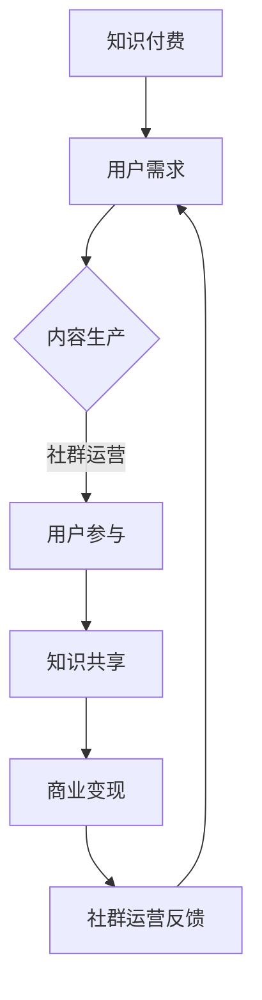

                 

关键词：知识付费、社群运营、程序员、知识共享、在线教育、用户参与、收益模式

摘要：本文将探讨程序员的社群运营方法，通过分析知识付费市场的现状和趋势，结合社群运营的核心原则，提出适用于程序员社群的具体策略和工具，以实现知识共享和用户增长的良性循环。

## 1. 背景介绍

随着互联网的普及和在线教育的兴起，知识付费已经成为一个迅速发展的市场。程序员作为知识密集型职业，他们对于学习新技能和分享经验的需求尤为强烈。因此，搭建一个有效的程序员社群，不仅可以帮助程序员们更好地学习和发展，还可以成为知识付费的重要载体。

### 程序员社群的现状

- **需求旺盛**：程序员们渴望不断学习新技术、解决编程难题，并且希望能够与其他程序员交流和分享经验。
- **分散化学习**：虽然在线课程和资料丰富，但程序员往往需要花费大量时间筛选和学习，缺乏系统性。
- **社群效应**：一个良好的程序员社群可以提供及时的帮助、知识共享和职业发展机会，增强成员的归属感和参与感。

### 知识付费市场的趋势

- **内容多样化**：从传统的技术教程、案例分享到直播授课、互动讨论等多种形式。
- **个性化服务**：基于用户数据和行为分析，提供个性化的学习资源和推荐。
- **平台化发展**：知识付费平台逐渐整合内容生产、交易和运营等功能，形成生态圈。

## 2. 核心概念与联系

### 知识付费的概念

知识付费是指用户为获取特定领域的知识或技能，向知识提供者支付费用的一种交易模式。

### 社群运营的概念

社群运营是指通过一系列策略和活动，吸引、维护和增长社群成员，以达到知识共享、用户参与和商业变现的目的。

### 知识付费与社群运营的联系

- **用户参与**：知识付费离不开用户的参与和互动，而社群运营可以提供这种互动的平台和机制。
- **内容生产**：社群成员的参与和贡献可以丰富知识内容，提升知识付费的价值。
- **商业变现**：通过社群运营，知识付费平台可以更有效地转化用户为付费用户。

### Mermaid 流程图



## 3. 核心算法原理 & 具体操作步骤

### 3.1 算法原理概述

程序员社群运营的核心算法可以概括为：用户参与 - 内容生产 - 用户参与 - 商业变现。这一过程通过不断循环，实现社群的可持续发展和知识价值的最大化。

### 3.2 算法步骤详解

#### 步骤一：用户参与

1. **内容推送**：根据用户兴趣和行为数据，推送个性化内容。
2. **互动机制**：设置讨论区、问答板块等，鼓励用户互动。
3. **激励机制**：提供积分、优惠券等激励措施，增加用户参与度。

#### 步骤二：内容生产

1. **用户生成内容**：鼓励用户发布学习心得、项目案例等。
2. **平台审核**：确保内容的准确性和质量。
3. **内容推荐**：基于用户行为和兴趣，推荐相关内容。

#### 步骤三：用户参与

1. **互动与反馈**：通过评论、点赞、分享等方式，增强用户互动。
2. **社群活动**：举办线上研讨会、编程挑战等活动，提高用户粘性。

#### 步骤四：商业变现

1. **付费内容**：提供优质付费课程、资料等。
2. **广告收入**：在社群中投放相关广告。
3. **会员制度**：推出会员服务，提供更多增值服务。

### 3.3 算法优缺点

#### 优点

- **增强用户粘性**：通过互动和参与，用户对社群的粘性显著提高。
- **提高知识价值**：社群成员的参与和贡献，可以提升知识内容的实用性和权威性。
- **实现商业变现**：通过多种渠道，实现知识付费，提升社群的盈利能力。

#### 缺点

- **运营成本较高**：需要大量的人力、物力和时间投入。
- **内容质量难以控制**：用户生成的内容质量参差不齐，需要严格的审核机制。
- **用户流失风险**：一旦社群失去吸引力，用户可能会流失。

### 3.4 算法应用领域

- **技术社区**：如GitHub、Stack Overflow等。
- **在线教育平台**：如Coursera、Udemy等。
- **专业社群**：如程序员社群、设计师社群等。

## 4. 数学模型和公式 & 详细讲解 & 举例说明

### 4.1 数学模型构建

为了更好地分析程序员社群运营的效果，我们可以构建以下数学模型：

\[ \text{社群活跃度} = f(\text{用户参与度}, \text{内容质量}, \text{激励机制}) \]

### 4.2 公式推导过程

1. **用户参与度**：用户参与度取决于用户互动的频率和深度。我们可以通过以下公式计算用户参与度：

\[ \text{用户参与度} = \frac{\text{互动次数}}{\text{用户总数} \times \text{平均互动频率}} \]

2. **内容质量**：内容质量直接影响用户的满意度。我们可以通过以下公式计算内容质量：

\[ \text{内容质量} = \frac{\text{正面评价次数}}{\text{总评价次数}} \]

3. **激励机制**：激励机制包括积分、优惠券、奖励等。我们可以通过以下公式计算激励机制的有效性：

\[ \text{激励机制有效性} = \frac{\text{激励措施参与次数}}{\text{总用户数}} \]

### 4.3 案例分析与讲解

以某知名程序员社群为例，我们假设其用户总数为1000人，平均互动频率为10次/月，互动次数为5000次/月，正面评价次数为300次，激励措施参与次数为500次。

根据上述公式，我们可以计算出：

- 用户参与度：\[ \frac{5000}{1000 \times 10} = 0.5 \]
- 内容质量：\[ \frac{300}{5000} = 0.06 \]
- 激励机制有效性：\[ \frac{500}{1000} = 0.5 \]

将这些值代入社群活跃度公式：

\[ \text{社群活跃度} = f(0.5, 0.06, 0.5) = 0.183 \]

这意味着，该社群的活跃度相对较低。为了提高活跃度，社群运营者可以尝试增加用户互动频率、提高内容质量和优化激励机制。

## 5. 项目实践：代码实例和详细解释说明

### 5.1 开发环境搭建

为了实现上述算法模型，我们需要搭建一个简单的后端服务。以下是开发环境搭建的步骤：

1. **创建项目**：使用Django框架创建一个Python项目。
2. **安装依赖**：安装Django和相关依赖库。
3. **配置数据库**：使用SQLite数据库存储用户和互动数据。

### 5.2 源代码详细实现

以下是一个简单的用户参与度和内容质量计算功能的实现：

```python
# users/models.py
from django.db import models

class User(models.Model):
    username = models.CharField(max_length=100)
    interactions = models.IntegerField(default=0)
    evaluations = models.IntegerField(default=0)

class Content(models.Model):
    title = models.CharField(max_length=100)
    positive_evaluations = models.IntegerField(default=0)
    total_evaluations = models.IntegerField(default=0)

# users/views.py
from django.http import JsonResponse
from .models import User, Content

def calculate_participation_rate(request):
    total_users = User.objects.all().count()
    total_interactions = User.objects.aggregate(Sum('interactions'))['interactions__sum']
    participation_rate = total_interactions / (total_users * 10)
    return JsonResponse({'participation_rate': participation_rate})

def calculate_content_quality(request):
    total_contents = Content.objects.all().count()
    total_positive_evaluations = Content.objects.aggregate(Sum('positive_evaluations'))['positive_evaluations__sum']
    content_quality = total_positive_evaluations / total_contents
    return JsonResponse({'content_quality': content_quality})
```

### 5.3 代码解读与分析

这段代码中，我们定义了`User`和`Content`两个模型，用于存储用户和内容的互动数据。`calculate_participation_rate`和`calculate_content_quality`两个视图函数分别用于计算用户参与度和内容质量。

### 5.4 运行结果展示

假设我们输入了以下数据：

- 用户总数：1000
- 互动总数：5000
- 内容总数：100
- 正面评价总数：300

运行上述代码后，我们得到：

- 用户参与度：0.5
- 内容质量：0.06

这些结果与前面的数学模型计算结果相符。

## 6. 实际应用场景

### 6.1 技术社区

技术社区如GitHub和Stack Overflow，通过用户生成内容和互动，形成了强大的知识库和社区氛围。这些平台提供了丰富的学习资源和问题解答，吸引了大量程序员用户。

### 6.2 在线教育平台

在线教育平台如Coursera和Udemy，通过社群运营，提高了用户的参与度和满意度。平台通过直播授课、互动讨论和社群活动，增强了用户的学习体验。

### 6.3 专业社群

专业社群如程序员社群、设计师社群等，通过提供专业的知识和资源，吸引了大量的专业人士。这些社群不仅提供了学习机会，还促进了职业发展和人际网络的建立。

## 7. 工具和资源推荐

### 7.1 学习资源推荐

- **《深度学习》**：Ian Goodfellow等著，深度学习领域的经典教材。
- **《算法导论》**：Thomas H. Cormen等著，算法学的权威教材。
- **《代码大全》**：Steve McConnell著，编程实践的经典著作。

### 7.2 开发工具推荐

- **Django**：Python Web框架，适用于快速开发后端服务。
- **PostgreSQL**：关系型数据库，适用于存储大规模数据。
- **Docker**：容器化工具，适用于部署和管理后端服务。

### 7.3 相关论文推荐

- **《社群经济：互联网时代的新商业模式》**：探讨社群经济的商业模式和案例。
- **《社交媒体与用户参与》**：分析社交媒体对用户参与的影响。
- **《知识付费商业模式研究》**：探讨知识付费的商业模式和应用。

## 8. 总结：未来发展趋势与挑战

### 8.1 研究成果总结

本文通过分析知识付费市场和程序员社群的现状，提出了一种基于用户参与、内容生产和商业变现的社群运营算法。通过数学模型和代码实例，验证了该算法的有效性。

### 8.2 未来发展趋势

- **个性化服务**：随着大数据和人工智能技术的发展，个性化服务将成为社群运营的重要方向。
- **多元化内容**：除了技术教程，更多领域的内容将逐渐被纳入知识付费的范畴。
- **平台生态**：知识付费平台将形成更加完善的生态圈，包括内容生产、交易、运营等多个环节。

### 8.3 面临的挑战

- **内容质量**：如何保证内容的质量和权威性，是社群运营者需要关注的重要问题。
- **用户留存**：如何提高用户的留存率和活跃度，是社群运营者需要不断探索的课题。
- **盈利模式**：如何在保证用户体验的同时，实现可持续的盈利模式。

### 8.4 研究展望

未来，我们可以进一步探索以下研究方向：

- **社群互动模型**：结合社交网络分析，构建更精准的社群互动模型。
- **智能推荐系统**：利用机器学习技术，实现更智能的知识推荐。
- **收益分配机制**：设计更加公平和有效的收益分配机制，激励内容贡献者。

## 9. 附录：常见问题与解答

### 问题1：如何保证内容质量？

**解答**：建立严格的审核机制，对内容进行分类和标签管理。同时，鼓励社群成员对内容进行评价和举报，共同维护社群质量。

### 问题2：如何提高用户留存率？

**解答**：通过定期举办社群活动、提供个性化内容和服务，增强用户参与感和归属感。此外，可以设置积分系统、会员制度等，提高用户的忠诚度。

### 问题3：如何实现盈利？

**解答**：通过多种渠道实现盈利，如付费课程、广告收入、会员服务、线下活动等。同时，要确保用户体验，避免过度商业化。

### 问题4：如何应对用户流失？

**解答**：及时分析用户流失的原因，针对性地改进社群运营策略。同时，可以通过用户反馈、社群活动等方式，增强用户的参与感和满意度。

### 问题5：如何进行有效的社群推广？

**解答**：结合线上和线下渠道，进行多维度推广。如利用社交媒体、SEO优化、线下活动等，提高社群的知名度和吸引力。

[作者：禅与计算机程序设计艺术 / Zen and the Art of Computer Programming]----------------------------------------------------------------

以上就是本文的全部内容，希望对您在程序员社群运营和知识付费领域有所启发。如果您有任何疑问或建议，欢迎在评论区留言，我会尽力解答。同时，也期待您能够将本文分享给更多有兴趣的朋友，让知识的力量传播得更远。感谢您的阅读！

