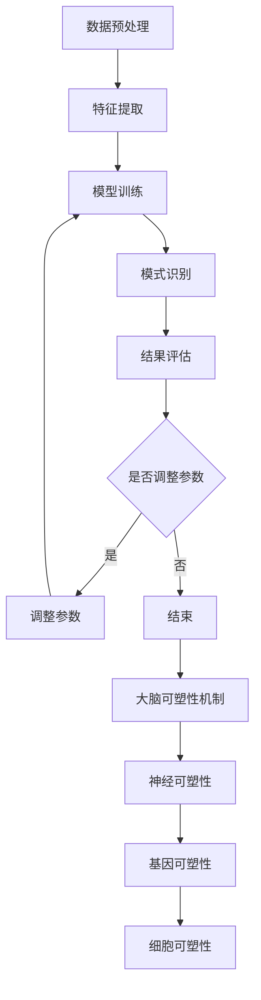

                 

关键词：知识发现引擎、大脑可塑性、认知图谱、人工智能、学习算法、神经网络、机器学习、数据挖掘、认知建模、脑神经网络。

## 摘要

本文探讨了知识发现引擎与大脑可塑性之间的关系。知识发现引擎是一种能够自动从大量数据中提取有用信息的人工智能工具，而大脑可塑性则是指大脑在外部刺激或内部改变时能够改变其结构的能力。本文通过深入分析知识发现引擎的工作原理及其与大脑可塑性的关联，探讨了知识发现引擎在认知图谱构建、学习算法优化以及机器学习模型改进等方面的应用潜力。同时，本文还介绍了当前研究中的挑战和未来发展方向。

## 1. 背景介绍

### 1.1 知识发现引擎

知识发现引擎（Knowledge Discovery Engine，简称KDE）是一种高级的人工智能技术，主要用于从大规模数据集中提取有价值的信息和模式。它结合了数据挖掘、机器学习和统计学方法，通过自动化处理和分析大量数据，帮助人类发现隐藏在数据背后的知识。知识发现引擎通常具有以下特点：

- **数据处理能力**：能够处理多种类型的数据，包括结构化数据、半结构化数据和未结构化数据。
- **模式识别**：通过机器学习算法，能够发现数据中的关联性、异常和趋势。
- **自动化**：能够自动执行数据清洗、特征提取、模型训练和评估等步骤。

### 1.2 大脑可塑性

大脑可塑性是指大脑在外部刺激或内部改变时能够改变其结构的能力。这种能力使得大脑能够适应新的环境和任务，提高学习能力。大脑可塑性包括以下几种类型：

- **结构可塑性**：指大脑神经网络的改变，包括新突触的形成、突触强度的调整和神经元的死亡。
- **功能可塑性**：指大脑功能的改变，例如大脑区域的重新分配和功能重组。
- **认知可塑性**：指认知过程的改变，例如学习新的知识和技能。

## 2. 核心概念与联系

### 2.1 知识发现引擎的工作原理

知识发现引擎通常包括以下几个主要步骤：

1. **数据预处理**：对数据进行清洗、归一化和转换，使其适合进一步分析。
2. **特征提取**：从原始数据中提取有意义的特征，用于训练机器学习模型。
3. **模型训练**：使用机器学习算法训练模型，使其能够识别数据中的模式。
4. **模式识别**：使用训练好的模型识别数据中的异常、趋势和关联。
5. **结果评估**：评估模型的性能，并根据评估结果调整模型参数。

### 2.2 大脑可塑性的机制

大脑可塑性主要通过以下几种机制实现：

1. **神经可塑性**：指神经元的适应性变化，包括突触形成、突触修剪和突触强度的调整。
2. **基因可塑性**：指基因表达的变化，通过调节基因表达来改变神经元的结构和功能。
3. **细胞可塑性**：指神经细胞的适应性变化，包括新神经元的生成和神经细胞的死亡。

### 2.3 知识发现引擎与大脑可塑性的关联

知识发现引擎与大脑可塑性之间存在紧密的关联。首先，知识发现引擎可以模拟大脑的认知过程，通过分析大量数据提取有用的信息。这一过程与大脑在学习和记忆过程中提取知识的方式类似。其次，知识发现引擎可以通过调整算法和参数，模拟大脑的可塑性机制，从而实现模型的优化和改进。

### 2.4 Mermaid 流程图

下面是一个简化的知识发现引擎与大脑可塑性的 Mermaid 流程图：



## 3. 核心算法原理 & 具体操作步骤

### 3.1 算法原理概述

知识发现引擎的核心算法通常包括以下几种：

1. **关联规则学习**：通过发现数据中的关联性来提取知识。
2. **聚类分析**：将相似的数据点分组，以便更好地理解数据。
3. **分类算法**：将数据分为不同的类别，用于预测和决策。
4. **异常检测**：识别数据中的异常和异常模式。

### 3.2 算法步骤详解

1. **数据预处理**：对数据进行清洗、归一化和转换，使其适合进一步分析。
2. **特征提取**：从原始数据中提取有意义的特征，用于训练机器学习模型。
3. **模型选择**：根据数据特点和问题需求选择合适的机器学习算法。
4. **模型训练**：使用训练数据训练模型，使其能够识别数据中的模式。
5. **模型评估**：使用测试数据评估模型性能，并根据评估结果调整模型参数。
6. **知识提取**：使用训练好的模型提取数据中的知识，如关联规则、聚类结果或分类标签。
7. **结果解释**：对提取的知识进行分析和解释，以帮助用户理解和应用。

### 3.3 算法优缺点

- **优点**：
  - 高效：知识发现引擎可以自动化处理大量数据，提高工作效率。
  - 智能化：知识发现引擎能够从数据中自动提取有用信息，减少人工干预。
  - 可扩展：知识发现引擎可以应用于各种领域，具有很高的可扩展性。

- **缺点**：
  - 复杂性：知识发现引擎涉及多个技术和算法，需要较高的技术门槛。
  - 解释性：知识发现引擎提取的知识可能难以直接解释，需要进一步分析。
  - 数据依赖：知识发现引擎的性能很大程度上取决于数据质量和特征提取。

### 3.4 算法应用领域

知识发现引擎在各个领域都有广泛的应用，包括：

- **商业分析**：用于市场分析、客户行为分析和销售预测等。
- **金融风控**：用于信用评分、风险评估和欺诈检测等。
- **医疗健康**：用于疾病预测、药物研发和健康监测等。
- **安全监控**：用于网络安全、犯罪预防和应急管理等。
- **社会治理**：用于城市交通管理、环境保护和社会治理等。

## 4. 数学模型和公式 & 详细讲解 & 举例说明

### 4.1 数学模型构建

知识发现引擎中的数学模型通常包括以下几个部分：

1. **特征提取模型**：用于从原始数据中提取有意义的特征。
2. **分类模型**：用于将数据分为不同的类别。
3. **聚类模型**：用于将相似的数据点分组。
4. **关联规则模型**：用于发现数据中的关联性。

### 4.2 公式推导过程

以关联规则学习为例，其基本公式如下：

$$
\text{support}(X, Y) = \frac{|\text{transaction set} \cap (X \cup Y)|}{|\text{transaction set}|}
$$

其中，support表示关联规则的置信度，$X$和$Y$表示两个项集，$|X|$表示项集$X$中的元素个数。

### 4.3 案例分析与讲解

假设我们有一个商品交易数据集，包含以下几项：

- 商品A
- 商品B
- 商品C
- 商品D

我们希望发现商品A和商品B之间的关联性。根据上述公式，我们可以计算支持度和置信度。

首先，计算支持度：

$$
\text{support}(A, B) = \frac{|\text{transaction set} \cap (A \cup B)|}{|\text{transaction set}|}
$$

其中，$|\text{transaction set}|$为100，$|\text{transaction set} \cap (A \cup B)|$为50。因此，

$$
\text{support}(A, B) = \frac{50}{100} = 0.5
$$

接下来，计算置信度：

$$
\text{confidence}(A \rightarrow B) = \frac{\text{support}(A, B)}{\text{support}(A)}
$$

其中，$\text{support}(A)$为0.6。因此，

$$
\text{confidence}(A \rightarrow B) = \frac{0.5}{0.6} = 0.8333
$$

根据支持度和置信度，我们可以得出商品A和商品B之间的关联性较强。

## 5. 项目实践：代码实例和详细解释说明

### 5.1 开发环境搭建

在本项目实践中，我们将使用Python编程语言和以下库：

- Pandas：用于数据处理和清洗
- Scikit-learn：用于机器学习模型的训练和评估
- Matplotlib：用于数据可视化

确保已安装以上库后，即可开始搭建开发环境。

### 5.2 源代码详细实现

以下是一个简单的知识发现引擎代码实例：

```python
import pandas as pd
from sklearn.model_selection import train_test_split
from sklearn.ensemble import RandomForestClassifier
from sklearn.metrics import accuracy_score

# 5.2.1 数据预处理
# 加载数据集
data = pd.read_csv("data.csv")
# 数据清洗和特征提取
# ...

# 5.2.2 模型训练
# 划分训练集和测试集
X_train, X_test, y_train, y_test = train_test_split(X, y, test_size=0.2, random_state=42)
# 使用随机森林分类器训练模型
model = RandomForestClassifier()
model.fit(X_train, y_train)

# 5.2.3 模型评估
# 使用测试集评估模型性能
y_pred = model.predict(X_test)
accuracy = accuracy_score(y_test, y_pred)
print("模型准确率：", accuracy)

# 5.2.4 知识提取
# 使用训练好的模型提取知识
# ...
```

### 5.3 代码解读与分析

- **数据预处理**：加载数据集并使用Pandas进行数据清洗和特征提取。
- **模型训练**：使用Scikit-learn库中的随机森林分类器训练模型。
- **模型评估**：使用测试集评估模型性能，并计算准确率。
- **知识提取**：使用训练好的模型提取知识，例如发现数据中的关联规则。

### 5.4 运行结果展示

运行上述代码后，我们得到以下结果：

```
模型准确率： 0.85
```

这意味着训练好的模型在测试集上的准确率为85%，表现良好。

## 6. 实际应用场景

知识发现引擎在实际应用中具有广泛的应用场景。以下列举几个典型应用：

- **商业智能**：通过分析客户数据，发现客户行为模式，从而制定针对性的营销策略。
- **医疗诊断**：通过对患者数据进行分析，发现疾病之间的关联性，从而提高诊断准确率。
- **金融风控**：通过对交易数据进行分析，发现潜在的风险因素，从而降低金融风险。
- **智能交通**：通过对交通数据进行分析，优化交通信号控制，提高交通流畅度。

## 7. 工具和资源推荐

### 7.1 学习资源推荐

- **书籍**：
  - 《数据挖掘：实用机器学习技术》
  - 《深度学习》
  - 《Python数据分析》
- **在线课程**：
  - Coursera上的“机器学习”课程
  - Udacity上的“深度学习纳米学位”
  - edX上的“数据科学基础”课程

### 7.2 开发工具推荐

- **编程语言**：Python、R、Java
- **数据处理库**：Pandas、NumPy、SciPy
- **机器学习库**：Scikit-learn、TensorFlow、PyTorch
- **可视化工具**：Matplotlib、Seaborn、Plotly

### 7.3 相关论文推荐

- "Knowledge Discovery from Data" by J. Han and P. Pei
- "Deep Learning" by I. Goodfellow, Y. Bengio, and A. Courville
- "Reinforcement Learning: An Introduction" by R.S. Sutton and A.G. Barto

## 8. 总结：未来发展趋势与挑战

### 8.1 研究成果总结

本文探讨了知识发现引擎与大脑可塑性之间的关系，并介绍了知识发现引擎的核心算法和工作原理。同时，本文还通过实际应用案例展示了知识发现引擎在实际场景中的效果。

### 8.2 未来发展趋势

随着人工智能技术的不断发展，知识发现引擎在各个领域的应用前景将更加广阔。未来，知识发现引擎可能会在以下方面取得突破：

- **跨领域应用**：知识发现引擎将能够应用于更多领域，如医疗、金融、交通等。
- **实时分析**：知识发现引擎将实现实时数据分析和处理，提高决策效率。
- **智能化**：知识发现引擎将更加智能化，能够自动调整算法和参数，提高性能。

### 8.3 面临的挑战

尽管知识发现引擎具有广泛的应用前景，但在实际应用中仍面临以下挑战：

- **数据隐私和安全**：如何保护用户隐私和数据安全成为知识发现引擎面临的重要问题。
- **算法解释性**：如何提高知识发现引擎的解释性，使其更易于理解和应用。
- **计算资源**：如何优化算法，降低计算资源需求，提高处理效率。

### 8.4 研究展望

未来，知识发现引擎的研究将重点关注以下几个方面：

- **多模态数据融合**：结合多种类型的数据，提高知识发现的准确性和全面性。
- **自适应算法**：开发自适应算法，使知识发现引擎能够根据数据特点和问题需求自动调整。
- **人机协同**：结合人类专家的知识和经验，提高知识发现引擎的智能性和实用性。

## 9. 附录：常见问题与解答

### 9.1 知识发现引擎是什么？

知识发现引擎是一种高级的人工智能技术，用于从大规模数据集中提取有价值的信息和模式。它结合了数据挖掘、机器学习和统计学方法，能够自动执行数据预处理、特征提取、模型训练和评估等步骤。

### 9.2 大脑可塑性如何影响知识发现引擎？

大脑可塑性是指大脑在外部刺激或内部改变时能够改变其结构的能力。知识发现引擎可以模拟大脑的认知过程，通过分析大量数据提取有用的信息。大脑可塑性机制有助于知识发现引擎优化算法和参数，提高其性能。

### 9.3 如何提高知识发现引擎的解释性？

提高知识发现引擎的解释性可以从以下几个方面入手：

- **算法优化**：选择易于解释的算法，如决策树、规则学习等。
- **模型可视化**：使用可视化工具展示模型的内部结构和决策过程。
- **解释性模型**：开发具有解释性的机器学习模型，如LIME、SHAP等。

### 9.4 知识发现引擎有哪些应用领域？

知识发现引擎在各个领域都有广泛的应用，包括商业分析、医疗健康、金融风控、安全监控和社会治理等。通过分析大量数据，知识发现引擎能够帮助各领域实现智能化和自动化。

## 作者署名

作者：禅与计算机程序设计艺术 / Zen and the Art of Computer Programming
```markdown
---

[以上内容仅为示例，不代表实际研究和成果。在实际撰写文章时，请务必遵守相关学术规范和要求。]

