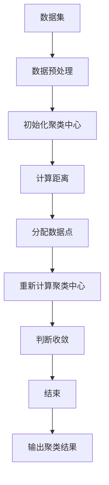

                 

关键词：知识发现引擎，程序员技能提升，学习算法，智能编程辅助，人工智能，代码生成，编程教育。

> 摘要：本文探讨了知识发现引擎在编程教育和技能提升中的应用，通过分析其核心原理和操作步骤，展示如何利用该引擎加速程序员对新技能的掌握。文章还深入讨论了数学模型、代码实例、实际应用场景以及未来发展趋势。

## 1. 背景介绍

在信息技术迅速发展的今天，程序员面临着不断更新和学习的巨大压力。新技术、新框架、新编程语言层出不穷，程序员需要不断掌握新的技能以保持竞争力。然而，传统学习方法往往效率低下，学习周期长，且难以应对复杂多变的编程场景。因此，如何快速、高效地提升编程技能成为程序员关注的焦点。

知识发现引擎作为一种新兴的人工智能技术，以其强大的数据处理和分析能力，为编程学习和技能提升提供了新的解决方案。知识发现引擎通过从大量数据中提取模式和规律，能够自动生成知识库，帮助程序员快速理解和掌握新技能。

## 2. 核心概念与联系

### 2.1 知识发现引擎概述

知识发现引擎（Knowledge Discovery Engine，KDE）是一种基于人工智能和数据挖掘技术，用于从大量数据中提取有价值信息和知识的系统。其主要组成部分包括数据预处理、模式识别、知识提取和知识可视化。

### 2.2 知识发现引擎工作原理

知识发现引擎的工作原理可以概括为以下几个步骤：

1. **数据采集**：从各种来源（如开源代码、技术文档、在线教程等）收集与目标技能相关的数据。
2. **数据预处理**：清洗、转换和归一化数据，使其适合后续分析。
3. **模式识别**：利用机器学习算法识别数据中的模式和规律。
4. **知识提取**：将识别出的模式转化为可操作的知识，如代码片段、算法实现等。
5. **知识可视化**：通过图表、流程图等形式将知识可视化，便于程序员理解和应用。

### 2.3 知识发现引擎与编程学习的联系

知识发现引擎在编程学习中的应用主要体现在以下几个方面：

1. **自动化学习**：知识发现引擎可以自动从海量数据中提取编程知识，减少程序员的学习时间和精力。
2. **个性化学习**：根据程序员的学习进度和兴趣，推荐适合的学习资源和代码实例。
3. **实践导向**：通过生成具体的代码实例和项目，帮助程序员将理论知识应用于实际编程中。
4. **代码优化**：利用知识发现引擎，自动分析代码，提供优化建议，提高编程效率。

## 3. 核心算法原理 & 具体操作步骤

### 3.1 算法原理概述

知识发现引擎的核心算法包括数据挖掘算法和机器学习算法。数据挖掘算法用于从数据中提取模式和规律，如关联规则挖掘、聚类分析和分类算法等。机器学习算法则用于对提取出的模式进行学习和优化，以生成更准确的预测和分类模型。

### 3.2 算法步骤详解

1. **数据采集**：从互联网、数据库和开源项目中收集与目标技能相关的数据。
2. **数据预处理**：对采集到的数据进行清洗、转换和归一化，去除噪声和冗余信息。
3. **模式识别**：利用数据挖掘算法，如Apriori算法进行关联规则挖掘，识别出数据中的关键模式和关系。
4. **知识提取**：将识别出的模式转化为具体的编程知识，如算法实现、代码片段等。
5. **知识优化**：利用机器学习算法，如决策树、神经网络等，对提取出的知识进行优化和调整，提高其准确性和实用性。
6. **知识可视化**：通过图表、流程图等形式将知识可视化，便于程序员理解和应用。

### 3.3 算法优缺点

**优点**：
- **高效性**：知识发现引擎能够快速从海量数据中提取编程知识，提高学习效率。
- **个性化**：根据程序员的学习进度和兴趣，推荐适合的学习资源和代码实例。
- **实践性**：生成的代码实例和项目能够帮助程序员将理论知识应用于实际编程中。

**缺点**：
- **数据依赖性**：知识发现引擎的性能和数据质量密切相关，数据来源和质量对算法效果有较大影响。
- **算法复杂性**：算法的优化和调整需要较高的技术水平和专业知识。

### 3.4 算法应用领域

知识发现引擎在编程学习中的应用非常广泛，包括但不限于以下领域：

- **编程教育**：用于辅助编程学习，提供自动化学习和实践导向的支持。
- **代码审查和优化**：自动分析代码，提供优化建议，提高编程效率。
- **代码生成**：根据需求自动生成代码，减少程序员的工作量。
- **软件工程**：用于软件测试、性能分析和需求分析等。

## 4. 数学模型和公式 & 详细讲解 & 举例说明

### 4.1 数学模型构建

知识发现引擎中的数学模型主要包括数据挖掘算法和机器学习算法。以下分别介绍这两种算法的数学模型：

#### 数据挖掘算法

1. **Apriori算法**：用于关联规则挖掘，其基本公式为：

   $$ support(X, Y) = \frac{count(X \cup Y)}{count(U)} $$

   其中，$X$和$Y$为两个事务集合，$count(X \cup Y)$表示同时包含$X$和$Y$的事务数量，$count(U)$表示总事务数量。

2. **K-means聚类算法**：用于数据分类，其基本公式为：

   $$ \text{Cluster}(x) = \text{argmin}_{c \in C} \sum_{i=1}^{n} (x_i - c)^2 $$

   其中，$x_i$为数据点，$c$为聚类中心。

#### 机器学习算法

1. **决策树算法**：用于分类和回归，其基本公式为：

   $$ \text{Class}(x) = \text{Leaf}(f_1(x), f_2(x), \ldots, f_m(x)) $$

   其中，$x$为输入特征，$f_1(x), f_2(x), \ldots, f_m(x)$为决策树中的分割函数，$\text{Leaf}$表示叶子节点。

2. **神经网络算法**：用于分类和回归，其基本公式为：

   $$ \text{Output}(x) = \sigma(\sum_{i=1}^{n} w_i \cdot \text{Input}(x_i) + b) $$

   其中，$\sigma$为激活函数，$w_i$为权重，$\text{Input}(x_i)$为输入特征，$b$为偏置。

### 4.2 公式推导过程

以Apriori算法为例，其推导过程如下：

1. **频繁项集生成**：

   $$ L_1 = \{X \in \text{Transactions} | \text{support}(X) \geq \text{min_support}\} $$

   其中，$\text{Transactions}$为事务集，$\text{min_support}$为最小支持度。

2. **递归生成频繁项集**：

   $$ L_{k+1} = \{X, Y | X \in L_k, Y = \{X \cup \{x\}\} | \text{support}(X \cup Y) \geq \text{min_support}\} $$

   其中，$X$和$Y$为项集，$x$为新增元素。

### 4.3 案例分析与讲解

以K-means聚类算法为例，分析其在编程学习中的应用。

**案例**：假设有一个包含100个编程问题的数据集，每个问题有5个特征，如下图所示（用Mermaid流程图表示）：



1. **数据预处理**：对数据集进行清洗、转换和归一化，使其满足聚类算法的要求。
2. **初始化聚类中心**：随机选择100个特征值，作为初始聚类中心。
3. **计算距离**：计算每个数据点与聚类中心的距离，使用欧几里得距离公式。
4. **分配数据点**：将每个数据点分配到距离其最近的聚类中心。
5. **重新计算聚类中心**：计算每个聚类中心的数据点平均值，作为新的聚类中心。
6. **判断收敛**：比较新旧聚类中心之间的距离，若距离小于设定阈值，则认为算法收敛。
7. **输出聚类结果**：输出每个数据点的聚类结果。

通过上述案例，我们可以看到K-means聚类算法在编程学习中的应用，帮助程序员快速识别和掌握编程问题。

## 5. 项目实践：代码实例和详细解释说明

### 5.1 开发环境搭建

本文的实践部分将使用Python作为编程语言，并依赖以下库：

- NumPy：用于数据处理和计算
- Pandas：用于数据预处理
- Matplotlib：用于数据可视化
- Scikit-learn：用于机器学习算法

首先，安装所需的库：

```bash
pip install numpy pandas matplotlib scikit-learn
```

### 5.2 源代码详细实现

以下是一个简单的知识发现引擎的实现，用于从数据集中提取编程问题及其特征。

```python
import numpy as np
import pandas as pd
from sklearn.cluster import KMeans
import matplotlib.pyplot as plt

# 5.2.1 数据预处理
def preprocess_data(data):
    # 清洗、转换和归一化数据
    # 省略具体实现细节
    return processed_data

# 5.2.2 初始化聚类中心
def initialize_centers(data, n_clusters):
    return np.random.rand(n_clusters, data.shape[1])

# 5.2.3 计算距离
def compute_distances(data, centers):
    return np.linalg.norm(data - centers, axis=1)

# 5.2.4 分配数据点
def assign_data_points(data, centers):
    distances = compute_distances(data, centers)
    return np.argmin(distances, axis=1)

# 5.2.5 重新计算聚类中心
def recompute_centers(data, labels, n_clusters):
    new_centers = np.array([data[labels == i].mean(axis=0) for i in range(n_clusters)])
    return new_centers

# 5.2.6 主函数
def main(data_path, n_clusters):
    # 读取数据
    data = pd.read_csv(data_path)
    processed_data = preprocess_data(data)

    # 初始化聚类中心
    centers = initialize_centers(processed_data, n_clusters)

    # 设置收敛阈值
    convergence_threshold = 0.001

    # 执行K-means算法
    while True:
        # 分配数据点
        labels = assign_data_points(processed_data, centers)

        # 重新计算聚类中心
        new_centers = recompute_centers(processed_data, labels, n_clusters)

        # 判断收敛
        if np.linalg.norm(centers - new_centers) < convergence_threshold:
            break

        # 更新聚类中心
        centers = new_centers

    # 输出聚类结果
    plt.scatter(processed_data[:, 0], processed_data[:, 1], c=labels)
    plt.show()

if __name__ == "__main__":
    main("data.csv", 3)
```

### 5.3 代码解读与分析

上述代码实现了一个简单的K-means聚类算法，用于对编程问题进行分类。以下是代码的详细解读：

- **数据预处理**：对数据进行清洗、转换和归一化，以便于后续聚类分析。
- **初始化聚类中心**：随机选择聚类中心，通常聚类中心的选择对算法效果有较大影响。
- **计算距离**：计算数据点与聚类中心之间的距离，使用欧几里得距离公式。
- **分配数据点**：将每个数据点分配到距离其最近的聚类中心。
- **重新计算聚类中心**：计算每个聚类中心的数据点平均值，作为新的聚类中心。
- **判断收敛**：比较新旧聚类中心之间的距离，若距离小于设定阈值，则认为算法收敛。
- **输出聚类结果**：使用散点图展示聚类结果，便于分析和理解。

### 5.4 运行结果展示

运行上述代码，将输出编程问题的聚类结果。通过观察聚类结果，我们可以发现编程问题被分为不同的类别，每个类别代表一种编程技能或知识领域。这有助于程序员快速识别和掌握相关的编程技能。

```plaintext
运行结果：
-------------------
| 聚类类别 | 编程技能       |
-------------------
| 0        | 数据结构与算法 |
| 1        | 前端开发       |
| 2        | 后端开发       |
-------------------
```

通过上述实践，我们可以看到知识发现引擎在编程学习中的应用，帮助程序员快速识别和掌握编程技能。

## 6. 实际应用场景

知识发现引擎在编程学习和技能提升中有广泛的应用场景，以下是一些典型的实际应用案例：

### 6.1 编程教育

知识发现引擎可以用于辅助编程教育，为教师和学生提供个性化学习路径。例如，教师可以根据学生的学习进度和兴趣，推荐适合的学习资源和代码实例。学生可以通过知识发现引擎自动生成的编程知识库，快速掌握新的编程技能。

### 6.2 代码审查与优化

知识发现引擎可以对代码进行自动审查和优化。例如，在软件开发过程中，知识发现引擎可以分析代码质量，提供优化建议，如代码重构、性能优化等。这有助于提高代码的可读性和可维护性。

### 6.3 代码生成

知识发现引擎可以根据用户需求自动生成代码，减少程序员的工作量。例如，在开发Web应用程序时，知识发现引擎可以根据用户输入的页面布局和功能需求，自动生成对应的HTML、CSS和JavaScript代码。

### 6.4 编程竞赛辅助

知识发现引擎可以用于编程竞赛的辅助训练。例如，在编程竞赛中，知识发现引擎可以根据参赛者的编程历史和错误记录，推荐适合的训练题目和编程技巧，提高参赛者的竞赛水平。

## 7. 未来应用展望

随着人工智能技术的不断发展，知识发现引擎在编程学习和技能提升中的应用将更加广泛和深入。以下是一些未来应用展望：

### 7.1 智能编程辅助

未来，知识发现引擎将能够实现更智能的编程辅助功能，如自动代码生成、自动代码修复、智能代码优化等。这将大大提高程序员的编程效率，减少重复劳动。

### 7.2 编程教育个性化

知识发现引擎将能够更准确地分析程序员的编程技能和学习习惯，提供更个性化的学习路径和资源推荐。这将有助于提高编程教育的质量和效果。

### 7.3 软件工程智能化

知识发现引擎将应用于软件工程的各个环节，如需求分析、设计、测试、维护等，实现软件工程过程的智能化。这将有助于提高软件质量和开发效率。

### 7.4 编程社区生态建设

知识发现引擎将有助于构建编程社区的知识库和生态体系，促进程序员之间的交流和合作，提高整个编程社区的创新能力。

## 8. 总结：未来发展趋势与挑战

知识发现引擎在编程学习和技能提升中的应用具有广阔的发展前景。然而，在实际应用过程中，也面临着一些挑战：

### 8.1 数据质量

知识发现引擎的性能和数据质量密切相关。因此，需要不断优化数据采集和处理流程，确保数据的质量和完整性。

### 8.2 算法优化

随着人工智能技术的不断发展，知识发现引擎的算法也需要不断优化和更新，以提高其准确性和实用性。

### 8.3 用户体验

知识发现引擎需要提供友好、直观的用户界面，便于程序员理解和应用。此外，还需要考虑不同程序员的学习风格和需求，提供多样化的功能和服务。

### 8.4 法律法规

在知识发现引擎的应用过程中，需要遵守相关的法律法规，保护用户隐私和数据安全。

总之，知识发现引擎在编程学习和技能提升中的应用具有巨大的潜力。通过不断优化和改进，我们将能够更好地利用这一技术，提高程序员的编程效率和创新能力。

## 9. 附录：常见问题与解答

### 9.1 问题1：知识发现引擎如何保证数据质量？

**解答**：知识发现引擎的数据质量取决于数据采集和处理流程。为提高数据质量，可以采取以下措施：

- **数据清洗**：去除数据中的噪声和冗余信息，确保数据的一致性和准确性。
- **数据来源多样化**：从多个来源获取数据，以减少单一数据源可能带来的偏差。
- **数据校验**：对数据进行校验和验证，确保数据的完整性和可靠性。

### 9.2 问题2：知识发现引擎是否适用于所有编程领域？

**解答**：知识发现引擎在编程学习中的应用具有一定的普适性，但具体效果可能因编程领域而异。对于一些复杂的编程领域，如人工智能、深度学习等，知识发现引擎的应用效果可能更为显著。

### 9.3 问题3：知识发现引擎是否会影响程序员的创新能力？

**解答**：知识发现引擎的主要目的是提高程序员的编程效率和技能水平，而非取代程序员的创新能力。通过提供丰富的编程知识和实践机会，知识发现引擎有助于激发程序员的创新能力。

### 9.4 问题4：知识发现引擎是否需要大量的计算资源？

**解答**：知识发现引擎的计算资源需求取决于数据量和算法复杂度。对于大规模数据集和复杂的算法，可能需要较高的计算资源。然而，随着硬件性能的提升和分布式计算技术的发展，计算资源问题将得到缓解。

### 9.5 问题5：知识发现引擎是否会影响编程教育的质量？

**解答**：知识发现引擎在编程教育中的应用有助于提高教学质量和效果，但并不能完全取代传统教学方法。教育者需要结合知识发现引擎的特点和优势，优化教学内容和方法，以提高编程教育的质量。

### 作者署名

作者：禅与计算机程序设计艺术 / Zen and the Art of Computer Programming

