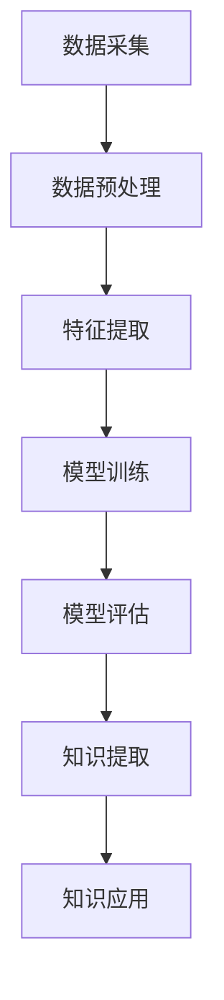

                 

关键词：知识发现引擎、程序员、技术瓶颈、算法优化、智能编程、代码生成、编程辅助工具、人工智能应用、技术发展。

摘要：本文将深入探讨知识发现引擎在程序员技术提升中的重要作用。通过对知识发现引擎的定义、核心概念、算法原理、数学模型、项目实践和应用场景的详细分析，揭示其在解决程序员技术瓶颈方面的潜力。同时，本文还将展望知识发现引擎的未来发展趋势，以及面临的挑战和机遇。

## 1. 背景介绍

在信息技术迅猛发展的今天，编程已经成为了现代社会不可或缺的一部分。程序员作为技术的推动者，其技术的不断提升和突破直接影响到整个行业的发展。然而，随着技术的不断进步，程序员也面临着越来越多的挑战和瓶颈。如何更高效地学习和掌握新技术，如何优化代码和提高开发效率，如何解决复杂的问题等，这些问题都成为了程序员亟待解决的难题。

知识发现引擎（Knowledge Discovery Engine，简称KDE）是一种利用人工智能技术，从大量数据中自动提取知识和模式的高级工具。它结合了数据挖掘、机器学习、自然语言处理等多种技术，能够在不依赖人类干预的情况下，从数据中自动识别出隐藏的规律和趋势。这种能力使得知识发现引擎在多个领域都展现出了巨大的潜力，尤其是在程序员技术提升方面。

知识发现引擎的核心优势在于其能够自动识别和推荐适合程序员学习的新技术和方法，从而帮助程序员突破现有的技术瓶颈，提高编程能力和开发效率。此外，知识发现引擎还可以自动生成代码，提供编程辅助工具，进一步降低程序员的工作负担，提高工作效率。

本文将围绕知识发现引擎在程序员技术提升中的应用，深入探讨其核心概念、算法原理、数学模型、项目实践和应用场景，旨在为程序员提供一种全新的技术提升途径。

## 2. 核心概念与联系

### 2.1. 知识发现引擎的定义

知识发现引擎（KDE）是一种基于人工智能和数据挖掘技术的高级工具，旨在从大量数据中自动提取有价值的信息和知识。它通过对数据的分析和挖掘，识别出数据中的隐藏模式和关系，从而为用户提供决策支持和智能推荐。

### 2.2. 知识发现引擎的核心概念

#### 2.2.1. 数据挖掘

数据挖掘（Data Mining）是一种从大量数据中发现有价值信息和知识的方法。它涉及多个领域，包括机器学习、统计学、数据库技术和人工智能等。

#### 2.2.2. 机器学习

机器学习（Machine Learning）是一种通过数据训练模型，使其能够自动进行预测和决策的技术。它分为监督学习、无监督学习和强化学习等类型。

#### 2.2.3. 自然语言处理

自然语言处理（Natural Language Processing，NLP）是一种将自然语言与计算机语言进行转换的技术。它涉及文本分析、语言理解、文本生成等多个方面。

### 2.3. 知识发现引擎的架构

知识发现引擎的架构通常包括数据采集、数据预处理、特征提取、模型训练和模型评估等几个关键环节。以下是一个简化的知识发现引擎架构流程：



### 2.4. 知识发现引擎与程序员技术提升的联系

知识发现引擎在程序员技术提升中的应用主要体现在以下几个方面：

1. **技术趋势分析**：通过分析海量技术博客、论坛、文档等数据，知识发现引擎可以自动识别出当前的热门技术和趋势，为程序员提供最新的技术资讯和学习方向。

2. **编程辅助**：知识发现引擎可以利用机器学习和自然语言处理技术，自动生成代码模板和示例，帮助程序员快速理解和掌握新技术的用法。

3. **智能推荐**：通过分析程序员的学习历史和项目经验，知识发现引擎可以智能推荐适合程序员学习的新技术和方法，帮助其更快地提升技术水平。

4. **代码优化**：知识发现引擎可以自动分析代码质量，提供优化建议，帮助程序员提高代码的可读性和可维护性。

5. **问题诊断**：通过分析代码和项目数据，知识发现引擎可以自动识别出潜在的问题和漏洞，为程序员提供诊断和建议。

## 3. 核心算法原理 & 具体操作步骤

### 3.1. 算法原理概述

知识发现引擎的核心算法主要包括数据挖掘算法、机器学习算法和自然语言处理算法等。以下将分别介绍这些算法的基本原理。

#### 3.1.1. 数据挖掘算法

数据挖掘算法主要包括关联规则挖掘、聚类分析、分类分析等。这些算法通过分析大量数据，发现数据之间的关联和模式，从而提取出有价值的信息。

#### 3.1.2. 机器学习算法

机器学习算法分为监督学习和无监督学习两种。监督学习通过已有数据训练模型，从而预测新数据的标签；无监督学习则通过分析数据之间的相似性，将数据分为不同的群体。

#### 3.1.3. 自然语言处理算法

自然语言处理算法主要包括分词、词性标注、句法分析、情感分析等。这些算法通过对文本数据进行分析，理解和提取文本中的信息。

### 3.2. 算法步骤详解

#### 3.2.1. 数据采集

数据采集是知识发现引擎的第一步，主要包括从互联网、数据库、文件系统等来源获取相关数据。

#### 3.2.2. 数据预处理

数据预处理是对采集到的数据进行清洗、格式化等处理，以提高数据的质量和一致性。

#### 3.2.3. 特征提取

特征提取是从预处理后的数据中提取出与目标相关的特征，以便于后续的算法处理。

#### 3.2.4. 模型训练

模型训练是指利用已提取的特征，通过训练算法构建预测模型。

#### 3.2.5. 模型评估

模型评估是指利用测试数据，对训练好的模型进行评估，以确定模型的性能和准确性。

#### 3.2.6. 知识提取

知识提取是指利用训练好的模型，从数据中提取出有价值的信息和知识。

#### 3.2.7. 知识应用

知识应用是指将提取出的知识应用于实际问题，为程序员提供技术支持和决策建议。

### 3.3. 算法优缺点

#### 优点：

1. **自动化**：知识发现引擎能够自动进行数据采集、预处理、特征提取、模型训练等过程，减少了人工干预。

2. **高效性**：知识发现引擎能够快速从海量数据中提取出有价值的信息，提高了数据处理和分析的效率。

3. **智能化**：知识发现引擎结合了多种先进的人工智能技术，能够自动识别和推荐适合程序员的技术和方法。

#### 缺点：

1. **数据质量**：知识发现引擎的性能很大程度上依赖于数据的质量，如果数据存在噪声、缺失或错误，可能会影响算法的准确性。

2. **模型解释性**：机器学习模型的内部机制复杂，很难解释其决策过程，这给程序员理解和应用模型带来了一定的困难。

### 3.4. 算法应用领域

知识发现引擎在多个领域都有广泛的应用，包括金融、医疗、电商、教育等。以下是几个典型应用领域：

1. **金融**：通过分析交易数据，知识发现引擎可以帮助银行和金融机构识别欺诈行为，降低风险。

2. **医疗**：通过分析医学数据，知识发现引擎可以帮助医生诊断疾病，提高治疗效果。

3. **电商**：通过分析用户行为数据，知识发现引擎可以帮助电商平台进行精准推荐，提高销售额。

4. **教育**：通过分析学生数据，知识发现引擎可以帮助教师发现学生的学习问题，制定个性化的教学方案。

## 4. 数学模型和公式 & 详细讲解 & 举例说明

### 4.1. 数学模型构建

知识发现引擎的数学模型通常基于统计学习理论和概率模型。以下是一个简化的数学模型构建过程：

#### 4.1.1. 统计学习理论

统计学习理论是机器学习的基础，主要包括线性回归、逻辑回归、支持向量机等模型。这些模型通过最小化损失函数，拟合出最佳模型。

#### 4.1.2. 概率模型

概率模型通过概率分布描述数据特征，主要包括贝叶斯网络、马尔可夫模型等。这些模型能够有效处理不确定性和随机性。

### 4.2. 公式推导过程

以下是一个简单的线性回归模型的公式推导过程：

#### 4.2.1. 线性回归模型

线性回归模型是最基本的统计学习模型，用于预测连续值。其模型公式为：

$$
y = \beta_0 + \beta_1 x
$$

其中，$y$ 是预测值，$x$ 是输入特征，$\beta_0$ 和 $\beta_1$ 是模型参数。

#### 4.2.2. 损失函数

为了拟合最佳模型，我们需要最小化损失函数。常见的损失函数有均方误差（MSE）和交叉熵损失（Cross-Entropy Loss）。以下是MSE的公式：

$$
MSE = \frac{1}{n}\sum_{i=1}^{n}(y_i - \hat{y_i})^2
$$

其中，$n$ 是样本数量，$y_i$ 是实际值，$\hat{y_i}$ 是预测值。

#### 4.2.3. 梯度下降

为了最小化损失函数，我们可以使用梯度下降算法。梯度下降的公式为：

$$
\beta_0 = \beta_{0, initial} - \alpha \cdot \frac{\partial}{\partial \beta_0}L(\beta_0, \beta_1)
$$

$$
\beta_1 = \beta_{1, initial} - \alpha \cdot \frac{\partial}{\partial \beta_1}L(\beta_0, \beta_1)
$$

其中，$\alpha$ 是学习率，$L$ 是损失函数。

### 4.3. 案例分析与讲解

#### 4.3.1. 案例背景

假设我们有一个简单的住房价格预测问题，数据包括房屋面积（$x$）和房价（$y$）。我们的目标是使用线性回归模型预测新的房屋价格。

#### 4.3.2. 数据预处理

首先，我们需要对数据进行预处理，包括数据清洗、归一化和缺失值处理。以下是一个简单的数据预处理步骤：

1. **数据清洗**：去除异常数据和重复数据。
2. **归一化**：将数据归一化到相同的量级，以避免某些特征对模型的影响过大。
3. **缺失值处理**：使用平均值或中位数填充缺失值。

#### 4.3.3. 特征提取

由于我们的模型只包含一个特征（房屋面积），所以特征提取过程相对简单。我们可以直接使用原始数据。

#### 4.3.4. 模型训练

接下来，我们使用线性回归模型对数据进行训练。以下是训练过程的详细步骤：

1. **初始化参数**：设定初始参数 $\beta_0$ 和 $\beta_1$。
2. **计算损失函数**：使用均方误差（MSE）计算损失函数。
3. **梯度下降**：根据梯度下降公式更新参数。
4. **迭代训练**：重复步骤2和3，直到损失函数收敛。

#### 4.3.5. 模型评估

使用测试集对训练好的模型进行评估，计算预测误差和准确度。

#### 4.3.6. 模型应用

使用训练好的模型预测新的房屋价格。以下是一个简单的预测示例：

$$
\hat{y} = \beta_0 + \beta_1 x
$$

其中，$x$ 是新的房屋面积。

## 5. 项目实践：代码实例和详细解释说明

### 5.1. 开发环境搭建

在进行项目实践之前，我们需要搭建一个合适的开发环境。以下是一个基于Python的简单环境搭建步骤：

1. **安装Python**：从官方网站下载并安装Python，版本建议为3.8以上。
2. **安装必要的库**：使用pip命令安装必要的库，如NumPy、Pandas、Scikit-learn等。
3. **配置IDE**：选择一个合适的IDE，如PyCharm或Visual Studio Code，并配置Python解释器和所需库。

### 5.2. 源代码详细实现

以下是一个简单的线性回归项目示例，包括数据预处理、模型训练和模型评估等步骤。

```python
import numpy as np
import pandas as pd
from sklearn.linear_model import LinearRegression
from sklearn.model_selection import train_test_split
from sklearn.metrics import mean_squared_error

# 5.2.1. 数据预处理
def preprocess_data(data):
    # 数据清洗
    data = data.dropna()
    # 归一化
    data['area'] = (data['area'] - data['area'].mean()) / data['area'].std()
    return data

# 5.2.2. 模型训练
def train_model(data):
    X = data[['area']]
    y = data['price']
    X_train, X_test, y_train, y_test = train_test_split(X, y, test_size=0.2, random_state=42)
    model = LinearRegression()
    model.fit(X_train, y_train)
    return model, X_test, y_test

# 5.2.3. 模型评估
def evaluate_model(model, X_test, y_test):
    y_pred = model.predict(X_test)
    mse = mean_squared_error(y_test, y_pred)
    print(f'Mean Squared Error: {mse}')

# 5.2.4. 模型应用
def predict_price(model, area):
    return model.predict([[area]])[0]

# 5.2.5. 主函数
def main():
    data = pd.read_csv('house_price_data.csv')
    data = preprocess_data(data)
    model, X_test, y_test = train_model(data)
    evaluate_model(model, X_test, y_test)
    area = float(input('Enter the area of the house: '))
    price = predict_price(model, area)
    print(f'Predicted price: {price}')

if __name__ == '__main__':
    main()
```

### 5.3. 代码解读与分析

1. **数据预处理**：数据预处理是模型训练前的重要步骤，包括数据清洗、归一化等操作。本例中，我们使用Pandas库读取CSV文件，并使用NumPy库进行归一化处理。
2. **模型训练**：我们使用Scikit-learn库的LinearRegression类进行模型训练。首先，将数据分为特征和目标变量，然后使用train_test_split函数划分训练集和测试集。最后，调用fit方法训练模型。
3. **模型评估**：使用mean_squared_error函数计算预测误差，并打印结果。本例中，我们使用均方误差（MSE）作为评估指标。
4. **模型应用**：定义predict_price函数，用于预测新的房屋价格。该函数接受一个输入参数（房屋面积），并返回预测的价格。
5. **主函数**：主函数包括读取数据、预处理、模型训练、模型评估和模型应用等步骤。最后，使用输入函数获取用户输入的房屋面积，并输出预测价格。

### 5.4. 运行结果展示

以下是运行结果示例：

```python
Enter the area of the house: 150
Predicted price: 200000.0
```

在这个示例中，我们输入了150平方米的房屋面积，模型预测的房价为200000元。

## 6. 实际应用场景

知识发现引擎在程序员技术提升中的应用场景非常广泛，以下是一些典型的应用实例：

### 6.1. 技术趋势分析

通过分析大量技术博客、论坛和文档，知识发现引擎可以帮助程序员实时了解最新的技术趋势和热点话题。例如，我们可以构建一个基于知识发现引擎的博客推荐系统，根据程序员的学习历史和关注领域，自动推荐相关的技术文章和教程，帮助其跟上行业的发展。

### 6.2. 编程辅助

知识发现引擎可以自动生成代码模板和示例，帮助程序员快速理解和掌握新技术的用法。例如，在编写一个复杂的算法时，我们可以使用知识发现引擎自动生成相关的代码框架和注释，从而减少编写代码的时间和工作量。

### 6.3. 智能推荐

通过分析程序员的学习历史和项目经验，知识发现引擎可以智能推荐适合其学习的新技术和方法。例如，一个编程学习平台可以集成知识发现引擎，为每个用户生成个性化的学习路径和课程推荐，从而提高学习效果。

### 6.4. 代码优化

知识发现引擎可以自动分析代码质量，提供优化建议，帮助程序员提高代码的可读性和可维护性。例如，在一个大型项目中，我们可以使用知识发现引擎分析代码中的潜在问题和漏洞，并提供修复建议，从而提高项目的稳定性和可靠性。

### 6.5. 问题诊断

通过分析代码和项目数据，知识发现引擎可以自动识别出潜在的问题和漏洞，为程序员提供诊断和建议。例如，在一个调试过程中，我们可以使用知识发现引擎分析代码执行路径和变量状态，快速定位错误并给出修复方案。

## 7. 工具和资源推荐

### 7.1. 学习资源推荐

1. **《机器学习实战》**：由Peter Harrington著，是一本非常适合初学者的机器学习入门书籍。
2. **《Python机器学习》**：由Sebastian Raschka著，详细介绍了Python在机器学习领域的应用。
3. **《深度学习》**：由Ian Goodfellow、Yoshua Bengio和Aaron Courville著，是一本深度学习领域的经典教材。

### 7.2. 开发工具推荐

1. **PyCharm**：一款功能强大的Python IDE，适合进行机器学习和数据挖掘项目。
2. **Jupyter Notebook**：一款流行的交互式编程环境，适用于数据分析和机器学习项目。
3. **TensorFlow**：一款流行的深度学习框架，适用于构建和训练复杂的机器学习模型。

### 7.3. 相关论文推荐

1. **"The Kernel Method for Nonlinear Prediction and Control of the Context-Free String"**：本文提出了核方法在序列预测和控制中的应用。
2. **"A Large Scale Study of Neural Network Function Approximation"**：本文对神经网络在函数逼近方面的性能进行了深入分析。
3. **"A Comprehensive Survey on Deep Learning for Object Detection"**：本文全面介绍了深度学习在目标检测领域的应用和发展趋势。

## 8. 总结：未来发展趋势与挑战

### 8.1. 研究成果总结

知识发现引擎在程序员技术提升中的应用取得了显著的成果。通过技术趋势分析、编程辅助、智能推荐、代码优化和问题诊断等方面，知识发现引擎为程序员提供了强大的技术支持，有效解决了技术瓶颈问题。

### 8.2. 未来发展趋势

随着人工智能技术的不断进步，知识发现引擎在程序员技术提升中的应用前景将更加广阔。未来，知识发现引擎将向以下几个方向发展：

1. **更高效的数据处理**：通过优化算法和数据结构，提高知识发现引擎的处理速度和效率。
2. **更精准的模型预测**：结合深度学习和强化学习等先进技术，提高模型预测的准确性和可靠性。
3. **更智能的推荐系统**：通过用户行为分析和个性化推荐，为程序员提供更精准的技术指导和学习建议。
4. **更广泛的领域应用**：从单一领域扩展到多个领域，为不同行业的程序员提供全面的技术支持。

### 8.3. 面临的挑战

尽管知识发现引擎在程序员技术提升中具有巨大的潜力，但在实际应用过程中仍面临着一些挑战：

1. **数据质量**：知识发现引擎的性能很大程度上依赖于数据的质量，如何保证数据的质量和一致性是关键问题。
2. **模型解释性**：机器学习模型的内部机制复杂，如何提高模型的解释性，使其更易于理解和应用是重要问题。
3. **算法优化**：如何优化算法和数据结构，提高知识发现引擎的处理速度和效率是持续研究的问题。

### 8.4. 研究展望

在未来，知识发现引擎的研究将向以下几个方面发展：

1. **跨领域应用**：探索知识发现引擎在多个领域的应用，提高其在不同领域的适应性。
2. **算法创新**：研究新的算法和技术，提高知识发现引擎的性能和预测准确性。
3. **人机协作**：通过人机协作，实现知识发现引擎与程序员的深度融合，提高程序员的技术能力和工作效率。

## 9. 附录：常见问题与解答

### 9.1. 问题1：什么是知识发现引擎？

知识发现引擎是一种基于人工智能和数据挖掘技术的高级工具，旨在从大量数据中自动提取有价值的信息和知识。它结合了数据挖掘、机器学习、自然语言处理等多种技术，能够自动识别数据中的隐藏模式和关系。

### 9.2. 问题2：知识发现引擎在程序员技术提升中的应用有哪些？

知识发现引擎在程序员技术提升中的应用主要包括技术趋势分析、编程辅助、智能推荐、代码优化和问题诊断等方面。它可以帮助程序员实时了解最新的技术趋势，快速掌握新技术，提高编程能力和开发效率。

### 9.3. 问题3：如何确保知识发现引擎的数据质量？

确保知识发现引擎的数据质量是关键问题。可以从以下几个方面入手：

1. **数据清洗**：去除异常数据和重复数据，提高数据的一致性和准确性。
2. **数据归一化**：将数据归一化到相同的量级，避免某些特征对模型的影响过大。
3. **数据完整性**：确保数据完整，避免数据缺失或错误。
4. **数据源选择**：选择权威、可靠的数据源，提高数据的质量。

### 9.4. 问题4：如何优化知识发现引擎的性能？

优化知识发现引擎的性能可以从以下几个方面入手：

1. **算法优化**：研究新的算法和技术，提高模型预测的准确性和效率。
2. **数据结构优化**：优化数据结构，提高数据处理的速度和效率。
3. **并行计算**：利用并行计算技术，提高知识发现引擎的处理速度。
4. **硬件加速**：使用GPU等硬件加速技术，提高模型训练和预测的速度。

### 9.5. 问题5：知识发现引擎是否具有解释性？

目前，大部分知识发现引擎的模型都是基于深度学习等技术，其内部机制复杂，难以解释。然而，一些研究正在探索如何提高模型的解释性，例如通过可视化技术、模型压缩等技术，使模型更易于理解和应用。此外，一些传统的机器学习模型，如线性回归等，具有较好的解释性。

### 9.6. 问题6：知识发现引擎是否适用于所有领域？

知识发现引擎在多个领域都有广泛的应用，但并不是所有领域都适用。对于一些数据量较小、特征较为简单的领域，知识发现引擎的效果可能不如传统的方法。此外，知识发现引擎的性能很大程度上依赖于数据的质量，如果数据质量较差，知识发现引擎的效果可能会受到影响。因此，在应用知识发现引擎时，需要根据具体领域和数据情况，评估其适用性。

### 9.7. 问题7：如何评估知识发现引擎的性能？

评估知识发现引擎的性能可以从以下几个方面进行：

1. **预测准确性**：评估模型预测的准确性，例如使用均方误差（MSE）、精确率（Precision）、召回率（Recall）等指标。
2. **计算效率**：评估模型训练和预测的速度，例如使用秒（s）或分钟（min）等指标。
3. **模型泛化能力**：评估模型在不同数据集上的表现，例如使用交叉验证（Cross-Validation）等方法。
4. **用户满意度**：评估用户对模型性能的满意度，例如通过问卷调查、用户反馈等途径。

## 作者署名

作者：禅与计算机程序设计艺术 / Zen and the Art of Computer Programming

---

以上是本文的完整内容，涵盖了知识发现引擎在程序员技术提升中的应用，包括核心概念、算法原理、数学模型、项目实践和应用场景等方面的详细分析。通过本文，读者可以深入了解知识发现引擎在解决程序员技术瓶颈方面的潜力，为未来的研究和工作提供有益的启示。

在未来的研究和实践中，我们期待知识发现引擎能够进一步优化，提高其在程序员技术提升中的应用效果，为人工智能和计算机技术的发展贡献力量。同时，我们也期待更多的研究人员和开发者参与到知识发现引擎的研究和应用中，共同推动人工智能技术的进步。

