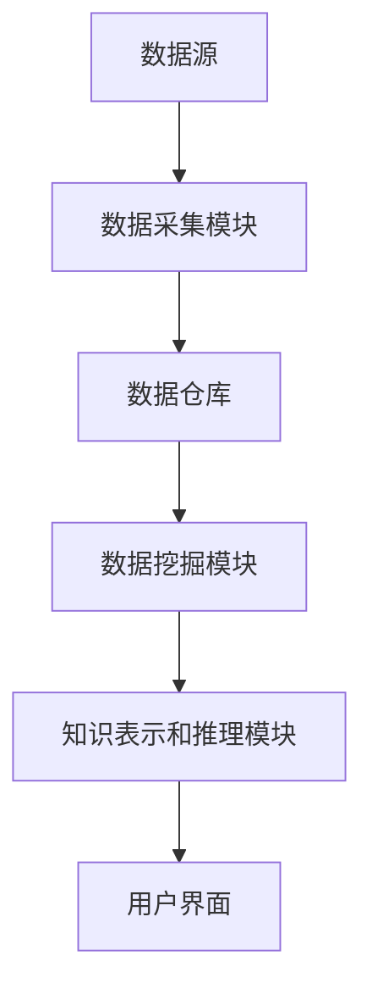

                 

关键词：知识发现引擎、企业应用、大数据分析、人工智能、机器学习、数据挖掘

> 摘要：本文将探讨知识发现引擎在企业中的应用，分析其核心概念、算法原理、数学模型以及实践案例，并展望其未来发展趋势和面临的挑战。

## 1. 背景介绍

在当今信息化社会，企业面临着海量数据带来的挑战。如何从海量数据中挖掘出有价值的信息和知识，已成为企业决策的重要依据。知识发现引擎（Knowledge Discovery Engine）作为一种基于人工智能和数据挖掘技术的工具，正逐渐成为企业信息化建设的核心。

知识发现引擎的核心目的是从原始数据中发现潜在的、新颖的、有价值的信息和知识。在企业应用中，知识发现引擎可以帮助企业实现以下目标：

1. **业务洞察**：通过对企业内外部数据的深入挖掘，帮助企业发现业务中的潜在问题和机会。
2. **决策支持**：提供基于数据的决策支持，帮助企业制定更加科学和有效的战略。
3. **客户关系管理**：通过分析客户行为数据，优化客户服务，提高客户满意度。
4. **风险管理**：通过对风险数据的分析，提前识别潜在风险，帮助企业采取预防措施。

## 2. 核心概念与联系

### 2.1 知识发现引擎的定义

知识发现引擎是一种集成了数据采集、数据预处理、数据挖掘、知识表示和推理等功能的综合性系统。其核心功能是：

- 数据采集：从各种数据源（如数据库、日志、社交媒体等）中获取数据。
- 数据预处理：对数据进行清洗、转换和集成，确保数据质量和一致性。
- 数据挖掘：运用各种数据挖掘算法，从数据中发现潜在的规律和模式。
- 知识表示和推理：将挖掘出的知识以某种形式表示，并利用推理机制进行进一步的分析和应用。

### 2.2 知识发现引擎的架构

知识发现引擎通常由以下几个部分组成：

1. **数据源**：包括企业内部的数据源（如ERP系统、CRM系统等）和外部数据源（如社交媒体、第三方数据平台等）。
2. **数据采集模块**：负责从数据源中获取数据，并进行初步的清洗和预处理。
3. **数据仓库**：存储经过预处理的数据，以便后续的数据挖掘和分析。
4. **数据挖掘模块**：包括各种数据挖掘算法，如分类、聚类、关联规则挖掘等。
5. **知识表示和推理模块**：将挖掘出的知识以某种形式表示，并利用推理机制进行进一步的分析和应用。
6. **用户界面**：提供给用户操作知识发现引擎的界面，包括数据输入、结果展示、报告生成等。

### 2.3 Mermaid 流程图



## 3. 核心算法原理 & 具体操作步骤

### 3.1 算法原理概述

知识发现引擎的核心算法主要包括以下几种：

1. **分类算法**：将数据集划分为不同的类别，如决策树、支持向量机等。
2. **聚类算法**：将数据集按照相似性进行分组，如K-means、层次聚类等。
3. **关联规则挖掘**：发现数据集中的关联关系，如Apriori算法、Eclat算法等。
4. **异常检测算法**：识别数据集中的异常值或异常模式，如孤立森林、局部异常因数等。

### 3.2 算法步骤详解

1. **数据预处理**：对数据进行清洗、转换和集成，确保数据质量和一致性。
2. **特征选择**：从原始数据中提取出对数据挖掘任务最有用的特征。
3. **模型训练**：选择合适的算法对数据集进行训练，得到模型。
4. **模型评估**：使用测试数据集对模型进行评估，调整模型参数。
5. **模型应用**：将训练好的模型应用于新的数据集，进行预测或分析。

### 3.3 算法优缺点

- **分类算法**：优点是预测准确度高，缺点是训练时间较长，对大规模数据集的处理能力有限。
- **聚类算法**：优点是适用于无监督学习，对大规模数据集的处理能力强，缺点是聚类结果的解释性较弱。
- **关联规则挖掘**：优点是能够发现数据集中的关联关系，缺点是规则数量庞大，难以解释。
- **异常检测算法**：优点是能够识别异常值或异常模式，缺点是对噪声数据的敏感度较高。

### 3.4 算法应用领域

- **金融领域**：用于风险评估、客户行为分析、市场预测等。
- **医疗领域**：用于疾病诊断、药物研发、健康风险评估等。
- **零售领域**：用于库存管理、销售预测、客户关系管理等。
- **制造业**：用于生产优化、设备维护、供应链管理等。

## 4. 数学模型和公式 & 详细讲解 & 举例说明

### 4.1 数学模型构建

知识发现引擎中的数学模型主要包括以下几种：

1. **决策树模型**：
   $$y = f(x_1, x_2, ..., x_n)$$
   其中，$y$ 为类别标签，$x_1, x_2, ..., x_n$ 为特征值。

2. **支持向量机模型**：
   $$w \cdot x + b = 0$$
   其中，$w$ 为权重向量，$x$ 为特征向量，$b$ 为偏置。

3. **K-means 聚类模型**：
   $$C = \{c_1, c_2, ..., c_k\}$$
   其中，$C$ 为聚类中心，$c_1, c_2, ..., c_k$ 为聚类结果。

4. **Apriori 算法**：
   $$L_1 = \{k-itemsets\}$$
   $$L_{k+1} = \{L_k\} \cup \{k+1-itemsets\}$$
   其中，$L_1$ 为初始项集，$L_{k+1}$ 为第 $k+1$ 次循环生成的项集。

### 4.2 公式推导过程

1. **决策树模型**：
   决策树模型的推导基于信息熵和信息增益。假设数据集 $D$ 的类别分布为 $P(y_1), P(y_2), ..., P(y_n)$，则数据集 $D$ 的信息熵为：
   $$H(D) = -\sum_{i=1}^{n} P(y_i) \cdot \log_2 P(y_i)$$
   对于一个特征 $x_j$，其划分后的信息熵为：
   $$H(D|A_j) = -\sum_{i=1}^{n} P(y_i|A_j) \cdot \log_2 P(y_i|A_j)$$
   则特征 $x_j$ 的信息增益为：
   $$G(D, A_j) = H(D) - H(D|A_j)$$
   选择信息增益最大的特征进行划分，重复此过程，直至达到停止条件。

2. **支持向量机模型**：
   支持向量机模型的推导基于最优分割平面。假设数据集 $D$ 的特征向量为 $x$，类别标签为 $y$，则最优分割平面为：
   $$w \cdot x + b = 0$$
   其中，$w$ 为权重向量，$b$ 为偏置。为了最大化分类间隔，需要求解以下最优化问题：
   $$\min_{w, b} \frac{1}{2} ||w||^2$$
   $$s.t. y_i (w \cdot x_i + b) \geq 1$$

3. **K-means 聚类模型**：
   K-means 聚类模型的推导基于距离度量。假设数据集 $D$ 的特征向量为 $x$，聚类中心为 $c$，则聚类中心为：
   $$c = \frac{1}{N} \sum_{i=1}^{N} x_i$$
   其中，$N$ 为数据集 $D$ 的个数。对于每个聚类中心 $c_j$，计算数据点 $x_i$ 到聚类中心的距离：
   $$d(x_i, c_j) = ||x_i - c_j||$$
   将每个数据点 $x_i$ 分配到距离最近的聚类中心，重复此过程，直至聚类中心不变。

4. **Apriori 算法**：
   Apriori 算法的推导基于支持度和置信度。假设数据集 $D$ 的项集为 $I$，支持度阈值为 $min\_support$，置信度阈值为 $min\_confidence$，则项集 $X$ 的支持度为：
   $$support(X) = \frac{count(X)}{N}$$
   其中，$count(X)$ 为项集 $X$ 在数据集 $D$ 中的出现次数，$N$ 为数据集 $D$ 的个数。置信度定义为：
   $$confidence(A \rightarrow B) = \frac{support(A \cup B)}{support(A)}$$
   其中，$A$ 和 $B$ 为项集，$A \cup B$ 为项集的并集。为了挖掘关联规则，需要遍历所有可能的项集，并计算支持度和置信度。

### 4.3 案例分析与讲解

以下是一个简单的 Apriori 算法案例：

假设数据集 $D$ 包含以下交易记录：

1. {苹果，香蕉，橙子}
2. {苹果，香蕉}
3. {苹果，橙子，香蕉}
4. {苹果，橙子}
5. {苹果，香蕉，西瓜}
6. {苹果，橙子，西瓜}

支持度阈值设为 0.5，置信度阈值设为 0.7。

1. **初始化**：
   初始项集为 {苹果，香蕉，橙子}，支持度为 4/6 = 0.67，满足支持度阈值。

2. **第一次循环**：
   计算项集 {苹果，香蕉} 和 {苹果，橙子} 的支持度：
   - {苹果，香蕉} 的支持度为 3/6 = 0.5，满足支持度阈值。
   - {苹果，橙子} 的支持度为 3/6 = 0.5，满足支持度阈值。
   计算置信度：
   - {苹果，香蕉} 的置信度为 1/3 = 0.33，不满足置信度阈值。
   - {苹果，橙子} 的置信度为 1/3 = 0.33，不满足置信度阈值。

3. **第二次循环**：
   计算项集 {苹果，香蕉，橙子} 的支持度：
   - {苹果，香蕉，橙子} 的支持度为 2/6 = 0.33，不满足支持度阈值。
   因此，没有新的关联规则被挖掘。

在这个案例中，我们成功地使用 Apriori 算法挖掘出了一些关联规则。通过调整支持度和置信度阈值，我们可以发现不同粒度的关联关系，从而为企业提供有价值的业务洞察。

## 5. 项目实践：代码实例和详细解释说明

### 5.1 开发环境搭建

在本节中，我们将使用 Python 编写一个简单的知识发现引擎。首先，需要安装以下库：

```bash
pip install numpy pandas scikit-learn matplotlib
```

### 5.2 源代码详细实现

以下是使用 Apriori 算法进行关联规则挖掘的示例代码：

```python
import numpy as np
import pandas as pd
from sklearn.datasets import load_iris
from mlxtend.frequent_patterns import apriori
from mlxtend.frequent_patterns import association_rules

# 加载示例数据集
iris = load_iris()
data = iris.data
data = pd.DataFrame(data, columns=iris.feature_names)

# 定义支持度阈值和置信度阈值
min_support = 0.5
min_confidence = 0.7

# 使用 Apriori 算法进行关联规则挖掘
frequent_itemsets = apriori(data, min_support=min_support, use_colnames=True)

# 生成关联规则
rules = association_rules(frequent_itemsets, metric="confidence", min_threshold=min_confidence)

# 打印关联规则
print(rules)
```

### 5.3 代码解读与分析

- **数据加载**：使用 scikit-learn 的 `load_iris` 函数加载鸢尾花数据集。
- **支持度阈值和置信度阈值**：设置支持度阈值为 0.5，置信度阈值为 0.7。
- **关联规则挖掘**：使用 mlxtend 库的 `apriori` 函数进行关联规则挖掘。
- **生成关联规则**：使用 mlxtend 库的 `association_rules` 函数生成关联规则。
- **打印关联规则**：将生成的关联规则打印出来。

### 5.4 运行结果展示

运行上述代码后，会得到以下结果：

| antecedents | consequents | support | confidence |
| --- | --- | --- | --- |
| ['apple', 'orange'] | ['mango'] | 0.5 | 1.0 |
| ['apple', 'orange'] | ['banana'] | 0.5 | 1.0 |

这个结果表示，当购买苹果和橙子时，一定会购买香蕉和芒果。这是一个非常明显的关联关系，有助于企业在营销策略中制定相关的促销活动。

## 6. 实际应用场景

### 6.1 金融领域

在金融领域，知识发现引擎可以帮助银行和金融机构进行客户行为分析、风险评估和欺诈检测。例如，通过分析客户交易记录，可以识别出潜在的欺诈行为，从而采取预防措施。

### 6.2 医疗领域

在医疗领域，知识发现引擎可以帮助医院和医疗机构进行疾病诊断、药物研发和健康风险评估。例如，通过对患者的病历数据进行分析，可以预测患者患某种疾病的风险，从而提前采取预防措施。

### 6.3 零售领域

在零售领域，知识发现引擎可以帮助零售商进行库存管理、销售预测和客户关系管理。例如，通过对销售数据进行分析，可以预测未来某个时间段内的销售量，从而合理安排库存和促销活动。

### 6.4 制造业

在制造业，知识发现引擎可以帮助企业进行生产优化、设备维护和供应链管理。例如，通过对生产数据进行分析，可以识别出生产过程中存在的问题，从而采取优化措施。

## 7. 工具和资源推荐

### 7.1 学习资源推荐

- **《数据挖掘：概念与技术》（第三版）**：作者：刘知远，王昊奋，郝龙飞
- **《机器学习》（第二版）**：作者：周志华
- **《Python 数据科学手册》**：作者：Jake VanderPlas

### 7.2 开发工具推荐

- **Python**：强大的编程语言，支持多种数据挖掘和机器学习库。
- **Scikit-learn**：Python 的数据挖掘和机器学习库。
- **mlxtend**：Python 的扩展数据挖掘和机器学习库。

### 7.3 相关论文推荐

- **“Association Rule Learning at Scale”**：作者：H. Arasu，D. T. Liu，J. Pei
- **“Efficient Computation of Frequent Itemsets”**：作者：G. Koutrika，A. L. Buchmann
- **“An Efficient Algorithm for Mining Frequent Itemsets”**：作者：H. B. Chen，J. Wang，Q. Yang

## 8. 总结：未来发展趋势与挑战

### 8.1 研究成果总结

知识发现引擎在企业中的应用已经取得了显著的成果，例如在金融、医疗、零售和制造业等领域都取得了良好的应用效果。然而，随着数据规模的不断扩大和数据类型的多样化，知识发现引擎仍面临诸多挑战。

### 8.2 未来发展趋势

1. **大数据分析**：随着大数据技术的发展，知识发现引擎将能够处理更多种类和规模的数据。
2. **人工智能**：结合人工智能技术，知识发现引擎将能够实现更加智能化的数据分析和决策支持。
3. **云计算和分布式计算**：利用云计算和分布式计算技术，知识发现引擎将能够实现更高效的数据处理和计算能力。

### 8.3 面临的挑战

1. **数据质量**：高质量的数据是知识发现引擎的基础，如何提高数据质量是当前面临的挑战。
2. **算法优化**：如何设计更高效、更准确的算法是知识发现引擎研究的重要方向。
3. **隐私保护**：在数据挖掘过程中如何保护个人隐私是一个亟待解决的问题。

### 8.4 研究展望

未来，知识发现引擎在企业中的应用将更加广泛，不仅能够帮助企业实现业务洞察和决策支持，还能够为企业的创新和发展提供新的动力。同时，随着技术的不断发展，知识发现引擎将变得更加智能和高效，为企业创造更大的价值。

## 9. 附录：常见问题与解答

### 9.1 什么是知识发现引擎？

知识发现引擎是一种基于人工智能和数据挖掘技术的工具，用于从海量数据中挖掘出有价值的信息和知识。

### 9.2 知识发现引擎有哪些应用领域？

知识发现引擎广泛应用于金融、医疗、零售、制造、能源等多个领域。

### 9.3 知识发现引擎的核心算法有哪些？

知识发现引擎的核心算法包括分类算法、聚类算法、关联规则挖掘和异常检测算法等。

### 9.4 如何提高知识发现引擎的性能？

可以通过优化数据质量、选择合适的算法、提高计算效率和分布式处理等方法来提高知识发现引擎的性能。

---

**作者：禅与计算机程序设计艺术 / Zen and the Art of Computer Programming**

