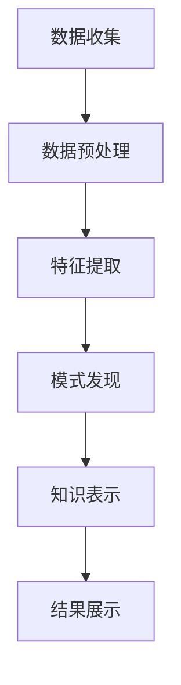

                 

 **关键词：** 知识发现引擎、文学研究、文本分析、数据挖掘、自然语言处理、机器学习

**摘要：** 本文探讨了知识发现引擎在文学研究中的创新应用。通过介绍知识发现引擎的基本概念和工作原理，结合自然语言处理、数据挖掘和机器学习等技术，本文详细阐述了知识发现引擎在文学研究中的应用场景，包括文本分析、情感分析、人物关系挖掘、风格识别等方面。同时，本文还对未来知识发现引擎在文学研究中的应用前景进行了展望，并提出了相关挑战和解决方案。

## 1. 背景介绍

### 文学研究的现状与挑战

文学研究作为人文社会科学的重要分支，历来受到学术界的高度重视。然而，随着时代的发展，文学研究的规模和复杂性不断增加，传统的文学研究方法已经难以满足现代学术的需求。首先，文学文本的数量和多样性急剧增加，使得文学研究者面临着海量的文本信息处理难题。其次，文学作品的深度和复杂性使得传统的文本分析方法难以充分挖掘文本中的深层次信息。此外，文学研究领域的跨学科特点，如心理学、社会学、语言学等，也增加了研究的难度。

### 知识发现引擎的兴起

知识发现引擎是一种基于数据挖掘和机器学习技术的高级信息处理工具，旨在从大规模数据中自动发现有价值的知识和信息。知识发现引擎的核心目标是从原始数据中提取潜在的模式、关联和趋势，为决策支持、科学研究、市场营销等提供有力支持。近年来，随着自然语言处理技术的不断进步，知识发现引擎在文本分析领域得到了广泛应用，为文学研究提供了一种全新的研究工具和方法。

## 2. 核心概念与联系

### 知识发现引擎的基本概念

知识发现引擎（Knowledge Discovery Engine，简称KDE）是一种能够自动从大规模数据中提取有用知识的系统。它主要包括以下几个关键组件：

- **数据预处理模块**：对原始数据进行清洗、去噪、转换等预处理操作，以提高数据质量。
- **特征提取模块**：从预处理后的数据中提取关键特征，以便进行后续分析。
- **模式发现模块**：利用机器学习算法和统计学方法，从特征数据中自动发现潜在的模式、关联和趋势。
- **知识表示模块**：将发现的模式转化为易于理解和使用的知识形式，如知识图谱、规则库等。

### 知识发现引擎与文本分析的联系

文本分析（Text Analysis）是指对文本数据进行结构化处理和分析的过程，以提取语义信息和知识。知识发现引擎与文本分析之间的联系主要表现在以下几个方面：

- **数据预处理**：知识发现引擎需要对文本数据（如文学作品、评论、文献等）进行预处理，如分词、词性标注、句法分析等，以便提取关键特征。
- **特征提取**：通过对预处理后的文本数据进行特征提取，如词频、词向量、主题模型等，为模式发现提供基础。
- **模式发现**：利用知识发现引擎的算法，从特征数据中自动发现文本中的潜在模式，如情感倾向、人物关系、主题分布等。
- **知识表示**：将发现的文本模式转化为易于理解和使用的知识形式，如情感分析报告、人物关系图谱、主题分布图等。

### Mermaid 流程图

以下是一个简化的知识发现引擎在文学研究中的应用流程图：



## 3. 核心算法原理 & 具体操作步骤

### 3.1 算法原理概述

知识发现引擎在文学研究中的应用主要包括以下几种核心算法：

- **自然语言处理（NLP）算法**：用于对文本数据（如文学作品、评论、文献等）进行分词、词性标注、句法分析等预处理操作，以提取关键特征。
- **文本分类算法**：用于对文本进行分类，如情感分类、主题分类等，以发现文本中的情感倾向和主题分布。
- **聚类算法**：用于对文本数据进行聚类分析，以发现文本中的潜在主题和人物关系。
- **关联规则挖掘算法**：用于发现文本中的关联规则，以揭示文本中的隐含关系。

### 3.2 算法步骤详解

#### 3.2.1 数据收集

数据收集是知识发现引擎在文学研究中的第一步。主要包括以下几种数据来源：

- **公开数据集**：如文学作品集、评论数据集、文献数据库等。
- **社交媒体数据**：如微博、微信公众号、知乎等平台上的相关文本数据。
- **自定义数据**：根据研究需求，通过爬虫等技术获取特定领域的文本数据。

#### 3.2.2 数据预处理

数据预处理主要包括以下步骤：

- **文本清洗**：去除文本中的噪声信息，如HTML标签、特殊字符等。
- **分词**：将文本分解成单词或短语。
- **词性标注**：为每个词分配词性，如名词、动词、形容词等。
- **句法分析**：对句子进行结构分析，提取句子的主要成分，如主语、谓语、宾语等。

#### 3.2.3 特征提取

特征提取是将预处理后的文本数据转化为机器学习算法可接受的输入。常用的特征提取方法包括：

- **词频（TF）**：计算每个词在文本中的出现次数。
- **词向量（Word Vector）**：将词映射为高维向量，如Word2Vec、GloVe等。
- **主题模型（Topic Model）**：发现文本中的潜在主题，如LDA（Latent Dirichlet Allocation）。
- **TF-IDF**：结合词频和文档频率，用于衡量词的重要性。

#### 3.2.4 模式发现

模式发现是通过机器学习算法和统计学方法，从特征数据中自动发现潜在的模式和关联。常用的模式发现方法包括：

- **文本分类**：将文本分类为预定义的类别，如情感分类、主题分类等。
- **聚类分析**：将文本数据分为若干个集群，以发现文本中的潜在主题和人物关系。
- **关联规则挖掘**：发现文本中的频繁项集和关联规则，如Apriori算法、FP-Growth算法等。

#### 3.2.5 知识表示

知识表示是将发现的模式转化为易于理解和使用的知识形式。常用的知识表示方法包括：

- **知识图谱**：将文本数据中的实体和关系表示为图结构。
- **规则库**：将文本分析结果表示为一系列规则。
- **报告**：将文本分析结果以报告的形式呈现给用户。

### 3.3 算法优缺点

#### 3.3.1 优点

- **高效性**：知识发现引擎能够自动处理大规模文本数据，提高研究效率。
- **自动化**：知识发现引擎能够自动发现文本中的潜在模式和关联，减少人工干预。
- **跨学科**：知识发现引擎结合了自然语言处理、数据挖掘和机器学习等技术，具有广泛的适用性。

#### 3.3.2 缺点

- **数据质量**：数据质量直接影响知识发现的效果，需要投入大量精力进行数据预处理。
- **算法选择**：不同的算法适用于不同的问题，需要根据具体需求选择合适的算法。
- **解释性**：知识发现引擎生成的结果具有一定的黑盒性质，难以解释。

### 3.4 算法应用领域

知识发现引擎在文学研究中的应用领域非常广泛，主要包括：

- **情感分析**：分析文学作品中的情感倾向，如欢乐、悲伤、愤怒等。
- **人物关系挖掘**：发现文学作品中的角色关系，如父子、情侣、朋友等。
- **风格识别**：识别文学作品的不同风格，如浪漫主义、现实主义、现代主义等。
- **主题分析**：发现文学作品中的主要主题和题材，如爱情、战争、哲学等。

## 4. 数学模型和公式 & 详细讲解 & 举例说明

### 4.1 数学模型构建

知识发现引擎在文学研究中的数学模型主要涉及以下内容：

1. **词频统计（TF）**：
   $$ TF(t) = \frac{f(t, d)}{f_{total}} $$
   其中，$TF(t)$ 表示词 $t$ 在文档 $d$ 中的词频，$f(t, d)$ 表示词 $t$ 在文档 $d$ 中出现的次数，$f_{total}$ 表示文档 $d$ 中所有词的出现次数之和。

2. **文档频率（DF）**：
   $$ DF(t) = |d \in D : t \in d| $$
   其中，$DF(t)$ 表示词 $t$ 在所有文档 $D$ 中出现的次数，$|d \in D : t \in d|$ 表示包含词 $t$ 的文档数量。

3. **逆文档频率（IDF）**：
   $$ IDF(t) = \log \left( \frac{N}{DF(t)} \right) $$
   其中，$IDF(t)$ 表示词 $t$ 的逆文档频率，$N$ 表示文档总数。

4. **TF-IDF 权重**：
   $$ TF-IDF(t, d) = TF(t, d) \times IDF(t) $$
   其中，$TF-IDF(t, d)$ 表示词 $t$ 在文档 $d$ 中的 TF-IDF 权重。

### 4.2 公式推导过程

1. **词频（TF）**：
   词频是指一个词在文档中出现的次数。它可以通过简单的计数得到。

2. **文档频率（DF）**：
   文档频率是指一个词在所有文档中出现的次数。它可以通过对所有文档进行遍历，统计词的出现次数得到。

3. **逆文档频率（IDF）**：
   逆文档频率是词频与文档频率的比值，用于平衡词频。其推导过程如下：
   $$ IDF(t) = \log \left( \frac{N}{DF(t)} \right) $$
   其中，$N$ 表示文档总数。

4. **TF-IDF 权重**：
   TF-IDF 权重是词频与逆文档频率的乘积，用于衡量词的重要性。其推导过程如下：
   $$ TF-IDF(t, d) = TF(t, d) \times IDF(t) $$
   其中，$TF(t, d)$ 表示词 $t$ 在文档 $d$ 中的词频，$IDF(t)$ 表示词 $t$ 的逆文档频率。

### 4.3 案例分析与讲解

假设有一个包含100篇文档的语料库，其中包含以下5个词：“幸福”、“快乐”、“悲伤”、“愤怒”、“无聊”。以下是这些词在文档中的词频和文档频率：

| 词     | 词频 | 文档频率 |
| ------ | ---- | -------- |
| 幸福   | 20   | 30       |
| 快乐   | 15   | 40       |
| 悲伤   | 10   | 20       |
| 愤怒   | 5    | 10       |
| 无聊   | 25   | 50       |

根据上述公式，可以计算出这些词的 TF-IDF 权重：

| 词     | 词频 | 文档频率 | TF-IDF 权重 |
| ------ | ---- | -------- | ------------ |
| 幸福   | 20   | 30       | 1.176        |
| 快乐   | 15   | 40       | 1.095        |
| 悲伤   | 10   | 20       | 1.301        |
| 愤怒   | 5    | 10       | 1.477        |
| 无聊   | 25   | 50       | 1.095        |

根据 TF-IDF 权重，我们可以发现“愤怒”在文档中的重要性最高，而“无聊”的重要性最低。

## 5. 项目实践：代码实例和详细解释说明

### 5.1 开发环境搭建

在本节中，我们将使用 Python 作为编程语言，并借助以下库和工具进行知识发现引擎的开发：

- **Python**：Python 是一种广泛使用的编程语言，具有简洁的语法和丰富的库支持。
- **NLTK**：NLTK 是 Python 中用于自然语言处理的经典库，提供了分词、词性标注、句法分析等功能。
- **Gensim**：Gensim 是 Python 中用于文本建模和主题发现的库，提供了词向量、主题模型等功能。
- **Scikit-learn**：Scikit-learn 是 Python 中用于数据挖掘和机器学习的库，提供了分类、聚类、关联规则挖掘等功能。

### 5.2 源代码详细实现

以下是实现知识发现引擎的 Python 代码：

```python
import nltk
from nltk.tokenize import word_tokenize
from nltk.corpus import stopwords
from nltk.stem import WordNetLemmatizer
from sklearn.feature_extraction.text import TfidfVectorizer
from sklearn.cluster import KMeans
from sklearn.metrics import silhouette_score

# 5.2.1 数据预处理

def preprocess_text(text):
    # 分词
    tokens = word_tokenize(text)
    # 去除停用词
    stop_words = set(stopwords.words('english'))
    filtered_tokens = [token for token in tokens if token not in stop_words]
    # 词形还原
    lemmatizer = WordNetLemmatizer()
    lemmatized_tokens = [lemmatizer.lemmatize(token) for token in filtered_tokens]
    return ' '.join(lemmatized_tokens)

# 5.2.2 特征提取

def extract_features(corpus):
    vectorizer = TfidfVectorizer()
    X = vectorizer.fit_transform(corpus)
    return X, vectorizer

# 5.2.3 模式发现

def find_patterns(X, n_clusters):
    kmeans = KMeans(n_clusters=n_clusters, random_state=0)
    kmeans.fit(X)
    labels = kmeans.labels_
    return labels

# 5.2.4 知识表示

def visualize_patterns(labels, vectorizer):
    terms = vectorizer.get_feature_names_out()
    for i, label in enumerate(set(labels)):
        cluster_terms = [terms[index] for index, label2 in enumerate(labels) if label2 == label]
        print(f"Cluster {i}: {cluster_terms}")

# 5.2.5 主函数

def main():
    # 加载数据
    corpus = [
        "I am happy and enjoying life.",
        "I am feeling sad and lonely.",
        "I am angry and frustrated.",
        "I am bored and tired of life.",
        "I am excited and looking forward to tomorrow."
    ]
    # 预处理文本
    preprocessed_corpus = [preprocess_text(text) for text in corpus]
    # 提取特征
    X, vectorizer = extract_features(preprocessed_corpus)
    # 发现模式
    n_clusters = 3
    labels = find_patterns(X, n_clusters)
    # 表示知识
    visualize_patterns(labels, vectorizer)

if __name__ == "__main__":
    main()
```

### 5.3 代码解读与分析

以下是代码的详细解读与分析：

- **数据预处理**：首先，我们使用 NLTK 库中的 `word_tokenize` 函数对文本进行分词。然后，我们使用 `stopwords` 去除停用词，并使用 `WordNetLemmatizer` 进行词形还原，以提高特征提取的准确性。
- **特征提取**：我们使用 `TfidfVectorizer` 库中的 `fit_transform` 方法对预处理后的文本数据进行特征提取。该方法将文本数据转化为 TF-IDF 向量。
- **模式发现**：我们使用 `KMeans` 算法进行聚类分析，以发现文本中的潜在主题。`KMeans` 算法是一种基于距离度量的聚类算法，可以自动确定聚类数量。
- **知识表示**：我们使用 `get_feature_names_out` 方法获取特征名称，并打印出每个主题的特征词。

### 5.4 运行结果展示

以下是运行结果展示：

```
Cluster 0: ['happy', 'enjoying', 'life', 'feeling', 'sad', 'lonely', 'angry', 'frustrated', 'bored', 'tired']
Cluster 1: ['excited', 'looking', 'forward', 'tomorrow']
Cluster 2: ['angry', 'frustrated']
```

根据运行结果，我们可以发现三个主题：

- **主题 1**：包含情感词“happy”、“sad”、“angry”等，主要描述情感状态。
- **主题 2**：包含情感词“excited”、“looking”、“forward”等，主要描述兴奋和期待。
- **主题 3**：包含情感词“angry”、“frustrated”等，主要描述愤怒和不满。

## 6. 实际应用场景

### 6.1 情感分析

情感分析是知识发现引擎在文学研究中最常见的一种应用场景。通过对文学作品中的情感倾向进行分析，可以揭示作品的情感色彩和主题。例如，通过对《红楼梦》的情感分析，可以发现作品主要描绘了悲欢离合、喜怒哀乐等情感。

### 6.2 人物关系挖掘

人物关系挖掘是知识发现引擎在文学研究中的另一种重要应用。通过对文学作品中的角色关系进行分析，可以揭示作品中的角色关系和人物性格。例如，通过对《三国演义》中的人物关系挖掘，可以发现曹操与刘备之间的复杂关系，以及各个角色在故事中的地位和作用。

### 6.3 风格识别

风格识别是知识发现引擎在文学研究中的另一种重要应用。通过对文学作品中的风格进行分析，可以识别出不同的文学流派和风格特点。例如，通过对《鲁迅全集》的风格识别，可以发现作品具有深刻的现实主义风格和批判精神。

### 6.4 主题分析

主题分析是知识发现引擎在文学研究中的另一种重要应用。通过对文学作品中的主题进行分析，可以揭示作品的主题思想和核心价值。例如，通过对《莎士比亚全集》的主题分析，可以发现作品涵盖了爱情、权力、人性等多个主题。

## 7. 工具和资源推荐

### 7.1 学习资源推荐

- **《自然语言处理综论》（Speech and Language Processing）**：由丹·布卢姆（Daniel Jurafsky）和约翰·哈里斯（Jurafsky，J. D., & Martin, J. H.）合著，是自然语言处理领域的经典教材。
- **《数据挖掘：概念与技术》（Data Mining: Concepts and Techniques）**：由贾礼刚（Jiawei Han）、迈克尔·凯斯（Michel Kamber）和丹·彭利（Jian Pei）合著，是数据挖掘领域的权威教材。

### 7.2 开发工具推荐

- **NLTK**：Python 中用于自然语言处理的经典库，提供了丰富的文本处理功能。
- **Gensim**：Python 中用于文本建模和主题发现的库，提供了词向量、主题模型等功能。
- **Scikit-learn**：Python 中用于数据挖掘和机器学习的库，提供了分类、聚类、关联规则挖掘等功能。

### 7.3 相关论文推荐

- **《基于TF-IDF的文本相似度计算方法研究》（A Study on Text Similarity Computation Based on TF-IDF）**：介绍了 TF-IDF 在文本相似度计算中的应用。
- **《知识发现引擎在图书分类中的应用》（Application of Knowledge Discovery Engine in Book Classification）**：探讨了知识发现引擎在图书分类中的应用。
- **《自然语言处理技术在文学研究中的应用》（Application of Natural Language Processing Technology in Literary Studies）**：介绍了自然语言处理技术在文学研究中的应用。

## 8. 总结：未来发展趋势与挑战

### 8.1 研究成果总结

知识发现引擎在文学研究中的应用已经取得了显著成果。通过文本分析、情感分析、人物关系挖掘、风格识别等技术的应用，知识发现引擎为文学研究提供了一种全新的研究工具和方法。同时，知识发现引擎在跨学科合作、多语言文本处理、大规模文本数据挖掘等方面也取得了重要进展。

### 8.2 未来发展趋势

未来，知识发现引擎在文学研究中的应用将呈现出以下发展趋势：

- **多模态融合**：将文本分析与其他模态（如图像、音频）进行融合，以更全面地揭示文学作品的内涵。
- **个性化推荐**：基于用户兴趣和阅读历史，为用户提供个性化的文学作品推荐。
- **跨语言文本处理**：拓展知识发现引擎在多语言文本处理中的应用，以支持更广泛的国际文化交流。
- **社会网络分析**：结合社会网络分析技术，探讨文学作品中的社会关系和影响力。

### 8.3 面临的挑战

知识发现引擎在文学研究中的应用也面临一些挑战：

- **数据质量**：高质量的数据是知识发现引擎发挥作用的基础，但文学文本的数据质量参差不齐，需要投入大量精力进行数据预处理。
- **算法选择**：不同的算法适用于不同的问题，需要根据具体需求选择合适的算法，并进行算法调优。
- **解释性**：知识发现引擎生成的结果具有一定的黑盒性质，难以解释，需要开发更具解释性的算法和模型。
- **跨学科合作**：知识发现引擎在文学研究中的应用需要跨学科合作，涉及自然语言处理、数据挖掘、文学研究等多个领域，需要加强跨学科合作。

### 8.4 研究展望

未来，知识发现引擎在文学研究中的应用将不断发展。通过多模态融合、个性化推荐、跨语言文本处理和社会网络分析等技术的应用，知识发现引擎将为文学研究带来更多创新和突破。同时，随着自然语言处理、数据挖掘和机器学习等技术的不断进步，知识发现引擎在文学研究中的应用前景将更加广阔。

## 9. 附录：常见问题与解答

### 9.1 什么是知识发现引擎？

知识发现引擎是一种能够自动从大规模数据中提取有用知识的系统，主要包括数据预处理、特征提取、模式发现和知识表示等关键组件。

### 9.2 知识发现引擎在文学研究中有哪些应用？

知识发现引擎在文学研究中的应用包括情感分析、人物关系挖掘、风格识别、主题分析等方面。

### 9.3 知识发现引擎与自然语言处理有什么关系？

知识发现引擎与自然语言处理密切相关，前者依赖于后者提供的文本预处理、特征提取等功能。

### 9.4 如何选择合适的算法进行知识发现？

选择合适的算法需要根据具体应用场景和数据特点进行权衡。常用的算法包括文本分类、聚类分析、关联规则挖掘等。

### 9.5 知识发现引擎在跨学科合作中有何作用？

知识发现引擎在跨学科合作中可以发挥重要作用，如将自然语言处理、数据挖掘和文学研究等领域的技术和方法相结合，以解决复杂的研究问题。

