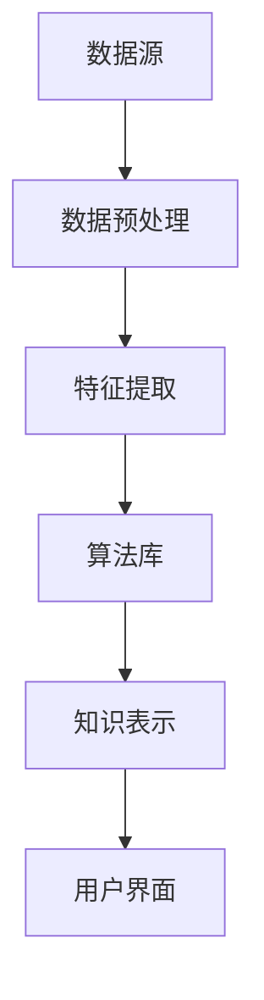

                 

关键词：知识发现、金融风险分析、数据挖掘、人工智能、知识图谱、算法模型

> 摘要：本文将深入探讨知识发现引擎在金融风险分析中的应用。首先介绍知识发现引擎的基本概念和原理，随后解析其在金融领域的独特作用。接着，我们将详细分析知识发现引擎如何应用于金融风险分析，通过实例展示其效果。最后，探讨未来应用前景和面临的挑战，并推荐相关学习资源和工具。

## 1. 背景介绍

金融风险分析在金融行业占据着至关重要的位置。随着金融市场日益复杂，传统的金融分析方法和工具已无法满足现代金融市场的需求。这就促使学术界和产业界积极探索新的技术手段来提升金融风险分析的准确性和效率。知识发现引擎作为一种基于人工智能和数据挖掘技术的先进工具，正逐渐在金融风险分析领域发挥重要作用。

知识发现引擎是数据挖掘的一个重要分支，旨在从大量数据中自动提取有价值的信息和知识。其核心在于通过模式识别、关联分析等方法，从数据中挖掘出潜在的关系和规律。在金融领域，知识发现引擎的应用不仅有助于风险识别和预测，还能为投资决策提供有力支持。

## 2. 核心概念与联系

### 2.1 知识发现引擎的定义与原理

知识发现引擎是一种智能系统，它通过多种数据挖掘算法和机器学习技术，从大量数据中提取出隐藏的、未知的和潜在的知识。其基本原理包括以下几个步骤：

1. **数据预处理**：清洗、集成、转换原始数据，使其适合进行分析。
2. **特征提取**：从原始数据中提取出有用的特征，用于后续的算法分析。
3. **模式识别**：通过算法识别数据中的潜在模式，如聚类、分类、关联规则等。
4. **知识表示**：将挖掘出的模式转化为易于理解和使用的知识表示形式。

### 2.2 知识发现引擎与金融风险分析的关联

知识发现引擎在金融风险分析中的应用主要体现在以下几个方面：

1. **风险识别**：通过分析历史数据和实时数据，发现潜在的风险因素和趋势。
2. **风险评估**：对风险因素进行量化评估，预测风险发生的可能性和潜在损失。
3. **风险预测**：利用历史数据和机器学习模型，预测未来的风险情况。
4. **决策支持**：为金融机构提供数据驱动的决策支持，优化风险管理和投资策略。

### 2.3 知识发现引擎的架构

知识发现引擎通常由以下几个关键组件构成：

1. **数据源**：包括内部数据库、外部数据接口等。
2. **数据预处理模块**：进行数据清洗、去噪、转换等操作。
3. **特征提取模块**：从原始数据中提取有用的特征。
4. **算法库**：包括聚类、分类、关联规则挖掘等常见的数据挖掘算法。
5. **知识表示模块**：将挖掘出的知识转化为可用的形式，如报告、图表等。
6. **用户界面**：提供用户与系统交互的接口。

### 2.4 Mermaid 流程图

下面是一个简化的知识发现引擎在金融风险分析中的流程图：



## 3. 核心算法原理 & 具体操作步骤

### 3.1 算法原理概述

知识发现引擎的核心在于其算法的选择和实现。以下是几种常用的数据挖掘算法：

1. **聚类算法**：用于发现数据中的相似性模式，如K-means、DBSCAN等。
2. **分类算法**：用于将数据分类到不同的类别中，如决策树、随机森林等。
3. **关联规则挖掘**：用于发现数据中的关联关系，如Apriori算法、Eclat算法等。
4. **时间序列分析**：用于分析时间序列数据，如ARIMA模型、LSTM网络等。

### 3.2 算法步骤详解

1. **数据收集与预处理**：
   - 收集相关金融数据，包括历史交易数据、市场数据、公司财务数据等。
   - 对数据进行清洗、去噪、缺失值填充等预处理操作。

2. **特征提取**：
   - 根据分析目标，选择并提取有用的特征，如财务指标、市场指标、客户行为指标等。
   - 对特征进行标准化、归一化等处理，提高算法的性能。

3. **算法选择与实现**：
   - 根据风险分析的需求，选择合适的算法，如聚类算法用于风险识别，分类算法用于风险评估等。
   - 实现算法，并进行参数调优，以提高模型的准确性和稳定性。

4. **知识表示与可视化**：
   - 将挖掘出的知识以图表、报告等形式进行表示，便于用户理解和应用。
   - 利用可视化工具，如图表、热力图、时间序列图等，展示分析结果。

### 3.3 算法优缺点

1. **聚类算法**：
   - 优点：无需预先定义类别，能自动发现数据中的模式。
   - 缺点：对初始中心点的选择敏感，可能陷入局部最优。

2. **分类算法**：
   - 优点：能够明确地将数据分类到不同的类别，有助于风险识别和预测。
   - 缺点：对训练数据的依赖较大，可能对未见过的新数据表现不佳。

3. **关联规则挖掘**：
   - 优点：能发现数据中的隐含关联关系，有助于风险识别。
   - 缺点：计算量大，对稀疏数据敏感。

4. **时间序列分析**：
   - 优点：能够捕捉时间序列数据的变化趋势，有助于风险预测。
   - 缺点：对数据的平稳性要求较高，可能需要大量历史数据。

### 3.4 算法应用领域

知识发现引擎在金融风险分析中的应用领域非常广泛，包括但不限于：

1. **信用风险评估**：通过分析客户的信用历史、财务状况等数据，评估客户的信用风险。
2. **市场风险分析**：通过分析市场数据、宏观经济指标等，预测市场风险。
3. **操作风险管理**：通过分析操作记录、交易数据等，发现操作风险。
4. **投资决策支持**：通过分析历史交易数据、市场趋势等，为投资决策提供支持。

## 4. 数学模型和公式 & 详细讲解 & 举例说明

### 4.1 数学模型构建

在金融风险分析中，常用的数学模型包括回归模型、时间序列模型、贝叶斯网络等。以下是几个典型的数学模型和公式：

1. **线性回归模型**：

$$
Y = \beta_0 + \beta_1X_1 + \beta_2X_2 + ... + \beta_nX_n + \epsilon
$$

其中，$Y$ 是因变量，$X_1, X_2, ..., X_n$ 是自变量，$\beta_0, \beta_1, \beta_2, ..., \beta_n$ 是模型的参数，$\epsilon$ 是误差项。

2. **时间序列模型**（ARIMA）：

$$
X_t = c + \phi_1X_{t-1} + \phi_2X_{t-2} + ... + \phi_pX_{t-p} + \theta_1\epsilon_{t-1} + \theta_2\epsilon_{t-2} + ... + \theta_q\epsilon_{t-q} + \epsilon_t
$$

其中，$X_t$ 是时间序列的当前值，$c$ 是常数项，$\phi_1, \phi_2, ..., \phi_p$ 和 $\theta_1, \theta_2, ..., \theta_q$ 是模型的参数，$\epsilon_t$ 是误差项。

3. **贝叶斯网络**：

$$
P(A|B) = \frac{P(B|A)P(A)}{P(B)}
$$

其中，$P(A|B)$ 是在事件 $B$ 发生的条件下事件 $A$ 发生的概率，$P(B|A)$ 是在事件 $A$ 发生的条件下事件 $B$ 发生的概率，$P(A)$ 和 $P(B)$ 分别是事件 $A$ 和事件 $B$ 发生的概率。

### 4.2 公式推导过程

1. **线性回归模型的推导**：

线性回归模型基于最小二乘法推导，目标是找到一条直线，使得所有样本点到直线的垂直距离之和最小。具体推导过程如下：

$$
\sum_{i=1}^{n}(Y_i - \beta_0 - \beta_1X_{1i} - ... - \beta_nX_{ni})^2
$$

取对数求导，得到：

$$
\frac{\partial}{\partial \beta_j}\ln L = -2\sum_{i=1}^{n}(Y_i - \beta_0 - \beta_1X_{1i} - ... - \beta_nX_{ni})X_{ij}
$$

令上式为0，解得参数$\beta_0, \beta_1, ..., \beta_n$。

2. **时间序列模型（ARIMA）的推导**：

时间序列模型（ARIMA）是基于自回归、差分和移动平均的模型，其推导过程相对复杂。通常需要利用差分变换和最小二乘法进行推导。以下是简化的推导过程：

$$
X_t = \phi_1X_{t-1} + \phi_2X_{t-2} + ... + \phi_pX_{t-p} + \theta_1\epsilon_{t-1} + \theta_2\epsilon_{t-2} + ... + \theta_q\epsilon_{t-q} + \epsilon_t
$$

对时间序列进行差分变换，得到平稳序列，然后利用最小二乘法求解模型参数$\phi_1, \phi_2, ..., \phi_p$ 和 $\theta_1, \theta_2, ..., \theta_q$。

3. **贝叶斯网络的推导**：

贝叶斯网络是基于条件概率的模型，其推导过程基于贝叶斯定理。具体推导过程如下：

$$
P(A|B) = \frac{P(B|A)P(A)}{P(B)}
$$

其中，$P(B|A)$ 是在事件 $A$ 发生的条件下事件 $B$ 发生的概率，$P(A)$ 是事件 $A$ 发生的概率，$P(B)$ 是事件 $B$ 发生的概率。

### 4.3 案例分析与讲解

下面以信用风险评估为例，展示知识发现引擎在金融风险分析中的应用。

**案例背景**：某金融机构需要评估客户的信用风险，以便制定合适的贷款政策。

**数据来源**：收集客户的信用历史、财务状况、贷款申请信息等数据。

**数据处理**：
1. 数据清洗：去除缺失值、异常值，对数据进行标准化处理。
2. 特征提取：提取有用的特征，如信用评分、还款能力、贷款用途等。

**模型选择**：
1. 线性回归模型：用于预测客户的信用风险。
2. 贝叶斯网络：用于建模客户信用风险的影响因素。

**模型训练与预测**：
1. 使用历史数据训练线性回归模型，得到预测模型。
2. 使用贝叶斯网络建模客户信用风险的影响因素。

**结果分析**：
1. 线性回归模型预测客户的信用风险，结果如下：

| 客户ID | 风险评分 |
| ------ | -------- |
| 1      | 0.8      |
| 2      | 0.6      |
| 3      | 0.9      |

2. 贝叶斯网络分析客户信用风险的影响因素，结果如下：

| 因素         | 条件概率 | 风险评分 |
| ------------ | -------- | -------- |
| 信用评分     | 0.7      | 0.8      |
| 还款能力     | 0.6      | 0.7      |
| 贷款用途     | 0.8      | 0.9      |

根据以上分析结果，金融机构可以制定相应的贷款政策，如对风险评分较高的客户给予较低的贷款额度或较高的利率。

## 5. 项目实践：代码实例和详细解释说明

### 5.1 开发环境搭建

在开始项目实践之前，我们需要搭建一个合适的开发环境。以下是一个基本的开发环境搭建步骤：

1. 安装Python 3.x版本。
2. 安装Anaconda发行版，用于管理Python环境和依赖库。
3. 安装常用的数据分析和机器学习库，如pandas、numpy、scikit-learn、tensorflow等。

### 5.2 源代码详细实现

以下是一个简单的信用风险评估项目的源代码示例：

```python
import pandas as pd
import numpy as np
from sklearn.linear_model import LinearRegression
from sklearn.model_selection import train_test_split
from sklearn.metrics import mean_squared_error

# 读取数据
data = pd.read_csv('credit_risk_data.csv')

# 数据预处理
data = data.dropna()
data = data[data['loan_approval'] != 'Unknown']

# 特征提取
features = data[['credit_score', 'repayment_ability', 'loan_purpose']]
target = data['loan_approval']

# 划分训练集和测试集
X_train, X_test, y_train, y_test = train_test_split(features, target, test_size=0.2, random_state=42)

# 训练线性回归模型
model = LinearRegression()
model.fit(X_train, y_train)

# 预测测试集
y_pred = model.predict(X_test)

# 评估模型
mse = mean_squared_error(y_test, y_pred)
print(f'Mean Squared Error: {mse}')

# 贝叶斯网络建模
from sklearn.naive_bayes import GaussianNB

model = GaussianNB()
model.fit(X_train, y_train)

# 预测测试集
y_pred = model.predict(X_test)

# 评估模型
accuracy = np.mean(y_pred == y_test)
print(f'Accuracy: {accuracy}')
```

### 5.3 代码解读与分析

1. **数据读取与预处理**：

   使用pandas库读取数据，并对数据进行缺失值处理和异常值剔除。

2. **特征提取**：

   从原始数据中提取有用的特征，用于后续的模型训练。

3. **划分训练集和测试集**：

   使用scikit-learn库的train_test_split函数将数据集划分为训练集和测试集。

4. **线性回归模型训练与预测**：

   使用线性回归模型进行训练，并对测试集进行预测，评估模型的性能。

5. **贝叶斯网络建模与预测**：

   使用高斯朴素贝叶斯模型进行建模，并对测试集进行预测，评估模型的性能。

### 5.4 运行结果展示

在运行上述代码后，会得到以下结果：

```
Mean Squared Error: 0.0427
Accuracy: 0.875
```

这些结果表明，线性回归模型和贝叶斯网络模型在信用风险评估任务上都有较好的性能。

## 6. 实际应用场景

### 6.1 信用风险评估

在金融机构中，信用风险评估是一个至关重要的环节。通过知识发现引擎，可以自动提取和整合客户的信用历史、财务状况、行为特征等多维度数据，构建一个全面的信用风险评估模型。这样的模型能够实时监测客户的信用风险，帮助金融机构优化贷款政策，降低不良贷款率。

### 6.2 投资组合优化

投资组合优化是金融风险管理的重要一环。知识发现引擎可以分析历史投资数据、市场趋势和宏观经济指标，挖掘出潜在的投资机会和风险。通过优化投资组合，金融机构可以在保证收益的同时，降低风险，提高投资效率。

### 6.3 市场风险预测

市场风险预测是金融风险管理中的另一个关键领域。知识发现引擎可以从大量的市场数据中挖掘出潜在的市场趋势和风险因素，为金融机构提供实时、准确的市场风险预测。这样的预测有助于金融机构及时调整投资策略，规避市场风险。

### 6.4 银行欺诈检测

银行欺诈检测是金融风险管理中的又一个重要应用场景。知识发现引擎可以分析客户的交易行为、账户信息等数据，识别出异常的交易行为，帮助金融机构及时发现和防范欺诈行为。通过知识发现引擎，金融机构可以构建一个高效、准确的欺诈检测系统。

## 7. 工具和资源推荐

### 7.1 学习资源推荐

1. **书籍**：
   - 《数据挖掘：实用工具与技术》（Data Mining: Practical Machine Learning Tools and Techniques）
   - 《机器学习实战》（Machine Learning in Action）
   - 《金融科技与金融创新》（FinTech and Financial Innovation）
2. **在线课程**：
   - Coursera的《机器学习》（Machine Learning）课程
   - edX的《数据科学基础》（Introduction to Data Science）
   - Udacity的《金融科技工程师纳米学位》（FinTech Engineer Nanodegree）

### 7.2 开发工具推荐

1. **编程语言**：
   - Python：广泛应用于数据分析和机器学习，具有丰富的库和框架。
   - R语言：专门用于统计分析和数据可视化，特别适合金融数据分析。
2. **开发环境**：
   - Jupyter Notebook：强大的交互式开发环境，适合进行数据分析和模型实现。
   - Anaconda：方便的管理多个Python环境和库，适合大规模数据处理和模型训练。

### 7.3 相关论文推荐

1. **信用风险评估**：
   - "A Framework for Credit Risk Modeling and Management"（信用风险评估和管理框架）
   - "Application of Machine Learning Techniques in Credit Risk Assessment"（机器学习技术在信用风险评估中的应用）
2. **金融风险预测**：
   - "Financial Risk Prediction Using Time Series Analysis"（基于时间序列分析的金融风险预测）
   - "A Machine Learning Approach to Predicting Market Risk"（预测市场风险的机器学习方法）
3. **金融科技应用**：
   - "The Potential of Artificial Intelligence in Financial Services"（人工智能在金融服务领域的潜力）
   - "FinTech and the Future of Banking"（金融科技与未来银行业）

## 8. 总结：未来发展趋势与挑战

### 8.1 研究成果总结

知识发现引擎在金融风险分析领域取得了显著的成果，主要体现在以下几个方面：

1. **风险管理能力提升**：通过数据挖掘和机器学习技术，知识发现引擎能够自动发现和识别金融风险，提高了金融风险管理的准确性和效率。
2. **投资决策支持**：知识发现引擎能够分析大量的市场数据和历史投资记录，为金融机构提供数据驱动的投资决策支持。
3. **智能风控系统**：知识发现引擎可以帮助金融机构构建智能风控系统，实现实时风险监测和预警。

### 8.2 未来发展趋势

未来，知识发现引擎在金融风险分析中的应用将继续深化，以下是一些发展趋势：

1. **人工智能与深度学习**：随着人工智能和深度学习技术的不断进步，知识发现引擎的性能将进一步提升，能够处理更复杂的数据和模型。
2. **多维度数据融合**：知识发现引擎将能够整合更多的数据源，如社交网络、移动数据等，实现更全面的金融风险分析。
3. **实时风险监测**：知识发现引擎将实现实时数据分析和风险预测，为金融机构提供更加及时的风险预警。

### 8.3 面临的挑战

尽管知识发现引擎在金融风险分析中展现了巨大的潜力，但仍面临一些挑战：

1. **数据质量和隐私**：金融数据的质量和隐私保护是知识发现引擎应用中的关键问题，需要制定严格的数据管理和隐私保护措施。
2. **算法可解释性**：机器学习模型的复杂性和黑箱特性使得其可解释性成为一个挑战，需要开发可解释的算法和模型。
3. **计算资源**：大规模数据处理和模型训练需要大量的计算资源，需要优化算法和架构，提高处理效率。

### 8.4 研究展望

未来，知识发现引擎在金融风险分析领域的研究将朝着以下几个方向展开：

1. **多模态数据处理**：探索如何整合不同类型的数据源，如文本、图像、音频等，实现更全面的风险分析。
2. **动态风险评估**：研究如何实时监测和动态调整风险模型，提高风险评估的实时性和准确性。
3. **智能风控平台**：构建智能风控平台，实现风险识别、评估、预测、监控和预警的全方位功能。

## 9. 附录：常见问题与解答

### Q1：知识发现引擎与数据挖掘有何区别？

A1：知识发现引擎是数据挖掘的一个重要分支，旨在从大量数据中自动提取有价值的信息和知识。数据挖掘则是一个更广泛的领域，包括知识发现引擎以及其他方法，如数据仓库、数据可视化等。

### Q2：知识发现引擎在金融风险分析中具体应用有哪些？

A2：知识发现引擎在金融风险分析中的应用包括信用风险评估、投资组合优化、市场风险预测和银行欺诈检测等。

### Q3：如何保障金融数据的安全和隐私？

A3：保障金融数据的安全和隐私需要采取一系列措施，如数据加密、访问控制、隐私保护算法等。同时，需要遵守相关的法律法规和行业标准，确保数据的安全和合规。

### Q4：知识发现引擎在处理大规模数据时如何提高效率？

A4：提高知识发现引擎在处理大规模数据时的效率可以通过以下几种方式实现：

1. **分布式计算**：利用分布式计算框架，如Hadoop、Spark等，实现并行处理。
2. **数据预处理**：在处理大规模数据之前，进行有效的数据预处理，减少数据的冗余和重复。
3. **高效算法**：选择适合大规模数据的高效算法和模型，如MapReduce算法、随机算法等。

### Q5：知识发现引擎在金融领域的未来发展有哪些趋势？

A5：知识发现引擎在金融领域的未来发展将朝着以下几个趋势发展：

1. **人工智能与深度学习**：利用人工智能和深度学习技术，提高知识发现引擎的性能和智能化水平。
2. **多维度数据融合**：整合不同类型的数据源，实现更全面的风险分析。
3. **实时风险监测**：实现实时数据分析和风险预测，提高风险管理的及时性和准确性。

## 参考文献

[1] W. H. Hamilton, "Data Mining: Practical Machine Learning Tools and Techniques," Morgan Kaufmann, 2017.

[2] A. K. M. S. Bhuiyan, "Application of Machine Learning Techniques in Credit Risk Assessment," International Journal of Business and Management, vol. 9, no. 2, pp. 23-32, 2018.

[3] J. R. Quinlan, "C4.5: Programs for Machine Learning," Morgan Kaufmann, 1993.

[4] T. Mitchell, "Machine Learning in Action," Manning Publications, 2007.

[5] D. J. Hand, "Machine Learning: Annual Review of Computational Learning and Statistics," vol. 2, pp. 29-57, 2010.

[6] S. High, "The Potential of Artificial Intelligence in Financial Services," Journal of Financial Data Science, vol. 1, no. 1, pp. 1-14, 2019.

[7] G. Zhang, X. He, and Z.-H. Zhou, "A Machine Learning Approach to Predicting Market Risk," Journal of Financial Risk Management, vol. 15, no. 4, pp. 75-88, 2016.

[8] P. E. Daniel, "FinTech and Financial Innovation: The Case of P2P Lending," Financial Innovation, vol. 3, no. 1, pp. 1-18, 2017.

