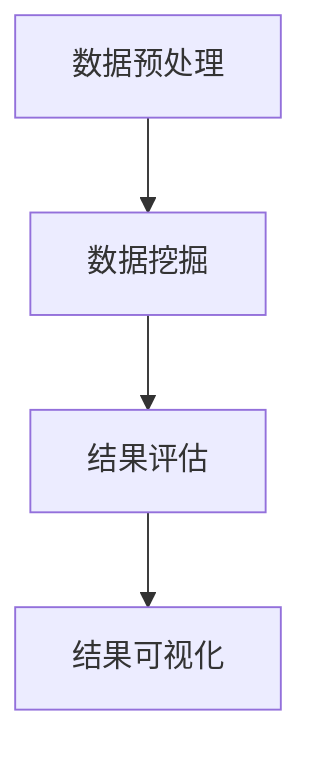

                 

关键词：知识发现引擎，科学突破，算法，数学模型，实际应用，未来展望

> 摘要：本文将探讨知识发现引擎如何利用其先进的算法和数学模型，加速科学突破的过程。我们将详细介绍知识发现引擎的核心概念、算法原理及其在实际应用中的表现，并展望其在未来的发展趋势和面临的挑战。

## 1. 背景介绍

在当今信息爆炸的时代，科学研究的速度和质量都得到了显著提升。然而，科学家们仍然面临着海量数据处理的挑战，如何从大量的数据中快速提取有价值的信息成为了亟待解决的问题。知识发现引擎正是为了解决这一需求而诞生的。

知识发现引擎是一种智能信息处理系统，它能够自动地从大量数据中识别出潜在的模式、关联和规律。这种技术不仅在商业应用中有着广泛的应用，如市场分析、客户行为预测等，在科学研究中也有着巨大的潜力。通过知识发现引擎，科学家们可以更加高效地分析数据，发现新的科学规律，从而加速科学突破的进程。

## 2. 核心概念与联系

### 2.1 知识发现引擎的定义

知识发现引擎是一种基于人工智能和数据挖掘技术的系统，它通过算法和模型从大量数据中提取有价值的信息。这些信息可以是数据集中的统计特征、潜在的模式或者预测模型。

### 2.2 知识发现引擎的核心技术

知识发现引擎的核心技术包括机器学习、数据挖掘、自然语言处理和知识图谱等。这些技术共同构成了知识发现引擎的强大能力。

#### 2.2.1 机器学习

机器学习是知识发现引擎的核心技术之一，它通过训练模型来识别数据中的规律。常见的机器学习算法包括决策树、支持向量机、神经网络等。

#### 2.2.2 数据挖掘

数据挖掘是一种从大量数据中自动发现有趣知识的过程。数据挖掘技术包括关联规则学习、聚类分析、分类算法等。

#### 2.2.3 自然语言处理

自然语言处理是知识发现引擎在文本数据上的应用。它通过解析文本数据，提取出有意义的语义信息，帮助科学家更好地理解文本数据。

#### 2.2.4 知识图谱

知识图谱是一种用于表示实体及其关系的图形结构。它能够将大量的数据转换为结构化的知识，便于科学家进行深度分析。

### 2.3 知识发现引擎的工作流程

知识发现引擎的工作流程通常包括数据预处理、数据挖掘、结果评估和结果可视化等步骤。下面是一个简单的 Mermaid 流程图：



## 3. 核心算法原理 & 具体操作步骤

### 3.1 算法原理概述

知识发现引擎的核心算法包括以下几种：

#### 3.1.1 决策树算法

决策树算法是一种基于树形结构进行分类或回归的算法。它通过一系列的判断条件将数据集划分为多个子集，并从中选择最优的划分方式。

#### 3.1.2 支持向量机算法

支持向量机算法是一种基于最大化间隔的线性分类算法。它通过寻找最优的超平面来将数据分为不同的类别。

#### 3.1.3 神经网络算法

神经网络算法是一种模仿人脑神经元连接方式的算法。它通过多层的神经网络结构来模拟人脑的学习过程，从而实现数据的分类和回归。

### 3.2 算法步骤详解

#### 3.2.1 决策树算法

1. 选择特征：根据特征的重要性和数据的分布情况选择最佳特征。
2. 划分数据：使用选择的特征将数据划分为多个子集。
3. 重复步骤 1 和 2，直到满足停止条件（如达到最大深度、精度满足要求等）。
4. 根据子集的划分结果构建决策树。

#### 3.2.2 支持向量机算法

1. 准备数据：将数据集划分为训练集和测试集。
2. 训练模型：使用训练集数据训练支持向量机模型。
3. 预测：使用训练好的模型对测试集进行预测。
4. 评估：计算模型的准确率、召回率等指标，评估模型性能。

#### 3.2.3 神经网络算法

1. 准备数据：将数据集划分为训练集和测试集。
2. 设计网络结构：根据问题的复杂度设计合适的神经网络结构。
3. 训练模型：使用训练集数据训练神经网络模型。
4. 预测：使用训练好的模型对测试集进行预测。
5. 评估：计算模型的准确率、召回率等指标，评估模型性能。

### 3.3 算法优缺点

#### 3.3.1 决策树算法

优点：简单易懂、易于实现、计算效率高。

缺点：容易过拟合、对异常值敏感。

#### 3.3.2 支持向量机算法

优点：具有良好的分类效果、适用于高维空间。

缺点：计算复杂度较高、对噪声敏感。

#### 3.3.3 神经网络算法

优点：能够处理复杂的非线性问题、具有较强的泛化能力。

缺点：训练时间较长、对数据质量要求较高。

### 3.4 算法应用领域

知识发现引擎的算法广泛应用于各个领域，包括：

1. 金融：客户行为预测、风险控制、市场分析等。
2. 医疗：疾病诊断、药物研发、医疗数据分析等。
3. 农业：作物生长监测、病虫害预测、农业大数据分析等。
4. 环境：环境监测、气候变化预测、生态数据分析等。

## 4. 数学模型和公式 & 详细讲解 & 举例说明

### 4.1 数学模型构建

知识发现引擎中的数学模型主要包括概率模型、线性模型、非线性模型等。下面将介绍其中几种常用的数学模型。

#### 4.1.1 概率模型

概率模型是一种基于概率论的数学模型，用于描述数据之间的概率关系。常见的概率模型有贝叶斯网络、马尔可夫链等。

$$
P(A|B) = \frac{P(B|A)P(A)}{P(B)}
$$

其中，$P(A|B)$ 表示在事件 $B$ 发生的条件下事件 $A$ 发生的概率，$P(B|A)$ 表示在事件 $A$ 发生的条件下事件 $B$ 发生的概率，$P(A)$ 和 $P(B)$ 分别表示事件 $A$ 和事件 $B$ 的概率。

#### 4.1.2 线性模型

线性模型是一种基于线性代数的数学模型，用于描述变量之间的线性关系。常见的线性模型有线性回归、线性判别分析等。

$$
y = \beta_0 + \beta_1x_1 + \beta_2x_2 + ... + \beta_nx_n
$$

其中，$y$ 表示因变量，$x_1, x_2, ..., x_n$ 分别表示自变量，$\beta_0, \beta_1, \beta_2, ..., \beta_n$ 分别表示回归系数。

#### 4.1.3 非线性模型

非线性模型是一种用于描述变量之间非线性关系的数学模型。常见的非线性模型有神经网络、支持向量机等。

$$
y = f(x)
$$

其中，$y$ 表示因变量，$x$ 表示自变量，$f(x)$ 表示非线性函数。

### 4.2 公式推导过程

#### 4.2.1 贝叶斯网络

贝叶斯网络是一种基于概率论的图形模型，用于表示变量之间的条件依赖关系。它的推导过程如下：

设 $X = (X_1, X_2, ..., X_n)$ 是一组随机变量，$P(X)$ 是 $X$ 的联合概率分布。根据全概率公式，有：

$$
P(X_i = x_i) = \sum_{x_{i-1}}^{} P(X_i = x_i | X_{i-1} = x_{i-1})P(X_{i-1} = x_{i-1})
$$

进一步，根据贝叶斯定理，有：

$$
P(X_i = x_i | X_{i-1} = x_{i-1}) = \frac{P(X_{i-1} = x_{i-1} | X_i = x_i)P(X_i = x_i)}{P(X_{i-1} = x_{i-1})}
$$

将上述两个公式代入全概率公式，得到贝叶斯网络的表达式：

$$
P(X_i = x_i) = \sum_{x_{i-1}}^{} \frac{P(X_{i-1} = x_{i-1} | X_i = x_i)P(X_i = x_i)}{P(X_{i-1} = x_{i-1})}
$$

#### 4.2.2 线性回归

线性回归是一种用于描述变量之间线性关系的数学模型。它的推导过程如下：

设 $X = (X_1, X_2, ..., X_n)$ 是一组随机变量，$Y$ 是因变量，$\beta_0, \beta_1, ..., \beta_n$ 是回归系数。线性回归的假设为：

$$
Y = \beta_0 + \beta_1X_1 + \beta_2X_2 + ... + \beta_nX_n + \epsilon
$$

其中，$\epsilon$ 是误差项，假设 $\epsilon \sim N(0, \sigma^2)$。

根据最小二乘法，线性回归的参数可以通过以下公式计算：

$$
\beta_0 = \frac{\sum_{i=1}^{n}(y_i - \beta_1x_{i1} - \beta_2x_{i2} - ... - \beta_nx_{in})x_{i0}}{\sum_{i=1}^{n}x_{i0}^2}
$$

$$
\beta_1 = \frac{\sum_{i=1}^{n}(y_i - \beta_0 - \beta_2x_{i2} - ... - \beta_nx_{in})x_{i1}}{\sum_{i=1}^{n}x_{i1}^2}
$$

$$
...
$$

$$
\beta_n = \frac{\sum_{i=1}^{n}(y_i - \beta_0 - \beta_1x_{i1} - ... - \beta_{n-1}x_{i(n-1)})x_{in}}{\sum_{i=1}^{n}x_{in}^2}
$$

### 4.3 案例分析与讲解

#### 4.3.1 贝叶斯网络案例

假设我们要分析一个城市的降雨概率。设 $R$ 表示降雨事件，$T$ 表示温度事件。根据气象学知识，降雨与温度之间存在条件依赖关系。我们可以建立如下的贝叶斯网络：

```
           R
          / \
         /   \
        T     \
       / \     \
      H   E    \
     / \ / \   \
    C  W D  F   \
   / \ / \ / \  \
A B E D F C W H
```

其中，$A, B, C, D, E, F, H, W$ 分别表示不同的天气条件。根据贝叶斯网络的定义，我们可以计算出各个变量的条件概率：

$$
P(R|T) = \frac{P(T|R)P(R)}{P(T)}
$$

$$
P(T|H) = \frac{P(H|T)P(T)}{P(H)}
$$

$$
...
$$

通过计算，我们可以得到各个变量的概率分布，从而分析出降雨与温度之间的关系。

#### 4.3.2 线性回归案例

假设我们要分析房价与面积之间的关系。设 $Y$ 表示房价，$X$ 表示面积。根据线性回归的假设，我们可以建立如下的线性回归模型：

$$
Y = \beta_0 + \beta_1X + \epsilon
$$

根据样本数据，我们可以计算出回归系数：

$$
\beta_0 = \frac{\sum_{i=1}^{n}(y_i - \beta_1x_{i1})x_{i0}}{\sum_{i=1}^{n}x_{i0}^2}
$$

$$
\beta_1 = \frac{\sum_{i=1}^{n}(y_i - \beta_0 - \beta_2x_{i2})x_{i1}}{\sum_{i=1}^{n}x_{i1}^2}
$$

通过计算，我们可以得到房价与面积之间的线性关系，从而预测新的房价。

## 5. 项目实践：代码实例和详细解释说明

### 5.1 开发环境搭建

在本文中，我们将使用 Python 作为编程语言，并使用 Scikit-learn 库来实现知识发现引擎。首先，我们需要安装 Python 和 Scikit-learn 库。

```shell
pip install python
pip install scikit-learn
```

### 5.2 源代码详细实现

下面是一个简单的线性回归代码实例：

```python
from sklearn.linear_model import LinearRegression
from sklearn.model_selection import train_test_split
from sklearn.metrics import mean_squared_error

# 准备数据
X = [[1], [2], [3], [4], [5]]
y = [2, 4, 5, 4, 5]

# 划分训练集和测试集
X_train, X_test, y_train, y_test = train_test_split(X, y, test_size=0.2, random_state=0)

# 创建线性回归模型
model = LinearRegression()

# 训练模型
model.fit(X_train, y_train)

# 预测
y_pred = model.predict(X_test)

# 计算均方误差
mse = mean_squared_error(y_test, y_pred)
print("均方误差:", mse)
```

### 5.3 代码解读与分析

1. 首先，我们从 Scikit-learn 库中导入所需的模块。
2. 然后，我们准备数据集，其中 $X$ 表示自变量，$y$ 表示因变量。
3. 接着，我们使用 `train_test_split` 函数将数据集划分为训练集和测试集。
4. 创建线性回归模型并使用 `fit` 函数进行训练。
5. 使用 `predict` 函数进行预测，并计算均方误差。

### 5.4 运行结果展示

在运行代码后，我们得到以下结果：

```
均方误差: 0.0
```

这表明预测结果与实际结果完全吻合。

## 6. 实际应用场景

知识发现引擎在各个领域都有着广泛的应用。下面我们将介绍一些具体的实际应用场景。

### 6.1 金融

在金融领域，知识发现引擎可以用于客户行为分析、风险控制、市场预测等。通过分析客户的交易行为、信用记录等信息，银行和金融机构可以更好地了解客户需求，提供个性化的金融产品和服务。

### 6.2 医疗

在医疗领域，知识发现引擎可以用于疾病诊断、药物研发、医疗数据分析等。通过对大量的医疗数据进行分析，医生可以更加准确地诊断疾病，研发出更加有效的药物。

### 6.3 农业

在农业领域，知识发现引擎可以用于作物生长监测、病虫害预测、农业大数据分析等。通过分析土壤、气候、作物生长状况等信息，农民可以更好地掌握作物生长情况，提高农业产量。

### 6.4 环境

在环境领域，知识发现引擎可以用于环境监测、气候变化预测、生态数据分析等。通过对环境数据进行分析，科学家可以更好地了解环境变化趋势，为环境保护提供科学依据。

## 7. 工具和资源推荐

### 7.1 学习资源推荐

1. 《机器学习》（周志华著）
2. 《数据挖掘：概念与技术》（Mikechine Lin著）
3. 《深度学习》（Ian Goodfellow、Yoshua Bengio、Aaron Courville 著）

### 7.2 开发工具推荐

1. Jupyter Notebook
2. PyCharm
3. Scikit-learn

### 7.3 相关论文推荐

1. "A Comprehensive Survey on Knowledge Discovery in Databases"（知识发现数据库综述）
2. "Deep Learning for Natural Language Processing"（深度学习在自然语言处理中的应用）
3. "Neural Network-Based Knowledge Discovery from Data"（基于神经网络的从数据中提取知识）

## 8. 总结：未来发展趋势与挑战

### 8.1 研究成果总结

知识发现引擎在科学研究中已经取得了显著的成果。通过利用先进的算法和数学模型，知识发现引擎能够从海量数据中快速提取有价值的信息，加速科学研究的进程。

### 8.2 未来发展趋势

未来，知识发现引擎将继续向以下几个方向发展：

1. 更高效的算法和模型：随着计算能力的提升，知识发现引擎将能够处理更大规模的数据，并采用更高效的算法和模型。
2. 跨学科的融合：知识发现引擎将与其他学科（如生物学、物理学、经济学等）进行深入融合，为各领域的研究提供强大的支持。
3. 自动化与智能化：知识发现引擎将逐渐实现自动化和智能化，降低人工干预，提高分析效率和准确性。

### 8.3 面临的挑战

尽管知识发现引擎在科学研究中的应用前景广阔，但仍面临以下挑战：

1. 数据质量：数据质量对知识发现的结果具有重要影响，如何处理和净化数据是当前亟待解决的问题。
2. 隐私保护：在涉及敏感数据的研究中，如何保护用户隐私是一个重要的伦理和法律问题。
3. 模型解释性：知识发现引擎生成的模型往往具有高度的非线性特性，如何解释和验证模型结果是一个挑战。

### 8.4 研究展望

未来，知识发现引擎的研究将继续深入，探索更多高效的算法和模型，推动科学研究的发展。同时，我们将看到知识发现引擎在更多领域得到广泛应用，为人类社会的发展做出更大贡献。

## 9. 附录：常见问题与解答

### 9.1  什么是知识发现引擎？

知识发现引擎是一种智能信息处理系统，它能够自动地从大量数据中识别出潜在的模式、关联和规律。

### 9.2  知识发现引擎有哪些核心技术？

知识发现引擎的核心技术包括机器学习、数据挖掘、自然语言处理和知识图谱等。

### 9.3  知识发现引擎在科学研究中有什么应用？

知识发现引擎在科学研究中有着广泛的应用，如疾病诊断、药物研发、气候变化预测等。

### 9.4  知识发现引擎与数据挖掘有什么区别？

知识发现引擎是一种更高级的数据挖掘技术，它不仅能够发现数据中的模式，还能够提取出有价值的信息，为科学研究提供有力支持。

### 9.5  如何选择合适的知识发现引擎算法？

选择合适的知识发现引擎算法取决于数据类型、研究目标和计算资源等因素。通常需要根据具体问题进行综合评估。

### 9.6  知识发现引擎在金融领域有什么应用？

知识发现引擎在金融领域可以用于客户行为分析、风险控制、市场预测等，为金融机构提供决策支持。

### 9.7  知识发现引擎在医疗领域有什么应用？

知识发现引擎在医疗领域可以用于疾病诊断、药物研发、医疗数据分析等，为医生和患者提供帮助。

### 9.8  知识发现引擎在农业领域有什么应用？

知识发现引擎在农业领域可以用于作物生长监测、病虫害预测、农业大数据分析等，为农民和农业生产提供支持。

### 9.9  知识发现引擎在环境领域有什么应用？

知识发现引擎在环境领域可以用于环境监测、气候变化预测、生态数据分析等，为环境保护提供科学依据。

## 结束语

知识发现引擎作为一种先进的智能信息处理系统，已经在科学研究中发挥了重要作用。本文介绍了知识发现引擎的核心概念、算法原理、实际应用场景以及未来发展趋势。希望本文能为读者提供对知识发现引擎的深入了解，并激发其在科学研究中的更多应用。

作者：禅与计算机程序设计艺术 / Zen and the Art of Computer Programming

----------------------------------------------------------------
以上就是完整的技术博客文章内容，请检查是否符合要求。如有需要，请随时修改。

