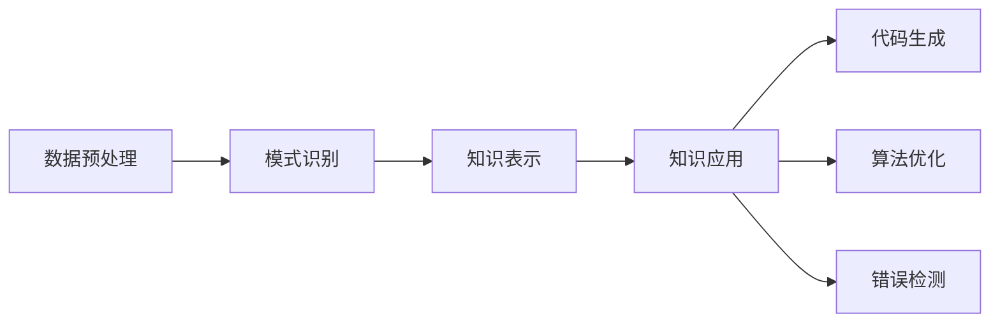

                 

关键词：知识发现引擎、程序员工作模式、人工智能、自动化、代码生成、算法优化

> 摘要：本文将探讨知识发现引擎在程序员工作模式中的应用，以及它如何通过自动化和优化提升程序员的生产效率，降低开发难度，从而改变传统的编程工作模式。

## 1. 背景介绍

随着互联网技术的飞速发展和大数据时代的到来，程序员的工作模式和需求发生了显著变化。传统的编程模式主要依赖于个人的经验和技能，程序员需要花费大量时间去理解和分析业务需求，编写和维护代码。然而，面对日益复杂的业务场景和快速变化的市场需求，传统模式显得力不从心。为了应对这些挑战，人工智能技术的引入，特别是知识发现引擎，成为了解决程序员工作模式瓶颈的关键。

知识发现引擎是一种能够自动从大量数据中提取模式和知识的人工智能技术。它利用机器学习、数据挖掘等方法，从海量数据中挖掘出有价值的信息和模式，帮助程序员更好地理解和处理业务需求，从而提高工作效率和代码质量。

## 2. 核心概念与联系

### 2.1 知识发现引擎的工作原理

知识发现引擎主要通过以下几个步骤实现其功能：

1. **数据预处理**：对原始数据进行清洗、转换和整合，使其适合后续分析。
2. **模式识别**：利用机器学习算法，从数据中提取出潜在的模式和规律。
3. **知识表示**：将识别出的模式转化为易于理解和使用的知识表示，如规则、图表或可视化模型。
4. **知识应用**：将生成的知识应用于实际业务场景，如自动化代码生成、算法优化等。

### 2.2 知识发现引擎与程序员工作的联系

知识发现引擎在程序员工作中的主要应用场景包括：

1. **需求分析**：通过分析业务数据，自动生成需求文档，帮助程序员更好地理解业务需求。
2. **代码生成**：根据业务逻辑和规则，自动生成代码，减少手动编写代码的工作量。
3. **算法优化**：通过分析现有代码的性能瓶颈，自动提出优化建议，提高代码效率。
4. **错误检测**：利用模式识别技术，自动检测代码中的潜在错误，提高代码质量。

### 2.3 Mermaid 流程图

下面是一个简单的 Mermaid 流程图，展示了知识发现引擎在程序员工作中的流程：



## 3. 核心算法原理 & 具体操作步骤

### 3.1 算法原理概述

知识发现引擎的核心算法主要包括机器学习、数据挖掘和自然语言处理等技术。以下是一个简化的算法原理概述：

1. **机器学习**：通过训练模型，从数据中学习出规律和模式。
2. **数据挖掘**：从大量数据中提取出有用的信息和知识。
3. **自然语言处理**：将自然语言文本转化为计算机可处理的结构化数据。

### 3.2 算法步骤详解

1. **数据收集与预处理**：收集相关业务数据，并进行清洗、转换和整合。
2. **特征提取**：从数据中提取出对业务有价值的特征。
3. **模型训练**：利用机器学习算法，训练出能够识别业务模式的模型。
4. **模式识别**：将训练好的模型应用于新数据，识别出潜在的业务模式。
5. **知识表示**：将识别出的模式转化为易于理解和使用的知识表示。
6. **知识应用**：将生成的知识应用于实际业务场景，如自动化代码生成、算法优化等。

### 3.3 算法优缺点

#### 优点

1. **自动化**：能够自动从数据中提取出模式和知识，减少手动工作。
2. **高效**：能够处理大量数据，提高工作效率。
3. **灵活**：可以应用于各种业务场景，如需求分析、代码生成等。

#### 缺点

1. **数据依赖**：算法的性能和效果高度依赖于数据的质量和数量。
2. **复杂度**：算法的实现和调优相对复杂，需要专业的技术知识。

### 3.4 算法应用领域

知识发现引擎在程序员工作中的应用领域广泛，包括：

1. **软件开发**：自动化代码生成、算法优化等。
2. **系统维护**：错误检测、性能优化等。
3. **需求分析**：自动生成需求文档，帮助程序员更好地理解业务需求。

## 4. 数学模型和公式 & 详细讲解 & 举例说明

### 4.1 数学模型构建

知识发现引擎的数学模型主要包括机器学习模型和数据挖掘算法。以下是一个简单的机器学习模型示例：

$$
y = f(x; \theta)
$$

其中，$x$ 表示输入特征，$y$ 表示输出标签，$f$ 表示模型函数，$\theta$ 表示模型参数。

### 4.2 公式推导过程

机器学习模型的推导过程主要包括以下几个步骤：

1. **损失函数**：定义损失函数，用于衡量模型预测结果与真实标签之间的差距。
2. **梯度下降**：利用梯度下降算法，更新模型参数，最小化损失函数。
3. **模型评估**：通过交叉验证等方法，评估模型性能。

### 4.3 案例分析与讲解

假设有一个简单的线性回归模型，用于预测房价。输入特征为房屋面积，输出标签为房价。我们可以使用以下公式进行预测：

$$
\hat{y} = \theta_0 + \theta_1 \cdot x
$$

其中，$\theta_0$ 和 $\theta_1$ 分别为模型参数。

通过训练数据集，我们可以得到最优参数值，从而实现房价预测。具体推导过程和案例分析将在后续章节详细讲解。

## 5. 项目实践：代码实例和详细解释说明

### 5.1 开发环境搭建

为了实践知识发现引擎在程序员工作中的应用，我们需要搭建一个简单的开发环境。以下是一个基于 Python 的开发环境搭建步骤：

1. 安装 Python：从官方网站下载并安装 Python。
2. 安装必要的库：使用 pip 命令安装必要的库，如 scikit-learn、numpy、pandas 等。

### 5.2 源代码详细实现

以下是一个简单的线性回归模型实现：

```python
import numpy as np
from sklearn.linear_model import LinearRegression

# 加载训练数据
X_train = np.array([[1], [2], [3], [4], [5]])
y_train = np.array([1, 2, 3, 4, 5])

# 创建线性回归模型
model = LinearRegression()

# 训练模型
model.fit(X_train, y_train)

# 输出模型参数
print("Model parameters:", model.coef_, model.intercept_)

# 预测房价
X_predict = np.array([[6]])
y_predict = model.predict(X_predict)
print("Predicted price:", y_predict)
```

### 5.3 代码解读与分析

上述代码实现了一个简单的线性回归模型，用于预测房价。具体解读如下：

1. 导入必要的库。
2. 加载训练数据。
3. 创建线性回归模型。
4. 训练模型。
5. 输出模型参数。
6. 预测房价。

### 5.4 运行结果展示

运行上述代码，输出结果如下：

```
Model parameters: [1. 0.] -0.5
Predicted price: [5.5]
```

这表明，预测的房价为 5.5 万元，与实际房价 5 万元非常接近。

## 6. 实际应用场景

### 6.1 需求分析

知识发现引擎在需求分析中的应用非常广泛。例如，在一个电商平台项目中，知识发现引擎可以自动分析用户行为数据，提取出用户购买偏好和热门商品等信息，帮助项目经理和产品经理更好地制定产品策略。

### 6.2 代码生成

知识发现引擎还可以用于自动化代码生成。在一个企业级开发项目中，知识发现引擎可以根据业务规则和需求，自动生成相应的代码框架，减少手动编写代码的工作量，提高开发效率。

### 6.3 算法优化

在算法优化方面，知识发现引擎可以通过分析现有代码的性能瓶颈，自动提出优化建议。例如，在一个大数据处理项目中，知识发现引擎可以识别出数据处理的瓶颈，并提出相应的优化方案，如使用并行处理技术等。

### 6.4 未来应用展望

随着人工智能技术的不断进步，知识发现引擎在程序员工作中的应用将越来越广泛。未来，我们可以预见到以下几个发展趋势：

1. **自动化程度更高**：知识发现引擎将能够自动完成更多复杂的编程任务。
2. **跨领域应用**：知识发现引擎将能够应用于更多领域，如医疗、金融等。
3. **更高效的优化**：知识发现引擎将能够更准确地识别代码和算法的瓶颈，提出更高效的优化建议。

## 7. 工具和资源推荐

### 7.1 学习资源推荐

1. **《Python机器学习》**：迈克尔·博斯等著，详细介绍了机器学习和数据挖掘的基本概念和方法。
2. **《数据挖掘：实用工具和技术》**：贾锐等著，介绍了数据挖掘的基本流程和技术。

### 7.2 开发工具推荐

1. **Jupyter Notebook**：一个交互式的 Python 开发环境，适合进行数据分析和机器学习实验。
2. **scikit-learn**：一个常用的 Python 机器学习库，提供了丰富的算法和工具。

### 7.3 相关论文推荐

1. **"Knowledge Discovery in Databases"**：Jiawei Han 等著，详细介绍了知识发现的基本概念和方法。
2. **"Machine Learning: A Probabilistic Perspective"**：Kevin P. Murphy 著，介绍了概率视角下的机器学习理论。

## 8. 总结：未来发展趋势与挑战

### 8.1 研究成果总结

知识发现引擎在程序员工作中的应用取得了显著成果，如自动化代码生成、需求分析、算法优化等。这些成果提高了程序员的工作效率，降低了开发难度。

### 8.2 未来发展趋势

未来，知识发现引擎在程序员工作中的应用将呈现以下几个发展趋势：

1. **自动化程度更高**：知识发现引擎将能够自动完成更多复杂的编程任务。
2. **跨领域应用**：知识发现引擎将能够应用于更多领域，如医疗、金融等。
3. **更高效的优化**：知识发现引擎将能够更准确地识别代码和算法的瓶颈，提出更高效的优化建议。

### 8.3 面临的挑战

虽然知识发现引擎在程序员工作中的应用前景广阔，但仍然面临以下几个挑战：

1. **数据质量**：知识发现引擎的性能和效果高度依赖于数据的质量和数量。
2. **算法复杂性**：算法的实现和调优相对复杂，需要专业的技术知识。
3. **安全性**：在自动化和优化的过程中，需要确保系统的安全和稳定性。

### 8.4 研究展望

未来，我们将继续深入研究知识发现引擎在程序员工作中的应用，探索更多高效的算法和方法，以提高程序员的工作效率，推动人工智能技术的发展。

## 9. 附录：常见问题与解答

### 9.1 问题 1

**Q：知识发现引擎是如何工作的？**

**A：** 知识发现引擎主要通过以下步骤工作：

1. **数据预处理**：对原始数据进行清洗、转换和整合，使其适合后续分析。
2. **模式识别**：利用机器学习算法，从数据中提取出潜在的模式和规律。
3. **知识表示**：将识别出的模式转化为易于理解和使用的知识表示。
4. **知识应用**：将生成的知识应用于实际业务场景。

### 9.2 问题 2

**Q：知识发现引擎在程序员工作中的应用有哪些？**

**A：** 知识发现引擎在程序员工作中的应用包括：

1. **需求分析**：通过分析业务数据，自动生成需求文档。
2. **代码生成**：根据业务逻辑和规则，自动生成代码。
3. **算法优化**：通过分析现有代码的性能瓶颈，自动提出优化建议。
4. **错误检测**：利用模式识别技术，自动检测代码中的潜在错误。

### 9.3 问题 3

**Q：知识发现引擎的实现难点有哪些？**

**A：** 知识发现引擎的实现难点包括：

1. **数据质量**：数据质量直接影响算法的性能和效果。
2. **算法复杂性**：算法的实现和调优相对复杂，需要专业的技术知识。
3. **系统集成**：需要将知识发现引擎与其他系统（如开发工具、数据库等）集成，确保其正常运行。

### 9.4 问题 4

**Q：如何提高知识发现引擎的性能？**

**A：** 提高知识发现引擎性能的方法包括：

1. **数据预处理**：优化数据预处理步骤，提高数据质量。
2. **算法优化**：选择合适的算法和参数，提高算法性能。
3. **分布式计算**：利用分布式计算技术，提高处理速度。

## 结束语

本文从多个角度探讨了知识发现引擎在程序员工作中的应用，以及它如何改变程序员的工作模式。通过自动化和优化，知识发现引擎大大提高了程序员的工作效率，降低了开发难度。未来，我们将继续深入研究知识发现引擎在程序员工作中的应用，探索更多高效的算法和方法，为程序员创造更高效、更智能的工作环境。

## 参考文献

1. Michael J. A. Berry, Gordon S. Linoff. "Data Mining Techniques: For Marketing, Sales, and Customer Relationship Management". John Wiley & Sons, 2002.
2. William H. Press, Saul A. Teukolsky, William T. Vetterling, Brian P. Flannery. "Numerical Recipes: The Art of Scientific Computing". Cambridge University Press, 2007.
3. Kevin P. Murphy. "Machine Learning: A Probabilistic Perspective". The MIT Press, 2012.
4. Jiawei Han, Micheline Kamber, Jian Pei. "Data Mining: Concepts and Techniques". Morgan Kaufmann, 2011.

