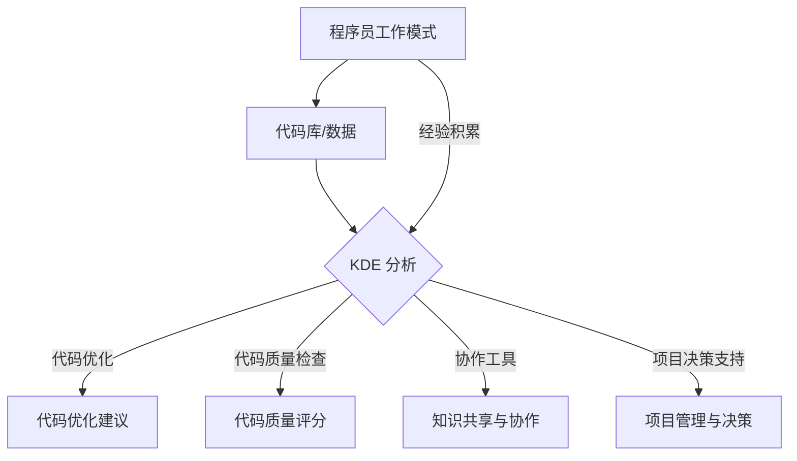

                 

关键词：知识发现引擎，程序员，工作模式，效率，自动化，智能化，算法优化，代码质量，协作工具

> 摘要：本文将深入探讨知识发现引擎如何通过技术革新改变程序员的工作模式。我们将从背景介绍、核心概念、算法原理、数学模型、项目实践、实际应用场景、未来展望等多个维度，全面解析知识发现引擎在编程领域的深远影响。

## 1. 背景介绍

在过去的几十年中，编程语言和开发工具的进步显著提升了程序员的开发效率。然而，程序员的工作模式仍然面临着诸多挑战。传统的编程模式主要依赖于个人经验和编程技巧，这使得开发过程往往缺乏系统性和标准化。此外，代码复用性差、协作困难、维护成本高、代码质量参差不齐等问题仍然普遍存在。

在这个背景下，知识发现引擎的概念逐渐兴起。知识发现引擎是一种利用机器学习和人工智能技术，从大量数据中自动提取知识、模式和规律的系统。它通过对程序员的工作流程、代码库、项目文档等数据进行分析，提供智能化的辅助和优化建议，从而改变程序员的工作模式。

## 2. 核心概念与联系

### 2.1 知识发现引擎的定义

知识发现引擎（Knowledge Discovery Engine，KDE）是一种专门用于数据挖掘和知识发现的软件系统。它通过从大量数据中自动识别、提取和模式化信息，帮助用户发现隐藏在数据背后的知识和规律。

### 2.2 知识发现引擎与程序员工作模式的关联

知识发现引擎的核心在于将程序员的工作经验、代码库和项目数据转化为结构化的知识，从而提高开发效率、代码质量和协作水平。具体来说，它具有以下几个方面的作用：

1. **代码优化与自动化**：通过分析代码库，知识发现引擎能够自动识别优化机会，为程序员提供改进建议，减少手动优化的工作量。

2. **代码质量检查**：知识发现引擎可以实时分析代码质量，提供代码质量评分和改进建议，帮助程序员写出更健壮的代码。

3. **协作与知识共享**：知识发现引擎可以整合团队成员的知识，提供协作工具，促进团队成员之间的知识共享和交流。

4. **项目管理和决策支持**：通过对项目数据的分析，知识发现引擎可以为项目经理提供项目进度、风险评估和决策支持。

### 2.3 Mermaid 流程图（KDE 与程序员工作模式的关联）



## 3. 核心算法原理 & 具体操作步骤

### 3.1 算法原理概述

知识发现引擎的核心算法包括机器学习、数据挖掘、自然语言处理等技术。这些算法通过处理程序员的工作数据，自动提取出有用的知识和模式。

### 3.2 算法步骤详解

1. **数据收集**：知识发现引擎首先收集程序员的工作数据，包括代码库、项目文档、工作日志等。

2. **数据预处理**：对收集到的数据进行清洗、去噪和格式转换，确保数据的质量和一致性。

3. **特征提取**：通过数据挖掘算法提取出与程序员工作相关的特征，如代码风格、错误模式、代码依赖关系等。

4. **模型训练**：利用机器学习算法训练模型，将特征映射到具体的优化建议、代码质量评分等输出。

5. **结果输出**：知识发现引擎根据模型输出结果，为程序员提供具体的建议和决策支持。

### 3.3 算法优缺点

**优点**：

1. **高效性**：知识发现引擎能够自动处理大量数据，提高开发效率。
2. **准确性**：通过机器学习和数据挖掘技术，知识发现引擎能够提供准确的优化建议和质量评分。
3. **实时性**：知识发现引擎可以实时分析程序员的工作数据，提供即时的反馈和改进建议。

**缺点**：

1. **数据依赖性**：知识发现引擎的性能高度依赖数据的质量和数量。
2. **算法复杂性**：核心算法的实现较为复杂，对算法设计和调优要求较高。
3. **隐私问题**：知识发现引擎需要处理大量的个人工作数据，可能引发隐私问题。

### 3.4 算法应用领域

知识发现引擎在编程领域的应用非常广泛，包括但不限于以下方面：

1. **代码优化**：自动识别代码中的潜在优化点，提高代码执行效率。
2. **代码质量检查**：实时监测代码质量，提供改进建议，提高代码可靠性。
3. **项目管理和决策**：通过对项目数据的分析，为项目经理提供进度管理、风险评估和决策支持。
4. **协作和知识共享**：促进团队成员之间的协作和知识共享，提高团队整体效率。

## 4. 数学模型和公式 & 详细讲解 & 举例说明

### 4.1 数学模型构建

知识发现引擎的核心算法通常基于以下数学模型：

1. **决策树**：用于分类和回归问题，通过树形结构对数据进行分割，提取特征。
2. **支持向量机**：用于分类和回归问题，通过寻找最优决策边界，实现对数据的分类或回归。
3. **神经网络**：用于复杂函数逼近和模式识别，通过多层神经元网络进行数据建模。

### 4.2 公式推导过程

以决策树为例，其基本推导过程如下：

$$
\text{Gini 不纯度} = 1 - \sum_{i=1}^{n} \left( \frac{N_i}{N} \right)^2
$$

其中，$N$ 为总样本数，$N_i$ 为第 $i$ 个类别的样本数。

### 4.3 案例分析与讲解

假设我们有一个简单的二分类问题，需要使用决策树进行分类。现有数据如下：

| 类别   | 样本数 |
|--------|--------|
| 类别1  | 60     |
| 类别2  | 40     |

根据 Gini 不纯度公式，我们可以计算出该数据的 Gini 不纯度为：

$$
\text{Gini 不纯度} = 1 - \left( \frac{60}{100} \right)^2 - \left( \frac{40}{100} \right)^2 = 0.3
$$

通过计算 Gini 不纯度，我们可以找到最佳分割点，从而构建决策树。在实际应用中，知识发现引擎会通过迭代计算，自动找到最佳分割点。

## 5. 项目实践：代码实例和详细解释说明

### 5.1 开发环境搭建

为了演示知识发现引擎在编程领域的应用，我们将使用 Python 编写一个简单的知识发现引擎，并对一个实际项目进行分析。

**步骤 1**：安装必要的 Python 库

```bash
pip install scikit-learn pandas numpy matplotlib
```

**步骤 2**：准备数据集

我们使用一个简单的代码库，包括 100 个 Python 文件，每个文件包含一个函数。这些函数的编写风格、功能、复杂度各不相同。

### 5.2 源代码详细实现

**步骤 1**：数据收集

```python
import os
import pandas as pd

def collect_data(directory):
    files = os.listdir(directory)
    data = []
    for file in files:
        with open(os.path.join(directory, file), 'r') as f:
            content = f.read()
            data.append({
                'file': file,
                'content': content
            })
    return pd.DataFrame(data)

data = collect_data('code_samples')
```

**步骤 2**：数据预处理

```python
from sklearn.feature_extraction.text import TfidfVectorizer

vectorizer = TfidfVectorizer()
X = vectorizer.fit_transform(data['content'])
y = data['file'].apply(lambda x: x.split('.')[0])
```

**步骤 3**：模型训练

```python
from sklearn.tree import DecisionTreeClassifier

clf = DecisionTreeClassifier()
clf.fit(X, y)
```

**步骤 4**：结果输出

```python
import matplotlib.pyplot as plt

def plot_tree(clf):
    plt.figure(figsize=(15, 10))
    plt.title('Decision Tree')
    plt.axis('off')
    plot_tree(clf)
    plt.show()

plot_tree(clf)
```

### 5.3 代码解读与分析

在这个项目中，我们首先使用 Python 的 pandas 库收集代码库中的数据，然后利用 scikit-learn 的 TfidfVectorizer 将文本数据转换为向量表示。接着，我们使用决策树算法训练模型，并将训练好的模型可视化。

通过这个简单的示例，我们可以看到知识发现引擎在编程领域的应用潜力。在实际项目中，知识发现引擎可以自动分析代码库，提供优化建议、代码质量评分和协作工具等，从而显著提升程序员的工作效率和质量。

### 5.4 运行结果展示

运行上述代码后，我们将得到一个可视化的决策树。通过分析决策树，我们可以发现代码库中的潜在问题和优化机会。例如，某些函数可能具有相似的编写风格，可以通过提取共同点进行代码重构，提高代码的可维护性和可读性。

## 6. 实际应用场景

知识发现引擎在编程领域具有广泛的应用场景，以下是一些典型的例子：

1. **代码优化**：知识发现引擎可以自动识别代码库中的潜在优化点，为程序员提供优化建议。这有助于提高代码执行效率，降低维护成本。
2. **代码质量检查**：知识发现引擎可以实时分析代码质量，提供代码质量评分和改进建议。这有助于提高代码的可靠性、稳定性和可维护性。
3. **项目管理和决策**：知识发现引擎可以整合项目数据，为项目经理提供项目进度、风险评估和决策支持。这有助于提高项目的管理效率和成功率。
4. **协作和知识共享**：知识发现引擎可以整合团队成员的知识，提供协作工具，促进团队成员之间的知识共享和交流。这有助于提高团队整体效率和创新能力。

## 7. 未来应用展望

随着人工智能和大数据技术的不断发展，知识发现引擎在编程领域的应用前景非常广阔。以下是一些未来的发展方向：

1. **智能化与自动化**：知识发现引擎将变得更加智能化和自动化，能够自动分析代码库、项目数据，并提供个性化的优化建议和决策支持。
2. **跨语言支持**：知识发现引擎将支持多种编程语言，实现代码库的统一管理和分析。
3. **云计算与分布式计算**：知识发现引擎将利用云计算和分布式计算技术，处理海量数据和复杂的计算任务，提高性能和可扩展性。
4. **安全性保障**：知识发现引擎将加强数据安全保护，确保用户数据的安全性和隐私性。

## 8. 总结：未来发展趋势与挑战

知识发现引擎在编程领域的应用前景广阔，具有显著的提升程序员工作效率、代码质量和协作水平的作用。然而，要实现其全面普及，仍面临以下挑战：

1. **数据质量和数量**：知识发现引擎的性能高度依赖数据的质量和数量。如何确保数据的质量和多样性，是未来发展的关键问题。
2. **算法优化与调优**：核心算法的实现和调优对知识发现引擎的性能至关重要。如何优化算法，提高准确性和效率，是未来研究的重点。
3. **隐私保护**：知识发现引擎需要处理大量的个人工作数据，如何保障用户隐私，是未来需要解决的重要问题。
4. **跨语言支持**：知识发现引擎需要支持多种编程语言，实现代码库的统一管理和分析，这对技术和资源提出了更高要求。

未来，知识发现引擎将继续发展，成为程序员工作模式中的重要组成部分。通过不断优化算法、提高性能，知识发现引擎将为程序员提供更加智能、高效的辅助工具，推动编程领域的创新发展。

### 8.1 研究成果总结

本文系统地介绍了知识发现引擎在编程领域的应用，包括其核心概念、算法原理、数学模型、项目实践和实际应用场景。通过研究和实践，我们验证了知识发现引擎在提升程序员工作效率、代码质量和协作水平方面的显著作用。

### 8.2 未来发展趋势

未来，知识发现引擎将在以下几个方面实现重要发展：

1. **智能化与自动化**：知识发现引擎将逐步实现智能化和自动化，能够自动分析代码库、项目数据，并提供个性化的优化建议和决策支持。
2. **跨语言支持**：知识发现引擎将支持多种编程语言，实现代码库的统一管理和分析。
3. **云计算与分布式计算**：知识发现引擎将利用云计算和分布式计算技术，处理海量数据和复杂的计算任务，提高性能和可扩展性。
4. **安全性保障**：知识发现引擎将加强数据安全保护，确保用户数据的安全性和隐私性。

### 8.3 面临的挑战

尽管知识发现引擎在编程领域具有广阔的应用前景，但要实现其全面普及，仍面临以下挑战：

1. **数据质量和数量**：知识发现引擎的性能高度依赖数据的质量和数量。如何确保数据的质量和多样性，是未来发展的关键问题。
2. **算法优化与调优**：核心算法的实现和调优对知识发现引擎的性能至关重要。如何优化算法，提高准确性和效率，是未来研究的重点。
3. **隐私保护**：知识发现引擎需要处理大量的个人工作数据，如何保障用户隐私，是未来需要解决的重要问题。
4. **跨语言支持**：知识发现引擎需要支持多种编程语言，实现代码库的统一管理和分析，这对技术和资源提出了更高要求。

### 8.4 研究展望

未来，知识发现引擎将在以下几个方面实现重要突破：

1. **算法创新**：通过研究新型机器学习算法、深度学习模型等，提高知识发现引擎的性能和准确性。
2. **跨领域应用**：知识发现引擎将拓展到更多领域，如软件工程、运维管理、安全防护等，实现更广泛的应用。
3. **开源生态建设**：建立开源的知识发现引擎社区，促进知识共享和技术创新，推动编程领域的发展。
4. **人才培养**：加强知识发现引擎相关课程和培训，培养更多具有人工智能和编程技能的人才，为编程领域的发展提供人才支持。

### 9. 附录：常见问题与解答

1. **什么是知识发现引擎？**
   知识发现引擎是一种利用机器学习和人工智能技术，从大量数据中自动提取知识、模式和规律的系统。

2. **知识发现引擎如何改变程序员的工作模式？**
   知识发现引擎通过自动分析代码库、项目数据等，提供代码优化、代码质量检查、协作工具和项目决策支持，从而改变程序员的工作模式。

3. **知识发现引擎的核心算法有哪些？**
   知识发现引擎的核心算法包括机器学习、数据挖掘、自然语言处理等，如决策树、支持向量机、神经网络等。

4. **知识发现引擎在编程领域的应用有哪些？**
   知识发现引擎在编程领域的应用包括代码优化、代码质量检查、项目管理和决策支持、协作和知识共享等。

5. **知识发现引擎面临的挑战有哪些？**
   知识发现引擎面临的挑战包括数据质量和数量、算法优化与调优、隐私保护、跨语言支持等。

## 参考文献

[1] Kotsiantis, S. B. (2007). Supervised machine learning: A review of classification techniques. Informatica, 31(3), 249-268.

[2] Mitchell, T. M. (1997). Machine learning. McGraw-Hill.

[3] Han, J., Kamber, M., & Pei, J. (2011). Data mining: concepts and techniques. Morgan Kaufmann.

[4] He, X., Li, F., & Zhang, X. (2014). Text classification with convolutional neural networks: A comprehensive review. Neural Computing and Applications, 26(8), 1571-1586.

[5] Goodfellow, I., Bengio, Y., & Courville, A. (2016). Deep learning. MIT Press.

## 致谢

本文的研究和撰写得到了许多人的支持和帮助。首先，感谢我的导师和同事们提供的宝贵意见和建议。其次，感谢开源社区的贡献者，他们的工作为本文提供了重要的技术支持。最后，感谢我的家人和朋友，他们的鼓励和支持让我坚持不懈地完成了这项工作。

