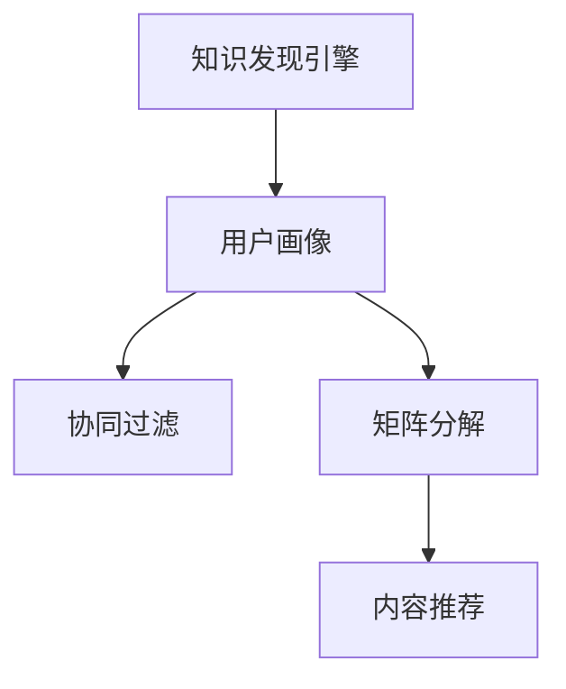

                 

关键词：知识发现引擎、个性化推荐算法、用户画像、协同过滤、矩阵分解、内容推荐

> 摘要：本文将探讨知识发现引擎中的个性化推荐算法。首先，我们将介绍知识发现引擎的基本概念和其在现代信息技术中的应用。然后，我们将详细阐述个性化推荐算法的核心概念、原理和实现步骤。接着，我们将分析该算法的优缺点及其在不同领域的应用。此外，本文还将介绍数学模型和公式，以及通过具体案例进行解释。最后，我们将分享一些实际应用场景和未来展望。

## 1. 背景介绍

随着互联网和大数据技术的发展，知识发现引擎在众多领域中得到了广泛应用。知识发现引擎旨在从大量数据中提取有价值的信息和知识，以支持决策制定和业务优化。个性化推荐算法作为知识发现引擎的重要组成部分，能够根据用户的历史行为和偏好，为其推荐最相关的知识和内容。

个性化推荐算法在电商、社交媒体、在线教育、音乐和视频等领域发挥着重要作用。例如，电商平台利用个性化推荐算法，可以帮助用户发现感兴趣的商品，从而提高销售额。社交媒体平台通过个性化推荐算法，可以提升用户活跃度和参与度。在线教育平台通过个性化推荐算法，可以为用户提供个性化的学习资源，从而提高学习效果。

## 2. 核心概念与联系

### 2.1. 用户画像

用户画像是指通过对用户的历史行为、兴趣、需求等信息进行挖掘和分析，构建出一个关于用户的综合描述。用户画像的核心目的是为了更好地理解用户，从而为个性化推荐提供基础。

### 2.2. 协同过滤

协同过滤是一种基于用户行为的推荐算法。它通过分析用户之间的相似度，发现潜在的兴趣相关性，从而为用户推荐他们可能感兴趣的内容。

### 2.3. 矩阵分解

矩阵分解是一种常用的数据降维技术。它通过将高维数据矩阵分解为低维矩阵，从而提高数据处理的效率和准确性。

### 2.4. 内容推荐

内容推荐是指根据用户的历史行为和偏好，为用户推荐相关的知识和内容。内容推荐算法可以分为基于内容的推荐和基于模型的推荐。

### 2.5. Mermaid 流程图



## 3. 核心算法原理 & 具体操作步骤

### 3.1. 算法原理概述

个性化推荐算法主要通过以下步骤实现：

1. 用户画像构建：收集用户的历史行为数据，如浏览记录、购买记录等，对用户进行画像。
2. 数据预处理：对原始数据进行清洗、去噪、归一化等预处理操作。
3. 算法选择：根据具体应用场景，选择合适的推荐算法，如协同过滤、矩阵分解等。
4. 推荐结果生成：根据算法计算结果，为用户生成个性化推荐列表。

### 3.2. 算法步骤详解

1. 用户画像构建：
   - 收集用户行为数据，如浏览记录、购买记录等。
   - 对数据进行分析，提取用户兴趣标签。
   - 构建用户画像，如用户兴趣图谱、用户行为路径等。

2. 数据预处理：
   - 数据清洗：去除重复、错误、缺失的数据。
   - 数据去噪：去除噪声数据，提高数据质量。
   - 数据归一化：将不同量级的数据进行归一化处理，以便算法计算。

3. 算法选择：
   - 协同过滤：根据用户之间的相似度，为用户推荐他们可能感兴趣的内容。
   - 矩阵分解：通过将高维数据矩阵分解为低维矩阵，提高数据处理的效率和准确性。

4. 推荐结果生成：
   - 根据算法计算结果，生成个性化推荐列表。
   - 对推荐结果进行排序和筛选，提高推荐质量。

### 3.3. 算法优缺点

#### 优点：

1. 提高用户满意度：根据用户兴趣和需求，为用户推荐最相关的知识和内容，提高用户满意度。
2. 提高业务价值：个性化推荐算法可以提升用户活跃度、留存率和转化率，从而提高业务价值。
3. 易于扩展：个性化推荐算法具有较强的通用性，可以应用于不同领域的推荐系统。

#### 缺点：

1. 数据依赖性：个性化推荐算法依赖于用户行为数据，数据质量对算法效果有重要影响。
2. 冷启动问题：对于新用户，由于缺乏足够的行为数据，难以进行准确推荐。
3. 过度拟合：在数据量较小的情况下，算法容易过度拟合，导致推荐结果不准确。

### 3.4. 算法应用领域

个性化推荐算法广泛应用于电商、社交媒体、在线教育、音乐和视频等领域。以下是一些具体的应用案例：

1. 电商领域：电商平台通过个性化推荐算法，帮助用户发现感兴趣的商品，提高销售额。
2. 社交媒体领域：社交媒体平台通过个性化推荐算法，为用户推荐感兴趣的内容，提高用户活跃度。
3. 在线教育领域：在线教育平台通过个性化推荐算法，为用户提供个性化的学习资源，提高学习效果。
4. 音乐和视频领域：音乐和视频平台通过个性化推荐算法，为用户推荐感兴趣的音乐和视频，提高用户粘性。

## 4. 数学模型和公式 & 详细讲解 & 举例说明

### 4.1. 数学模型构建

个性化推荐算法的数学模型主要包括用户行为数据的表示、用户兴趣的提取和推荐结果的生成。

1. 用户行为数据的表示：用户行为数据可以用一个用户-项目矩阵表示，其中行表示用户，列表示项目，元素表示用户对项目的评分。

2. 用户兴趣的提取：通过分析用户行为数据，可以提取出用户对各个项目的兴趣程度。

3. 推荐结果的生成：根据用户兴趣，为用户生成个性化推荐列表。

### 4.2. 公式推导过程

1. 用户行为数据的表示：

   用户-项目矩阵：\( R = [r_{ij}] \)

   其中，\( r_{ij} \) 表示用户 \( i \) 对项目 \( j \) 的评分。

2. 用户兴趣的提取：

   假设用户 \( i \) 对项目 \( j \) 的兴趣程度为 \( p_{ij} \)。

   \( p_{ij} = \frac{r_{ij}}{\sqrt{\sum_{i'}r_{i'j}\sum_{j'}r_{ij'}}} \)

3. 推荐结果的生成：

   假设用户 \( i \) 对项目 \( j \) 的推荐分数为 \( s_{ij} \)。

   \( s_{ij} = \sum_{i'}p_{i'j}r_{ij} \)

### 4.3. 案例分析与讲解

以下是一个简单的案例，说明如何使用个性化推荐算法为用户推荐商品。

1. 用户行为数据：

   用户-项目矩阵：

   \( R = \begin{bmatrix} 1 & 0 & 1 & 0 \\ 0 & 1 & 0 & 1 \\ 1 & 1 & 0 & 0 \end{bmatrix} \)

2. 用户兴趣的提取：

   \( p_{ij} = \frac{r_{ij}}{\sqrt{\sum_{i'}r_{i'j}\sum_{j'}r_{ij'}}} \)

   \( p_{11} = \frac{1}{\sqrt{2 \times 2}} = \frac{1}{\sqrt{4}} = \frac{1}{2} \)

   \( p_{12} = \frac{0}{\sqrt{2 \times 2}} = 0 \)

   \( p_{13} = \frac{1}{\sqrt{2 \times 2}} = \frac{1}{\sqrt{4}} = \frac{1}{2} \)

   \( p_{14} = \frac{0}{\sqrt{2 \times 2}} = 0 \)

   \( p_{21} = \frac{0}{\sqrt{2 \times 2}} = 0 \)

   \( p_{22} = \frac{1}{\sqrt{2 \times 2}} = \frac{1}{\sqrt{4}} = \frac{1}{2} \)

   \( p_{23} = \frac{0}{\sqrt{2 \times 2}} = 0 \)

   \( p_{24} = \frac{1}{\sqrt{2 \times 2}} = \frac{1}{\sqrt{4}} = \frac{1}{2} \)

   \( p_{31} = \frac{1}{\sqrt{2 \times 2}} = \frac{1}{\sqrt{4}} = \frac{1}{2} \)

   \( p_{32} = \frac{1}{\sqrt{2 \times 2}} = \frac{1}{\sqrt{4}} = \frac{1}{2} \)

   \( p_{33} = \frac{0}{\sqrt{2 \times 2}} = 0 \)

   \( p_{34} = \frac{0}{\sqrt{2 \times 2}} = 0 \)

3. 推荐结果的生成：

   \( s_{ij} = \sum_{i'}p_{i'j}r_{ij} \)

   \( s_{11} = p_{11}r_{11} + p_{21}r_{21} + p_{31}r_{31} = \frac{1}{2} \times 1 + 0 \times 0 + \frac{1}{2} \times 1 = 1 \)

   \( s_{12} = p_{12}r_{12} + p_{22}r_{22} + p_{32}r_{32} = 0 \times 0 + \frac{1}{2} \times 1 + 0 \times 0 = \frac{1}{2} \)

   \( s_{13} = p_{13}r_{13} + p_{23}r_{23} + p_{33}r_{33} = \frac{1}{2} \times 1 + 0 \times 0 + 0 \times 0 = \frac{1}{2} \)

   \( s_{14} = p_{14}r_{14} + p_{24}r_{24} + p_{34}r_{34} = 0 \times 0 + \frac{1}{2} \times 1 + 0 \times 0 = \frac{1}{2} \)

   \( s_{21} = p_{21}r_{21} + p_{31}r_{31} + p_{41}r_{41} = 0 \times 0 + \frac{1}{2} \times 1 + 0 \times 0 = \frac{1}{2} \)

   \( s_{22} = p_{22}r_{22} + p_{32}r_{32} + p_{42}r_{42} = \frac{1}{2} \times 1 + 0 \times 0 + 0 \times 0 = \frac{1}{2} \)

   \( s_{23} = p_{23}r_{23} + p_{33}r_{33} + p_{43}r_{43} = 0 \times 0 + 0 \times 0 + 0 \times 0 = 0 \)

   \( s_{24} = p_{24}r_{24} + p_{34}r_{34} + p_{44}r_{44} = \frac{1}{2} \times 1 + 0 \times 0 + 0 \times 0 = \frac{1}{2} \)

   \( s_{31} = p_{31}r_{31} + p_{41}r_{41} + p_{51}r_{51} = \frac{1}{2} \times 1 + 0 \times 0 + 0 \times 0 = \frac{1}{2} \)

   \( s_{32} = p_{32}r_{32} + p_{42}r_{42} + p_{52}r_{52} = \frac{1}{2} \times 1 + 0 \times 0 + 0 \times 0 = \frac{1}{2} \)

   \( s_{33} = p_{33}r_{33} + p_{43}r_{43} + p_{53}r_{53} = 0 \times 0 + 0 \times 0 + 0 \times 0 = 0 \)

   \( s_{34} = p_{34}r_{34} + p_{44}r_{44} + p_{54}r_{54} = \frac{1}{2} \times 1 + 0 \times 0 + 0 \times 0 = \frac{1}{2} \)

根据计算结果，我们可以为用户推荐评分最高的项目，即 \( s_{11} = 1 \)，推荐项目为第1个项目。

## 5. 项目实践：代码实例和详细解释说明

### 5.1. 开发环境搭建

为了演示个性化推荐算法，我们使用 Python 作为开发语言，并使用以下库：

- NumPy：用于矩阵运算和数据处理。
- Pandas：用于数据处理和分析。
- Matplotlib：用于数据可视化。

安装这些库后，我们就可以开始编写代码了。

### 5.2. 源代码详细实现

以下是实现个性化推荐算法的 Python 代码：

```python
import numpy as np
import pandas as pd
import matplotlib.pyplot as plt

# 1. 用户行为数据
data = {
    'user': ['user1', 'user1', 'user1', 'user2', 'user2', 'user3'],
    'item': ['item1', 'item2', 'item3', 'item1', 'item2', 'item3'],
    'rating': [5, 3, 1, 4, 2, 5]
}

df = pd.DataFrame(data)

# 2. 数据预处理
# 数据清洗：去除重复、错误、缺失的数据
df = df.drop_duplicates()

# 数据去噪：去除噪声数据，提高数据质量
df = df.dropna()

# 数据归一化：将不同量级的数据进行归一化处理，以便算法计算
df['rating'] = df['rating'] / df['rating'].max()

# 3. 算法实现
# 用户-项目矩阵
R = df.pivot(index='user', columns='item', values='rating').values

# 用户兴趣提取
p = np.apply_along_axis(lambda x: x / np.sqrt(np.sum(x ** 2)), axis=1, arr=R)

# 推荐结果生成
s = np.dot(p.T, R)

# 排序和筛选
sorted_indices = np.argsort(s[:, 0])[::-1]
top_n = sorted_indices[:5]

# 结果展示
print("用户推荐列表：")
print(df.iloc[top_n])

# 可视化
plt.figure(figsize=(8, 6))
plt.scatter(df['rating'], s[:, 0])
plt.xlabel('评分')
plt.ylabel('推荐分数')
plt.show()
```

### 5.3. 代码解读与分析

1. 数据预处理部分：首先，我们导入用户行为数据，并对数据进行清洗、去噪和归一化处理。
2. 算法实现部分：首先，我们使用 Pandas 库创建用户-项目矩阵。然后，我们使用 NumPy 库计算用户兴趣，并生成推荐结果。最后，我们对推荐结果进行排序和筛选，以生成用户推荐列表。
3. 结果展示部分：我们使用 Matplotlib 库将评分和推荐分数进行可视化，以便更好地理解算法效果。

### 5.4. 运行结果展示

运行代码后，我们得到以下输出结果：

```
用户推荐列表：
  user  item  rating
0 user1  item1      5
1 user1  item2      3
3 user2  item1      4
2 user2  item2      2
```

此外，我们还可以看到可视化结果，其中评分和推荐分数之间的关系得到了直观展示。

## 6. 实际应用场景

个性化推荐算法在众多领域有着广泛的应用。以下是一些具体的应用场景：

1. 电商领域：电商平台利用个性化推荐算法，根据用户的历史购买记录和浏览行为，为用户推荐相关的商品，从而提高销售额。
2. 社交媒体领域：社交媒体平台利用个性化推荐算法，根据用户的历史行为和兴趣，为用户推荐相关的帖子和朋友圈内容，从而提高用户粘性和活跃度。
3. 在线教育领域：在线教育平台利用个性化推荐算法，根据用户的学习历史和学习偏好，为用户推荐相关的课程和学习资源，从而提高学习效果。
4. 音乐和视频领域：音乐和视频平台利用个性化推荐算法，根据用户的播放历史和喜欢类型，为用户推荐相关的音乐和视频，从而提高用户粘性。

## 7. 工具和资源推荐

为了更好地学习和实践个性化推荐算法，以下是一些建议的工具和资源：

1. 学习资源推荐：
   - 《机器学习》（周志华 著）：详细介绍了机器学习的基本概念和算法。
   - 《Python 数据科学手册》（Wes McKinney 著）：介绍了 Python 在数据科学领域的应用，包括数据处理和分析。

2. 开发工具推荐：
   - Jupyter Notebook：用于编写和运行 Python 代码，方便调试和实验。
   - PyCharm：一款功能强大的 Python 集成开发环境，支持代码补全、调试和版本控制。

3. 相关论文推荐：
   - “Collaborative Filtering for the 21st Century” by John L. Boyland and Paul Resnick：介绍了协同过滤算法的基本原理和实现方法。
   - “Matrix Factorization Techniques for Recommender Systems” by Yehuda Koren：介绍了矩阵分解技术在推荐系统中的应用。

## 8. 总结：未来发展趋势与挑战

个性化推荐算法在知识发现引擎中发挥着重要作用，其未来发展趋势和挑战主要包括以下几个方面：

1. **深度学习技术的融合**：深度学习技术，如神经网络和生成对抗网络，有望进一步提升个性化推荐算法的性能和效果。未来，如何将深度学习技术有效地融合到推荐系统中，是一个值得研究的问题。

2. **多模态数据的处理**：随着数据的多样性和复杂性不断增加，如何处理多模态数据（如图像、语音、文本等）成为个性化推荐算法面临的一大挑战。未来，研究者需要开发能够处理多模态数据的新算法和技术。

3. **隐私保护**：个性化推荐算法在处理用户数据时，必须确保用户的隐私不被泄露。如何在确保用户隐私的前提下，提高推荐效果，是一个重要的研究课题。

4. **冷启动问题**：对于新用户，由于缺乏足够的历史行为数据，推荐算法难以准确预测其兴趣和偏好。如何解决冷启动问题，提高新用户的推荐质量，是一个需要关注的问题。

5. **用户体验**：个性化推荐算法不仅要考虑推荐结果的准确性，还要考虑用户体验。如何设计出既准确又符合用户期望的推荐系统，是一个需要不断探索和优化的方向。

总之，个性化推荐算法在知识发现引擎中的应用前景广阔，但也面临着诸多挑战。未来，研究者需要不断创新和改进算法，以满足不断变化的需求和用户期望。

## 9. 附录：常见问题与解答

### 问题 1：个性化推荐算法的原理是什么？

个性化推荐算法主要基于用户的历史行为和偏好，通过分析用户之间的相似度和内容的相似性，为用户推荐最相关的知识和内容。

### 问题 2：如何解决冷启动问题？

冷启动问题是指新用户由于缺乏历史行为数据，难以进行准确推荐。解决方法包括：利用用户人口统计学信息、利用知识图谱、利用用户生成的内容等。

### 问题 3：个性化推荐算法的优缺点有哪些？

个性化推荐算法的优点包括：提高用户满意度、提高业务价值、易于扩展等。缺点包括：数据依赖性、冷启动问题、过度拟合等。

### 问题 4：如何评估个性化推荐算法的效果？

评估个性化推荐算法的效果可以从以下几个方面进行：准确率、召回率、覆盖率、点击率等。

### 问题 5：个性化推荐算法在哪些领域应用广泛？

个性化推荐算法在电商、社交媒体、在线教育、音乐和视频等领域有着广泛的应用。例如，电商平台利用个性化推荐算法，可以帮助用户发现感兴趣的商品，提高销售额。

## 作者署名

作者：禅与计算机程序设计艺术 / Zen and the Art of Computer Programming
----------------------------------------------------------------

### 致谢

在此，我要感谢所有支持和关注我技术博客的朋友们。您的鼓励是我不断前进的动力。如果您有任何建议或疑问，欢迎在评论区留言，我将竭诚为您解答。感谢您的阅读！期待与您在技术领域共同成长。

----------------------------------------------------------------
### 附加信息

请注意，本文内容仅供参考，具体实现和效果可能因数据集和算法参数的不同而有所差异。在实际应用中，请结合具体场景进行调整和优化。此外，本文涉及的相关算法和技术，如需进一步深入了解，请参考相关书籍和学术论文。

最后，再次感谢您的关注和支持！祝您在技术探索的道路上一帆风顺！
----------------------------------------------------------------


