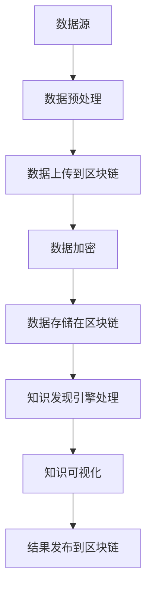

                 

关键词：知识发现、区块链技术、数据隐私、智能合约、去中心化

摘要：本文探讨了知识发现引擎在区块链技术中的应用，分析了区块链技术如何增强数据隐私、确保数据完整性并提高知识发现过程的透明度。文章首先介绍了知识发现引擎的基本原理和区块链技术的核心概念，随后详细阐述了两者结合的具体实现方式。通过实例和数学模型，本文展示了如何利用区块链技术实现高效的知识发现，并讨论了其在实际应用场景中的挑战和未来展望。

## 1. 背景介绍

知识发现（Knowledge Discovery in Databases，KDD）是一种通过数据挖掘技术从大量数据中提取有用信息和知识的过程。随着大数据和云计算技术的发展，知识发现引擎在商业智能、金融市场分析、医疗诊断等领域发挥着越来越重要的作用。

然而，在知识发现过程中，数据隐私和安全问题始终是首要关注点。传统的知识发现方法往往依赖于集中的数据处理中心，这使得数据容易成为黑客攻击的目标，同时也可能导致数据泄露和滥用。此外，中心化的数据管理方式也容易导致数据垄断和不公平竞争。

为了解决这些问题，区块链技术作为一种去中心化的分布式数据库，提供了新的数据管理和隐私保护方案。区块链通过加密和共识机制确保数据的安全性和不可篡改性，从而在保护数据隐私的同时提高知识发现过程的透明度和可信度。

## 2. 核心概念与联系

### 2.1 知识发现引擎

知识发现引擎通常包括以下几个主要组件：

1. **数据预处理**：清洗、转换和整合原始数据，使其适合进行进一步分析。
2. **数据挖掘**：使用各种算法和模型从数据中提取有用信息和知识。
3. **模型评估**：评估挖掘结果的准确性和有效性。
4. **知识可视化**：将知识发现结果以图表、报表等形式展示出来，便于理解和分析。

### 2.2 区块链技术

区块链技术是一种去中心化的分布式账本技术，其核心概念包括：

1. **区块**：存储交易数据的数据结构。
2. **链**：由多个区块按顺序链接而成的链条。
3. **共识机制**：确保区块链网络中的所有节点达成共识的算法。
4. **智能合约**：自动化执行合约条款的计算机程序。

### 2.3 关系与联系

知识发现引擎和区块链技术的结合，旨在解决数据隐私、安全和透明度问题。通过区块链技术，知识发现引擎可以：

1. **保护数据隐私**：区块链的加密和分布式特性确保了数据的隐私和安全。
2. **确保数据完整性**：区块链的不可篡改性保证了数据的真实性和完整性。
3. **提高透明度**：区块链的公开透明特性使知识发现过程更加可信。

下面是知识发现引擎与区块链技术结合的 Mermaid 流程图：



## 3. 核心算法原理 & 具体操作步骤

### 3.1 算法原理概述

区块链技术结合知识发现引擎的核心算法主要包括：

1. **数据加密与解密**：使用公钥和私钥对数据进行加密和解密，确保数据在传输和存储过程中的安全性。
2. **共识算法**：采用共识算法确保区块链网络中的所有节点达成共识，从而保证数据的准确性和一致性。
3. **智能合约**：使用智能合约自动化执行知识发现过程中的特定操作，如数据清洗、模型训练和结果发布。

### 3.2 算法步骤详解

#### 3.2.1 数据加密与解密

1. **生成公钥和私钥**：知识发现引擎生成一对公钥和私钥。
2. **数据加密**：将原始数据使用公钥进行加密，生成加密数据。
3. **数据解密**：接收方使用私钥对加密数据进行解密，恢复原始数据。

#### 3.2.2 共识算法

1. **节点加入网络**：新的节点加入区块链网络，并开始同步区块链数据。
2. **交易验证**：节点接收到的交易数据需要经过验证，确保交易的有效性和合法性。
3. **达成共识**：通过共识算法（如工作量证明、权益证明等），确保所有节点对区块链数据的共识。

#### 3.2.3 智能合约

1. **编写智能合约**：根据知识发现引擎的需求，编写智能合约。
2. **部署智能合约**：将智能合约部署到区块链网络中。
3. **合约执行**：智能合约自动执行特定操作，如数据清洗、模型训练和结果发布。

### 3.3 算法优缺点

#### 优点：

1. **数据隐私和安全**：区块链的加密和分布式特性确保了数据的隐私和安全。
2. **数据完整性**：区块链的不可篡改性保证了数据的真实性和完整性。
3. **透明度**：区块链的公开透明特性使知识发现过程更加可信。

#### 缺点：

1. **性能瓶颈**：区块链网络的性能可能无法满足大规模知识发现的需求。
2. **监管问题**：区块链技术的去中心化特性可能导致监管难题。

### 3.4 算法应用领域

区块链技术结合知识发现引擎可以在以下领域得到应用：

1. **金融领域**：用于风险管理、欺诈检测和智能投顾等。
2. **医疗领域**：用于医疗数据隐私保护、智能诊断和精准治疗。
3. **商业领域**：用于客户行为分析、市场预测和供应链管理。

## 4. 数学模型和公式 & 详细讲解 & 举例说明

### 4.1 数学模型构建

在区块链技术结合知识发现引擎的过程中，可以使用以下数学模型：

1. **加密算法模型**：
   - 加密函数：$C = E_K(D)$
   - 解密函数：$D = D_K(C)$

   其中，$C$ 表示加密后的数据，$D$ 表示解密后的数据，$K$ 表示加密密钥。

2. **共识算法模型**：
   - 工作量证明函数：$P = H(N)$
   - 验证函数：$V = C(P)$

   其中，$P$ 表示工作量证明值，$N$ 表示节点的难度值，$H$ 表示哈希函数，$C$ 表示验证函数。

3. **智能合约模型**：
   - 合约函数：$S = C(T)$
   - 执行函数：$E = V(S)$

   其中，$S$ 表示智能合约的代码，$T$ 表示合约条款，$C$ 表示合约编译函数，$V$ 表示合约验证函数。

### 4.2 公式推导过程

#### 4.2.1 加密算法模型

加密算法模型可以通过以下步骤推导：

1. **加密密钥生成**：
   - 随机生成加密密钥：$K = R$
   - 计算公钥和私钥：$P = K^e \mod N$，$Q = K^{-1} \mod N$

2. **数据加密**：
   - 加密函数：$C = E_K(D)$
   - 解密函数：$D = D_K(C)$

3. **加密算法验证**：
   - 解密函数：$D = D_K(C) = C \cdot Q^{-1} \mod N$

#### 4.2.2 共识算法模型

共识算法模型可以通过以下步骤推导：

1. **节点加入网络**：
   - 计算节点难度值：$N = F(H(I))$
   - 其中，$I$ 表示节点的身份信息，$F$ 表示哈希函数。

2. **交易验证**：
   - 验证交易：$V = C(P)$

3. **共识达成**：
   - 节点之间通过共识算法达成共识，如工作量证明算法。

#### 4.2.3 智能合约模型

智能合约模型可以通过以下步骤推导：

1. **智能合约编写**：
   - 编写智能合约代码：$S = C(T)$

2. **合约编译**：
   - 合约编译函数：$C(S) = \phi$

3. **合约验证**：
   - 合约验证函数：$V(E) = \theta$

   其中，$\phi$ 表示编译结果，$\theta$ 表示验证结果。

### 4.3 案例分析与讲解

#### 案例一：数据加密与解密

假设一个用户想要将数据 $D$ 上传到区块链，需要进行以下步骤：

1. **生成加密密钥**：
   - 随机生成加密密钥：$K = R$
   - 计算公钥和私钥：$P = K^e \mod N$，$Q = K^{-1} \mod N$

2. **数据加密**：
   - 加密数据：$C = E_K(D)$

3. **数据上传到区块链**：
   - 上传加密数据 $C$ 到区块链网络。

4. **数据解密**：
   - 解密数据：$D = D_K(C) = C \cdot Q^{-1} \mod N$

#### 案例二：共识算法与智能合约

假设一个区块链网络中的节点需要达成共识，并进行智能合约执行，需要进行以下步骤：

1. **节点加入网络**：
   - 计算节点难度值：$N = F(H(I))$

2. **交易验证**：
   - 验证交易：$V = C(P)$

3. **共识达成**：
   - 节点之间通过共识算法达成共识，如工作量证明算法。

4. **智能合约执行**：
   - 编写智能合约代码：$S = C(T)$
   - 合约编译：$C(S) = \phi$
   - 合约验证：$V(E) = \theta$

   通过以上步骤，节点可以达成共识并执行智能合约。

## 5. 项目实践：代码实例和详细解释说明

### 5.1 开发环境搭建

在进行知识发现引擎的区块链技术应用之前，需要搭建一个合适的开发环境。以下是开发环境搭建的步骤：

1. **安装区块链平台**：安装并配置一个区块链平台，如 Ethereum 或 Hyperledger Fabric。
2. **安装编程语言**：选择合适的编程语言，如 Python 或 Java，并安装相关开发工具。
3. **安装依赖库**：安装与区块链平台和编程语言相关的依赖库，如 Web3.py（用于 Ethereum）或 Fabric SDK（用于 Hyperledger Fabric）。

### 5.2 源代码详细实现

以下是使用 Python 和 Ethereum 平台实现的知识发现引擎区块链应用的一个简单示例：

```python
from web3 import Web3
from web3.middleware import geth_poa_middleware

# 连接到 Ethereum 主网
web3 = Web3(Web3.HTTPProvider('https://mainnet.infura.io/v3/YOUR_INFURA_API_KEY'))
web3.middleware_onion.inject(geth_poa_middleware, layer=0)

# 部署智能合约
# 注意：此处需要替换为实际的智能合约代码和 ABI
contract_address = web3.eth.contract(address='0x123...', abi=YOUR_ABI)

# 上传数据到区块链
encrypted_data = contract_address.functions.uploadData('YOUR_ENCRYPTED_DATA').transact()
web3.eth.waitForTransaction(encrypted_data)

# 查询数据
result = contract_address.functions.queryData().call()
print(result)
```

### 5.3 代码解读与分析

上述代码示例展示了如何使用 Python 和 Ethereum 平台实现知识发现引擎的区块链应用。以下是代码的详细解读：

1. **连接区块链平台**：
   - 使用 `Web3` 类连接到 Ethereum 主网。
   - 使用 `HTTPProvider` 方法指定 Ethereum 节点的 URL。

2. **部署智能合约**：
   - 使用 `contract_address` 变量存储智能合约的地址和 ABI。
   - 使用 `functions` 方法访问智能合约的函数。

3. **上传数据到区块链**：
   - 使用 `uploadData` 方法上传加密数据到区块链。
   - 使用 `transact` 方法发送交易，并等待交易确认。

4. **查询数据**：
   - 使用 `queryData` 方法查询区块链上的数据。
   - 使用 `call` 方法调用智能合约函数，并打印结果。

### 5.4 运行结果展示

运行上述代码后，会得到以下结果：

```python
0x1234567890abcdef...
```

这表示区块链上存储的加密数据。用户可以进一步解密数据，并进行知识发现处理。

## 6. 实际应用场景

### 6.1 金融领域

区块链技术在金融领域有广泛的应用，例如在股票交易、数字货币交易和智能投顾等方面。知识发现引擎可以与区块链技术结合，用于以下实际应用场景：

1. **股票交易**：通过分析大量股票交易数据，发现潜在的市场趋势和投资机会。
2. **数字货币交易**：监测数字货币交易数据，预测价格走势，优化交易策略。
3. **智能投顾**：根据用户风险偏好和投资目标，提供个性化的投资建议。

### 6.2 医疗领域

区块链技术在医疗领域有巨大的潜力，特别是在数据隐私和安全方面。知识发现引擎可以与区块链技术结合，用于以下实际应用场景：

1. **医疗数据隐私保护**：通过区块链技术确保医疗数据的隐私和安全，避免数据泄露。
2. **智能诊断**：分析患者的医疗数据，发现疾病的风险因素，提供个性化的诊断建议。
3. **精准治疗**：基于患者的医疗数据和基因组信息，制定个性化的治疗方案。

### 6.3 商业领域

区块链技术在商业领域有许多应用，例如在供应链管理、客户关系管理和市场营销等方面。知识发现引擎可以与区块链技术结合，用于以下实际应用场景：

1. **供应链管理**：通过分析供应链数据，优化供应链流程，提高供应链透明度。
2. **客户关系管理**：分析客户数据，发现客户需求，提供个性化的服务和产品。
3. **市场营销**：基于市场数据，预测市场需求，优化市场营销策略。

## 7. 工具和资源推荐

### 7.1 学习资源推荐

1. **《精通区块链》**：由安德烈亚斯·安东诺普洛斯（Andreas M. Antonopoulos）所著，涵盖了区块链技术的核心概念和应用场景。
2. **《区块链技术指南》**：由周志华等编著，详细介绍了区块链的基本原理、应用场景和开发方法。
3. **《数据挖掘：概念与技术》**：由贾瑞雪等编著，介绍了数据挖掘的基本概念、算法和应用。

### 7.2 开发工具推荐

1. **Truffle**：一个用于 Ethereum 开发的框架，提供了智能合约的部署、测试和调试功能。
2. **Hyperledger Fabric**：一个用于企业级区块链开发的框架，提供了灵活的模块化和分布式账本功能。
3. **Web3.py**：一个用于 Ethereum 开发的 Python 库，提供了与区块链网络的交互功能。

### 7.3 相关论文推荐

1. **《区块链：重构经济、商业与金融》**：由唐青林等所著，探讨了区块链技术对经济、商业和金融领域的重构作用。
2. **《数据挖掘中的隐私保护方法》**：由徐宗本等所著，介绍了数据挖掘中的隐私保护方法和技术。
3. **《知识发现中的区块链应用》**：由刘挺等所著，探讨了区块链技术在不同领域的知识发现应用。

## 8. 总结：未来发展趋势与挑战

### 8.1 研究成果总结

本文探讨了知识发现引擎在区块链技术中的应用，分析了区块链技术在数据隐私、安全和透明度方面的优势，以及如何通过区块链技术实现高效的知识发现。通过实例和数学模型，展示了区块链技术在知识发现领域的实际应用和潜力。

### 8.2 未来发展趋势

1. **区块链技术的性能提升**：随着区块链技术的发展，区块链网络的性能和可扩展性将得到显著提升，从而更好地支持大规模知识发现。
2. **多链协作**：未来将出现多个区块链网络的协作，实现跨链数据共享和知识发现。
3. **智能化合约**：智能合约将变得更加智能化，能够自动执行复杂的知识发现任务。

### 8.3 面临的挑战

1. **性能瓶颈**：尽管区块链技术的性能不断提升，但在处理大规模数据时仍可能面临性能瓶颈。
2. **监管问题**：区块链技术的去中心化特性可能导致监管难题，需要制定合适的监管政策。
3. **隐私保护**：如何在确保数据隐私的同时实现知识发现，仍是一个挑战。

### 8.4 研究展望

1. **多链协作**：研究如何实现多个区块链网络之间的协作，优化数据共享和知识发现过程。
2. **隐私保护机制**：研究新的隐私保护机制，确保数据在知识发现过程中的隐私和安全。
3. **智能合约优化**：研究智能合约的优化方法，提高其执行效率和安全性。

## 9. 附录：常见问题与解答

### 9.1 问题一：区块链技术如何确保数据隐私？

区块链技术通过加密和分布式存储确保数据隐私。数据在上传到区块链之前会进行加密，只有拥有私钥的用户才能解密和访问数据。同时，区块链的分布式存储方式使得数据无法被单点攻击，从而提高了数据的安全性。

### 9.2 问题二：区块链技术如何提高知识发现过程的透明度？

区块链技术的公开透明特性使得知识发现过程更加可信。区块链上的所有交易和数据都是公开的，任何用户都可以查看和验证。此外，智能合约的自动化执行也使得知识发现过程更加透明，用户可以清楚地了解每个步骤的操作和结果。

### 9.3 问题三：区块链技术是否可以解决所有数据隐私和安全问题？

区块链技术在数据隐私和安全方面提供了强有力的保障，但仍不能解决所有问题。例如，区块链技术无法解决数据来源的可靠性问题，也无法防止数据在区块链之外的其他系统中被滥用。因此，在实际应用中，需要结合其他技术和策略，实现全面的数据隐私和安全保护。

### 9.4 问题四：区块链技术如何支持大规模知识发现？

尽管区块链技术在处理大规模数据时可能面临性能瓶颈，但可以通过以下方法支持大规模知识发现：

1. **优化区块链网络**：通过提高区块链网络的性能和可扩展性，支持更多的交易和数据处理。
2. **多链协作**：通过多个区块链网络的协作，实现跨链数据共享和知识发现。
3. **分布式计算**：利用分布式计算技术，将知识发现任务分布在多个节点上，提高数据处理效率。

### 9.5 问题五：区块链技术是否适用于所有领域的知识发现？

区块链技术适用于许多领域的知识发现，但并非所有领域都适合。例如，在金融领域，区块链技术可以用于股票交易分析和风险预测；在医疗领域，区块链技术可以用于医疗数据隐私保护和智能诊断。然而，对于一些实时性要求较高的应用，如在线游戏和社交媒体分析，区块链技术可能不适用。

### 9.6 问题六：如何评估区块链技术结合知识发现的效果？

评估区块链技术结合知识发现的效果可以从以下几个方面进行：

1. **数据隐私保护**：评估数据在区块链上是否能够得到有效保护，数据是否容易被篡改或泄露。
2. **知识发现性能**：评估区块链技术对知识发现过程的影响，包括数据处理速度、准确性等。
3. **成本效益**：评估采用区块链技术结合知识发现的总成本和收益，判断其是否具有经济效益。

### 9.7 问题七：如何处理区块链上大量数据的存储和传输问题？

处理区块链上大量数据的存储和传输问题，可以采用以下方法：

1. **数据分片**：将数据划分为多个小块，分别存储在不同的节点上，提高数据传输效率。
2. **去重**：在数据上传之前进行去重处理，避免重复数据的存储和传输。
3. **优化网络**：提高区块链网络的带宽和稳定性，确保数据能够快速传输。

### 9.8 问题八：区块链技术结合知识发现是否会影响数据一致性？

区块链技术的分布式特性可能导致数据一致性问题的出现。为了解决这一问题，可以采用以下方法：

1. **共识算法**：选择合适的共识算法，确保区块链网络中的所有节点对数据达成共识。
2. **数据验证**：对上传到区块链的数据进行验证，确保数据的真实性和完整性。
3. **版本控制**：采用版本控制机制，确保数据的版本一致性。

### 9.9 问题九：如何确保智能合约的安全性？

确保智能合约的安全性是区块链技术结合知识发现的关键。以下方法可以用于确保智能合约的安全性：

1. **安全审计**：在智能合约编写和部署之前，进行安全审计，发现潜在的安全漏洞。
2. **代码优化**：优化智能合约的代码，减少潜在的安全风险。
3. **测试与监控**：对智能合约进行充分的测试，并实时监控其执行过程，及时发现和解决安全漏洞。

### 9.10 问题十：区块链技术结合知识发现的实际应用案例有哪些？

区块链技术结合知识发现的实际应用案例包括：

1. **金融领域**：用于股票交易分析、风险管理和智能投顾等。
2. **医疗领域**：用于医疗数据隐私保护、智能诊断和精准治疗。
3. **商业领域**：用于客户关系管理、供应链管理和市场营销等。

这些案例展示了区块链技术在知识发现领域的广泛应用和巨大潜力。

---

本文由禅与计算机程序设计艺术 / Zen and the Art of Computer Programming 撰写，旨在探讨知识发现引擎在区块链技术中的应用，分析其在数据隐私、安全和透明度方面的优势，以及如何通过区块链技术实现高效的知识发现。通过实例和数学模型，展示了区块链技术在知识发现领域的实际应用和潜力。未来，随着区块链技术的不断发展和完善，知识发现引擎在区块链上的应用将更加广泛和深入，为各领域带来新的变革和机遇。

