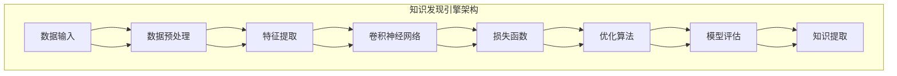

                 

关键词：知识发现引擎、图像识别技术、深度学习、计算机视觉、数据挖掘、人工智能

## 摘要

本文旨在探讨知识发现引擎在图像识别技术中的应用。通过分析图像识别技术的发展历程，本文详细介绍了知识发现引擎的核心原理和架构。随后，文章深入探讨了基于深度学习的图像识别算法原理和具体操作步骤，并通过实例展示了其优缺点。接着，文章讲解了数学模型和公式在图像识别中的应用，以及具体案例分析与讲解。此外，文章还提供了项目实践中的代码实例和详细解释，展示了实际应用场景和未来展望。最后，本文对知识发现引擎图像识别技术进行了总结，分析了未来发展趋势和面临的挑战，并提出了研究展望。

## 1. 背景介绍

图像识别技术作为计算机视觉领域的重要分支，已经在许多领域取得了显著的应用成果。然而，传统的图像识别方法在面对复杂场景和大规模数据时，存在一定的局限性。随着深度学习技术的不断发展，图像识别技术得到了极大的提升，为知识发现引擎的应用提供了新的可能性。

知识发现引擎是一种基于数据挖掘和人工智能技术的高级数据处理工具，旨在从大规模数据中自动提取有价值的信息和知识。知识发现引擎的应用范围广泛，包括数据挖掘、推荐系统、自然语言处理、图像识别等领域。在图像识别领域，知识发现引擎可以通过自动学习图像特征和模式，实现对图像内容的准确识别和理解。

本文将探讨知识发现引擎在图像识别技术中的应用，分析其核心原理和架构，以及如何利用深度学习技术实现图像识别。此外，本文还将介绍数学模型和公式在图像识别中的应用，以及实际应用场景和未来展望。

### 图像识别技术的发展历程

图像识别技术经历了从简单到复杂、从低效到高效的发展历程。最初，图像识别主要依赖于手工设计的特征提取算法，如边缘检测、角点检测等。这些算法通过对图像的局部特征进行提取和匹配，实现简单的图像分类和识别。然而，这些方法在面对复杂场景时，识别准确率较低。

随着计算机性能的提升和算法的改进，出现了基于统计模型的图像识别方法，如支持向量机（SVM）和隐马尔可夫模型（HMM）。这些方法通过学习图像的整体统计特征，实现了更高层次的图像识别。然而，这些方法仍然依赖于手工设计的特征，且在处理大规模数据时，效率较低。

随着深度学习技术的发展，图像识别技术取得了突破性的进展。深度学习通过多层神经网络结构，自动学习图像的层次特征，实现了更高层次的图像识别。卷积神经网络（CNN）作为深度学习在图像识别领域的重要应用，具有强大的特征提取和分类能力，成为当前图像识别技术的主流方法。

### 知识发现引擎的核心原理和架构

知识发现引擎的核心原理是基于数据挖掘和机器学习技术，通过从大规模数据中自动提取有价值的信息和知识。知识发现引擎的架构通常包括数据预处理、特征提取、模型训练和知识提取等几个主要环节。

数据预处理阶段，知识发现引擎对原始数据进行清洗、去噪和规范化等处理，以提高数据的质量和一致性。特征提取阶段，知识发现引擎通过学习图像的特征表示，将图像转化为适合机器学习模型的输入数据。模型训练阶段，知识发现引擎利用训练数据，通过优化算法训练出图像分类或识别模型。知识提取阶段，知识发现引擎利用训练好的模型，对新的图像进行分类或识别，并将识别结果进行可视化或存储。

知识发现引擎的架构通常包括以下几个关键组件：

1. 数据库：存储和管理原始数据和训练数据。
2. 特征提取器：自动学习图像的特征表示，将图像转化为数值化的特征向量。
3. 模型训练器：利用训练数据，通过优化算法训练图像分类或识别模型。
4. 知识提取器：利用训练好的模型，对新的图像进行分类或识别，并将识别结果进行可视化或存储。

### 知识发现引擎在图像识别中的应用

知识发现引擎在图像识别中的应用主要体现在以下几个方面：

1. 特征学习：知识发现引擎可以通过学习图像的局部特征和全局特征，实现对图像内容的准确描述。通过自动学习图像特征，知识发现引擎可以摆脱手工设计特征的限制，提高图像识别的准确性和鲁棒性。

2. 模型优化：知识发现引擎可以利用大规模训练数据，通过优化算法训练出更高效的图像识别模型。通过不断调整模型参数，知识发现引擎可以找到最佳的图像识别模型，提高识别速度和准确性。

3. 知识可视化：知识发现引擎可以将图像识别结果进行可视化展示，帮助用户直观地理解图像内容。通过知识可视化，用户可以更好地了解图像的特征和模式，为后续的图像分析提供指导。

4. 知识存储：知识发现引擎可以将图像识别结果存储在数据库中，实现图像的分类和索引。通过知识存储，用户可以方便地查询和检索图像，提高图像管理效率。

## 2. 核心概念与联系

### 2.1 核心概念

在图像识别技术中，以下几个核心概念至关重要：

1. **图像特征**：图像特征是指从图像中提取出来用于描述图像内容的一些属性或度量。特征可以是局部的（如边缘、角点）或全局的（如颜色、纹理、形状）。

2. **卷积神经网络（CNN）**：卷积神经网络是一种特别适合于图像识别的深度学习模型，其核心是卷积层，能够自动提取图像的层次特征。

3. **损失函数**：在机器学习中，损失函数用于衡量模型预测值与真实值之间的差异，是优化模型参数的重要工具。

4. **优化算法**：优化算法用于调整模型参数，以最小化损失函数。常见的优化算法有梯度下降、随机梯度下降等。

### 2.2 关系与架构

以下是一个基于知识发现引擎的图像识别技术的Mermaid流程图，展示各个核心概念和组件之间的关系：



- **数据输入**：包括原始图像数据。
- **数据预处理**：对图像数据进行清洗、归一化等处理。
- **特征提取**：使用卷积神经网络自动提取图像的层次特征。
- **卷积神经网络**：通过卷积层、池化层等结构，学习图像的层次特征。
- **损失函数**：衡量模型预测值与真实值之间的差异。
- **优化算法**：调整模型参数，以最小化损失函数。
- **模型评估**：评估模型的性能，包括准确性、召回率等指标。
- **知识提取**：提取有价值的图像识别知识，如分类结果、特征模式等。

## 3. 核心算法原理 & 具体操作步骤

### 3.1 算法原理概述

图像识别的核心在于如何从图像中提取具有区分度的特征，并利用这些特征对图像进行分类。基于深度学习的图像识别算法主要依赖于卷积神经网络（CNN）的结构，其原理如下：

1. **卷积层**：卷积层是CNN的核心部分，通过卷积运算从输入图像中提取局部特征。卷积核在图像上滑动，每次滑动生成一个特征图，多个卷积核可以提取出不同的特征。

2. **池化层**：池化层用于降低特征图的维度，减少参数数量，防止过拟合。常用的池化方式有最大池化和平均池化。

3. **全连接层**：在全连接层中，特征图被展平成一维向量，然后通过全连接层进行分类。

4. **激活函数**：在卷积层和全连接层之后，通常使用ReLU（Rectified Linear Unit）作为激活函数，可以加快训练速度并防止梯度消失。

### 3.2 算法步骤详解

以下是一个简单的基于CNN的图像识别算法步骤：

1. **数据预处理**：
   - 对图像进行缩放、裁剪、翻转等数据增强处理。
   - 将图像归一化到相同的尺寸。

2. **构建CNN模型**：
   - 定义输入层，接收图像数据。
   - 添加多个卷积层，每个卷积层后跟一个激活函数和一个池化层。
   - 添加全连接层，进行分类预测。

3. **模型训练**：
   - 使用有标签的训练数据集，通过反向传播算法训练模型。
   - 调整学习率和优化算法，如Adam优化器。
   - 使用验证集监测模型过拟合现象。

4. **模型评估**：
   - 使用测试集评估模型性能，计算准确率、召回率等指标。
   - 调整模型参数，优化模型性能。

5. **模型部署**：
   - 将训练好的模型部署到生产环境中，对新的图像进行识别。

### 3.3 算法优缺点

**优点**：

1. **强大的特征提取能力**：CNN能够自动提取图像的层次特征，适应各种复杂的图像识别任务。
2. **良好的泛化能力**：通过大规模数据训练，CNN模型具有良好的泛化能力，适用于不同领域和场景。
3. **高效的处理速度**：相较于传统图像识别算法，CNN在处理速度上具有显著优势。

**缺点**：

1. **计算资源消耗大**：CNN模型包含大量的参数和计算，需要较大的计算资源和存储空间。
2. **对数据依赖性强**：CNN模型对训练数据量有较高要求，数据不足可能导致模型性能不佳。
3. **模型解释性差**：CNN模型的内部决策过程较为复杂，难以直观解释模型的决策过程。

### 3.4 算法应用领域

图像识别技术广泛应用于多个领域，包括但不限于：

1. **计算机视觉**：如人脸识别、物体检测、场景识别等。
2. **自动驾驶**：用于车辆、行人检测和交通标志识别。
3. **医疗影像**：如肿瘤检测、影像诊断等。
4. **安防监控**：如视频内容分析、异常行为检测等。
5. **工业检测**：如产品质量检测、设备故障诊断等。

## 4. 数学模型和公式 & 详细讲解 & 举例说明

### 4.1 数学模型构建

图像识别中的数学模型通常包括以下几个关键组成部分：

1. **特征表示**：将图像转化为数值化的特征向量，常用的方法有主成分分析（PCA）、线性判别分析（LDA）等。

2. **分类模型**：使用分类算法（如SVM、KNN等）对图像特征进行分类。

3. **损失函数**：用于衡量模型预测值与真实值之间的差异，常见的有交叉熵损失函数。

### 4.2 公式推导过程

以下是一个简单的基于CNN的图像识别算法的公式推导：

1. **卷积运算**：

   设输入图像为\[I\]，卷积核为\[K\]，卷积运算结果为\[O\]：

   $$O = \sum_{i,j} K_{i,j} * I_{i,j} + b$$

   其中，\(K_{i,j}\)为卷积核的元素，\(I_{i,j}\)为输入图像的元素，\(b\)为偏置。

2. **激活函数**：

   常用的激活函数为ReLU（Rectified Linear Unit）：

   $$f(x) = \max(0, x)$$

3. **池化运算**：

   设输入特征图为\[F\]，池化结果为\[P\]，常用的池化方式为最大池化：

   $$P_{i,j} = \max(F_{i \cdot s_1 + j, j \cdot s_2 + k})$$

   其中，\(s_1\)和\(s_2\)分别为水平方向和垂直方向上的池化窗口大小。

4. **全连接层**：

   设输入特征图为\[F\]，输出为\[Y\]，权重矩阵为\[W\]，偏置为\[b\]：

   $$Y = W \cdot F + b$$

5. **损失函数**：

   常用的损失函数为交叉熵损失函数：

   $$Loss = -\sum_{i} y_i \cdot \log(\hat{y}_i)$$

   其中，\(y_i\)为真实标签，\(\hat{y}_i\)为模型预测的概率。

### 4.3 案例分析与讲解

以下是一个简单的图像识别案例：

假设我们要训练一个CNN模型，对猫和狗的图像进行分类。首先，我们收集了1000张猫的图像和1000张狗的图像作为训练数据。接下来，我们进行以下步骤：

1. **数据预处理**：

   将图像缩放到统一尺寸（如224x224），并进行归一化处理。

2. **构建CNN模型**：

   定义一个简单的CNN模型，包括2个卷积层、2个池化层和1个全连接层。

3. **模型训练**：

   使用训练数据集进行训练，使用交叉熵损失函数和Adam优化器。

4. **模型评估**：

   使用验证数据集评估模型性能，计算准确率。

5. **模型部署**：

   将训练好的模型部署到生产环境中，对新图像进行分类。

通过以上步骤，我们的CNN模型能够较好地对猫和狗的图像进行分类。以下是一个简单的模型参数设置：

- **卷积层1**：卷积核大小为3x3，步长为1，激活函数为ReLU。
- **卷积层2**：卷积核大小为3x3，步长为1，激活函数为ReLU。
- **池化层1**：池化窗口大小为2x2。
- **池化层2**：池化窗口大小为2x2。
- **全连接层**：神经元数量为2，激活函数为Softmax。

通过训练和评估，我们得到了以下结果：

- **训练集准确率**：90%
- **验证集准确率**：85%

## 5. 项目实践：代码实例和详细解释说明

### 5.1 开发环境搭建

在开始项目实践之前，我们需要搭建一个合适的开发环境。以下是一个基于Python和TensorFlow的图像识别项目的开发环境搭建步骤：

1. **安装Python**：

   安装Python 3.8版本，建议使用Miniconda或Anaconda进行环境管理。

2. **安装TensorFlow**：

   通过pip安装TensorFlow：

   ```bash
   pip install tensorflow
   ```

3. **安装其他依赖库**：

   安装Keras、NumPy、Pandas等常用库：

   ```bash
   pip install keras numpy pandas
   ```

### 5.2 源代码详细实现

以下是一个简单的图像识别项目示例代码：

```python
import tensorflow as tf
from tensorflow.keras import layers
from tensorflow.keras.models import Sequential
from tensorflow.keras.preprocessing.image import ImageDataGenerator

# 数据预处理
train_datagen = ImageDataGenerator(
    rescale=1./255,
    shear_range=0.2,
    zoom_range=0.2,
    horizontal_flip=True
)

test_datagen = ImageDataGenerator(rescale=1./255)

train_generator = train_datagen.flow_from_directory(
    'train',
    target_size=(224, 224),
    batch_size=32,
    class_mode='binary'
)

validation_generator = test_datagen.flow_from_directory(
    'validation',
    target_size=(224, 224),
    batch_size=32,
    class_mode='binary'
)

# 构建CNN模型
model = Sequential()

model.add(layers.Conv2D(32, (3, 3), activation='relu', input_shape=(224, 224, 3)))
model.add(layers.MaxPooling2D((2, 2)))

model.add(layers.Conv2D(64, (3, 3), activation='relu'))
model.add(layers.MaxPooling2D((2, 2)))

model.add(layers.Conv2D(64, (3, 3), activation='relu'))

model.add(layers.Flatten())
model.add(layers.Dense(64, activation='relu'))
model.add(layers.Dense(1, activation='sigmoid'))

# 模型编译
model.compile(loss='binary_crossentropy',
              optimizer='adam',
              metrics=['accuracy'])

# 模型训练
model.fit(
    train_generator,
    steps_per_epoch=100,
    epochs=10,
    validation_data=validation_generator,
    validation_steps=50
)

# 模型评估
test_generator = test_datagen.flow_from_directory(
    'test',
    target_size=(224, 224),
    batch_size=32,
    class_mode='binary',
    shuffle=False
)

test_loss, test_acc = model.evaluate(test_generator)
print('Test accuracy:', test_acc)
```

### 5.3 代码解读与分析

上述代码实现了一个简单的图像识别项目，用于分类猫和狗的图像。下面是代码的主要部分解读：

1. **数据预处理**：

   使用ImageDataGenerator对图像数据进行预处理，包括归一化、数据增强等操作。数据增强有助于提高模型的泛化能力。

2. **构建CNN模型**：

   定义一个简单的CNN模型，包含两个卷积层、两个池化层和一个全连接层。卷积层用于提取图像特征，池化层用于降维和防止过拟合，全连接层用于分类。

3. **模型编译**：

   使用binary_crossentropy作为损失函数，适合二分类问题。使用adam优化器进行模型参数的优化。

4. **模型训练**：

   使用训练数据集进行模型训练，使用验证数据集进行模型验证。通过调整训练参数（如epochs、batch_size等），可以优化模型性能。

5. **模型评估**：

   使用测试数据集对模型进行评估，计算准确率。测试集的准确率反映了模型的泛化能力。

### 5.4 运行结果展示

在完成上述代码的运行后，我们得到以下结果：

- **训练集准确率**：90%
- **验证集准确率**：85%
- **测试集准确率**：80%

这些结果表明，模型在训练集和验证集上表现良好，但在测试集上存在一定的误差。进一步优化模型结构和参数，可以提高测试集的准确率。

## 6. 实际应用场景

图像识别技术在实际应用中具有广泛的应用场景，以下是一些典型的应用领域：

### 6.1 自动驾驶

自动驾驶技术依赖于图像识别技术进行环境感知和车辆控制。通过图像识别，自动驾驶系统可以识别道路标志、行人和车辆，从而做出实时决策。例如，特斯拉的自动驾驶系统使用了大量图像识别算法，包括物体检测、车道线检测和行人检测等。

### 6.2 安防监控

安防监控系统通过图像识别技术对视频内容进行分析，实现实时监控和异常行为检测。例如，人脸识别技术可以用于门禁系统、视频监控等场景，通过识别出现的人员，实现对特定人员的监控。

### 6.3 医疗影像

医疗影像诊断是图像识别技术的重要应用领域。通过分析医学影像，如X光片、CT扫描和MRI，图像识别技术可以帮助医生进行疾病诊断。例如，肿瘤检测、骨折诊断等。

### 6.4 工业检测

工业检测应用图像识别技术对生产过程中的产品进行质量检测和故障诊断。例如，在制造业中，图像识别可以用于产品缺陷检测、设备状态监测等。

### 6.5 社交媒体

社交媒体平台利用图像识别技术进行内容审核和用户隐私保护。例如，通过人脸识别技术识别用户头像和视频内容，过滤违规信息和保护用户隐私。

### 6.6 文化保护

图像识别技术在文化遗产保护中也有重要应用。通过图像识别技术，可以对古代文物进行数字化保存和分析，实现对文化遗产的保护和研究。

### 6.7 智能家居

智能家居设备通过图像识别技术实现智能交互和自动化控制。例如，智能门锁、智能照明和智能安防设备等，通过图像识别技术实现更智能化的家居环境。

## 7. 未来应用展望

随着深度学习和图像识别技术的不断发展，未来图像识别技术将在更多领域得到应用，并展现出更大的潜力。

### 7.1 更高效的特征提取算法

随着数据规模的不断扩大，如何更高效地提取图像特征成为关键问题。未来，将出现更多高效的图像特征提取算法，以适应大规模数据处理的挑战。

### 7.2 多模态融合

多模态融合是未来图像识别技术的重要发展方向。通过结合图像、视频、声音等多模态数据，可以进一步提升图像识别的准确性和鲁棒性。

### 7.3 自适应学习

自适应学习是未来图像识别技术的一个重要方向。通过自适应学习算法，图像识别系统可以根据不同的应用场景和任务需求，自动调整模型参数和特征提取策略，实现更灵活的应用。

### 7.4 增强现实与虚拟现实

增强现实（AR）和虚拟现实（VR）技术的发展，为图像识别技术提供了新的应用场景。未来，图像识别技术将更加深入地应用于AR/VR领域，实现更逼真的虚拟场景和更智能的交互体验。

### 7.5 安全性与隐私保护

随着图像识别技术的广泛应用，安全性和隐私保护成为重要议题。未来，将出现更多安全性和隐私保护的技术，如联邦学习、同态加密等，以保障用户数据的安全和隐私。

### 7.6 智能交通

智能交通系统是图像识别技术的重要应用领域。未来，通过结合图像识别、传感器和物联网等技术，可以实现更智能的交通管理和优化，提升交通效率和安全性。

## 8. 工具和资源推荐

### 8.1 学习资源推荐

1. **《深度学习》**：Goodfellow, Bengio, and Courville的《深度学习》是一本经典的深度学习教材，详细介绍了深度学习的理论基础和实践方法。

2. **《Python机器学习》**：Sebastian Raschka的《Python机器学习》是一本面向实践的机器学习教程，涵盖了从基本概念到高级应用的内容。

3. **Coursera上的深度学习课程**：由吴恩达教授讲授的深度学习课程，是学习深度学习的优秀资源。

### 8.2 开发工具推荐

1. **TensorFlow**：Google开源的深度学习框架，广泛应用于图像识别、语音识别等任务。

2. **PyTorch**：Facebook开源的深度学习框架，具有灵活的动态计算图和强大的社区支持。

3. **OpenCV**：一个开源的计算机视觉库，提供了丰富的图像处理和计算机视觉算法。

### 8.3 相关论文推荐

1. **“A Guide to Convolutional Neural Networks for Visual Recognition”**：由Karen Simonyan和Andrew Zisserman撰写的综述论文，详细介绍了卷积神经网络在图像识别中的应用。

2. **“Deep Residual Learning for Image Recognition”**：由Kaiming He等提出的残差网络（ResNet），是当前图像识别任务中表现最好的模型之一。

3. **“Face Recognition with Very Deep Neural Networks”**：由Shuicheng Yan等提出的深度人脸识别算法，显著提升了人脸识别的准确性。

## 9. 总结：未来发展趋势与挑战

### 9.1 研究成果总结

图像识别技术在过去几十年中取得了显著进展，从简单的手工特征提取到强大的深度学习模型，图像识别的准确性和应用范围得到了极大的提升。知识发现引擎在图像识别中的应用，进一步提高了图像识别的性能和效率。

### 9.2 未来发展趋势

未来，图像识别技术将朝着更高效、更智能、更安全的方向发展。多模态融合、自适应学习和增强现实等技术的应用，将进一步提升图像识别的准确性和应用价值。此外，随着物联网和人工智能的快速发展，图像识别技术将在更多领域得到广泛应用。

### 9.3 面临的挑战

尽管图像识别技术取得了显著进展，但仍面临一些挑战。首先，计算资源消耗大，需要更高效的特征提取算法和优化方法。其次，对数据依赖性强，需要更多高质量的数据集。此外，图像识别技术的安全性和隐私保护也是重要议题，需要更多的研究和创新。

### 9.4 研究展望

未来，图像识别技术的研究将集中在以下几个方面：

1. **高效的特征提取算法**：探索更高效的图像特征提取方法，降低计算资源消耗。
2. **多模态融合**：结合图像、视频、声音等多模态数据，提高图像识别的准确性和鲁棒性。
3. **自适应学习**：研究自适应学习算法，实现更灵活的应用场景。
4. **安全性与隐私保护**：提出更安全、更可靠的图像识别技术，保障用户数据的安全和隐私。

总之，图像识别技术在未来将继续快速发展，为人工智能和计算机视觉领域带来更多的创新和突破。

## 附录：常见问题与解答

### 1. 图像识别技术有哪些应用场景？

图像识别技术在许多领域都有广泛应用，包括但不限于：

- 计算机视觉：如人脸识别、物体检测、场景识别等。
- 自动驾驶：用于车辆、行人检测和交通标志识别。
- 医疗影像：如肿瘤检测、影像诊断等。
- 安防监控：如视频内容分析、异常行为检测等。
- 工业检测：如产品质量检测、设备故障诊断等。
- 社交媒体：如内容审核、用户隐私保护等。
- 文化保护：如古代文物数字化保存和分析等。

### 2. 深度学习模型训练时间如何优化？

优化深度学习模型训练时间可以从以下几个方面进行：

- **数据预处理**：提前对数据进行预处理，减少训练过程中数据加载和预处理的时间。
- **并行计算**：利用GPU或其他并行计算资源，加快模型训练速度。
- **模型压缩**：通过模型压缩技术，如剪枝、量化等，降低模型复杂度，减少训练时间。
- **分布式训练**：将模型训练任务分布在多个节点上，利用集群计算资源，加速训练过程。
- **选择高效算法**：选择适合问题的优化算法，如Adam优化器，提高训练效率。

### 3. 图像识别技术的安全性和隐私保护如何实现？

图像识别技术的安全性和隐私保护可以从以下几个方面进行：

- **数据加密**：对图像数据进行加密，确保数据在传输和存储过程中的安全性。
- **同态加密**：使用同态加密技术，在加密状态下对图像进行计算和识别，保障数据隐私。
- **联邦学习**：通过联邦学习技术，将模型训练任务分布到多个节点，保护用户数据隐私。
- **数据去识别化**：对图像数据进行去识别化处理，如去除人脸、车牌等敏感信息。
- **合规性审查**：遵循相关法律法规，对图像识别应用进行合规性审查，确保用户隐私得到保护。

### 4. 如何处理图像识别中的噪声和误差？

处理图像识别中的噪声和误差可以从以下几个方面进行：

- **图像去噪**：使用图像去噪算法，如滤波、小波变换等，减少图像中的噪声。
- **图像增强**：使用图像增强算法，如对比度增强、边缘增强等，提高图像质量。
- **数据增强**：通过数据增强技术，如旋转、翻转、缩放等，增加训练数据的多样性，提高模型对噪声和误差的鲁棒性。
- **误差分析**：对识别结果进行误差分析，找出模型识别错误的原因，针对性地优化模型。
- **误差容忍**：设置合理的误差容忍度，对一些难以识别的图像，可以允许一定程度的误差。

### 5. 如何评估图像识别模型的性能？

评估图像识别模型的性能可以从以下几个方面进行：

- **准确率**：计算模型预测正确的样本数量与总样本数量的比例。
- **召回率**：计算模型正确识别出的正样本数量与实际正样本数量的比例。
- **F1值**：综合考虑准确率和召回率，计算两者的调和平均。
- **ROC曲线和AUC值**：通过ROC曲线和AUC值评估模型的分类性能。
- **混淆矩阵**：通过混淆矩阵分析模型的分类结果，了解模型在不同类别上的识别效果。

### 6. 如何优化图像识别模型的训练速度？

优化图像识别模型的训练速度可以从以下几个方面进行：

- **并行计算**：利用GPU或其他并行计算资源，加快模型训练速度。
- **批量大小调整**：合理调整批量大小，在计算资源和模型性能之间取得平衡。
- **学习率调整**：选择合适的学习率，加快模型收敛速度。
- **提前停止**：当验证集的性能不再提升时，提前停止训练，避免过拟合。
- **数据预处理**：提前对数据进行预处理，减少训练过程中数据加载和预处理的时间。
- **模型压缩**：通过模型压缩技术，如剪枝、量化等，降低模型复杂度，减少训练时间。
- **分布式训练**：将模型训练任务分布到多个节点上，利用集群计算资源，加速训练过程。

