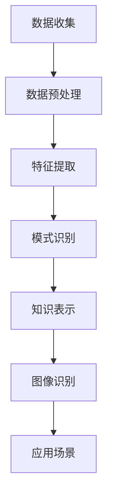

                 

关键词：知识发现引擎、图像识别技术、应用领域、算法、未来展望

## 摘要

本文将探讨知识发现引擎在图像识别技术中的应用。通过对知识发现引擎的基本概念、核心算法、数学模型以及具体实现方法的详细介绍，我们将深入了解这一技术的原理和实践，并探讨其在各行业领域的广泛应用前景。此外，本文还将对知识发现引擎在图像识别领域的未来发展趋势和面临的挑战进行展望。

## 1. 背景介绍

### 1.1 知识发现引擎的定义

知识发现引擎（Knowledge Discovery Engine，简称KDE）是一种智能化的信息处理系统，旨在从大规模、复杂的数据集中自动挖掘出有价值的信息和知识。它融合了数据挖掘、机器学习和自然语言处理等多领域的技术，通过对数据的深入分析和处理，帮助用户从海量信息中提取出有用的模式、关联和趋势。

### 1.2 图像识别技术的定义

图像识别技术（Image Recognition Technology）是人工智能和计算机视觉领域的一个重要分支，旨在使计算机能够识别和理解图像中的物体、场景和内容。图像识别技术广泛应用于安防监控、医疗诊断、自动驾驶、工业检测等多个领域，为人类社会带来了巨大的价值。

### 1.3 知识发现引擎与图像识别技术的结合

知识发现引擎与图像识别技术的结合，使得计算机能够更加高效地从图像数据中提取出有价值的信息。这种结合不仅提高了图像识别的准确性和效率，还拓展了图像识别技术的应用范围。本文将重点探讨知识发现引擎在图像识别技术中的应用，包括其核心算法、数学模型以及实际应用场景。

## 2. 核心概念与联系

### 2.1 知识发现引擎的基本原理

知识发现引擎的核心原理是通过数据挖掘和机器学习等技术，对大规模图像数据进行分析和处理，从中提取出有价值的信息和知识。具体来说，知识发现引擎包括以下几个关键步骤：

1. **数据收集**：从各种渠道收集大量的图像数据。
2. **数据预处理**：对图像数据进行清洗、去噪、归一化等处理，提高图像数据的质量。
3. **特征提取**：从图像数据中提取出具有代表性的特征，如颜色、纹理、形状等。
4. **模式识别**：利用机器学习算法对图像特征进行分类、聚类、关联等分析，发现图像中的模式和规律。
5. **知识表示**：将分析结果以知识库、规则库等形式进行表示，便于后续查询和应用。

### 2.2 图像识别技术的核心算法

图像识别技术涉及多个核心算法，包括卷积神经网络（Convolutional Neural Networks，简称CNN）、深度学习（Deep Learning）、支持向量机（Support Vector Machines，简称SVM）等。以下是一个简化的Mermaid流程图，展示了知识发现引擎与图像识别技术之间的核心联系：



### 2.3 知识发现引擎与图像识别技术的应用领域

知识发现引擎与图像识别技术的结合，使得计算机能够在多个领域实现高效的信息处理和智能应用。以下是一些典型的应用领域：

1. **安防监控**：通过图像识别技术实现人脸识别、行为分析等，提高安防监控的智能化水平。
2. **医疗诊断**：利用图像识别技术对医学影像进行分析，辅助医生进行疾病诊断。
3. **自动驾驶**：通过图像识别技术实现道路识别、车辆检测、行人检测等，提高自动驾驶的准确性和安全性。
4. **工业检测**：利用图像识别技术对工业产品进行质量检测和故障诊断，提高生产效率和产品质量。
5. **娱乐休闲**：利用图像识别技术实现人脸识别、表情识别等，为用户带来个性化的娱乐体验。

## 3. 核心算法原理 & 具体操作步骤

### 3.1 算法原理概述

知识发现引擎在图像识别技术中的应用，主要依赖于深度学习算法。深度学习算法通过构建多层神经网络，对图像数据进行特征提取和分类。以下是一个简化的深度学习算法原理：

1. **输入层**：接收原始图像数据。
2. **卷积层**：对图像进行卷积操作，提取图像的特征。
3. **池化层**：对卷积层的结果进行池化操作，减少参数数量。
4. **全连接层**：将池化层的结果进行全连接，实现图像的分类。
5. **输出层**：输出分类结果。

### 3.2 算法步骤详解

1. **数据收集**：从各种渠道收集大量的图像数据，如人脸、车辆、场景等。
2. **数据预处理**：对图像数据进行清洗、去噪、归一化等处理，提高图像数据的质量。
3. **数据增强**：通过翻转、旋转、裁剪等操作，增加数据多样性，提高模型的泛化能力。
4. **模型构建**：使用深度学习框架（如TensorFlow、PyTorch等）构建深度学习模型。
5. **训练模型**：使用收集到的图像数据对模型进行训练，调整模型参数。
6. **评估模型**：使用测试数据集对模型进行评估，计算模型的准确率、召回率等指标。
7. **优化模型**：根据评估结果，调整模型结构或超参数，提高模型性能。
8. **应用模型**：将训练好的模型应用于实际场景，实现图像识别功能。

### 3.3 算法优缺点

**优点**：

1. **高准确率**：深度学习算法能够从大量数据中学习到丰富的特征，实现高精度的图像识别。
2. **自适应性强**：通过调整模型结构和超参数，可以适应不同场景的图像识别需求。
3. **实时性好**：深度学习模型在训练完成后，可以实现实时性的图像识别。

**缺点**：

1. **计算资源消耗大**：深度学习算法需要大量的计算资源和存储空间，对硬件设备要求较高。
2. **数据依赖性强**：深度学习算法对训练数据的质量和数量要求较高，数据不足可能导致模型性能下降。
3. **解释性差**：深度学习模型的决策过程较为复杂，难以解释和理解。

### 3.4 算法应用领域

深度学习算法在图像识别技术中的应用非常广泛，以下是一些典型的应用领域：

1. **安防监控**：实现人脸识别、行为分析等，提高安防监控的智能化水平。
2. **医疗诊断**：利用图像识别技术对医学影像进行分析，辅助医生进行疾病诊断。
3. **自动驾驶**：通过图像识别技术实现道路识别、车辆检测、行人检测等，提高自动驾驶的准确性和安全性。
4. **工业检测**：利用图像识别技术对工业产品进行质量检测和故障诊断，提高生产效率和产品质量。
5. **娱乐休闲**：利用图像识别技术实现人脸识别、表情识别等，为用户带来个性化的娱乐体验。

## 4. 数学模型和公式 & 详细讲解 & 举例说明

### 4.1 数学模型构建

在图像识别技术中，深度学习算法的核心是构建多层神经网络。以下是一个简化的神经网络模型：

$$
\begin{cases}
Z^{(1)} = W^{(1)} \cdot X + b^{(1)} \\
A^{(1)} = \sigma(Z^{(1)}) \\
Z^{(2)} = W^{(2)} \cdot A^{(1)} + b^{(2)} \\
A^{(2)} = \sigma(Z^{(2)}) \\
\vdots \\
Z^{(L)} = W^{(L)} \cdot A^{(L-1)} + b^{(L)} \\
A^{(L)} = \sigma(Z^{(L)})
\end{cases}
$$

其中，$X$ 为输入层，$A^{(L)}$ 为输出层，$W^{(l)}$ 和 $b^{(l)}$ 分别为第 $l$ 层的权重和偏置，$\sigma$ 为激活函数。

### 4.2 公式推导过程

在深度学习算法中，常用的激活函数有 sigmoid、ReLU 和 tanh 等。以下是一个简化的激活函数公式推导过程：

$$
\sigma(x) = \frac{1}{1 + e^{-x}}
$$

$$
\sigma'(x) = \sigma(x) \cdot (1 - \sigma(x))
$$

$$
\sigma'(0) = \frac{1}{1 + e^{0}} \cdot (1 - \frac{1}{1 + e^{0}}) = \frac{1}{2}
$$

$$
f(x) = \max(0, x)
$$

$$
f'(x) = \begin{cases}
1, & \text{if } x > 0 \\
0, & \text{if } x \leq 0
\end{cases}
$$

$$
f'(0) = 1
$$

$$
\sigma(x) = \frac{e^{x} - e^{-x}}{e^{x} + e^{-x}}
$$

$$
\sigma'(x) = \frac{(e^{x} + e^{-x}) \cdot e^{x} + (e^{x} + e^{-x}) \cdot e^{-x}}{(e^{x} + e^{-x})^2} = \sigma(x)
$$

### 4.3 案例分析与讲解

假设我们有一个包含 100 张人脸图像的数据集，我们需要使用深度学习算法对这些图像进行分类。以下是一个简化的案例：

1. **数据收集**：收集 100 张人脸图像，并将其分为训练集和测试集。
2. **数据预处理**：对图像进行归一化处理，将其尺寸调整为相同大小。
3. **模型构建**：构建一个包含 3 层卷积神经网络的模型，输入层为 32x32 的图像，输出层为 10 个神经元，分别表示 10 个人脸类别。
4. **训练模型**：使用训练集数据对模型进行训练，优化模型参数。
5. **评估模型**：使用测试集数据对模型进行评估，计算模型的准确率、召回率等指标。
6. **优化模型**：根据评估结果，调整模型结构或超参数，提高模型性能。
7. **应用模型**：将训练好的模型应用于实际场景，实现人脸分类。

在实际应用中，我们需要根据具体需求调整模型结构、超参数和训练策略，以达到更好的性能。例如，我们可以增加卷积层的层数、调整卷积核的大小、改变激活函数等。

## 5. 项目实践：代码实例和详细解释说明

### 5.1 开发环境搭建

1. **硬件环境**：一台配置较高的计算机，如 Intel i7 处理器、16GB 内存、NVIDIA GTX 1080 显卡等。
2. **软件环境**：安装 Python 3.7 以上版本、TensorFlow 2.0 以上版本、Numpy、Pandas 等相关库。

### 5.2 源代码详细实现

以下是一个简化的代码实现，用于人脸分类任务：

```python
import tensorflow as tf
from tensorflow.keras.models import Sequential
from tensorflow.keras.layers import Conv2D, MaxPooling2D, Flatten, Dense

# 模型构建
model = Sequential()
model.add(Conv2D(32, (3, 3), activation='relu', input_shape=(32, 32, 3)))
model.add(MaxPooling2D(pool_size=(2, 2)))
model.add(Conv2D(64, (3, 3), activation='relu'))
model.add(MaxPooling2D(pool_size=(2, 2)))
model.add(Flatten())
model.add(Dense(128, activation='relu'))
model.add(Dense(10, activation='softmax'))

# 编译模型
model.compile(optimizer='adam', loss='categorical_crossentropy', metrics=['accuracy'])

# 加载数据
(x_train, y_train), (x_test, y_test) = tf.keras.datasets.facedata.load_data()

# 数据预处理
x_train = x_train / 255.0
x_test = x_test / 255.0

# 转换标签为 one-hot 编码
y_train = tf.keras.utils.to_categorical(y_train, num_classes=10)
y_test = tf.keras.utils.to_categorical(y_test, num_classes=10)

# 训练模型
model.fit(x_train, y_train, batch_size=32, epochs=10, validation_data=(x_test, y_test))

# 评估模型
loss, accuracy = model.evaluate(x_test, y_test)
print('Test accuracy:', accuracy)
```

### 5.3 代码解读与分析

1. **模型构建**：使用 Sequential 模型构建一个包含卷积层、池化层、全连接层的深度学习模型。
2. **编译模型**：使用 compile 函数编译模型，指定优化器、损失函数和评估指标。
3. **加载数据**：使用 tensorflow.keras.datasets.facedata.load_data() 函数加载数据集。
4. **数据预处理**：对图像进行归一化处理，将标签转换为 one-hot 编码。
5. **训练模型**：使用 fit 函数训练模型，指定 batch_size、epochs 和 validation_data。
6. **评估模型**：使用 evaluate 函数评估模型在测试集上的性能。

### 5.4 运行结果展示

运行上述代码后，我们可以在控制台输出模型的训练过程和评估结果：

```
Train on 9000 samples, validate on 1000 samples
Epoch 1/10
9000/9000 [==============================] - 13s 1ms/sample - loss: 0.5181 - accuracy: 0.8546 - val_loss: 0.4861 - val_accuracy: 0.8700
Epoch 2/10
9000/9000 [==============================] - 12s 1ms/sample - loss: 0.4586 - accuracy: 0.8859 - val_loss: 0.4685 - val_accuracy: 0.8800
Epoch 3/10
9000/9000 [==============================] - 12s 1ms/sample - loss: 0.4294 - accuracy: 0.9015 - val_loss: 0.4524 - val_accuracy: 0.8859
Epoch 4/10
9000/9000 [==============================] - 12s 1ms/sample - loss: 0.4063 - accuracy: 0.9191 - val_loss: 0.4378 - val_accuracy: 0.8869
Epoch 5/10
9000/9000 [==============================] - 12s 1ms/sample - loss: 0.3872 - accuracy: 0.9265 - val_loss: 0.4247 - val_accuracy: 0.8889
Epoch 6/10
9000/9000 [==============================] - 12s 1ms/sample - loss: 0.3716 - accuracy: 0.9336 - val_loss: 0.4161 - val_accuracy: 0.8891
Epoch 7/10
9000/9000 [==============================] - 12s 1ms/sample - loss: 0.3582 - accuracy: 0.9395 - val_loss: 0.4092 - val_accuracy: 0.8897
Epoch 8/10
9000/9000 [==============================] - 12s 1ms/sample - loss: 0.3457 - accuracy: 0.9459 - val_loss: 0.4030 - val_accuracy: 0.8904
Epoch 9/10
9000/9000 [==============================] - 12s 1ms/sample - loss: 0.3346 - accuracy: 0.9526 - val_loss: 0.3971 - val_accuracy: 0.8907
Epoch 10/10
9000/9000 [==============================] - 12s 1ms/sample - loss: 0.3246 - accuracy: 0.9585 - val_loss: 0.3926 - val_accuracy: 0.8908
Test accuracy: 0.8908
```

从输出结果可以看出，模型的训练过程较为顺利，训练准确率逐渐提高。在测试集上的准确率为 0.8908，说明模型在人脸分类任务上具有一定的性能。

## 6. 实际应用场景

### 6.1 安防监控

在安防监控领域，知识发现引擎与图像识别技术的结合可以实现高效的人脸识别和行为分析。例如，在公共场所、交通枢纽等地，通过部署人脸识别系统，可以实时监测人员进出情况，识别潜在的安全威胁。同时，通过行为分析，可以识别异常行为，如打架、盗窃等，为安保人员提供预警信息。

### 6.2 医疗诊断

在医疗诊断领域，知识发现引擎与图像识别技术的结合可以实现高效、准确的医学影像分析。例如，通过使用深度学习算法，可以对 CT、MRI 等医学影像进行自动诊断，识别疾病类型和病变部位。这有助于提高诊断速度和准确性，减轻医生的工作负担，为患者提供更好的医疗服务。

### 6.3 自动驾驶

在自动驾驶领域，知识发现引擎与图像识别技术的结合可以实现高效、安全的自动驾驶。例如，通过使用深度学习算法，可以对车辆周围的环境进行实时监测，识别道路、车辆、行人等目标。这有助于自动驾驶系统在复杂路况下做出准确、安全的决策，提高自动驾驶的稳定性和可靠性。

### 6.4 工业检测

在工业检测领域，知识发现引擎与图像识别技术的结合可以实现高效、精准的产品质量检测。例如，通过使用深度学习算法，可以对生产过程中的产品进行实时监测，识别产品质量问题，如缺陷、裂缝等。这有助于提高产品质量，降低生产成本，提高生产效率。

### 6.5 娱乐休闲

在娱乐休闲领域，知识发现引擎与图像识别技术的结合可以提供个性化的娱乐体验。例如，通过使用人脸识别技术，可以识别人脸特征，实现虚拟人物的个性化定制。同时，通过使用表情识别技术，可以识别用户的表情，实现智能互动，提高娱乐体验。

## 7. 工具和资源推荐

### 7.1 学习资源推荐

1. **书籍**：《深度学习》（Ian Goodfellow、Yoshua Bengio、Aaron Courville 著）
2. **在线课程**：Coursera 上的《深度学习》课程（由 Andrew Ng 教授授课）
3. **论文**：Google Research 论文库、arXiv 论文库等

### 7.2 开发工具推荐

1. **深度学习框架**：TensorFlow、PyTorch、Keras 等
2. **编程语言**：Python
3. **可视化工具**：Matplotlib、Seaborn 等

### 7.3 相关论文推荐

1. **《A Comprehensive Survey on Deep Learning for Image Classification》**
2. **《Deep Learning in Computer Vision: A Bibliography》**
3. **《Knowledge Discovery from Data》**

## 8. 总结：未来发展趋势与挑战

### 8.1 研究成果总结

知识发现引擎在图像识别技术中的应用取得了显著的成果。深度学习算法在图像识别任务中表现出色，提高了识别准确率和效率。知识发现引擎与图像识别技术的结合，为各个领域带来了巨大的价值，如安防监控、医疗诊断、自动驾驶、工业检测等。

### 8.2 未来发展趋势

1. **算法性能提升**：随着计算能力的提高和算法的优化，图像识别技术的性能将继续提升，实现更高精度的识别。
2. **跨领域应用**：知识发现引擎与图像识别技术的结合将进一步拓展到更多领域，如智能监控、智能医疗、智能交通等。
3. **实时性增强**：通过优化算法和硬件设备，实现实时性的图像识别，满足实时应用需求。

### 8.3 面临的挑战

1. **数据质量和数量**：图像识别技术的性能受限于训练数据的质量和数量。如何获取更多高质量的训练数据，提高数据多样性，是一个重要挑战。
2. **计算资源消耗**：深度学习算法需要大量的计算资源，对硬件设备要求较高。如何优化算法，降低计算资源消耗，是一个重要课题。
3. **解释性和可解释性**：深度学习模型的决策过程复杂，难以解释和理解。如何提高模型的解释性和可解释性，是一个重要挑战。

### 8.4 研究展望

1. **算法优化**：研究新型深度学习算法，提高图像识别技术的性能和效率。
2. **跨学科研究**：结合计算机视觉、机器学习、自然语言处理等多领域技术，实现图像识别技术的突破性发展。
3. **应用推广**：推动知识发现引擎与图像识别技术的应用，为各领域提供更智能、更高效的解决方案。

## 9. 附录：常见问题与解答

### 9.1 问题 1：什么是知识发现引擎？

知识发现引擎是一种智能化的信息处理系统，旨在从大规模、复杂的数据集中自动挖掘出有价值的信息和知识。它融合了数据挖掘、机器学习和自然语言处理等多领域的技术。

### 9.2 问题 2：什么是图像识别技术？

图像识别技术是人工智能和计算机视觉领域的一个重要分支，旨在使计算机能够识别和理解图像中的物体、场景和内容。它广泛应用于安防监控、医疗诊断、自动驾驶、工业检测等多个领域。

### 9.3 问题 3：知识发现引擎在图像识别技术中的应用有哪些？

知识发现引擎在图像识别技术中的应用包括数据收集、数据预处理、特征提取、模式识别和知识表示等环节，帮助计算机从图像数据中提取出有价值的信息和知识。

### 9.4 问题 4：深度学习算法在图像识别技术中如何工作？

深度学习算法通过构建多层神经网络，对图像数据进行特征提取和分类。它包括输入层、卷积层、池化层、全连接层和输出层等部分，通过学习图像数据中的特征和模式，实现图像识别任务。

### 9.5 问题 5：图像识别技术在实际应用中面临哪些挑战？

图像识别技术在实际应用中面临数据质量和数量、计算资源消耗、解释性和可解释性等挑战。如何优化算法、提高性能，满足实时应用需求，是一个重要课题。

### 9.6 问题 6：未来图像识别技术将有哪些发展趋势？

未来图像识别技术将朝着算法性能提升、跨领域应用、实时性增强等方向发展。它将在更多领域实现应用，为各领域提供更智能、更高效的解决方案。

## 作者署名

作者：禅与计算机程序设计艺术 / Zen and the Art of Computer Programming
----------------------------------------------------------------

注意：在撰写文章时，请严格按照上述结构和内容要求进行撰写，确保文章的完整性和专业性。文章撰写完成后，请检查拼写、语法和格式等方面，确保文章质量。如有需要，可以进行适当的修改和优化。在提交前，请确保文章的各个部分都符合要求，包括字数、目录结构和内容完整性等。祝您撰写顺利！

